# Linux Shell编程：P46：bash shell补充-46

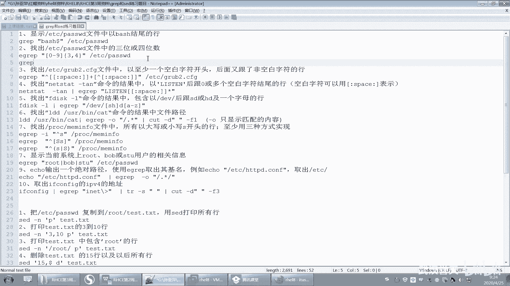

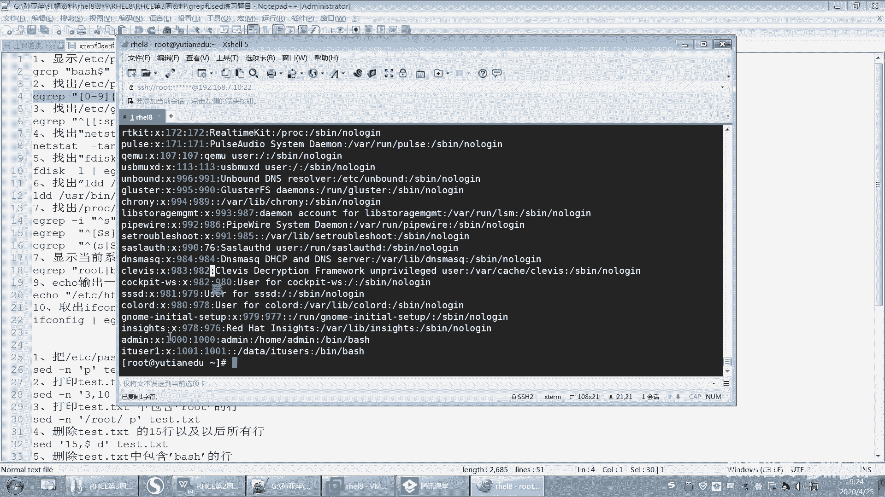

## 概述 📚
在本节课中，我们将深入学习bash shell的进阶知识，重点回顾正则表达式、sed命令的复杂应用，并继续探讨shell变量的细节，包括引号和反斜杠的用法。课程内容旨在巩固基础，提升文本处理和脚本编写能力。

---

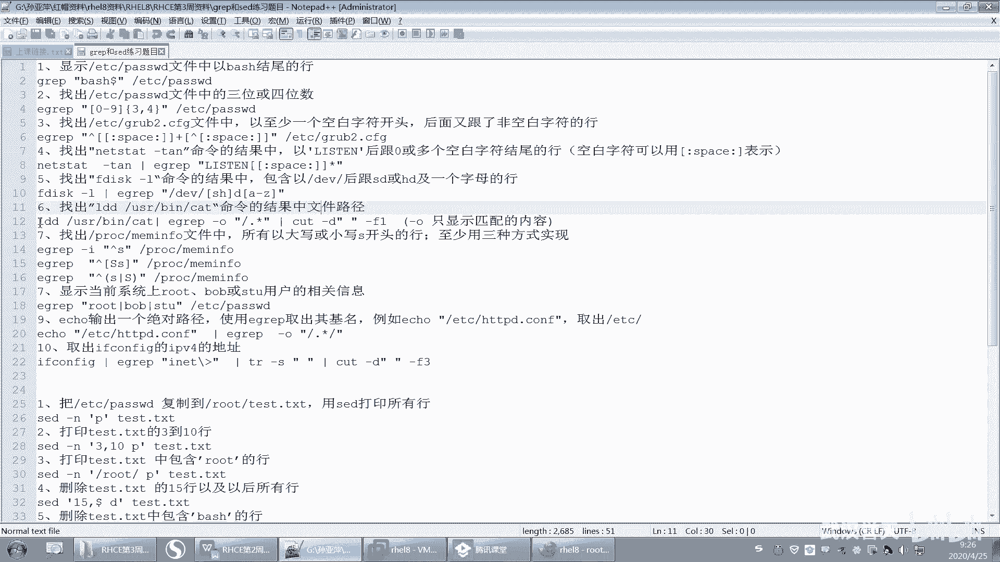

## 正则表达式回顾与练习解析 🔍
上一节我们介绍了正则表达式的基础概念，本节中我们来看看一些具体的练习题及其解析，以加深理解。

### 练习题解析
以下是部分正则表达式练习题的解答思路：

1.  **匹配三到四位数字**：使用扩展正则表达式 `\b[0-9]{3,4}\b`。这里使用 `egrep` 命令，因为花括号 `{}` 在扩展正则中表示次数。若使用 `grep` 命令，需添加 `-E` 选项。
    *   **公式/代码**：`egrep '\b[0-9]{3,4}\b' filename`

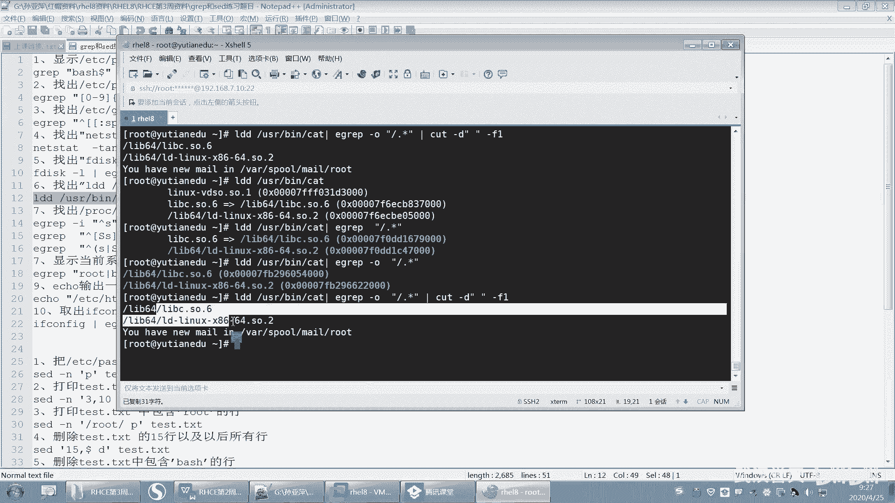

2.  **匹配以空白字符开头的非空行**：目标是找到以至少一个空白字符（空格、制表符等）开头，且后面跟随非空白字符的行，以此排除空行。
    *   **公式/代码**：`grep '^[[:space:]]\+[^[:space:]]' filename`
    *   解释：`^` 表示行首。`[[:space:]]\+` 匹配一个或多个空白字符。`[^[:space:]]` 匹配一个非空白字符。

3.  **匹配特定格式的字符串**：例如，匹配以 `s` 或 `h` 开头，后跟 `a` 到 `z` 字母的字符串。
    *   **公式/代码**：`grep '^[sh][a-z]' filename`

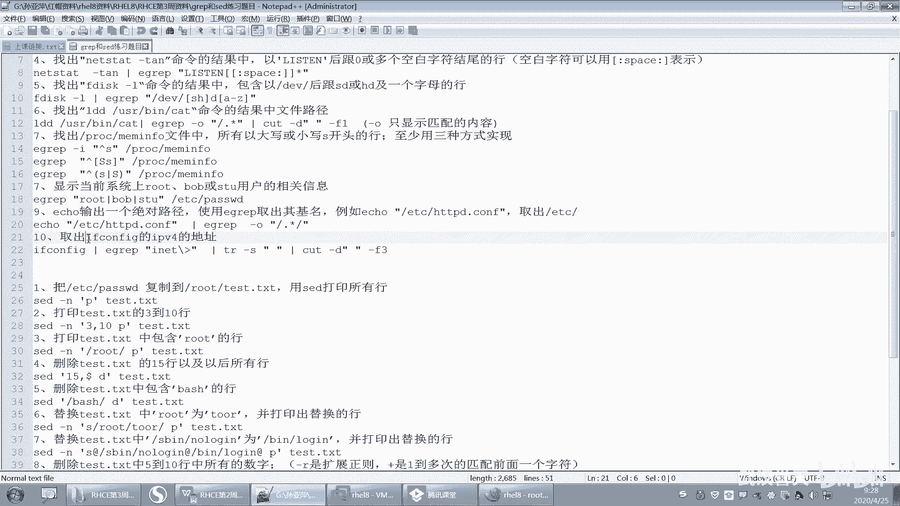

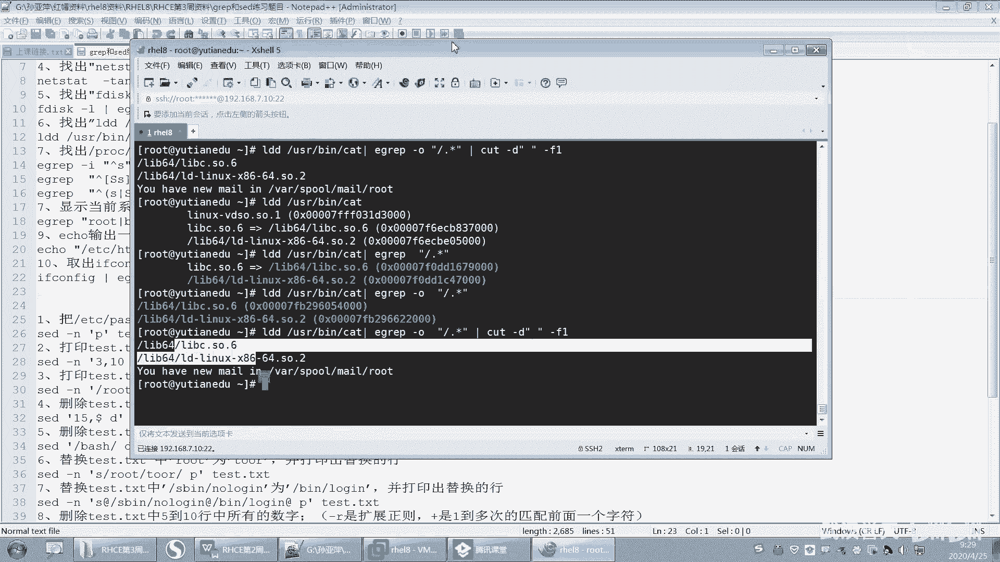

4.  **从命令输出中提取路径**：例如，从 `ls -l /usr` 命令的结果中提取出文件的绝对路径。
    *   **思路**：使用 `grep -o` 选项只输出匹配到的部分。可以编写匹配以 `/` 开头的字符串的正则表达式。
    *   **公式/代码**：`ls -l /usr | grep -o '/.*'`

5.  **匹配以大小写 S 开头的行**：至少有三种实现方式。
    *   **公式/代码**：
        *   `grep '^[Ss]' filename`
        *   `grep -i '^s' filename` （`-i` 忽略大小写）
        *   `egrep '^(S|s)' filename` （扩展正则）

6.  **从绝对路径中提取目录名**：例如，从 `/etc/passwd` 中提取 `etc`。
    *   **公式/代码**：`echo "/etc/passwd" | grep -o '^/[^/]*' | cut -d'/' -f2`

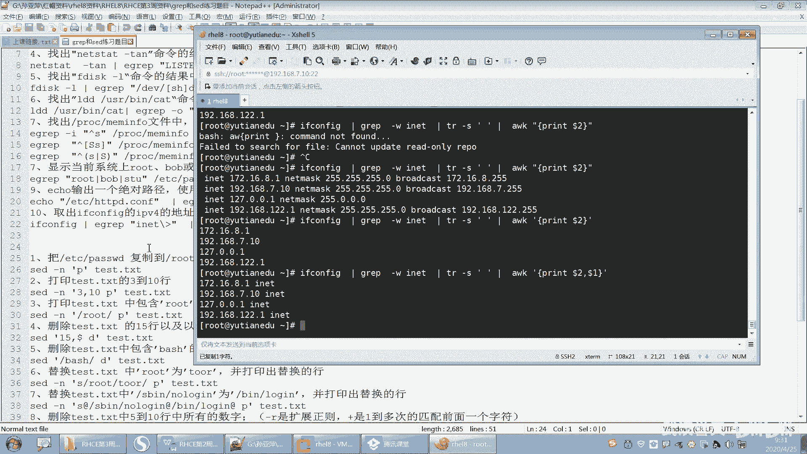

7.  **提取 IPv4 地址**：从 `ifconfig` 命令输出中提取 IPv4 地址。
    *   **思路**：先定位到包含 `inet` 的行，然后过滤掉 IPv6 地址（`inet6`），最后提取 IP 地址字段。可以使用 `tr`、`cut` 或 `awk` 命令。
    *   **公式/代码**：
        *   `ifconfig | grep 'inet ' | awk '{print $2}'`
        *   `ifconfig | grep 'inet ' | tr -s ' ' | cut -d' ' -f3`

---

## Sed 命令高级应用 🛠️
在掌握了 sed 的基本操作后，本节我们来处理一些更复杂的文本替换和删除任务。

以下是 sed 命令的练习题解析：

1.  **打印特定行**：例如，打印第3到第10行。
    *   **公式/代码**：`sed -n '3,10p' filename`

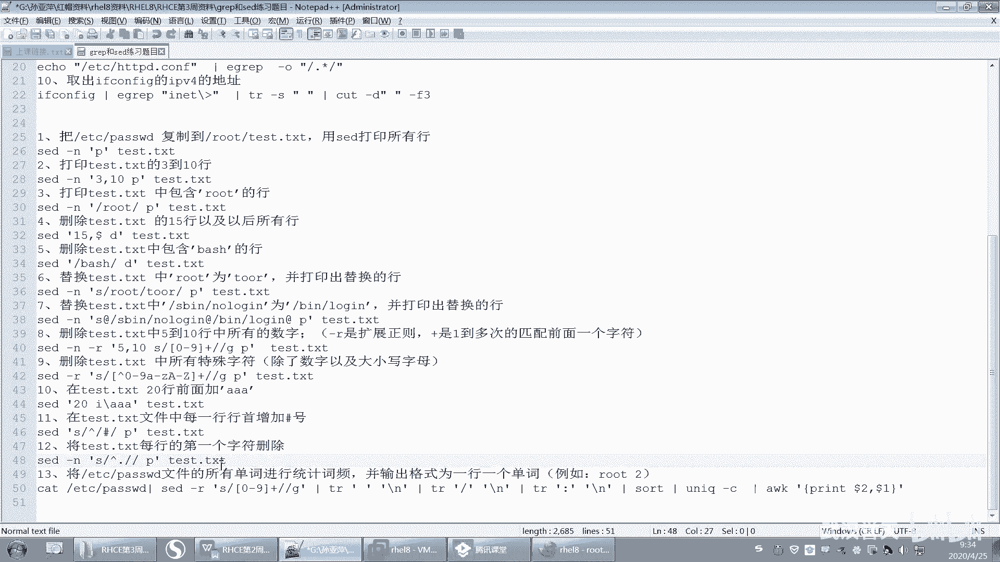

2.  **删除特定范围的行**：例如，删除第15行到文件末尾。
    *   **公式/代码**：`sed '15,$d' filename`

3.  **替换文本并打印**：将每行中首次出现的 `root` 替换为 `toor`，并打印发生替换的行。
    *   **公式/代码**：`sed -n 's/root/toor/p' filename`

4.  **处理包含分隔符的替换**：当替换模式中包含 `/` 时，可以使用其他字符（如 `@`、`#`）作为分隔符，或者对 `/` 进行转义。
    *   **公式/代码**：
        *   `sed 's@/old/path@/new/path@' filename`
        *   `sed 's/\/old\/path/\/new\/path/' filename`

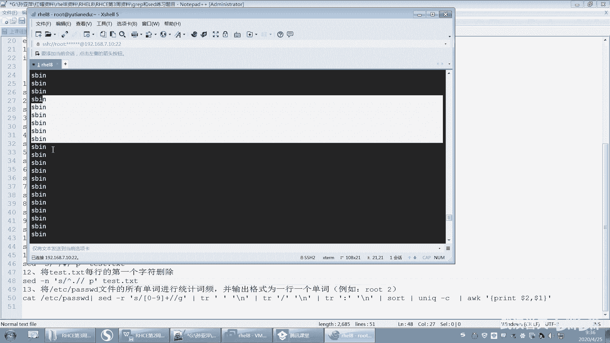

5.  **删除指定行中的数字**：删除文件第5到第10行中的所有数字序列。
    *   **公式/代码**：`sed -r '5,10s/[0-9]+//g' filename` （`-r` 启用扩展正则）

6.  **删除所有特殊字符**：只保留字母和数字，删除其他所有字符。
    *   **思路**：将非字母数字的字符替换为空。注意 `+` 是扩展正则元字符。
    *   **公式/代码**：`sed -r 's/[^[:alnum:]]+//g' filename`

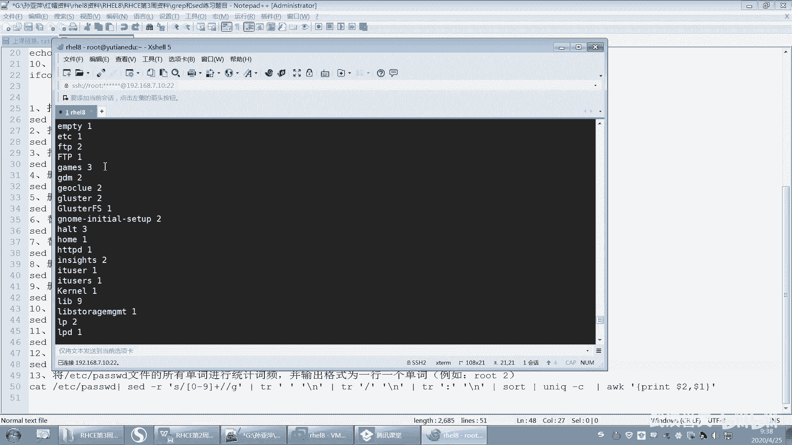

7.  **在指定行插入内容**：在第20行之前插入一行内容 `AA`。
    *   **公式/代码**：`sed '20i\AA' filename`

8.  **在行首添加字符**：在每行的行首添加 `#` 字符。
    *   **公式/代码**：`sed 's/^/#/' filename`

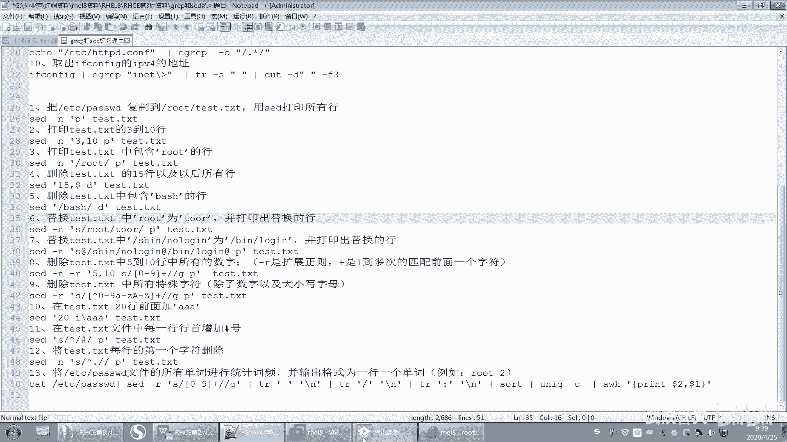

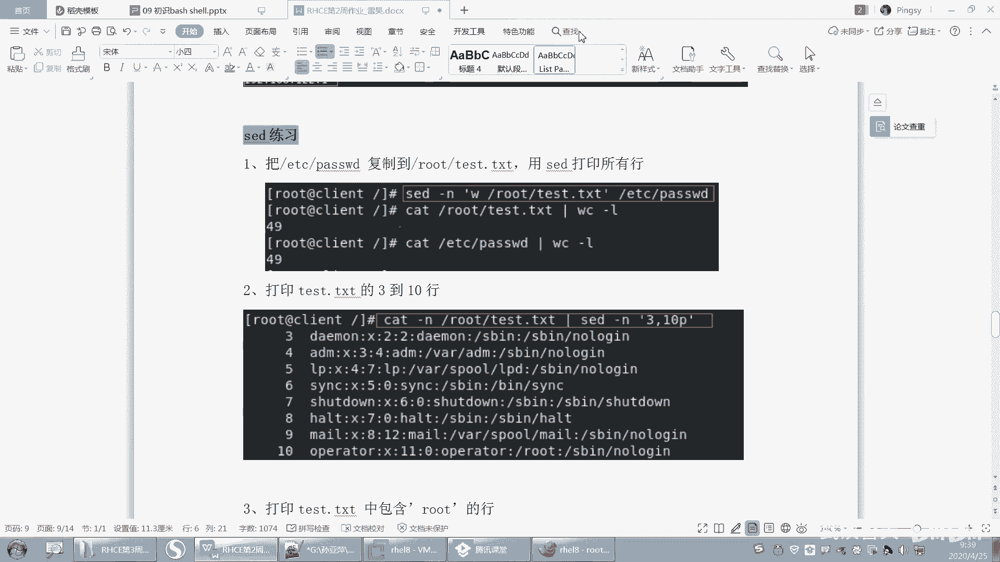

9.  **删除每行的第一个字符**。
    *   **公式/代码**：`sed 's/^.//' filename`

10. **统计文件中的单词频率**：例如，统计 `/etc/passwd` 中所有“单词”的出现频率，并按“单词 次数”格式输出。
    *   **思路**：
        1.  使用 `sed` 将非字母字符（如 `:`、`/`、数字）替换为换行符，将文件内容“打散”成每行一个单词。
        2.  使用 `sort` 对单词进行排序，使相同单词相邻。
        3.  使用 `uniq -c` 统计相邻重复行的次数。
        4.  使用 `awk` 调整输出格式，将“次数 单词”改为“单词 次数”。
    *   **公式/代码**：
        ```bash
        sed -r 's/[0-9:/\]+/\n/g' /etc/passwd | sort | uniq -c | awk '{print $2, $1}'
        ```

---

## Shell 变量深度解析 💡
现在，让我们回到 shell 编程的核心概念之一——变量。我们将回顾已学知识，并引入引号和反斜杠的使用。

### Shell 与 Bash 回顾
*   **Shell**：是用户与操作系统内核之间的命令解释器，是沟通的桥梁。
*   **Bash**：是 `Bourne-Again Shell` 的缩写，是 Linux 系统中最常用、功能最丰富的 Shell 之一。

### 通配符 vs. 正则表达式
这是一个关键区别：
*   **通配符**：主要用于匹配**文件名**（如 `*.txt`），是 Shell（特别是 Bash）的功能。
*   **正则表达式**：主要用于匹配**文本内容**（如 `grep`, `sed`, `awk`），在多种编程语言和工具中通用。

### 变量类型回顾
我们学习了两种主要变量：
1.  **本地变量**：仅在当前 Shell 进程中有效。
    *   定义：`VAR_NAME=value`
    *   查看：`set` 命令
2.  **环境变量**：在当前 Shell 及其所有子 Shell 中有效。
    *   定义：`export VAR_NAME=value` 或先定义再 `export VAR_NAME`
    *   查看：`env` 或 `printenv` 命令
*   **取消变量**：使用 `unset VAR_NAME` 命令，对本地变量和环境变量均有效。

### 变量引用与引号
引用变量有两种主要方式：`$VAR_NAME` 和 `${VAR_NAME}`。
*   **`${VAR_NAME}` 的优势**：当变量名后需要紧跟其他字符串时，可以清晰界定变量名的范围，避免混淆。
    *   **示例**：
        ```bash
        prefix="file"
        echo ${prefix}_backup.txt # 输出：file_backup.txt
        # 如果使用 $prefix_backup.txt，Shell 会尝试寻找名为 `prefix_backup` 的变量。
        ```

### 引号与反斜杠
本节新引入的内容是关于如何屏蔽字符的特殊含义。

1.  **反斜杠 `\`**：转义紧随其后的单个字符，使其失去特殊含义，变为普通字符。
    *   **示例**：在命令行中，空格是参数分隔符。如果想将包含空格的文件名作为一个参数传递，需要对空格进行转义。
        ```bash
        cp my\ file.txt /destination/ # 将名为“my file.txt”的文件复制
        ```

2.  **单引号 `'` 和双引号 `"`**：
    *   **单引号 `'`**：强引用。引号内的所有字符都视为普通字符，变量和命令替换都不会发生。
        ```bash
        echo '$HOME' # 输出：$HOME
        ```
    *   **双引号 `"`**：弱引用。引号内大部分字符是普通的，但**变量替换**（`$VAR`）和**命令替换**（`` `command` `` 或 `$(command)`）会正常进行。
        ```bash
        echo "$HOME" # 输出：/home/username
        echo "Today is $(date)" # 输出：Today is [当前日期时间]
        ```

**使用场景总结**：
*   需要原样输出字符串时，用**单引号**。
*   需要在字符串中嵌入变量或命令结果时，用**双引号**。
*   只需转义个别字符时，用**反斜杠**。

---

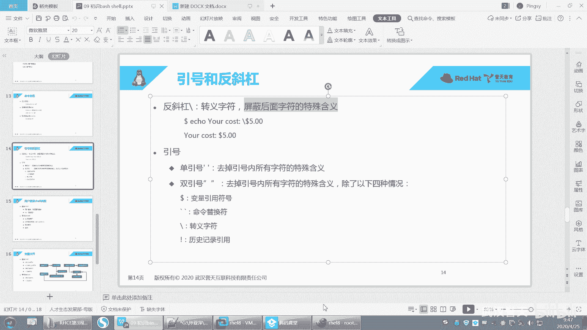

## 总结 🎯
本节课中我们一起学习了：
1.  通过解析练习题，巩固了复杂正则表达式的编写和 `grep`、`sed` 命令的联合应用。
2.  深入探讨了 `sed` 命令在文本替换、删除、插入以及复杂文本流处理（如词频统计）中的高级技巧。
3.  回顾了 Shell 变量的核心概念，明确了本地变量与环境变量的区别与用途。
4.  引入了引号（单引号、双引号）和反斜杠在屏蔽字符特殊含义时的关键作用，这是编写健壮 Shell 脚本的基础。

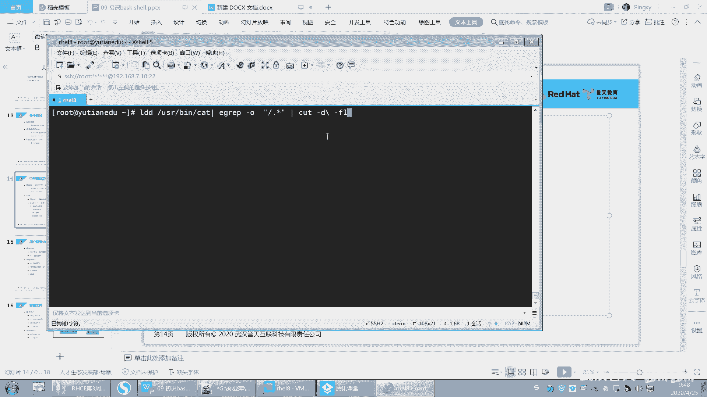

理解并熟练运用这些知识，将极大地提升你在 Linux 环境下进行自动化文本处理和脚本编程的能力。