# Linux系统安装与分区：04：理解Linux文件系统与分区

在本节课中，我们将要学习Linux文件系统的基本结构、分区与挂载的概念，以及如何为系统安装规划分区。这是安装Linux系统前必须理解的核心知识。

## 概述：Linux的目录树与存储基础

Linux系统采用一种独特的“单根倒树状”结构来组织所有文件和目录。这与Windows系统使用盘符（如C:、D:）的方式完全不同。理解这种结构是理解分区和挂载的基础。

## 目录树与路径

Linux的所有文件和目录都从一个唯一的起点开始，这个起点称为“根目录”，用单个斜杠 `/` 表示。

从根目录开始，可以延伸出许多子目录，例如 `/home`、`/boot`、`/etc` 等。这些目录下还可以有更深层的子目录，例如 `/home/data`。

路径的写法从根目录开始，例如 `/home/data`。在这个路径中：
*   第一个 `/` 代表**根目录**。
*   后面的 `/` 是**分隔符**，用于区分父目录和子目录（例如 `/home` 是父目录，`data` 是子目录）。

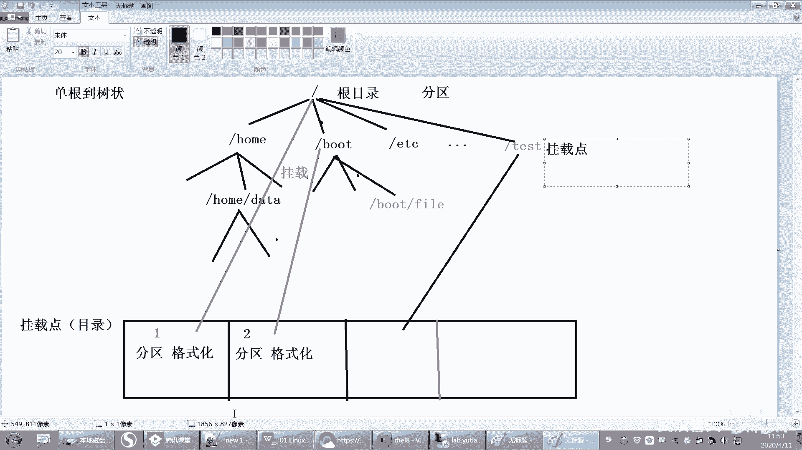

## 分区、格式化与挂载点

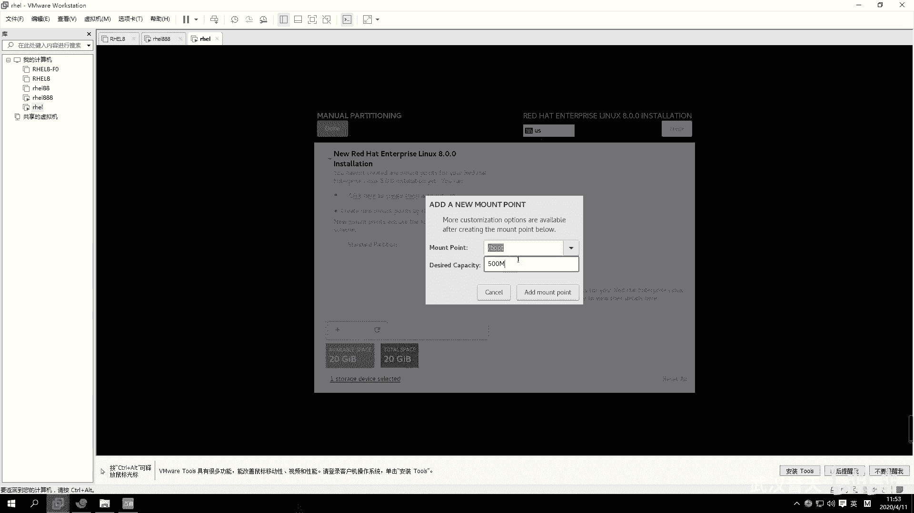

上一节我们介绍了Linux的目录结构，本节中我们来看看数据实际存放在哪里。根目录 `/` 及其下的所有内容，最终都需要存储在物理的硬盘分区上。

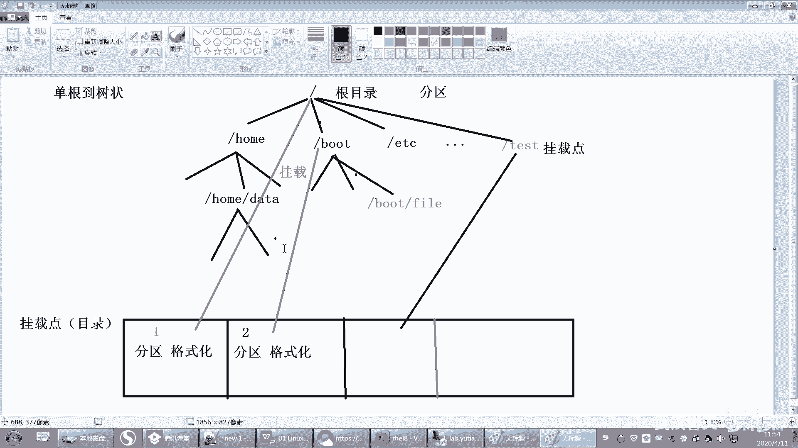

这个过程通常分为两步：
1.  **分区**：在硬盘上划分出独立的存储区域。
2.  **格式化**：为分区创建文件系统（如ext4、XFS），使其能够存储文件。

分区完成后，我们如何访问它呢？
*   在Windows中，我们通过**盘符**（如C:）来访问分区。
*   在Linux中，我们通过**挂载点**来访问分区。**挂载点本质上就是一个目录**。

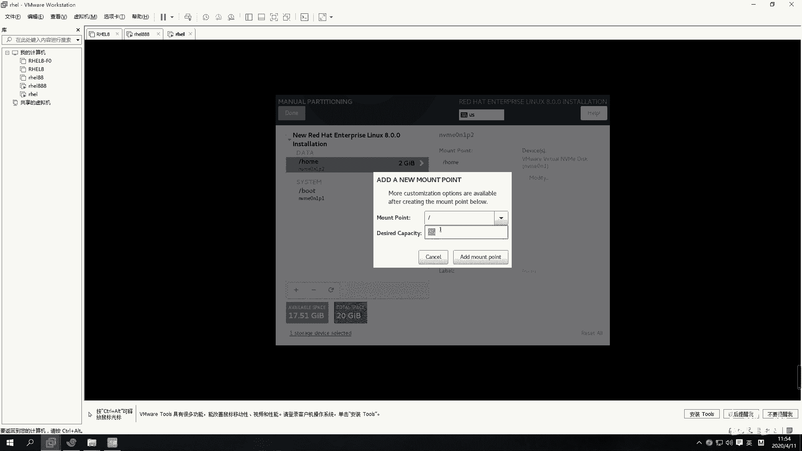

**挂载** 就是将某个分区与一个目录“对接”起来的过程。对接后，向该目录存入的文件，实际上就存储在了对应的分区上。

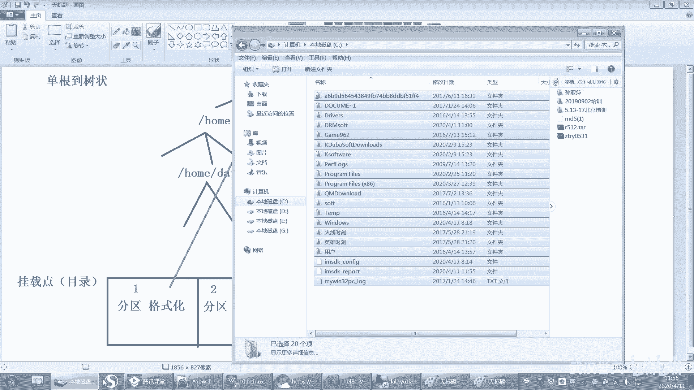

## 核心概念详解

### 根分区（`/`）

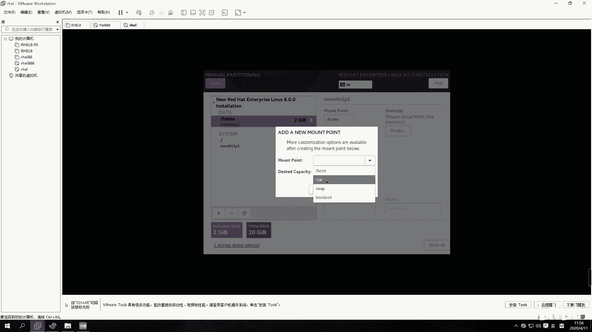

根目录 `/` 必须有一个分区与之挂载，因为所有文件默认都存放在根目录下。这个分区称为根分区。

例如，我们将第一个分区挂载到 `/`。那么，`/home`、`/boot`、`/etc` 等目录下的所有文件，默认都会存储在这个根分区上。

### 其他分区（如 `/boot`, `/home`）

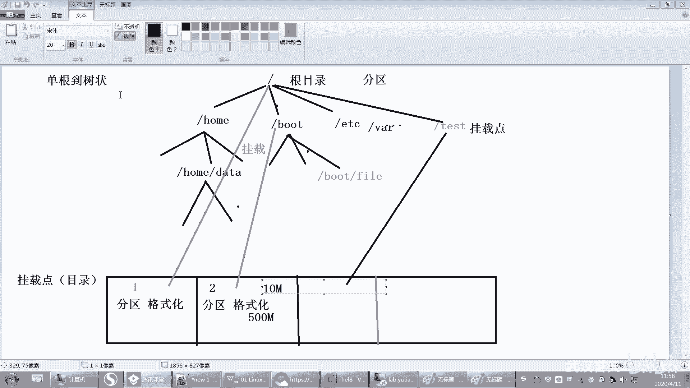

我们可以为其他目录单独创建分区。例如：
*   创建一个分区，并将其挂载到 `/boot` 目录。之后，所有存入 `/boot` 目录的文件（如 `/boot/vmlinuz`）将实际存储在这个独立的分区上。
*   创建一个分区，挂载到 `/home` 目录，用户的家目录文件就会存储在此。

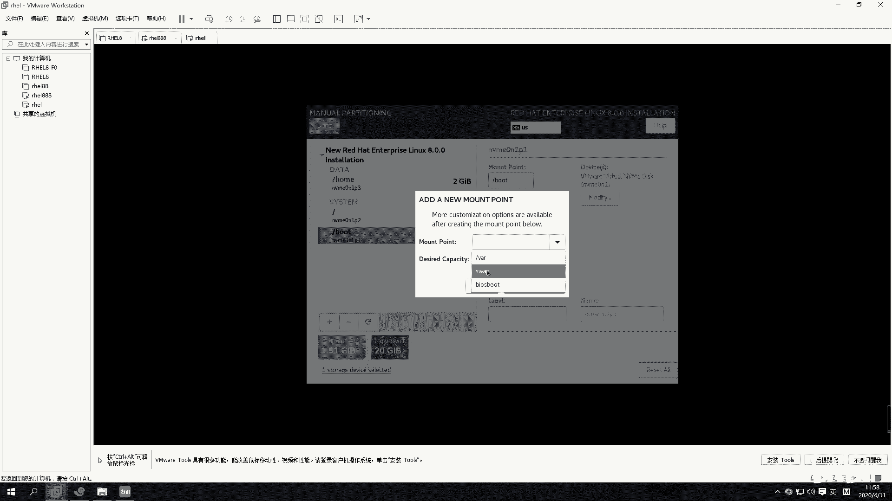

**关键点**：用作挂载点的目录必须事先存在。如果目录不存在，可以手动创建（例如 `mkdir /test`），然后再将分区挂载上去。

当一个目录被用于挂载分区后，它就被称为 **挂载点**。

### 分区规划示例

在系统安装界面进行手动分区时，我们需要指定挂载点和分区大小。

以下是分区配置示例：
1.  **`/boot` 分区**：用于存放系统启动所需的文件。通常分配 **500MB** 即可。
    *   **命令/配置示例**：`挂载点：/boot, 大小：500MB`
2.  **`/home` 分区**：用于存放用户个人数据和文件。可以根据需要分配，例如 **2GB**。
    *   **命令/配置示例**：`挂载点：/home, 大小：2GB`
3.  **`/` 根分区**：这是最重要的分区，必须分配足够空间。建议至少 **10-20GB**。如果只分一个分区，那么所有空间都应分配给 `/`。
    *   **命令/配置示例**：`挂载点：/, 大小：20GB`

**重要提醒**：传统分区一旦创建，其大小是固定的，不易扩展。因此规划时需预留足够空间，尤其是根分区。空间不足可能导致系统无法安装或运行。

### 交换分区（swap）

除了上述挂载点类型的分区，还有一个特殊的分区类型：**交换分区（swap）**。它没有挂载点。

**作用**：交换分区相当于系统的“虚拟内存”。当物理内存（RAM）不足时，系统会将内存中暂时不活跃的数据移动到交换分区中，从而为当前急需内存的程序腾出空间。当需要访问那些被移出的数据时，再将其从交换分区读回内存。

**类比**：你正在电脑上用文档软件写作业（数据在内存），此时想打开一个大型游戏。如果内存不足，系统可能会将暂时不用的文档软件部分数据“暂存”到交换分区，以释放内存给游戏使用。当你切换回文档软件时，数据再被读回。

**注意**：交换分区并不直接提升性能（因为硬盘速度远慢于内存），它主要防止因内存耗尽导致系统崩溃。对于初学者，在虚拟机安装练习时，可以不单独创建交换分区。

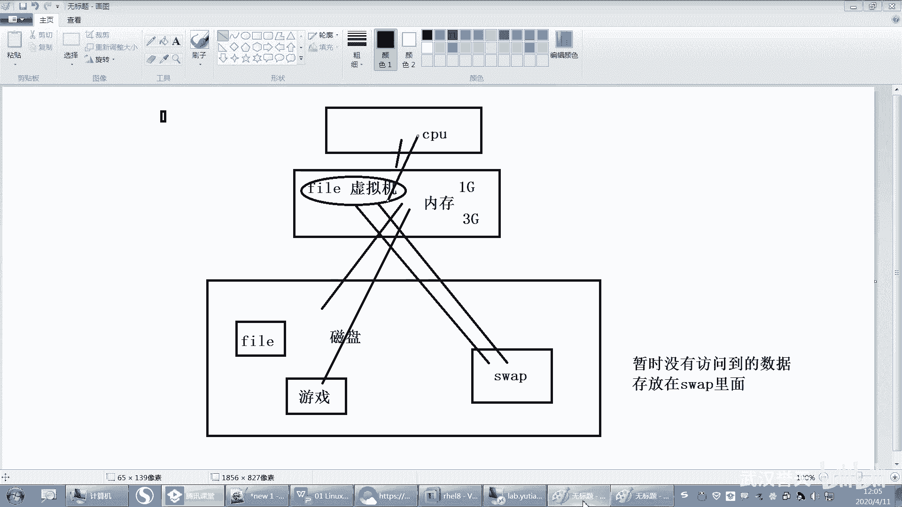

## 总结

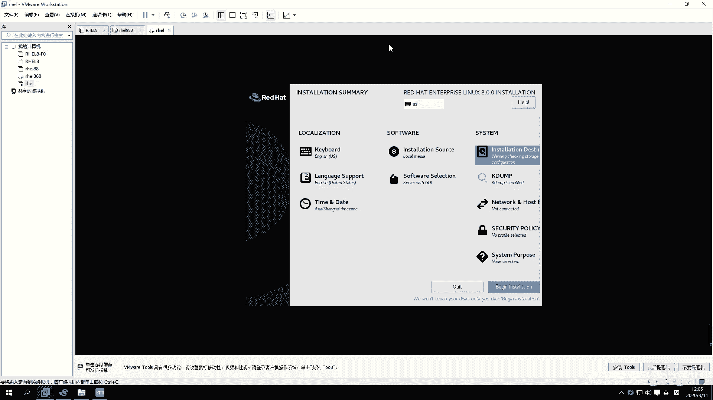

本节课中我们一起学习了Linux文件系统与分区的核心知识：
1.  Linux使用**单根倒树状**目录结构，所有路径从根目录 `/` 开始。
2.  硬盘需先**分区**、**格式化**，才能存储文件。
3.  Linux通过**挂载点**（一个目录）来访问分区，这个过程称为**挂载**。
4.  **根分区（`/`）** 是必须的，且应分配充足空间。
5.  可以为 `/boot`、`/home` 等目录创建独立分区，以隔离数据或满足特定空间需求。
6.  **交换分区（swap）** 用于扩展虚拟内存，应对物理内存不足的情况。

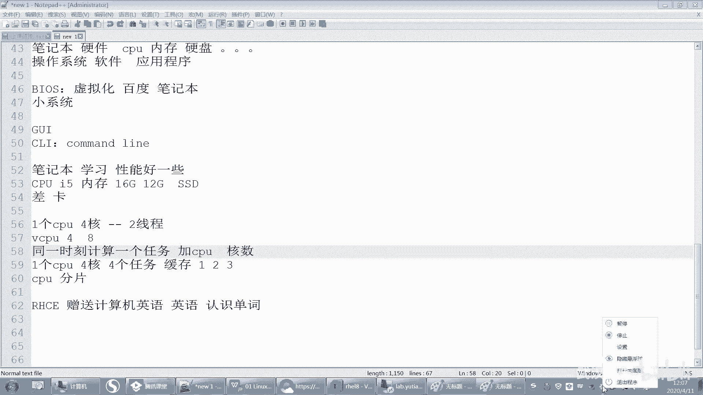

理解这些概念，将帮助你更好地规划磁盘空间，完成Linux系统的安装。