# Linux系统安装与配置：05：安装后配置与首次登录 🖥️

在本节课中，我们将学习完成Linux系统安装后的关键配置步骤，包括Kdump、网络、安全策略的设置，以及首次登录系统的流程和注意事项。

上一节我们完成了磁盘分区，本节中我们来看看安装过程中的其他配置选项。

## Kdump内核备份机制 🔧

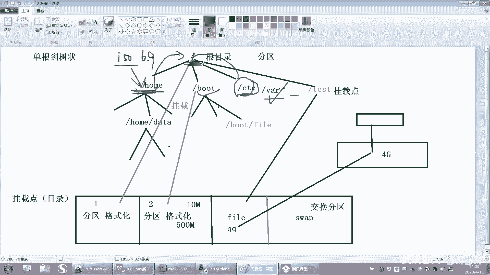

Kdump是Kernel Dump的缩写，即内核转储机制。这是一个内核备份机制，用于在系统内核崩溃时，将内存中的数据保存下来，以便后续分析崩溃原因。

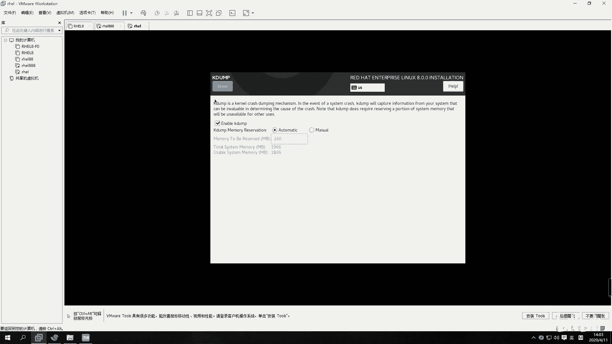

其工作原理是预留一部分内存空间（默认为160MB），当内核崩溃时，将内存数据转储为一个文件。这个功能类似于飞机的“黑匣子”。

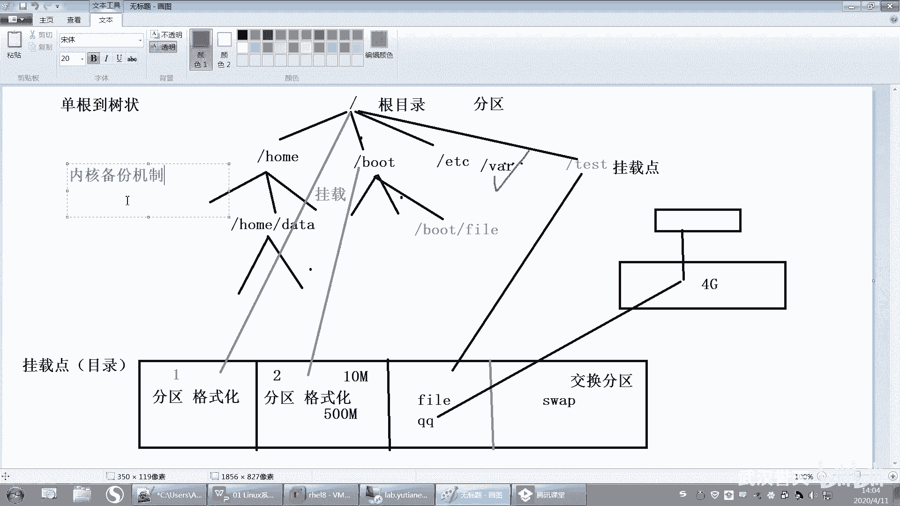

以下是相关配置说明：
*   **启用/禁用**：在安装界面可以勾选或取消“Enable kdump”来启用或禁用此功能。
*   **内存预留**：可以手动修改预留内存的大小。对于实验环境，如果内存紧张，可以将其关闭以节省资源。

## 网络与主机名设置 🌐

在“NETWORK & HOST NAME”部分，可以进行初始的网络和主机名配置。

以下是可配置项：
*   **主机名**：可以在此处修改系统的主机名，例如改为`server01`。此步骤在安装阶段非必需，可以后续修改。
*   **网络配置**：可以在此处配置网络连接，对于实验环境，通常可以保持默认，留待系统安装完成后详细配置。

## 安全策略与系统用途 ⚙️

接下来是“SECURITY POLICY”和“SYSTEM PURPOSE”选项。

关于安全策略：
*   **策略选择**：系统提供了针对不同行业（如支付卡行业、政府行业）的安全基线模板。
*   **默认设置**：如果未选择任何策略，系统将使用Linux默认的安全标准。对于初学者和学习环境，建议保持“No profile selected”状态。

关于系统用途：
*   **角色标记**：此选项用于标记系统未来的用途（如服务器、工作站等）。
*   **实际影响**：此标记仅为标识作用，不改变系统的实际功能，因此通常选择“Not specified”即可。

完成以上所有配置检查并确保无误后，即可点击“Begin Installation”开始安装。

## 安装过程中的用户配置 👤

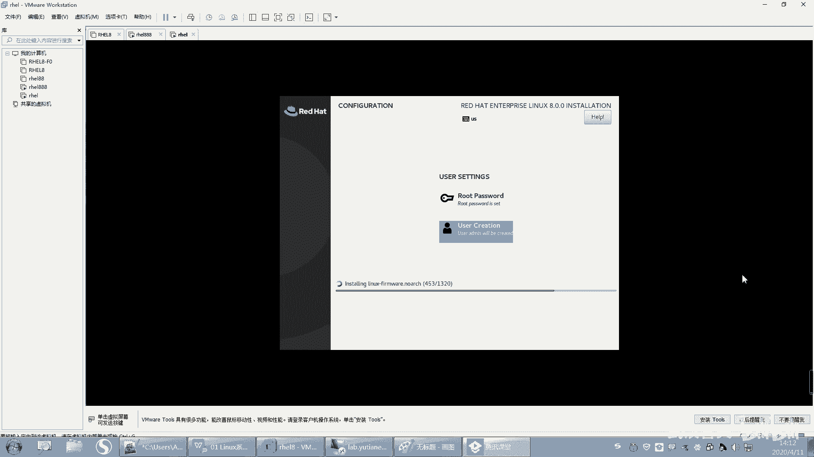

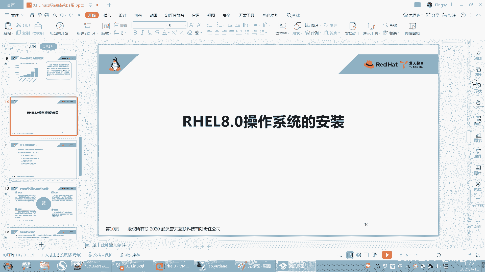

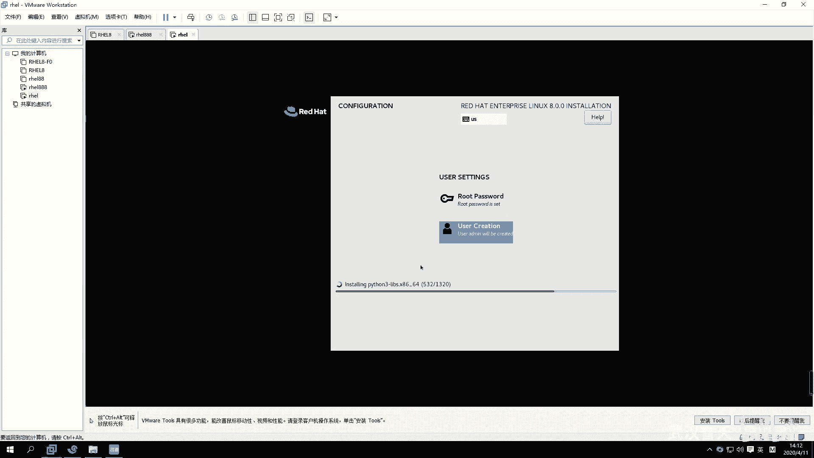

安装开始后，需要设置用户密码。

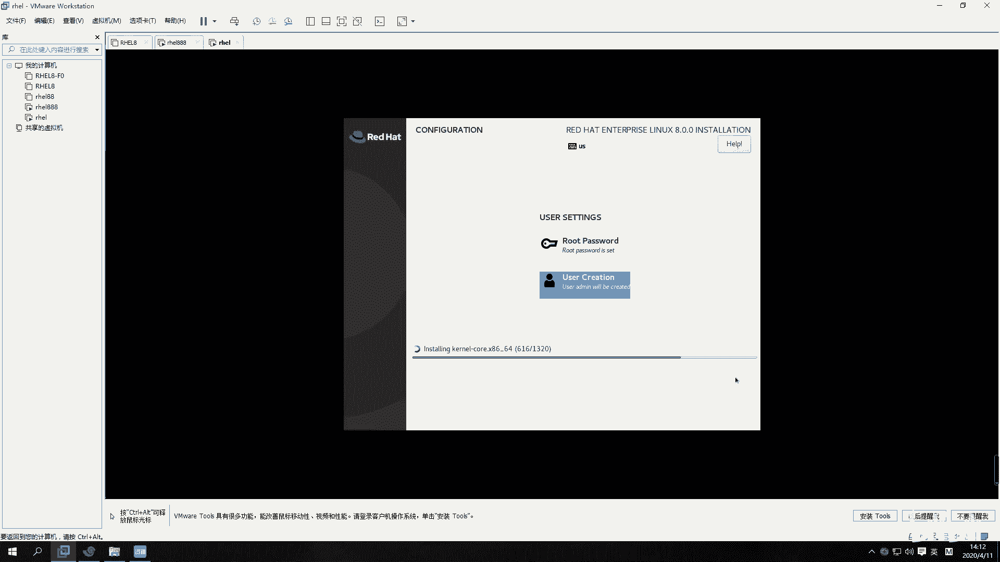

以下是必须完成的步骤：
1.  **设置root密码**：点击“ROOT PASSWORD”，为管理员账户root设置密码。需要输入两次进行确认。请务必牢记此密码，如果遗忘，通常只能通过重装系统解决。
2.  **创建普通用户**：点击“USER CREATION”，创建一个普通用户（例如`admin`），并为其设置密码。图形界面环境建议创建普通用户，以养成良好的安全习惯。

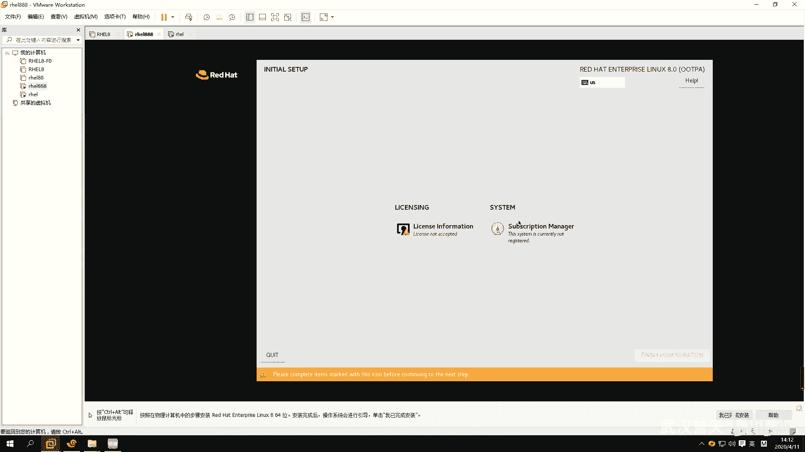

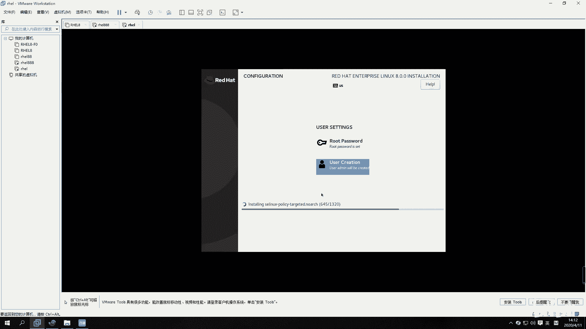

安装程序会显示正在安装的软件包进度。例如，带有图形界面（GUI）的安装大约需要安装1300多个软件包。

## 首次启动与登录 🚀

安装完成后，点击“Reboot”重启系统。首次启动会经历几个步骤。

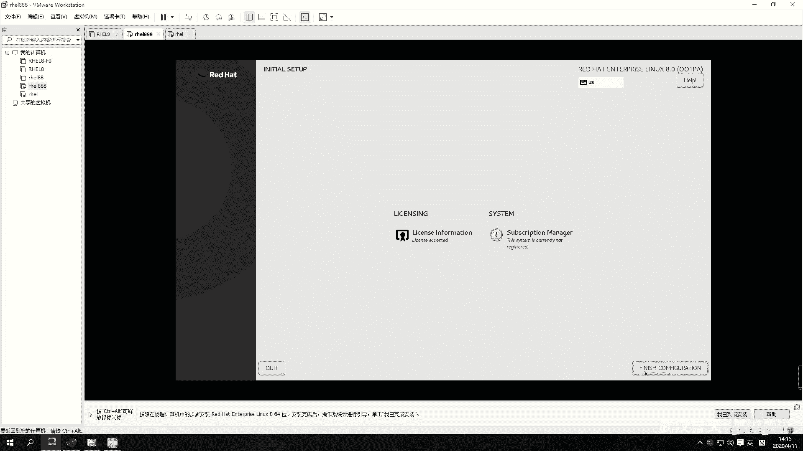

以下是首次启动流程：
1.  **许可协议**：重启后，需要阅读并接受许可协议。
2.  **订阅管理**：系统会提示进行订阅注册。如果购买了红帽的商业支持服务，可以在此处注册；对于学习用途，可以跳过此步骤，系统可以正常使用。
3.  **完成配置**：点击右下角的“Finish configuration”完成初始配置。

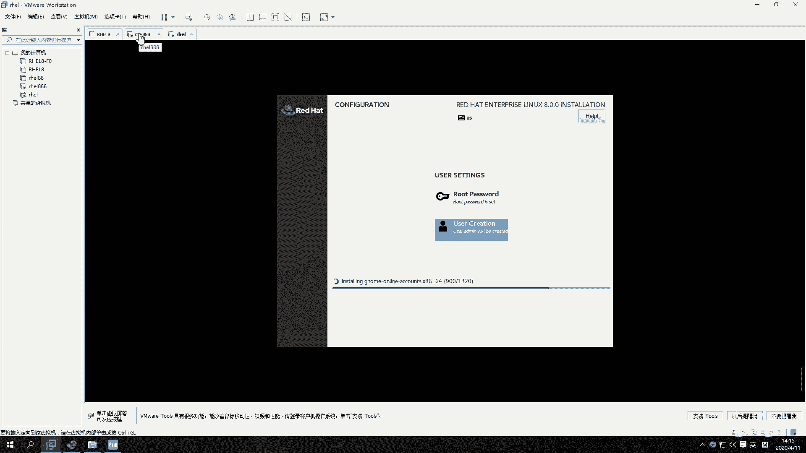

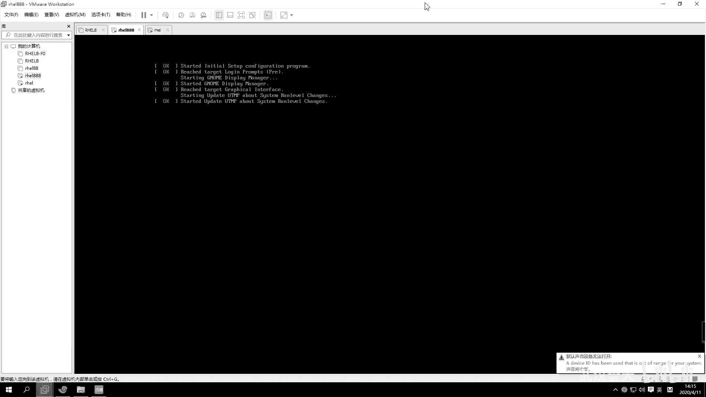

系统将进入登录界面。

## 登录系统与初始设置 🔑

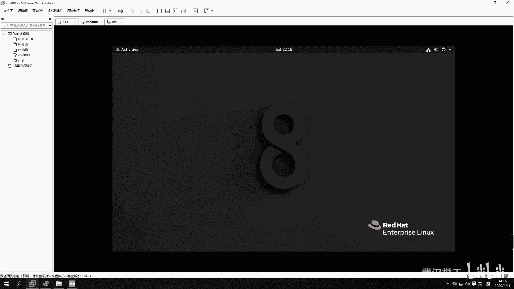

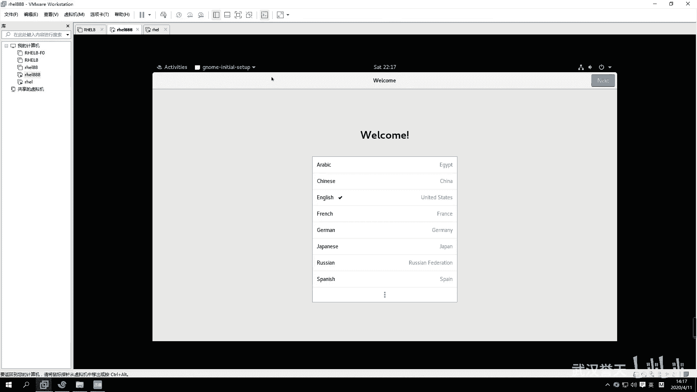

在登录界面，可以选择用户登录。

以下是登录注意事项：
*   **使用root登录**：为了学习初期操作方便，可以点击“Not listed?”，然后输入用户名`root`和密码进行登录。**注意**：在生产环境中，应避免直接使用root账户进行日常操作。
*   **使用普通用户登录**：也可以直接点击之前创建的普通用户（如`admin`）图标登录。
*   **切换用户**：如果登录了普通用户，可以在右上角菜单中找到“Log Out”或“Switch User”来切换为root用户。

首次以某个用户登录时，系统可能会进行一些初始设置向导（如选择语言、键盘布局、隐私设置等），按照提示操作或直接跳过即可。

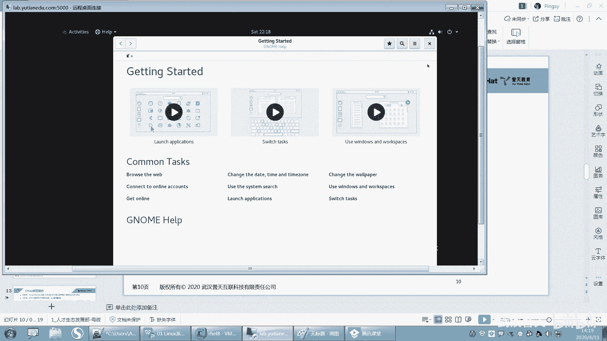

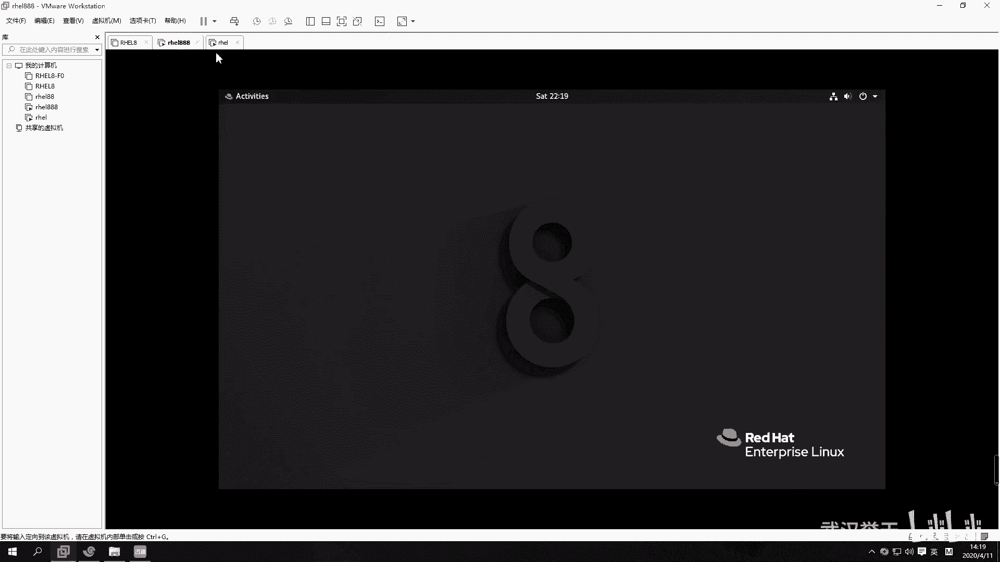

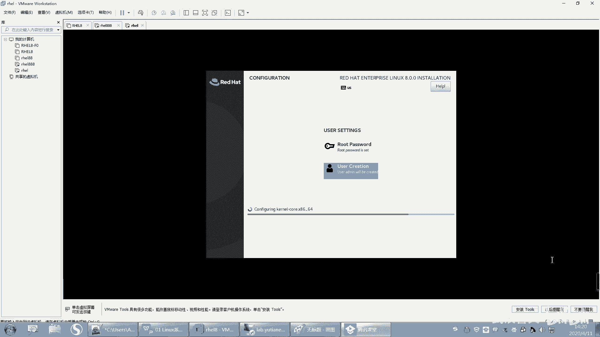

登录成功后，你将看到红帽Linux 8的桌面环境。至此，系统安装与初始配置全部完成。

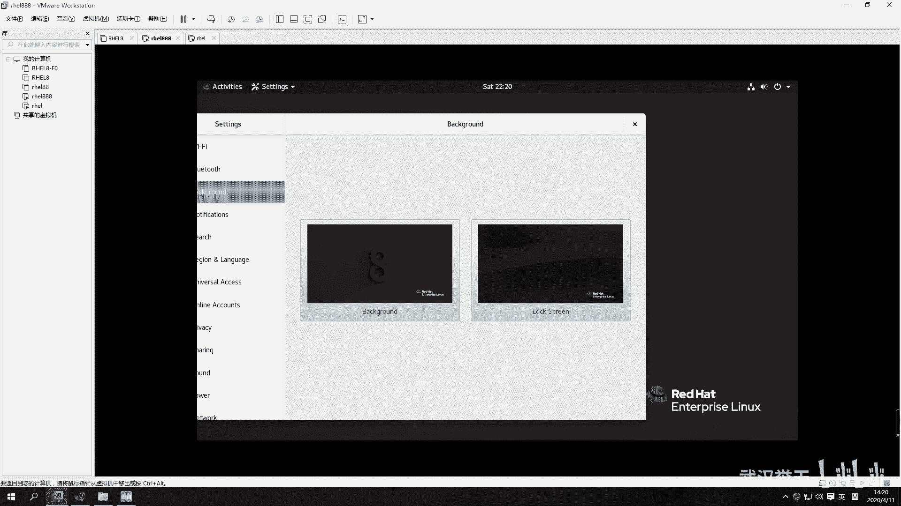

本节课中我们一起学习了Linux系统安装后的各项配置，包括Kdump、网络、安全策略的设置，掌握了root密码和普通用户的创建方法，并完成了系统的首次登录与初始设置。这些步骤是确保系统可用且安全的基础。