# Linux基础入门：1：Linux发展史与开源软件介绍

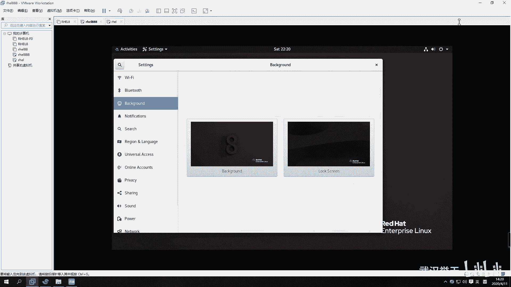

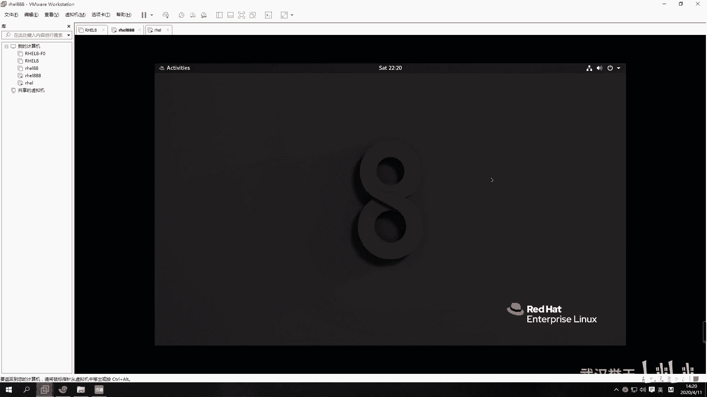

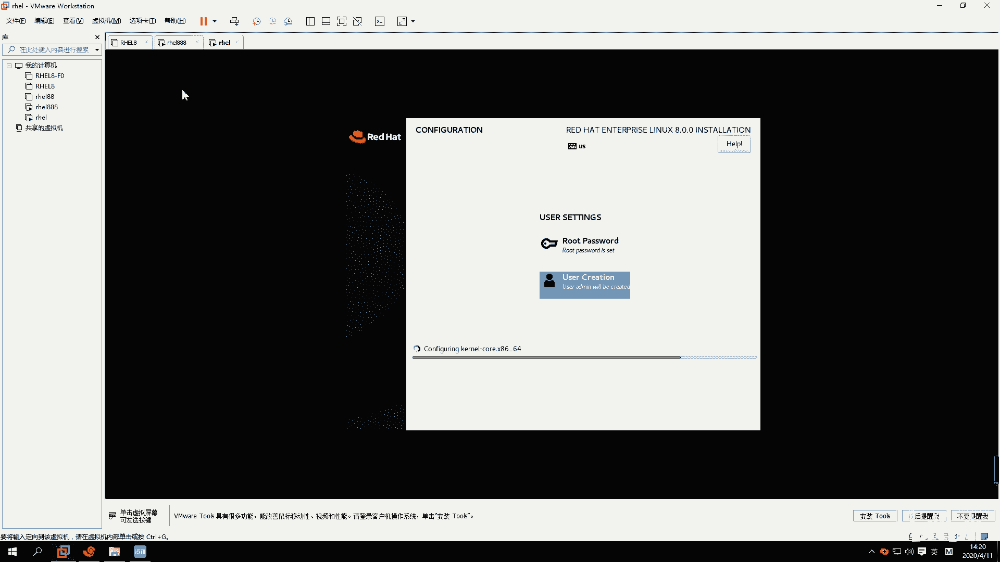

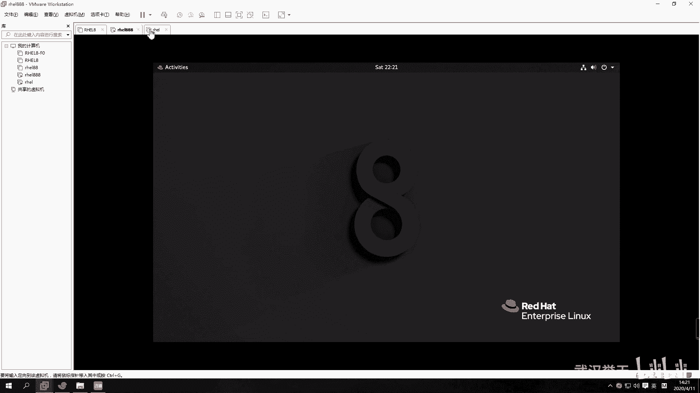

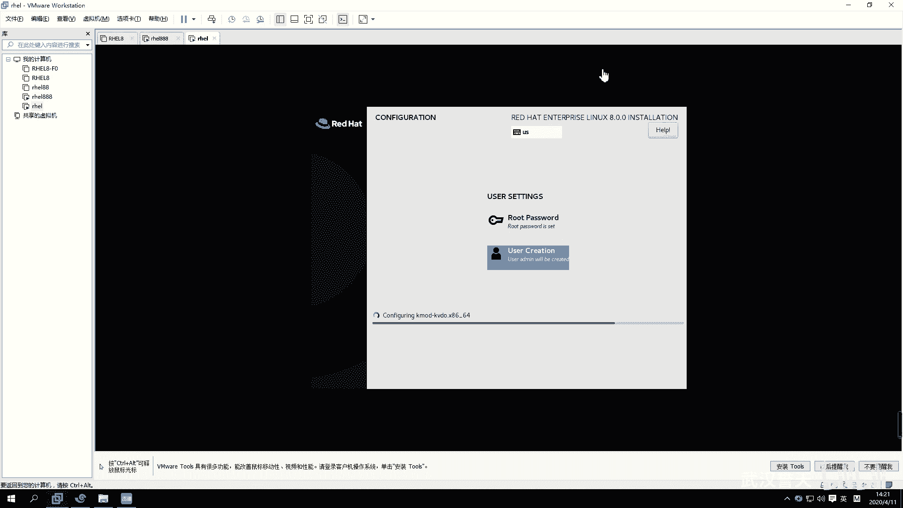

在本节课中，我们将要学习开源软件的基本概念、Linux操作系统的起源及其与Unix系统的关系。通过了解这些背景知识，你将更好地理解Linux系统的核心思想和发展脉络。

## 开源软件的概念与自由

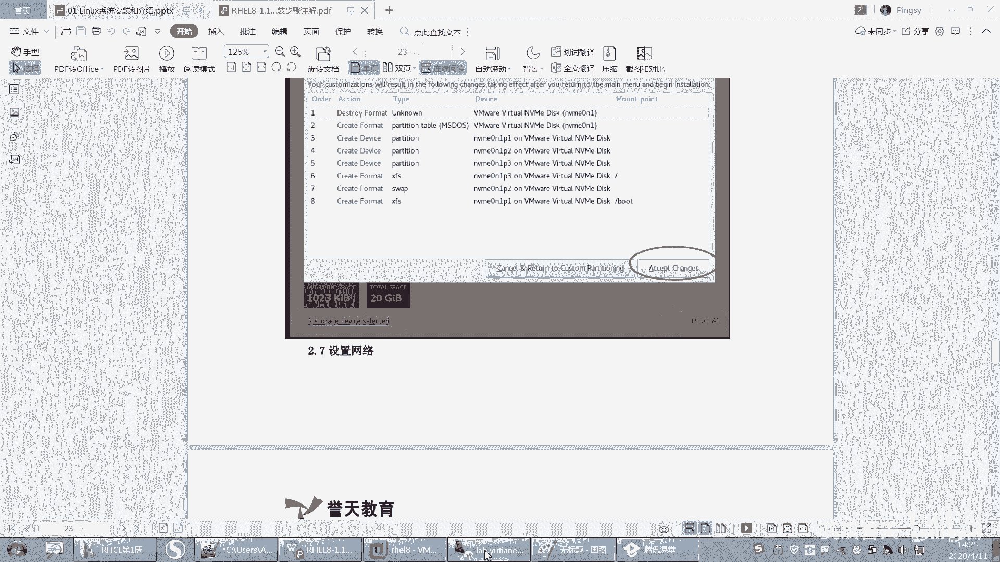

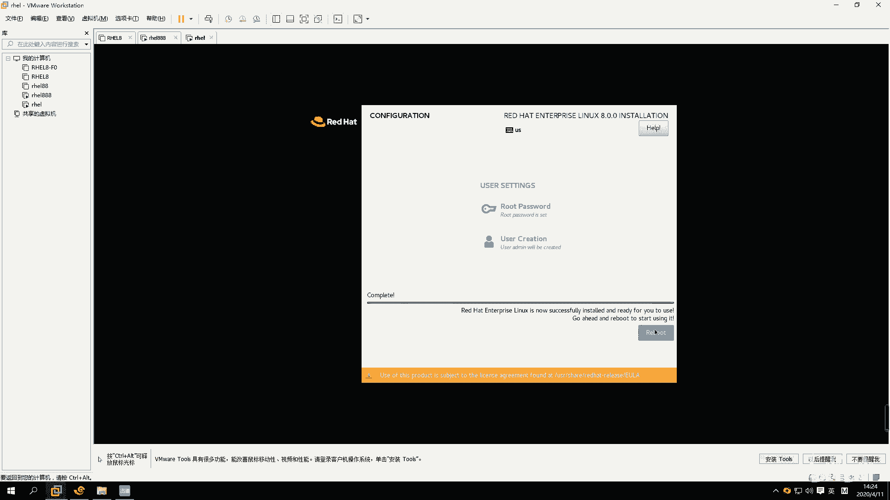

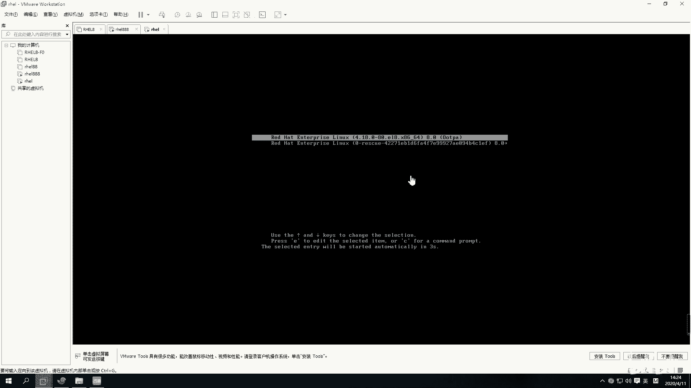

上一节我们完成了Linux系统的安装，本节中我们来看看支撑Linux发展的核心思想——开源。

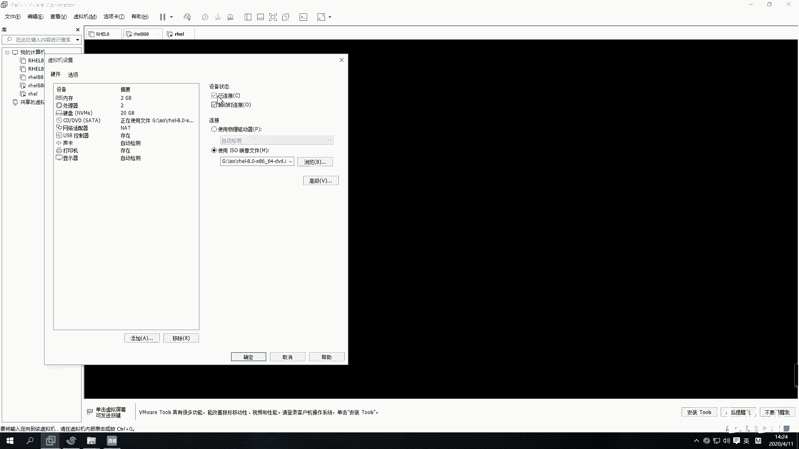

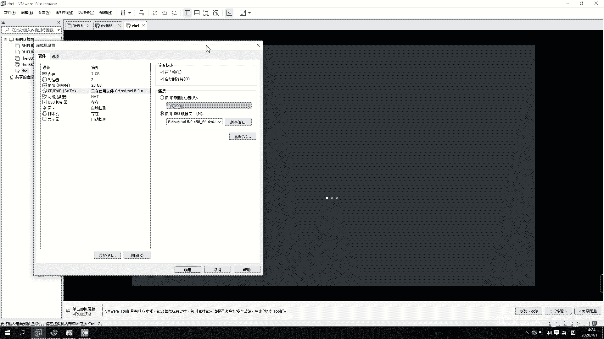

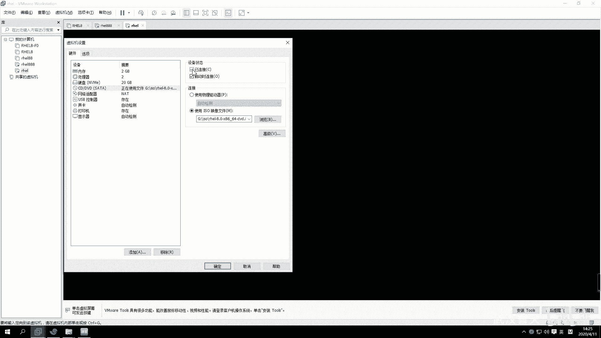

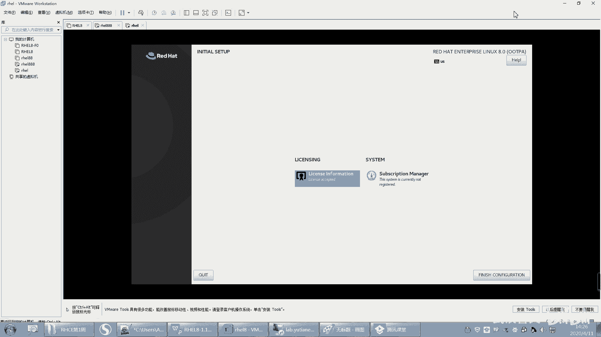

开源是指软件的源代码可以共享给所有人使用。这意味着任何人都可以查看、学习和修改构成软件的原始代码。与常见的闭源软件（如大多数Windows应用程序）不同，开源软件将“秘方”公之于众。

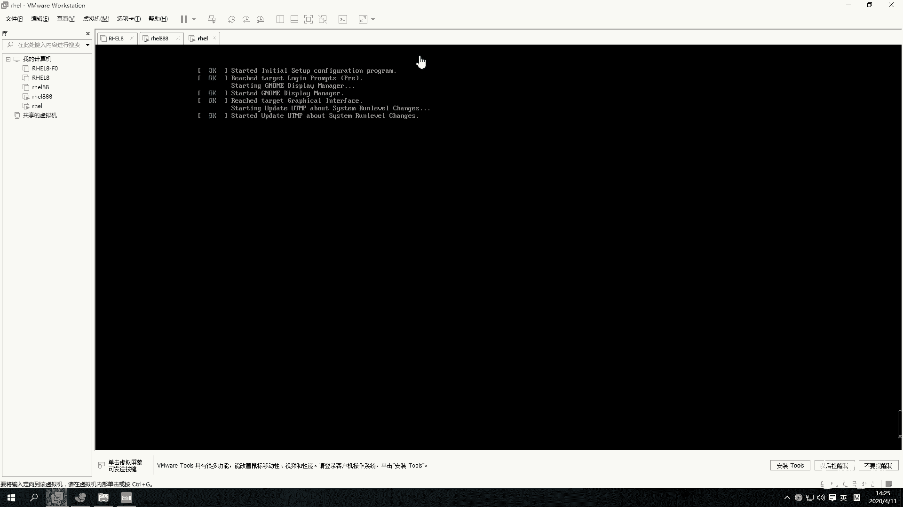

在自由软件基金会等组织的定义下，使用开源软件拥有四大自由：

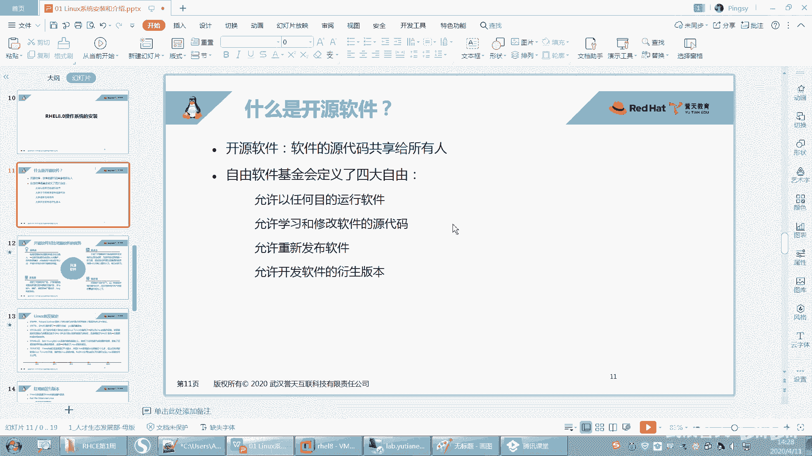

以下是使用开源软件时可以享有的四大自由：
1.  **以任何目的运行软件**：无论用途是商业、教育还是其他任何目的，甚至是攻击性用途，都被允许。
2.  **学习和修改软件源代码**：用户可以研究软件的工作原理，并按照自己的需求修改源代码。
3.  **重新发布软件**：可以将原软件或修改后的软件副本分享给他人。
4.  **发布软件的衍生版本**：可以基于原软件的代码，开发并发布全新的软件产品。

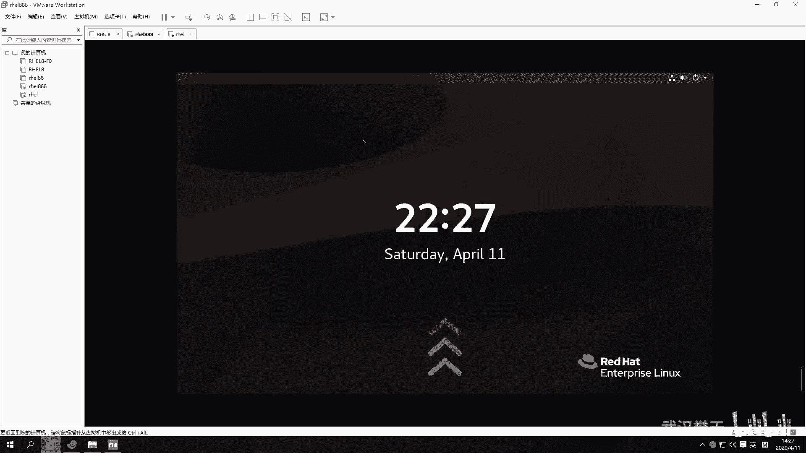

需要注意的是，在使用他人源代码时，应当注明出处，这是对原作者知识产权的尊重。

## 开源软件的优势

了解了开源软件的自由特性后，我们来看看它为何能吸引众多个人和企业用户。

开源软件具有以下几个主要优点：
*   **低风险**：开源软件通常由社区共同维护，而非单一公司。这避免了因某家公司倒闭而导致软件无人维护、用户被迫更换平台的风险。
*   **低成本**：企业或个人无需从零开始开发，可以直接使用开源代码进行二次开发，显著节约了时间和经济成本。许多国产操作系统正是基于Linux进行二次开发的。
*   **高品质与快速迭代**：由全球开发者社区共同维护，使得bug修复迅速，新功能迭代快，软件质量在集体智慧下不断提升。
*   **更安全**：源代码公开意味着任何潜在的后门或安全漏洞都可能在无数双眼睛的审查下被发现和修复，这通常比闭源软件更透明、更安全。

## Linux的起源：从Unix到Linux

在认识了开源软件之后，我们终于可以探讨Linux本身的由来了。Linux的发展与Unix操作系统密不可分。

Unix操作系统诞生于1969年，并在1970年1月1日成为一个标志性时间点，这一天后来被定义为计算机的时间纪元（元年）。Unix最初由AT&T公司贝尔实验室的研究员Ken Thompson开发。有趣的是，他当时是为了在一台闲置的机器上运行一款名为“星际旅行”的游戏而编写了Unix的雏形。

最初，Unix是开源且免费的，AT&T公司并未重视其商业价值。但随着其影响力扩大，Unix逐渐走向商业化，变成了闭源产品，并且需要与特定的硬件平台绑定才能运行，这限制了它的普及。

## Linux的诞生与发展

正是由于Unix的商业化和封闭，为Linux的诞生创造了空间。

1991年，芬兰赫尔辛基大学的学生林纳斯·托瓦兹（Linus Torvalds）为了个人学习和使用，参考Minix系统（一个用于教学的小型Unix系统），开发出了Linux内核的原型。他遵循开源精神，将内核代码发布到网上，邀请全世界的程序员一同参与开发。

Linux内核与理查德·斯托曼领导的GNU项目的自由软件相结合，形成了完整的、可自由使用的类Unix操作系统，即GNU/Linux系统。它继承了Unix的许多设计理念和优点，但最关键的是：**Linux是开源的，且与硬件平台无关**。

这意味着，任何人都可以免费使用Linux，并将其移植到从手机、电脑到超级计算机的各种设备上。这种开放性直接催生了今天百花齐放的Linux发行版生态。

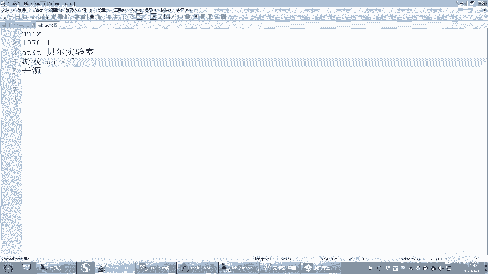

本节课中我们一起学习了开源软件的核心自由与优势，追溯了从Unix商业化到Linux诞生的历史过程。理解Linux的开源本质及其与Unix的渊源，是理解其后续众多发行版和技术生态的基础。下一节，我们将具体了解不同的Linux发行版及其特点。