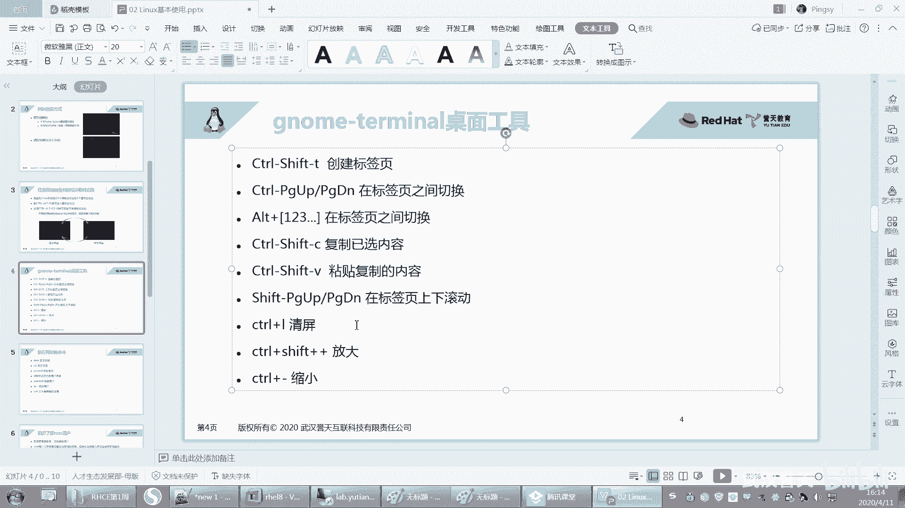
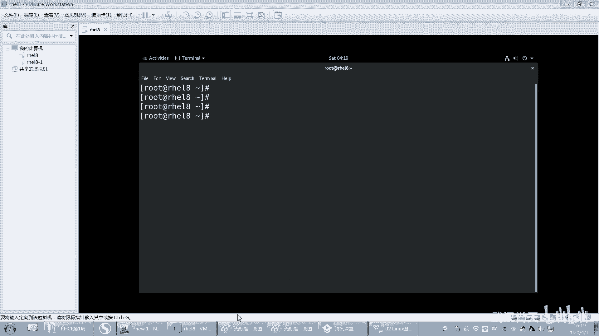

# 【已更新】最新版丨誉天红帽RHCE 8.0系列培训视频 - P10：Linux基本使用方法-10 - 武汉誉天 - BV1cv411q74E

和命令呢。呃，在这在这敲对吧？就可以敲命令了啊，好吧。好，那这个黑色这个界面呢你也是可以改的。我我大概点了一下啊，因为我也不是太熟，因为我这个嗯图形界面用的比较少。

然后你可以点这个preferenceprefer它可以去修改的。比如说。我大概找了几个，他他可以修改。它这里有个呃透明度，看到没有？他可以看这个透明度啊，这有个透明度。嗯。那看到没有？它这个透明度是吧？

你这重启了吗？你重启试一下。control加油器什么都什么都不是，没有。啊，然后还有还有一些啊，比如说我想把这个改成白色的。那你就可以呃在这里改。那这里有个主题嗯，light就是亮色的，看到？

亮色的是白色的，但是你要把这个透明度调回来，要么然都透明的。这个我就不跟大家点了啊，你们自己感兴趣就去点一下。嗯，我很少去研究这个。我看有的同学研究哇研究的这个对吧？很炫酷啊。

把这个关掉。你再切一下，要么你就重启一下试一下啊。好，那这就是一个这样的呃框框啊，框框。好，那么现在我们可以在这敲命令，对吧？那它这个地方有个提示符。那如果说我们在这个敲一个命令。

那这个嗯这个这个这个框如果被占用了，对吧？那如果被占用的话，那么。我们就要去敲其他的命令，执行其他的任务。我们可以打开多个窗口啊，你可以打开多个嘛呢？

嗯就可以打开多个。大家如果卡的话，你把内存多给一点啊。给太少了，就。有些时候他。它运行起来，它图形本来就本来就是比较卡。那我这。哎，我之前之前很顺利的呀。不能打开多饿吗？New window。唉。

这里可以打开呢。这样可以打开。那你我再点这个terminal，然后这里边new window，它就可以打开多个，看到没有？No。打开多个。你们最还是多给一点内存吧，要不然它开机关机就比较慢。嗯。

这个红包娃这个图形。嗯。多给一点。嗯，多给一点啊。好，那么这个多个窗口你就可以多可以去敲，但是它这样很乱，对不对？很乱啊，那你就把它给呃这样啊，我们想去把这个窗口给关了的话，我们可以点这个叉叉，对吧？

但是呢我们如果你什么这个地方什么事情都没有做啊，但是最好这样吧，不要养成习惯了啊，不要去点这个叉叉，你可以就EXIT这样退出来。EXIT这样退出来。对，这样去退出来啊啊。

就第二个命令EXIT这就退退完了就退出来了，然后重新打开一个。

好，然后它可以打开标签页的new table这个。PAAB就是标签页的意思啊，new table是吧？标签页你可以打开一下，然后右边就出现两个标签页并排在放啊，这打开标签页。当然我们也可以用那个命令。

就是用那个快捷键去打开标签页啊嗯。哦，你c摁一下cttrol shift加Tctrl shift加T，它就可以打开那个标签页。那ctrol shift加T就可以打开多个标签页。

看到吗？然后那这个标签页你可以在标签页之间进行切换。比如说contrlal加F1F2F3F4啊，al1234。好，是这样的啊。

那你创建新的标签页，就是通过control。control shift加T就可以创建一个标签页了。然后你在标签页之间进行切换，你就记这个吧，这个也可以切换。

我比较喜欢用这个叫alt123456这样去切换。呃，就是后面方便大家以后你考试，你只你考试的时候，你只有这个界面，看到没有？你考试的时候就在这个上面去敲啊，那个上面去敲，你可以按住al1234这样。

这样在标签页之间进行切换。

嗯，ctrl1234在标签页之间进行切换了啊。好吧。

然后呢呃标签页你想关掉的话，就ESIT嘛，就这样把它关掉就可以了。

大家不要去点。不要去点右上角这个叉叉啊，这里也不要去点它，你点这里的话，你把所有的这个标签是不是都关掉了？如果有一个。任务在这个地方运行，在这个界面上运行，一你这样关的话。

有可能会把那个任务给异常中断了。所以大家不要养成习惯点这个叉叉啊，嗯有的同学，对，不是说大家啊，其他的他喜欢点他他就没事，他就喜欢点叉叉，就是那点这里是吧？不行，点这里就乱点啊，不行，再点这里再不行。

点关机是吧？所以你不要去看到叉叉就点它，你这里不有吗？右键是吧？你要温柔一点，不要那么暴力啊，不要动不动就点这个叉叉，看见叉叉就想点。这里有关机嘛，然后。重启对不对？还有一个挂起，这个挂起的话。

你点一下，它就把你当前的状态给保存下来了。这个。

感觉这个服务器不行啊，还不如用我自己的电脑。

哦用自己电脑上。

感觉我自己的还快一点。

嗯，所以大家不要去点这个叉叉啊，点这个叉叉了。嗯，养成习惯啊养成习惯，好吧。好，那么这个嗯这个比如说你嫌字太小了，嫌字太小了，你可以怎么样啊？

你可以controrl shift加放大control shift看到没有？conttrol shift加放大这样放大然后ctrorl减放小好，是这两个标签啊，大家可以记一下。

就是第一个是这个controrl。呃，我这边没有写是吧？好，再加上啊嗯control。加shift。加加号，这个是加号啊，加个加号，然后它是什么放大。大家自己记一下，好吧，PPT到时候发给大家啊。好。

然后在conttrol shift。啊，没有shift的啊，就加减号就缩小。缩小。嗯，就让ctrorl减缩小啊，这个是放大好吧，放大。呃。

OK吧，就是你字太小了，你就要放大一点。如果你眼神好，你就缩小一点。OK大家可以改字体，但是字体的话，你你自己改一下吧，那大小是吧？这个没有改过，你可以自己去改一下啊。好，然后我们这个复制的话。

怎么复制呢？就比如说你这个界面上怎么复制啊，我们这个里面你可以这样，右键可以选中选中这个。呃，选中这个右键复制，看见没有？copy。paste是吧。嗯，copy paste这样去选。这你总会吧。

对吧那copy，然后paste这样去选。这样这样去选啊。啊，当然这个地方也有control什么，ctrol C，我们用windows controll C对吧？那你control C没有用啊。

conttrol C是中断的意思。不要在这使用control C，contrl C是中断的意思啊。啊，不要去使用crl C。大家平时把我说的我说到的这些东西啊，你记一下好不好？嗯，你你你最好记一下啊。

可能PPT上没有了，你就记一下。啊，那ctl C是中断的话，那我想复制怎么办呢？也可以啊，你就可以把它选上，比如说选上啊，然后contrl shift C。

然后conttrol shift的 way这样去复制那control shift的 vcontl shift的为。这样去复制，看到没有？嗯，crl shift为这样去复制啊，就复制跟粘贴啊。

复制跟粘贴实在不行，你就右键这样去选。啊，当然这个功能只是这个桌面工具才提供的啊。你比如说你在这种情况下。

呃，你你你在这种情况下，你就没有办法去选你的鼠你的鼠标都用不了，鼠标都用不了啊。那在这个控台上啊，不过以后我们学了一些远程连接工具之后，那你就不用担心了，是吧？

好，反正在这个里面我们是这样子的啊。好，这是复制啊。好，复制粘贴。那如果想清屏，比如说这个内容太多了，我们想去清屏的话。我们就问controrl L这样去清屏，看到没有？control L。

control L去清屏。control也要清屏啊，或者是clear。哎。clear这样去清屏。

嗯，会吗？会了吗？嗯，clear是清屏，就这些啊。这个标签页什么滚动这些我都很少用，所以这个你不用记，这个也不用记，其他的你记一下，这个是经常用的嗯。就是在这个桌面工具上才能在这个桌面工具上用的啊。

如果你换一个桌面工具或换一个工具，那个连接工具的话，操作界面呃有可能就不是这个了啊，好吧。好，这个就是我们这个这个呃桌面工具的使用方法啊。

我觉得我用自己的吧，这个远程的话，我先把它关掉。

好。这个黑色的大家能看见吗？应应该还好吧。我放大一点。O。黑色的啊。好了，这就是你桌面上怎么具体的使用啊。还有右边的我话，我就可以教大家点一下啊。

比如说嗯你这边会有一个这个你看可以点这个这个是相当于设置嘛，对吧？设置。

你就可以点一下设置。然后如果你想比如说我想去这个是背景是吧？然后这是蓝牙什么通知啊什么之类的语言啊、区域啊这些这就不多说了啊。然后右边这个地方有一个这个。

有一个这个是吧，这个是关机吧，右边这个是关机，然后这个是锁锁上锁屏，这个你们自己去点，好吧，我就不我就不带大家说了，因为这个毕竟不重要。嗯，然后你就就就点一点，然后这你就。就是这。😔。

就wifi什么就就就最好就不用点，不用管它，好吧，不管它啊。好，那么然后我们再来看一下啊，我们先学习一些简单的命令，好不好？

好，学习一些简单的命令啊，我们这边要给它列了一些命令，我们先敲一敲，好吧。

嗯。首先我想比如说啊我想去显示一下我们的时间，好吧，我先显示一个时间啊。那这个时间呢我们可以这样用dta。我们有个命令叫data，它可以去显示时间。

然后这个这个时间呢就是我们的什么这个什么2020年是吧？然后四点。这个时间也不知道显示的什么时间啊。热星期六是吧，4月11号4点19分是吧？嗯，4点19分30秒30秒啊，这是我的时间，还可以显示什么？

还可以显示日历呀那。CAL这个命令它可以显示日历啊，日历啊。嗯，然后4月是吧，aprl4月4月4月11号就是一些简单的命例啊。嗯，还有什么？嗯，好，我们再来看一下啊。如果我想去显示我当前是哪个用户啊。

其实我在这前面就可以看到这个前面就有个提示符。好，前面有个提示符啊，那么这个提示符前面这个地方呢，这个指的是当前用户是谁，你是谁？你当前是哪个用户？好吧。然后后面这个地方是我的主机名。

这个主机名是我在什么时候改的时候，在装系统的时候，里面有一个设置主机名，那个地方我改了。但是我当时教大家装的时候，我没有改是吧？那很长一串什么叫local host，什么什么一串。

你改了就会变成这个样子，否则你这个地方就叫叫什么叫local host。😡，没有改的话，就是叫local host啊，好吧，这是我的主机名。啊，然后后面这个波浪号呢，就是我当前的路径，我当前在哪个位置。

这个我后面也在解释啊，这什么意思？好，前面有个提示符，这个提示符是井号。这个井号呢一般是指我当前呃一般是root的话，我这头就会显示井号。呃，显示井号，如果是普通用户的话，就会显示这个其他的用户啊。

如果是其他的用户，除了root以外，就会显示多了符号，就这个符号。待会儿我们会看到啊。好，那么我除了通过这个来看我是谁以外，我还可以通过什么来看呢？

我还可以通过IDIDID啊这个命令ID就是就是那个身份。你你个你知道那个单词叫identify。你身份。那个你知道那个ID吗？就是什么什么ID是吧？😡，啊，就要学英语啊，就那个就唯一标识号，对吧？

就这个有个命令叫什么叫ID啊，它可以显示我当前是谁。对，就是我的身份证是那个ID嘛，其实对就是对身份证信息嘛，就是呃唯一身份标识。嗯，身份证就是1个ID。嗯，这个就可以显示我是谁嘛，那当前用户是谁。

那当前用户是root，你就看这个就可以了啊，那这个地方第一个啊就是root，我是root啊。好，而且我还可以看什么，我还可以用ID去看我系统当中有没有这个用户。比如说我想看系统当中有张三这个用户吗？

你看。ID你就可以接一个用户名，后面要有空格啊，这个ID的后面加上一个空格，然后再后面加上一个用户名，就可以呃显示这个用户存在吗？啊，不是显示这个用户的信息。如果他报错说，那我们学到第一个报错啊。

第一个报错。第一个显示是吧。嗯，他说张三呢no such user没有此用户，对不对？没有此用户啊，说明这个系统当中没有张三，那系统中有没有admin呢？呃，有如果有的话，它就会显示什么？

显示这样的信息啊，显示这样的信息啊，比如说唉admin对不对？admin啊就显示有啊。好，所以ID这个是可以查看我当前用户是谁，当前是谁，以及还可以看系统当中有没有某一个用户啊，我可不可以ID自己啊。

也可以嘛，对吧？也可以ID自己对IDroot哎ID rootot也可以啊。嗯嗯。张三就是我们的哈lo。这个。好吧。OK啊，这个就是显示哪个用户啊，显示那个用户存不存在。那如果显示这个用户存在的话。

我就可以切换到这个用户。好，那一般正常像我们windows切换用户的话，我们是怎么切呀？我们是一般呃先退出注销。

哦，对吧？然后一呀这个还关机是吧？哦，这个是关机，然后这个地方是把你看我可以注销，相当于注销是吧？然后在这个地方。

好，你看an log in another user是吧？然后你可以在这输入addmin。嗯。然后再输入rehead。这样的话是不是用通过另外一个用户来去登录，对吧？那你看。这多用户的操作系统嘛。

我们linux是一个多用户操作系统，它可以同时多个用户去登录啊。嗯，这个这个红帽红帽趴真的它不会显示这个界面上不会显示谁谁，对吧？你可以在这点嘛。

然后我当年是谁呀？哎，当年是不是admin啊？我这个用户登进来又会让我去选这些东西。我，不管他啊。

我关掉。第一次登录这用户都会这样。好，你就会看到这个用户呢，前面就是我是admin，对吧？然后这里也会显示呢我的min嗯你ID看一下我是不是就是admin啊。好。

然后这个地方你看是不是普通其他的用户叫多了呀？好，我们这个系统当中只有一个管理员，只有一个管理员啊，这个管理员叫root。除了这个root以外，其他的都是什么，其他都是普通用户，哎，其他都是普通用户。

所以普通用户前面这个提示符就会是多了符号，多了符号啊，只有root才是什么井号，记住啊，只有root才是井号。好，那么这个地方如果我想去切到。比如说我现在想去切到root，对吧？那。😊。

我还可以ID rootot吗？我想其他ro的，那我又要什么，又要去把它们什么重新登录一下，不需要啊，我们lin可以在线切换用户，在线切换用户啊，不需要去来回什么这样。这样去切啊。

不需要这样来回去呃重新登录。好，怎么办呢？我可以切到什么SUSU啊，有个命令叫SU空格杠空格。加上root注意啊，严格的要有空格啊，反正你空几格我不管，反正你要有空格SUSUS空格杠空格。对嗯。

switch user是吧，切换用户哦，对，很好啊。好，你这样对，大家去记命的时候啊，就是有些确实你说命令太长了，我我没办法去记是吧？你可以去记它这个它这个单词，就是你你看ID我。😊。

