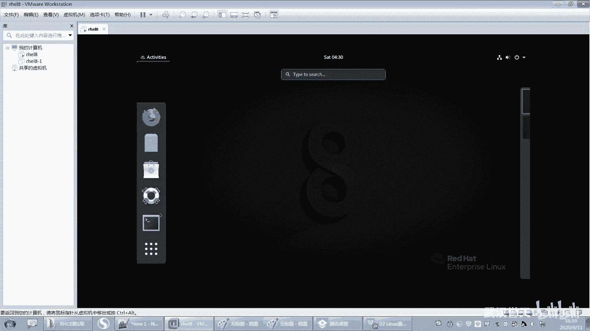

# 【已更新】最新版丨誉天红帽RHCE 8.0系列培训视频 - P11：Linux基本使用方法-11 - 武汉誉天 - BV1cv411q74E

太强了，我我没办法去记是吧？你可以去记它这个它这个单词，就是你你看ID我教你是吧，什么记那个identify，对吧？你说老师identify都不知道怎么写是吧？😊，啊。

嗯SU呢你就switch就switch切换嘛，user就用户，对不对？啊，空格杠这个你先这样去写，好吧，这什么意思呢？我们后面会教大家啊，但是这个杠呢一定不要掉了，ok吧，大家切换用户的时候。

千万不要掉了啊，然后再空格后面接上什么，后面接上这个用户名啊。😊，好，然后再回车。他会让我去输入密码，root密码。啊，哎，你看我当前是不是变成了什么root了，对，当前就变成root了啊。

所以它就什么？它是这个呃它可以在线切换啊，在线切换会了吗？是不是很简单，对吧？好，然后再来啊，你看我root想去切的命可不可以呢？哎，你看。😊，分分钟这样切拐了。对，分分钟哎嗯秒秒钟是吧。

SU空格杠addmin。啊，那么切到dmin这地方又会显示addmin，对又会显示addmin。而且你发现我们在用root来切addmin的时候，根本不需要怎么去输入密码，根本不需要输入root密。

不不需要输入addmin密码。你会发现这个时候就已经显示出谁的权限更大了。你看root的权限。他切其他用户的时候，根本不需要密码。但是我们发现如果你是什么addmin切root是不是就需要密码？啊。

就需要密码，对吧？所以啊注意root用户切任何用户时都不需要密码。好，那你说老师我现在变了的命了，对吧？我想去回到root，那怎么办呢？我是不是要这样啊，哎，不需要啊，你可以这样。

你可以这样EXIT退出来，又回到了什么？呃，root对，又回到root了啊。好，那么。你说老师我能不能就这样切呀？😡，可以，但是我不建议大家这样反复的去切啊，因为有时候你切来切去，切来切去之后。

你切的方式不对，是吧？姿势不对是吧？哦，方式不对啊，说错了。😡，啊，切的方式不对，有可能会最后切你的用户该有的权限没有。所以不建议大家怎么样去反复的去切换这个用户啊啊，那你怎么办呢？

你说老师我就退出来嘛，对吧？你退出来重新切一个，比如说切一个这样吧，我再创建一个用户啊。我们再创建个用户，这个用户这个命令可以创建一个新的用户，叫user ausered空格。注意啊。你看我要不加空格。

这是不是一起的呀，你这样一起敲，我系统怎么识别出？😡，这是个命令啊，这是个用户名啊，对吧？没办法去识别出来啊，所以要空格，你空几格，我管你对吧？不管啊。好。

那这样的话就又创建一个用户叫userE啊ID usererE这个用户就存在了。看到了吗？好，那我就可以切到什么user一类呀。对不对？你看而且迁旧的你需不需要密码呀，不需要密码。嗯，不需要密码啊。好。

你发现为什么不需要密码呢？你发现U子一有没有密码呀？我把它创建出来之后，我都没有给它设置密码，对吧？😡，那所以你没有设置密码，我入的能不能切过去呢？能啊，你看我是不是切过来了呀？好，那你这样啊。😡。

你切到普通用户角的命。注意啊，我每次都退出来了啊，我没有反复这样去切，大家也养成良好的习惯啊，不要反复的去切入。我之前有碰到过，有像这样。😡，哇，切啊切。呃。呃，什么切切了一堆啊。

后来说老师我怎么这个再切住它啊，就切来切去切来切去啊。😡，好，一直往后面切。啊，切到最后，他发现他执行一个东西，他发现没有权限。😡，好，后来我说怎么会没有权，该有权限root呀。

root怎么都没有权限呀。😡，好，后来我一去看。哇，我这样退啊，退了半天，你知道吗？我退了半天才退出来。😡，我就我说的我这到哪去了是吧？对，就退退退退退。😡。

好像。这一推推没了是吧？哦，所以。不要反复的去切切这个用户啊，一定要退出来，或者重新打开一个窗口。

啊，打开一个窗口这样子啊养成习惯了，好吧，养成习惯了啊。好，那这样不就OK了吗？你切换一下出来就行，退出来再重新切啊。😡，好，那么我切到addmin的话，比如说呃addmin我去切user一啊。

你看好啊，addmin去切user一。嗯，好，你看啊这样是切普通用户，这次是不是普通用户去切普通用户啊？注意啊，只要你是普通普通用户，比如说啊切到其他任何用户，他都需要去输入密码。看好哦。

那你前面是个普通用户，对吧？你去切到任何用户，你都需要去输入这个密码才可以输入密码才可以啊。那这个时候user一有没有密码。我们可以知道柚子鱼其实我刚刚在敲的时候。我并没有给优子一去设置密码。

我只是执行了一个什么。😡，我执行了一个这个命令叫us子。好，我是切到root执行的是吧？普通用户没有办法执行，U在 add啊，我是这样的us the。ad user则E是吧？啊，那这样的话就创建个用户。

那这样创建出来的用户它是没有密码的。所以你在这时候，我输入什么密码，什么密码都不对，所以你随便输都没有办法去登录到这个用户。所以注意啊，一旦一个用户他没有设置密码，这个用户是无法去登录的。😡，啊。

无法去登录的啊。但是你说老师我root切us子一是不是就登录了呀？那是另外一回事啊。如果你让这个U子一自己去登录的话，它能登吗？就相当于你在那你注销一下，重新登录，在那个地方登录。请问你输入密码是什么？

因为每个用户登录进来都需要输入密码。嗯，所以是这个用户就没有登不进去啊，登不进去好，登不进去就会这样去报错。那你一回车。这个命令叫呃叫authisticationau often是吧？

authentation这个叫认证叫认证啊，前面这个单词叫认证的意思好吧，好，faure叫失败，认证失败啊，就是你密码输错了。啊，要么就是用户不可用了，对吧？就认证失败。因为输入密码就验证嘛。

验证你是不是就得移啊？啊，你你你要不是U子一，就密码输错了是吧，就认证失败啊，认证失败。好，那么。我这个时候要登录UZ一怎么办？我是不是需要给它设置一个密码才可以来设置一下密码啊。好。

我们在右边这个窗口来执行，好不。我们在哪执行都可以啊。注意啊，要切到root用户啊，普通用户是没有办法给别人修改命令的啊，要切到root的用户听到没有？现在你所有执行的命令都要用root用户来去执行。

好吧，用root用户来去执行啊。啊，给别人修改密码。好，我现在这样吧，我修改密码的命令叫password。呃，叫修改这个这个命令的这个修改密码的这个命令叫password。注意你英文单词学的好，对吧？

有一个命令叫password，是不是有个单词叫password，这个单词叫叫是不是叫命令啊，不是就语文伦次了啊，这个单词是不是叫密码呀，对吧？这个单词叫密码，这个单词里面有没有OR啊，是没有OR的啊。

所以它这个修改密码的命密叫password叫PASSWD。好，我们可以直接回车哟。好，你可以直接回车了。如果你直接回车的话，那么就是chaning password for user routeot。

就是给root来修改密码。给root来修改密码啊。好，那么让你输入新的密码啊，那我输入新的密码，我输入123。好，你看我输入123就回去了，注意你这个地方这个密码是不会显示的啊，它不会显示出来。

它没有回显。😡，而且你输入几位，它也不会显示出来，这样的为了安全，对吧？啊，它会报错报错啊，看好，就经常会有这样的输出啊。哎呀，这个很很难受啊，每次有同学看到说老师我他只要看到下面有输出。

他就认为是报错，他就会认为是错了啊。不是的啊，你要看清楚人家是人家讲的是什么。😡，这个是指bad password。你的密码有问题对吧？坏密码是吧？这个反正这个密码就不符合要求啊。

然后这个password呢 is shorter in是吧？就是是少于什么8个字符，这个是。😡，对，这个是8个字符字符的意思啊，嗯，corctor字符的意思啊，也就是说你少入8个字符。

就会显示这样有一段输出，对吧？因为我刚刚输的123123。对，123啊啊，你这个你翻译的翻译是有境界的啊呃那个。那那个那怎么说来着？我们当时学计算机英语的时候，我们老师还给我们教我们翻译是吧？

然后什么呃。什么那三个字叫什么来着？反正你这种翻译就是坏密码是吧？这个这个翻译就比较直白了。你要就是要是信哦，对啊，叫信雅达。对，叫信雅达啊。啊，信达雅是吧？啊，突然想起来啊。

信达雅对这翻译的最高境界啊。好，然后。然后这边就是密码少于8个字符，然后将你哎ret是不是再次啊？是不是再次输入新的密码，对吧？再次输入新的密码啊，那么这个密码你再输入，那说明什么。

说明你这个密码是不是让你去确认呢？那我这个密码是不是生效了呀，所以123再输入一次，回车密码就修改成功了。对，密码就修改成功了啊。好，那么你看所有的认证tos，这个是叫什么？

这叫认证的tostotos叫什么叫口令的意思啊？什么叫口令呢？就是你的密码不就是口令吗？大家每次去输入的时候，输入密码那个地方是不是就有的地方会显示口令嘛？

口令你知不知道啊？英语单词知道了中文，不知道什么意思啊，就口令要认识啊这些单词。

慢慢要积累啊，从现在开始就要积累了啊，就所有的认证tokens口令update要更新嘛，成功了，对吧？就你就更新成功了嘛，对吧？输出有看不懂，这是不是失败了呀，对吧？这个就闹笑话了啊。😊，好。

所以你看只要直接回车，是不是给自己修改密码呀？哎，给自己修改密码，给root修改密码啊。好，那我普通用户可不可以直接回车？那你看啊，password唉，回车看好。😊。

那我普通用户也可以执行password，对吧？然后他他说给谁修改密码呀，是不是给呃admin呢？啊，那么他但是你看它区别在于什么？这个地方直接是让输入新的密码，但是这里他让我输入什么当前密码。

对当前密码啊。啊，co就是当前的密码。当前密码是什么？他密码好像re high了吧，所以你普通用户要给自己修改密码，一定要怎么样？一定要输入当前密码。你要知道你要证明你是admin。

因为普通用户权限比较小，你要想给自己修改密码，要知道你当前密码是多少，大家密码都修改过吧，这个不用我多解释了啊。😡，好，那么再次输入新的密码，比如说我输入一个嗯。123好，你看我这地方也是输入123哇。

就直接什么。直接报错是吧，直接退出了，我觉得红帽七它会它还会让你再次重新输入。哎，这个直直接就退出了是吧？哦，你看bad password这个小于8个字符。然后他说这个认证的口令操作失败。

这个是要操作的意思，这个单词叫操作er就错误嘛，操作错误操作失败是吧？😡，好，那直接退出了。我记得他们以前好像是他直接让我再次输入一次，再次次输入这个新的密码。好，所以你这个密码不符合要求啊。

密码不符合要求，所以他要严格遵循八个字符。哎，可以了啊，我输入了8个字符。好，这样才修改成功。看到没有？就是普通用户修改密码跟root用户给自己修改密码，那是不一样的啊。好。

OK那这个时候addmin他自己把自己的密码给忘了，我刚刚修改密码，这个忘了怎么办？我想给自己修改密码，完了，我不记得自己的密码了是吧？好，这个时候你就能去求助谁呀，求助这个root了。哎。

root你root帮我修改一下密码呀，我密码忘记了是吧？好，那为什么让root去修改呢？你来看一下啊。😡，root给别人修改密码，就可以在后面加上一个这个用户名，就是password加addmin。

password加的命啊好，今天我们一定要会去修改密码啊。呃今天你要会切换用户呃，这个这个修改密码，这个要会啊。啊，password空格addmin，那么就给addmin修改密码。

而且你给addmin修改密码需不需要输入addmin当前密码，这个地方是不需要的，因为它没有写current password，对吧？好，直接输入新的密码。随便数，你随便啊。那成功了，就这样就成功了。

啊，两次输入密码要一致啊，如果不一致，它会报错的。你看啊，如果不一致，你敲一个。那他说这个密码怎么样啊？这个密码do not match不匹配啊。对，不匹配密码不匹配。操作失败是吧？那操作失败了啊。

好嗯，这个红帽吧这个。它这个跟红包企业确实不一样啊，它这个它直接退出，以前都是它会提示让你再次输入，再次输入是吧？它不会直接退出的，现在就直接直接退出了。这单词这个这我也不认识啊，查一下呗。

你不认识就查一下，我也并不是所有单词都认识了。你就去查，一定要去查啊，这样的话你才会慢慢去积累它。好吧，慢慢去积累，积累多了就认识了。嗯，这就是。嗯，就是计算机英语其实没什么没什么这个捷径啊。

就查看记就行了啊。好，那么这是修改密码啊，修改密码会了吗？会了吧。好，那普通用户能不能给别人修改密码呢？哎呀，你这个。小帮手是吧？呃，初步的是吧，p最先的预制的初步的。啊，初步的开始的预备的是吧？好。

很棒啊，要去要去查啊。好，然后这个地方呢，你普通用户能不能给别人修改密码，对吧？哎，我想给user一修改密码，可不可以呢？不可以看了吗？他直接退出了，他说只有root才可以指定一个用户名。对。

只有root才可以指定一个用户名啊。普通用户是不能给别人修改密码的。嗯，好，我们所说的言论啊，就是我们所总结的说哎呀，普通用户不能给别人修改密码。那这句话仅仅在于什么？你学到目前为止。你只能认为什么。

他不能给别人修改密码。但是如果我们越往后面学，我们可以什么呀？将来哎我的命这个权限太低了，我能不能给他提全，就让他能给别人修改密码呀，是不是也可以，对吧？所以我们的这个言论啊结果结论只在当时可能有效。

但是我们会随着我们慢慢学习，我们更加深入之后，我们就知道哦，还有可些其他的特殊情况，对吧？怎么让他才能给别人修改密码，所以目前为止，我们普通用户是不能给别人修改密码的。一定要记住啊。

普通用户是不能给别人修改密码，只有root，你看他说只有root才可以。你看那我这样可不可以注意大家认为这样可以吗？😡，就我passaddmin直接接上admin。😡，不要接其他用户，就借自己的用户名。

😡，对吧我不去不去接别人的用户名啊，就接自己的用户名，这样可不可能？😡，F122F2都是图形是吧？嗯嗯。这个这个怎么老是跑到后面也看不见呢？啊，你这样也不可以啊，你就算接自己的名字也是不可以的。

因为他不会判断说你这个名字接的是谁，对吧？他只会看后面有没有接东西，只要你接的东西，我就报错，我就不让你修改。啊，所以普通用户一旦要给自己修改密码，千万后面不能接，直接回车。对，直接回车就行啊。

不要去接这个用户名，对，直接回车好不好啊，你只要接了，他就认为。你要给别人修改密码，他就直接报错。对，直接报错啊。好了，这是修改密码啊，修改密码会了吗？然后我们刚刚学了几个呀。呃，笔记拿出来记一下啊。

刚刚学了几个。

呃，第1个ID是显示什么？显示我们用户的信息，对吧？对，显示用户的信息啊，然后这个我们学了一个user add创建用户。因为这个你们用户如果太少，没法测的话，你就创建一个用户，好吧。🤧嗯嗯。呃。

创建一个用户啊。在终端里面输入什么可以切到字符界面是吧？这个我们后面再学，好吧，命令有点长。啊，然后就创建用户，然后切换用户呢是SU空格，加上用户名，就切换用户这样就切啊。

然后password了修改密码。啊，你刚刚我刚刚在操作的时候，你可以记下来啊，我这只是写了一个简单的简单的这个命令的解释，并没有把那个嗯就就是怎么去修改的写下来啊。需要你们自己去记，好吧。好了。嗯。

下面这个嗯是这个这个这个上面我们学过了是吧，学会了吧。会不会改密码了，回去要会改啊。好了，下面我们再来学习一下这个叫BI编辑区的啊。

嗯，我给大家介绍几个关于V就是编编辑器的一个工具啊。呃呃ad user是吧，好像也可以用吧ad。嗯，UZ呃也可以，不过我用的我就一般用UZ add。嗯。好，然后再来看一下啊，我们下面所想去编辑文件。对。

编辑文件的话，怎么去编辑啊呃。好。这样啊我们有个LS这个命令可以查看这个目录下面有哪些文件。那目录下面哪些文件，你发现这个你看我们每次进来的时候，你像啊看好哦。你看我进来时候是不是个桌面呀，对不对？好。

这样吧。我。

