# 【已更新】最新版丨誉天红帽RHCE 8.0系列培训视频 - P12：Linux基本使用方法-12 - 武汉誉天 - BV1cv411q74E

我这样吧，我先还是。先不要切啊先不要切，慢慢来。好我还是切root吧啊。啊如果用的方便一些。1啊，root密码是多少啊？嗯，好。OK好，进来了啊进来了嗯。😊，看看这里啊。把它关掉。

我们每次进到这个桌面上，那桌面上这个桌面相当于什么？注意相当于你windows的桌面。

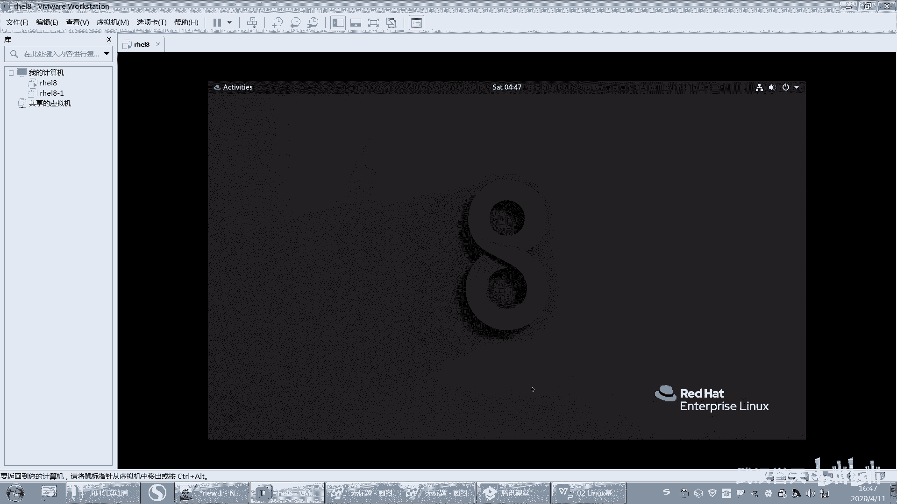

看好了，相当于你windows的桌面。

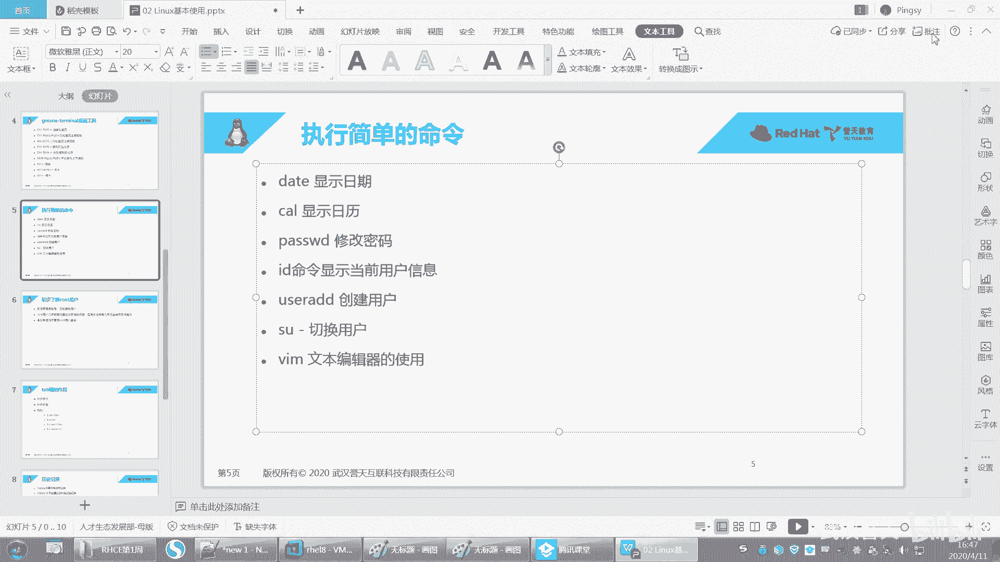

唉，好，你看我这是不是windows的桌面呀，但是我这个桌面上是不是有很多很多这样的文件，对不对？有很多这样的文件啊，那么我在这个桌面上，我一定会在某一个目录里面，这个大家能理解吗？

这个大家能不能理解我说意思，就是我在这个桌面上，我一定会在系统的某一个目录下面。😊，我一定会在系统的某一个目录下面。这个能不能理解？那我在哪儿呢？我在哪儿啊？我是不是在C盘？呃，用户。呃。嗯。

叫admin是吧？然后这个桌面看到没有？那。好，你看我这个桌面上，我一般是在这里，你看我在这个路径是不是在这里啊，我在这个C盘user amin什么desstop，对吧？是不是在这里okK吧。

这就是我桌面啊。😊，好，进是我桌面啊。好，那么你看这里啊。我在这儿打开，那打开一个终端。啊，注意啊，我我在这个桌面上我一定会在某一个目录下面，你看我在这个终端上是不是打开了。

我我在这个地方打开了一个什么打开了一个这个终端。那么这个终端呢它也我这个那这个这个提示符这里，它一定会在某一个路目录下面。就是说你无论你在哪，一定会在系统的某一个目录下面，你无论你无论是在哪地方打开。

那我在这里对吧？我在这儿是不是也在某一个目录下面呀，对不对？那是不是在这某一个目录下面，对不对？所以我打开这个终端呢，它也会在某一个目录下面，这个桌面呢它就是在桌面上，对吧？好，这个桌面是在哪。

你知道吗？桌面是在这里。😊。

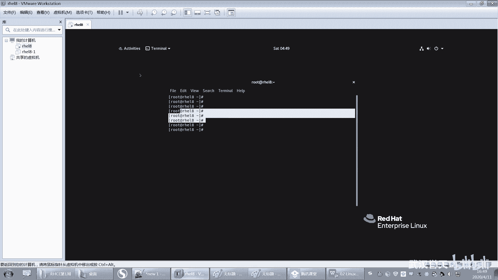

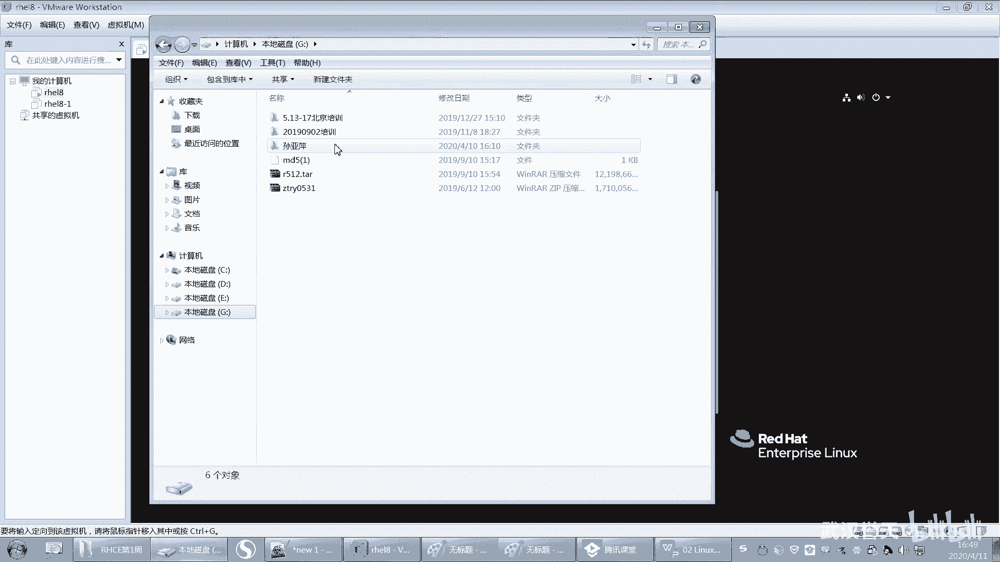

那这里有一个叫desstop。嗯，好，那我现在这个终端在哪里呢？终端就在我自己的加目录下面，就是root的加，一般在加下面都有什么？root的这个个人的私人目录下面一般都有什么？

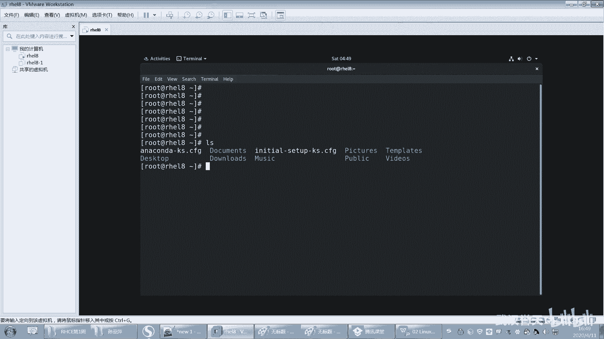

呃，一般都有什么呃，你看一下啊，比说用户呃，这里是不是这里啊，这是不是用户的这个加呀，用户的一些，比如说有桌面，有下载，有我的音乐，什么我的图片呀，我的视频是吧？好，你看这个地方就有几个目录，就是文件。

这下载这音乐，这是图片这是模板什么什么图片是这样吧，这有个桌面，所以我可以怎么样啊，我一看到嗯我L一看。

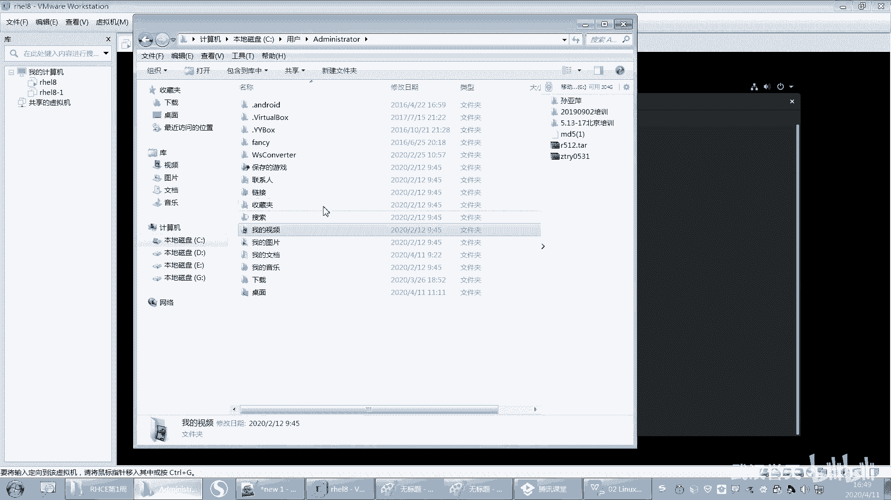

L是看吗？是看哪个目，这个目录下面有哪些文件。那么我一看就是看我当前是的目录下面有哪些文件，那有这些文件，看到没有？好。OK这就是待会我们后面会讲这个目录啊，还有LS这些命令都会会在后面讲。好。

这个地方你就做简单了解就可以了啊。也就是说你要知道你一定会在某一个目录下面，我在执执行LS是看目录的内容，那我看的是哪个目录呢？默认就是看当前目录，当当前是在哪儿呢？当前是在这里。

那我们有个命令叫PWD对PWD对它可以看我当前在哪在这里哦，我在这个目录下面对吧？好，我LS看是不是看了这个目录下面的文件呀？啊，就这这O。好，那么下面我想去往下面创建一个文件，创建一个文件啊。好。

我可以给大家提供几个这样的这个工具啊。第一个工具是我们很古老很古老的一个工具，叫nano。对，非常古老的一个工具叫nano啊，这个工具呢你可以直接回车，这个回车相当于我在这个地方打开是吗？呃。打开一个。

就是嗯比如说你你装了WPS。这一直打打开WPS是一样的。好，你看。它是个应用程序哦，呃，nano是个编辑器哦，回车好，我就可以进来之后，我就可以在这里面去输入一些。啊，比如说ABC。啊吧hello是吧。

ABC张三儿。呃，我的 mean随便说啊。啊，那么输完之后，我想把它保存下来怎么办啊？保存下来的话，下面有提示就会问你啊这个退出啊，这里有个退出这个间号呢，这个间号指的是什么？

指的是这个cttrol键啊。就是这间号指的是conttrol键，好吧，ctrol键啊，就你后面如果碰到的话，那种间号，一般情况下都是指ctrol键。所以你想退出的话，就按ctrol加Xctrol加X。

看到没有？嗯，你按一下ctrl加X就会去到这个地方。好，他问你要不要保存，那你想退出的话，你要保存吗？好，yes要保存，no就不保存，就controrl C就是取消对吧？就取消啊啊，我要保存就yes。

按一下Y就到这个地方了。好，那这个地方呢我需要保存的时候，是不是要选择一个文件名保存呢？你保存完之后，这个文件叫什么呢？好，比如说我叫fill一嗯。哎，fill一这样子啊，那唉取个文件名叫fill一好。

回车。这个文件就写好了。好，你再来看LS一看A，是不是写在这个地方啊，叫fi一啊。好，你还可以用nano呢nano fill一接上这个文件。加样这个文件是不是就回车就可以看到这个内容呀。

然后直接对它进行修改，对不对？好，这个工具比较古老的啊，我觉得对这个工具不太。😮，呀呀，你看很难用，就是怎么说呢？嗯。对，默认是保存在当前。因为我刚刚只是输了一个，我输了一个fell一，对吧？

就是一个文件名，那放在哪儿，我又没说没有说放在哪儿，那它就放在当前目录下面去了。好。这个后面我们讲路径的时候会讲到啊。好，那么这个呢就很早了啊，这个工具用用的很少。

不过我们现在你用这个工具感觉你一步一步要看它提示才能退出来是吧？好，那下面呢我们来看一下，如果我想去呃就是还有一个工具啊，叫VIM呃，不过大家可能用的叫VI编辑器，对不对？叫VI编辑器，呃。

有的里面它是VI，有的是VIM这两个工具都可以，只不过VIM的功能要比VI的功能更强大一些。哦，就是它的功能更高级一些，对吧？啊，如果你你装到系统里面没有VIM，那你就只能用VI了，好不好？

你只能用VI啊啊，那么用VI那这个地方我有VI有。😡，呃，我有VIM啊。好，VIM后面接我直接给可打开啊，回车。😊，那这是么相当于是不是把这个应用程序直接打开了呀？啊。

那么他说VIM是VI的inpro加强版升级版，对吧？升级版啊，就会有一些提示什么的。好，这个这个这个VM编辑啊，大家用刚开始入门的时候可能会有一点困难。呃，为什么呢？因为它有点复杂。

就是你不能直接往里面写，你这样写写不进去，对吧？啊，写进去了是吧？啊，那你这样写，你刚进来的时候写写不进去的啊，你瞎问瞎问，当然也可以写进去，但是你不知道是怎么回事，怎么写进去的，是吧？😡，啊。

你进来的时候是写不进去的啊。好，你要想写怎么办？😡，你就要摁一下I才可以写摁一下I。那先摁一下I，你的左下角就会变入insearch插入。嗯，一旦左下角变成了insert的时候，你才可以去往里面写。

看到没有？对，hello world。这样往里面去写，然后滋滋的这样去敲是吧？这样去敲啊。好，这就是这个VI那我想退出怎么办呢？你说退出千万不要去点这个叉叉，听到没有？点这个叉叉，你所做的这个输入内容。

它就它就损坏了，这个文件就损坏了，好不好？好，所以你你要怎么样？保存保存的话，记住啊，保存啊，你们要记一下啊。想退出保存的话，摁一下ESC左上角的ESC这个键摁一下啊，摁一下左上角键盘上的ESC摁一下。

左下角这个insert就不变了，就不见了。好，按到这种情况下，然后再来摁一下冒号。摁一下冒号，然后W就是保存Q就是退出。好，我们先摁一下W啊。好，你看你摁W的时候，它就会说什么。😡，你的保存的话。

我们知道用word来保存的话，你直接打开word，你想保存它，它是不是会让你去输入你保存的文件名是什么，对吧？所以我要这样啊冒号W，然后写上一个fell2。哎，你看我保存的文件名叫fell2。好。

然后再来回车，这样的话是不是就保存了？😡，好，保存好之后，非2就写成功了呀，就保存下来了。但是我并没有退出。那我想退出怎么办呢？我就冒号Q。退出。好，那我写的文件放哪里了，是不是在这里叫fi2啊。

叫fi2啊，刚刚我搞复杂了啊，刚刚VIM你直接敲也是可以打开编辑器的，只不过你需要保存文件名，然后嗯叫什么都要去写，对吧？你也可以这样，直接VIM后后面加上一个什么呀？😊，fill直接加上fill。

比如说我再次编辑这个文件，我就直接加上这个文件的文件名就可以了。好。等一下啊，如果你直接比如说我写个新的文件，就fill3。对这个文件事先是不存在的，你可以直接加上这个文件的文件名哦，VMfi3回车。

好，进来之后，你看。进来之后，你是没有办法进行写的，你写不进去，你看我摁了写不进去，对吧？好，那你要怎么办呢？摁一下I。😡，就是你的键盘上的I这个键。对吧I小I啊，A一下I，然后左下角就会变入插入模式。

插入模式啊，然后再来写上。嗯，你就写往那边写。好，这个时候我想保存怎么办，对吧？保存啊好，保存摁一下ESA。摁一下ESA啊摁一下ESA，然后怎么办？想要退出怎么办？好，摁一下冒号。对吧W是保存。

因为你现在还没有保存嘛，那你我能不能直接Q啊，你QQ不了啊。😡，那你QQ的话，他就会什么？他说你你没有保存哪。😡。

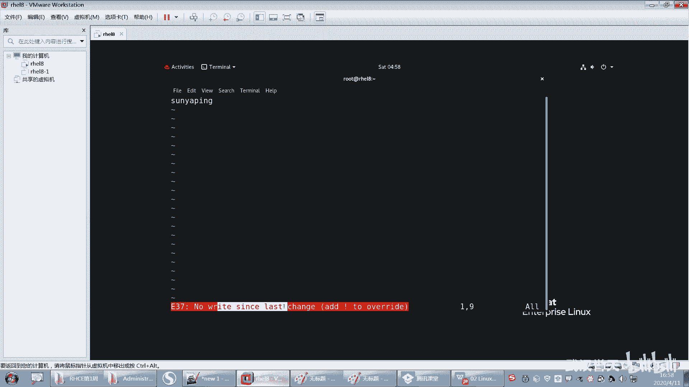

你想一下你的word，你没有保存，你想退出，你怎么退？😡，对吧你没有保存说我想退出，它是不是会提示你说。😡，要不要保存呢，对吧？那所以你要先保存怎么样再退出啊。

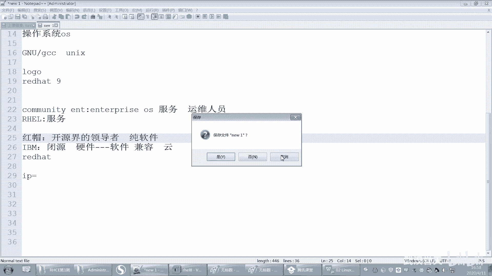

好，那先保存怎么办？你你你你不知道你在哪，对吧？你使劲摁E。😡，AEES，然后摁一下冒号。嗯，摁一下C按一下冒号，然后先W保存了是吧？然后Q你也可以一起WQ就保存退出，你要分开来也行。

写W保存冒号Q退出，这样是不是也可以对吧？好，再次来打开这个文件啊，摁一下I，然后来回移动对吧？想保存退出ESC冒号WQ能不能QW啊，不行，QW是向先退出后保存，我一定要什么WQW是保存Q是退出啊。

回车哎，你看。所以这个工具啊，你刚开始用的时候，它确实很麻烦，你搞来搞去，你也搞不明白，先按什么摁EA还是摁什么，你只要掌握一个原则，你只要想退出了，怎么办？摁ESA摁一下，你摁多少下都行，你一下不够。

你多摁几下好吧，然后摁冒号。😡，好，你说我什么都没做，我想退出我要不要摁W呢？😡，嗯，最好不要对你就直接退就行了。摁一下Q，对按一下Q这样退出了。好吧。好，再进来啊再进来。好，看好啊，再进来。

然后进来按下I对吧？你你写了，你写进去了。好，你说我老师我不想保存，我想直接退出怎么办？好，开始点叉叉是吧？不要点啊，不要点叉叉，然后怎么办？EA冒号Q我想退出嘛，但是我退不出去，对吧？为什么呢？

因为我写了内容进去，我要先保存才能退出，但是我又不想保存。😡，写个Q感叹号就可以了。感叹号代表强制退出不保存。强制退出不保存啊好，回车了，这样的话就没有保存下来。

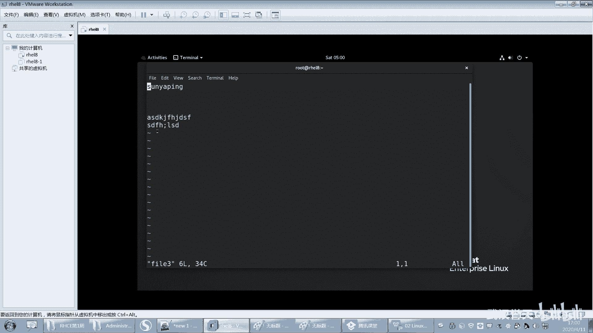

记住了吗？好，再说一遍，大家记一下笔记啊，自己记啊。啊，VM对吧？重点要学这个啊，重点要学这个，因为这个是我们后面经常要用的一个工具。刚开始你用的时候很麻烦，没关系，后面你用习惯了。

你就觉得你非常喜欢它，你非常喜欢用它啊。😊，啊，后面可以直接接上文件名，打开一个新的文件，然后你摁一下什么I。I叫什么插入，你要插入了。对。好，然后你再怎么样，想退出。

你写完之后退出就ESA摁一下ESA，然后摁一下冒号。嗯，然后摁下W保存Q退出啊，WQ保存退出Q感叹号强制退出，不保存记啊，记一下，好吧。自己拿笔记本出来记一下啊。这个一定要会用啊一定要会用。

明天我会问大家的啊。😊，明天我提问啊。shiftve加冒号。哦，对，是shiftiveve了。对冒号。我的妈。你这个你这样摁，你们摁冒号，你肯定是shift不的加冒号呀。😡，你毛。嗯。好。

这个你先先不搞这么复杂啊。先不搞这么复杂，然后先不搞这么复，先把这个最简单的掌握了。我们后面会单独找一张，我会给他讲BI编辑器的高级使用方法。啊，你先把这个就把这个记住就行了。

就满足你现在基本当前的需求，好吧，对，基本当前的需求就可以了。嗯。嗯。哎呀，开始秀了是吧？嗯。啊，你晚上晚上回去，晚上可以把这个回去练一下，好吧，重点是这个VIM啊。

还有password这几个命令回去练一下，好不好？今天已经5点多了，明天我们继续啊，明天我们我说一下明天讲什么啊，明天我们呃会讲剩下内容讲了，讲完之后呃，运行帮助和文件系统呃，基本操作。

我们明天要讲了嗯。就是明天。的任务啊面的任务。嗯，我没有感冒啊。我可能讲时间长了，我这我这个嗓子就会有点哑。就这样子。嗯，没有感冒。我很坚强。🤧。嗯，好。嗯，行。

那大家今天晚上呃给大家布置一点点小小的任务啊，其实完成了呃，完成的同学就不用做了，就是系统要装好啊。明天你可以跟我一起练，明天我要布置一些小小的作业，大家可以上课做一下。一。系统要装好啊，你敲不出来了。

你的系统OS要装好，好吧，嗯，装好之后这样啊，你们打一个快照会不会打快照啊？

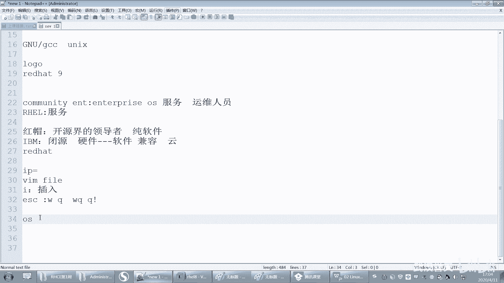

会不会打快照啊，就你这样关机，你可以哦关机怎么关机关机，你我教你啊怎么关机命令好像关机啊，INIE是吧，或者是INIT0。呃，或者是pll all，对pll off好多关机的命令是吧？

还有什么sut down。呃，杠H当然这个就算了，你就你就学这个吧，power off跟INIT0好吧，就是这两个就关机对关机啊。嗯，都就power off是吧？

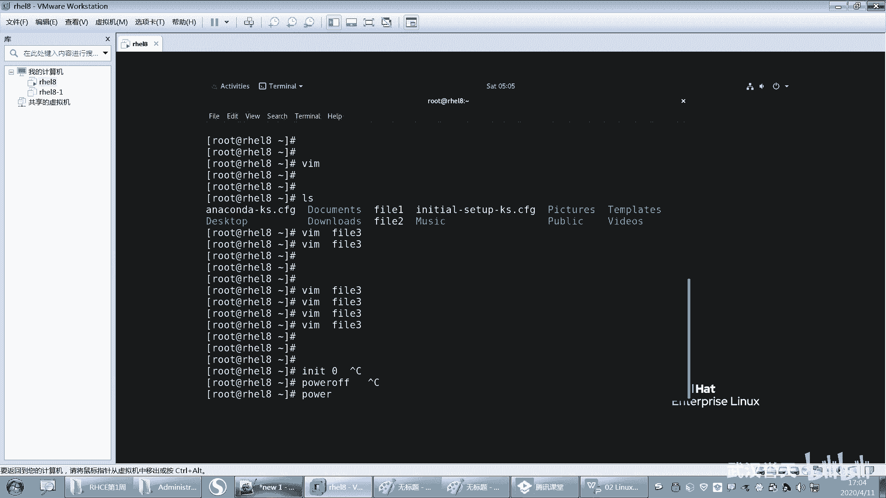

嗯。好，关机。好呃，关机了之后呢，你打个快照好吧，呃，为什么打快照呢？就你你打快，你不打快照的话，万一把系统搞崩了，你还重装系统。当然你说呃你现在多装几遍系统，当然我也同意是吧？你也可以多练几下。

但是没必要那么麻烦了啊，想装就装一遍。

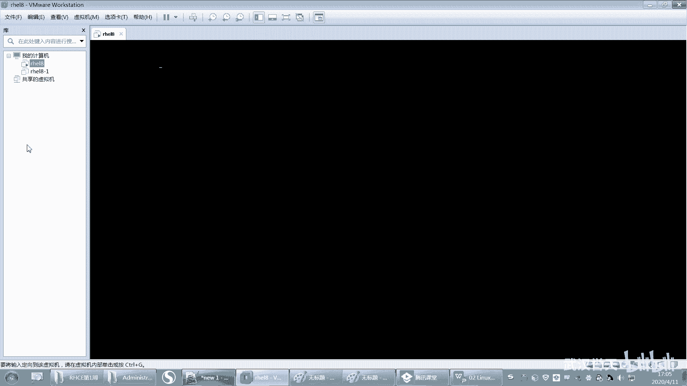

然后万一坏了对吧？你就这边打快照会打吧？那这里有个快照迅急快照啊，你看我之前打好，你看拍摄快照。你看拍摄快照看到没有？啊，拍摄快照。具有。吃饭空间不足了。哦，算了吧，你就拍下快照，然后拍好之后。

地方就会有一个快照一呃，那你拍快照有什么用呢？等下次你就可以恢复到这个快照，那恢复到快照点一下，就问你你要恢复快照吗？对吧？你说是那就恢复到你拍快照，你的那一瞬间虚拟集的状态。

对拍快照那一瞬间虚拟机的状态啊，就是就拍快照了就可以恢复了啊，这是这个虚拟机的好处，否则你装个物理机将来还没有快照。怎么卡住了？好吧，回去拍个快照啊，然后再剩下的不熟悉的同学，可能刚入门的同学啊。

你把今天讲的几个命令再去。

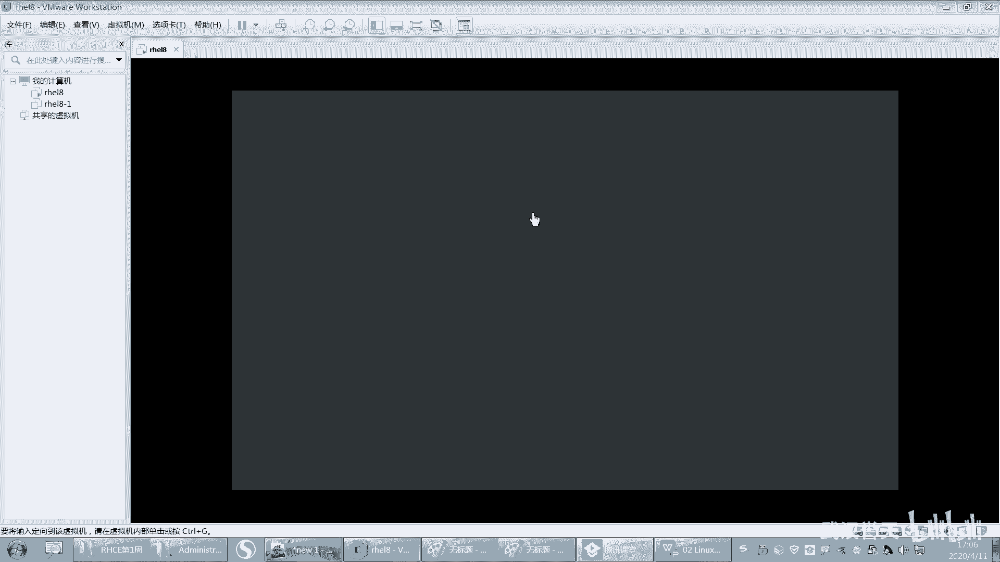

呃，熟悉一下，就这张几个命令呢去熟悉一下。然后那个界面再去熟悉一下这样子啊。呃，这样你熟悉一下，好吧。好，这今天的任务啊，今天的任务。OK呃，今天你不想做不想做就算了，明天我们统一布置任务，呃。

下一周你就有任务了啊，就有任务了。好，今天我们就到这了啊，远生同学，我们下课了啊，5。5点多。嗯，我我期待尽量不拖堂尽量不拖堂啊。O。那大家晚上好好休息啊。

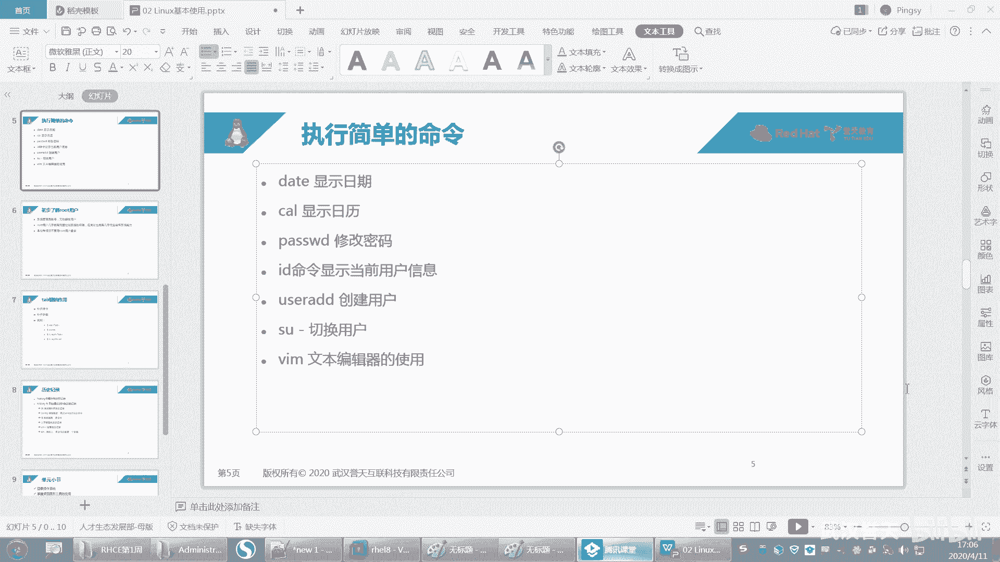