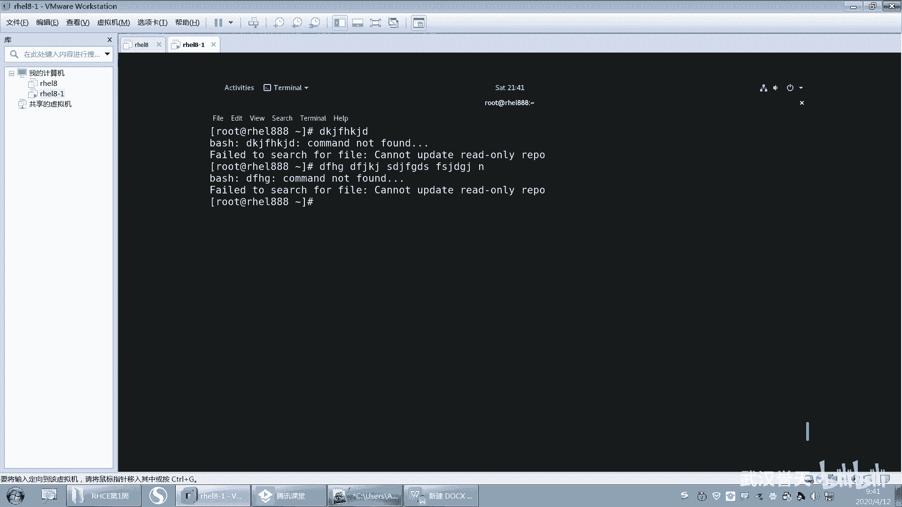
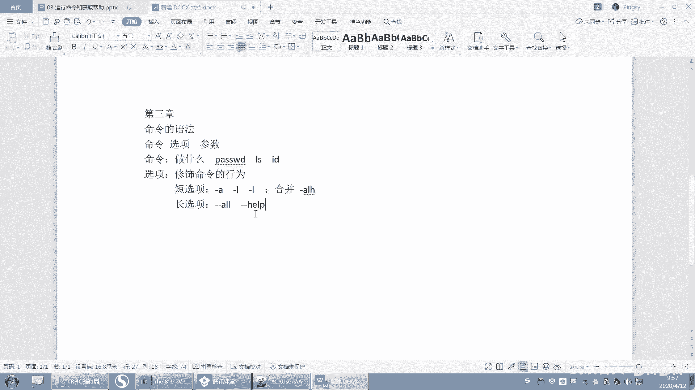
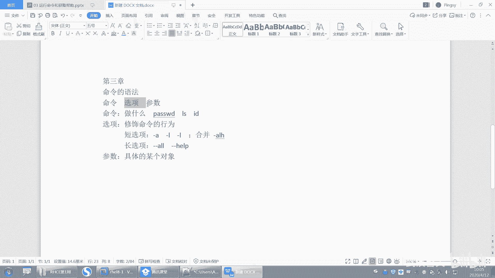

# 【已更新】最新版丨誉天红帽RHCE 8.0系列培训视频 - P14：运行命令和获取帮助-14 - 武汉誉天 - BV1cv411q74E

参数啊或者有可能是选项啊等等啊。好，现在如果我执行的话，它是不是只会报。你看DFHG这个。这个字符串是命令找不到，对吧？他并没有说什么并没有说这个这个这个这个这个这个找不到吧。

他只是说这个单词找这个单词命令找不到，所以它是将什么？将这个整个一行命令行当中所有的参数只把第一个什么？第一个当做是我们我们的命令啊，当做是么的命令。好，那这个就是命令啊，命令。所以你你有时候敲错了。

它就会报命令，找不到，一定要看清楚啊。

好，那么后面还会有一些这个选项，对吧？还有参数。其实命令呢你怎么去描述它呢？命令就是你想做什么。就是做什么对吧？你要做什么呢？比如说我要修改修改密码，修改密码的命令是什么呢？对吧？password哎。

password我想去看那看的命令是什么呢？LS对吧？我想去呃ID显示一下用户信息，那我就呃显示用户信息的命密是什么呢？是ID这就是命令，就是你要做什么啊，对你要做什么。😡，好，那么后面这个注意啊。

命令和选项中间后面这个选项啊，它是有什么？它是有个空格的那至于中间你空几格的话无所谓，你中间随便空，只要你要空格，但是不能不空格，听到没有？不能不空格啊。好，选项我也可以去加一个选项啊。

好，这个时候我们来去举一个例子啊，比如说我们用LS来去举例。LS来去举例啊，LS是一个命令，它只要能够执行，它就不会报什么命令，找不到。它如果不是命令，就会报命令找不到啊。啊，LOS执行了。

可以看到一些结果，对吧？看到一些结果啊，这就是我们的什么文件和目录。大家可以看一下，这个会带有颜色的这种这种颜色的是吧？这种啊反正白色还是什么颜色，反正就是这个这个颜色的是吧？啊，它是这个文件。对。

文件啊，大概去区分一下啊，这个呢这个带有颜色的这个反正也不知道什么的颜色，蓝色还是什么颜色。嗯，既然看颜色都看看看。看着觉得我眼睛有毛病了啊啊，这个这个就是蓝色，对吧？对，蓝色啊。

蓝色的话它就是什么样啊？它就是一个目录，对，它是个目录啊，大概这样去区分一下，好不好？OK好，那现在呢我想去看，但是我看呢，我只能看到文件名跟什么跟目录，但是我想去这样看，对吧？那想去这样去看。

或者是怎么样啊，想看这个文件的怎么呀，一些详细的信息，看到没有？那后面有什么时间哪类型啊，大小啊，对吧？好，那么我就可以去加一个什么呢？加一个选项加一个选项了啊，注意要空格那空格啊。

这样空格你空几格无所谓，好吧好？后面这个选项呢，我们要用一个杠来去表示杠要杠啊，加上一个杠表示我要去执行，加上一个选项了啊，后面是选项好，对，有一个L，比如说L。😊。

我们可以用L啊，杠L对，杠LL呢这是列出详细信息的意思啊。那么这个字母如果作为选项的话。它叫短选项，就是一个字母作为选项，叫短选项啊，叫短选项。好，那这样我看到的结果是不是就跟这个是不一样的。唉。

这个就是只有文件名，对吧？但是这个呢就会有一些文件的详细信息，后面就是文件名，对，文件的详细信息，后面就是文件名啊，那么这个选项还可以怎么还可以怎么加呢？我们还有其他的选项啊，比如说LS看对吧？

我们还有杠A对杠A啊，啊杠A呢你会发现它执行的结果里面就会有带有这种什么唉一点开头的文件，那LS是不是没有一点开头的文件啊，那LS杠A就会查看到什么？一点开头的文件，那么这种一点开头的文件呢。

我们叫做隐藏文件，叫隐藏文件啊。好，那我么为什么LS看不到呢？因为这种隐藏文件一般情况来说，它是一些比较重要的文件，对吧？啊，中要文件隐藏起来。但是我们可以通过一种方一一些方式加选项的方式啊。

然后去查看到这些隐藏文件。好，所以你可以发现怎么样啊？如果你加不同的选项，最后显示的结果是不是不一样的对吧？好，所以我们称为这个选项啊。

它是修饰，我我是这样总结的啊，修饰。命令的行为。对修饰命令的行为啊啊呃怎么说呢？就比如说啊你你们家现在呃，比如说我们有很多。哦。语法中的副词是吧？这个我也不知道怎么去形容它啊啊，你就像这个什么嗯。

我举个例子啊，比如说我们的。😊，哎，原来我们俩在教室里面上课，我就是经常举电风扇的例子啊。嗯。就你用其他例子也可以，好吧，呃，或者是你家的电视机，反正都是我们当做什么，哎，当做电风扇是一个命令。

它可以扇风，对吧？它可以做什么，它可以扇风，打开电风扇，但是删的时候我们可以怎么样，我们可以让它怎么样摇头啊，还可以换挡啊，那什么摇头换挡啊，这些是不是就是类似于是它的什么，是它的一些选项。

它可以怎么样，它可以去改变这个命令的一些行为或者修饰命的行为，怎么怎么扇风对吧？呃，摇头扇还是怎么样，还是一档二档三档风去删，对吧？所以这个就是选项啊，选项，那同样它是不是都是看呢L你再怎么加选项。

对不对？它依然是什么呀？依然是看，它不会变成写了吧？对它不会变成写了啊。😊，对，就是命令的功能嘛。😡，啊，命令的功能啊。就像你家的那个做饭的那个电饭煲一样，对吧？它可以做饭啊，它还可以做。

一会儿别说饿了。啊，所以就是修饰命运的行为啊，就是个选项。好吧，那我怎么知道它是个选项呢？是不是加个杠啊，哎，加个杠，然后后面加一个字母，哎，然后还有杠L，对不对？

好，那么我们再来看啊。L。还有一些选项啊。那杠L跟杠A这两个我怎么去？比如说我又想看什么，我像又想去看这个文件的隐藏文件，又想看隐藏文件，又想看它的什么详细信息都想看。啊。

所以这个时候我就需要去联合将这两个什么哎，将这两个参数唉。啊，将这两个参将来这两个选项是不是一起使用啊，对，一起使用啊，那怎么将它两个一起使用呢？那比如说杠L杠AOK如果去这样执行的话，OK看这里啊。

啊，我们看一下啊，这样的话就会本么样就会报错，看到没有？就会报错了啊啊。哎，别说了啊，一会儿跟我说饿了，我是我肚子该叫了啊。好，LS杠L杠A啊杠A，那么这个就会报错了。看一下报错啊。

无效的选项invald无效的选项杠I杠是吧？这个选项是无效的。注意啊，所以如果你想加多个选项，注意啊，它们之间要有空格，要有空格啊。这个地方要有空格，看到没有？一定要空格隔开啊。你空几格没有要求啊。

回车这样才可以执行成功。看到没有？LS杠L杠A啊，杠L杠A。这就是多个选项联合在一起使用啊，一起的使用。好了吧，好，那大家来看一下啊，我大概给大家看一下这个里面的一些呃这个这个详细信息里面的一些内容啊。

好，我们可以看到这个地方我们能认识的啊。😊，呃，这个地方有一个数字，这个数字呢是指这个文件的大小，文件的大小啊，那么这个大小呢单位默认是字节，就是单位默认是字节啊。后面这个这个呢是一个时间，对吧？

就相当于什么？相当于这里嘛。

呃，这就是大小嘛，对吧？啊，这边是有个时间呢，修改时间，这个确实也是修改时间啊，这是这个文件上一次修改的时间看到没有？这个文件上一次修改时间啊，好，嗯，如果你想去看这个文件的什么。

这个文件的这个这个这个大小，但这个大小我还要去换算，它等于这地方等于4K，对吧？但是如果它很大的话，我就没办法去这样去就去计算了，脑子计算不过来，对吧？好。

所以那我就可以加一些选项来去改变这个显示的行为啊。😊。

好，那我加个什么选项呢？比如说LS嗯。杠L对吧？然后杠H哎，加一个杠H加两个选项，杠H啊。好，那这个地方是不是就会变成什么？就会变成1。5K，然后没有换算单位的呢，依然单位还是字节看到吗？

依然单位还是字节啊，那这样我就不是实现两个选项之间的什么之间的一个这个这个呃联合，对吧？啊，那我反过来LS什么LS杠H杠L可不可以呢？反过来是不是也可以执行？那这样反过来是不是也可以执行啊，对吧？

所以先后目前为止它没有什么区别啊好，那么我能不能只示H呢？你只是H怎么样啊，是没有用啊，你光加个H，这个地方没有用。所以你看有一些选项它们之间是有关系的，就是你你只有显示详细信息的时候。

才能怎么样查看这个呃这个这个这个大小换算单位进行换算啊。好。OK那我们刚刚讲了什么呢？😡，我们讲了什么，怎么将多个选项唉进行联合使用，对吧？好，我们现在有3个，我们刚刚学习了三个啊，一个是什么？

一个是LH杠A对LHA这三个选项啊。那这三个选项的位置呢，你对于LS来说，前后顺序没有什么区别，就随便放啊，随便放好，但是如果我这个选项比较多的话，比如说我还可以加什么杠呃杠I呀，什么杠呃嗯呃杠R啊。

反正很多很多的选项，对吧？那么这些选项如果我都想去加的话，那这样是不是觉得很复杂呀，很乱，对吧？很多很多啊，都要敲一个杠好，这个时候我们可以将这些选项进行合并。将这些选项进行合并啊。L杠LH怎么样？呃。

A对LHA那这个执行结果跟什么跟杠L杠H杠A的结果是一样的啊。对你只要进行合并，你只需要加一个杠就可以了。注意啊。为什么我加一个杠的时候，他就知道我后面是什么？是三个选项呢？注意我们说一个杠是短选项。

那么短选项就会认为只要杠的后面是一个字母，就会做一个选项，所以它会区分出什么？L是一个选项。H是个选项，A是个选项，那么就有三个选项。这个能不能听懂？对，就有三个选项啊三个选项。啊。

OK所以你只要写个杠，它就会什么，它就会识别出后面哦，这头是单个字母作为选项的啊，单个字母作为选项。同理可得。如果你只写两个，它就会认为两个选项写一个就一个选项，对吧？好，这就是选项啊，短选项的使用啊。

短选项的使用。然后你可以怎么样来进行一个合并记记记笔记啊，合并然后杠ALH那目前为止这三个顺序你可以随便放对，顺序可以。

注意哦，只是目前为止这个顺序可以直随便放。如果以后遇到了呃有一些命令，这个顺序是有特殊要求的啊。所以对于LS而言，目前为止它是怎么样，它是可以这样随意，就是你H放前面也可以啊，对吧？A放前面也行啊。

都可以啊，没有什么影响，好吧。好，这就是进行合并啊合并。嗯，另外这是什么？😮，我们刚刚说这是短选项，对吧？单选项我们需要怎么去调用？我们需要一个杠短。选。啊，短选项是吧？这个短选项啊。好。

还有一种选项还有一种选项啊叫长选项。还有一种选项叫长选项啊长选项啊，长选项是什么意思呢？哎。

好，比如说我LS。G干。就两个杠就是长选项啊好杠杠2。啊，我加一个单词叫or回车。这个跟什么跟杠A的结果是一样的，你会发现啊，跟杠A的结果是一样的，但是区别在于我这个地方用的是字母作为选项。

这个地方我用的是什么？是单词作为选项，所以如果你一旦是单词作为选项的话，那么请注意怎么样啊？前面要加杠杠，你想一下，如果你是杠ALL，它是不是会认为这个地方接了三个短选项，对吧？

所以如果你是单词作为选项的话，那么前面一定要加两个杠，这样是不是也可以直引成功，为什么指引成功了？因为它怎么样？它是不是将你把这个or看成了三个短选项了，因为你前面是一个杠啊，啊，那长选项的话。

就是怎么样？就是两个杠，看到没有？啊，好，还有一些长选项，比如说呃杠杠help呀等等啊，这些它都有一些常选项。好，那有同学问老师，你说你这个又是长选项，又是短选项，对吧？那我到底用长选项还是短选项呢？

这个你可以自己去选择啊。比如说老师那明明有短选项杠A，我干嘛还有杠杠or对吧？那对你而言，那我肯定用杠A呀，我干嘛去用杠杠or呢，效果都是一样的对吧？但是前两天有同学告诉我啊，有一个学生他嗯。

他去他去执引他经常过就是他很有很有意思啊，然后他经常会去呃他学习这个例子嘛。目前好像他在一直在学习当中，然后他就就写一些呃我什么博客呀，或者是写一些笔记啊，他都会给我们分享，看一下，他说这个这是我写的。

你帮我看看怎么怎么样，对吧？然后有的时候我也会分享给学生嗯给给给大家看啊，然后他就说老师我发现我执行命令的时候，我喜欢用长选项为什么呢？呃，他说长选项啊呃好记，因为他是一个单词，你像我每次去记什么？

呃LOS杠A我是不是要知道杠A大概是什么意思，我才知道哦什么呀哦，他是word这个单词，对吧？所以我知道哦他是显示所有的所有的文件，包括这样隐藏文件，但是对于你不熟悉的命令而言，你熟悉的。

你可能用杠A对吧？对，对你不熟悉的命令，你是不是更喜欢用这种这种什么呀。😊，看见这个选项就知道哦，是什么意思，对不对？刚刚help怎么样啊，是不是救命啊？哎，他可以帮助去理解救命对吧？那我就帮助啊。

是帮助也是救命的意思啊。😡，对，它就就是长选项跟短选项有各自的优缺点。对有各自的优缺点啊。嗯，这种方便我们去记忆，对，方便去记忆，方便去使用啊，一看就可以看出来，对吧？好。

这就是长选项和短选项自己去选择，好吧，你想用哪个就用哪个啊。

🤧好。长选项喽高杠O。然后什么杠杠help等等这些啊。那么长选项之间是否能进行合并呢？我们来看一下啊。

嗯，LS杠杠O杠杠hel这种这种选项，如果你你想一下啊，有时候选项它也是分的，它不是说所有的选项放在一起，它都能什么嗯，这个这个选项是显示所有的文件对吧？但是这个选项呢。

它是显示这个命令的什么一些帮助信息，待会我们会学习的这个杠杠help啊，它显示的什么一堆这个哇好多是吧？这是不是这个命令的一些帮助的信息，啊，那么你将这两个选项放在一起，它有什么意义吗？

你想一下它是不是有可能没有什么意义啊，对吧？这个是显示所有的文件，这个是显示它的帮助，这个LS命令的帮助信息，那我这样显它虽然显示成功了。嗯，但是他们两个放在一起，实际上是没有什么意义的对。

实际上是没有什么意义的啊。好，那这个是可以加多个多个什么多个长选项。但是如果你想把这两个选项进行之间进行合并的话，那我们之间是怎么合并的？那这样肯定不行，对吧？

他说那unreized叫未识别的未识别的啊，reze叫识别吧，辨别是吧？按就是未识别的嘛？选项对吧？他说识别不了这个选项没有这个选项啊，那如果说你把杠杠去掉的话，那么它就会又会说报未识别选项。

因为没有一个长选项叫all help。对，没有一个长选项叫all help啊，所以这就是长选项，长选项不能进行合并啊，它可以多个连用，但是它不可以进行合并。注意啊。因为你合并之后，我怎么去区分。

这是一个单词啊，我怎么区分这是一个单词啊，对吧？我没有那么聪明啊，我不知道这个all是个单词，help是个单词，OK吧，所以大家在用的时候一定要注意啊一定要注意。😡。

好，这地方OK吗？这个是选项怎么去使用？选项怎么去使用啊？好，那我们继续啊。最后呢我们就会有一个参数。参数啊，那么这个参数是指的什么？参数指的是具体的某个对象。我这样总结啊，具体的某个对象好。

呃，我们一直在看对吧？那看什么东西呢？LS对吧？LS看LS杠L如果我直接LS杠L去看的话，那么是看到所有的文件呃，所有的文件包括目录，这这都看到了，对吧？那我杠A的话，我可能怎么样，要看所有的文件。

包括隐藏文件，对，包括隐藏文件啊，那我想看某一个，比如说我只想看其中某一个文件，那我可以加一个什么。加一个参数，对我只想看其中某一个文件就加一个参数，这个叫参数。那我怎么知道它是参数呢？因为你没有加杠。

能理解吧。你要加个杠。他怎么样？他可能认为你是选项了，所以你没有加杠啊，那就什么？它就是参数啊，对不对？好，就是参数啊，就是怎么区分选项和参数，命令很好区分。第一个就是命令，哎。

选项就是带杠的或者带杠杠的那参数呢？一般啊你说参数是不是一定放到最后呢？不一定啊，这个不一定啊啊怎么区分参数，那就是没有加杠啊，对吧？他就把它当参数去使用了啊。好，那么这个就是参数。

就具体的某一个一般是指的啊，比如说你像我password。us一对吧？那么这个用户名是不是就是个参数啊，它是具体的某一个对象嘛，是文件还也好，是目录也好，是用户名也好，是不是都是某个对象，对。

都是某个对象，这个叫参数。好，请大家把就是你跟你平时想到的那种什么命令啊，选项啊，参数不要弄混了啊。我们这个地方所说的命令选项跟参数，命令就是要做什么选项就是这个这个选项，参数就是具体的某个对象，对。

具体某个对象啊，这个叫参数。好，我可以去看什么，我可以去看其中任何一个文件，我只要加这个参数。当然我有些时候还可以加多个参数。比如说唉我加了两个参数，看到没有？这地方加了一个参数又加了一个参数，对吧？

加两个参数。但是参数可以有多个参数与参数之间注意要有空格，参数与参数之间要有空格啊，就是你这个之间你肯定你要把这个空格给去掉了。

他就会认为怎么样啊，这是一个参数，看到没有？这是一个参数，它就会报错，说没有此文件和目录。因为LS后面接的参数一般都是看什么看文件，看目录啊，所以你接的这个文件不存在，它就报错了，因为它无法区分。

这是两个文件，所以在我们linux当中啊，空格是一个特殊字符，空格是一个比较特殊的字符，它是用来区分什么呀？命令和选项之间用空格，选项跟选项之间也有可能用空格，对吧？选项与参数之间是不是也有空格呀？

参数与参数之间也有空格能理解吗？参数与参数之间也有空格啊，所以空格一定不要忘记了啊，空格一定要不要忘记了。啊，他没有那么聪明，不像我们人，对吧？一看这两个两个，但是他有空格来去区分啊。

好，记住记住一句话啊，你们写一下啊，命令和选项选项和选项选项和参数参数与参数都是什么样啊，都是中间要用空格隔开啊，你们自己记一下啊。命令与选项选项与选项选项与参数，参数与参数记住标重点是中间用空格隔开。

中间空格隔开啊。🤧嗯嗯。记好啊。好。那我们可以有多个选项，可以有多个参数，能不能有多个命令呢？大家觉得能不能有啊？

多个命令可不可以？就是我在这哇执行两个命令。哎，执行个pas呃执行一个什么呢？LOS再执行个password，这是这是不是两个命令啊，对吧？啊，那这两个命令想要一起执行的话，那你这样肯定会报错呀。

因为怎么样啊？它永远识别第一个是命令，对吧？然后第二个呢就是参数。对，第二个就是参数，那没有这个参数就报错了啊。好，所以命令不能有两个命令在这一个在这一行当中啊，那如我就想执行两个命令怎么办呢？好。

我们后面会学习一些连接符号，连接符号来去连接两个命令啊，但是在目前为止，大家不能执行两个命令啊，不能同时执行两个命令。对他把后面这个当参数了。对，当参数了啊。

好。那我们从这么多案例当中去发现啊，发现什么呢？发现命令选项跟参数必须要有的就是哪个必须要有的是哪个是哪部分啊？必须要有的是哪部分？嗯，对。必须必须要有的是命令啊必须要有的是命令。

对你总得知道我要做什么吧，对吧？对，命令是第一个啊，选项和参数可加可不加，也就是说不加选项能不能执行，不加参数能不能执行是可以的对吧？我们发现LS这不也执行。哎呦。

L这不也执行了吗？对吧？好，只加参数可不可以也可以，只加选项可不可以，当然也是可以的，所以命令是必须的啊，但是。我说的是。

那能不能达到你的效果呢？能不能达到你想要的效果呢？对吧？你要想达到你想要的效果，你必须要加参数和命令啊，嗯，对吧？那至于这个命令能不能执行，只为执行的话。

那必须要有的是命令参数呢和选项呃不一定要有啊不一定要有。但是对于有的命令而言，参数跟选项可能必须要加这个看具体的某个命令啊，好吧，OK。好，这个就是我们的命运的语法啊命运的语法。😊，好。

那我们来看一下啊，嗯，我们书上写的那项与项之间要用空格隔开，这句话很重要啊，要用空格隔开。啊，option呢是修饰一个命令的行为，还是选项单个字母作为选项。

有这个这个啊单个单词作为选项有什么有杠杠这种啊好，参数呢就是一个文件名目录名，或者是具体的某个对象，这个叫参数啊，那刚刚这个地方我们说如果你想执行多个命令。我们这现在我就教大家啊，怎么去执行。

比如说我们之前学过一个命令叫叫叫叫叫。

叫贝塔。学过吧，还有一个叫CAL学过吧，这两个啊，一个是显示日期的，一个是显示什么显示这个日历的啊，日历的。好，那么这个日期跟日历我同时都想显示怎么办？我怎么着dataCL这样肯定这样肯定不行，对吧？

好，我同时都样显示，我们可以用中间加一个。嗯什么知道吧，分号。哎，中间加一个分号就可以了啊。看好啊，回求。那中间加一个分号，它就会先帮我去执行data。

然后再帮我去执行什么CALCAL这个这个这个这个执行的结果。好吧好，那么这两个命令呢，我先执行CAL再执行data，它是不是先显示CAL再显示data，它就是先后关系嘛。

就是先执行哪个后执行哪个但是这两个命令之间有没有关系呢？注意啊，这两个命令之间是没有任何关系的。没有任何关系。比如说啊我前面执行一个错的。😡，后面执行一个对的对吧？嗯，前面执行一个错的。

后面执行一个对的回车。那错的怎么样啊，说命密没有找到，那对的呢，是不是后面也执行了呀？看到没有？所以这两个之间是没有任何关系的，你执行错了还是对了，跟我执行执不执行或者执行对了还是错了，没有关系。

没有关系啊，一定要注意，好吧，嗯，这就是分号啊，分号。分号隔开的两个命之间没有任何的逻辑关系。对。也没有逻辑关系，也没有因果关系，什么都没有。记记住啊，封号好吧，记住这个啊。封号嗯。

用封号隔开的两个命令啊，中间没有任何的关系啊。记好了吧。有没有在记啊？来拍张照片，我看看你们记的笔记。没有照片是吧？哎呀，很棒啊。哦，我之前有有的有的同学做的笔记非常棒，我觉得他都可以拿到做模板了。

可惜我当时我没收留一份，应该收藏一份。你看这个同学大家可以展示一下自己的这个。给别人做一下借鉴啊，别人有同学不知道怎么去做笔记。好。不。那么我们之前学的这些命令啊，我们学的不论是LS啊。

呃，还是date呀，还是CAL啊，还是password呀，对吧？那么这些命令都是由我对孙老师是吧？然后给大家告诉大家说怎么去用啊，唉，怎么去使用啊，啊，怎么去使用这个选项啊，怎么是使用这个命令呀。

后面参数应该接什么啊，对吧？好，那么如果让你自己碰到一个命令呢？对吧？你怎么去查你怎么去看这个命令的语法是什么样子的，我怎么知道它有这些选项，我知道它有哪些短选项，有哪些长选项，后面参数应该接什么。

对吧？所以接下来我们就要去什么学习一下这些命令之间啊，命令怎么去寻求帮助啊，寻求帮助。

好，那这地方有一句话啊，我们要记住对，怎么去获取帮助？呃，不要尝试去记住一切。呃，之前有很多同学他他有他非常苦恼，不是一个两个啊都跟我说。老师我这个脑子啊就是记不下来，这所有的秘密太多太多了。

我我太我太难了，对吧？我根本记不住怎么办呢？你说我这还能学下去吗？我要崩溃了，是吧？我说别呀别崩溃啊。他说老师，你怎么都全都记下来啊，你怎么那个练的这么熟啊，我说我要是记不下来，对吧？

我们白白敲这么多遍，对吧？就给大家上课，就你看我一年上上多少个班，然后我就敲几次啊，对吧？所以这个东西就是熟能生巧。对，这是第一点啊。啊，第二呢，你不可能去记住所有的命令的。😡，你这也不现实，对吧？

所以你要会去找帮助，对，记个大概之后去找帮助，这个是非常重要的一个技能。好，这是其中一个，这是我待会儿给大家讲的。另外一个最后一点。就是什么笔记。最后一点就是笔记啊。笔记太重要了。

我不是说你上HHC一这个要去完成我的任务笔记，而是说你学完之后，你可能这比如说你4月份学学到6月份7月份考完了，正常也考过了。好，okK是否你符合符合了，是否你永远都记住了，不是这样的。

因为你过一年之后或过一段时间时候，你又回望了，那我你会回想去当初HHC1，对吧？上了什么内容，你的脑子是想不起来的。对你只有去翻译以前的笔记啊，哦，这些我上过哎，这些我知道对吧？我忘记了，回去看一下。

😡，对不对？这是不是就是你学过的东西，你你只有什么记下来，对，记下来啊。😡，回去去查。而且比如说一些重要的步骤，比如说将来你搭一个服务啊，搭1个HTTP对吧？那搭1个HTP服务，如果你的步骤对吧？

你是是把笔记做好，记录下来，哪些配置标注注释注释上，那么这个时候你以后再用到的时候，你是不是就没有你不用去百度了呀？要不然你总要去怎么样去百度，而且百度的结果不一定是好的，不一定是正确的，对吧？

这都是你的经验积累，这都是你之前做过的事情把它记录下来，这个以后你再去翻非常非常的重要，对我们来说，听到了吗？对给大家经验啊。😊，好，一定要去做这样一件事情啊，一定要去做笔记，一定要去整理自己的笔记。

好。OK所以这有一句话说，你不可能去记住一切东西的。因为你要不停的怎么样去接收新的知识，对，接受新的知识啊，你也不能记记住你你脑容量也没有这么大，对吧？嗯。意议。啊。

OK下面我们来看一下这个我们系统当中自带的啊，有一些不同级别的一些帮助资源。对不同级别帮助资源。那么我们怎么去使用它啊？首先第一个我们要学一下一个叫word is啊，what is。

好呃。好了，那么下面啊嗯我们我先教大家第一个啊，第一个其实我们执行的命令第一个帮助啊，我们执行这个password或者执行L这些命令。那这些命令是怎么判断它存在还是不存在呢？OK吧啊。

我们可以去查这个命令其实命令都是文件。命令都是文件。那这个命令到底是哪个文件呢？我们可以去查啊，这样查叫which else。好，看这里啊，同学们看这里啊。对，只有写才不会犯困。对，是这样子的啊。

要不然就容易睡着了，像我声音这么好听，对吧？当催眠曲了。好，那么LS啊这个命令那。它是哪个文件呢？它是这个文件，看到没有？它是不是USR并L啊，对吧？它是不是这个文件看到没有？那这个有路径好。

那你看一下password啊。😡，那password这个命令是哪个文件呢？是不是这个文件啊？看到了吗？啊，那我随便敲一个哦，这个命令不存在，为什么不存在啊，你查一下呀，which啊，查一下。😡，有吗？

没有看到没有？没有这个文件。在这下面没有这个文件，好吧，好，那至于他怎么去找到这个文件的，注意啊，这个后面我会讲啊，你先知道就行了，你就知道什么which这个命令可以去查看后面这个命令怎么样啊。

它是哪个文件？对，是哪个文件，为什么报命令找不到，是因为这个文件根本不存在。对，找不到它，找不到它执行不了，对就报命令找不到啊，所以这就是命令O吧。这是第一个大家记一下啊。

which是后面接命令可以去查命令是哪个文件，对，命令是哪个文件，如果这个文件不存在，那么就会报命令找不到，记下来了吗？如果这个文件不存在，那就会报命令找不到啊，这个叫which which啊。

第一个帮助哦，第一个帮助啊，这我PPT上没写啊。

呃， which。还是查找是吧，查找命令是哪个文件啊。呃，如果查找不到这个这个这个这个是哪个文件，那么就说明什么，说明这个命令根本不存在，根本不存在。如果查到了，那么这个命令就存在啊就存在。

好，这就是为什么命令有时候为什么不存在呀？就这个原因啊。😡，啊，第一个这第一个。第二个。我想去看一下这个命令，那password对吧？我告诉大家说它是修改密码，那么它为什么是他他你告诉我修改密码，对吧？

那我想知道那你新新比如说CD啊，那CD是什么意思啊，对吧？那我不告诉你怎么知道呢？好，可以去简单的去查一下啊。😡，用 what what what。What is。用what is来查啊。嗯。唉。

这个查不了啊。等一下啊。等一下啊。分开呀，没有啊，他他这个命令是这样的，which what。what is它是一个命，看到没有？没有分开啊。呃，word有没有呢？word是没有这个命令的啊。等一下啊。

好，现在有了啊嗯。你的命令刚刚就报这个错啊。你们查能不能查到啊，是报这个错是吧？😡，nothing什么什么合适的是吧？啊，你们报这个错，为什么会报这个错呢？因为这个命令啊，你刚开始用的时候是嗯。

你刚开你比如说这个系统刚装了，刚装装好之后，这个命令是用不了的那什么时候能用呢？你第二天就可以用了，你放一天把这个系统放一天，第二天开机就可以用了。对，开机就为什么是这样呢？

因为这个它需要它需要这个更新数据库啊，那你你想立即去使用它怎么办？你去执行这个命叫mandy B，好吧。大家去执行这个命令叫manD B啊，这个后面会给大家解释啊，这什么意。

为什么会会出现这样的一个状况啊，你先去执行好吧，先去执行才能有what is这个命令的使用啊。🤧嗯。对，放一天是吧？嗯，对你放一天，你第二天就好了。对啊，为什么我这个我这个系统装好了，为什么？

因为我之前是恢恢复快照了，我我装好之后立即就恢复快照了。所以嗯它就还没有放到一天。对，还没有放到一天啊，就你放一天啊，第二天就可以查了。好，如果你想立即查的话，你就manDB这样去查。好吧。😊，嗯。

对他要自己熟悉一下是吧啊。😊，OK这个是what is啊，what is呢还可以查看什么这个命令的一个简短的描述。嗯，它是用来更新数据库的啊，更新那个数据库的。呃。

menDB啊manDB刚刚的upDB好不行，你要。呃，执行面D别up低件up updateDP好像是那个locate的那个好像是locate的吧。是不记反了？是长那个loK的那个。

locate那个命令的时候，用的是阿利BB吧。嗯。啊，我可能也记反了，就是manDB啊，你有记住man嘛帮助嘛，对吧？好，然后what is L啊，这个是查看这个命的一个简短描述。那么LS呢是干嘛呢？

它是列出目录的内容，列出目录的内容啊，看到没有？它是不是简短的描述啊，然后我们可以看下password。啊啊，当然这个pas错有点多是吧？好，我们看这个啊，看这个它有多有多个。

待会儿我讲讲讲那个后面那个慢帮助的时候，会给大家说这是什么意思啊？啊，那么看这个啊，这个是更新啊，当然第一个你也可以看嘛，这是不文件呃，密码文件对吧？pa做的文件哦，有可能它还是个文件，对吧？

然后这个呢是更新怎么呀？更新用户的哦，这个是昨天学过的是么？叫认证的tokens，对吧？就是就更新用户的认证嗯口令，就是更新用户的什么密码，更新用户的密码啊。啊。

这是这个呃what is啊好what is date呀，你都可以去查呀。啊，what is CAL啊。

