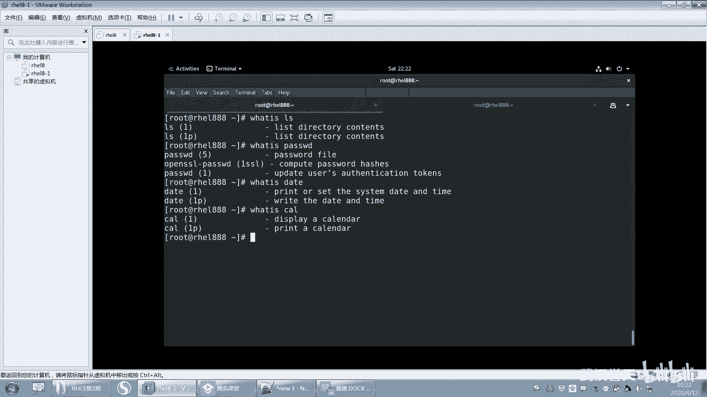
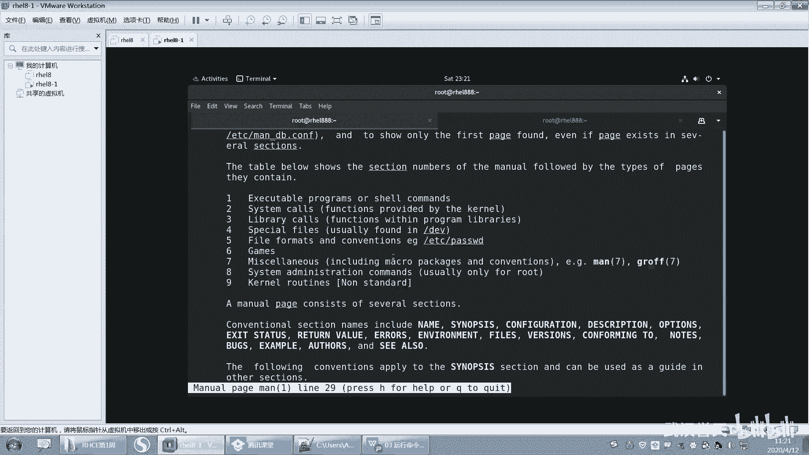

# 【已更新】最新版丨誉天红帽RHCE 8.0系列培训视频 - P15：运行命令和获取帮助-15 - 武汉誉天 - BV1cv411q74E

好啊。嗯，what is data就打印和设置系统的时间、日期和时间，对吧？然后CL呢就是显示呃canada Canadaada就是日历的，也就是那个日历那个单词叫canada。呃，缩写CL对。

又认识个单词，对吧？看ada就是那个日历那个单词啊。这个英语没过关的啊，这就不认识的这个这个这些单词不认识的啊，就是那个初中小学啊，你们应该是小学就学过英语吧。小学没过关的啊，小学初中肯定没学英语。

没好好学的。这小学初中英语啊。我估计高中应该都学过吧。嗯。高中的时候，英语单词比这个要难的多了啊。啊，那这个是我们的这个what is啊，what is它其实作用就是简单的描述一下，对。

简单的描述一下啊。

好。我我的一直没皮。哦，你厉害嗯，可以啊。嗯，哼。好，这是第一个啊这是第一个what is好吗？😊，啊，你可以看一下这边啊嗯这个word is呢它是显示这个命令的简短描述。

但是呢它是基于数据库的查询定时更新。对它是定时更新的啊，就有可能今天你新装了一个命令。那这个命令呢可能用word就查不到，它需要什么？第二天就查到了。但是没关系，我们可以让它立即查到么？

是不是执行man db手动更新数据库，手动更新数据库，它是基于数据库的查询啊，对，它是基它不是实时的查询，它是基于数据库的查询。你用manb可以什么哎可以去这个更新这个数据库啊，那安装后不能立马使用啊。

好，然后这是一个例子啊一个例子，这个不是我们的重点啊，你知道就行了。哦。嗯，可以可以，但是更新数据库的时候，大家为什么？你看为什么说放一天就好了，因为它会在凌晨的时候更新。一般数据库这种更新的话。

它不会说让你在大白天的更新。因为大白天你的业务一般都会比较忙。能理解吗？就是你的比如说你在处理业务CPU内存等等就比较忙。那你更新数据库，你看我刚刚更新是不是更新了半天呀，对吧？

呃，没开机不会更新，它在开机之后就会更新了。开机之后你放一天，开机之后就会更新，没开机不会更新啊。没开机，它怎么更新啊？嗯，你看我更新更更新了半天，对吧？那这个是耗资源的啊，这个会靠耗资源。

所以不要在你的系统繁忙的时候去更新。一般在。没有呃，不没有人使用的什么？夜夜夜黑风高的晚上，对吧？你去更新它，好吧。

嗯。好嗯。要不休息一会儿吧。对，因为这个word is这个命令说实话它不怎么重要，你不怎么重要，你有没有必要去更新它呢？为什么就一天更新一次呢？那重要的是不是就是很短的时间内才会更新。

那不重要的是不是一天更新或者是一个星期更新或者是一个月更新，对吧？所以就是。😡，嗯，这个就看他具体的业务情况，好吧。O我们休息一下吧，休息一下，我们再回来啊。😊，休息一下觉。到了哦。

这20这20分钟内容很丰富啊。好。嗯嗯嗯。O。我们刚刚讲的这个what is是吧？好，下面我们来看一下第二个这个帮助啊，帮助资源。哦，第三个了是吧，你第一个是which。啊，第一个是which。

第二个是what is。然后第三个是这个叫什么？哦，杠杠hap对吧？好。うんう。

好，第三个是杠杠help，我们来看一下杠杠help。刚刚其实我们已经用了这个是吧，已经用了这个呃这个帮助了。

O。好嗯。我们来看一个啊。我们看一个LS刚刚ha是吧，这是我们刚刚学过的是吧？好，回去了。往上翻往上翻啊。嗯，往上翻。好，那么我们来看一下杠LS杠杠hab执行结果是什么？

第一个第一行useage这个是指用法语法用法语法啊。好，它的语法是什么呢？LS后面是空格，看到没有？你你严格要看清楚啊，这个参数这个语法，它中间有的有空格，有空格就一定要有空格。

所以LS命令的后面就是选项option，看到没有？选项option啊，就叫选项好，中括号括起来，我们把它用中括号括起来的选项。呃呃，记啊。记啊呃语法规则当中，如果有中括号，那么这个中括号指的是可选项。

也就是说这个命令可以不用加选项就可以执行。可以不用加米选项就可以执行啊。好，后面如果有3个点点点，三个点点点代表的是。可以有多个选项。就是可以加多个选项，就这个地方可以有多个对多个啊，就是杠A啊。

杠L啊，杠H啊，对吧？啊，这个是选项，选项后面也有空格，后面就是参数。这个参数呢它指明了用什么fi就是文件。因为我们LS后面要么就接文件，要么就接目录，对吧？就接文件或者是目录啊。

然后这个地方有个中括号括起来了，说明什么，说明它是一个可选项，就是可以接，可以接，也可以不用接后面这个三个点同样也是指什么？可以接多个这个这个文件，对吧？其实这地方就是参数了啊，就是参数。好。

这这个语法也比较简单了，是吧？😊，嗯，然后这还有一些什么list似什么什么一些描述信息描述信息啊。好，你再往下看。这个地方是什么？是不是就是选项啊，有哪些选项啊？好，你看它的官方解释杠A是什么意思啊？

杠A逗号杠杠沃指的是这两个选项指的是同一个意思。就是你用这个跟用这个两个是一样的效果啊。啊，它指的是do not ignore什么entry starting with点是吧？它指的是什么？

不要去忽略entr条目项目，就是我们展现出来的某这些记录，对吧？呃，不要去忽略一点开头的这些什么这些呃这些记录信息啊。就是包括嘛就包括点是正常情况下，我们ALS去执行的时候，是忽略了什么？

忽略了隐藏文件，忽略一点开头的文件了啊。哦，还有什么杠大A呀，杠大A说什么，他说不要去列出这个点和点点是吧？嗯，点和点点。因为我们在列的时候我们在列的时候会列出什么？哦，列的时候会列出点和点点，对吧？

这也是这两个也是个目录啊，这个点呢就是嗯当前目录，这点点是上一层目录就是。就是两个目录啊，你看是不是蓝色的呀，对吧？蓝色的啊。好，然后这里有很多呀，有很多选项，我们往下看一下啊，还有什么。B呀大B呀。

小C大C小D大D是吧？还有一个杠H，我们刚刚执行的杠H是什么意思啊？呃，杠H呢它是指什么？它是指hu呃你用这个human readable也可以达到杠H的效果。它指的是就什么？

它翻译过来叫人类可读的对吧？啊，呃，它的意思是说，如果显示这个文件的大小，是自己，我们就读不了了，是吧？不是我们人类可以读的啊啊，那么它就其实说白了就是什么换算单位的意思啊。

换算成我们比较好识别的这个单位啊，超过了K呃超过了呃超过了K就换成了K，超过成了兆就换算成兆超过G就换成了G啊。好，那么他说什么？它的with字杠L和杠S或者杠S这两个选项，对吧？

其实你杠H的基础之上需要加这两个选项，这个或这个都可以啊，然后打印什么，打印类似于大小是一K兆G等等，好吧。这他的一些你们要会去看这些这里面的这个这个这个选项是什么意思啊，要会看。好，然后再往上翻。

还有什么，还有还有R啊，还有呃size啊。对吧只显示大小杠S就是只显示大小是吧？然后还有L啊，对吧？嗯，L的每一行就是一个文件，那pro pro就是每一行嘛，列出一个文件对吧？列出详细信息等等啊。好。

这就是杠杠hap啊杠杠hap啊，它的大概大概的内容啊，下面还有一些其他的信息。好，那么我们再来看一个好不好？我们看一个呃。看1个CP吧，好吧，这个还没学吧。I刚刚学过的是吧？那CP的话，我们来看一下啊。

CP杠刚ha。好，往上翻。啊，CP我们还没有学，但是它是什么意思呢？我们其实可以用什么？可以用这个a word is。嗯，what is来看一下CP是做什么用的。然后在CP杠杠hap。

然后看查看一下它的语法规则。它的用法呢有3个1233个啊好，第一个语法规则，我们先可以看一下啊，我们先不管是什么意思啊，CP命令空格后面是可选项，可选项有三个点点点，三个点，代表是有多个可选项啊。

然后这里有一个中括号括起来，一个选项叫杠大T杠大T这个选项呢，它是什么？它是可选的，就是可以加，可以不用加OK吧，可以加，可以不用干，不用加啊啊，那么后面就有两个参数，看到没有？有两个相参数。

一个source，一个dest，一个source，一个dest啊。那么这个参数呢嗯它是什么？一般是指这个语，像sce嘛，你你我们中文翻译过来叫sce叫圆，对吧？这个叫目标对吧？原跟目标。

其实我们在这个就是什么？就是我们在复制的时候呀，要接两个参数，一个是要复制的文件，一个是复制到哪个地方去啊，这个是复制。啊，以及我们CP后面。对，来呃，就是对，就是你要复制谁，就像你。就像你。

就这个我们在windows里面复制是先复制再粘贴，对吧？但是在linux当中，它是一条命令搞定的一条命令搞定啊，它不是说啊我先复制，然后再跑到某某一个地方去粘贴，对吧？它是一次性复制谁。

复制到哪个地方就完了。好，那这个呢你看啊。这个下面这个我们可以看一下它什么区别呢？这个s后面是不是加了三个点点点啊，说明什么说明这个圆可以有什么样啊，可以有多个呀，这个圆是不是可以有多个呀？

你可以你去可以一次性复制多个文件，对吧？后面是个directory。对，后面是个directory，是个目录，这个这个单词叫目录，单词叫目录，对，那么这个目录呢呃只有一个对吧？

就是你你目录后面没有点点点吧，没有点点点说明什么，说明我们只能借一个目的地，只能借一个目的地，就将多个文件可以复制到一个目录下面，但是不能怎么样，不能将一个文件复制到多个目录下面啊。好。

这就是第二个语法规则。好，第三个呢，你看一下CP，然后加什么叫option点点可选项，然后加了一个选项叫杠T，这个杠T没有加中括号吧。说说明什么？如果你用这个这个语法规则的话。

那么这个杠T一定要加一定要加啊？好，后面是directydirecty是不是就目录啊？目录是不是放在前面了，看到没有？目录放在了前面啊。也就是说把圆跟木的位置是不是调换了一下。调换了对吧？

本来是圆在前面目标在后面，但是这个地方什么把这个目标放在前面，圆在后面了。所以后面这些圆指的是什么？你要复制的文件，这个是你要复制到哪个地方去，OK吧，这就是呢它的一个对一个语法。嗯，哦好。

你是这么解释也可以啊。啊，你看这个是默认是不是有个杠大T啊，这个默认的杠大T它没有加，没有加，其实就是圆在前，目标在后。那么加上一个小T就是指的什么？就是目标在前，圆在后啊，就是这个意思啊。好，呃。

就是CP那再来看一会喽，再看一个啊，然后看个data好吧，data刚刚ha。啊，看一下这个啊，这个待会儿我会出题目啊，在这儿大家认真听啊。哦，dta刚刚ha。那这个就有又有点复杂喽，又有点复杂了，是吧？

好。用法是data加option。这个是可选项，这个不用说了是吧？然后后面呢是一个中括号括起来的，这个中括号括起来呢，它是一个可选可选的东西，不然但是不知道是什么东西，对吧？反正就是可选的。

然后前面加了个加号，然后后面加了一个format for知道什么意思吗？嗯，要认识啊。啊呃，这个fmed指的是格式。呃，你们知道格式化那个单词吗？格式化。哦，对对对，格式化就是个单词。呃。

英文的格式化就是这个单词，然后它也是格式，就是格式嘛，它有很多意思嘛。呃，格式格式吗？什么叫格式啊？就是你看啊我这样dta这样一显示这个格式什么？这格式是不是就是什么呃星期六啊，4月11号啊。

几时几分几秒啊，呃，哪一年啊，对吧？哪一年它是这样的格式，但是我们中国人看起来不习惯，对我们习惯什么？看2020年对吧？然后4月12号等等，这样的格式，对吧？4月12啊，或者是这种斜杠，4月12。

我们是不是喜欢看这种格式，对吧？啊，所以这个叫格式的意思啊，那么。这句话的意思就是它可以怎么样？它可以加这个formmat去改变它的格式。你可以往下看，那你怎么知道是改变格式啊，你往下翻嘛。

那这边有个粉 mat，还有一个什么，还有个解释啊，它是来控制这个输出的。得控制你的就是输出的格式啊。嗯，这下面就会有一些解释，对吧？有一些解释啊呃，比如说你想比如说你想显示。嗯，我们找一个随便找一个啊。

嗯，比如说我想写示年，你看用年用什么解释，是不是百分号Y呀，所以你可以这样写，对大概大概就是这样啊呃一。好d，然后什么嗯加是不是加呀，对吧？后面是不是fmet？

那formmed的话就是加百分号Y那formed可以是什么？可以是这个百分号Y嘛。那这样的话是不是显示年O吧？我就举一个例子啊，就这个意思。好，就formed嗯。好，再往下面这个啊，这第一个这第一个啊。

它可以控制这个输出，对吧？好，然后再往下呢，这个是dta杠U杠UUTC杠杠univeveral是吧？啊，这是有三个选项。好，记住啊。这三个选项中括括起来，说明这个选项是可选的，就可以加，可以不用加。

那么这个三个选项用中用竖杠隔开，说明这三个选项之间是或者的关系。记记啊记中括是可选项，对吧？点点点是多个，那么竖杠指的是什么？竖杠指的是或or就是all的意思啊。

or就是或者或者或者用杠U或者杠杠UTC或者杠杠univers。那你说杠U杠UTC杠univers什么意思往下翻，这里有它会有，它应该会有解释，看到没有？嗯，他打印这个或设置这个时间是吧？

用UDC时间就是coordinate universal time，就是世界统一协调时间。统一协调的嘛，世界的时间对吧？啊，世界同一天的时间啊。啊，这是UTC事件。啊，也就是说。它可以打印时间。

看到没有？它可以打印时间，也可以怎么样设置时间也可以设置时间啊。好，那么如果加上杠U就是打印和设置什么UTC时间对UTC时间啊。啊，那么后面这个是什么呢？现在还要设置时间，对吧？

那么设置时间可以怎么样可以去加，那设置什么样的时间呢？时间格式是什么样子呢？在后面给你标记出来了，看到没有？就后面这个中括号，这个中括号嵌套中括号看到吗？中括号嵌套公中括号啊好，我们可以大致去看一下。

嗯，这个MM啊，比如说我这样去设置啊。data我去个data啊。嗯。嗯，data，然后后面不是杠U什么什么，我可以不用加，对吧？然后后面呢我们可以去加一些时间格式，那时间的格式是MMDDHHMMMM好。

那有人能告诉我说MMDDHMM是什么意思吗？好，在这里我们没有解释，没有解释MMDDHHMM是什么意思，对吧？但是不慌啊，待会儿我会建大家去看啊，这个地方怎么显示的内容比较少。

就刚刚hap显示内容比较少啊。😊，好。那么我先告诉大家啊，这个是指你这个是月天MM就是月嘛，为什么是两个MM呢？是因为那个时间是什么？时间是呃这个月，就是比如说今年是今今天是4月份，对吧？那就写04对。

04的意思啊，那你写一个4可不可以不可以啊，就写一个4不行？天也是一样，比如说4月1号，那你就写0401OK吗？就0401啊，这样去写，同理就是小时分钟，看到没有？小时分钟啊。OK吧？唉，小时分钟啊。

然后小时跟分钟是不是也是两位？然后CCYY呢CCYY指的是CCYY是指的年年。比如说2020年啊，不2019年啊，那么CC呢指的是前两位2020，然后YY指的是后两位19O吧，CCYY。

然后SS呢指的是苗。秒两位啊就是60秒50秒那么40秒，前面是不是加个点，是不是加点之后，你才会怎么样才会表示是秒的意思啊。好，下面我开始来出题喽。嗯看好啊。呃，0401对吧？20。嗯，好，就这样。呃。

记住了吗？刚刚请告诉我，这个是。这个时间前面这几位数字指的是什么？请问04指的是什么？04看好啊。我写的是什么？我写的是040120这样子。啊，告诉我0呃。等一下等一下等一下等一下啊，还没写完。

还没写完啊。😊，嗯。嗯，12。06。1206。2。19吧。好，这个吧。好，大家知道为什么我刚刚说040120不对吗？我刚刚出了这么个题是吧？040120不对是吧？怎么回事啊？知不知道有没有同学能告诉我。

20小时没有。哦，对，很好很好很棒啊，至少要有几位呀。不是6位吧，至少要量是吧？至少要有。8位对，至少要8位啊。就是你看啊后面这个整体用中括号括起来，对吧？那么你要么有这个整体，要么没有这个整体。对。

就是要么你有这个整体，要么没有。那么你既然写了。😡，从哪里开始是不是从这儿开始，那你从这儿开始吗？从哪里开始，那你从这开始啊。😡，是吧这是不是有先后顺序的呀？MMDDHH对吧？嗯。哦，我叫你数啊。

12345678是吧？好，所以这个地方正好是不是有至少至少要有8位才可以。OK吧，对，至少至少要有8位才可以啊。所以我在这写，刚刚写的是不对的啊，就0040120就不行。

所以现在我加到了1234567890好，加10位啊。好，10位的话，前面前面123456。呀我也数不清楚了。啊，前面8位的话OK你可以区分吧，前面8位是不是就这8位啊？MMDDHHMM对吧？没问题吧。

啊，那谁能告诉我最后这这个19。是哪两位？你告诉我19是哪两位？嗯。只需要说19就可以了。嗯，前面的时间不用说，就说19。就说19是CCYY还是SS。好，有同学说是SS，有同学说是CC。

有同学是YY是吧？哦，CC的没有人说，有如说YY啊S好YY的绝大多数啊啊YY的胜利哦。好OK看这儿啊，昨天不是讲过了吗？SS肯定要肯定不对呀，为什么呀没有点呀？没有点对吧？所以SS不对啊。好。

排除了一个啊。好，那么CC跟YY是取决于哪一个呢？你要看呢这个中括号是不是在YY的里面。这个中国号CC这个中国号是不是在YY的里面？所以如果这4个。只有两位的话，一定是什么？一定是YY。如果是CC的话。

那么YY一定要存在。就是说CC是YY的可选项，看到没有？CC是YY的可选项。要想有有了YY之后，才会有什么才会有CCOK吧。嗯，这个就是CC跟YY这个好像没有同学弄混啊。好，来，我再加两位20。

请告诉我。请告诉我1920指的是什么？20指的是什么？我又加个20呢，1920。嗯。啊，一致一致通过是吧？好，很好啊，对它就是指的什么？指的是。这个现在这个19是不是变成了呀，变成了CC了呀？

然后20是不是变成YY了，因为这个两个都有了，对吧？这两个都有了，都有之后看什么，是不是看顺序啊，看谁在前谁在后嘛，对不对？看谁在前啊，它在前，它在后，所以CC是19YY是20。对，然后点S。

所以这个格式看懂了吗？那中括号签到中括号这种方式啊，啊，记好哟，待会儿我去大家去用的啊，不要现在回说，待会一会忘记了啊。好，这个就是我们的data杠杠hap对，杠杠hap。好。

那么其实我们已经可以在data这个地方看到了我们的部分的语法规则，知道吗？是部分的语法规则呀，然后还有部分的选项，对吧？那部分的选项，但是这个这个这个刚刚hap啊，它有个有时候有的不好的地方。

就是你看啊我每次呀我每次什么，我每次都要去这样来回翻，对吧？得来回翻，而且有些时候。啊，有的时候还是怎么样？我们在这种情况下，比如说对吧？我们要执行这个呃比如说data杠杠have。

好，你看你来回翻是不是翻不了，对吧？来回翻翻不了。好，这是其中可能两个因素不太好用。最重要的因素是什么？最重要的是刚刚ha呢它其实啊。

对，刚刚ha其实它内容是比较少，不多，就是只有部分的部分的内容。对，只有部分的内容啊。所以呃鉴于它的什么它的这个内容较少，然后使用起来不太方便。嗯，就是在字符界面下使用起来不太方便啊，要来回这样去翻。

对吧？有时候还翻不了，所以呢我们就出现了，唉。

后面这个啊。好，这个你们去看一下，好吧，这个我大我稍微给大家解释一下吧，中括号代表是什么可选的。然后这个大写的这个参数，那大写的参数或者是中这个这个这个这个间号的表示变量是吧？然后点点点代表是一个列表。

其实列表就是多个吧，可以有多个对吧？但是多个之间用空格隔开啊。然后这个是代表货的意思，就是X或Y或Z。date哦哦，date date date。然后杠ABC啊，我我但是我不我不会把data。

我不会把data敲成呃data。但是有同学会把data呃敲成data，是这个意思吧？哦，对。啊，然后这个杠ABC代表是杠A或杠B和正义组合，对吧？这个应该可以看懂吧。嗯，好。

这个就是这个杠杠hab的使用啊。好，往后哎我们就出现了这个东西啊，这个叫慢帮助。这个放在后面去。好，那我们来看一下啊。

呃，我们真正要学会的今天啊，重点就是这个man。对，就是之前上节课同学们说的这个男人和女人是吧？啊，为什么只能男人不能女人呢？好，所以告诉我man是什么意思啊。学过的同学。哦，曼是什么意思啊？

没学过的不知道是吧？对它是一个单词叫manu。嗯，叫man啊，这个单词拼错了啊。对，然后man you啊，它叫手册手册，就手册，你知道吧？就手册拿一个本本，然后再翻翻翻翻翻翻翻，对吧？是不是方便去翻啊。

对，方便去翻。然后所以呢这个叫手册的意思啊？手册取前面三个叫man嘛，叫man啊，所以为什么说不懂的时候就man一下对吧？man一下男人一下啊，啊，男人不行，女人女人也没有是吧？好。

那么man怎么去用呢？我们来看一下啊，你不会什么，你就man什么就可以了，对吧？比如说man LS就后面接上命令就可以了。man LS我们可以man命令，后面可以接个命令啊，man LS回去了。😊，好。

这边就进来了，我来带大家游览一遍啊，游览一遍，看好啊，我上下键这样再翻好，上下键这样翻，我先教他怎么去用这个，你看它是不是相当于是一页一页的呀？那一页还可以翻页，看空格键还可以这样翻页。那我教大家翻啊。

好，现在你想去回到这个这个曼帮助的这个手册的第一页，第一页你就可以按一下小G。啊，其自己可以记一下啊，慢帮助的使用方法。慢帮助的使用方法小G。是回到第一页。对，回到第一页啊，然后大G。

大G是回到最后一页。大G就是摁的shift加G嘛，就这个不用我说了吧，shift加G是最后一页啊。嗯嗯。好，你还可以问空格键往下翻页，上下键，这个我就不说了吧，上下键翻。

然后空格键回车键这样去翻上下翻啊。好，然后还有什么？还可以搜索关键词是吧？你可以搜索关键词啊。好，现在你在这个界面上输入一个斜杠，左下角就会出现一个斜杠。那左下角就会写出一个项，你说一说关关键词。

比如说搜一个呃list。回车，那他就会把这个list给标是么？呃，标高亮。对，把这个list标高亮啊，然后你可以摁小N。小N在关键词之间向下移动。大N在关键词之间向上移动，记住了吗？好，那。

输入一个斜杠，搜索搜索fill。好，回车那它就变高亮了是吧？高亮，然后摁着小N在关键词之间向下移动，加G啊，大N在关键词之间向上移动，小N大N啊，我自认为我的普通话应该还可以吧，大家应该能听懂啊。

听不清楚我说什么可以可以可以提出来啊。好，小N跟大N啊，如果你想取消高亮，你可以这样输入，随便输随便输，这样就取消高亮了那。输入一个不存在的回去了，就这样就取消高亮了。O吧，就把那个高亮给取消掉啊。啊。

摁Q退出来。对QQ退出啊。

所以就这个呢。呃，空格键可以向下滚动一个屏幕，其实就是翻页翻页的意思啊。就向下翻页嘛，这个改一下。嗯，然后page up page down就是向上翻页。

向下翻页上上箭头下箭头空格键向上向下这样就滚动滚动啊。哦，这个是回车键啊，记错了。回车键。好，然后小G大G回到开头末尾，然后这是搜索关键词呃，小N大N是在关键词之间向下向上查找。

Q呢就是退出Q就是退出啊，你用的时候就是man，后面加上什么，加上你要执行的命令就可以了。

那man这样加执行的命令就可以了啊。可以吧。好。那我们再来说一下我们这个里面大概有哪些内容啊。嗯，首先要做一个解释，对吧？use the command它是一个。呃，取消高亮，没什么就随便说。啊。

用户的命令啊，名字呢这个地方是名字对吧？名字是列出目录的内容。哎，这个list呃这个LS是做什么用的是吧？列出目录内容啊，然后这个单词叫语法，是语法单词啊。

就是我们会用刚刚刚刚ha里面是us age是吧？哎呦，敲错了，USAGE没有F啊。啊，这个单词也是语法的意思啊，那跟这个之前是一样的对吧？好，再往下翻再往下翻啊，你看description是描述描述啊。

它这个描述信息在这里，对不对？好，然后下面呢这个地方是什么？是也是也是一些描述信息是吧？好，那再往下呢就是参数选不是选项选项选项啊，选项的解释。好，这里有好多选项。

它大概就是按照ABCDEFG这样这样去分的，这样去往下。嗯，这个选项是不是多？会多一些是吧？好，然后下面还有一些什么说明，你可以看一下。下面有一些说明啊。好，还有一些什么退出状态，这个后面再说啊。

还有这个什么作者是你看谁呀？riachman就是我昨天学过的是吧，他写的他写的AOSO。嗯，然后还有它的一个这个版权印刷是吧，那是符合什么什么GNU的GNU组织的。它的版权copyright。在这里。

它的licenseGPR准则符合这个准则是吧？它是个开源的工具啊，开源的工具。好，这个是大概就是我们这个一些分布啊，就是每每一部分，它相当于就是不归了个类啊，它更就是更嗯就是分小节了是吧？

这一小节这个小节做什么，这个小节做什么？好，这个地方我也给大家写了啊，大家可以看一下。

名字是指的什么？名称还有说明，然后这个是它的语法格式格式说明是吧？然后就讲描述描述信息option就是选项exam啊这个exam的话就是案例是吗？事例，对吧？就是有一些这个呃命令啊，你不知道怎么去执行。

它会给你自己去写一些呃就是这个事例，你可以照着去写，对照着去写，然后还有文件就是相关的文件，还有一些变量，对吧？还有一些什么s also。好，这个我也大家看一下啊。

比如说嗯。呃，我们去卖一个。不要问啊。呃，或者是卖一个卖一个什么东西嘞？For disk。我们后面会用到的一个命令是吧？分分区的一个命令。好，你往下翻往下翻啊，你前面都一样的嘛。

你看是不是都有这个小节是吧，这里都有。好，然后这个标题嗯往下翻往下翻。哦，有还有device是吗？还有大小，这都会有解释，它可能绝大多数都是有这个的啊，还有一些文件还有有一些命令它会特殊，比较特殊。

它会有有一些单独的标题是吧？好，然后往下翻翻翻翻翻翻。好，这是一些变量，看到没有？environment变量，然后往下翻好，这地方有OC also看到吗？

C also就是呃有些时候我们去查一个命令的时候，跟它相关的一些命令。我们可以在C also里面看到。相关这个还不太明显，这只有几个是吧？我给你看这个啊。叫faair world。你往下翻。

你看这是不是很多。啊，那这里是不是有很多很多的跟它相关的一些。嗯，命令对相关的一些帮助，相关的一些呢。对不对？很多啊，所以大家可以去查一下关于C also，因为命令记不住嘛。

那跟它相关的一些命令有哪些呢？你就可以在这看在这个地方看啊。哦，但应该还有。嗯，还有一些案例也有。比如说我看data有没有啊。有没有examp？嗯。啊，你看data是不是有你看显示显示日期的时候。

是不是有一些粒子，对吧？会在这显示，比如说设置时区啊，对吧？那它就会在这显示出来，你可以去看好吧，你要会去用这些工具啊嗯。嗯，案例。这都是自带的，这是说我们lin时系统自带的自带的一些工具。好。

这个这个会不会用啊？虽然没怎么讲里面内容，但你慢慢后面接触了之后，你就知道怎么去查，要经常去用啊，经常去用。🤧。嗯。好，那这就是慢帮助啊慢帮助。好，下面呢我们来看一下啊，在这个最前面最前面这个地方。嗯。

这个其实跟go help是不是类似的，只是说它它更规范一些，对吧？像一个手册一样，可以来回这样去翻呃，来回去翻，很方便，还有查询啊等等。哦，这里有一个叫data。

你看这个da旁边中括号小括号里面是不是有个一对吧？有个一。而且我们在后面的时候，我们会看到C also里面哦，刚刚刚刚大家看到那个C also里面有个什么？

你看这个C里面这个这个命令的后面是不是会有什么，会有一些会一个小括号里面写个一，对吧？那这个是什么意思呢？那？这个这个呢这个一啊好，这个是指慢帮助的章节，慢帮助的章节啊。

好，man章节。什么叫man章节呢？注意啊，呃，我们刚刚一直在man什么？man命令，对吧？是这样吗？是man命令啊，但其实啊后面这个man可以接的，不是命令，对，可以接的不是命令。

而且有可能man后面还有可能是一个什么，还有可能是一些其他的，比如说可以man文件呢，可以man其他的是吧？好，所以它分了很多章节，很多章节啊，好，它有哪些章节呢？我们现来看一下啊。

嗯，哪些章节这里有是吧？但是我可以大家去看一下系统当中的解释啊。

man man，你可去manman慢一下man是吧？好，manman回车好，往下翻往下翻翻翻。好，看这里。😊，其实我们慢帮助一一共有9个章节。

123456789这9个章节你不需要都记住它9个章节是做什么的，你只需要记几个重要的就可以了啊。好，这个我们可以大概看一下。

