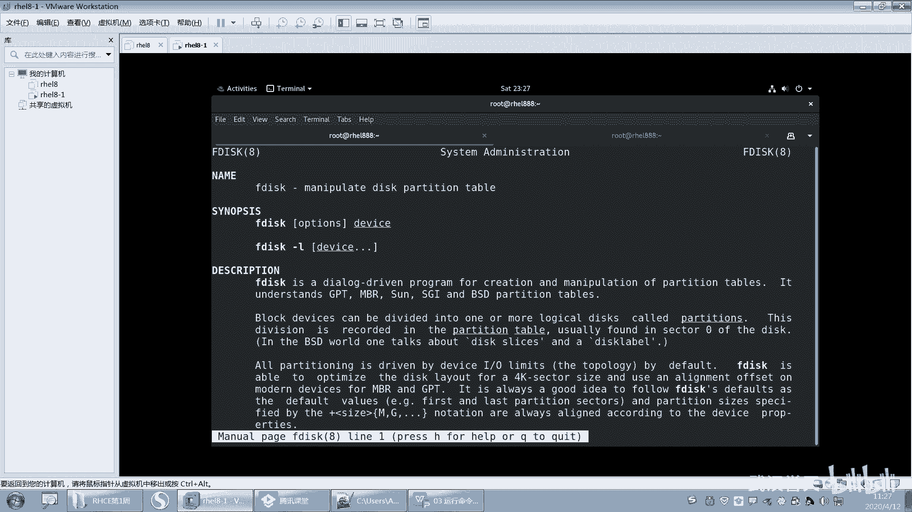
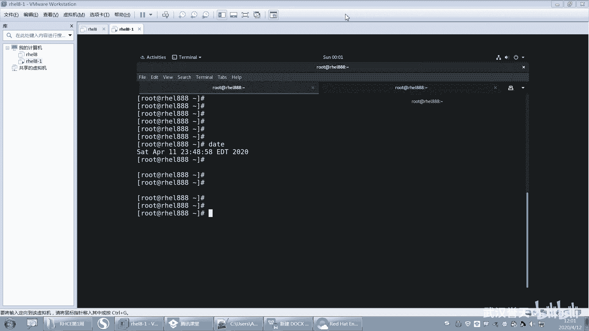

# 【已更新】最新版丨誉天红帽RHCE 8.0系列培训视频 - P16：运行命令和获取帮助-16 - 武汉誉天 - BV1cv411q74E

5个章节你不需要都记住它9个章节是做什么的，你只需要记几个重要的就可以了啊。好，这个我们可以大概看一下啊，第一个章节主要是。这个可执行的程序和什么什么命令对吧？

可执行executablepro就是可执行的程序啊。所以第一个章节一般情况下都是什么？都是命令，都是命令啊，就是卖一些命令可执行的命令。好，第二个呢就是主要什么？主要是系统的一些调用库。

由内核提供的一些函数是吧？functiongctions函数提供的，由内核提供的是吧？啊，第三个是一个一些也是一些系统的库文件。哦，这就比较少很少用啊。然后还有第四个是一些特殊。

他会去卖一些特殊的文件是吧？呃，比如说将来会在DEV下面这个目录下面会有一些特殊的文件。这个我们后面会遇到啊，这一般是一些呃特殊文件。比如说我们的磁盘哪。嗯，这种。呃，就是磁盘型呃这个什么。

磁盘啊、键盘啊、鼠标啊等等，这些都会在D一V这些特殊的设备上面啊，在DEV下面。好，还有第五呢就是文件的格式和什么惯例传统是吧？好，就是说如果我们将来去写一个编辑一个配置文件。

那么这个配置文件它的格式是什么？我们可以去man。第五个章节对，查看第五个章节啊。还有什么？还有一些图就就就一什么。呃，曼七是吧。这个番子叫什么瓦啊什么之类的是吧嗯。啊。

这些慢一些特殊的这个一些有一些符号吧，好像是。也这个也很少去用，一般都是他提示我卖什么，我就卖什么。好，第八个呢一般就是什么？嗯。混杂的各种各样的是吧？嗯，各种其他混杂的东西都在这儿是吧，是这个意思吧？

哦，第八个就是这个系统的，你看系统的管理员命令，系统管理员命令啊，然后经常什么只是root，只有root才可以执行的。所以你看第一个跟第八个的区别在于啊，对，通常只是是吧？啊。

第一个跟第八个的区别在于什么？第八个这个命令只有root一般情况下只有root才可以执行。对，只有住才可以执行的命令。第八个啊。然后第九个呢就是关于内核的。对，关于内核的好，那这么多你记哪几个。

你记三个就可以了，你记三个重要的就可以了啊，就这三个。

第一个章节，第五个章节和第八个章节就可以了。第一第五第八好，我教大家怎么去用啊。

我教你怎么去用。呃，我们有一个命令叫password。这个命令呢。这个命令啊它不仅是个命令，它还是个文件，有一个文件也叫password，看到没有？有一个文件也叫pasword。

所以如果我想去man一个man password的时候，看你看进来啊，man password回车，那么在这个地方是不是就是第一。说明它是第几个章节呢？是第一个章节，一般第一个章节就是man命令。对。

man命令啊。好，那如果我现在想去慢第五个章节，对吧？我想慢这个文件，那么选前面就加一个5man5pas word，那这个地方就变成什么，变成5，那么这里就是什么，就是man文件，man文件啊。好。

那你说我想去慢慢8有没有8呢？呃，当然没有，他说没有是吧？没有第八个章节。所以你要记住啊，并不是所有的这个命令，它都有什么1到9个章节，能理解吧？它不是所有的命令都有1到9个章节的啊。

一般绝大多数情况下就是第一个章节，对吧？第五个章节，第八个章节，对吧？这种比较常用的，还有有的就是只有第七个章节，有的只有第五个章节，对吧？好，那我如果去卖的时候，我后面不加。那默认是曼迪几个章节呢？

呃，默认慢的是。嗯，这个要看什么，要看它有哪几个章节啊。比如说有一个命令只有15这两个章节，那么你这样去慢，什么都不加，默认卖的是第一个章节。好，如果有一个它只有什么58，对吧？那么你去卖。

他默认慢的是第五个章节，也就是说从第一个有的章节开始慢取。那如果你要慢指定的章节，那么就需要在这什么这个中间地方加一个数字章节，然后去慢O这样说能听懂吗？就卖哪一个章节，你就去怎么样。

你就去加个数字就可以了。啊，如果没有加，那就是什么卖他默认的第一个章节啊，默认的第一个章节啊。就是慢帮助的章节。慢帮助的章节啊。

嗯，然后第八个呢一般是系统管理员的对吧？那系统管理员的话就是这样的啊，你看比如说我们。

我不知道曼菲沃是不是哦。嗯，看这个命令。哎，这个是第一个是吧？嗯，for this呢。哦，你看这个命令是不是就是。第八个章节啊，你那我这什么都没加，说明什么？说明这个命令只有第八个章节。😡。

只有第八个讲解，所以你一下也慢是不慢第八个讲解。嗯就曼巴嘛，曼巴对吧？好，这就是man帮助的这个章节怎么去使用啊？以后我再来问大家的时候，我说。

呃，如果要去慢一个文件的格式，慢级，对吧？慢五你要知道啊，man5其实一个一般第一个跟第八个就不用慢，它自己就出来了。一般这个命令要么就是普通用户都可以执行，要么就是什么，只有入的用户才可以执行啊。

所以一般很少有冲突，那用的比较多的呢，就是这个5第5个啊，第5个。好，嗯，这个是我们这个常用的慢帮助章节啊。好，我们来再看一下啊。

嗯，那我想看这个me包书到底有哪些章节啊？😮，我们也可以这样去查啊，man杠K，比如说password。好，前面加个杠KK是什么意思呢？K是指K wordK word就是那个叫嗯。关键词对吧？

keyword嘛。关键词啊。嗯，对关键字关键词是吧？啊。嗯。有没同学不知道啊，因我经常因为我们经常会说一些这个。英语是吧？我怕大家有的同学。他的英语水平不行，然后就一说跟不上了啊，不知道说什么是吧。

也不好意思也不好意思提出来。啊，我尽量嗯都说清楚啊。好KK word，然后回车。好，那么你会看一下啊，它这个查询呢，其实它是一个模糊查询，它它就是说它查的没有那么精确。哦。

你看在这个地方这个命令这个命令啊，这个命令里面是不是带有一个password呀？带有一个password对吧？嗯，就是有这个有这个它是个关键词嘛，就这个就是个字符串。

其实然后这个chanpasword是更改组的密码批量的，是吧？嗯，in batch batch批量模式吗？more就是模式，然后这个是更改什么？这个是更改密码，这个应批量模式对吧？然后还有这个。

然后这个里面是并没有带password，但是在这里是不是有个password的单词，它也会给你去查找出来。嗯。然后这个呢第三个这第三个是吧，第三个章节，就第这个这个括号里面是不是第三个章节啊。

然后这个是第一个章节，对吧？嗯，对他他只要带有这个，那大家知道这个是这个关键词，这个地方是怎么来的吗？知不知道啊？这个地方这个描述是怎么来的，知不知道啊？它其实是word is显示的。

就是what is吗？你看what is这边。这个描述信息就是这个。看到没有？就 what is。就是what is查出来的。所以这个man杠K是基于what is的查询结果。

来查的那只要这一行当中有什么有password，他就给你查出来，对就给你查出来啊。好吧。嗯。好，这个就是这个章节怎么用啊。好，下次我问你，我说要去查一个与LS相关的对吧？

LS这个关键词相关的一些慢帮助章节有哪些？那你就什么man。杠K标S这样，但这个就比较多了。那你说但我这这这么多怎么看，对吧？那你后面就用一些过滤工具把它过滤出来啊，啊可以用用一些过滤工具。嗯。

慢命令某个章节有什么用？你刚刚吃饭去了啊。刚刚说完刚刚说完卖卖哪个章节有什么用啊？

来给我解释一下。第一个章节是做什么的？啊，对。李小虎同学来帮我解释一下第一个章节是做什么的？人呢？谁能解释一下呀？第一个章节是做什么的？嗯。吓得李小虎同学不敢出现了，嗯，不敢说话了，是吧？

为什么要卖他那个章节啊？hu。为什么要卖他人？为什么要卖那个张杰啊？😡，啊，为什么要瞒这一个章节，对吧？为什么要慢第一个章节啊？第一个章节是不是命的语法呀，对不对？命的语法，那为什么要慢第五个章节啊？

😡，哎，为什么要慢第五个章节？因为五怎么样啊？因为五这个是文件的格式，就是将来我们想去修改一个文件，这个文件它里面每一个栏位是什么意思，对吧？那我那我不知道怎么办，我是不是可以去man舞对，man舞嘛？

还有一些参数的解释。对。就是去卖我就这个意思啊。嗯。好。OK这个是man啊呃man呢它的所有的这个手册啊，它都是我们还记得我们第一章学的什么叫呃一切接文件，对吧？那么这个文件其实man帮助它也是文件。

其实你在man的时候，它是打开某一个文件。那这些文件在哪？在这个下面啊，在这个USR share man，就是后面我们学了怎么去操作文件系统的时候，你可以看一下USR share man下面。

你看就man一啊，man2啊，man三啊，man什么慢慢这么多是吧？好多，其实有很多，我们用的其实也就那么几个嗯。啊，那就是慢，它所有的灯慢一你进慢一进去看一下。那这是不是都是一些，这这是红色的是吧？

一般红色就是压缩包，它其实你慢它的时候，它就默认怎么样，他把这个。我看有没有LS啊。呃，有呢嗯这个就是UL是不是就M一，它是个压缩包嘛，它每次卖的时候，他就把这个压缩包给解压缩出来了，就这个意思嗯。

好吧，这个后面这个不清楚就算了啊，不管它。后面我们学了文件系统之后就知道学了什么压缩包就知道了啊。

啊，这个是我们的这个man man手册啊，man手册。好，那么除了这个man以外呢呃man就是你其他都不会，你就要会man，好吧，你就会卖就行了啊。啊，那么还有一个呃还有一个这个帮助啊，叫info。

对in for大家应该听过吧。in for是吧？但是info的话，我相信绝大多数同学对它就都听过man，但是info可能听的比较少，对吧？info也可以。比如info L那你就可以这样去搜索。

但是info呢我跟大家说一下info跟 man的区别是什么啊？

你这样看看到没有？这里有个10。1，然后LS是不是列出目录的内容，对吧？好，你往下翻翻翻翻翻翻翻翻。好，翻着翻着翻着就10。1。1哦，往下翻10。1。2。然后再翻。10。1。3就说不定是吧。啊。

说明就有10。1。3。然后他他每他是做成什么？它做成小级，那为什么从十开始？其实你在慢的时候，你慢着慢着好，往上翻啊，你看它10。1。3。😡，是是排序这个输出，对输出进行排序。

它就是根据功能来对这个内容怎么样啊进行一个就是归纳。那它根据它的功能来的。而且你看10。1是不是LS对吧？10。1。1是也是LS10。1。210。1。3都是LS那么10。2是哪个小节呢。

就换成就可能换成另外一个命令了。所以你翻着翻着翻着翻着，你就不知道自己翻哪去了。嗯。能理解吧？所以它内容非常非常多，他是把所有的注意啊，它是把所有的命令。都做成一个像什么呢？做成一个一本书一样。

就做成一本书。然后你第一小节、第二小节、第三小节、第四小节，所以你迈进去的时候，你看到的是它的小节。😡，嗯，所以你翻着翻着对吧？就有可能翻不见了。呃，那他有什么好处呢？对吧？嗯。

它的好处是啊它的内容更详细了。它的内容更详细了啊，你看它根据它的什么，根据它的这个呃意图目标是吧？然后你看这个格式的这个这个这个什么这叫时间戳是吧？格式化时间戳。实间出呃。反正功能特别多，而内容特别多。

好，你往下啊。一般这个动慢其实就够了。你用的比较少。好，这个是infer啊，那我直接infer进去，就是这样。那你看啊，不过这个infer呢还有个高级版本，还有个高级版本啊，叫什么呢？叫Pinfer。

这个Pinfer比infer看着要舒服，而且它它会高亮。你看啊，你直接你是后面什么都不加哟，什么都不加，直接Pinfer进去回去了，它就是所有的。所有的看见没有？这个是这是一些命令归档的一些命令。

然后你往下翻，你还可以点哦，你看你还可以点这鼠标还可以点，看见没有？那你鼠标点点到这儿，它就它就在这个地方告亮，你回车就进去了。对，一回车就进到那个里面去了。好，然后。再出来，然后往下翻。

你看你的往下翻的话，它是不是这个链在各个链接之间进行移动，然后移动到。比如说你你要你要找，比如说你你翻前面啊。按这个CPIO或者放到他这里，放到他这里啊，然后回去，然后又进到这个里面了。

这就是什么ta的一些什么这个语法规则，然后往下往翻往下翻。啊，我要翻，然后这里是不是分类了，看到没有？介绍，然后什么tutus什么这个这个这个。然后你再回车。你再回去。

我不知道翻哪里去了。好，这个用法我给大家总结了一下啊，因为我用的也不是太熟。那就是NB呃，摁D什么显示主目录是吧？NU显示什么副节点呀，上下箭头这样滚动啊，呃，你要想用你就用，好吧，你要觉得不麻烦。

你习惯了你就用，我就我还是比较喜欢用man慢一般足够就可以满足我们的什么日常的查询了。呃，你想用P音付呃，也可以。你用in付还不如用P音付。因为P音付它更。

它更好，它比那个音付要更好用一些。好，比如说啊我们查一个P in for data。好，这样的话就进来了。你看它这个呀怎么就是。就跟麦一样啊。对用的个跟man一样，对吧？

那这个不会去得打打开就是man吧。我感觉这个是不是就是麦打开的。

P音符。这个好像就是慢吧。是吧。P音付这样才打开，它是这个。对，这个。这个我其实用的比较少，你知道就行了，有这个东西就行了啊。好呃，那继续啊。

这个是我们在线就是内置的一些文档啊，还有将来你还会遇到一些文档，就是后来你会装一些包，就是你会装一个包，装好之后，它就会在什么？在这个里面就会生成一些文档。就是可能现在没有，但是装包之后就可能有了啊。

这以后就以后的啊就后面再说，好吧，遇到再说。好，最后最重要的一个就是。比较重要的很重要的一个就是这个在线文档。好，今天呢我带大家来浏览一下我们这个红帽的这个红帽的官方文官方呃官方网站。好吧。

你们红后面以后要我要要会去用了啊。嗯。看这里啊。红帽的官方网站叫3W点rehead点com。就就官方网站啊嗯。3W点rehead。就是这个网站，这他的官方网站。嗯，然后它官方网站里面有一些就是文档。

就是下载的一些文件呀，资料啊，对吧？是在另外一个网站，这个网站叫access点。Acess。点rehead点com，我把这个记住就行了。呃，这个网站以后你们要去访问的，为什么呢？

因为将来你们考完考试的时候。

你的成绩和成绩单都在这个网站，你去注册一个，都在这个网站上要去呃。

要去下载的。就在这个上面。啊，这个是它的一个参考文档啊，你往下翻往下翻往下翻翻翻翻翻这里啊，最下角有一个快速链接是吧，你可点这个叫product product documentation。

就叫产品文档，知道什么叫产品文档吗？点一下。

鸿贸企业版linux，这就是它的一个产品，它有还哪有它有哪些产品呢？它有很多产品，看到没有？这是我们的操系统。操系统这个产品对吧？那基于这个产品之上的一些什么一些呃产品文档，比如说我们怎么去安装系统啊。

这里面都有你点进去啊，这是这是什么？这是关于虚拟化的是吧？这是关于什么？这是关于这个云的，还有这个open shift的容器的。还有关于存储的，你都可以点那safe glass集群的。这边都有。啊。

只不过这个里面是英文的，没办法。你就你只能凑合着看啊。好，点进去这个关于红帽操系统的。好，然后这边呢你看啊我们现在是8。2的better版本是不是出来了？这个8。2的be版本传了出来了是吧？好。

然后点8。88888。好，那么八呢这边啊会有一些。呃，呀这我看给大家能不能改成中文啊。要不要改中文啊，不用了吧。啊，就这样吧好，这边这边有个中英文呢，这个有个简体中文，你改一下吧。

没有没有嗯。好，你看一下啊，这个中文。好，然后这边是那这边是发行。你看这个有的翻译了，有的没翻译是吧？就是说你看8。0出来之后，它会有一些说明。你们想看8。0有什么新的这个特性，对吧？

你就可以去这面看啊，可以去看啊，然后8。1跟8。0就8。1发布了之后，8。1跟8。0的区别是什么？这个也是可以去在这个这个叫发行诸暨发行说明对吧？他这个翻译的不好。机器翻译看哦，什机器翻译是吧？

那这都是机器翻译版本。所以他人为他一般很少有人会去做翻译这样的事情，因为翻译的不好。他可能会被你骂是吧？你就发译的什么鬼东西，那那别人也不愿意去做这个事情。😡，好，那么这里有个比如说啊升级到红帽八是吧？

嗯。比如说你是红包七或者什么升级，升级到红包八怎么做？那这里有你可以下载文档。这边。这里有个这里有什么有HDM面格式的是吧？有单页的，有多页的。嗯，还有什么PDF的。这是个什么格式，搞不清楚。好。

然后你可以去这样啊，我们找一个我们。我记得7版本好像有的还都是中文的，这个8版本他估计他还没有翻译。哎，你看昨天有同学不是说那个呃web界面怎么登录吗？

这里边有那管理系统用红包解版web console是吧？就是web界面嘛，web控web控制台怎么用的去下载，可以去看，好吧。然后还有桌面环境的怎么用？然后还有这就好多。还有关于什么关于安全的是吧？

还有关于存储的，比如说你管理文件。管理文件设备还有管理逻辑卷的个逻辑卷吗？LVALV是吧？还有什么s万多路径，haglasser集群的那这里都有，还有虚拟化的那。好，我们下载一个看一下，好吧。呃。

比如说我管一个逻辑卷子，好吧，点一下啊，点进去，或者你直接点右面这个点PDF点一下。

好，这边就会有一个。No。这里都可以都可以点，然后你去把它下载下来，下载的话就在右上角又可以下载呢，这里有个下载。

呃，现在的桌面上保存。

这个是免费的，不用登录，直接去下载就可以了。那这里都有。最小化安装默认不支持web登录对你最小安装连图形界面呃连然后好像不支持。嗯，是这样的啊，你们刚开始的时候是这样的，你们刚开始的时候。

其实说实话不建议大家去看这个。因为看了这个呢，一看不懂，第二，打击自信心，对吧？看着看着不想看了，别再到时候HCE不想学了就完了啊。好，所以呢刚开始你们这个怎么办呢？对，你们刚开始就不用去看。

这个是在后来你有了一定基础之后，你工作了，对吧？然后你想去你你觉得你有一定的这个这个水平了，然后你再去看这些。因为一般啊你注意啊，一般你现在的困难遇到的困难。

通过一些。百度啊或者通过什么文档，其实都是可以解决的，通过一些书籍都是可以解决的。那如果有一些其他都解决不了了，那这个时候你是不是才去看产品文档，就所有人都解决不了，那怎么办？去看产品文档，对吧？

所以在那个时候你才需要去看到产品文档啊，所以一般情况下，你也蛮很少用到啊，所以当你有一定的基础之后，你就再去看这个产品的，而不是说我现在给你看，只是说有这个东西，但是不一定你要你要去看，理解吧？

知要有就可以了啊。哎，你你有可能会成为一个什么，你们公司的一个什么查找资料的小能手，对吧？😡，嗯。嗯嗯嗯好吧。呃，这是这个大家要知道这个地方有这样一个资源啊啊包括不仅仅是红茂友任何的。呃。对。

任何的这个产品它都会有产品文档，否则别人不知道怎么去对照去写是吧？所以要会看产品文档啊，只不过这是英文的嗯。O。呃，干嘛干嘛干嘛？呃，国外的产品楼产品文档。嗯，还好吧还好。😔，嗯。对。

就是你你你可以成为一个什么样的人呢？有些时候你就会你就把一些你你你会什么，你会查找资料吗？我跟你说会查找资料，这个人会查找资料这个人。你说非常厉害，有些人你让他去查，他都查不明白，他也不知道在哪儿去查。

对，但是呢呃有些人就非常厉害。他就会他就各种渠道把资料给你找过来，这种人就非常厉害对，非常厉害啊。😡，好，那么剩下还有10分钟左右啊，下面来布置两个小小的题目，来们做一下啊。嗯。

经常布置的两个题目给大家做一下啊。看一下大家今天学的怎么样啊。呃，不难不难啊，这样呢我想去显示。

显示什么呢？我刚刚还记得吗？刚刚说我在这个地方会出题目的，还记不记得？Da塔。这个时间对吧？我感觉这个时间好像跟我这个系统也不太一样。呃，大家这样，如果你的时间不一致的话，把你的时间改成改一下啊，改成。

把你的时间改一下啊，改成什么呢？

嗯，改成。22020年。4月啊4月11号早上9点钟，好吧，这是我们昨天开班的时间。好吧啊，改成这个时间啊，就改成这个时间。好，这是第一点啊，感觉这个时间。第二。这个时间改完之后。需要显示出来。

就是你把这个时间显示给我看，显示的格式就是它。就是首先就是改成改成这个时间啊。对把你的系统时间改成这个，然后你改改完之后啊，你不是可以用data去看吗？但是data看这个时间是不是感觉看不清看不清晰。

对吧？好，那第二呢，你要怎么样，你要在显示这个时间的时候，这个时间的格式是这个样子的。OK10分钟给大家做，好吧。哦，先开始啊，我题目要求已经呃已经过来了啊，命令就用哪个就用da塔。

就用data啊就可以实现了。就用data好吧，现在开始做啊，做完之后发给我看一下。OKO吗？嗯，好，现在大家做一下啊。要去吃饭了啊，这不是走了一个人呢，谁呀？我都还没去吃饭。啊。

你的你的你的系统是中文的啊。你的这个显示出来本来就是这样的吗？你这个一显示就是这样子的。我不我不要这个，我就要英文的，要这样显示，而且不能就这样显示的。你这个不是这样显示的吧。你这个不是这样。

你你这个是空格呀，你中间是空格嘞。你还带有年月啊什么的呀。嗯哼。哦，你把引号引起来啊，就是引号引起来，好吧。引号引起来，就是后面那个。白猫F跟白帽T用引号引起来，用双引号或单引号都可以。对。呃。

Y同学可以发群里，或者是单独发给我都可以啊。嗯，很好啊，这题有很多种方法去做啊，就是你们呃不要看别人怎么做的就怎么做，你可以自己去查。嗯，很嗯可以，很好。哦，这个这个就显示这个吧，就显示那个啊，不用。

就这样就这样可以吧。嗯，就不搞很难，就就04好吧。嗯，呃，对，很好，雷浩也很好。嗯。Contl C， Ctl C。Control sequence序。嗯。做了都都很好啊。嗯。可以。

做完的同学可以下可以下课了，我我们下午再讲，好吧，下午再讲。那先做。嗯，很好。可以。嗯。

嗯。嗯，很好。好嗯，可以可以。好，那大家先去吃饭吧，先去吃饭吧，中午休息一下，下午我们再继续啊。

