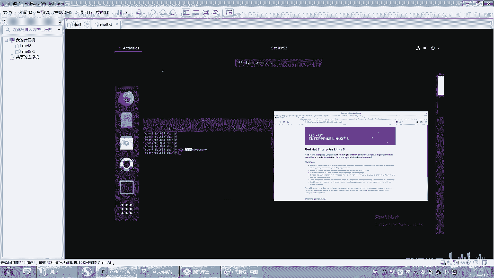

# 【已更新】最新版丨誉天红帽RHCE 8.0系列培训视频 - P18：文件系统组成和基本操作-18 - 武汉誉天 - BV1cv411q74E

好，那么也就是说USRB下面是不是放的用户的命令啊？这个没问题吧。好，然后第二个呢就是USRSSBSBS呢就多了一个SS指的是什么？S指系统的意思。系统管理员执行的命令叫S啊，USRSBS病啊。

那么S病呢我们也可以进去看一下啊，我们找一个S病的，好不好？

呃，看这个看for this。嗯嗯嗯。啊，你看这里这个命令是一个分区的命令for disk。这个命令呢，它是不是在USRS并SB下面，是不是for disk有个文件叫fordi这个文件呃。

这个文件就是我们系统管理员，对吧？执行的命令对，系统管理员执行的命令。不是分区呢不是每个人都可以分都可以分的啊。

好，那这个就是SB，而且SB下面呢，你也可以进去看一下嘛，US2SB。

好，这下面也有很多是吧？也有很多命令啊有很多命令，那这这都是命令都是命令。

好，那这是两个啊，一个是B，一个是SB好吧。然后第三个呢，一个叫USRloc。这个local呢就是我们之前会自带一些命令，对吧？那将来如果你想去安装一下第三方的软件，比如说安装一个。

自己安装一个自定义的软件是吧？我们一般情况下都会放在USloc下面。嗯。然后嗯一些配置啊都会放在这个下面，就是第三方的自定义安装目录，自定义软件安装目录啊，就在这里。好，你说能不能不在这里也可以。

你可以自定义自己想去就是默认的啊，默认就在USRloc下面。啊，然后还有1个ETC目录。ETC目录呢这个是配置的配置文件，系统的配置文件所在的目录。这个目录。嗯，就像比如说你我我去修改一下。

呃，比如说啊我去修改一下主机名啊，我的主机名目前叫什么，是不是叫REL888是吧？那主机名怎么修改呢？我们还记不记得前面有一句话呀？叫一切配置的数据，都可以通过文本文件来去修改，对吧？配置的数据。

所以你看ETC下面我们有一个hosse name。你看这个里面是不是写的我的主机名，对不对？那我只要把这个文件内容修改一下，我的主机名就变了啊，这是可以修改的一些配置的，就是一些配置文件。

配置文件就在ETCE下面。嗯，ETC下面啊。好，还有比如说你修改IP地址啊，IP地址等等。都会在什么ETC下面，所以就ETC就是配置的一些数据啊，配置文件。

好，这个我们后面会经常访问到。比如说你用户账号信息啊、密码信息啊，都在这个ETC下面。呃，还有一些哇呃哇这个目录这个目录呢嗯。比如说举个例子啊，比如说我们的系统的日志呃，日志不知道是什么东西是吧？好。

比如说我去装一个网站网站服务，大家知道网站吧。呃，去配置一个网站，对吧？那么这个网站的网页，比如说啊你你你这个网站。

你像比如说我在这儿访问。嗯，你看我去访问火狐浏览器的时候，它不是网页内容吗？那网页的内容它就一般情况下会放在哇这个里面。

对，我到哇这个里面啊。好，后面我们会用到的。嗯。好，那么那我去配这个什么配这个呃呃这个网站的时候，一些配置的数据它会放在什么？放在ETC下面。但是网页的一些数据。它就会放在什么Y下面啊，放在Y下面。好。

下面这个就是tamp系统的临时文件目录。呃，临时文件呢这个tamp目录啊呃临时文件呃，其实我们有些时候就tamp就是在我系统运行当中产生的一些临时文件，对吧？这个临时文件嗯，它会定期的去清理。

就系统临时文件。这个不是我们那个不是垃圾桶啊，不是不是那个回收站，好吧，它不是回收站啊，这个tamp目录。TMP就是temporary那个。那什么临时的那个单词是吧？好，这是一些目录啊。

还有还有啊还有就是这个目录，这个目录。这个目录呢给大家解释过，它是怎么呀？系统启动过程中所需要的一些文件。嗯。系统启动过程中所需要的一些文件啊，就在boott下面。啊，还有第一V啊，包括一些特殊文件。

比如说硬件。都在D一V下面啊，一件硬件设备都在D一V下面啊。好，还有两个目录叫pro和s这两个目录。这两个目录呢它反映的是当前系统运行状态。就是说啊我们其他所有的，比如说这些目录上面的这些目录，对吧？

他们所占有的空间都是来自于硬盘。都是来自于硬盘啊。好，那么这两个目录呢。他们所占的空间是来自于内存，就是他们两个比较特殊。对，是来自于内存啊，占的空间是内存的。所以他们反映的是我系统运行的状态。

内存里面的数据。内存里面的数据，而不是磁盘里面的数据啊。好。那你说老师这么多的目录，我怎么能记得住呢？对吧？😡，呃，你用不用记呢？你不用记。呃。

当然我们目最终啊需要把这所有的目录都知道每个目录是做什么的，但目前为止你也记不下来，对吧？你慢慢学习，你自然而然的就记住了。啊，黄子维陈乔都记住了没有啊？嗯。我又问一个目录说干什么的呀，你知道吗？

知不知道啊？😡，哦，记住了，你是不是有没有有没有刻意去记他，没有去刻意去记他，对吧？就自然而然就记住了，就因为经常用嘛，用着用了就就记住了啊。😡，好，你就大概先对它有个了解就可以了啊。好，呃。

下面有一句说明啊，这个说明的话。嗯，先不用管它了，我们后面再说，好吧。它其实意思就是说这个B目录这学过的同学可以听一下啊。呃，B目录跟USRB这两个其实是软链接的关系，就链接文件嘛。

SB跟USSB是链接文件。就是改版了，就是从红帽漆跟或更其实红帽漆也是这样。呃，更呃八版本也是这样，但六版本的话就不是的，六版本不是的啊。它是一个链接文件，我怎么给你看它这个链接文件啊，你可以这样看。

因为有同学老是问，他说这两个木到底什么关系，对吧？LS杠1B。你看这个B目录其实是什么呀？是是链接到USRB的那这是个链接。就是有说我访问这个的话，就是访问的是这个目录吧。

这个相当于windows的快捷方式。对，就相当于windows的快捷方式啊，包括SB也是这样。SBSB也是这样子啊，那这个目录是不是链接到这里？

对吧它就链接文件啊。啊，这这句话说的就这个意思。就这个意思啊，然后以及li labelbel就是链接到什么US的label，然后label64就连接到US和label64。嗯，然后跟下面的目录是什么？

USR下面对应的一个软链接啊，就是一个快捷方式啊，快捷方式。所以跟你访问什么？你访问这个ELSB。

对吧跟你LUSRSSUSRB是不一样的，这两个是一样的啊。这这个能不能听懂这个U这个病，你访问这个跟访问这个是不一样的，它们两个是一样的啊。😡，这是快捷方式吗？快捷方式走你知道是什么吧。😡，嗯嗯。

没看到花，也不知道懂了没有。

哎。哦，好嗯。好呃，那继续啊。下面是文件名跟目录，这个取值，我就稍微说一下吧。呃，文件名呢是不可以超过255个字符的。就是如果你超过2555个字符的话，它就不允许不允许啊，不允许创建了。就文件名呃。

所有的字符都是有效的。就是我们再去命名一些文件名跟目录名的时候，要注意。嗯，你可以去文件名，可以随便叫是吧？比如说你。

嗯，叫一个咯或者是。特殊字符也行，这样特殊字符对吧？呃这些都可以看到吗？对，这都可以啊。然后你看。这是不是一个文件？对吧。这个文件呢。它里面包含很多特殊字符是吧？所以这些特殊作文是不是都可以作为文件名。

都可以作为文件名啊，但是唯独只有一个。

只有一个啊斜杠是不可以作为文件名的。因为斜杠它有两个含义，一个是根，一个是。分隔符分隔符啊，注意啊。

好，然后在起名字的时候呢，最好不要去起一些什么就稀奇古怪的这些名字啊，这你看的是什么东西啊？看不清楚是吧，最好不要去乱取名字啊，曲一些有意义的名字。呃，比如说fi要点7S7啊。

是吧虽然这个也不是很有意义啊。好。还有名字和大小写要去敏感，就是大家去区分敏感就是区分的意思嘛，区分大小写啊。好，那下面我们来看一下关于路径啊，这个路径呢对于就是那个潘崇旺同学是吧？啊，这种小白是吧？

他就容易呃容易迷糊，就有易容易晕掉。就是啊一会儿这个路径，一会儿那个路径啊。好，嗯，那这样吧，我看一下啊。

怎么给大家举个例子。

好，大家记一下啊，可以记一下，我们有两个两种类型的路径，两种类型的路径啊。呃，这样我用LS啊，LS后面我们可以接路径，因为LS后面是看什么？

呃，他是看这个ETCA对吧？哦。网络大佬是吧？好，这个嗯可以帮我们去普及一下网络知识啊，然后给我们发点资料什么的。嗯，我很欢迎。好，那后面可以接上一个路径，那么这个路径呢嗯它是。相对路径呢还是绝对路径。

对吧？这个要怎么去看前面要看啊，相对绝对路径呢，第一个是什么？第一个是绝对路径对吧？第一个叫以根开头的路径，是绝对路径。大家去记一下啊，在你的笔记本上写上绝对路径有什么特点啊。第一，以根开头的路径。

嗯，我虽然把PPT给大家，但是我相信我把PPT给大家，绝大多数省人是不会去看PPT的。嗯，你还是记一下，好吧，你根开头的文件，你根开的路径都是相绝对路径啊，绝对路径。好，那也就是说我可以这样去访问喽。

啊，比如说后面有一个很长的这样一个路径啊，这个就是什么？这个就是绝对路径啊，就是绝对路径。好，绝对路径的第一点特点就是以刚开始的路径就是绝对路径。第二，绝对路径，它可以在任何位置去访问到这个绝对路径。

比如说我现在我们我现在啊。你看啊我现在这个地方是不是有个根呢，这是不是有个根呢？这个根是指我当前是在哪个目录下面啊？好，我现在我在根下面，我这样是不是也可以执行，那这个命令是不是也可以执行。好。

现在我呢我去到temp目录下面。那我这条命令是不是也可以执行，OK吧？所以就是说你跟你当前，那我当前在tab下面，跟我当前在什么在跟下面还是在哪个位置，我是不是都可以去执行这样一条命令，这就是绝对路径。

OK吧，这就是绝对路径啊。好。呃，那什么是相对路径呢？好，相对路径是这样的啊，比如说。LSETC。那么后面这也是个路径，但是这个路径呢并没有是根开头的是吧？那我怎么知道是是不是跟开头的呀。

是不是这个地方啊，这个地方有个斜杠啊，这个斜杠是不是跟后面都是分隔符，对吧？对，后面就是根后面是分隔符嘛，对吧？所以那你看这个地方这个路径它没有怎么样，它没有以根开头，所以它就是相对路径，这样去区分啊。

这样是最好区分的方法。好，再再加一个啊。好，那这样后面是不是也是一个相对路径，它不是以根怎么样，不是以根开头的路径。好，那么这条命令看好哦，我现在换一个，我去到什么，我去到t下面，我再来执行这条命令。

能不能执行啊？那我换了一个目录，那我现在在t下面了。我现在换了一个目录啊，我去到另外一个目录，然后我再来执行这条命令就怎么样啊，哎，就有可能会执行不了。对，有可能会执行不了。

所以这就是相对路径跟绝对路径的区别。绝对路径跟你当前在哪个位置是没有关系的。但是相对路径。在使用的时候，一定会跟你当前位置有关。好，那这个是什么意思呢？我这样去访问是什么意思呢？😡，啊，访问的是什么？

唉，那我们说绝对路径是以根开始，那相对路径请告诉我是从哪里开始，相对路径是从哪里开始啊？唉，对，相对路径是从当前目录。所以我把这个路径写完整啊，它就是这样的tamp看好啊，因为我在t下面嘛。

然后就是tamp下面的。呃，呃ETC下面的什么s confi，它是不是这样一个这样一个路径啊，对不对？那相对于当前路径，当前是在tamp下面后面接了一个相对路径啊，相对路径啊。

但是这个目录并没有并不不存不存在，那不存在，所以它报错了，它没有此文件和目录，能理解吗？这个就是相对路径，所以在用相对路径的时候，千万要注意啊，相对路径它不是在任何位置都可以访问的。啊。

那能访问的前提是什么？前提是当前目录下面需要有1个ETC目录。ETC下面需要有一个ss confi的目录或者文件。对，这样的话才可以去访问到它能理解吗？对，这样才能去访问它啊，这就是相对路径啊相对路径。

好，记好啊，绝对路径是以根开头，也就是位置的全路径。从根开始，任何位置都可以去引用它都可以去引用这个路径啊。那相对路径呢，它是不以斜线开头是吧？也就是说不以根开头，这个斜线是根啊，不以根开头。

当前什么工作目录的相对位置，也就是你当前的位置的相对位置是吧？好，那在特定的位置才可以去引用，这个是相对路径啊相对路径。好，嗯，我举一个就是生活当中的一个例子吧。嗯，比如说啊。

我现在要去我去哪里啊？我现在我不知道要去哪儿啊。哦，我去欢乐谷吧，好吧。我去欢乐谷，okK吧，我实在想不到要去哪儿了啊。😊，哦，我要去欢乐谷。好，请问我去的是哪个欢乐谷，你知道吗？

你知不知道我要去哪个欢乐谷啊？😡，好，这么说吧。😀呵呵呵。😊，都是合啊，对，这么说吧，呃，你觉得什么时候会用什么绝对路径和什么时候会用这种相对路径呢？😊，是不是一定觉得路径就就好用呢？相路由机不好用呢。

对吧？啊，就好比是现在我在ETC。比如说我在ETC下面对吧？啊，我在这个路。对，下面。对，好，就像我跟你们说，对吧？我跟你们说，我说我要去欢乐谷，你们为什么不知道？因为。怎么样？

你们跟我不在同一个位置呀，所以我如果告诉你，我说我要去我要去怎么样？我要去这个这个欢乐谷，那我肯定要是不是要说清楚是在呃从地球开始，比如说宇就是从地球开始啊，那地球上的中国。

中国的武中国这个这个中国哪个省啊，湖北省武汉市，对吧？那么这就是一个什么？这就是一个绝对路径，啊，那相对路径什么？相我什么时候会用相对路径呢？我是不是跟我旁边的人啊，我跟我旁边的人在聊天的时候，对吧？

我说我要去欢乐谷。😊，然后那如果你跟他说，我要去中国呃地球，中国、湖北、武汉的欢乐谷，那么他会觉得怎么样？他说你怎么那么多废话，你直接用相对路径，这个用这个直接说去欢乐谷不就行了吗？

我肯定知道你是去武汉的欢乐谷啊，你怎么能去别的省的欢欢乐谷，明明武汉就有，对吧？所以啊。那我已经也就是说我已经在这个目录下面了，对不对？那我还去我还用这样去引用EDC。😡，呃，对，ssfi呃。

network那这样的话是不是很麻烦，对吧？这样是不是很麻烦呀？所以我就直接怎么样啊，哎，直接用networkscript。😊，这样就可以放盗了。OK吧，哎，这样用相对路径就可以保问到了啊。

所以就是也不是说相对路径毫无用处，对吧？还有自己的用处，就是你已经在这个目录下面了。我就不需要去什么加这么一长串的这个觉对路径了，只需要接上什么，后面这个路径就可以了。好吧嗯。啊。

这个例子可能不太恰当啊，但是你们应该都能懂吧。好，这是相对路径啊。那么你看啊有些时候你就换位置了嘛，比如说你换到别的位置，然后你上下去翻，那这这样的话相对路径是不是又不好用了？

对吧那上下去翻这种相对路径是不是又不好用，所以就看情况，看你自己好吧，你觉得这个什么时候用什么就就也没有绝对说好跟坏，对吧？🤧好。但是尽量要用绝对入进啊，尽量尽量好吧。嗯。

没问题了吧，相对路径跟绝对路径。好，下面我们用一个命令来去演示一下啊。呃，PWD学过了是吧，显示当前的工作目录。好，我们用一个命令叫CD，我们学一个命令叫CD啊CD啊，CD是什么意思呀？

我们学过的是哎呃which查一下是吧，它所有的帮助，whichCD是USR并且面的CD好，what is CD。

好，what is CD这个CD什么？CD的意思是叫呃什么干嘛？改变工作目录对吧？CD叫changedirecty。OK很棒啊，咱们班有几个英语翻译啊，这个我以后我就省。😊，唉，不错啊。

我只要我这一秒钟说啊CD你就立马把那们翻译过来啊。这个。这个我得付你钱啊。嗯，你这比那个还厉害呢是吧？我这边拿上说你们那边就出来了，这个翻译就出来了是吧？😊，这个。这是考试的时候对吧？

那请你得请你吃顿饭是吧？好，然后嗯。这个是CD啊，就是changedirect，改变工作目录，改变工作目录啊，我可以CDt。好，那么我CDt后面这个t呢就是一个绝对路径，对不对？就是一个绝对路径。

所以你只要知道一个。觉对入径你在哪儿都可以去怎么样去引用这个觉对路径啊。好，CDETC。CDETC等等等。好，那么在CD confis confi这种就是什么？这种就是相对路径啊，就是相对路径。

这个没问题了，我就不多说了啊。

好，再来啊再来CD还有什么呢？😊。

啊，我现在是在这个目录下面，对不对？我可以CD1点点。之前说的点点是什么意思？还有人记得吗？😡，还有没有人记得？快快快快告诉我。看看看我演示的啊。好，请问谁的上一级目录？上一级目录是谁的上一级目录？对。

当前目录的上一级目录很棒啊。当前目录的上一级目录，你可以看到这个地方呢，我每次CD点点的时候，我的路径就会变成什么？是不是少一层啊，我在CD点点就变成了ETC在CD点点就抱成了根再点点点点没了，到头了。

到根了。对到根了啊，所以点点指的是当前目录。好，但是我们还有一个叫点。叫点吧。对吧点告诉我是什么意思啊。还记不记得？对啊，点是根。点不是根啊，点是当前目录。不是点是当前目录，我已经在跟下面了。

跟你看我在t下面。😊，我在t下面CD。点我是不是还在这儿啊？我没变到根吧，我还在这儿啊。所以点是当前目录没有变吗？还是在我这个下面。那你说点有什么用啊啊，后面会有用啊，先知道它就是当前目录就可以了啊。

嗯，你这个。嗯。然后LS杠A的时候，你看。这是不是有个点啊？点是指当前目录，点点是上一层目录，对吧？嗯。有什么用是吧？那你就。等待下次揭晓啊。好，那么就ZD点点啊，那还有啊，比如说我现在呀呃。

在在在在哪里呢？我不知道我在哪里了。啊，反正我现在就也不知道自己在哪里，对吧？然后我就想去哪儿呢？我想回家是吧？回家，你知道家在哪吗？好，快速告诉我root的加的目录在哪里，root加的目录在哪里啊？

😊，root加目录在哪里？哦，rootO好，所以现在我想我想去回到自己的家目。对啊，还有说跟的。我想去回到自己的家目路啊，对，回到自己家目路OK呃，郭长贺同学说CD波浪号CDroot是吧？好。

我都不需要，我直接CD回车。也有。No。对吧你无你无论在哪吗？比如说在tab下面PWDCD回车。看到没有？我是不是就回到自己的家目录下面了？对，直接CD回车就可以了。那你无论在哪。CD回车。

所以你看无论你在哪个地方，只要想回家就可以回家，就类似于什么王者荣耀玩过吧，一键回城玩过吧，没回过的都都应该是没玩过的啊哦，我回过啊，逃跑的时候用是吧？对。😊，嗯，所以呃所以这个地方就是一键回家是吧？

啊，OK。好，CD啊，还当然还有个同学说还有CD波浪号是吧？好，这个波浪号呃，它也是这样的啊。好，这样吧，我给大家讲一下波浪号啊，大家看一下这个地方有个波浪号。😊，你看我每次去访问。

我写访问其他目录的时候，前面是不是显示的当哎，请问告诉我这个地方写的是相对路径还是绝对路径啊，这个地方。这个地方是相对路径还是绝对路径啊？对，这是个相对路径啊，所以我进入到ETC下面的时候。

这个地方也是相对路径。OK吧？好，但是我每次回到家的时候。😊，这个波浪号。对，这个波浪只不过显示波浪波浪号本来应该是显示个root，对吧？但是显示的是波浪号。因为波浪号呢指的就是用户的加目录。

一个用户的加目录。拨浪号码。好，所以我可以用什么？我可以用这个这个。呃，我可以用CD波浪号是不是回家了，那这样是不是就回家了，对吧？但是呢哎我今天这个心情不太好是吧？我不想回家，我想回别人家是吧？

我想去别人家能理解吗？我想去你家是吧？好，那我想去别人家怎么办呢？我就可以怎么样CD我想去谁家呢？我想去。😊，呃。addmin加好不好？想去addmin加，请告诉我addmin加的绝对路径是什么？

告诉我，快点敲出来啊。addmin的决对路径addmin加的绝对路径在哪里？😡，Admin的加R在哪里？要敲完整敲完全啊。好，很棒啊。啊，对，就在这里看是不是啊？我要去addmin家去波浪号admin。

对，波浪号addmin大家记得很好，刚刚讲过的啊，所以现在我在home下面admin。对我就去到什么addmin家了。😊，看到吗？嗯，所以这个地方是一个特殊的用法，后面加上用户名。

比如说我想去优子一的家，那我就怎么样接上优子一。对吧那我就去到右侧一的角了啊，就是区别人讲对吧？区别人讲啊。好，嗯，再来告诉我啊，现在我想去这样去访问波浪号。U子一嗯。下面点不知道许点。嗯。点大小啊。

好，那把这个路径的绝对路径敲出来，绝对路径敲出来这个路径的绝对路径。嗯。调出来了吗？好，敲完之后敲这个。好，敲这个敲完之后敲这个这个路径的这个绝对路径，你只要敲出来，基本上这个波浪号就没什么问题了啊。

好，同理。同理，如果是这个地方，对吧？如果是这个我起祷的命，那么这个波浪号对我的命来说，是不是就是ad的命的加目？没问题吧。这个也没问题啊，没问题吧。嗯，波浪号会用了吗？这个地方对吧？

这就是admin加。所以这个这个地方的绝对路径应该是什么？应该是home。admin下面的点80。2C2C。哎，这个这个地方有没有问题啊？没问题的，敲送花，没问题的敲6。燕子贤同学一紧然敲个敲了个一是。

😊，嗯，好。O。好了，这个不多说了啊。好，还有CD还有一个用法啊，还有一个用法，就是说比如说我要这样呃。嗯，我现在呢本来是在这个目录下面啊，本来是这个目录下面。

但是呢我呢嗯就这样回车回到自己的家目录下面了。那我又想回到这个目录下面，我是不是又要去敲一遍，是不是这样又要去敲一遍，对吧？就是说我又想回到这个目录下面，我又又去敲一遍，所以这个时候不用不用那么麻烦。

直接CD空格杠。CD空格杠看到吗？就回到什么，就回到我上一次的工作目录。对，返回上一次，但是你能不能返回上上次或上上上次不可以，只能返回一次。比如说CD。杠就返回到加木啊，CD杠就又返回返回去了。

就来回跳来跳去跳来跳去啊，就是CD杠。记住啊，这是比较常用的。

啊，比较常用的一些啊，在这里。好，刚刚学了几个啊，一个是绝对路径相对路径，还有CD点点回到当前目录的上一层目录呃，CD杠回到上一个工作目录。呃，CD波浪号CD就回到呃当前用户的主目录是吧？

一个波浪号就是当前用户。的加目录主目录就是加目录的意思啊。对，主目录就是加目录的意思啊，然后CD呃某一个用户波浪号波浪号某一个用户就某一个用户的加目录。嗯。会了吧CD啊CD就就这些用法嘛。

没没什么其他用法了。好，呃，下面我们再来学习一个命令啊，再来学一个命令。这个命令叫LS这个命令不是讲过了吗？呃，讲过了还要再讲一遍啊，之前没有讲的太。

太仔细啊。好，LS啊。啊，G开始记啊LS这个命令是显示什么目录的内容。就是查看目录和文件，查看目录和文件啊。好，我们来一个一个一个来看一下它的一个选项啊。杠L选项这个之前讲过啊，呃。

杠L这个选项指的是什么？查看这个文件的这个详细信息，对吧？好，开始记了啊，这样子啊。

呃，不知道能不能复制出来。好，我们开始记啊。第一个这个地方。这个地方第一个这个地方杠这个杠这个杠啊杠指的是文件。我PPT里面没有啊，你们自己记啊。😊，杠指的是文件的类，这个文第一个就是指的文件的类型。

杠指的是文件。这这个地方指的是文件类型啊，杠指的是文件。那么D呢指的是目录。D指的是目录啊。好，然后L呢指的是链接文件。就是链接文件啊。好吧，嗯，先目前先记这几个吧，还有还有很多其他的。好，这样吧。

你先把这个记了就行。B。就是快设备，就是就是说白了就是磁盘。磁盘文件这些就是B就是B。还有C就是字符。字符设备是吧？好，就这啊。记着5个记着5个啊，就是我将来有一块磁盘，你看啊。😊。

我给大家看一下啊，LS杠LDV下面的SDA。你看这个文件是不是B开头啊？😡，B呢叫block，叫快，叫快设备。我们。唉，这个快呢是指这个单词翻译过来的，叫block，叫快设备。呃。

所以这种能够存数据的这种设备，我们叫快设备。呃，能够存数据的这些设备，我们要存叫快设备啊。好，这个下面还有很多哎。啊，你看这个下面还有这种以C开头的，看到没有？以C开头的。这种就是字符型的设备。

像这种就是我们的终端，就叫TTYI是吧？嗯，这个我们后面遇到了再说吧，好吧，现在一时半会儿解释不清楚。就既是字符型的设备。字符型的设备啊，比如说我们的控制台，我们说呢控制台那种设备就是字符型。

它只只是起到一个显示的作用。像我们的鼠标这种都是字符型的设备，它存不了数据，存不了数据，还有键盘这种它都是字符型的设备啊。

好，然后。目录不用说了吧，链接文件就是快捷方式嘛。😡，是吧。好，你看。

呃，你再看啊LSLS杠LB。这个文件是不以L开头的。是不是就是链接文件链接文件啊。然后再就是什么，再就没有了。这就是D嘛，D就是目录。因为你有时候去用颜色去区分，对吧？万一有的没有颜色呢？

对吧万一有的他那个文件它没有全部是这一个颜色，那你就没办法去区分了。万一我是色盲的是吧？我都不说大家了啊，说我我看不清楚颜色呢，分不清楚是吧？😡，那我怎么去区分呢？通过前面这个。哎。

通过前面这个来去区分啊。好吧嗯。好，再往后啊再往后。

后面自己记啊，我就不写了，这个地方到这个地方是指权限，权限就写两个字就可以了。权限啊。权限。第一个栏位是文件类型，后面从这儿到这儿加上这个点是指权限。权限啊。好，后面这个一记了吗？后面这个一啊。

这个一呢。啊，这个一要分开说啊，如果是文件的话，这个一指的是这个文件的链接数。你就记就行了，不管它啊，我现在解释不了。嗯，如果对于文健而言。这个数字指的是什么？指的是链接数。就也就是说比如说这边是2。

那这个文件呢它就可以被删两次，就删一次唉。死不了是吧？好，再删一次，这就死掉了，就删掉了啊，就是这个文件的链接数。嗯。好，三那就有三条命是吧，三条命啊。啊，如果是目录的话。那这个位置指的是什么呢？好。

我们来看一下啊。

如果是目录的话，你发现这个地方至少都是二，看到吗？至少都是2。那么这个二代表的是什么？代表是这个目录下面有多少子目录。代表这个目录下面有多少个子目录啊。好，你可以进入到destop下面。看一下。

这有没有目录啊？没有，为什么呢？因为它隐藏起来了，一个是点，一个是点点。所以在每一个目录下面，它都会有两个隐藏的目录，一个叫点，一个叫点点。所以目录这个地方至少都是2。至少都是2啊。好。

这个地方我假如我再创建一个创建一个目录叫data。啊，我我先创建一个啊。然后你再回来看。哎呀。你再过来看这个destop，这个地方是变成三了呀。😡，是是变成三了，因为destop下面多了一个目录了。

看到没有？多了一个目录了啊。所以它指的是什么？指的是目录下面有多少个子目录。OK吧，那三个子目录啊三个子目录。

记好啊。好，就目录下面有多个子目录，这个是这个三的作用啊。好，再往后第一个这个地方指的是文件的拥有人，文件的拥有人文件的拥有人啊。这是文件的应用组。拥用人拥有组我们下一周会讲啊。拥有组。

我做的笔记比较丑啊，你们自己去做，好吧。用人拥祖。好，这个地方这个这个数字指的是文件的大小。这个地方这个这个地方指的是文件的大小。好，这个地方这个时间指的是文件最后一次修改时间。文件最后一次修改的时间。

这个地方这个时间。再后面不用说了吧，就是文件名。记完了吗？记完了。记完了给我示意一下啊。好。哎呀，妈。哎呀，妈呀。你不能换行线吗？嗯嗯。我我只是没有我只是想笑而已。嗯。M。好。

啊，那么我们继续啊继续。这LS杠L啊LS杠L啊，杠A都记下来了吧，杠A。杠A是这个呃。

这隐藏文件是吧，隐藏文件啊。好，嗯，这个地方有一个杠R，看到没有？有个杠R啊，杠R是什么意思呢？就是我们这样去看的话，是不是只能看当前目录下面有哪些文件。

但是有些时候呢，我们这个目录下面是不是还有目录，还有文件，所以我就可以加一个杠R。这样这样去看看到没？那LS杠R首先这个有个点点是不是指当前目录啊？那当前目录下面是不是有这些文件，对不对？好，那么。

这个地方有一个点desstop，是不是也可以看一下这个目录啊，这个目录下面有哪些文件呢，是不是有date啊？看到没有？有data啊。好，他还把data又看了一下，data下面有没有文件呢？没有空的。

所以它会一层一层的往下看，就一级一级一层一层的往下看啊，我们给这个一层一层往下，这个叫什么呢？叫递归。

呃，地地递归会不会啊？叫递归。就递归查看所有目录递归啊。以后再说递归的话，就是一层一层一层往下看。对。一层一层往下看啊。你可以这样，你可以就是你把这个框框缩小一点嘛，然后左边看，然后右边记笔记这样子。

嗯。

好，然后还有一种啊，比如说。呃，下面我来问一下大家啊，嗯我想去看。这个文件的权限。请问我怎么看？我想看这个文件的详细信息吧。我想去看这个文件的详细信息怎么看啊？嗯。我想去看这个文件的详细信息是怎么看啊？

😊，还cat刚学过的。是不这样看？对，就这样看对吧？LS杠L。LS杠LOK很棒啊，这样就可以看到这个文件的详细信息了。好，那我想看ETC的。😊，我想看ETC这个目录的详细信息，请问怎么看？

我想看这个目录的详细信息，请问怎么看？哦，LSETC是吧？好，有同学说LS杠LETC那你看我这样一回车就看的什么？没有。唉，这样一看是不是就是看这个目录下面所有的文件和目录。所以你看啊。

如果你接的是文件，就看这个文件本身，如果你接的是目录，那么就看这个目录下面所有的文件和目录，这个没问题吧。好，那么然后再再来啊，我想只看只看ETC看ETC对吧？那我就可以给啊看它的上一层目录啊。

看根看根就可以看到这个什么看到ETC了。😊，看到没有啊，所以后面接目录的话是看这个目录下面有多少，看目录下面的文件和目录啊。OK吧。好，那我再来啊。我只想看这一个目录对吧？怎么看，那就是LS杠LD。

加一个D，就是指看目录本身的意思啊，看目录本身的意思。好吧，加一个D，所以D是指查看目录本身嗯。所以你看目录的权限的话，就通过什么加个D加个D啊，不加D的话就会显示什么就会去看这个目录下面的文件和目录。

我这样说够清楚了啊。

好。就刚刚哎呀这个。没了吧，可以过了吧，就这就这么两个命令讲了半天啊。

