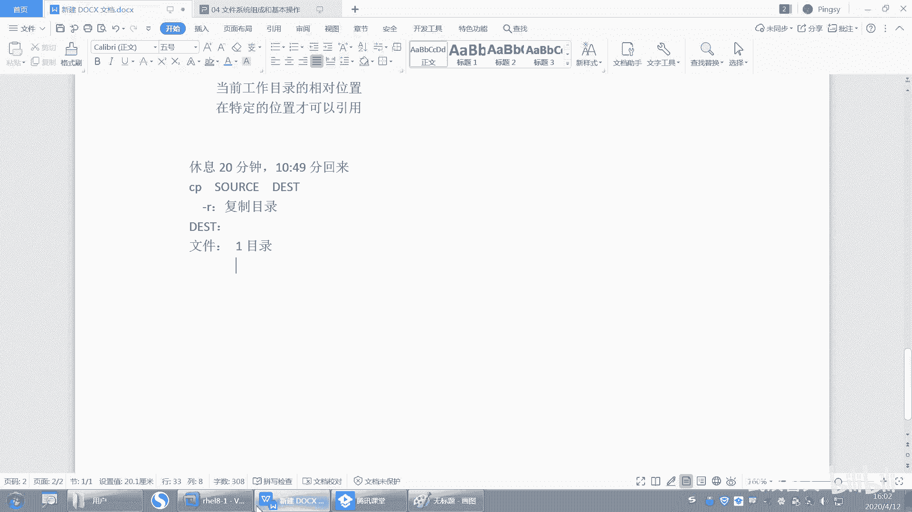
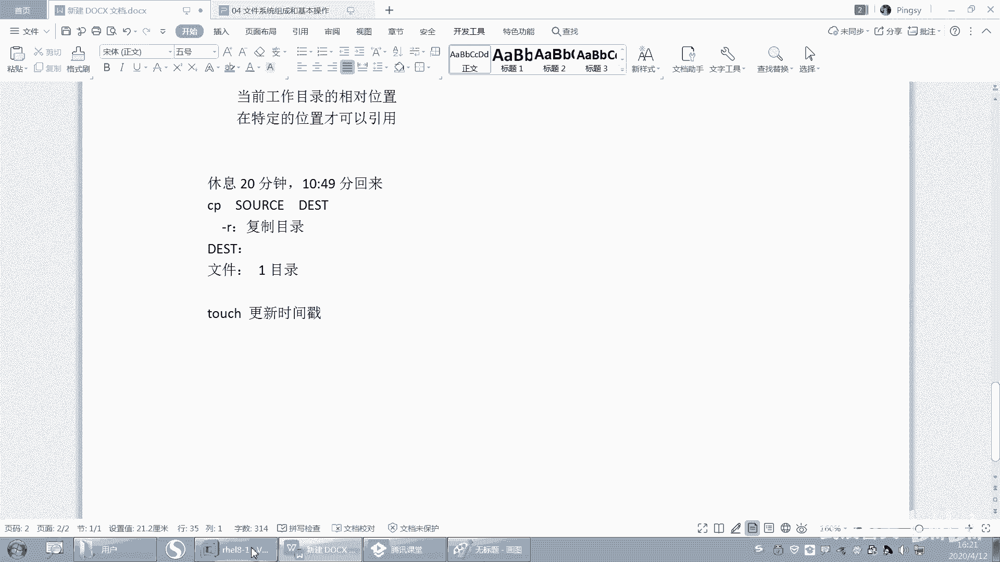

# 【已更新】最新版丨誉天红帽RHCE 8.0系列培训视频 - P19：文件系统组成和基本操作-19 - 武汉誉天 - BV1cv411q74E

嗯。好，下面我们还有一些命令，我们待会儿讲吧。我们今天下午就把这个文件系统讲完就可以了。我们嗯前面我们慢一点。宁愿慢一点，把基础打好。OK我们下课休息一下吧，休息一下回来啊。你们去下课可以操作一下。

五一我是这样的，我们这边。嗯，讲完肯定有作业的，你们放心好了啊。嗯，五一的话，我们是国家节假日，就是国家的这个节假日的话。嗯，都是正常休息的。就比如说。51是12345休息对吧？

那我们在休呃他休息的这个规定时间休息，我们也休息。国家法定节假日我们都是要休息的。

我我把这个背景改成黑色的感觉。黑色跟白色哪个看着。

更舒服一些。我改成亮色的。你觉白色跟黑色哪个舒服一下？黑色。用黑色出复一件是吧？那我就黑色吧，反正我我是无所谓。好，那就黑色。

好，我怕黑色，有时候你们看不清。うんうん。好嗯。就是喜欢。神秘的感觉是吧？好，嗯，我们来看一下关于这个复制复制文呃，复制啊就复制文件的这个。

复制文件啊。嗯，这个复制呢。是。啊，这个。这个写错了啊。怎么写成这个样子？oppttion啊options，option啊。好。呃，回来啊嗯。

呃，CP我们来man一下，好不好？man一下啊，man一下CP。好，这个我们早上m过了吧，我就不用再解释了吧。啊，所以。复制的话，后面可以加选项，还可以加什么，还可以加这个圆和目标，对吧？

我们来复制一个啊。嗯，复置这样吧，我把t下面清空一下啊。好，复制CP后直接在time下面吧。复制CPETCpassword是吧？然后注意哦前面这是一个绝对路径，对吧？

然后最后复制的文件名字叫password，然后复制到。好，比如说你复制到t目录下面。😡，那么这个tamp。嗯。就是我现在是不是在参谋下面，对吧？那么这个时候你可以用点，哎，这不是我们之前学过点吗？

因为点也是个目录呀，点是不是当前目录，所以就是把password这个文件复制到当前目录下面。啊，你可以用点表示，这个就可以用到点嘛，对吧？好。那我们就不先不用点啊，先用这个t，这样看的清楚一些啊。好。

CPpassword啊复制到temp下面回车，这样的话呢就复制过来了，就叫复制啊，是不是很简单，对吧？嗯，所以它是一步完成的。好，你还可以怎么样CP呃profi，比如说。嗯，再复制复制一个啊EDC。

呃group啊，for到t下面好，这样的话我是不是接了多个呀，多个这个参数，对吧？那哪个是原始，哪个是目标呢？我们去看man的时候是sourcece，前面或后面有三个点点点。

所以你要是source可以有多个，但是目标只能有一个，也就是说只有这两个文件复制到目录下面。复制到一个目录下面啊，而不能复制到多个目录下面。好，这样就复制多个文件了，看到吗？好。

那么下面我来说几种情况啊，说几种情况嗯。我们针对这个嗯。针对这个目标啊针对这个目标，我们来说一下啊，目标的这种情况。

就这个啊在这里。就是你看复制文件到目标是吧？那这个目标呢有几种情况啊，有几种情况。好，如果目标是一个目录，注意，如果目标是一个目录，那么这个文件就会复复制到该目录下面。

这就是我刚刚怎么样啊。刚刚演示的这个吧，这个是不是不用我多说了。如果目标是一个目录，那么就会复制到这个目录下面。这是第一种情况。第二种情况。

如果目标是一个文件，那么该文件就会覆盖目标文件。

好，那这样啊，我复制1个ATC。下面的。嗯，这样吧，我删几个文件啊。好，CP啊CPETC下面的group，然后复制到t下面的pasword。那么如果这个时候这个文件是存在，这个文件是不是存在啊？

刚刚复制的对吧？好，如果将一个文件复制呃，目标是一个已存在的文件的话，那么就会覆盖这个文件回撤。他就会问你over right要不要覆盖这个文件。好。你如果no，那就不复制。啊，如果yes就复制了。

对吧就复制了啊。好，那这个时候请问。😊，最后复制的这个文件。叫什么呢？你看它是不是叫password呀？好，那么这个pass word是原来那个pasword还是还是group啊？啊。

这个password是原来那个password吗？😡，这个pass word已经怎么样？对它已经不是原来那个pas5，它是什么？它其实是group。对它其实是group，但是group呢。

是不是复制过来之后改名字了呀，对吧？其实这句话的意思是什么？指的是啊，如果后面是一个文件，不管它存不存在，那么这个文件。就会复制过来，并且改名成pas的。对吧，但是改名的时候，我们改成pasword。

因为password这个文件已经存在了，所以他就会问你要不要覆盖这个文件，其实就是把以前这个文件给删了。对，把以前这个文件给删了。嗯。复制的文件名跟这个文件名同名了是吧？跟文件夹同名了。没有这回事啊。

跟文件夹同名这有什么关系吗？我们现在考你只要考虑有三种情况，第一种情况就目录嘛，是不是目录啊，你后面是目录，就复制到这个目录下面，就跟它同不同名有有没有关系啊，没有关系啊。😡，好。

第二种情况就是这个文件重不存在。对吧如果这个文件存在。😡，那么就会覆盖这个文件。第三种情况就是。对吧。这个文件第三种情况就是这个文件啊，怎么样啊？这个文件存不存在啊，这个文件不存在。

只有password对吧？所以如果不存在，直接复制过来怎么样改名成pass，改名成fill。改名成fa啊，就这个意思。O吧，你不需要判断它重不重名，这个不需要你只需要判断目标，它是一个目录啊。😡。

还是一个文件呢，是个目录。直接复制到目录下面，目录跟目录跟目录下面的文件同名了，这有关系吗？没有关系啊。😡，好，第二，如果目录是一个已存在的文件，那么就会覆盖这个文件。懂吗？第三。

如果目录如果目标哦说错了啊，如果目标是一个不存在的文件。那么直接改名过来叫这个文件，对，改名成叫堂。这三种情况有没有问题？啊，方明你这个问题解决了没有？你们要给点力啊。当然不能了。嗯，等一下啊。啊。

你的意思是说哦，这个文件有一个目录叫这个什么什么呃password，目录叫这个password是吧？然后你复制的原文件也叫password，那这样的话是复制不过来的啊，不能存在同名的。对。

不能存在同名的啊。嗯。好。好，这是三种情况啊，目标的三种情况记好哦。123啊。好，那么这三种情况呢，我们其实是针对什么？针对是让你复制文件的时候是这样子，对吧？好。

我快速的把这个地方如果是复制目录的哈啊，我们说如果复制目录的话，比如说复制EPC到参阳模像。

好，这样的话是复制不了的，因为它需要加一个什么，需要加一个杠R。杠R是一个选项，当你要复制目录的时候，需要加一个杠R呃，就杠R一般叫递归是吧？就是当你复制目录的时候，需要加杠R才能复制目录啊。好。

这样的话就复制过来了，叫ETC叫ETC啊。好，所以针对第一种情况，如果复制目录的话，目标是一个已存在的哦，不目标是一个目录，是不是直接复制过来啊？这跟我们复制文件的时候是不是一样的情况。对吧。好。

第二种情况，CP杠2。ETC。复制过来，t叫pasword。好。是一个已存在的文件。这样能不能复制呢？你复制过来是吧，它要覆盖它能不能覆盖，不能，因为它怎么样？他说你不能overr一个非目录。

也就是说目标是一个已存在的文件，能不能复制，不能复制。😡，不能复制过来啊。这样是不可以不可以覆盖的，只有文件覆盖文件没有目录覆盖目录的啊，不不是没有目录覆盖这个这个这个文件的啊。好，第三种情况。

改过来叫对头。这个文件是不存在。贝塔不存在对吧？不存在怎么办？😡，改名。不存在就改名改名成data。ETC改名成da塔，对吧？这个就是。复制目录的时候跟复制文件的区别啊。啊，区分了吗？会了吗？

就复制跟目录跟复制文件的这个。

目标的三种情况啊要区分一下，区别就在于第二种情况，复制目录的时候是无法覆盖目标文件的。是无法覆盖目标文件的啊。好。这个是复制啊复制。

好，那个什么相对路径，绝对路径我就不演示了吧，你们自己嗯就是用引用相对路径啊还是绝对路径啊，这些都不需要我说了啊。就什么CP好，我演示一个啊CPETC下面的group。

然后后面加上一个后面一个叫嗯test呃test啊。这样的话后面是不是相对路径啊，对不对？那这个相对路径也就是说从当前目录下面有没有有没有test呀？没有的话，是不是直接改名称test呀？

那是不是改名成t呀，这就是相对路径嘛，对吧？这个不用我说了吧，就相对路径跟绝对路径啊，注意一定要怎么样？一定要注意。虽然我刚才给大家讲相对路径和绝对路径的时候，你感觉听得很清楚，但是呢。嗯。嗯。

你在用的时候，你一定要注意啊你一定要注意。好，那么这个是CP啊，这个是CP等一下啊。好，然后我们来看一下关于MV啊MV。

啊，MV呢呃CP是复制拷贝文件跟目录，对吧？你们记下来了吗？记下来没有？

好，你简单这样记一下啊。

呃。CP啊。CP就是复制嘛，对吧？你写一下的语法，它其实就是原嘛。😊，呃，跟目标就这样写。然后杠R呢就是复制。目录对吧？不讲就就复置目录要加杠R。然后呢，目标呢目标有四种情况，是吧？四种情况。嗯。

四种情况。那四种情况如果是文件的话，对吧？那呃第一种情况，如果目标是一个目录，对吧？直接复制过来。对，那第二种情况，如果目标是一个什么呃，一个什么就去这样去记啊，就分开这样去记。嗯。

以后你们呃再这样这种的话就不用去记，呃，有些时候就不用记了，或者记也可以，就是嗯卷记下来吧。好吧，因为刚开始刚刚入门嘛，你要慢慢的去尽量我们去选择正确的方法。因为呃刚开始入门。如果你困难重重的话。

你很容易放弃了啊，所以尽量不要给自己去知造一些障碍，把正确的记记录下来啊，记录下来。

好。第二种情况叫MVMV呢第二个命令叫MV啊，MV叫移动。呃，MV呢其实就叫move。move的意思对吧？移动好，那么MV这样子啊，我移动一个。MV password移动到root下面，哎。

我可以去因是不是也可以用波浪号啊，波浪号是不是我加mo啊，这样也可以啊啊，或者是这样写，是不是也可以，不就是绝对路径嘛？对不对？好，移过去，那移过去之后，是不是就这里就没有了？这个地方是就没有了。

没有这个这个pasword是吧？那它在哪里呢？在root下面。在root下面啊，在这里嗯。日下面有个pasword，这个叫移动，移动跟复制的区别就是。呃，移动呢就移过去之后，目原文件会被删掉。

原文件会被删掉啊，但是复制不会复制原文件还在，原文件还在啊。好，那么复移动的话，那是移动文件，移动目录呢。移动目录叫MVETCA对吧？一样的啊。好，另外还要跟大家说一下啊，这个后面有有目录的时候。

你每次一推落，我这个斜杠就出来了，是吧？呃，这样啊，你们目前为止的话，这个斜杠加不加，其实无所谓。反正能加不加无所谓，好吧，你加也行不加也行。O。不过嗯。有的时候加跟不加是有区别的啊。

后面我们遇到了会给大家讲。嗯，平时如果你觉你加了不操作了，你就快照恢复，好吧。或者你踩坑了，你记记一下啊，记一下。好。嗯，然后再来啊移动到moote下。移动到root下，这样的话root。

下面的ETC就来了，对吧？所以移动目录的话不需要加任何选项，不像CPCP需要加杠号R是吧？嗯，然后移动目录不需要加移动目录不需要加啊。好，那么下面我们目录移动移动的时候也会有什么，也会有三种情况。

OK吧？移动的时候也会有三种情况啊。😊，好，第一个。我们移动如果目标是一个什么，你不要乱移啊，你不要把ETC给我移走了啊，我移动的是t下面的ETC啊，你不要把各个跟下面的ETC给我移走了，你移移走了。

我跟你说，你这系统就起不来了。😡，你不要乱移啊，所以快照打好，移错了，快照回复啊，快照回复。好，然后如果对吧你也可以这样。呃，一到这个。呃，root下面这样也可以，对吧？就一多个也行。

那目标就是一个目录，对吧？好，这是第一种情况，目标是个目录啊，那目标是一个已存在的文件呢，我们看一下啊。呃，我MV个什么东西嘞？嗯，这样吧，touch个fi。好。

MV rootot下面的password移过来叫fill。嗯，移动root下面的password移动到当前目录下面叫fill，这个是不是已存在的文件？好，移动过来是不是就会覆盖，这跟CP是不一样的呀。

OK吧，跟CP是不是一样的呀？没有。啊，移动过来是不是改名叫fill，跟CP一模一样。跟CP1模一样啊。好，这是第二种情况。然后再来MV。root下面的。呃，root下面的fill呃移过来叫什么呢？

叫叫叫叫test。呃，或者叫非要点TIT好吧，那这个文件是不是不存在？这个文件不存在，是不是叫重命名啊？😡，okK吧，这个文件不存在，是不是会重命名？这个CP第三种情况，目标的三第三种情况是不一样的。

啊，看到没有？就fill点TST啊。好，那这就是MVMV是不是很简单呦。MV很简单啊。好。会了吧。啊，然后呢嗯它跟那个是一样的啊，你移动目录也是一样的，对于目录而言，也是跟CP是一样的。

区别就在于语言文件在不在了啊，区别就在语言文件在不在了啊。那MV呢还有一个作用。还有一个作用啊，它可以重命名。什么叫重命名啊？看这儿。哎，嗯大家很好啊，知道送花的比较主动啊，就喜欢主动的人。好，MV。

我要把这个da塔。重命名一下好不好？把data重命名一下啊，那么你直接接上这个data。然后去接上一个。test好吧。回去了，那这个是不是叫重命名？啊，这是要重命名啊。

那我如果要重命名root下面的这个。A我把这个root下面的A这个文件重命名一下。如果我这样写了。写个。A点。Baker。好，请问。这个是重命名吗？这个是重命名吗？这是不是？这是不是什么秘密啊？

这是不是聪命名啊，这不是重命名吧，这是不是移走了呀，移走了，是不是改名成ABC啊？😡，对，这不叫重命名，所以一定要加上什么绝对路径路径不要忘记了啊，你把移走了，亲，对吧？把移走了啊。

所以要ABC这样子或者A点breaker。OK吧，就这样子啊，哦A点test。啊，然后它才在还在root下面，你你重命名不是移走啊，所以MV有两个作用。对，它在相同的目录下面。所以后面你要接路径的话。

如果这个是绝对路径引用的，那么最好前面后面也要有绝对路径，如果你相对路径，你就要注意了，你有可能会把它移走。千万不要这样啊，你会把移走。好，那么这个A就变成了什么？A点TST对，变成A点TST啊。

所以注意哦。

嗯，这里啊。这个我好像没有写是吧？那你记一下呗。它是移动和重命名是吧？移动和重命名啊，那么重命名的时候，目呃这个这个那个文件。就是不能被移走啊，这个叫什么命名？啊。

MV用法跟什么跟CP是类似的那目标的几种情况跟CP是一样的。嗯，它不需要加杠R啊，复制不需要加复制目录，不需要加杠R。

呃，实在不懂，你就卖一下。对吧你看这个语法是不是跟CPE1模一样啊？OK吧，是不一模一样。那move就移动嘛，rename就重重命名嘛。对不对？好，相信大家这个能力应该是有的啊。嗯。好好好。记好了吗？

都记好了没有？

我没有叹气啊嗯。深吸一口气。讲的我要断气了，不是叹气。下午上课有点困是吧？嗯，这个怎么办呢？要不你站起来。差一会儿。😊，嗯。嗯，MV不需要用参数改名字，移动文件和目录。对，就移动文件的时候。

移动文件目录的时候不需要加那个参数。好，另外再跟大家说一下啊嗯。

我给大家讲一个讲一个知识啊，讲一个知识点。就是在复制的时候会遇到有一个问题，就是。我找一个。找一个文件。嗯。好，大家看这里啊。呃，我跟你说啊，讲简单的内容呢呃一般不会困，讲难的内容才容易困，懂吗？

讲简单内容困了，是因为你觉得这个太简单了，我这这个这哎算了，不想听，这事你困了，讲难的内容听跟不上就容易困，是这样的吧。我说的有道理吧。好，那看这里啊。大家困了，就肯定是我的问题啊，就是只要怪我这个。

我这个真的我我我这是很惭愧啊，为什么呢？因为我没有办法做到像左老师，对吧？啊，像杨本老师讲课的时候那么的有激情啊。我这个。对，就是我我就是声音实在是喊不大了，就是也没办法，就是那个。嗯，就是嗯。

喊喊不了那么大声，很难一直保持非常亢奋的那种状态。声音就是我声音不太好不太那个嗯。嗯。啊，你们如果有什么好的方法就是就是。就是不容易睡着的话。你们就。就是方法可以告诉我一下，好吧。嗯，我尽量满足大家。

嗯。好。嗯，我们看这个地方啊，这地方有一个文件，这个文件的类型是L，看到没有？这个文件是LL开头的啊L开头的，那么它是一个链接文件，对吧？链接文件好，那么现在我在复制这个文件的时候，我们会有一个问题啊。

比如说复制defat。好，那么这个文件会链接到哪个哪个地方呢？另到 label system D唉链接到这个文件看到了吗？链接到这里，就这个文件会链接到这个地方，链接到这个地方啊。好，那么链到这个地方。

如果我要复制这个文件的话，大家觉得我复制的是这个文件呢，还是复制的是这个文件呢？嗯。嗯，有些人说前面这个是吧？好，最意要我这段题的是deult点tgged的是吧？然后是复制这个文件了，这个文件。啊。

因为这个文件不是链接到这个文件嘛，对不对？所以我在复制的时候，我复制到tab下面。那对你就复制的是这个文件呢，还是这个文件呢，对吧？😊，🤧好。怎么去判断是前面这个文件还是后面这个文件？😡，我复制完之后。

那你总得判断出来吧，难道是通过文件名来判断吗？这个文件是链接文件，后面这个文件是什么？后面这个文件。😡，好，我们看一下好不好？后面这个文件是不是链接文件？你看后面这个文件不是链接文件吧。

是不是是不是一个普通文件呀？所以我复制过去之后，它到底是原文是default data呢，还是这个文件呢，是不是只要看文件的类型就可以了，对吧？所以啊我们来复制一下default。哎，我试说。好。

复制tab下面啊好，复制过去了哟。啊，这里有个叫deerult target是吧，看一下它的文件类型是什么呀。是不杠啊，说明是哪个文件啊？说明是前面这个文件还是后面这个文件。嗯。

对因为它是它是后面这个文件啊，它是后面这个文件。对，所以。呃，我们在复制的时候，它其实并不是复制的源文件吧。不是复制的链接文件吧，如果是链接文件，那这地方应该是L吧，是不是L啊？

所以你想复制链接文件怎么办呢？也很简单啊。😊，CP杠P。CP杠P。好，这个。他有一个这样吧，我先把这个文件给删掉啊。好，因为它是不同类型的文件，所以它就报错了。看这里啊，然后CP杠P回车。

呃呃哦sorry sorry sorry sorry sorry我复制这个路径用错了啊，CP杠P。好，这样的啊，路径用错了。好吧，好，这样子啊，然后再来看一下。诶。还是A呀。看一下啊。这个还。不行吗？

😔，哦，这样才行是吧？这CP杠A啊。好。那CP杠A可以啊，CP杠A可以啊，那杠A是什么意思呢？那为什么杠P是这个不行呢？对吧？我们可以去卖一下啊。好，你看这个地是是不是就是复制的链接文件。

然后还是链接到这里，对吧？还是链接到这个地方啊。好，因为这个地方我需要给大家出一道题，你们回去自己去试，好不好？😊，啊，你们自己去看一下杠A是什么意思啊，杠A是指杠什么DR杠杠什么什么保留所有是吧？

那么那保留所有是什么呢？D呢是指目就是目录啊目录。好，你看杠D呢就是什么哦，杠D是什么？R是复制目录是吧？D呢D是。links链接对链接文件。好，还有一个杠P。还杠P啊好杠P呢。

你看这这在这个地方啊啊杠P呢是保留什么？保留这个modode mode是权限ownership，用人有组时间戳对时间戳等等这些信息啊，就杠P。好，因为在复制的时候。在复制的时候啊。

比如说我们进入到addmin加目录取。呃，addmin加目录啊。哎。好，这边文件的拥有人跟应用组是不是admin啊？OK吧addmin啊，那我们在复制的时候，比如说复制点bush。啊。

这个你们自己去试吧，我就上课不给大家演示了啊，自己去试啊。复制过去之后，我想保留这个文件的这个拥有人跟应用组怎么做怎么做，好吧，你们自己去做作业实现啊，我就我全部给大家讲了啊，你们要有要会去测。

好呃，我已经说说的差不多了啊，说的差不多了。OK下面我们再来看一下啊，关于一些创呃复制啊，移动啊都会了。我们看一下关于创建文件和删除文件啊，创建文件和删除文件。

好，创建文件呢就这样。Touch。fill1啊fill01就创建文件叫touch。touch嘛touch就是那个触触摸的是吧？触摸的意思touch。呃，fi01touch fell01啊。

那这个文件创建出来了。那么这个文件呢它是一个空文件，看到吗？这是零，大小是0，所以touch是指创建一个空文件，创建一个空文件，OK吧。好，就这么简单，就是touch嘛。嗯。啊。

那么touch除了创建文件以外，还有另外一个作用开始记啊touch。

是更新时间戳。我PPT上没有啊，自己记啊。动动touch。好，第一个就是创建文件嘛，这个比较简单，我就不多说了啊，这个更新怎么样啊？时间戳。啊，更新这个时间戳。那时间戳是什么呢？怎么看时间戳呢？

好。我们有一个 mini叫t。State fell。好，看这儿啊。呃，sate后面加一个文件名。那么就可以看这个文件的详细信息了，对吧？好，在后面这个地方有三个时间，看到这里吗？有三个时间。

这三个时间呢一个是excise time，一个是modify time，一个是呃change time。我们分别把它叫做A timeM time和C time。好。记第一个啊a time。

A time我们叫access time啊，指的是文件最后一次被访问的时间。记吗？记下来啊。文件最后一次被访问的时间at time。

文件最后一次被访问的就是文件这个文件，你看一眼，唉，它这个什么呀，这个时间就会变了。它最后一次看什么时候看呢？是这个什么呃4月11号这个时间看的是吧？所以我可以打开它看一眼，比如说看一下fill好。

什么都没干，退出去了，注意哦，不要WQW下面你写了啊，我只是要看就Q退出就行了。

看好啊，Q退出，不要WQ啊，W就保存了。好，再来看。这个时间。哎。哦，我这个时间哦跟这个是对的吧，那11点31是不是变了？变成11点31了，对吧？好，那么就是看一下唉，这个文件的时间戳就会变了。

叫at time，就时间最后一次被访问的时间就是at time啊。那这个at time有什么用呢？它是记录你文件，只要被访问了，它就会什么，它就会更新就会更新啊。那么这个时间更新有什么用？为什么要记录。

第一记录它的用处是什么啊？如果一个文件对你来说很重要，那么你防止别人看了，对吧？那么这个时候你可以把这个文件的at time记录一下。下次你再去看attime的时候，如果变了，说明这个文件怎么样。

被别人看过了。就这个意思被别人阅读过了。OK这就是A time。好，它的作用啊。好，那他他有时候啊需要把它关了，就不需要这个attime。因为你想一下这个文件如果是一个网页文件。

就是你就是怎么样供别人来访问的。那么。你这个attime是会频繁的。你比如说你的访问量比较大的话，比如像那种微博微博是吧？呃。就是今年比较火的一些新闻，对吧？那么他们这些新闻会被经常被人访问。那。嗯。

我觉得啊。就这个这个这个娱乐圈的是吧一些呃这个这个重大事件。我觉得他们这个太恐怖了是吧？就只要只要只要是有哪一个。明星结婚啦，离婚啦，分手啦，谈恋爱了是吧？哎，我们呢他们你们之类的是吧？然后就唉。

他就新闻那个那个访问量特别特别大啊特别特别大。好，那么访问那个新闻呢。如果记录at time的话，它会频繁的去更新更新更新更新访问次更新一次，访问次更新一次。对吧好，当时其实微博啊当时嗯你访问的话。

它服务器的压力比较大是吧？好，本身压力就很大了。呃，当时微博好像声声声称说是呃它可以支撑什么两个。两个明星啊呃呃结婚离婚是吧？对，两个明星。啊，对，一个以前一个嘛，一个到第二个的话就崩了，受不了了是吧？

那现在可以至少接受两个以上是吧？两个对，所以这个服务器压力抗压能力增加了啊。😊，啊。O。那么服务器的压力已经很大了。你这个attime还频繁的去更新。😡，那么更新最后这个时间会写到哪里去。

它会写到什么磁盘上面呀？

它会写到这个磁盘上面，对吧？那磁盘也是有寿命的呀。你想一下，磁盘也是一个耗材呀。如果你的磁盘不停的去更新更新更新更新的话，那么它的寿命会降低，而且寿命降低了之后，你那个生命周期是不是变寿命变就变短了。

对吧？那你就要频繁的去换是么？换磁盘。那换磁盘的话，你成本就会增加呀？

对吧所以有些时候把这个ATtime关掉是有好处的啊。对他可以去什么呃，不去更新，对，不去更新。在这种情况下可以不要去更新了啊，好吧嗯。O。这个是有明显的作用的啊明显作用的。好。

下面这个叫modify time。

好，modify time叫什么呢？记啊，modify time。M time。M time呢是指什么文件最后文件内容。最后一次。修改的时间。文件内后文件内容最后注意哦，是内容最后一次修改的时间啊。

那这个时候如果我打开这个文件叫fill，对吧？然后我开始嘚写了一堆是吧？然后EAC冒号WQ保存了。

那么你再来看。这个时间是不是就变了，变成当前这个时间了？就变成11点36，对吧？这个是只要你文件内容变了。它就会变。对意啊，文件内容变了就会变。好，那么这个是这个文件内容啊。

那你说我就没有文件内容没有变，我就怎么样，我就WQ，我就保存。😡，那这个时候你发现什么呀？它也变了，我记得内容候没有变啊。文件内容没有变。但是我WQ出来了，时间之后会不会变啊，也会变。

M time也会变啊，注意。M time也会变，所以没事儿，不要WQ没有修改，不要WQ，因为这会影响它的时间戳，它不会去判断你真的内容修改了，而是根据什么，你只要保存了一次，只要保存了。

他的时间戳就会变。呃，时间戳就会变啊，就会是M time文件内容最后一次被修改时间。好，那么请告诉我这个这个有什么用呢？有没同学知道啊，这个M time有什么用啊？😡，嗯。防止别人修改文件。

这个你防不了啊。你看有没有被篡改是吧？😊，看有没有动你文件。嗯，啊好好，OKOK啊，当然你时间变了，肯定就是别人会看到你这个文这个内容有没有被修改是吧？啊，这个啊呃在我们做增量备份的时候。

会用到增量备份。😊。

有没有想起来增量备份？嗯，对不对？好，这个在我们存储里面做备份的时候会有用处。大家用过那种备份软件吗？有没有用过呀？你买一个西部数据的那个呃西部数据的那个移动硬盘。呃。

包括现在百度网盘好像也有百度网盘也可以吧，嗯就是百度网盘可以去链接你的某个目录，然后去看一下你的目录有没有更新。更新的话就帮你去呃去去去什么呀，去去备份，用过没有啊？hello，用过没有啊？没有是吧。

不不，这个跟你学没学过lininux没关系啊，这个跟你学过学没学过lininux没有关系。这个是我们日常的一些工具。对，就是那个西部数据好像自带一个备份软件。😊，就是你想一下啊。对。

就是我们的自动备份嘛，对吧？😡，这个跟技术没有关系，只是说你有没有平时有没有用过这种这种啊，没关系没关系，没用过就算了啊。我其实也我就用过几次。好。🤧嗯，别哭别哭啊，你这个把你整哭了的。好。

然后我们来看一下啊。我们的。就是企业当中的数据啊，企业当中的数据。那么企业当中数据是不是经常要进行备份，这个是好语文的，包括我们自己现在的数据是不是也要备份。我们现在数据虽然不多，对吧？

但是好歹那也是数据啊，那也是重要的数据，对吧？我们也要去备份它。好，那我们自己的数据可能比较小啊，当然你的数据可能几百G这个样子，这算比较多的了，是吧？好，你要去备份它的话，比如说你要去备份。

那你怎么背呢？你怎么去备份这个数据啊？你是不是copy一下呀，我们所说的备份是不是就是copy复制嘛？😡，复制是不是叫要备份啊？对吧。啊，复制啊把复制过来呀，复制到另外一个地方啊，就备份了嘛，对吧？啊。

这个是我们的数据列啊。好，但是你想一下，如果你的数据你们你们去备份过，不知道也不知道有没有备份过啊。比如说你备份1个500G的词，500G的这个数据，它备份需要多长时间？呃就是移动硬盘备份需要多长时间？

我估计是需要是需要一段时间的，我估计两个小时得有有没有啊。这个要看你的磁盘的速率了啊。嗯，这个你备份的这个速度速率。哦，它500G其实都需要一段时间才可以备份完的那你企业账录数据肯定不是G级别的呀。

你肯定在网上什么TB级T级别啊。甚至还是什么。还有PB级别啊。上上上那个呃前段时间不是说naSA把这个多少P级别的是吧，你你你你算过没有啊，P级别的。嗯，数据。然后传到那个什么亚马逊语音上面去了，是吧？

这个数数据量很大的，还有ZB级别啊，还有EB级别啊，对吧？他们之间都相差1024。

对，相差1024。