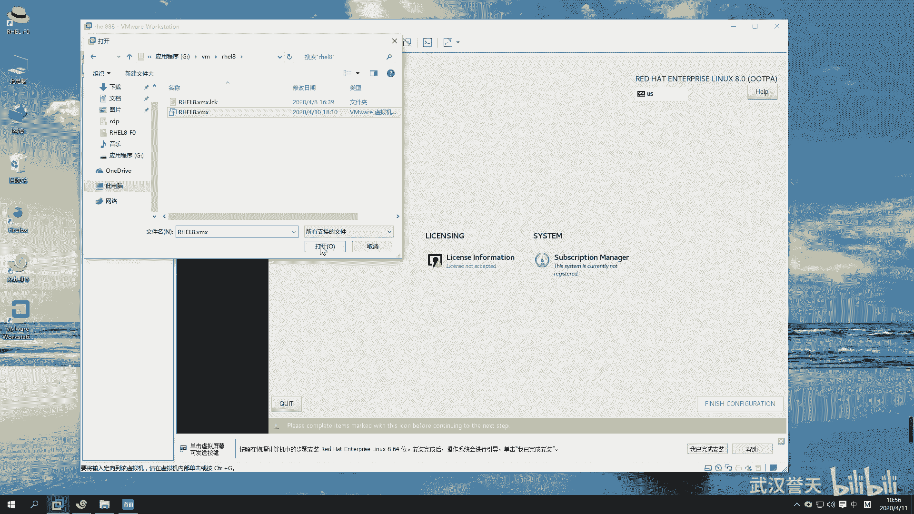

# 【已更新】最新版丨誉天红帽RHCE 8.0系列培训视频 - P1：rhel8.0系统安装-01 - 武汉誉天 - BV1cv411q74E

OK那我们今天开始啊，我们先从把系统装起来啊。嗯，前两天有一个学生嗯，然后找我。

哦，找我干什么呢？他问我装系统，装系统怎么装是吧？然后呢。我说你现在连装系统都不会了吗？他说长时间没有装忘记了。嗯，好，所以今天这门课啊，今天这个装系统大家一定要学会啊，很多同学。😊，他没跟着学。

那系统不会装，我很苦恼啊。这个。肯定是我哪个地方教的有问题啊。

好，呃，下面呢我们准备好了win more这个虚拟机软件。然后呢，我们需要去给它装系统，但是装系统之前呢，我们还需要做一件事情啊。比如说我想去装系统，但是这个系统呢需要装在硬件之上，对吧？它需要有一个。

比如说你你给笔记本装电脑，你不是给给笔记笔记本装装装装系统，你需要有个笔记本呢，那你的笔记本需要有什么呢？需要有硬件，对不对？啊，硬件包括你的CPU啊，内存呢。还有硬盘啊。还有还有等等啊。

还有这些硬件啊，当然还有一些其他的这个等等啊等等。好，那么有了这些之后。有了硬件之后，我们才能在这个硬件之上装一个系统。对叫装一个系统啊，叫操作系统。我们叫OS是吧？叫操作系统。操作系统它是一个什么呢？

它其实是一个软件。它是一个软件啊，那么有了这个操作系统，我们就可以。在这个系统之上再去装一下其他的什么应用程序。所以它相当于给我提供了一个什么，我去控制什么这个硬件的一个接入口，就是这个操系统。

你可以通过点鼠标啊、输入啊、键盘呢，是不是可以怎么样通过这个操系统来传达信息给我们的硬件，对吧？比如说我要写数据啊，啊，写到硬盘里面，对不对？好，那么我们下面装系统，但是装系统之前我们说要准备这个对吧？

所以我们在这个虚拟机里面啊，在这个里面我们先要买一个什么买一个笔记本，这个笔记本需要具备CPU内存硬盘等等这些硬件之后我们再来去装系统啊，之后再去装系统。所以这步刚开始的时候不要去装系统啊。

先把硬件准备好再去装啊。好，跟我一起来啊，跟我一起来，大家把这个有的同学把we station打开啊。win你打开啊，如果你的笔记本是第一次装系统。有可能你装就装不好，后面系统也打不开，对吧？

你需要去你的bis里面，这个待会儿你遇到了再说，好吧，一般情况下都开开了，把那个虚拟化打开。一般现在的这个嗯现在这个笔记本它都虚拟bis里面虚拟化都是打开了。bis是个什么东西呢？

bis是这个你的一个主板上的一个已经装好的一个小的系统。就是你主板上自带的一个小的系统叫bels。这个小的系统里面可以做一些呃基本的配置。好，这个待会儿再说，好吧，你遇到了说老师我怎么装不了系统啊。

对吧？我怎么就嗯不能像你这样，那你就看一下提示它是否提示说你的bellls里面要开启虚拟化啊，这个怎么开，我就上课不教大家，大家自己去百度啊。根据你的笔记本型号。呃，大家要有这个能力啊。

你不能什么都要依靠别人，对吧？别人一步一步来告诉你，你要会去用一些工具。当然谷歌用不了是吧？你就能用百百度啊或者其他的这个一些搜索呃这个这个。方法去解决这个问题啊。好嗯。

O。啊，打开这个软件啊打开这个软件，然后左边点新建看好啊，我这个地方我都要给他说半天啊。你要新建一个虚拟机，看到没有？是不是新建是想买新新的电脑，对吧？这里有个打开。

这个打开呢是这个打开是将来你装好了一个。装好了一个虚拟机，那么你这个虚拟机呃，好，这个待会儿再说啊，打开啊，那这个地方我给大家设置一下啊，就是你的虚拟机将来装在哪个地方。你看我想设置我的虚拟机。

将来因为我虚拟机装好之后，有可能就它是以文件的形式存在的。因为windows上面是不是都是存的文件呀，那我的虚拟机就放在这儿了，看到没有？就是我之前已经装好的虚拟机，那这个是不是对应它这个就对应它。

对吧？这个就对应它。好。那你比如说你这些虚拟机对吧？你比如说我把它叉叉掉了。

呃，那我想去再打开它，那我就可以打开先打开，然后找到是吗？这是我已经装好的虚拟机啊。然后这里这个VM看到没有？然后找到这个VMX的文件打开它。

好，那它是不是就在这儿了，对吧？还有添加进来了啊，当然这个是前提已经装好了，那没有装怎么办？没有装的话，你就只能新建啊，新建。好，那我新建的虚拟机放在哪个位置呢？我可以有一个这地方有个首选项，看到没有？

那以免你后面每次都要改这个路径啊，你把这个首选项打开。你这个虚拟机的位置默认是不是在这里，就是每次都要装在这个地方，对吧？我每次都要去修改很麻烦，怎么办？把它改一下。那改成你的这个G盘，这个VM这里。

确定看到吗？啊，就说那确定啊，那将来你的虚拟机那就在这里首选项。然后在这里把它改到这个地方，那每次你的虚拟机都会装在这个地方，好吧，都会放在这个路径下面啊，这个路径你最好放在1个SSD上面。呃。

放在1个SSD上面啊。

另外我跟大家说一下啊，你们的笔记本要求现在啊。嗯，你们的笔记本的话，你们自己的笔记本啊嗯配置的话嗯这个需要跟大家提前说一下啊，就是我们现在要学习嘛，对吧？你在学习阶段，你需要准备一个。

性能稍微要好一些的啊。性能好一些，也不要你很好，对吧？那性能怎么怎么才是好呢？你的CPU啊，你的CPU你需要是I5，至少I5以上的啊，就你的CPU至少要I5以上的，就I5。呃，可以，但是我这个PC机。

我是S3的，也好像也可以跑起来，但最好是I5以上的啊。嗯，最近几年买的都可以。然后呢，你的内存指这两个有要求啊，内存的话。嗯，内存的话现在12至少要12G以上吧。不过我们红帽7。0的话呃，12G。

但是我们后面有一个环境，这个环境到时候考试练习要用，就是那你考试练习要去用的一个环境。这个环境呢它需要的内存。至少要8G。嗯，那你要跑的顺利的话。那你需要16G的话，应该就比较顺利了。对。

王家良是这个意思啊，就是如果你还你你把它放在云里面，那他不能再开虚拟化了，所以嗯就不能放在云里面啊。然后这个是16G，就是你16G是可以的，是可以可以带起来的。对，16G啊，如果你8G的话。

你可以再去买一个内存条，然后。对，买一个内存条。嗯，买一个内存条啊，好吧，就是尽量把它扩一下。现在内存应该不贵吧，现在内存应该不贵，20G完全够了啊。我的笔记本电脑以前16G呃是完全够的。

不过后来我就加了8G，就20G还好。嗯，这个大家尽量准备这个为什么呢？你说老师说我这个没有钱呀，买不起呀，对吧？嗯，是这样的啊。有很多同学他电脑真的就是差，就是性能太差了。

然后每次做作业的时候呢啊又卡呀，然后又又又出问题呀，搞了半天，别人作业都做完了，他还他还在搞去，他还在搞这个呃还在卡着呢，对还在卡着呢啊。所以大家这个既然你如果你是学生啊，嗯，你可以去兼个职啊，是吧？

但是现在兼职有点困难，是吧？😊，嗯，就是反正尽量准备好，否则你这个起点就比别人低了是吧？啊，那工作同学，你这个对你来说应该还好吧。对，工作同学，反正你就准备一下比较，你既然学选择学习了这一行，对吧？

你既然选择进入这一行，你这个吃饭的家伙是吗？你得你得这个到位啊，你否则这个做不下去的啊，吃饭家伙都不到位。你这个你你怎么你怎么学的好，对不对？好，所以尽量满足这个配置。好吧。

你说老师我12G可不可以可以啊，就12G也行，你说我8G加个4G。既你能加两个内存条就加大一点，好不好？加大一点啊，因为我们那个环境确实。对，环境确实是有点大啊，越来越到后面越大，越到后面越大啊。好。

这个是对大家要求。另外你硬盘的话，最好准备个SD。就是硬盘，你你把虚拟机都放在SD上面。嗯，这样的话你的性能虚拟机跑起来就会更流畅一些。更流畅一些啊，就是这个对大家的这个笔记本的要求，好吧。

嗯。好了，那么你这个地方就放在你的SSD上面啊。好，现在我们现在我要新建一个虚拟机啊，新建一个虚拟机。好，那打开这个地方新建训拟机。好，这里有两个，一个是典型，一个是自定义。呃。

默认你们应该是在典型这里。典型的话，它后面的步骤比较少。比如说你选几个步骤就没了是吧？我们都选自定义啊，都选自定义，这是我们后面可以自己做设置，自己去做设置啊，选自定义。好，下一步啊下一步这个地方呢。

我们我们选硬件的兼容性。就是你看我们如果选低版本的话，它的可能不支持它低版本有可能不支持是吧？那低版本可能不支持啊啊，你选高版，就是默认什么版本就什么版本就可以了。就默认让它默认就可以了啊。好。

不要去动它。另外这个地方每个人都要注意啊，这个之前有同学嗯，他是默认是在这个位置的，看到没有？它默认是在这里这个选项啊，他说安装你的光盘，我说现在不要去装系统，不要去装啊。不要去装。

否则它就会自动帮你去这一步步装了啊，不要去选这个选择稍后装系统。现在我们还没有装系统，只是怎么样去准备我们嗯硬件的一些设备啊，对准备硬件的设备。嗯。啊，然后这个地方选择稍后第三个，再相当于遍第三个啊。

啊，另外呢这个地方呃选择linux啊，选择linux，我们装linux是吧？你还可以装windows嘛，选linux。啊，现在lininux的话，这个地方会出现乌斑图，对吧？其实你可以去选择对应的版本。

呃，比如说我们呃这个地方有个已经有红帽八了是吧？我们用的是这个光盘，用为这是这个版本啊，叫红帽企业版linux864，就这个啊，我们选择这个我们装的是这个版本，但是先选先选后面我来解释这是什么意思啊。

哦。没有8，你就选7，好吧，因为你没有8，你就选七，选七也可以装成功的。嗯，就是说你说老师我装个我选个七可不可以能不能装，可以装，OK吧，它是可以装的啊，因为只有15好像才有8呃。

那个低版本是没有这个8的。呃，也可以装，好吧，可能后面就有一点点区别啊，其他没什么区别，是可以装成功的。呃，这个的话嗯。这个就是你选八跟选七。

它唯一的区别就是它后面的这个呃它给你的默认设置跟这个硬件的兼容性可能会有一点不一样。不过一个虚拟机都可以用，好吧，都可以用啊。好，但是你不是说我选你说选个无斑图，这最好不要这样子啊，就是对应是什么版本。

就选什么版本，你装什么版本就选什么版本就可以了啊。好，没有八的就选7好吧，下一步啊。然后这个地方你看我是不是刚刚把位置一下子改了啊，改成G盘了是吧？它就会默认在这个下面。

是不是呢就会生成就是生成一个路径，就是你的虚拟机像会就装在这个地方。好，那这个名字太长了，把改一下啊，我就改了个RHEL。那它下面这个名字就自动改，这样的话我们不用每次都去选择了，看到没有？

不用每次都去选了啊。好，那放在这儿OK吧，你装好就在这儿了啊。好，然后下一步。好，这个地方呢我们选择处理器和你的每个处理器的内核的数量。呃，处理器的这个数量的话，你就选1个CPU就可以了。1个CPU呃。

一盒其实也够了，或者你觉得你的。你就2个CPU1盒也可以是吧？你2个CPU两盒就随便选，就是你也不用选，就两个最多两个就够了，好吧，那1乘以22乘以1都行，好不好？啊。

下面因为上面啊这个是选CPU的数量，几个CPU，然后下面是选核，每个CPU有几核，对吧？有几盒啊。啊，那你就选一也行，他们两个是最后是相乘的结果，这个相乘的结果呢是不可以大于一个数值的。

就是说不可能无限制的去。比如说我这个地方选那6848对吧？那么就超过了什么，超过我们处理器内核总和总数量就超了。虽然它是模拟的，但是你也不可能去不能去超过它那个数量啊，那个数量是16，看到没有？

16是吧？好，这个呢是这样的啊。这个是怎么来的呢？其实这个最终这个内核处理器的内核总数是2，那么这个内核总数叫VCPU叫VCPU啊，就是。

呃，大家知道。就VCPU这个大家自己去做笔记啊。啊，VCPU就是虚拟CPU嘛。那这个虚拟CPU怎么来的呢？它是根据你的物理级的这个物理机。比如说你物理机是一个物理机是1个CPU是吧？😡，呃，1个CPU。

然后你是两核不是或者四核是吧？呃，四盒呃，假如说你每一盒对应一个线程。是这样子啊。每盒对一个县程。每个核对应一个线程的话，那么最后就是几个呀，就是就可以模拟4个VCPU就这个地方最多可以选4个。

但是说你每个盒对应两个线程，那就是2乘以4是8个，就是模拟8个VCPU呃，所以它是最终跟你的线程数量是有关的啊。啊，那么这个。CPU和和线程是什么关系呢？好，我来解释一下啊。呃。

CPU呢大家知道它是一个呃用来计算的对吧？呃，它里面有计算器、控制器、存储器等等啊，这个大家要去把这个CPU的构造稍微再去了解计算机基础里面有啊。啊，那么1个CPU其实在同一时刻同一时刻啊。

那么他在同一时刻呢，它是只能怎么样。他只能做一件事情，也就是说这个人呢他在就是你把他当做一个大脑，对吧？那个大脑在同一时刻，他只能计算一个，只能计算一个任务。对，同一时刻计算一个任务啊。那么。

如果我想去计算多个任务，因为我的实验任务比较多，我们现在都叫多任务嘛，你看我这又开又开浏览器啊，又开这个这个这个各种应用程序，对吧？那肯定是多任务嘛。那如果我想去实现多个任务怎么办呢？我就要怎么样。

我就加CPU啊。加CPU对不对？大家知道CPU它是有它大它很大对吧？它在主板上，它是它相对来说它比较大。嗯，那你的主板呢又不可能说我不停的去加CPU是吧？你主板就那么大，你的你的笔记本。主板越来越小。

对吧？嗯，越来越薄，所以你的CPU不能加太多。错所以CPU数量是有限的。那么这个时候人家怎么办呢？CPU又不能加太多，所以这个时候就会出现一个叫1个CPU又会有核的概念。核数。何秀啊。

那么这个核呢跟CPU是什么关系呢？呃，核其实啊它就是一，比如说呃1个CPU。两呃四盒吧。1个CPU4核，那么相当于这1个CPU里面其实相当于就是4个CPU了。只不过。大小还是1个CPU对吧？

里面呢装了4个脑袋，就是人有4个脑袋，对吧？一个身体，四个脑袋啊，那么这个时候每一盒呢就在同一时间就可以计算一个任务。那这个时候同一时间是不是可以计算4个任务？对不对？可以计算四个任务啊。

这就是合数出现。对合数的出现啊。好，那么这就是和，那它那它到底有什么区别呢？11个CPU4核跟4个CPU它的区别还是有的啊。因为他们是因为知道CPU里面是有缓存的。缓存嘛存数据的对吧？嗯。

那CPU他们是有一级、2级3级缓存这样子。嗯嗯他们如果有三级缓存，他们核之间就会共享缓存。共享缓存啊，就区别就是这个其他的就不。

