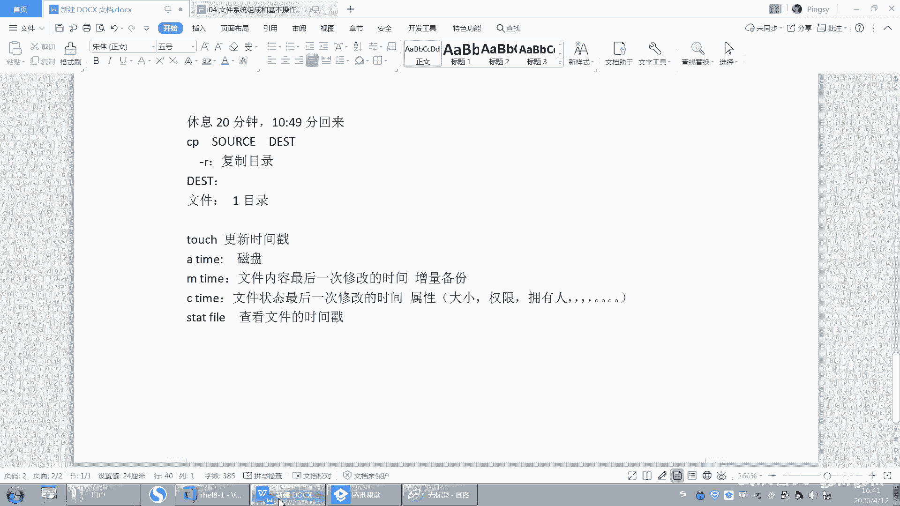

# 【已更新】最新版丨誉天红帽RHCE 8.0系列培训视频 - P20：文件系统组成和基本操作-20 - 武汉誉天 - BV1cv411q74E

数量很大的，还有ZB级别啊，还有EB级别啊，对吧？他们之间就相差1024。对，相差1024啊，所以我们的企业当中的数据其实都可以达到什么？PB级别甚至ZB级别。对你如果你要去备份的话，其实是很难的。

这种备份其实很难的啊。你你这种全部备份一次，你怎么样叫全备呀？什么叫全倍？全。备啊叫全备，全部复制一遍，叫全备。好，这边刚复制完那边怎么样，嗯，这这边又产生新的数据了，又要备份，对吧？全备好。

所以全备呢优点是什么？优点？可以保存保存保存一份完整的数据，对吧？对，这个数据可以完整的备份一次，每次全备，每次全备就有一份一份一份完整的数据。但是有缺点是时间长。哦，占空间大对，时间长，占用空间多。

你每次备份，每次备份是不是都要什么500G的都，每次都要500G啊，甚至更多，对吧？好，这是全备。嗯，然后呢。那全备的话有这个缺点是吧？那我们就什么样做增量备份啊。那增量嘛，比如说增量怎么增量呢？

周一先做个全备。周一先做个前备，周一嘛，周一的先先做前备。然后周二周二的话，你的数据比如说数据呃周一是一个G是吧？周二是2G，那么周二只需要备份是么？只需要备份那份那部分增长的数据。

就是说你只需要备份什么呀这一部分数据。但是周二的备份是不是要在周一的基础之上去备份？周二备份的是不是在周一的基础上，周三在周二的基础上，周周周四在周一的周周周三的基础之上。好，那这样的备份优点是什么？

快只需要备份是么？只需要备份我增加的那部分数据。对吧缺点是什么？😡，缺点缺点是什么呀？只要你有一部一个备份数据丢失了。就有一个数据丢失了，那么就有可能导致什么后面的一备份都没有用了，都没有用了啊。

那只能这个全被，这个没坏，那只能回到什么周一的数据。哎，只能回到周一的数据啊。好。那么这样备份那每次增量就也不太好，所以我们就是一周做一次全备，就下周一唉再做个全备。是这样吧。好，就是这样备份策略。

这个呃大概是这样子啊。好，那么这个增量的，我们在考虑这个增量这部分，我们怎么去判断增量呢？对吧怎么去判断唉，它就是去去增加的那部分数据呢，就像一个文件一样，这个文件。

他如果没有修改，我下次在备份的时候，是不是就不不需要去备份它了？😡，那他修改了我要不备份啊，修改了我是肯定是不是要要去备份呀？😡，对不对？所以一旦修改之后，那你说at time变了要不要背呢？

at time背了，其实我不需不需要去背。那M它们变了，我要背，那肯定要背呀，对吧？肯定是要背的。😡，啊，所以这个地方我们你要知道啊，虽然你现在没就是没办法用到它，但是你要知道它们增量。

其实各种备份原理，其实原理都是一样的。

对，原理都是一样的。就看它有没有一些高级功能是吧，怎么去实现的等等啊，用什么技术去实现的。嗯，好吧。

然后这个是M time啊，记好啊，文件内容最后一次被修改时间。第三。第三叫劝拒他。叫C time。好，s time呢记一下啊，s time。

C time是文件状态发生变化的。呃，就是文件状态最后一次变化的时间。什么叫状态呀？嗯嗯。好，状态就是一般啊这个我们在这个。嗯，有个专业数叫原数据，对吧？但是现在就是其实就是文件的属性。

什么叫文件的属性啊？我觉得大小啊。变了呀。文件的这个这个这个呃什么。权限变了呀。文件的又人又组变了呀。这是不是叫文件的这个什么？😡，对，是的啊，就是描述这个文件的一些相关的信息。呃。

我们叫C time叫叫叫属性，叫属性啊。嗯，等等，好吧，点点点。

嗯。好，这叫文件状态，对吧？好，你看现在。看好哦。我现在呢。把这个文件的，你看这个文件的时间说，现在是11点36分，对吧？我把这个文件的用人改一下。我可以把应用人先改一下啊。你先不管什么改的。

然后再来看。变了没有，是不是变了？我什么都没有没有动它的内容哦，我只是把这个文件什么。😡，拥有人改了，拥有人现在变成了是吧？幼儿人现在变成了addmin了。对，这个时候它的状态就发生变化了。

状态发生变化了，C time就变了。但是A time跟M time有没有变啊，没有变。哎，没有变，我没有看过这个文件内容，也没有修改文件内容。所以这个叫C time文件状态发生变化了啊。🤧好。

记下来了吗？记下来没有？那么这两个之间有什么区别呢？M time的C time，你发现只要你M time变了。😡，所以它明定会变。因为你修改内容嘛。它一定会发生变化。注意啊，M time变了。

C time一定会变，但是Ctime变了，M time不一定会变。C time变了，M time不一定会变。记住啊。C time变了，M time不一定会变。M time变了，C time一定会变。对。

就这个意思嗯。啊，那么touch跟这是什么关系呢？我们state是不是查看文件啊？查看文件的时间戳是吧？好，请告诉我LS杠L。S杠L那个时间是指M time A time还是C time？

知不知道吧？

L杠也要看到那个时间是哪个time啊？其他同学呢hello hello起来了，刚紧睡你睡着了，起来了啊。只有这个。这个这个这个。嗯，孟令康同学一直醒着是吧？你觉睡觉这个问题。我这怎么解决呢？

要不给你们唱首歌吧。嗯。啊。唉，我看你们都醒了。行了就算了吧。OKLS杠0。😊，嗯，L杠也要查看的是什么，查看是文件这个M time啊对M timeO吧嗯。它始文件最这个最后一次修改的时间啊。嗯嗯，好。

嗯。哦，做笔记没时间理我是吧？😊，哦，好好好OK。😊，嗯。O。

嗯嗯。嗯。唉，我下面讲什么啊？😊，好，继续啊，那我想更新时间戳呢，更新时间呢就用touch来更新fill。然后state。嗯，那这个时间戳是不是更新了，更新到当前这个时间了。好呃。

我们我下面会布置一些作业，大家回去做啊，你慢一下touch慢一下touch好吧，你们自己去慢。呃，这个是什么？这个是改变文件的时间戳。然后嗯。怎么去改变，对吧？比如说我只想修改M time，那就杠M。

我只想修改这个。呃，这个什么C time啊，不 a time就杠A，还有我还可以修。比如说我touch是不是呃直接修改到当前的时间啊，这个时间戳对吧？好，那我为什么要更新时间戳呢？

如果有一个文件非常重要，但是只有备份只备份了一次，你是不是很担心啊？所以这个时候你可以怎么样啊，把备份多次，那怎么把备背上呢，你可以更新一下文件的时间戳，对，更新一下文件的时间戳叫touch啊，好。

自嗯这个大家自己去慢一下啊，你你不会慢呢就百度不会想办法把它慢出来。好，到时候根据题目要求去改变这个文件的时间戳就可以了啊？对，我们可以手动去更新啊，然后让他去备份。对，让他去备份啊。

因为有些文件你比较重要的文件，你备份一次的话，你是还是很担心，万一丢了就没有了，就一个备份。所以你要备份多次，那你就更新一下文件的时间戳，就下次就会备上。嗯。嗯。好。

再来啊。对，其实我们嗯我们系统的话跟存储关系很很密切。对，关系很密切啊。所以我们有些时候也会讲到呃关于磁盘呢存储的一些原理嗯。

OK吧。你们学完lininux的人再去学存储跟你计算。或者是大数据，对吧？这个呃都是有非常大的优势。嗯，我不是说吹牛对吧？就觉得自己特厉害，但是这个是事实，这个是事实啊，你们可以去找。

其他的这个学生去问嗯。好。嗯，那再往下啊。好，下面我们来看一下。这个RM啊RM。

呃，RM呢是删除文件对吧？是删除文件啊。删除文件吗？没。好，删除文件很简单，比如说fill回车要不要删啊，你删的时候，他会问你对吧？要不要删？😡，我说Y要删，那N就不删，对吧？Y就删掉了。

所以它会提示你一下。它会提示一下这个fill要不要删，对吧？就RM嘛，RM叫remove。RM叫remove啊。好，呃，那我删除目录的话，比如说我删除目录叫RM呃test。你这样删除目录呢呃删不了。

对吧？所以现出目录需要加什么杠A呃杠R。对，删除目录需要加杠R啊。哦，回车。那么这句话是什么意思啊？他说要进入，看到没有啊？其实删除目录的本质是什么？😡，删除目录的本质是删除文件，去到这个目录下面。

把文件删掉。好吧，然后他就进入这个目录进入吗？进入啊yes。啊，要是进入这个目录吗？哎呦要。好，以。好，你看这一行是不是就删除开删文件了呀？他先删的是什么？是不是这个目录下面的这个文件啊。

所以它第一步删除文删除目录的本质是先进入到目录下面，然后再把这个文件怎么样给删了，再把这个文件给删了啊。然后hy这样啊，比如说你不删那。你就过下一个呃N呃YNYNY呃呃。你这样一直弄下去，对吧？

我估计要翘多少下呢？呃，这个这个好像是我之前复制的ETCETC下面多少个文件的，大概有几千个文件。😊，几千个文件啊，所以你要摁多少下呢？比如说2000个文件呢就是乘以2，你还摁回车嘛？

还摁个Y回车就4000是吧？哦，那这样的话你这个。从早上开始是吧，删个目录，然后上到下班哦，好下班哦，我今天做了好多事情呀，我手都摁断了，是吧？😊，好。开个玩笑啊。啊，所以删除目录的话。对。

删除目录的话啊，我们还是呃如果因为它会提示嘛，我不想让它提示怎么办？RM杠RF对吧？终于来了RM杠RF。啊呃R呢是删除目录，F呢是强制删除，就不要去提示我。对，不要提示我啊。

直接删掉false强制删除OK回车。好，这个时候test就没有了，就删掉了啊，O吧，删掉了啊。嗯嗯嗯。所以删除文件删除目录的本质其实是什么呀？就是去删除这个文目录下面的文件啊，目录下面的文件。

好，这三个记住啊。

呃，这个RM注意啊，呃我们在用了这么多的。这个文件这个这个这个操作的命令CP啊MV啊，还有RM啊。是不是都会提示你啊，它是不是都会提示你要不要删啊？😡，但是注意啊。这些操作都非常危险。都非常危险。

比如CPP还好，对吧？MV也比较危险吧。RM那更别提了，很危险，对吧？所以它都会提示你，但是呢你注意啊，我们用的是鸿贸企业版lininux哦。😡，哎，鸿贸企业版8。0，如果你换一个系统的话。

你比如说你用其他的这个版本的系统，那它会不会提示你呢？注意不一定。他不一定会提示你啊。所以万一你删就删了，哎，怎么没有提示我呀，对吧？你还等着人家提示，结果人家没有提示你。😡，没有提示你啊。

所以这个时候怎么办？一定要注意了啊一定要注意了。好，其实本质上RM这个命令它也不会提示的。因为RM是哪个命令呢？不是RM是哪个文件呢？是不是USR并下面的RM啊。好，你用这个命令来删，你用它来。

你可以直接接上这个文件的绝对路径。然后你看我删一个文件啊，比如说。😡，删一个default。好，删这个文件，可以直接用这个路径呢，可以用这个文件的这个路径去引用这个命令呢，然后加上这个文件名回车。

提示你了没有啊？没有提示，对吧？它怎么没有提示啊，怎么我执行RM的时候就提示我呀。好，注意。😡，RM你在执行的时候，其实它是一个什么它是一个别名。对，是一个别名。

它其实给你加上一个什么加上了一个杠I的选项。杠I是有交互过程的。就是我跟你之间，你要问一下我，对吧？你要问一下我交互嘛，对吧？得直接交互。所以你在删的时候，比如说如果你接的是什么，你接的是加一个杠I。

Fil。01对。这样的话是不是会提示你，所以它就相当于RM就等于什么RM等于RM杠M嘛。😡，这个RM是原来本身这个RM是这个路径，然后这个呢是我们的别名，理解吗？好。

这个别名并不是所有的系统都会给你帮你去做这个别名。注意这个别名是指我红贸企业版，他帮我做的。那你换一个系统，它有可能注意是有可能没有帮我去怎么样帮我去做。而且CP其实也很危险，为什么？

因为CP它会遇到同名的文件会覆盖，是这样吧？默认到复默认覆盖时候，是不是加杠I的选项啊，你看吧，which。😡，CP它是不是加杠A了，然后which取。MV是不是加杠癌了，是不是都会提示我？

对吧都会去提示我啊，所以一定一定要注意啊。啊，那你说老师怎么办呀？万一人家没有帮我去没有帮我去加杠癌，那我每次执行RM不是要很谨慎吗？别人又不会提示我，对吧？啊，怎么办？以后教你怎么去做啊。

怎么去做这个别名啊，怎么去做这个别名。😡，好呃，更恐怖的是，哎，做个别名LS等于RM是吧？好哦，对，老的同学说老师RM杠RF斜杠行别回到我们今天今天说这个问题啊，从山库到跑路，对吧？😊，嗯。

今天学完就会就就可以跑了啊。好，早上还记不记得我们早上讲过，我说把根下面所有的文件。嗯。好，看这里啊，如果我想把这个文件RM把这个下面的文件清空，我可以用一个命令叫RM杠RF新。

那星号就会匹配这上面所有文件。回去了，这样的话是不是就空了，对吧？星号嘛，所以那如果执行这样的一个命令的话，是不是就会将跟下面所有的文件都会匹配到？能不能理解跟下面所有的文件都可以匹配到。

那么跟下面所有文件都会删掉啊。好。那么我们之前讲了一个什么data嘛，我说创建一个data目录，假如说啊创建一个data目录，然后我给这个data目录挂载了一个什么，唉，挂载了一个这个这个这个嗯分区。

挂载一个分区啊，然后我还往这个data下面注意要挂载一个分区，我还往这个da下面怎么样啊啊，创建了一个文件。😊，呃，创建了一个文件啊，叫fill。那请问我在RM杠RMRF。呃，呃2F新的时候。

会不会匹标这个会不会匹标这个文件呢？这个跟我挂没挂在分区有没有，这个你看啊看好啊，现在这个da下面有一个文件叫fill，对吧？那我这样一去匹配，能不能匹配这个文件啊？😡，不能。不会吧。嗯嗯。

不会匹配是吧？怎么不会匹配呢？😡，肯定会匹配呀。da上面有没有玩家，有对有fi啊。对吧商目全部匹配。所以。现在你这个fill，我管你是在哪个分区啊？😡，我管你是在哪个分区下面。怎么样啊？

你只要是在根下面。注意哦，你只要是在根下面，在不在根下面啊？再跟下面吧，这个路径是不是可以用星号匹配啊？对，全部删掉。全部删掉啊。就这个意思。看有没有快照啊。呃，快照快照是有的啊。

好，那今天我们就。看一下啊。嗯，应该差不多了，我可以删一把了啊，删一把赶紧就跑吧。好，反正这个还好，刚装的系统啊，快照也有。

M杠F啊呃。嗯。这个。有没有人有有有吧，我记得最近。呃，杨峰最近好之前有很多案例是这样吧。他不知道是不是山根哦，我就我就不说我遇到的，我是嗯我朋友他同事对，是这个是真实的事件。我朋友他同事。

然后他是他在执行的时候。嗯，每年都反正很多这样的事情，他在执行的时候，他好像不想不不小心把一个东西删了。不过那个好像是挂载了一个磁盘。😮，一般这样的数据是比较重要的那这样的数据是比较重要的，OK吧。

他真的把他删了，他是误操作了。这个不是说那个不可能的事情，真的有。😡，呃呃，不是杨哥的同事啊。嗯。刚好那个那个服务器刚测刚上市没多久吧。好。你说老师，你把这个你说删了吗？你说RM杠RM斜杠C删掉之后。

😡，系统挂了有没有关系呢？系统挂了有没有关系啊？😮，系统关了没有关系。对，系统关了没有关系，关键是什么？😡，关键是什么呀？关键是什么？我的数据。对，关键是我的数业务的数据在这里。对。

关键是我业务数据在这里，我系统恢复了又怎么样？有可能我恢复了我的系统，我数据丢了，还是一样找不回来。所以你系统崩了，其实没关系，我服务我可以重建。说实话，但是更重要是什么？更重要的是数据。

更重要的是数据啊。所以大家以后啊。😡，你只要走上这条道路。你就可能会面临着这样的问题。如果有一哪一天跑路了。你就不要说在玉天上过课了，好吧。😊，嗯。OK那你也不要说是我教的了啊。😊，嗯。哦。

提前给大家说一声说一声啊嗯。😊，对，其实修系统呢还是有可能的。但是数据恢复，除非你有备份，你备份，你备份的话，你备份的周期比较频呃频繁。那你丢的数据少一些。但是你备份的周期比较那个的话，呃。

你呃比较间隔时间比较长，那你丢的数据比较多，丢的数据就比就比较多啊。好，那我们试一下啊，之前也是这样，也也也是这样删，他其实有些时候你知道他是你你以为他傻吗？你以为他就是星吗？

你以为他知道他就哦是斜杠星就把文件都删掉了。他其实不是这样的呀，它有些时候是什么原因导致的呢？它是有些时候是它中间有可能会匹配一些变量啊，或者是特殊字符啊，它在匹配的时候不小心怎么样啊。

匹配到了根下面的文件。😊，所以特别是那种写脚本哇，那脚本老厉害了啊。😡，所么正常这样去执行的人几乎没有吧，对吧？除非像我这样的嗯。😡，呃，几乎没有，所以大家一定要注意啊。你不要觉得一些好的一些脚本。

一些命令，一定要测试测试再测试，对吧？不要让这个地方有可能它是一个什么，比如说一个是个变量，结果这个变量为空了，那么就是不是是不是就匹配到根了呀，对吧？那这样的话。😡，跟这没什么区别了。

但是你这样删好像删不掉，对吧？因为他做了保护的，他做了保护的啊，那做了保护的，还需要加这个才能删掉啊，但是这个新呃这个就可以删了那。好，但是你删的时候，你看。这个地方。对，这个地方就是说报不能移除。

对吧？好，发现删半天还没有删掉啊，怎么样c住CctrC哦。😡，啊，结束了哎，没结束。Yeah看 see see。嗯嗯。呀怎么没有ctl C啊，C不掉了。啊，你看这儿啊这个地方是pro，对吧？这里报错了。

为什么这里删不掉呢？因为这个地方是内存里面的数据，还记得吗？我们讲的时候，pro跟s木加面是内存里面数据，内存里面数据是没有权限去删的。😡，但其实已经删掉的文件，你加的什么R杠RF会提示你吗？

它不会提示。😡，对他不会提示你啊，OK吧，他不会提示你。好，不会提示，你就删掉了呀，没提示就删掉了呀。那这个怎么样系统就挂了，挂了啊，啊这个我就ctrl C不标了啊，怎么。算了，重启吧。试一下啊。

看看命有重启。哎，我我这个嗯。这个是因为我没有装Qs，好像。就是这样重启也重启不了。无法这样发送指令，是因为我没有装Qs。嗯。嗯，IIT0与NIT0就命令都没有了，看到没有？命运都没有留。Reboot。

命令也没有了。

我跟你说，呃都不安全啊，对，都不安全。所以。隔壁有个控制台，这跟控制台有关系吗？嗯，做什么都是有风险的。只要你谨慎操作，其实。案例还是个别嘛，对吧？只要你喝酒不上岗，上岗不喝酒，对吧？好，关机啊。

网络也很那个网络如果是网络瘫痪，也很严重的。嗯，因为业务就停掉了嘛，你的损失也很大。

好吧。

OK哦，这个是RM啊RM。所以大家嗯就是做IT这一行还是要谨慎一些啊，嗯不要太。太那个了，太粗心大意了啊。好，后面还有两个命令，我们讲完啊讲完。嗯，还有什么创建文件，我们讲过了吧。

还有创建什么创建目录。就叫data是吧，就创建目录，这个没什么好说的啊。好，比如说我想创建一个目录，叫data下面的test下面的。data下面的data是吧，据一直叫data也可以嘛。

但是这样创建的话，就创建失败。嗯，你看创建失败对吧？啊，为什么呢？是因为我在创建这个目录的时候，他最终会认为我创建的是这个目录，能理解吗？他最终认为我创建的是这个模，最后一层这个前面都是什么？

前面都是它的这个路径，前面都是它的路径啊。啊，那么创建这个目录的时候，前面这个路径。怎么样不存在，所以就报错了。对，不存在，所以就报错了啊。好，那这个地方怎么办？我们加一个参数就可以了。

加一个杠杠什么杠P吧。啊，对，杠P对你还可以加1个5V，可以看一下它的过程，看到没有？V是查看详细信息回撤。他怎么样先帮你创建这个，再帮你创建这个，再帮你创建这个是吧？你看一层一层的帮你去创建。😊，嗯。

啊，最终是创建这个。对吧。嗯。删了之后，我跟你说啊，一般删系统的话呃，删了之后你怎么恢复对吧？我们说系统一切系统就是文件，我们是我们就就以这个原理，就系统一切接文件。你只能说进就业模式。

然后通过一些其他的方式把一些文件给就是复制过来，然后让系统恢复。嗯，让系统回复能理解吧？嗯，但是业务的数据除非你有备份，一般很难恢复。但是如果就是说你去删掉一个文件，那比如说你删掉一个文件。嗯。

这个文件我们有一些开源的工具，好像是可以恢复的。但是这个时候你一定要如果文件丢失了，那这个时候千万不要去动系统啊，不要去动它，也不要关机，也不要干嘛，反正呃还是有可能会恢复，只要你删对不太多。

有一些工具可以帮我们去恢复，但是系统不是不不在啊，系统不自带这种工具，OK吧。我们的意思本身它是不自带的。这个要看，比如说你家里装一个其他的这个呃呃组件。比如说我像像我们经常用hadoop的时候。

hadoop里面它防止误操作，它就删的时候，它每次都会将那个文件移到那个垃圾桶里面去。然后你误删了，可以把它恢复过来，但是我们这个地方是没有的，这里面是没有的啊。好，这个是创建目录啊。

杠P是递归的去创建目录啊，不是其实P不是不是说递归的意思，P是指parent，它是指副目录。parent咋写来着？你去问一下。他去杠P嘛，parents是吧，parents啊parents。

他说就是如果父目录怎么样存在就不会报错。如果父目录不存在，那就怎么样去创建。对，去创建啊，就这个意思，parents啊。好吧。呃，我我们作业当中，如果你有的就是可能需求跟你上课我没讲过，你就要去慢去啊。

就要去慢。好，然后我们删除目录录，删除目录啊，删除目录刚我们讲过了吧。删除目录我们讲过了是吧？好，那这个空目录怎么删呢？还有一个叫RMDIR，它是专门删除空目录的那。删除空目录的。但是一旦怎么样啊？

一旦这个空目下面有文件。嗯。那这个时候比如说test下面是不是有一个文件，有一个目录叫fill，那你再闪RMDRRtest。它就删不掉，那看到没有？就删不掉。所以这个命令只能删除一个空目录。好吧。

那空目录你可以用它，那真正删除目录还要用什么？还要用RM杠R。R是删除目录，F是删除什么ts这样子。O吧。对，其实这个比较少用，这个还是用的比较多，我这个一般都很少用，一般空目录很少有空的是吧？

好，删除。好。O。呃，最后一个命令啊最后一个命令讲完下课啊。

呃，最后一个命令是什么呢？我们信我们另当中啊。呃，有个特点，就是说我们的文件呢。我们的文件后面会有个后缀名，就是比如说我创建一个文件叫。我创建一个文件叫fill点CIT对吧？

那我创建一个文件叫非要点PDF我创建一个文件叫非要点PPT。😊，好，那么这三个文件实际上文件类型是一模一样的。虽然后缀名不一样，但是文件类型是一样的。因为我们lin当中啊。

这个后缀名实际上是没有什么含义的。唉，没有什么含义的啊，但是在windows当中，你点PDF结尾的文件，是不是叫要PDF打开呀？你点PPT结尾的文件啊，PDPPT打开对吧？就文本文件对吧？是这样吧啊。

在lin当中没有没有啊没有这样一说。😊，好，那么呃。

有些时候我们想去看一个文件，呃，万一你从windows里面复制一个文件过来，对吧？复制一个文件过来，还是PDPDF那你可能有一些工措殊的工具把它打开。但是你怎么看呢？你难道根据它的后缀名来判断吗？

你没办法根据后缀名来判断呀。

所以这个时候我们提供了一个工具。提供了一个工具啊，这个工具呢叫fill。叫fill。好呃，你可以这样。

哎，我看这样能不能复制文件进来呀？

我没有装ts，我不知道能不能复制唉。我看一下啊。呃，把这个复制一下。重明一下个PPT。没装确实。这咋复制啊，它就就复制不了啊。

就复制不了是吧？

他这个好像。这复制不了。

没装tes，那算了吧。好，那么我可以用fi来去看啊，看它到底是一个什么样的类型的文件。回去了。那他这个空的是吧，他什么都没写。是个空的。好，那这样吧，我们来看一个看一个目录，好吧。他显示个目录。啊。

我们再这样吧，我们去看一个嗯我可看一个这个啊。嗯。System。你都可以用fi要去看嘛。而且如果它是PDF，它可以显示它是真正的1个PDF如果是PPTX如果你下课就是你们后面做作业的时候。

能把它拖进来的话，你就用它来看，好吧，以及它是什么样的压缩文件，它也可以看，都可以看。比如fi。呃，defat。它是不是一个链接文件啊，看到没有？symic叫链接文件符号链接。

还有比如说我们之前看到压缩文件在哪里，在这里在USS share。a man是吧。man这里，然后有个man一man一这里。好，像那种红色的都是什么压缩文件。那什么类型的压缩文件呢？Fll。呃。

写1个OS tray点1啊这个。嗯，看到没有那。你看加上这个文件就可以写着它是一个GZ部格式的压缩文件。看到没有？就是如果你用这个windows里面复制的文件，复制过来之后，到这个里面，它也是可以看的。

fill也是可以看的啊。所以以后我们看文件类型，我们就用fill来去看你看文件的后缀没用的啊，文件的后缀不代表什么。可以吧。文件的后缀不代表什么？

我还可以把它改成什么啊可以改成什么以点什么GZ结尾那那它就是压缩包了吗？不一定啊，对吧？😡。

好，这就是我们的这个命令啊命令这个fill这个命令啊。呃，哦它显示什么哦，很好啊，这地方显示了一个什么呃，它这个。呃，word是吧啊，word你看这个都可以显示的，这是可以显示的啊。好嗯。

这张我们就差不多了啊，我们这张大概讲了什么啊，文件系统的结构，文件系统的结构一定要清楚啊，以及我们后来其实也没说什么，就讲了一些各个命令怎么用的啊，各个命令怎么用的。好，我说一下这个。嗯。嗯。

这个。我们的这个课后作业做作业啊。

嗯。我想一下啊。嗯。大家嗯。作业怎么交呢？嗯，好，我来说一下作业怎么写啊。我等会儿呢，我今天最迟明天啊，然后我会发一份作业到群里，到群里面啊。然后发一份作业，比如说我命名叫HCEHCE啊。

什么什么什么对吧？然后写个姓名。那么你们就以这种格式去命名啊，就是什么什么什么姓名，谁谁谁，对吧？把这个名字改成你自己的名字，千万不要忘记改名字啊，改名字没改，就你自己没交啊。呃，大家在发的时候啊。

嗯你们统一发我QQ邮箱。因为你们发微信的时候，有时候我手机收到了。呃，这个。就发来发去，我有时候没看到没下载啊，就就就就很难去收。所以同一QQ邮箱啊，QQ邮箱是134。我们好像没加群里是吧？

这是我的QQ邮箱，13482434692的QQ点comM。对，这是我的私人邮箱啊，这是我的QQ号。你们可以加我QQ号，我觉得QQ传文件比较方便一些，所以统一发我邮箱里面啊。嗯。好，然后作业要求作业要求。

好。最要求是什么呢？这个我要重点说一下啊，因为同学交作业不规范啊。好，作业要求呢，比如说啊我让你创建一个文件。那么你需要怎么办呢？你需要把你的文你的这个命令截图。命令截需要截图啊。啊。

命令截图完之后就是命令执行完之后要有什么验证。OK吧，要有验证啊啊，最好你还能标记出来啊，因为我们之前有很多很多的同学。他呢。嗯。对他就把这个这个这个他做的非常棒。

到时候你们你们做出来肯定会有做的非常好的学生啊，同学，然后我可以把它发出来给大家看一下。呃，验证就标记，比如标上啊，这个呃如果你能做到什么呃选上步骤，这个是最好的。因为呃这个你自己看好吧。

有时间你就做一下，有时间你就弄一下，没时间你就截命令截图验证就可以了。啊，如果自己没有做出来，就是你没有做出来，你写个说明好不好？你让我火眼金睛去看是吧？我每次都火眼金睛看啊，你其实你没有做出来。

但是你又骗我是吧？😡，之前还有同学把别人的作业拿过来直接交了。我说你是当我是中学生，小学老师还是幼儿园老师啊？还是初中老师、高中老师是吧，就没必要啊。好，说明一下你这个地方没做出来，我知道就行了。好吧。

那下次我在上课的时候会重点去讲。对，这就是你要说明一下，就不是不是说说明什么，说明这题比如说你没做出来，对吧？你随便敲一下那个命令放在那儿，实际上你是没有做出来的。但是我这样一看是不是看得很清楚。😡。

对我就看看的很清楚啊。哦，就是方便你我他是吧？好，还有什么呢嗯。啊，命令截图截图啊，然后验证啊标记一下，所微说明一下啊。嗯，其他的话。其他就其他就应该没有什么。然后作业最好在周四以前。周四以前啊交过来。

交上来啊。我这出作业我太难了。嗯。我尽量好吧。啊，周四以前呃就是交上来啊。就你不要这个搞到周五晚上大半夜，还有能给我交，周六交，这个我就没时间看了，好吧。嗯。嗯，这周四以前交交作业，还有其他什么？

其他还有什么？嗯，这个就是要练就是要练啊。嗯，其他的话看大家有什么问题吗？呃，PPT的资料我都会发群里的啊。因为资料都发群里，还有我跟大家说一下啊。多少多少算多呀，我的妈呀。😡，好嗯。大家后面啊最好。

怎么说呢？他不要缺课啊，因为你缺课的话，我很难受。因为每次讲了，我我在上课的时候，我能尽量把自己讲的东西都给他讲了。但是呢嗯。你们如果不上课的话，这个不上课那个不上课。然后都来问我之前讲过的。

说了一大堆讲过的那我再给你讲一遍，我真的不知道该怎么一句话，两句话讲不清楚啊啊，让你怎么办呢？你要你迟在落课了，你就把上一节课的视频补一下，上一节课的视频把它补一下啊，然后然后再看一下有什么问题。

然后如果是没听懂还是怎么样，你可以问这个没问题啊。嗯。然后你就用word吧，我我会发word，我会发word，你就把word复制上去就可以了。呃，作业的话没有那么多啊，我想作业我头脑袋也疼。嗯。

如果你实在是想去做作业的话，你可以把我们的书上那个练习题也先拿出来做一下，我尽量给大家多布置一点，好吧，我尽量啊。嗯。其他看看同学们还有什么问题吗？下周我们下周大概上什么内容呢？我们下周要上用嗯。上。

用户啊、组啊权限啊。呃，还有管道啊。管道是吧。啊，重一项啊。还有一些工具的使用，就是文本文本处理工具啊。嗯。就是这些，其实一周一周下来内容还是蛮多的啊这等等这些。这些内容。嗯。这是下周下周啊。嗯。嗯。

记下来没有？QQ邮箱。嗯。想一下啊，还有什么还有什么。好好。O O。到时候我把PPT打包放群里，大家去自己去下载啊。其他就没有什么问题了。如果有问题的话，我在群里再跟大家说，好吧。嗯，加个群。

大大家发发好吧。OK吧。行了，那我们这周就到这儿吧。嗯，第一周大家辛苦了，这是个开头啊。这只是个开始。后面坚持啊一定要坚持，这周能看到大家，下周不知道还能看到大家看到多少人啊。

呃这周大概是70人左右是吧？那下周的话多少人你就不知道了啊。大家尽来尽量都来上课，OK吧。嗯。对，大家记嗯。哦，可以可以溜了可以溜了，嗯，可以下课了。😊。

