# 【已更新】最新版丨誉天红帽RHCE 8.0系列培训视频 - P21：用户组和权限-21 - 武汉誉天 - BV1cv411q74E

看一下上周作业啊，我上周的嗯我数了一下，大概我收到的作业有将近60，应该是60份。呃，所以大家第一周完成的还是很不错的啊。呃，希望大家后面能够继续保持。然后后面昨天晚上发给我的，我就没有来得及看了。

大家尽量就是尽量早一点啊。好，我们来看一下上周作业啊。呃，绝大多数同学其实完成的都很好。呃，还有个别少数同学，他这个呃基础可能不是很扎实啊，所以大家还是要注意啊。呃，就是说要多练呃，我题目可能还好。

也不算多，也不算少，不过基本上够大家练了。呃，如果你觉得还不够的话，你可以自己去嗯找一些相关的网上的题目啊去做一下。好，我们来看一下第一题啊。创建一个用户啊，这个用户的身份哦。

用用户用root身份给user一修改密码rehead啊。然后这个一般都没什么问题，用root来给大家修改的话，我们直接输入新的密码就可以了啊。在这个地方好，然后还有的同学在这个地方呢。

他其实是报错了的啊，他没有看出来，所以一定要把这个单词开会啊。第二，切到root呃切到Uer一用户给自己修改一个密码，密码是任意的。啊，那你需要切到什么you则一，然后执行password。

那么你需要在这个地方。呃，输入当前的密码，然后再输入新的密码。那这个地方可能就是报错的，看到吗？这就是报错的啊，所以下面这个才是正确的。OK重新输入一次啊，因为密码不符合要求。好。

然后第三个的话就是这个VI编辑器的使用啊，这个就没没什么好说了。啊，第四题查找啊查找系统当中所有与pasword的关键词相关的慢帮助章节。这题其实是呃怎么样呢？

它是呃所有与password的关键词相关的慢帮助章节是吧？呃，其实这个地方啊我们呃这题的目的其实也不是说考导大家，就是大家大家知道有哪些章节，慢帮助怎么用的。

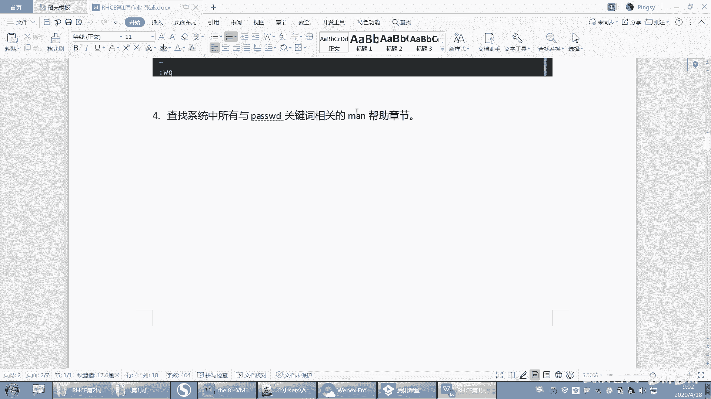

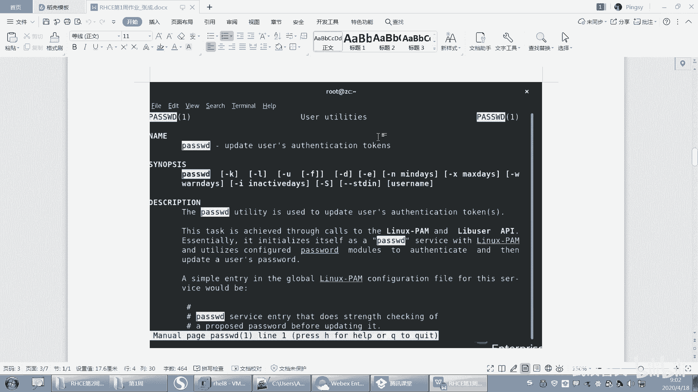

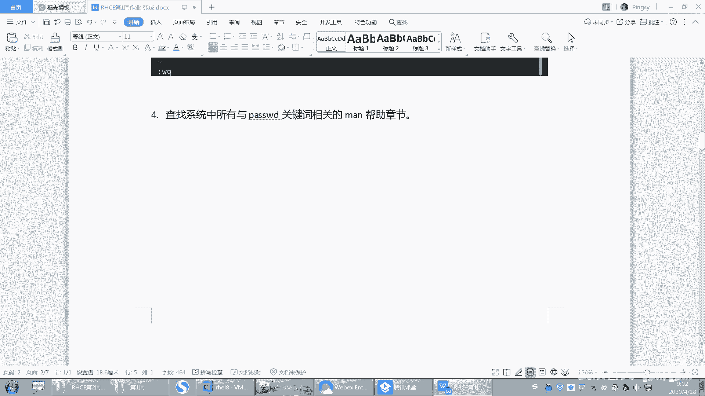

有的同学他用不同的方法去做的啊。比如说呃有这样做的，有用what is做的。呃，what is password？那么这样查出来的话，就是什么呀？就是这个里面是带有password这个关键词的对吧？

这个方法也可以啊，呃，这个也是可以的呢，这个就它第五章节第一章节或者用man杠K呃杠K password。这个也行，这个的话就是你的描述信息里面有pass word，他也给你打印出来了。嗯。

还有的同学是用杠大K杠大K的话，你有一点点问题啊，我们这地方是杠小K，所以没有查出来，后来同学问我的同学后来看了呃，别的同学有好像是大K吧。你就小K好吧，大K好像每一个都打开看了一眼。

然后退出退出退出退出这样子。

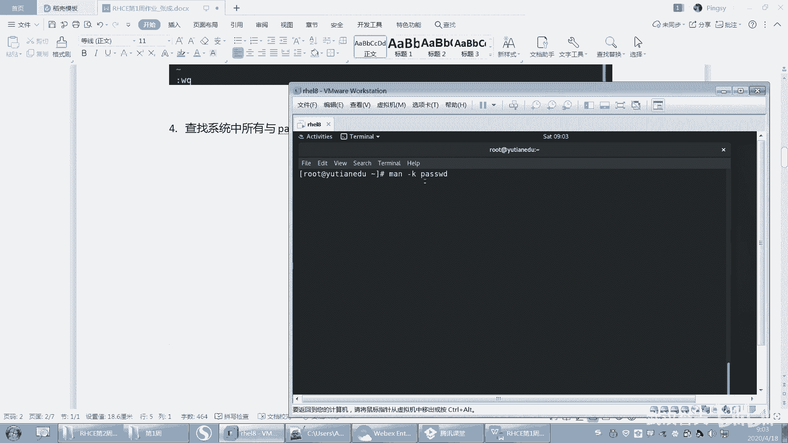

好，这是这个啊，就是。然后第五个这个要牢记啊，这个我出了一个这个嗯。不是操作题是吧？然后因为这个非常重要啊，特别是第五个章节。第六个创建目录，这个目录的路径有同学弄错了，目录的路径。嗯。

其他都没什么问题，其他都很好。然后复制将ETC目录拷贝到data，并且重命名为config啊。呃，从现在开始，大家要养成仔就是仔细看题啊。嗯，可能是我的这个题目出的有歧义，对吧？或者是你理解的嗯。

跟我出题的。这个嗯想的不一样，所以有同学把这个ETC拷过去了之后。对吧，然后把这个data命名成config了，所以导致后面的路径都是错的啊。所以大家要看清楚，包括大家考试也是这样。

如果前后之间是有关关联的，那么一定要注意了啊。好，这个复制我就不多说了吧。保留权限的话，其实这个地方权限你复制它也不会改变，对吧？嗯，你就加杠P啊，或者知道杠P或者杠A什么意思，看一下那个帮助啊。

这个是就让他去看一下。还有这个这个路径错的，我没有跟大家说啊，因为可能他题目看错了或者是理解错误，这个我就没有提出来，我就没有给大家把这个问题揪出来。这个其实应该是你语文过关的话，能看清楚了。

这题就能做对啊。然后还有这个啊。这个你看这个题目，它就是什么呀？它就是有问题的啊。你看config下的shareow文件更名为password，这个是肯定是你的语文有问题吧。那MV是吧，就是这个地方啊。

然后这个重命名你这里啊password，你看这地方有问题啊。😊，然后嗯还有后面头同学不带路径的。这个地方是不带路径的啊，那这里它直接加了一个pasword，所以这个地方不带路径也是错的。

因为我们需要重命名，并不是要把它怎么样把它给这个这个呃移走啊。上课的时候是不是说过了？如果你要比如说我说要把data下面的。呃，这个ETC重命名对吧？那你如果是这样写的话，重命名为config。

那这样的话是不是就有问题了，对吧？把有可能把它移走了啊，所以重命名的时候千万不要移走，特别是系统的一些文件的时候，系统目录的时候啊，千万不要把别人移走了啊。这个路径主要是路径的问题。

然后第十题的话就是ETCM录下面所有的文件的时间戳更新。啊，这个的话呃是这样的。嗯，这个新号呢上课其实我只是提了一下。哦，我说是星号匹配的是所有文件，对吧？所以如果你是这样写ETC。斜杠星。

那么这个代表是ETC下面所有的文件啊，不包括ETC本身啊。那如果你是这样的话，你有可你就把什么ETC这个目录它的这个。嗯，时间戳更新了啊，所以你要加个星号。这个星号今天我们会给大家讲。

因为这个是我们的通配符，其中一个通配符啊，它其实指的是匹配0到多个字符的意思啊。啊，就包括你上根对吧？我们举个例子，是不是上根呢，上根的时候是不是说到这个呃这个这个新对不对？

这个新代表是这个根下面所有的文件啊。但是不包括根本身OK吧。啊，新不包括目录下目录的是吧，那可能这个要递归了，他可能是不是要有有没有递归修改的？看一下目录里面的目录是吧，目录子目录里面的文件是吧？好。

然后创建一个空文件。嗯，对，这个我们可以通过其他的方法。比如说后面我学了find之后，有同学用的是fd，对吧？把所有的文件都找出来，然后touch这个也很好啊。不过目前为止我们只学了星号。

所以你用星号去做也可以啊。但是后面你慢慢学了之后，你就会发现，其实每一步操作，它不同操作之间肯定是有区别的。有的是有区别的啊。好，然后在这个tab下面创建一个空键叫test。

通过文本编辑器来验证时间戳的更改。通过文本编辑器是吧？好，这个你就是VI看一下啊，有同学说老师VI为为什么我修改之后呃，at time没有变，对吧？呃，是因为这个嗯你保存退出之后，at time呢。

它是它有时候不是实它不是实时更新的，就是at time默认它不是实时更新的。所以你呃如果你保存了后面时间没有没有更新的话，可能过一段时间再更更再更新这样子啊。所以就是at time。呃。

就是流通学保存的时候，对吧？没有attime没有根据新啊。好，这个用VI验证一下就可以了。看哪种情况下，A time会变是吧？然后M time我说M time变了，C time是一定会变的。

这个一定要注意啊，M time变了，C time一定会变OK。好，清空tamp目录R杠Ft斜杠新，有同学把tamp目录给删了啊，还有同学把ETC目录也删了，就就差删根了啊。

把这个tamp目录直接给删掉了，就是它是这样删的。嗯。注意啊，你清空一个目录，我觉得我说的应该比较清楚的。我不是说删除这个目录，对吧？清空这个目录。😡，那应该把目录，比如说把回收站清空。

那你把回收站呃清空一下，你不是把回收站给删了，对吧？所以这个你删的话，你会把这个目录给删掉，能理解吧？不要去这样去删啊，这样会把这个目录给删掉了。你要这样怎么样加一个星号。

这样去匹配tab下面所有的文件。😡，OK吧。啊，然后给data目录改名为HCE呃，这个没问题啊。这个有同学没有加这个斜杠，后面这个HCE这个根没有加啊，一定要一定要记住。你的每一步操作其实都很危险啊。

特别是重命名的呀，删除的呀，复制的呀，其实复制也很危险。😡，复制如果遇到同名的文件，对吧？它就会直接呃有的会直接覆盖。如果你呃强制对吧？强制默，而且CP默认它是什么呀？默认它是直接覆盖，不会提示的啊。

啊，第十四题创建一个这样的目录结构。呃，这个杠P我们指的是什么？指的是如果这个副目录不存在，那么就将它的副目录一并创建出来。其实我们最终创建的目录应该是这样子的，对不对？创建是F这个文件夹。

但是我们其中的什么？这上面这几层中间是不存在的，所以你要加一个杠PP就是parent副目录副目录啊把副目录一并创建出来，然后再怎么样，就要加个F。所以你看这边就可以怎么样ABCD这样子啊啊。

有同学是一步一步创建的呃，创建A创建B创建C创建D呃，这样的话你就不用这么麻烦了，直接加杠P就行了啊。好。就我搞了两个平台。有时候看不到大家聊天这个。嗯，我我待会儿再看啊。嗯，好。

然后这个第十五题将jeep下面所有的文件嗯拷贝到过来，保证权限不变是吧？其实加杠A就行了啊，复制的时候。嗯，目录的话就杠R对吧？目录加杠R啊。啊，这个十六题查看时间之后。

并尝试用哈奇修改A timeMM time呃，有的同学是直接杠A，这个是修改到当前时间呃杠M修改到当前时间，或者也有同学修改到某一个特定的时间是吧？加杠T，它可以修改到某个特定的时间。嗯，这样子。啊。

这个我你们怎么做的，我就没我都没有说大家有问题啊，因为这个也没有确切说我要修改at time到什么时间是吧嗯。

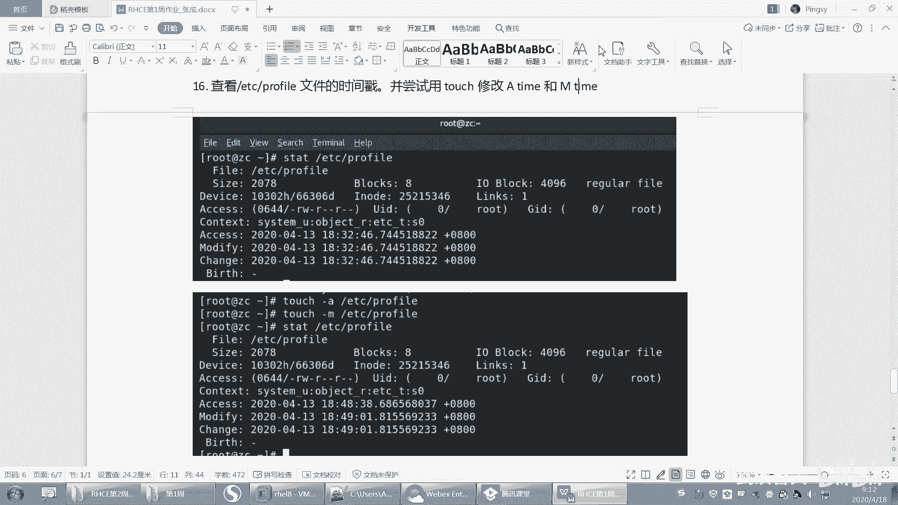

好，然后第十七题的话，这个这个没有把文件拖上来是吧？没关系，后面我们学了网络之后，把网络配好之后，我们再用其他的工具把它拖上来啊。好，这个是。嗯，我们上周的作业。

另外我还需要再给大家呃提那么一点点需求啊。嗯，周作业的话，大家尽量在周四的时候。对，周四嗯。之前这样交上来啊，就是说你不要拖到周五周五晚上，这样的话我可能也没有时间。

因为我不可能坐在这里等着你把作业交上来，我就给你看，交上来就给你看啊，因为我可能会统一在某一个时间，然后去批改作业这样子啊，因为作业很多呃。呃，你看我这周收到了60份作业啊，我每一份都会去都会去看。呃。

所以大家有什么问题的话，我应该都是知道他做了做了情况。嗯，这样就交作业的时间啊，然后大家统一都交QQ邮箱。因为呃我上次把微信的就落下了，然后。我的QQ邮箱就在我Q我在QQ群里面，QQ邮箱就直接那个嘛。

我是在QQ群里面，你直在QQ群里面找我就行了。然后我是忘了，因为我知道微信上面交了，后来我就忙忙忙就忘记了。其实我也保存了，就是后来忘了直接去到那个QQ邮箱里面去那个了。嗯。

但是嗯然后这个是交作业时间啊，然后还是希望大家能够坚持去做啊。因为自种我其实嗯我也在坚持做这样一件事情。嗯，包括其他哦我不知道其他老师怎么做啊，就是这从我带这个C1班。嗯，然后我觉得我给大家布置作业了。

我应该帮大家去看。因为如果我不去看的话，你可能你自己就不就不知道自己错在哪里，对吧？或者是呃做了这也没人帮我看，我我我我感觉我自己感觉啊，也不是哪个人说老板强迫我说让我去改作业，或者必须给我的什么任务。

让去改。其实我也可以不用改。我就看一下，我我我我随便怎么处理，我都可以，但是我是我自己选择要帮他去改作业。所以我希望大家也能够去坚持，包括我自动带HC班之后，我也在坚持做这样一，我做了几年了。😡。

对我也我平时上除了上课以外，我也要去做其他的事情。我不是说除了上课，我就没事做了。😡，哦，我们也有很多事情去做，大家也是这样，大家工作对吧？上课也有很多事情去做。所以我希望大家你们坚持两三个月就过了。

对吧？但是我一直是要坚持好几年，对，以后还还要去坚持，所以我希望大家也能够去坚持把作业给完成啊，就是不要觉得就我忙啊，其实大家都忙，有很多工作了的同学。他工作很忙，但是他他的作业完成的非常好嗯。

但是反而有一些学生，对吧？他实践其实是很。是很多的，但是他没有去坚持去完成。所以大家一定一定要坚持啊，而且你坚持做下来之后，你整个班结束了，你才会有一些收获。就是因为提因为这个东西就实践。你听再多。

你不练就跟没上过是一样的，就跟没学过是一样的。所以大家一定要坚持去做这个作业啊，然后我坚持批改，大家坚持做好吧，我们都一起来坚持啊。我们一起把这个事情做好啊。

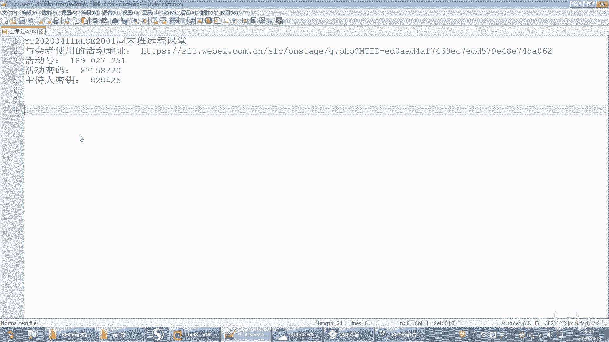

张杰的话。😔，哪个啊就这个吗？你这样去查一下就好了，这就是哪个章节嘛，前面是它这个只不过是这个是个关键词，对吧？它不是一个它不是一个它不它不是它是一个字符串，其实它不是关键。

它就是呢就是这里面含有这个字符串的。

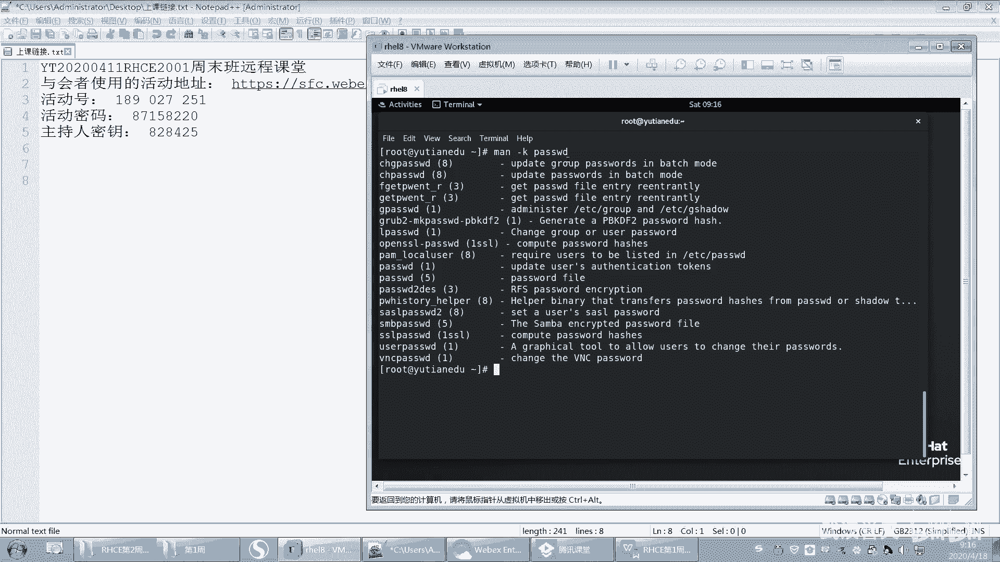

嗯哪一天？我刚刚讲的时候，你怎么没有说？

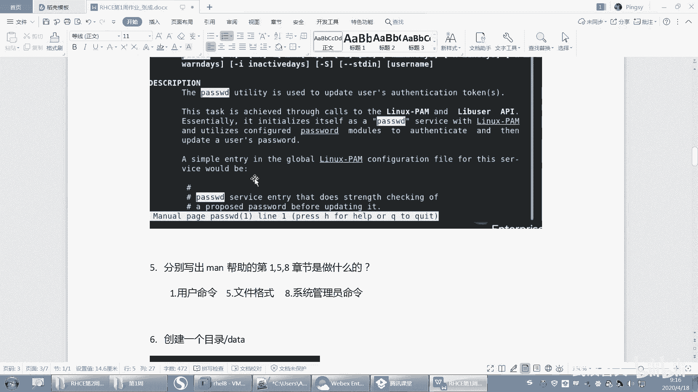

哪一题啊，这题啊这题吗？这个有什么好说的这个。这第一个章节就是用户的命令嘛。

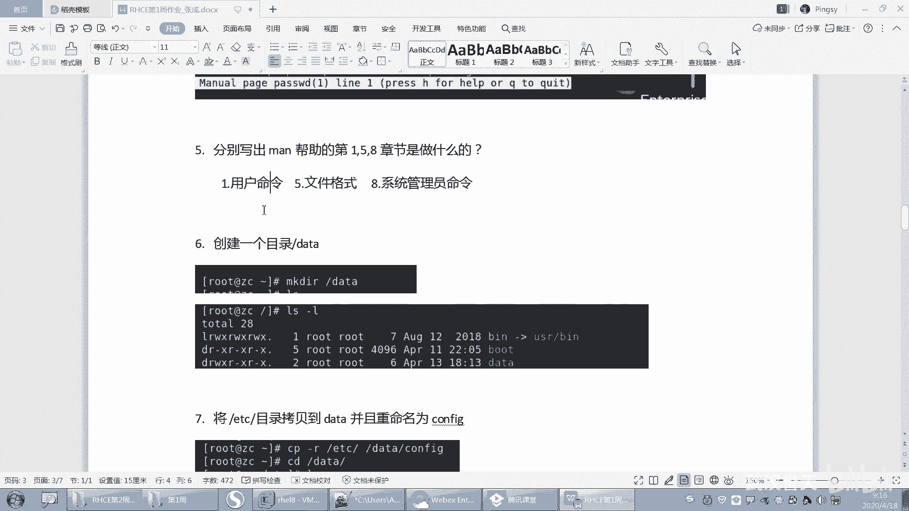

那一般第一个章节，你看这种第一个章节的这种是不就是都是命令，对吧？第八个章节也是命令嘛。然后还有你看第五个章节，这个地方应该是什么？它是一个什么？它应该是一个文件等等之类的。文件的格式书写方法呢。

它是三把的一个加密的文件。它一般都是个文件，就这样啊，这用的比较多的3个。

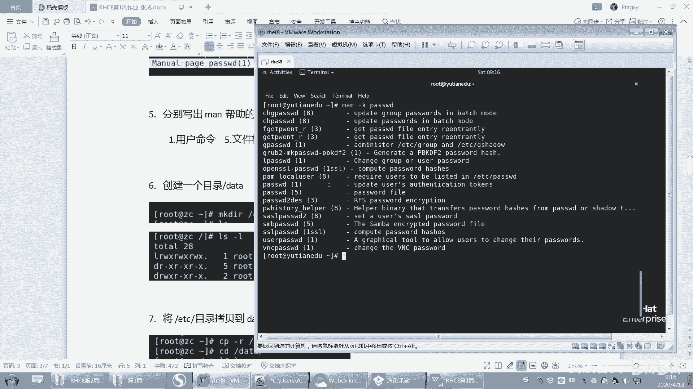

三个这个这个这个三个帮助嘛，每个帮助每个章节是做什么的？就第一个章节就是命令，第8个章节，系统管理员命令只有root可以执行的对吧？然后这个是指文件的格式啊。对，括号里面的是章节的意思啊。

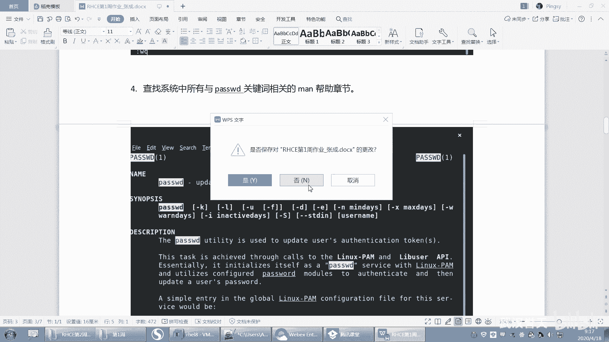

好，那我们。不说了啊，我们就开始这周的内容了啊。呃，这周呢大家呃也也不用觉得这个作业没得做了啊。我我这周呢特地嗯给大家准备了很多练习题，呃，大概有几十道题这样子。所以大家这周上完课就有的练了啊。

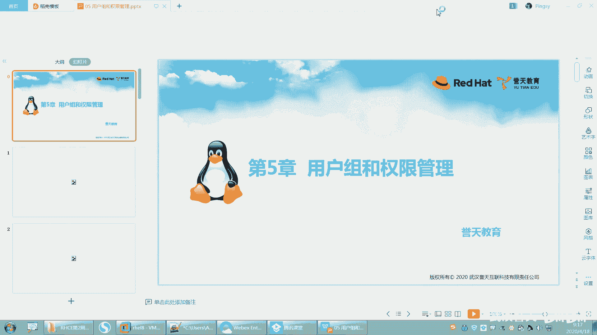

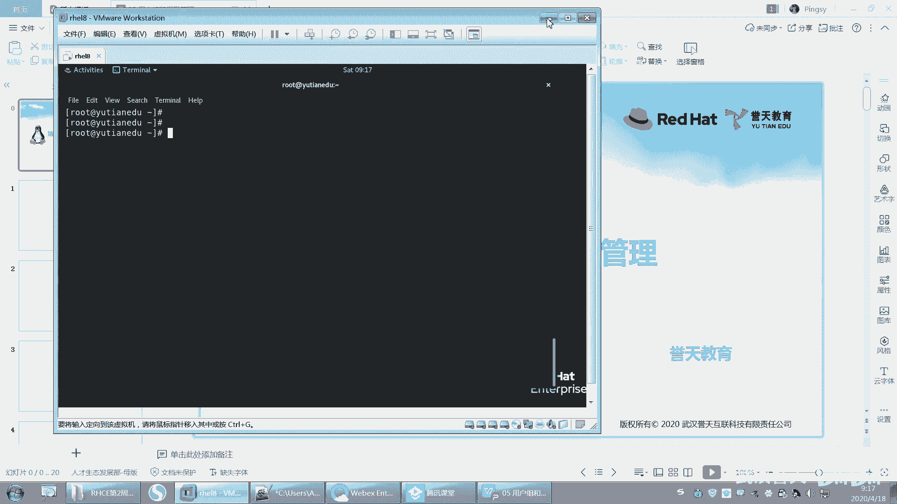

嗯。啊，你像我每次给大家出题，对吧？我还要去想，还要去能够实现的，大家能做到的对吧？嗯，好。嗯，我们大概回顾一下啊，上周我们嗯讲了哪些内容。其实上周内容其实不多的，只是一个入门，对吧？嗯。

有很同学其实有基础的，然后觉得呃进度有点慢，不过大家不用慌啊，后面慢慢慢慢我们就呃这个这个要一步步来啊，不要那个不要慌。嗯，上周我们其实主要学了系统的安装，对吧？系统安装还有什么，还有基本的命令的使用。

啊，基本命令的使用啊，然后还有一些帮助。帮助的章节对吧？呃，帮助就是帮助命令呃命令语法帮助资源命令语法呃，然后还有就是我们的文件系统。呃，大概是这些内容啊呃系统安装目前还是有同学还是有点问题。

你多装几遍啊。然后基本命令的使用呢其实在帮助语法里面，我们后来又复习了语法当中最重要的命令选项参数这些啊。这些一定一定要注意，我目前为止还没有发现哪一个同学哦，有一个同学。

他把这个呃选项跟参呃这个呃杠跟选项之间加了一个空格啊，这个可能误操操错了或者怎么样。中间是没有空格的啊，你空开了，它们两个就分开了啊，就不是一起的了。还有中间没有空格啊啊，命令选项参数等等啊。呃。

基本上是没有同学把这个语法弄错了啊，所以一定要注意这它语法已经帮助怎么去查，一定要看看帮助啊，看帮助。然后最后是我们学的文件系统，文件系统里面我们讲了一些比较重要的。

其实我觉得非常非常重要的一个东西叫路径。就是这个路径相对路径跟绝对路径啊，因为这个我们不像windows里面我去点，对吧？但是linux当中你引用任何的文件，注意我们再去引用文件和目录的时候。

我们都要去用什么，都要去用路径，前面都要去加它的路径啊啊，比如说我们有一个文件叫ETC那么我只引用这个那其实这个根是不是也是它的路径，对吧？这是它绝对路径啊。那其实我真正匹配的那个目录文件是ETC对吧？

是ETC本身啊，所以然后你对这个文件或目录进行操作的时候，一定一定要注意它的路径，否则你就有可能把你的这个系统的文件移动了呀，删除了呀，或者是无操作了啊。啊，千万千万要注意啊，平时你做实验怎么来都行。

但是你你你去做实验的这个环境，不要去到生产环境去做啊，一定要有自己的实验环境虚拟机来做啊。好，以及这个呃什么哦路径是吧？路径非常重点重点啊，然后以及里面我们呃CP啊MV啊，其实这些都简单。

只要你把路径搞清楚了，这些都没有什么问题的啊，包括RM啊。嗯，LS啊、CD呀对吧？PWD啊。嗯，还有MKDIR呀啊以及他们的一些这个选项啊，这是我们上周内容啊。好，这周呢我们开始学权限部分了啊。啊。

第五章呢就是用户组，还有权限。嗯，从这一张开始，我们开始接触到用户了，用户是什么概念，怎么管理用户组是什么概念，对吧？怎么去管理组以及我们文件的权限是如何的，怎么去查看怎么去修改，怎么去设置权限啊。啊。

这张就是我们呢这是我们的内容啊。呃，理解lind系统的安全模式，它是怎么去做的？这个安全。每一个权限是意思是什么，对吧？比如读啊、写啊、执行啊，呃，它分别对文件还有目录都是呃都是什么区别，对吧？

以及管理我们的用户和组啊，以及阅读和理解文件的权限和设置文件权限啊，这是我们这周内容。好，下面我们来看一下呃这个用户啊。嗯，其实我们linux呢。我们lininux当中啊。嗯，非常重要的。

我们叫多用户的操作系统，对吧？呃，多用户操作系统其实嗯这个windows它它也可以怎么样，它也可以多用户嘛，它也可以用多个用户去登录去使用。其实也可以啊，但是这个我们在lin当中其实体现的尤为就是突出。

对吧？啊，多用户的操系统。那用户的概念大家已经不陌生了啊，我们登录任何的这个APP对吧？或者是系统啊，我们都需要怎么样，都需要用到用户啊，就需要用到用户啊，那么用户呢有一个东西叫用户名。用户有一个对吧？

就是有一个东西是吧？叫用户名啊，这个用户名它是一个字符串啊，比如说一般我们就是user呃user一对吧？这就是用户的用户名啊啊，包入管理员名权限，就管理员对吧？

administrator或者是我们的root用户，这种都是叫他的这个呃用户名啊，用户名啊，那么呃。唉，我们登录系统的时候需要用到什么啊？用户名是不是跟密码呀？😡，啊，用户名跟密码。

比如说密码是rehead，那么用户跟用户名跟密码的区别是什么？我们用户名呢通常是指你的身份。😡，你是谁对吧？你以什么身份来去访问你是user一，那你就是youer一的身份。你是root。

就是root的身份，对吧？就标明你是谁，其实标明就是什么？就是你是谁。😡，就花 you是吧？啊，那么第二个密码呢，密码其实跟用户用户名跟密码其实是分开的对吧？我知道了你是谁，那么啊你说你是谁。

你是user一，你说你是root对吧？那你怎么证明你是，你怎么证明你是root呢？那么这个时候我们就需要什么就需要密码啊，哎你输入了usZ的密码，我可以证明你是Uer对吧？你输入的root密码。

我可以证明你是你是root身份啊，所以用户名密码啊，当然有的呃有的好像是这个登录身份，它统一，比如指纹呢，对吧？这种还有红膜解锁呀，还有人脸识别，那这种其实用户名跟密码就是什么。

它已经就是从为一体了啊但是我们绝大多数的这个呃登录信息还是离不开用户名跟密码啊啊，今年我们先学用户啊先学用户密码，我们后面再说啊，啊，用户呢这个是用户名，那我们每一个用户呢都会有一个唯一标识号。

叫UID。叫用户唯一标识号，用户ID嘛，对吧？就身份证那个叫ID啊，那么这个ID呢唯一标识了什么？唯一标识某一个用户。啊，那么在我们系统当中呢，我们这个用户名是给谁看的呢？用户名注意是给我们使用者。

使用者来看的啊。我们使用者是通过什么是通过user一，哎，比如说登录系统，通过root来登录系统。但是系统来识别这个用户的时候，它通过的是UID来识别的。系统识别用户通过UID来识别啊。

那么UID为多少呢？一般情况下，我们root的UID都是0root的 uID都是0啊啊也就是说你看到哦rootUID为几啊？0ID为0啊那么普通用户说只有除了root以外。

我们其他的用户都是普通用户对吧？啊，那么一呢我们的这个用户U一的UID呢一般情况下是从1000开始啊，就从红帽机开始，我们的UID都是从1000开始了，红包六好像500开始啊，不过这个是可以修改的啊。

所以我们系统当中的第一个普通用户它的UID呢是1000啊，UID是1000啊，那么那这样的话系统为什么不能去识别这个什么这个这个这个用户名呢？为什么要非要去识别这个UID对吧？其实一方面呢是由于什么？

由于我们的系统对数字的话其实是比较敏感的对吧？它其实识别字符串难度比较高啊，第二呢。怎么样啊，我们系统当中啊，比如说有没有可能我拿一个问题啊，有没有可能有一个用户呢叫root。它的UID为0对吧？呃。

就先举个举的简单例子吧啊，有一个用户叫addmin，他的UID为1000。然后还有一个用户叫张三。啊，他的UID也为100，大家觉得可不可能呢？大家觉得这种情况。可能吗？不可能，对不对？哦。

同学说不可能啊。好，也就是说大家认为的是我们的用户名跟什么跟这个UID是一一对应的关系，是这样吧？唉，用户名跟UID之间啊，它是一一对应的。对用户名跟UID一一对应的。

那么这个信息呢放在我们的其中某一个文件当中。这个文件呢其实我们已经比较熟了啊，就是这个文件叫ATTC password啊呃，目前为止，你们先这样认为好吧，就是用户名跟UID是一一对应的对吧？

但其实我刚刚问大家那个问题啊，其实是可能的，也就说两个可能他们之间呃存在他们的UID是一样的，这个到时候我们呃学了这个这个用户管理之后，你就可以去看他的帮帮助里面啊，其实是有一个选项的。

我们学了之后再说，好吧啊。OK再来啊。😊，也就是说，其实admin呢，我们人来识别什么？addmin它就对应的是1000。那张三假如说他也是1000，对吧？那我识别张三，我用张三登录数候。

那我最终是不是也是1000啊，那这两个人。😡，他们之间是同一个人吗？其实我可以认为什么呀？他们是同一个人，因为他们的什么，他们的UID是一样的，他们的UID都是1000O吧，都是1000。啊。好。

这个例子可能大家觉得呃这个有点反常，对吧？就不太可能啊，跟我们之前学的，但其实是可以存在的啊。好，那字母说吧，现在呢唉我将这个什么将这个用户。😡，呃，比如说。嗯。好，算了，这个我到后面再说吧，可能。

就就就就举这个例子好吧啊，当两个用户呢，他的UID如果是一样的话，那么他其实是指同一个用户啊。好，这个就是通过什么？通过这个UID来识别啊，通过UID来识别，其实跟用户名没有什么关系。

我最终系统就识别你的UID是多少，你是多少，对吧？UID怎么怎么样啊。好，后面我们经常会用到这个UID的啊。好，那系统的这个用户名跟UID之间放在password里面。

那下面我们来看一下这个password啊。

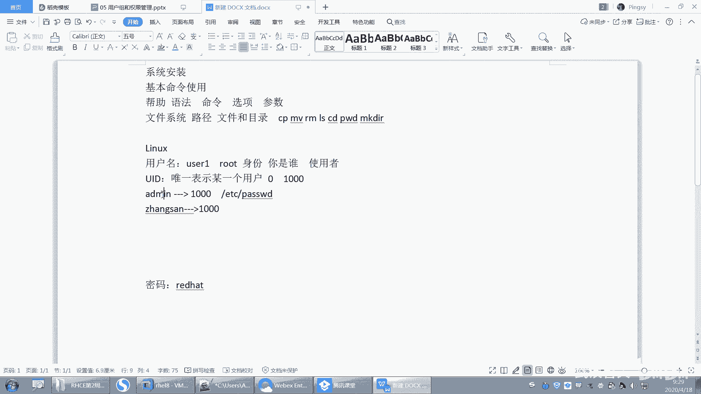

OK我们打开这个password文件啊。好，这个就是我们的什么，这就是我们的password文件里面存放的全部都是什么，全部都是用户的信。注意是用户的信息啊。然后在这个里面我们每一行看好啊。

每一行它都是一个用户，比如说第一行就是root，第二行是bin，第三行是demon是吧？然后最后一行你看是不是usermin啊，对吧？这是这两普通用户啊，所以一行为一个用户，那么。

第一个地方为什么为用户名？那第二个位置为什么？第三个位置是什么？第四个位置是什么，对吧？所以我可能不太清楚每一个位置栏位指的是什么含义。

所以这个时候我有可能就要去慢什么去查帮帮助帮助这个什么这个password它里面这个文件的格式是什么样子的，所以我们就要去慢什么？慢五怎么样啊？password，这就是呢如果你慢，如果我直接去慢的话。

是不是慢的第一个第一个章节啊，第一个章节是不是命令怎么去用啊，对不对？还不懂的同学啊，所以如果我要去慢的话，我就要去慢第五个章节，如果默认慢的话，就慢到第一个章节去了啊。因为password有两个章节。

一个是一章节，一个是5章节啊。😡，好，那么你要指定的这张节就要去man，那就manpasword，这个时候漫出来的才是什么才是这个文件。啊，这里写的是密码文件，对吧？

但其实现在它已经呃密码没有放在这个文件里面啊，这是以前它密码确实是放在那里面，但是现在不是了啊，所以这个它虽然写的密码文件，但是它不是不是这个呃放的密码啊，你看这里描描述写了嘛？这个文件呢。

它是一个文本文件，那它去描述什么。

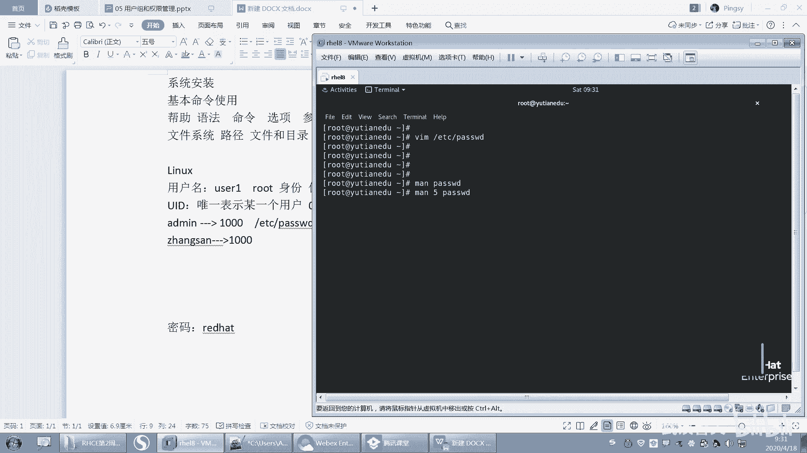

呃，描述这个用户登录账号，那否这个系统，对吧？也就是在这个系统中登录账号的一些信息，其实就有账号信息啊，账号信息。往下翻往下翻，你看这里啊，那它是每一行each line对吧？

每一行都是描述一个啊sing user嘛一个单独的用户啊，那么他们之间用coon separate是吧？这个叫就什么，这是封号是吧？分号的意思啊，就7个分号嘛隔开的。然后呢那name是吧？

第一个是名字密码，第二个写的是密码UIDGID什么什么directy什么here是吧，什么之类的。😊，啊，那每一个栏位的呢这个栏位是如下是吧？每一个栏位都有解释啊，比如说第一个栏位name。

他说这个用户的登录名。呃，怎么样，还不应该包含什么呃，capital应该是大写的意思吧。呃，对，这个之前我们好像呃用户名区不区分大小写呀，这个问一下大家。😮，这个用户名区不区分大要写大家知道吗？

知不知道啊？あ。好了。不区分是吧，还是不知道啊。OK呃，其实大家在用这个大小写的时候啊，要注意它是不区分大小写的。呃，所以呃。大家统一用小写。统一用小写啊。好吧。就是你如果写一个大写的addmin。呃。

它是识别不出来的，就是你最后发的话，它会发给那个小写的的命。对，不区分啊不区分OK吧。所以大家在创建用的时候，不要用大写啊，要用小写OK吧，这capital应该是大写的意思吧，首字母呃，应该是大写啊。

letter字符嘛。你查一下好吧，我是这样呃，我我没记错，我应该知样。好，然后第二个X对吧？什么意思？然后UID什么意思？GID什么意思啊等等这些。你创建是可以创建成功，但是你在用这个用户的时候。

不能用大写。创建是可以创建成功的。好，那么嗯。我们man里面啊其实已经有说明了，对吧？但是这个我来给大家解释吧。好吧，我来给大家解释啊，每一个栏位什么意思啊？好，大家把笔记拿出来记一下啊。呃。

password文件的格式描述啊。啊呃，第一个栏位指的是用户名啊。

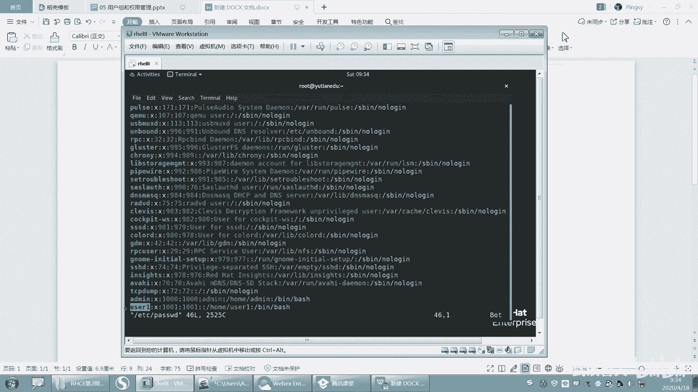

第一个栏位指的是用户名，其实用户名就是就是什么？就是我们系统登录的时候那个名字啊，这个不用多说了吧，就是登录的名字，登录系统的那个名字啊，叫用户名，好吧，用户名啊。

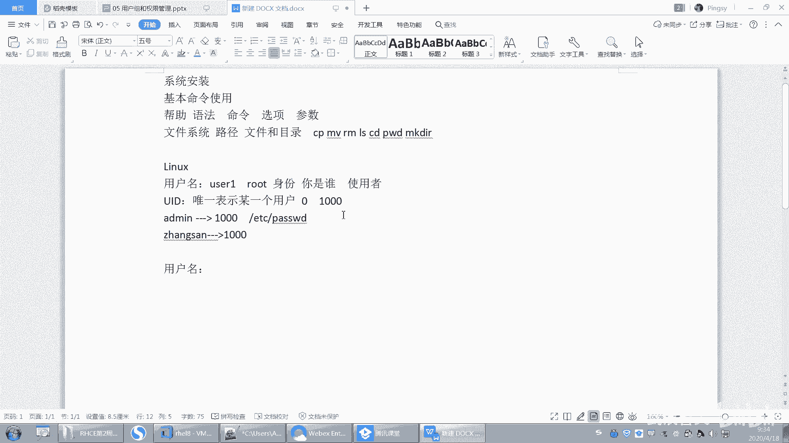

好，把这个栏拿过来啊。

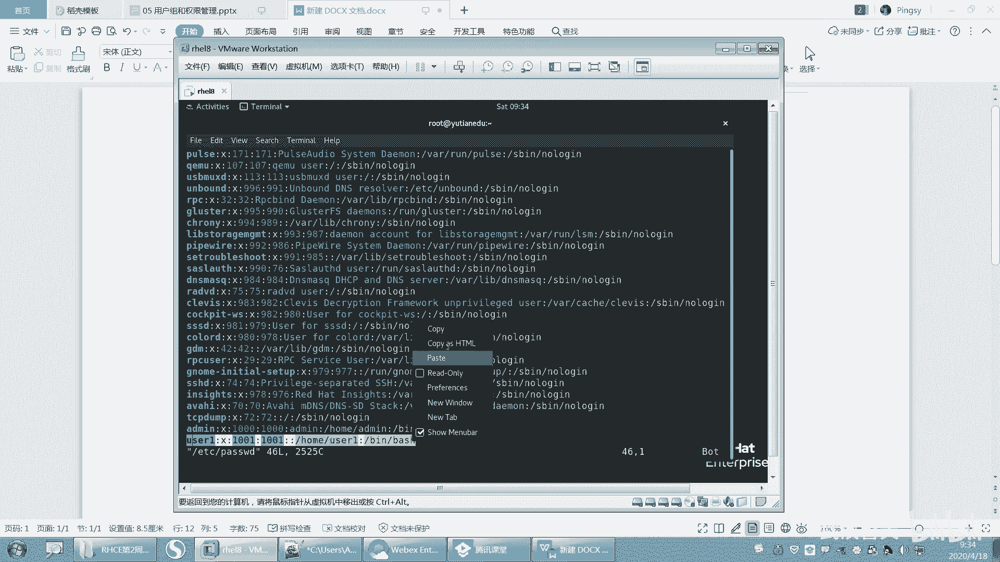

好，第二个栏位啊第二个栏位这个X。X这个栏位啊，它虽然写的是密码，但是密码现在已经不在这个文件里面了。密码在另外一个文件里面啊，在ETCsha里面。在这个文件。呃，在这个文件里面啊。

这个是放的是密码信息，这个放的是什么用户信息啊。那么这个X指的是什么意思呢？这个X指的是登录该用户时。登录该用户时啊。呃，需要。密码哎，登录该用户的时候是需要密码的啊。哎其实我。我看一下啊。

我这个地方其实都有说是吧？这个我有我有做笔记啊。好，再给再写一遍。啊，X代表登录这个用户的时候，需要密码，我来给它验证一下啊。😡。

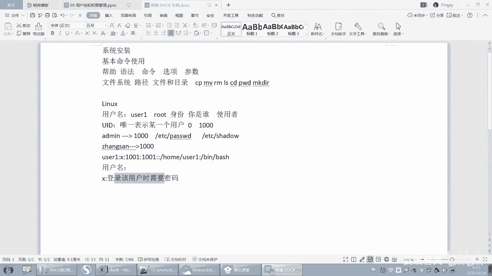

嗯，因为很多同学容易搞混，他说老师那个X指的是有密码还是没密码，还是什么意思是吧？还以为有X呢，就是有密码，没X是没密码是吧？好，创建一个用户啊，叫us2。好，那么这个用户创建出来之后。

你再来看这个地方是不是有个X。也就是说这个用户默认它创建出来，这个地方就是X，对吧？好，那么这个时候呢，我们切到user一啊，比如说切到user一，我们来登录一下这个user2啊。

注意不要用root来去切啊，你用root来切到user2，它就直接怎么样，直接登录过去了啊，不需要密码呀。好，所以这个时候我们用user一的身份来切到Uer2。😊，啊，然后输入密码密码是什么呢？

密码没有密码，我没有设置密码啊，这个地方我是没有设置密码，所以当一个用户。😡，如果没有给他设置密码的话，它是无法进行登录的啊。你这边随便数，你输什么都不对，输什么都不对啊，因为你没有设置密码，对吧？

还有一点提醒一下大家啊，大家在做作业的时候，在切换用户的时候，他他这样切OK吧。😡，他也这样骑。不要偷懒啊，我就觉得有的他就是哎不加杠好像也能切呀，对吧？😡，不要偷懒，中间要加个杠，听到没有？

中间加个杠啊，因为现在我也没办法给你解释清楚，加杠不加杠的区别，但是加杠一定不会有什么问题。你不加杠的话，可能就会出问题啊。所以大家一定要记住，要加个杠切换用户的时候啊。好。

然后现在我来切U子2没有切不过去，对吧？因为如果这个用户没有设置密码，他就无法登录。好，那为什么没有设置密码就无法登录呢？是因为什么？在这个password里面，这个X栏位它有一个X栏位。

比如说我把这个X栏位给去掉。😡，看好哦，把这个X栏位给去掉啊。然后我们再来切到右侧一。对吧然后再来切到右子2。咦。等一下啊。你不会红帽八遍了吧。这个谁？这红包漆是这样子哦。user2。密码。这好不行啊。

这个把X去掉也不行了，是吧？那这个X两回默认好像。所有的用户都需要用密码，即使把X两V去掉，好像也是这样啊。哦，这个我还之前没有测，因为我以为它不会有变化的啊。所以这个X栏位之前学的学过的同学。

这个要注意啊，这个X栏位呢把去掉了，好你们也可以测一下啊，我去掉之后还是需要密码，对吧？登录界面的话。登录界面。看一下啊。我试一下啊。嗯。洪茂区是这样子的，因为我每次去红贸区的时候都可以成功。这个不行。

对吧？这好像也不行，都需要密码。

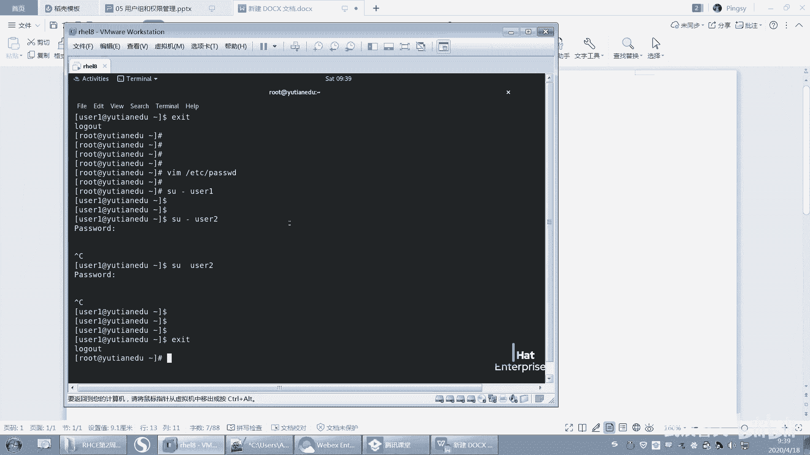

嗯嗯。

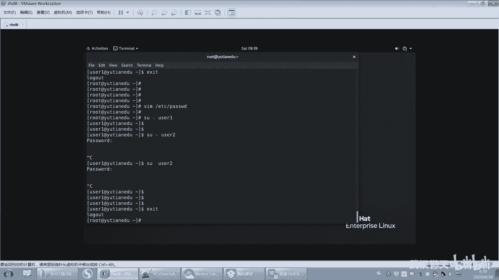

登录界面试一下啊。登录界面应该。应该也不行。

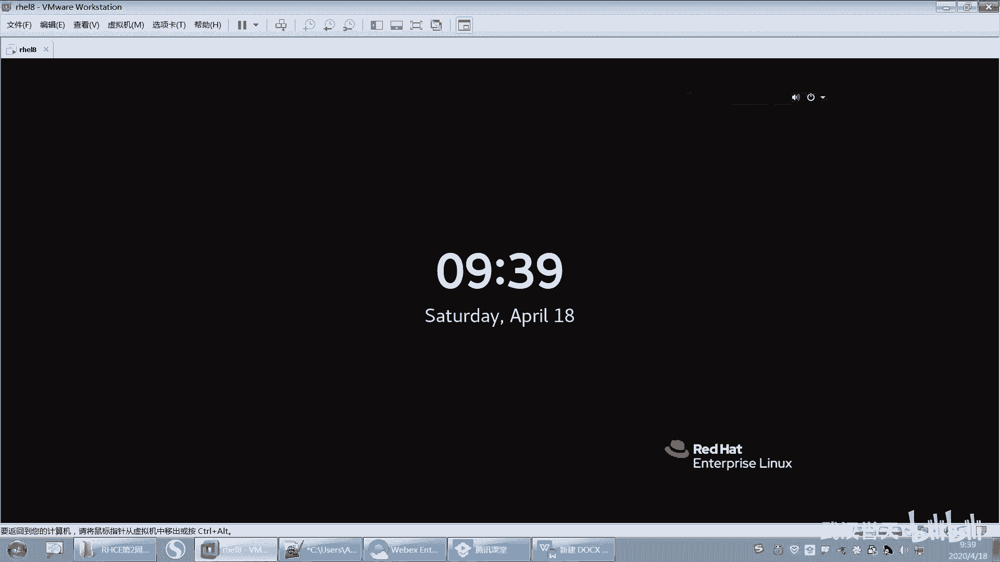

呃，登录界面的话是这样的。你看啊，如果你从其他用户登录，对吧？呃，这个用户如果没有密码的话，你这个地方。它都不会显示这个用户的用户名，看到没有？看到吗？好，我先测一下啊，root。U则一。

你的密码说什么嘞？😡，不行啊，在那个地方不行，在这里肯定不行的。😡，好，等一下啊。再来我给U者一设置一个密码。

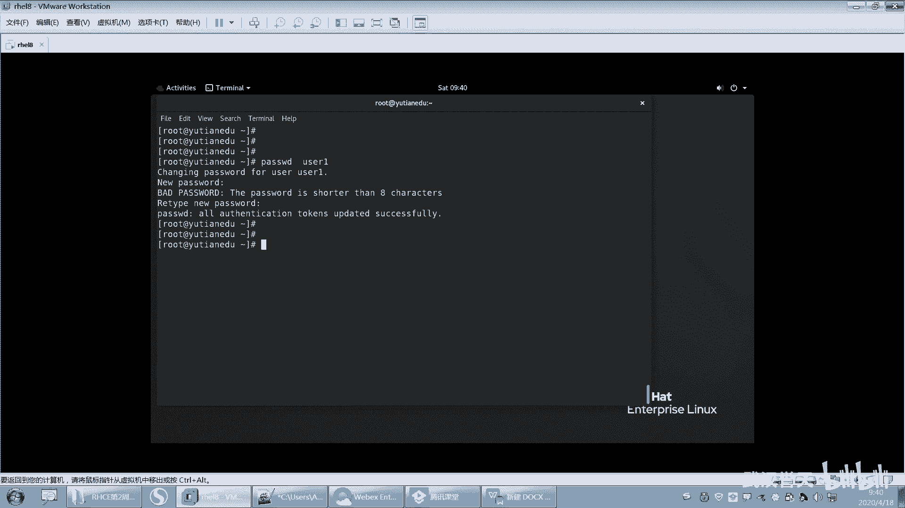

啊，嗯你这个用户给他设置密码了之后，你再来锁定一下，你看一下啊。

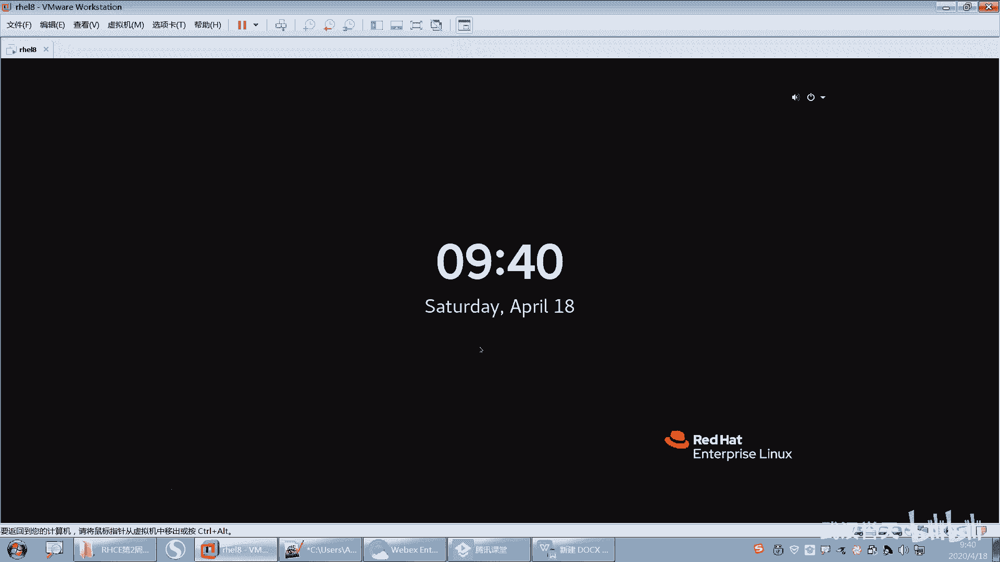

那这个柚子一它就会出现在这个地方。其实我们嗯。当这个图形界面它有这它就是这一点，其实这一点也不太好。呃，当这个用户有密码的时候，这地方就会列在这个地方。就是如果这个用户没有密码，他就他就不会列在这里。

比如user2，它就没有列在这个地方。😡，对吧。

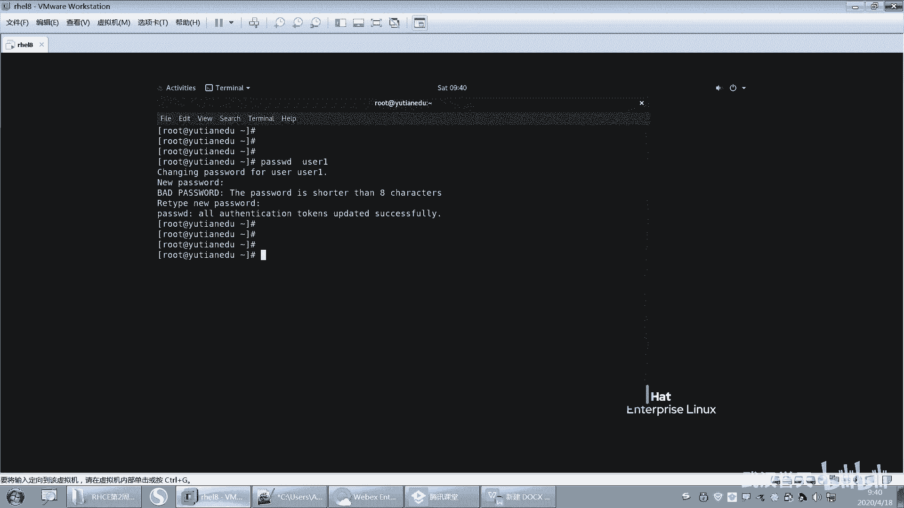

我看一下我的PPT啊。嗯，这是他官方的官方说密码占位符是吧，官方解释他也没说清楚OK。

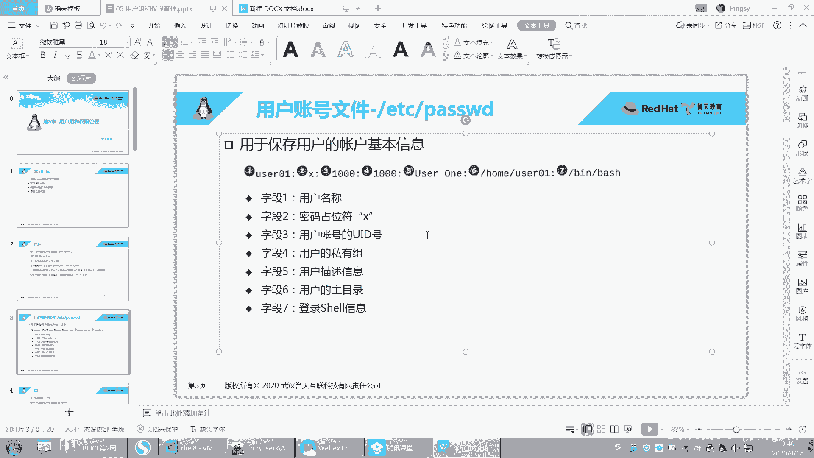

好吧，那个这个X我下去再看一下到底有什么用啊。在这个地方，你如果你是红帽七的系统，这个就是这个意思啊。红帽八的话还要再测一下。嗯。应该不行啊。😔，没有转嗯。

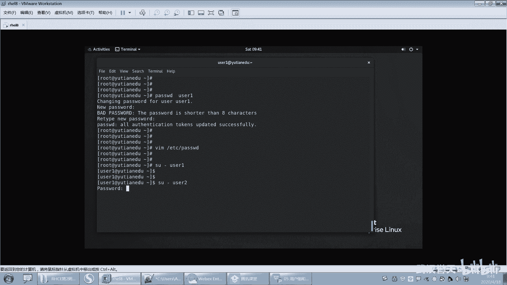

不行，还是。