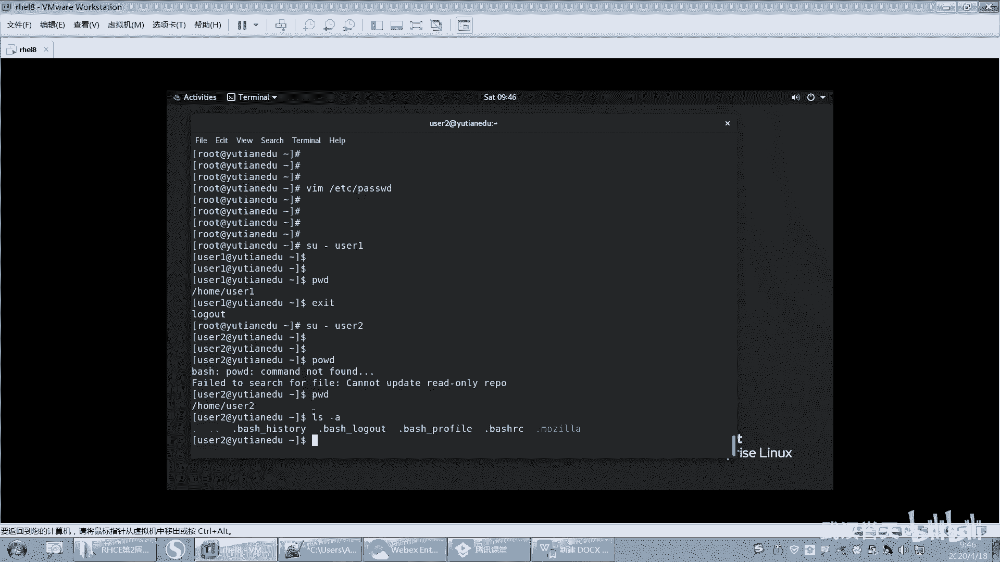

# 【已更新】最新版丨誉天红帽RHCE 8.0系列培训视频 - P22：用户组和权限-22 - 武汉誉天 - BV1cv411q74E

那不行啊。😔，没9嗯。不行，还是需要密码还是需要密码啊。那还是需要密码，那这个X没什么用了，现在。这个X没什么用了，有跟它有它跟没它没什么区别了哦。好，就这个X蓝位啊，但是红帽七的系统。

这个X蓝位是有有意义的啊。就像我刚大家给大家说的。

如果你是红帽七的系统，那么有了X，你就登录这个用户是需要密码的。把X去掉，登录这个用户就不需要密码了，OK吧。嗯ん。好，然后这个大家自己记一下啊，标注一下。默认密码默认密码这个不清楚。我们。这个。

不清楚啊。好，然后下面下面啊这个地方呃第三个栏位123啊，1001这个栏位这个栏位呢是我们用户的UID。用户的UID啊，那么这个栏位你看这个栏位啊，就是用户的GID。好，这个UID呢。

我们刚刚说的它是什么用户的唯一标识，对吧？用户的唯一标识号啊。那么GID呢就是组的ID。那么这个组呢，每一个用户在被创建出来的时候，都必须要属于一个组啊。所以组的ID待会儿我们来讲啊。

我们得先把用户的讲完，然后再来讲组再讲组啊，这是这个组的ID他们之间其实没有绝对的关系啊。比如说UID为1001，那组ID一定是1001吗？不一定啊不一定好吧。啊。

后面这个栏位啊后面这个栏位这个空格这个栏位啊呃它是空的是吧？这个是指用户的。描述信息。这个地方是指用户的描述信息啊，那么这个描述信息有什么用呢？

我再测一下啊，看这个描述信息啊啊，这个user一这个地方我写上一个testus。😡，他是一个测试的用户啊，看好哦，test user好保存。下面我们再注销一下啊。

好，你看这里它就会变成了test user，其实这是这个用户的描述信息。它这个地方并不是指用户的真实的用户名，而是那个描述信息啊，就是那个第几个栏位啊，第第那个GID后面那个栏位啊。

就是test user这个跟红毛器是一样的啊，没什么区别。好，所以那为什么要把那个地方直接怎么样改成描述信息呢？因为你在登录图形界面，它其实嗯说实话，你在工作当中，图形界面其实比较少用的对吧？

还是用那种嗯字符界面，对吧？但是图形界面它不好地方，就是它会把所有的用户名都会列在那个界面上。那这样的话，别人一看就可以看到这个用这个系统当中有哪些用户了，对吧？所以这个时候你把它改成t user之后。

它只会显示什么，只会显示描述信息，而不是真实的用户名啊，这样的话，防止别人知道我系统当中所有的用户名了。OK这是用户的描述信息啊。好，下面这个地方。这个栏位啊是指用户的加目录。

这个栏位是指用户的加目录啊，用户的加目录。什么叫用户的加目录呢？呃，这个我在第一天的时候上课也跟大家说过吧，就是。嗯，你看啊。

我们每次。切到一个用户的时候。我就会默认怎么样啊，进入到这个用户的加目录下面，看到了吗？以home下面的user一进入到这个home下面的user一啊，或者是我切到user2。😡，我就进入到什么。啊。

我就进入到home下面UZ2，这就是这个用户的加目录，用户的加目录啊。好这个用户加目录默认会在home下面以用户名命名的一个什么一个目录作为这个用户的加目录啊。

当然这个地方我也可以自己去指定指定这个加目录在哪里。

好，再往后面啊再往后面，这个是登录he。这个是登录谢尔啊，这加木哦。这个加目录再说一嘴啊，嗯加目录里面其实是有很多文件的。比如说啊LS杠A，你可以看到很多隐藏文件，对吧？呃。

这些隐藏的文件大家不要去动它，就放在这，不要去动它啊，这些隐藏文件。我们默认呢呃这些隐藏文件就是针对这个用户所设置的一些文件啊。比如说它是一些个性化的。

呃，个性，比如说一些变量啊啊都会放在这些。加目录下面啊都会放在加目录下面，每个用户下面都有啊，每个用户下面都有。啊，你也可以往自己用户下面存一些自己的私人文件，对吧？

那别人是无法进入到你的加目录下面的啊，就别人只能进自己的。😡。

加木路，但是进不了别人的加木路。啊，最后一个就是登录here。登录hear呢是指这个hear呢，我们后面会讲我们接下来就会讲这个什么叫surear啊。

嗯，谢尔呢其实大家就可以这样认为呃，我每次怎么样啊？我每次登录到一个用户的时候，他就会给我分配一个here，看到没有？😡，那分配一个here，这个here就是在这里可以敲命令行，就给我一个提示符。

让我去在这地方敲命令行，这就是一个here，就是一个here，O吧。😊。

啊，这个具体什么东西，我们后面会讲啊，谢。啊，这个就是我们pass word里面每一个栏位的含义啊，每个栏位的含义。好，那么这个地方再来啊。

其实我想创这个用户很简单。这样啊，你看我直接。把这一行啊，那我把这一行复制一下。啊，你看我复制到下面一行，对吧？这地方就是有把它改一下，比如说我可以改吗？😊，改成3。改成3。改成三是吧。然后这样改成3。

好，那你看这个地方我就创建了一个新的用户叫user3了啊，保存。啊，那么这个用户其实就已经存在了，我不需要做任何其他的这个修改。那我们来看一下，我怎么证明这个用户存在呢？我们之前学过一个命令叫ID对吧？

比如说ID userer一，唉，存在了ID userer2存在了ID userer什么3，那user3看到没有也存在了，只不过。只要显示这个就代表这个用户已经存在了啊啊，他的UID是么？

1003GID是1003，还有什么组1003是吧？好，那这个用户其实我就可以怎么样切过去了嘛？比如说切到U的3。我就可以切切过去了是吧？但是他说没有这个用户切不过去那，但是这地方看是不是我已经过来了。

看到吗？那。我ID一看我是谁呀？我是youer3。其实这个用户就已经存在了，我就可以登录了，对吧？只不过这里报错了，说没有办法切换到这个用户。😡，home下面us3。

因为这个目录目前为止我没有把它创建出来，所以你要进入到这个用户的加目录是不是会报错呀？但是为什么我会知道home下面user3是我的加目录呢？

因为我在什么sword里面定义了home下面的us是我的什么加目录。所以我每次切换到这个用户的时候，它就会进入到这个目录，但是这个目录又不存在，怎么样啊，然后就报错了。而且还报了一个错什么错。

还报了一个什么找不到什么名字符group ID1003是吧？啊，这个是因为什么这个组目前也不存在哎，其实组1003必须要存在才可以，就像us一的组是1001对吧？us2的组1002，那么这些都是存在的。

但是组这个是不存在，所以它也报错了。但是我只要证明的是什么这个用户存在就可以了。这就是us好吧，所以这就是什么password的作用啊，😡，这就是pass word它的作用啊，它就是。😡。

证明这个系统当中有什么这个用户就可以了，就这样就通过这些信息，我就可以把这个用户创建出来了，是不是很简单，对吧？那我复制一行就可以放创建一个用户了啊。至于这些后面存不存在，那跟我没关系。

我是不是还给他分配了一个什么 share啊，所以为什么我能切换到这个用户，是因为我给他分配了一个sha叫b叫b这个share啊。好，所以才会给我一个命令行啊，我切到这个用户才会给我一个命令行。O好。

password文件就讲完了啊？😡，这个这个地方有没有听不懂的，这地方有没有什么问题的呀？这个pass word文件。😡。

好。OK这个地上改一下啊，从1000开始，用户账号通常UID从1000开始啊，那个500是是红猫六的，红猫六的是500啊。啊，这个是账号信息啊，然后我给大家把这个地方写在这里了。你如果没记下来。

你就看我PPT就可以了啊。呃，再来啊呃，我们刚刚讲了什么，我们刚刚讲了这个呃password文件，对吧？讲了用户啊，讲了用户。下面呢我们来看一下组，看一下组啊，看一下组啊，我们每一个用户呢注意啊。

看这里必须要属于一个组，其实这个呃大家可以理解成什么呢？就是说我们人呢我们人本身注意啊。呃，记记好这个例子啊，因为后面还会再再再再再提到我们人其实就是一个用户。那么我的祖是我的家庭，能理解吗？呃。

当然这个孙猴子不算啊，他是从石头缝里蹦出来，还没有爹娘，是吧？😡，所以你的家庭就是类似于就是你的组，那你个人就是一个用户，那你就是这个家庭囊组的什么？就是一员嘛？就这个意思啊。

所以我们用户必须要属于一个组，他在出生的那一瞬间，他必须要属于一个组，对吧？就必须要属于一个组啊，你看我刚刚他没有他组我虽然给他分配了，但是这个组他说这个组不存在是吧？

所以你这个组是不是也要事先要存在才可以啊，那我待会儿就去把这个组给创建出来就可以了。对，把这个组创建出来就可以了啊。😡。

好，那么我们每一个组呢也会被也会被分配一个独特的组呃组ID叫GID叫group ID叫group ID啊。那么组的信息保存在什么？group当中，唉，组的信息保存在group当中啊。这个没研究过啊。

每一个用户都有自己的一个私有组对，私有组啊，这个私有组我先给大也给大家解释一下啊啊，记好我刚刚举的例子啊，就是你的亲生爸妈是不是只有一个对吧？你的原生家庭是不是只有一个这个叫你的私有组，OK吧？

这个叫你的私有组，因为很多同学搞不清楚啊，那么将来有可能你还会去认什么？认干爸干妈，对吧？能不能理解，那么你认的这个干爸干妈。😡，他们那个组就是什么？就是你的附加组OK吧。😡，那么你的。

你认的是那一个家庭，对吧？可能他有你可以认很多个嘛，比如说这个这个。😡，这个怎么形容呢？你可以任很多个家庭呃，作为自己的这个干爸干妈，对吧？所以你可以有很多的什么附加组。

但是你的每一个用户只有一个什么呀私有组。记好啊，每一个用户只有一个私有组，但是你可以有很多这个这个附加组，对你可以有很多干爸，你可以有很多干妈，对吧？对，好。😊，呃，另外那么要组有什么用呢？

同一个组当中的所有用户啊能够共享属于这个组的文件。也就是说这个组有什么权限，你就有什么权限。这个组用有什么样的文件，你这个组内的用户就用什么样的文件啊，就用什么样文件好，我可以画张图给大家描述一下啊。

待会描述一下组用户跟组之间的关系啊，用户跟组之间关系。好，在这之前我们先把这个group文件来看一下啊。

打开这个group啊。啊，打开这个EPC下面的group这个文件，打开它啊，好回去了。这个里面呢是不是也有什么也是一行一个用户啊，不一行一个组啊，一行一个组啊。

你发现这个用户这个组名跟用户名是不是一样的呀？也就是有一个组叫root，有一个用户也叫什么root，对吧？但是嗯有同学就会问的啊嗯。😊，用呼叫root。那这个用户就是管理员，那组叫root。

那这个组组是不是就是就是管理组是吧？就是就是很厉害的，有权限比较高的一个组呢，注意啊。😡，用户是用户组是组所有的组。默认情况下都是普通的组，那你把组就是一个普通组。OK吧，组就是一个普通组啊。

我root再怎么大的权限，对吧？跟我这个组没有关系。我虽然在rootroot用户在root组里面，但是root组。😡，还是一个普通的组啊普通的组。好，我们去到最下面，我们来看一下啊。

那叫这个addmin组对吧？那这三个组是怎么回事呢？怎么就把这三个组创建出来呢？其实我们在创建这个用户的时候。😡，默认就会把这个组给创建出来了。那我怎么创建的，我什么时候创建了是吧？

是在你执行user a的时候，注意在我们执行usered的时候，其实它做了很多事情。第一，帮我在password里面对吧？唉，起码在我帮我把password里面是不是创建了一行啊，哎。

在group当中是不是创建了一个组啊，对吧？而且还有很多啊，比如说还把我加目录给创建出来了呀。哎，home加目录是不是创建出来等等，它做了很多事情，所以一条命令其实做了很多。

包括我刚刚在password里面复制了一行。😡，对，创建了一行。好，那么这个组就是我在执行user at的时候自动创建的对吧？好，其实我们可以怎么样，我们可以手动创建，我们可以手动创建。

刚刚啊我们有一个用户叫user3，它好像没有组是吧？它虽然有组哦，1003，但是1003的这个组存不存在呢？我们去找一下啊。好，你看这一行为一个组，对吧？那么第一列为组名。第二列这个X。呃。

默认情况下啊，之前红包七也是指登录这个组需不需要密码。呃，其实说组也可以登录啊，对，组也可以登录，注意啊，组也是可以登录的组也可以怎么样设置密码，对，组也可以设置密码啊。

所以X但是红包八这个我不太确定的啊，还要测还要测一下啊。啊，这个1001呢是这个组的ID是这个组的ID啊，user一的组好。OK那么现在我是不是插1个1003的什么，插1个1003的组啊，看到没有？

插1个1003的组啊，所以呢这个时候我需要把这个1003的组给创建出来，来，我们来把它创建出来啊。好，那么这个地方我组名必须要就user3吗？不是的啊，组名叫什么无所谓，我随便Uer333333。

随便随便叫什么，想叫什么叫什么，对吧？啊，比如说user33。😡，好，那么这个。GI力为多少呢？我们说呃给什么给user3添加一个组嘛，所以你GID肯定为什么1003呢？😡，对吧哎，1003啊。

所以这个是组名，哎，这个是GID后面这个地方啊，那后面其实它是也是有东西的。这个冒号的后面待会儿我就让你看到啊，这个冒号的后面指的是如果有其他的用户加入到这个组。如果有其他的用户加入到这个组里面啊。

他就会在这个地方显示出来。在这个冒号的后面啊。好，待会儿我们去加一下啊。好了，现在保存。保存了啊，然后再来看一下ID user3。看到没有？现在还是不是有组了呀，而且组名是不是也出来了？

刚刚我ID的时候，它是不是这方只有1个GID啊，连那个组的名字是不是都没有，对吧？那现在是不是有了？😡，那哎GID100319933啊，这是它的一个组。对吧这是它组啊，O吧。这就是用户跟组之间的关系啊。

注意。用户跟组是通过一个东西连接起来的。就是这两个文件其实是通过一个一个属性连接起来啊，那就是GID。那就是通过GID来连接起来的啊。

password当中那个GID这个用户的GID和group当中GID对应起来，那么就是它这个组就是它的组啊。🤧用户的权限优于组的权限是吧？呃，这个我们后面讲权限的时候再说，好吧，默认情况下是这样子。😊。

嗯。就是一个用户呃，他的权限。先匹配嘛嗯先匹配嗯。好，group还有没有问题，我手动给大家把这个group和用户创建出来了啊，对组跟用户创建出来了。

应该清楚组跟用户是什么关系的吧。🤧好。那这个是组的啊，这是组的几个栏位，我也给大家解释了。最后一个栏位，待会儿说啊，这个是该组是什么user一user2user3的附加组。

也就是user一加入到这个group01这个组了。那么group01听好啊，user一加入到这个组了。那么这个组就是user一的什么唉。

附加组user一呃user01就是group01的什么唉成员那那你01进来作为什么group01的成员，也就是说group01有三个成员，一个是010203哎，010203啊。好，这就是组啊，这就是组。

OK吧。嗯。再来啊。这样吧，我们先我们先不讲权限，我们先把这个关于用户跟组的这个呃创建管理，我们先来说一下，好吧好，先来说一下啊。

好，嗯，下面我们来看一下如何去创建一个用户，如何去创建组啊，创建用户和创建组。刚刚我是手动去编辑的对吧？呃，如果我说如果啊你对这个组和用户他们之间的关系。非常清楚，非常明白，对吧？你可以用手动编辑。呃。

去编辑这个文件。但是呢如果你不是很清楚，最好最好不要去手动去编辑它。因为你编辑的话，你改一个位置，你可能你手动去编辑这一个位置，对吧？那你接下来可能要去改很多位置才能让它一致，否则他们的信息就会不一致。

嗯，因为很多地方，比如说home你在在这改了，那别的地方没有改，那就有可能导致这个用户的信息不一致啊。所以大家要注意啊，我们先用命令行改，好吧，先用命令行改啊，你非常熟悉了之后，你再手动编辑也可以。

好吧，我们说了linux当中一些些文件。所有的配置文件都在文本文件那里面都可以去修改，对吧？手动去修改的啊。😊，好呃，创建用户的命令叫user add。对user add啊，user4这样子是吧？

这个用户就创建出来了，很简单对吧？很简单啊。然后在创建user4的同时，我们怎么样啊？他首先在password里面。这一行是不是加了一行对吧？而且你看给我分配了一个什么分配了1个UID啊。

分配了1个GID好，那么这个UID跟GID是怎么分配的呢？我们说它是从1000开始。比如说我们第一个普通用户是从1000开始，然后依次什么呀，依次增大。比如说第二个用户的UID就是11001。

第三个用户的就是10021003。那我自己创建将来指定呃，我说下一个应该是1005了，对吧？我就不让他1005，对吧？那也可以，你想指定多少就指定多少。

但是默认情况下是依次从这个最大的注意最大的UID里面加一最大的UID里面加一是这样子的啊。😊，好，那么组呢？对吧1004这个组它是怎么给我创建出来的呢？好，它其实创建组的时候，它是这样的，它是它是。

去到group当中啊。它是去到group当中，其实它也是找什么group当中那个最大的那个GID，然后加一作为这个组的什么组的GID啊，那么这个组的6536啊，最大的是6536，但是默认是6万6万啊。

6万。嗯。默认是6万啊。呃，这里有。我看一下啊。那这个UID max是6万是吧，你看1000嘛，这里有设置嘛，然后GID的话，这是1000，最大是6万嘛。但是这个我说过是不是可以改？对吧是不是可以改？

好，然后看这儿啊，那么这个组的组名我怎么去命名呢？这个组名其实默认的情况下跟用户名是一样的啊，就默认情况下跟用户名是一样的。啊，但是可不可以一样不一样呢？当然可以不一样了，对吧？组名没什么关系。

主要是这个什么主要是这个GID要呃跟那个password里面要对应起来啊，GID跟pasword里面对应起来。好，这是这个呃用户跟主国执行这一条命令啊。好，下面我们来看一下，如果我想去修改它的一些属性。

比如说我想在创建的时候，就指定它的UID。呃，GID啊呃等等去指定啊，就是password里面这7个栏位，对吧？我都可以去指定它啊，都可以去指定它好，比如说我们先指1个UID啊。

比如说我指个UID就会2000。哎，就让这个UID为2000啊为2000。好，下面呢user呃。右则5OK吧，回去了。好，现在我把这个用户给创建出来了啊，我们ID看一下us。好。嗯。

那我问大家一个问题啊，我为什么ID这个user5它就可以出来呢？请问ID是读了哪个文件呀？😡，ID显示的信息是读哪个文件啊？还记得吗？刚刚说过的。ID1个用户ID1个用户对吧？然后他是读的哪个文件啊啊。

对他读的是password这个文件读的是password这个文件啊，对它只要你ID什么东西，他就读这个文件啊，所以你ID出来了，是说明这个文件里面有有这个用户O好，那么这个用户的UID是么？

2000用户名为什么？us5GID是2000用户名usZ5。你发现GID怎么样啊？GID它默认情况下，它会跟什么跟UID一致哦。对吧是不是默认情况下会跟UID是一致的呀。嗯，看到没有？😊，那对不对？好。

那那假如说这个这个这个2000对吧？被占用了，它重新它被占这个GID被占用了之后。😡，他也会另外再去找一个，比如说2001啊，哎，作为这个用户的什么GID。它默认就是这个2000呢。

它会默认跟什么UUID是一致，就是默认跟它一致。但如果实在是2000，如果被另外一个组给占用了，对吧？那它就会比如说两就会变成2001。😡，哎，这样啊变成2001OK吧。好。

那现在啊看一下UID是2000了是吧？所以我们来验证一下啊，如果再创建个UZ6。😊，啊，那柚柚子6的是吗？他的是不是2001呀？唉，你看其实我们在user4的时候，应该是10多少了？

其实中间有很多是不是都没有用啊？😡，就是在这个地方下，中间呃1004跟202000之间是不是有很多的UID都没有用，对吧？那为什呢怎么就2千0一去了呢？😡，啊，那就跑了2001。

我说过它是不是在最大的上面去加一啊？😡，在最大的上面去加一啊，那但是为什么说我在最大上面去加一，这个是有原因的啊，有原因的。呃，因为我举个例子啊。如果说我把这个用户给删了。

比如说啊我把这个user4这个用户给删掉了。那么user4就用户删掉之后，有没有可能user4会遗留下一些文件？那这些文件。😡，他的。它就属于什么1004，因为U的4已经不存在了呀。

它就会属于1004这个UID。所以他为了防止什么？他觉得这个2000和1004之间怎么样？有可能会有一些用户是之前已经创建过了，所以他默认怎么样不会在某个之间去创建。

因为如果你创建用户是这个地方是1005的话，那么有没有可能？其中之前有个1005的用户，其之前存在，但是后来被删了。但是那个1005呢，他留了一些文件，留下来了。那么你再创建个用户是1005。😡。

那么之前的文件就自动属于这个用户了。我这么说，大家可能有点就是有点模糊啊，你可以这样看。比如说啊。你看这个地方我们之前讲这是属于文件的拥有人呢，这个是文件的拥有人。那这个文件的拥有人。

这个地方是要1user一，对吧？那假如说你把这个文件怎么样，把这个用户删了，那这个文件没有删，那这个地方它就会变，它就不会显示user一了，它就会显示1001。😡，对它就会显示1001。

那将来你最爱创那个用户是1001的用户，那么这个文件就自动属于新的用户了。对，就自动属于新的用户了。嗯，所以它刚创建出来，就继承了很多什么文件啊，所以我们在分配这个UID的时候，它就会默认认为怎么样？

这中间的这些这个UID默认之前已经被分配过了。😡，呃，他就会在最高的上面去加一，他认为他他后面的是没有被分配过的啊，这就是为什么要在最高的上面去加一啊，往上去加一，待会儿我给大家验证一下啊，验证一下。

😡，好，呃，这个是UID同样GID它默认跟它一样，对吧？但是如果你单独创建一个组，比如说我就要创建一个组叫group add。😡，好，单独创建个组叫group addgroup，比如说group0啊。

group一好吧。😊，然后创建一个组。那你看组是不是也是这样的呀，足也是在最大的上面，什么是不是加一啊，去组也是一样的呀。你用那个文件。😡，这个文件是不是有用人呢，是不是也有用组啊，那这个组没了。

是不是也一样的道理，对吧？也是一样的道理，组被删了。好。OK这就是组啊组。那组呢我可以因为中间的都没有备用，对吧？我可以指定它属于哪个组啊，比如说group app指定它的GID呃，指定的时候杠G好吧。

杠G啊，然后比如说1006。然后group2。好，那么这个组哎它就是106，这是我可以指指定的啊，我可以指定的，好吧，好，再来啊。这样啊。嗯，我创建一个这个。用户。是2001呃2004。然后2020吧。

创建一个组，我在创建这个用户的时候，指定组哦，注意哦，你看这个group是不是有杠基啊，us a是不是有个杠机啊？那么这个杠机是不是都是指定GID啊？是的，但是注意啊，这只是说他用这个方便一些。

刚好都是这巧合，对吧？刚好都是杠基。这个要看这个这个这个作者是怎么去给他指定这个选项怎么写的哪些选项啊，所以不一定所有的杠基都是什么？不一定所有命令的杠基都是指定GID啊，所以一定要注意啊。

只不过是刚好哦。😊，U add指定组的时候也是这样啊。好，那1呃2020啊，2指个组叫。1008好吧。OK大家觉得这样我能我创建出来，可以创建成功吗？这样我创建可不可以创建成成功啊？😡，呃。

创建个U子吧吧。这样可不可以创建成功啊？大家觉得我这样可不可以创建成功？没事猜一下嘛。有说可以说可以是吧？啊，我也不知道，我试一下啊。😊，好，回去了。怎么样啊？啊，us a杠U2020唉失败了对吧？

是不是失败了呀？好，我不失不失败，不管它，我就验证一下就知道了呢。没有这个用户，说明这个用户没有被创建出来，什么问题啊？怎么样啊？主不存在。注意如果你手动去指一个组的话。

那么这个组必须要事先被创建出来才可以。注意啊，就你手动去指定这个组，必须组要创建出来。如果组没有创建出来的话，它就会报错就会报错。所是命令行它就会提示你。啊，会提示你啊，所以组一个用户必须要什么组。

这个组必须要存在。好，那你说我没有指令组，怎么反而还成功了呢，对吧？你不指令组，你创建是可以成功的啊，因为它会自动帮你去创建这个组，他先创建组的，先创建的组又创建的用户啊，OK吧。

你这样你回去了就可以成功。😡，啊，所以我要先怎么样，我先先去创建怎么样，先创建一个组叫IT1，比如说IT1杠G呃，11008啊，然后再怎么样嗯。等一下啊。啊，最好这样啊。

你可以I呃杠G1008ITE是吧？好，这样组创建出来了，然后再执行这条命令。然后杠G好，你杠G的时候，你可以指定IT1或者是1008都可以，就指定组的名字，或者是指定组的ID都可以去创建出来回车啊。好。

这个系统怎么老是卡呀？😔，好。然后这样就可以了啊，就创建成功了。O吧，这就是用户跟组啊，用户跟组，所以组必须要存在。所以我们发现。如果是人为去干预它，对吧？组跟什么组跟UID跟GID其实没有什么关系。

对不对？UID跟GID是没有什么关系的啊。那大我说大小没有什么关系啊。😡，看到吗？这个用户是2020，然后GID是1008。好吧，嗯，好，那继继续啊，我们再创建一个用户。

我可以去怎么样呃指定UID我指过了，GID也指过了就不指了。然后杠还有什么杠S可以指定它的登录here好，杠C先来啊杠C可以指定它的是呃比如说它是一个hello是吧就是描述信息啊。hellous好。

描述信息杠C就是那个描述信息嘛。😊。

嗯，哪个单位啊？这个栏位是吧，是不是这个描述信息，这个栏位啊，然后我home我也可以指嘛，然后be我也都可以指啊。好，我一次性把它全指了啊。😡。

啊，指个描述信息杠C杠C指定描述信息啊，然后杠呃杠D指定加目录。比如说我想加目录叫home下面的呃随便纸啊，叫个。啊，我想创建的用户名叫user。111吧，那我就use，我可不我随便指嘛。

我可不可以叫use11，我随便我随便叫嘛，我想指哪里就指哪里。但是一般情况下就指home，对吧？你如果指ETC行不行，当然也可以是吧？😡，啊，那你随便指O。啊。

这个用户注意这个地方这个目录有没有被创建出来呢？我现在没有把它给创建出来，也就是说这个user一是不存在的。😡，那我直接这样指会不会报错呢？注意啊，我就不跟大家演示了，直接指就不会报错。不会报错。

而且不需要你去手动创建，听到没有？不需要你去手动创建啊，你反而自己手动创建的还会出现各种权限错误，所以不需要指就不需要去自首先创建出来，自动去指指出来的这个目录，它的权限全都是OK的对，全都没有问题啊。

好，再指一个啊叫S呃，比如说指一个B，就是默认的对吧？你可以指一个，比如说。😡，这一个SB。No log in。啊，那可以指一个这个这个hear啊，这个hear是另外一个种shar啊，另外一种shar。

好，后面我们全部指了哟，回去了。哪里报错了？看一下啊。嗯，Use the add杠 C common。哦，这个地方哦这个地方是吧，这个地方啊，然后你看这地方中间是不是有空格呀？

我们说空格之间是不是会有怎么样，它是一个空格，它是一个特殊字符是吧？所以我们要要要把要怎么样引起来啊。😡，好。这样就成功了，OK吧。好，然后我们来看一下啊。打开。他s我的。你看。这是不是约的111呃。

自动分配的对吧？然后这个是描述信息，这个是我的加目录，这个是我指定的登录 share。哎，对，指定的登录 share啊。好，全部都要绘纸啊，全部都要绘制。好像这个登录需的话，看能不能登录啊。你看。呃。

如果你给这个用户指定一个叫SB no log in的登录he，他就你切过去就切不过去，看到没有？那你就切不过去，看到吗？他说怎么有没有分配，就是不分配，登录here不分配啊，就切不过去。好。

那我现在想让他登录，我想把这个地方给改一下，你手动去改。😡，手动去改也可以，但是我想用命令行改，我想用命令行改啊。好，这个时候use the mode。然啊user add是添加user mode修改。

修改用户的信息啊。好，其实这些你要不要去，你根本根本不用记，你看啊，我在抽这个用这个用户的语法，其实很简单。😊，us add中间看好哦，你看啊是不是一个选项对应一个参数，一个选项对应一个参数。

我没有乱指吧，我不会指杠C指定这个，然后杠D指定这个吧，我是不是指的你看啊。杠C这个选项是不是跟了一个参数，杠D这个选项跟一个参数，杠S这个选项跟一个参数啊。😊，对吧所以选项跟参数之间是成对出现的。

成对出现的这样子啊，那看到没有？成对出现的啊，那你说我杠CDS能不能合并啊，你怎么合并？你是不是合并不了杠C，那你是杠CD，你你你你这个参数放哪？😡，比如说啊我这个意思。ususer add是吧？

然后你杠CD好，你参数放哪？你那是hello，然后user。😊，哦，它自动识别是哦，第一个参数是它的，第二个参数是它的不可能啊，这样识别不到的。所以一定要怎没有？

一定要如果我说的是如果这个参这个选项后面有参数的话，你必须要紧接着这个选项。注意啊，紧接着这个选项。当然还有一种情况是可以合并的。比如说啊。我前面是一个C，是个D啊。这个C呢。这个C它后面可以不接参数。

能理解吧？就是这个C啊，它有的时候这个选项，比如说像LS，它后面是不是可以不用接某个特定的参数，对吧？随便接哪一哪些选项都可以。😡，所以这个C如果不接选不接参数的话，那么它这样可以合并。

但是D是不是要接参数啊，那你后面就接一个杠D的参数，对不对？好，那如果。按照这种情况来说的话。那如果D要接参数，C不接参数，那我DC可不可以啊？C不接参数，D要接参数，那DC这样合并行不行啊？😡。

这样合并就不可以。注意啊。它会识别什么，你这个参数是杠C的。所以如果你是这个参数是杠D的那这样就不能合并，你就什么杠CD能理解我说的意思吗？能能不能理解我说的意思？😡，好，这个大家可能有有点有点混乱啊。

这样。好，你看这个这个是不是D的参数啊，这个是不是D的参数，对吧？那C不带参数，那这样合并是可以的。但是如果你是DC的话，这样就不行。

因为你要紧接着这个参数要紧接着这个参数后这个选项后面因为它不是C的什么，不是C的参数O不OK好，待会儿我就举个例子给大家看啊。😡，待会我就举个例子给大家看，好吧。好，先说到这儿啊，先说到这儿。

待会儿我给大家指定好吧，给大家演示啊。😊，好，那下面我想把这个给改了，把它改成并。呃，beanbsh可以登录的he啊。好us a啊，不你就不要use add了啊，因为us a是添加叫user mode。

然后杠S binbsh。OK吧哦，然后已有子111这样的话就改了，而且修改的这个参数，修改这个修改这个命令，它杠S也是指定登录需要。O回去了。好，改过来了哟，我试一下111回去了，可以登录吧。

是不是改过来了就可以登录了。O这个就是修改。好吧。好，以此类推啊，比如说我修改加目录，就杠D，我修改这个这个这个这个这个什么这个就杠C对吧？那你说老师我怎么知道是杠C杠D啊？好man吗man。😊。

user modeO吧。啊，你看杠C，它是不是跟us add选项是类似的对吧？杠D是指定加目录，但是你要看这句话哟，下面有句话啊，你自你去翻译一下好不好？😊，好。

当然还可以指定这个是它的一些密码的信息啊。嗯，还你是不是还你GID都可以修改哟。😡，哦，大还觉得UID能不能修改啊，那GID都可以修改，它就它有个杠G的选项嘛，它GID都是组ID都可以修改。

但是这个组注意指的是私有组啊指的是私有组。😡，好。我们待会儿要给这个用户添加一个附加。😡。

