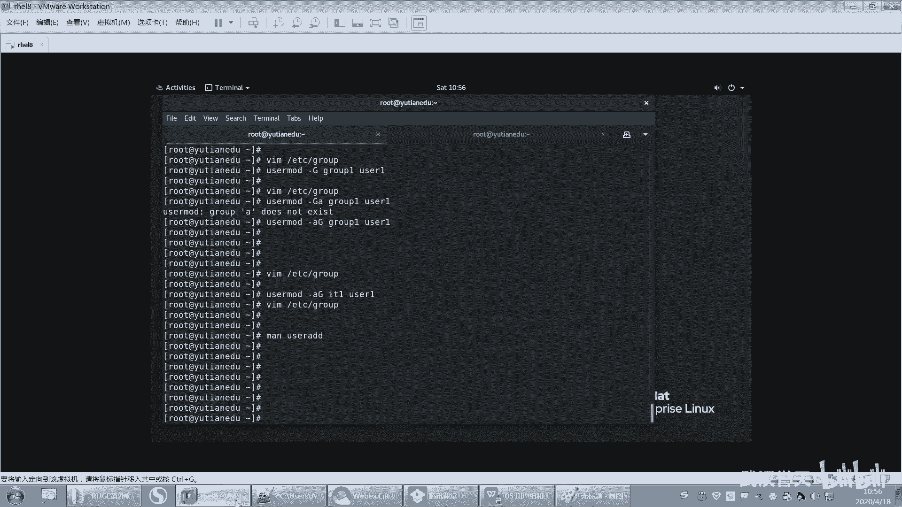
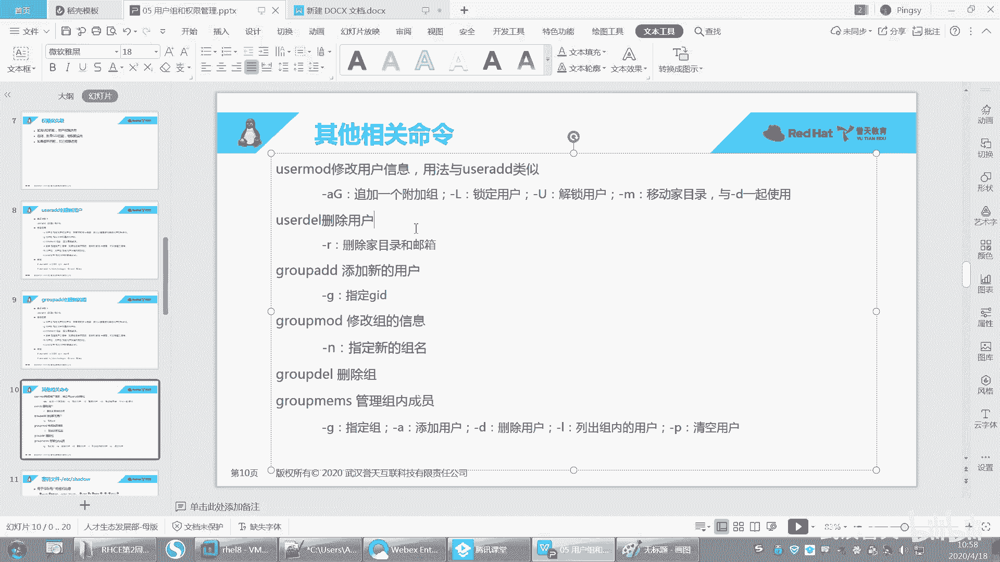
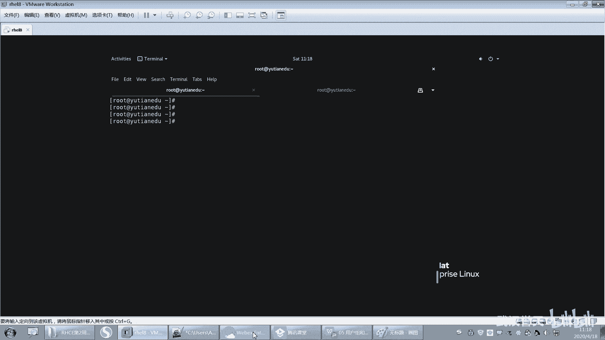

# 【已更新】最新版丨誉天红帽RHCE 8.0系列培训视频 - P23：用户组和权限-23 - 武汉誉天 - BV1cv411q74E

我们待会儿要给这个用户添加一个附加组，杠大G是添加附加组。记好哦，待会儿要用的啊。好，还可以指定什么？呃，你看杠O哟，你看我我我之前问大家，我说能不能两个用户同1个UID。你看非唯一，当你用了这个什么。

当你用了杠O这个选项，你就可以什么呃修改这个用户的ID to一个非唯一的值。也就是说这个值可能已经被占用了。对，就用杠O。有可能用，对吧？好，杠P什么指定密码是吧？这个不要这样指啊。😡。

这个后面这个选项我会讲。嗯，还有杠S。share啊，你看UID都可以修改。😡，用户的UID都可以修改，因为新的那新的数字嘛，作为这个用户的UID。所以你你看到有个选项，你大概怎猜到哦，好像可以改，对吧？

那至于你能不能改，你还要去测，你还要去测啊。😡，好，那我们来改一个好吧，改1个UID试试啊，use the mode。杠U呃。嗯，改个这个吧，它的UID是多少啊？他UID我看一下啊。IU the1。啊。

2020那改成2022，好吧，那就是us the mode。我就举一些例子啊，大家剩下的大家自己去改啊。杠U2022user。的。111OK好，那这样看UID都改了，看到没有？

GID没变就UID都可以改哦，GID也可以改，都可以改，好吧。好，我们再来啊呃再说一个没有讲过的啊。呃，现在这个现在啊我们来看一下组。呃，这些应该比较好理解吧，不就是修改参数嘛，用哪个选项来修改是吧？

好，呃，现在呢我就针对这个IT1这个组吧，好不好？我想把user一user2啊这些用户啊呃加入到IT1这个组里面。也就是说我把user一加入到这个组里面，那么user一是不是多了一个组啊。

user2加进来是不是user一user2多了一个组啊？嗯。啊，不不，这是组这是组名字啊，我我说错了，我不应该指这里是吧？好，来现在加啊。注意哦，现在。U则一有几个组，现U则一只有一个组叫U则一。

对吧好，我现在给他多加一个组啊。好，那么user一是这个组是是user一组是user一用户的私有组，对吧？我们这讲私有组，私有组只有一个对吧？那user我现在是不是要修改它信息啊。

所以我就要用user mode来去修改user mode啊。好，指定什么杠小G是指定私有组，但是我不需要修改它的私有组，我需要给它再添加一个组，所以杠大G。杠大G啊啊杠大GITE嘛。

我说你可以指定它它的什么指定它的GID也可以指定它的什么它的这个组的ID。都可以指啊。好，然后user。1U子一是吧，回收。好，它就多了一个组。怎么看呢？你看这边是不是多了一个组1008的组啊。

是不是多了1个1008的组，对不对？😡，啊，那你可以怎么样啊？你可以打开这个group看一下。那在这个地方是不是多了一这个组里面是不是多了一个成员？😡，O吧，这个组里面是多了一个成员啊，对不对？好。

再来哟。😡，我再给U则一再添加一个附加组啊。我想给他添加一个这个嗯。group一吧，好吧。再给大家添加一个附加组，看好啊，再给大家添加一个附加组回车。😊，好，再来你看这儿。这是不是多了一个UZ一？😡。

但是ITE这个地方是不是就没有了？那。ITE这里是不是就没有了？😡，这方空了呀，哎，怎么附物实质上什么多一个附加组，结果这个地方就没有了是吧？所以杠大G是给它设置附加组。😡，而不是添加一个附加组。

如果想添加一个附加组，我们需要加一个选项叫A。好，这两个选项我合并了，我是A小AA小A大G对吧？我也可以怎么样呃，我也可以是大G小A，那大G小A可不可以？大G小A这样。按照我们刚刚讲的对吧？

这样就不可以，为什么呢？因为A后面我们这个这个参数是不是大G的参数是不是大G的指定组的对吧？所以你这样指怎么样，就报错了，他说你看他是不是认为这个A是这个大G的参数了，对不对？所以那它说组不存在嘛。

所以你要怎么样啊，你要把这两个位置给换一下啊，A大G，因为A是指追加的意思，A后面没有具体的参数，不是没有具体的参数嗯。😡，A是指append居加。它没有具体的参数。

所以大G是有具体参数的那你要把A放前面，大G放后面啊，然后再这样合并。OK吧，这样的话你看。嗯。Yeah。这个怎么鬼？user modeuser一哦。哦，这地方改成ITE啊。IT1好。

OK这样是不是就能？就有两个了，那这叫追加啊叫追加。好吧。OK这个如果你在创建的时候，对吧？也要指定附加组，那你就杠大G直接指定就行了，就就就OK吧。这个我就不说了吧。呃，如果你想实现什么样的功能。

那你就。去man对应的命令，有没有这个参数就可以了啊。呃，不是说删除就不加A，它是设置新的附加组。但是之前的附加组全部都要去掉。对之前的附加组全部都要被去除掉，对，去除掉了，好吧。

所以你要追加一个附加组，它是多了一个之前的就会保留。如果你不加A的话，之前就会全部被删掉，这就是附加组。

嗯，OK吧。啊，有没有附加组跟次又组分不清楚的？私有组跟附加组有没有这两个分分不清楚的？什么是私有组？什么是附加组？有分不清楚的是吧？哦，好。嗯。我之前举一个例子嘛。我觉得那例子挺挺挺什么呃。挺合适的。

对吧？干嘛干嘛那个。ふふ。O。好，这里啊。比如说啊现在有个我我这是一个组，好吧，这个圆圈就是一个组，私有组可以换。对我刚刚是不是改过了？好，柚子一。祖。这是个组吧。这里面是不是有个用户叫柚子怡啊？

又这一用户啊。好，他们两个是什么关系？他们俩是不是亲生关系啊，对吧？啊，当然这个我是不是亲身关系，这个要看什么，唉，要看这个这个这个。😡，还跟着还真可以换，刚刚不是换了吗？

user mode杠Uuser mode杠G。啊，那他们两个之间对吧？他们两个之间啊就是就这这这个是呃是私有组的关系，对吧？呃，为什么呢？因为这个是我我用户的GID。是不是等于这个组的GIDOK吧。

他们两个，那user一组是不是就U着一用户的私有组？这个有没有问题啊？是不又这一组的四1组，这个没问题吧。😡，嗯。啊，同理。柚子二组。是不是也有一个儿子啊，叫U子2啊。这是不是一个组啊？

是不是有useruser2啊，假设我们说用户名跟组名是一样的啊，这样的话我们好区分一下。好，那有一天呢。怎么样啊？user一这个用户啊，他想加入到user2这个组。他想加入到这个组里面，对吧？那么。

这个地方是不是多了一个用户叫U子一啊？😡，对不对？那user一。是不是U二组的亲生的呀？不是吧，我们说不要轻生的是吧？那么user一这个用户只是user2的一个Uer二组的一个成员了。

他就是作为成为这个组的一个成员了。😊，对不对？那么user二组就是user一用户的什么？😡，附加组优子二组就是优子一用户的附加组嗯。不是这个地方不是改GID啊，它只是加入这个组。

它还属不属于UZ一这个组啊。😡，它还属于这个UZE这个组吗？😡，对呀，它还属于这个组嘛，我只是说让他加入到这个成加入到UZR这个组里面，对吧？多了一个附加组。但是如果你你你你加的时候。

你改的时候是杠G改。😡，是不是就是把原来的私有组就改了。但是如果你杠大G。😡，是不是就添加一个附加组啊，但是原来这个私有组还在。😡，对吧。对，是这个意思啊。不是改CU组，我这是加入加入一个附加组。

这就是附加组跟什么？我这个里面是不是可以有很多呀？比如说user3啊啊user4啊，是不是有很多？😡，对吧这个这个里面是不是可以有很多的用户啊？对不对？可以有很多的用户啊。

那么这些134都是这个组的是么？都是这个组的成员。唉，这个组是这三个用户的附加组哎。就这样啊。OK吧。那我这个U子一这个组是不是还U用户是不是还得加再加一个组啊？😡，可以。啊了。张建。可以。

好像是可以的。嗯。多个用户可以把同一个组当私有组可以。可以啊。用户的私有组必须要有附加组可以有也可以没有。对，是的啊。嗯，就是按理来说，一个用户对吧？

这这这个这个这个这个U子一就张建同学说两个用户能不能有一个私有组是吧？属于同一个私有组，可以可以，你可以试一下，你只要在创建这个用户的时候指定对吧？指定一下呃。

指定一下这个杠G这个杠G后面是ITE这个ITE已经是其他的这个用户的私有组了。那你看行不行，对吧？你试一下就知道。O。

好，这是可以的啊嗯。

嗯，OK这个是用户和组的。用户和组是吧？呃，在这里呢我也特地给大家都写出来了，看到没有？你笔记没记好呢。我都给大家做好了啊，你可以回去再补充一下，把你的笔记补充一下。嗯，上课我就PPT里面没有的。

你们就要自己去记啊。PPT里面没有人们就要自己去记啊。😡，哦，我们先休息一会儿，回来一下，我把剩下补充的一些这个命令没有讲到的，我再跟大家说一下。我们先休息一下吧，好不好？嗯。好，你休息一下啊。好了。

那我们回来了啊。

对啊。嗯。

好，我们刚刚讲了，其实讲了用户还有组是吧，怎么修创建用户创建组，修改用户修改组。然后这个地方我呢呃把选项放在这儿，但是有很多例子呢，大家可以自己去记一下啊。然后我就就着列两个例子不多。

大家嗯回去再根据你的这个麦帮助，还有根据我这个选项的描述来相互对照的看一下。然后组的话。呃，组的话这些参数我也给大家测过是吧？这个U啊G啊C呀。然后创建就行，再创建组。

然后还有一些其他的其他的这个相关的命令，比如说user mode修改用户信息，对吧？啊，用法与这个user add类似的啊，然后追加一个附加组杠AG看到没有？后面你要接组的名字啊。啊，你还可以锁定用户。

那更大L可以锁定一个用户。什么叫锁定一个用户呢？比如说。

嗯。哦嗯。摁错了。啊，锁定一个用户啊，比如说user mode就不想让这个用户登录了，让大Luser一是吧？这样的话就锁定这个用户了。比如说你还切到Uer一，那你这样切不行啊。

还是要用普通用户去切过去啊，然后切到Uer一。然后这样就登不进去了啊，这个用户就被锁定了。然后你要解锁。解锁你就可以杠。

解锁是刚什么来着？哦杠大U是吧。

这样解锁。切到U子一，哎，柚子2有没有密码呀？我刚刚没有给exelR设置密码是吧？好，这个你自己测一下去吧，呃，就是解锁，还有呃锁定，还是解锁啊。

我就不测了，好吧。然后还有移动加目，这个到时候我会出一道题啊，这个你要看好呃，修改加目的时候要注意哪些啊？啊，第二个就是删除用户啊，这个我来跟大家说一下，删除用户。

嗯，创建用户我们已经会了是吧？然后删除用户呢就usedell。us the来删除这个用户啊，我发现这还可以tableable键呢，这用户名都table出来了是吧那。好，那我删除一个用户叫user一。

签了啊。足球。啊，这个柚柚子一用户删掉了，我们来看一下啊，首先去到发索里面。Uer一看一下有没有了，Uer一没有了是吧？好，然后组呢组还在不在呢？我们来看一下。足。有没有组是不是就没有了？

对吧Uer一组也被删掉了，Uer一用户也被删掉了。好，那我们还知道了哪些，是不是有还有Uuser一的加目录啊，对不对？😊，啊，us一的加目你发现怎么样啊？没有删掉，us子一的加目是没有删掉的啊。

然后我们来看一下。嗯。user一的加目这个地方是没有删掉了，没有删掉之后你会发现怎么样呃，本来这个地方这个用户的拥有人和拥有组，这里这里本来显示的是吧，是不是用户名跟组名啊，但是你把这个用户给删掉之后。

这个地方是不是变成了UID和GID了，对不对？呃，因为你再写Uer一系统已经没有这个用户了。但是这个时候这个加目录留下来了，那留下来总得这地方显示个什么东西，对吧？

所以显示的就是那个用户之前的UID和GID好，那么如果是这样的话啊，假如说我又创建了一个用户叫Uer一。那这个user一还是这个是原来这个user一吗？😡，这个时候啊注意。

这个user一还是不是原来这个user一？它就不一定了啊，只能说不一定啊，呃，为什么说不一定呢？因为要看这个user一是不是原来那个Uer一，要看什么。

要看你新创建的这个userE的UID是否等于1001，能理解吗？是否等于1001。如果等于1001，那么。怎么样啊？那这个这个这个这个新的用户就会继承这个文件了，就会成为这个文件的什么没有人了。啊。

如果不是的话，比如说你看我现在创建我不指定吗？啊，新的user一多少？2023看到没有？新的U子一2023啊，它是不是原来那个U子一啊，不是啊，所以你再来看。这个地方是不是还是显示1111001。

还是显示的1001啊。看到没有？然后还会出现一系列的麻烦。那一系列的麻烦啊，你看啊我切到这个UU子一好，就会报错。看到没有？就报错。他说他无法切换到这个用户权限拒绝啊。

permission叫权限deny叫拒绝的意思。好，怎么切到这个嗯什么权限拒绝了呢？啊，其实。就是因为啊。我本来是不是要进入到自己的加目，我加目在哪？user一的加目录在哪？我们可以看什么？

可以看这个pasword里面啊，你看它是不是要进入到home下面，user一啊？但是home下的U子移这个目录目前是不是我当前Uer机的目录？已经不是了，因为它是什么2003，而这个user一是什么？

是上一个用户留下来的，他的拥有人，他的什么他是UID是1001，你对他是没有权限的，你不能进入到别人的什么加目，所以这个时候。用户名虽然是同一个用户名，但是UID不一样。啊。

这是UID用UID来进行区分的啊，注意啊。好，那你再用这个用户就会一系列的报错。除非你把这个什么，除非你把这个user一的拥有人改成现在的user一拥有组改成现在user一的组。才才OK啊。好。

这就是删除目录的时候，为什么会把之前的。文件留下来呢，是因你在删的时候没有删干净。没有删干净啊，userll杠Rus2，你看啊，我把user2删掉，加杠R杠R是删除什么？注意还会删两个东西。

删删两个东西啊。第一个就是这个用户的加目，加目录在这里，在user2在这个地方，对吧？还会删什么呢？还会删除这个用户的邮箱。这个用户的邮箱啊，那时候邮箱文件在哪？待会儿带你去看啊，好，删了哟。好。

下在就后你再来看有没有UZ2了。没有usZR了，对吧？userR这个用户被删掉了。好，邮箱在哪里？邮箱在wa ball下面mail。看这里。啊，user一的邮箱为什么留下来了？是因为什么呀？

这是他的邮箱文件啊，就是到时候呃这个用户收邮件的时候，他的邮件都放在这个文件里面。啊，这是自默认就已经有的啊。好。那这个用户的，你看这个地方是变成1001，为什么？是因为这个拥有人没有了是吧？

拥有人被删掉了，10没有一个用户的UID是1001，所以显示的是之前遗留下来那个呃之前那个用户的UID啊。好，U子2的邮箱没有了，不见了，是因为我加了什么杠R。所以大家在今天学了用户组的时候。

你们在删用户处理用户的时候会出现各种各样的错误，会出现各种各样的问题。所以一定一定要清楚啊。好，大家把可以把这个杠好记一下啊啊，指的是删除加目录和邮箱。好，那你说老师我每次怎么样？那这样的话。

我柚子一是没有权限去访问我这个这个文件了，对吧？因为它是之前的那怎么办呢？那你说我手动我就是忘记什么呀，我就是忘记删了。比如说啊。我user there，我就是忘记删了，对吧？然后杠呃没有加杠R。

就user4。就删了嘛，就忘了怎么办呢？怎么办？那你再创建一个用户叫user4，是不是就会报错了，对吧？就会出现各种问题。因为你在创建这个用户的时候。他就怎么样啊？他就会。创建加目录。

但是加目录是不是之前的加目录，还因为会创建邮箱，邮箱是不是之前的邮箱那之前的邮箱都没有被删掉，因为你没有加杠R，所以这个时候准办了，只能怎么样手动去删。手动去删啊删删掉，这样的话就不会报错了啊。

那手动把它删掉，然后进入到这个one。Sll。啊，s下面mail下面啊，然后手动把这个文件给删掉就可以了。us4。好，这样就没有什么问题了。你再创建user4。OK就不会报任何错误啊。会了吗？嗯。

再遇到这个问题怎么去解决啊？😊，啊，邮箱在哪里记下来啊，加目录在哪里记下来，以免你们后面碰到了，对吧？重复的去创建，删除一个用户，你就会出现这样的问题啊。好，此时我在创我在什么。

我在这个再切过去就不会报任何错误了，看到没有？

好了呃，那就是删除用户啊。然后这个。呃，这个group add这个这个讲过了是吧？哦，这个这个就讲过了，然后g mode唉组的名字也可以修改哟。呃，组的名字也可以修改啊，这个我就不不演示了啊。

作业里面布置啊，因为我不可能把所有的选项给它讲完。好，下面我们再来看一下，我们可删除用户了，我们还要会删除组。

我们还要会去删除组啊，看好哦。嗯，上一个组呢。这样吧，我们看一下有哪些组啊。好，先有这些组是吧，这些组。Ok。好，我要删其中一个组，比如说我要删group。呃，group。呃，一则一组。

你这样删我删不删掉呢？没有。你看啊我我group there去删除这个user一组，它就报错，因为它不能去移除一个主组。of ofus一是吧？

也就是说这个user一组是这个user一用户的primary叫主要的，其实就是主组，其实就是私有组。哎，primary就是私有组啊私有组的意思。啊，因为这个组里面是不是有一个什么？有一个用户叫U子一。

而且这个用户呢。他这个组是这个用户的什么私有组，那你删了这个什么组之后，这个用户他就没有私有组了。所以其实不允许删的。如果里面有一个用嗯，有一个用户是他的私呃那个呃有一个用户在这个组里面是吧？

而且这个组是这个用户的私有组，那么这个组就删不标。😡，就删不掉啊。好，那我可以删什么组呢？比如说我删1个ITE组。啊，也删不掉哦，group一组。哎，你看group一我是不是就可以删掉了？

因为group一呢这个组里面没有任何用户，它不是任何用户的是么？呃，呃不是哪一个用户的私有组，所以他可以删他可以删啊。O。啊，那我再出一个题目考一考大家啊，group bad。

group add还是group一，好吧。然后我想把这个IT加入到古一里面。就ITE这个用户，我不知道有没有ITE这个用户。IDuserE啊，把user一加入到group一里面啊。

或者把user二加到股数里面。好来加啊。嗯于63。哦，us3us3吧好，user mode。us呃user mode是吧。

然后杠大GI呃group一注意group一里面是没有group一不是任何用户的这个私有组啊。那我只是单独去创建这个谷主一，对吧？它里面没是现在没有任何用户啊，然后我又给他指了一个什么一个成员。

这个成员叫er3。也就是说user3呢怎么样啊，是在这个组里面了。看到没有？在这个组里面啊。好，那么请问现在这个组我能把它删掉吗？大家觉得我能不能把它删掉？直是这样，我叫删呃group一。哎，这样是吧。

有同学说可以，有同学说不行，对吧？好，我刚我们刚刚试的是我删除这个组就删不掉，因为这个组里面有私有，他是别人的私有组，对吧？好，但是我不确定这个能不能删掉，我们删一下试试啊。好，删掉了没有啊？删掉了吧。

删掉了吧。所以怎么样啊？我这个组解散了，对不对？因为你的这个你user三是不是有自己的私有组啊，那我这个组解散，你还不让我解散了？因为我我不是任何组了是吗？我不是任何用户的，说错了啊。

我不是任何用户的私有组。对，这个是可以解散的。但是我一旦是某一个用户的私有组了，那么就不能去删。😡，OK吧，因为我删了会对这个用户有有有影响。嗯，对，就这个意思啊。好，会上会会删了吧。

你说我们怎么删掉啊，对吧？那就这个原因啊。😊。

嗯，好。呃，这是删除组的时候啊啊，我们还有一个专门管理组成员的一个秘密叫group members，就管理这个组内的成员。好，看好啊。

呃，我把这个组再创建出来啊。好。呃，现在有个组叫group一group一啊，然后我们用group。😊，呃，就专门管这个组的group members。你啊group members。

然后杠呃杠呃G指定哪个组指定指定user一呃指定group一这个组杠L可以列出这个组内有哪些成员，对吧？好，现在是没有是吧？那加呗，给他加一个啊。groupro members，然后杠G。

group一好，杠A呃杠U啊，杠A还杠U啊。

杠A吧。添加用户杠D删除用户杠L列出组内用户是吧？

好，杠A添加个us userer3。呃，回去这样U3就加进来了。然后还有比如说U4啊。user5啊，好吧，就加进来了。好，那么这个时候我们列一下这个用这个组里面是不是有三个用户。哎呦。

这个组里面就有三个用户了是吧？三个成员了啊，那就删除一个，嗯应该也会删吧。杠Duser5。这样是不是就删掉了，对吧？然后清空这个组，那你就。呃，把这个。杠P呃杠P。杠G股1杠P。清空。这样的话。

这个组里面就没有什么就没有呃成员了啊。哦，好，谢谢。我刚刚本来穿多了有点热，讲课有点热，然后我就脱掉了。衣服。好，然后这个地方就是这个group members啊，这个命来管理组内的成员的啊。

组内成员的。呃，好像还有一个管组内成员的叫Gpaword吧，好像是这。我我记得好像。😔，那看到没有？🤧是吧然后添加删除。然后他可以指定。呃。这个组内的这个一系列的用户是吧？

设置一个什么什么list的列表。组的成员是吧，这个也是管组内成员的啊。他也可以管。嗯，对好呃，Gpasword是给组设置密码的一个命令。就是你看啊嗯Gpassword。然后user group吧。

Gby。你看给组也可以设置密码。主线有密码了是吧？嗯，呢G passwords错给组设置密码。然后组现在有密码了的话。我们怎么用这个组呢？切到user一。换一个切到U423。哎，怎么都坏了？啊。

去到优则4。然后我想看啊，我当前我当前是哪个组啊，我当前是不是2004这个组啊，然后我的UID是2024，GID是2024。然后我想登录一个新的组，那我就new。第二批。扭机。嗯。

那这里有个叫newGIP的，看到没有？newGRP然后group一。回车输入密码。好，这样我就进来了，看到吗？我就你看我登录这个组哦，然后ID看一下。营养路组都变了，它临时就是临时登录这个组，看到没有？

它就改变了我的什么。😡，我我的GID都变了是吧，就把我的GID都变了，就临时登录这个组，临时登录这个组啊。啊，这叫newGIPPPT上没写啊，大家自己记一下，就是给阻设密码叫G pass做的。注意啊。

给阻设密码叫鸡 passwordword。然后登录组叫newGRP登录组叫newGRP啊。啊，如果组内有一个成员的私有组是不宾，那不能清空，我说清空这后成员吗清不掉。如果私有组清不掉啊。

只有成员才可以清掉。嗯。你清掉的话，他就没有那个用户就没有私U主吧。OK吧。啊，就像我这样说的话，呃，如果你是group嗯group members是吧？然后你杠G。就是就是临时成为这个组。

其实有什么用呢？好像就是呃这个你想临时加入到这个组里面，就是说呃因为组会有组的权限嘛，如果你就别人不想让你一直待在这个组里面。那也不想把你加进来，对吧？只是临时让你去加入。

那你就可以给可以让他临时加进来，然后。因为你加进来之后，你发现你的GID都变了。看到没有？对吧它只是临时的，你你进来之后，那你就有这个组织权限了，就这样就这个登录组。你看U的4。

对吧你看它列不出那个user四组里面，就列不出user4这个用户嘛，所以他管理的并不是这个什么。他管理的他不包括有的事啊。可以把前前一同学。它不包括有的。嗯。嗯，好。

O呃，那这个就是我们关于用户组的一些相关的命令啊，相关的命密和使用方法。好，下面我们呃密码的话。🤧密码的话，我先放在后面讲，因为这个PPT我当时做的时候，呃，我就在这一并做了，所以密码我想放在后面再讲。

好吧，密码先不慌啊。好，下面我们来讲一下权限部分啊。下面来讲一下权限部分啊。好，刚好哦。呃，linux的文件安全这个就涉及到安全了啊。我们把用户分组基本的讲完之后，我们看一下文文件了。

其实我们lininux它安全对吧？它安全体现在什么地方，它是怎么去实现这个安全的？

那一般就是通过什么？其实所谓的安全就是说别人透过别人通过一些其他的方式。然后去访问到你这个系统的里面的某一些文件。某一些信息是这样吧，所以那如果你进来的时候，你。你访问这个文件，你对它没有权限。

那么这个时候我是不是就可以阻挡你，我让你访问，对不对？所以我们下面就要慢慢的去了解我们的文件的权限是如何去做的。它怎么去实现的？它每一个权限指的是什么意思，对吧？这就是接下来我们的这个呃这个这个。

内容啊。好，我们先了解最基本的啊哎最基本的这个权限慢慢再深入。好，我们来看一下啊。我们稳健我们其实说白了，最后都归结于什么？在稳健的稳健的权限上啊，归结于在稳健的权限上。好。

每一个文件呢都有1个UID和1个GID这个毫无疑问。我们之前在看文件的时候，在这儿是不是就可以看到文件的UID和GID也就是这个文件的拥有人和这个文件的拥有组。

这个组可以改，对吧？拥有人我也可以改，拥有组都可以改。好，那么。

Yeah。再来啊。第二句话叫任何进程运行时都带有一个UID和1个或多个的GID。好，这句话有一点抽象，我来给大家演示一下啊。什么叫进程，大家能能能明能能清楚什么叫进程吗？

就是你看啊呃比如说我这里有个任务管理器，是吧？不知道大家在装的装的时候，装系统或者用这个系统的时候，啊，比如说我这上有个嗯有个这个note pad的一个这个软件，对吧？那我想往里面去写数据。

或者是往里面去创建一个文件。那我这个文件创建在哪个地方，那我需要对那个地方是不是要有权限才可以。

也需要对这东方要有权限啊。那我这个这个这个进程。怎么有了继程？它是有权限的，有进程是没有权限的呢，这要看什么这个进程它的。😡，看到没有？这边有个拥有人。有个用户名，这个用户名其实就是这个竞权的一个。

其实说白在我们类史当中就叫UID哎，就是它的拥有人，就进程也有拥有人的拥有人呢。好，这这是我们windows里面。好，我们看一下lininux里面啊。PS我们有个命令叫PSAOX这是我们后面要学的。好。

我们来看这边啊，这里有好多进程是吧？这样吧，我。好，我打开一个文件。我打开一个文件啊。我打开一个passso的文件。好，我打开这个pas软件，那么这个VIM这个它就是一个应用程序，它就是个应用程序。

你用它的时候，它就会开启一个进程。就会开启。因为这个VIM呃，这个我这么说，大家能听懂吗？就是比如说我QQ对吧？它是一个应用程序，那我QQ我是不是要把它加载到内存当中，把它的程序它本来在硬盘当中。

我是不是要加载到内存当中。那么这个时候它就会成为一个进程，在内存当中就是一段运行的代码。同样我用VM那VIM的它的它的代码在哪里呢？是不是在本来在硬盘当中。但这个时候我用它的时候，它是会加载到内存当中。

这就是VM的进程。那我执行了VIM。😡，那VIM它的代码就会加载到内内存当中形成一个进全。形成一个进程进程就是我刚给大家看的在windows里面这个地方我运行了这个应用程序，它就会形成一个进程，OK吧。

好。那么我运行了VM，它就是个进程。😡，那么他要访问的是哪个文件呢？它访问的是这个文件OK吧。好，那我运行它了，那竞权人怎么看呢？在这边啊，我们可以用PSAX这个。可能有同学接触过啊。

然后我们来过滤一下，这个还没学，没关系啊，我们先看一下结果。这边有个进程看到吗？这个进程啊，这个进程的拥有人是你看我我进进程的这个名字是不是叫VMETC passwordword。

那么这个进程的拥有人是不是叫root？进程的拥有人叫root。也就是说这个进程它携带了个UID的信息。OK吧，这个进程是不是携带了一个UID的进信息？那么这个进程通常它的UID是多少呢？

注意通常是谁来运行这个进程，那么它的UID就是多少？比如说我是我这边是谁来运行的，我这边是不是root？😡，嗯。我这边是不是root来运行的，所以这个进程的用这个这个用人是不是root。好。

那么换一个用户，比如说啊。我切到U子一。现有的是。好，那么我用us4的身份来去打开这个文件，又运行了一个进程。那么这个时候我们再来看一下这个进程的拥有人就变成谁了，是不是变成user4了。对不对？

所以这个进程的。拥有人一般取决于谁来运行这个进程。好，所以UID是不是继承这个用户的UID也就是用户的UID好吧。好，这是第一句话啊。第二句话，那么这个进程除了有UID信息，还会有GID的信息。

还会有GID的信息。它GID是多少呢？GID要看什么？要看这个用户的GID是多少。这个用户的GIDus则是用户GID是不是2024，对不对？好，那我们再回来看这句话。

任何一个进程在运行的时候就会带1个UID和1个GID好，UID我可以理解GID我也可以理解，但是有多个GID我怎么理解？

有多个GID的信息。这个地方是什么？我们刚刚学过的一个用户可以怎么样，可以数个属于多个组。注意一个用户可以属于多个对附加组。所以为什么附加组也有意义？因为你带上了什么附加组的信息。

