# 【已更新】最新版丨誉天红帽RHCE 8.0系列培训视频 - P26：IO重定向管道和vim的高级使用1-26 - 武汉誉天 - BV1cv411q74E

找文件查找文件啊，然后ETC呢是查找哪呃查找哪个目录下面的文件。呃，查找ETC目录下面的文件。那我在查找的时候是以什么？方式去查找，查找的是是以名字来查的。杠 name。啊。

password就是这个文件的文件名叫password。好，当然我们也可以根据大小来查，根据什么其他的权限来查啊。好，这个一个杠。呃，其实我们之前刚学过是吧，一个杠代表的是短选项。

但是这个是个单词作为选项，我反而用了一个杠啊，因为这条命令呃很早就有了，在unix那时候就已经用了。呃，所以当时的命令呢，它有很多古老的命令啊，它没有严格的遵循这个短选项长选项。

所以你在后面会碰到有一些命令，它没有严格的用杠杠加长长一个单词作为选项，所以要注意啊，包括我们后面要学PS，其实它它不加杠，它也能呃它也能执行。嗯，就不加杠，它也是选项。

所以这个就只要碰到特殊对叫特殊对待啊。好，那现在呢我们去查找ETC下面名字叫password的文件名。好，那这条命令呢，如果作为一个root用户来执行，我们来看一下，是不是可以查到两个结果。

一个文件是他一个文件是他，但是作为一个普通用户来查，我回车就会怎么样报错。那查到这两个，这是不是就报错了呀，对不对？报了一些权限拒绝啊？好，那么现在呢我想把这个结果给重定向到一个文件里面。

那我就怎么样大于号fin。翻点 out。啊，那么你看啊，我重定向之后，当前终端按理来说应该不会有任何输出了。但是是不是还有输出？对吧还会有一些输出。那这个文件里面什么东西写进来了呢？

两条正确的结果写进来了，两条正确的结果写进来了。呃，错误的结果像这种报错的结果没有写进来。所以这条命令。这个大于号指的是将正确的输出重定向，而错误的输出依旧保留在当前终端显示出来。对。

依旧保留在当前终端显示出来。好。那这个时候如果我们的需求是。我只想看正确的结果，错误的结果不想看，那我是不是要把错误的结果给重定向了，然后把正确的结果输出到终端。😡。

对吧这是我我想达到达到的这个目的啊啊只看正确的结果，不要看错误的，把错误的给重定向到文件里面。好，哎，我们之前讲的是。

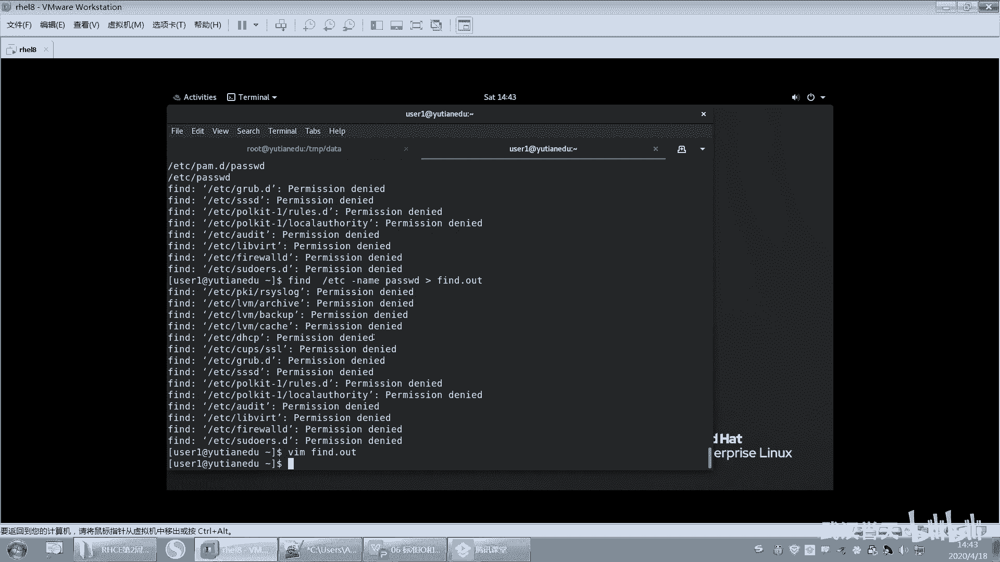

正确的我们用几来表示啊，正确的用用用一来表示，对吧？那个standout啊，错误的用二来表示，对吧？那刚刚你怎么没有用一啊，其实在我这个地方我用应该是个有个一的，但是我们没有用一，因为默认就是一。

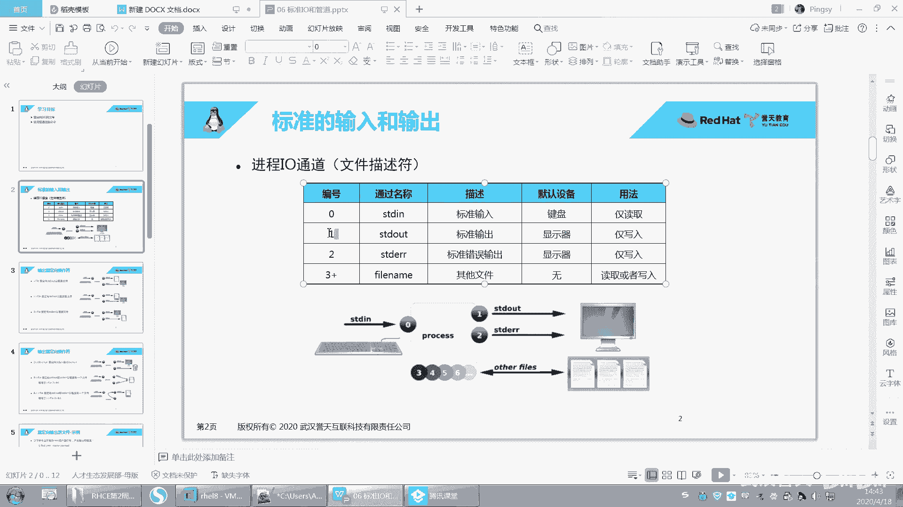

能理解吧？默认这个地方就是一啊，一就是正确的，一就是正确的啊。好，所以如果我想让二也就是错误的输出重定项，那么我就再这样哎，就加个二大于号，二大于号回车。啊，那么正确的就会输出到当前终端。

错误的呢就会重定向到fd error这个文件里面。f error这个文件里面我们可以打开看一下啊。看到没有？这就是错误的，对不对？啊，那么我们按照上午来说的，为什么会报错呀？怎么就报错了。

怎么我就没有权限。😡，去因为这个命令它是去到这个目录下面去查。😡，但是怎么就报错了呢？大家猜一下是什么原因导致报错了呀。😡，啊。这个我们应该应该可以猜到的啊嗯。好，有同学说进不去目录是吧？看到没有？对。

没有X权限。而且。你光有呃这个这个X权限还不够，还得要R权限吧，你是不是得能看到啊？对不对？所以你光有R权，你进不去，这是一个方面，对吧？你光有这个这个这个呃呃X权限看不到也不行。

所以你对它没有什么RWRX权限，对，没有RX权限啊。好，很好，很棒啊。O。呃，所以就报错了。对，所以就报错了啊，就这是报错的原因对吧？报错的原因啊。好，那么这个就叫错误的输出重定向。唉。

我们的输出正确的呢就标识为一，对吧？错误的就标识为2。那么写个二大于号呢，就是把错误的重定向到文件里面啊，错误的重定向到这个文件里面啊，好，同理可得，如果我再执行一遍。那么在这个文件里面同样的。

它只有几遍记录呢，只有一遍，所以这个命令这个二大于号，只要是大于号它都是会覆盖之前的内容它都会覆盖之前的内容，所以其实错误的输出的话，这个看情况好吧，看你需不需要把它保留啊，它需不需要把它保留啊。啊。

那么如果你想追加，那你就二怎么样啊，你跟它学嘛，大于号大于号和车，这是不是就是追加了？那这就追加，就两遍记录，对吧？就两遍记叫追加啊。好。嗯，我们再来啊，我想把正确的输出到一个文件。

把错误的输出到另外一个文件。那我就可以这样做fd ETC杠 name。他是word。好，正确的呢就是大于号，对吧？然后叫find out。好，错误的呢就是二大于号叫fin的arrow。好，那这样的话。

正确的输出到这个文件，错误的输出到这个文件。那当前终端就不会有任何输出了，因为正确的错误都全都输出了呀，当前终端就不会有任何输出了啊。好。呃，那如果我想我什么都不想看。😡，我只想去。我不想看结果。

不管错误的还是正确的，我都不想看，对吧？我就把它保存到一个文件里面。那你可以这样。😡，全部输出。全部输出啊，就是and。大于号。and是这个单词。and大于号叫find all。啊，这个叫全部输出。

不管你是正确的还是错误的。全部输出到这个文件里面，那正确的错误全部在里面啊，这个叫end end啊。同理你再执行一遍，怎么样会覆盖之前的内容，会覆盖之前的内容啊。然后你要怎么样啊，你要呃这个叫追加，哎。

这个叫追加啊，这个叫追加。好吧，三个以此类推啊以此类推都是这样子的。

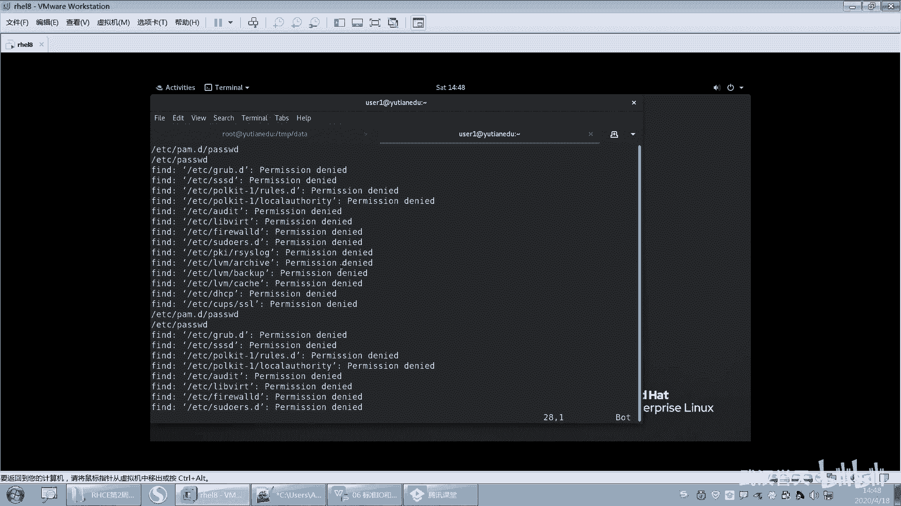

嗯。OK吧。好，我们来看一下啊。啊，12我们都学了是吧，12都学了，我们输入后面再学啊。呃，那这个是重定向输出重定项对吧？这个是错误的输出重定项啊。然后这个呃好，这里有几个例子啊。

这个这个是不是讲过了这个啊看下面这个啊，这个是刚刚讲过了吧，这个是and大于号，大于号加文件是重定向错呃正确的和错误的到一个文件里面。呃，它也等同于。哦，等同于这个东西是吧？😮。

所以我们还要看这个东西是是个什么东西啊。呃，就是一个我看后面有没有写啊。我还没写好，我来解释一下啊。嗯，你你有时候会看到有一个符号叫这个。

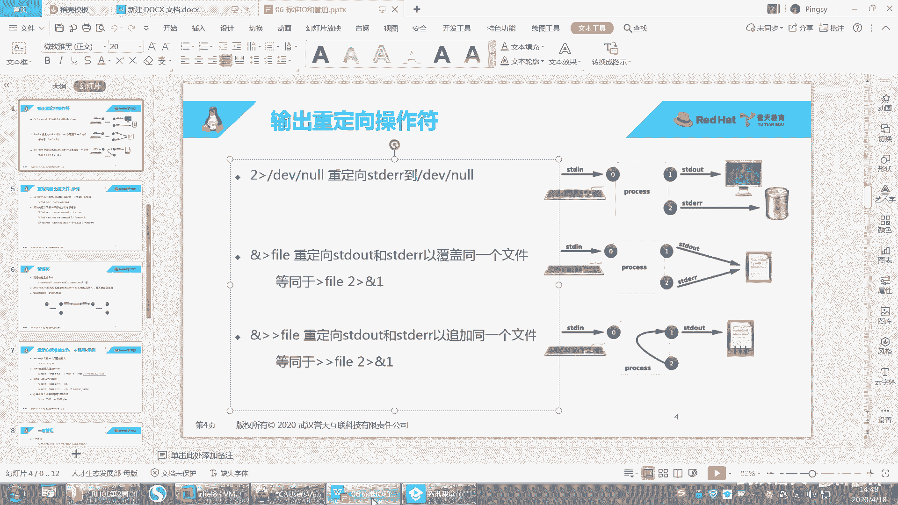

呃，叫。叫什么呢？叫。2大于号and。一是2月份大月号按的一吧。哦，是的啊。叫二大于号and一这个符号。啊，你看啊这个二大于号and一，它是指将错误的当正确的输出。OK再说一遍啊，你们拿笔记啊。

我这个PPT好像没有做注释是吧？啊，二大于号and一指的是将错误的输出重定呃，作为正确的输出，就将错误的作为正确的输出。

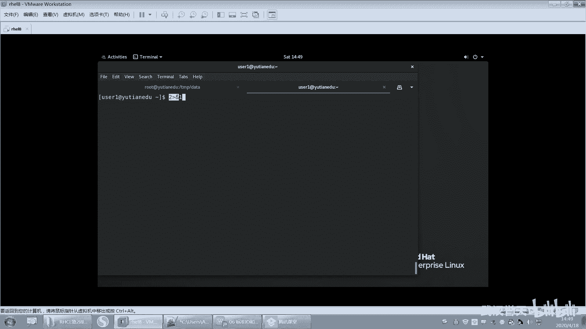

我看我这张图，你看这里有一张图。等一下等一下等一下等一下，我点错了，好像。还能听到我声音吗？诶。我怎么点到摄像头去了？还好没有摄像头，咱们就开开开了。我是怎么回去啊？哦，看不到了，我点退出了。

我不小心点到摄像头这个。哦，在这里在这里。啊，我刚刚不小心点到这儿了哦，这哦，摄像头在这里是吧？我还得我之前还没注意啊。😊，这里是播放视频，这里是PPT也是PPT。好。还好没有摄像头，这不就露馅了。

Mhh。hu。因因因为我的电脑没有摄像头。啊，等我的等我的电脑拿回来之后。嗯。到时候我再买个。买个嗯把把那个化妆品拿回来之后化个妆啊，然后再咱们再来那个一下啊。😊，真的，我用的是台式机。

因为我回来的时候，连我电脑都没拿回来，然后导致我现在一直没有回武汉。我电脑还在武汉。然后我还是借着借着我们亲戚家这个这个这个电脑再给大家上课。等咱们咱们这个我看好多老师都露脸了，是吧？关键你我露脸。

你们没办法露脸呢，我让你们看只看我，我看不到你们。😡，嗯。好，上课啊。呃，这样吧，到时候我们呃我们我们来个嗯我们可以约一下啊，然后这个咱们结课的时候。结课的时候好吧。我们可以来讲啊，或者是。这个。

V link。V link。还有什么？还有这个。😊，还有一个什么，还有这个还有抖音是吧？哦，抖音好像你们也不能漏哦，那就视频微 link可以微 link可以。我跟你说，好多好多人就给我机摄像头。

但也没看到摄像头是谁，不是也没没没收到摄像头。😊，嗯，OK好，废话不说了啊，废话不说了。😊，好。呃，这个是这个是曾老师。对，这个是曾老师啊，你看这颜值杠杠的。嗯。颜值很高啊。好。呃，这边啊这边看这儿啊。

看这儿。你们这这个发出来就看美女去了，不听我讲课了。看这啊。啊，你看啊这个这个这个二大于号N的一就是将这个什么错误的输出呢，唉从作为正确的输出，然后这个地方它就会从一这地方输出出来。

所以就就就会这作为这个正确的输出啊，输出到文件里面了。对，作为错误的数据啊。嗯。我都被他被你们弄混搞。😔，等一下，我喝口水是喝口水啊。😊，嗯。🤧。啊，亲收回来收回来啊。😊，呃，上课上课上课啊。呃，呃。

看到看到时候吧，看到时候我这个嗯。这个。就结课的时候对吧？然后这个状态怎么样啊？如果状态还可以的话，咱们就来个视频，好吧，咱们也见一面啊，毕竟。呃，这个班上一个班应该是有之前有见过一面一面哦。

这个班好像一面都没见过是吧？是这样吧，一面都没见过，还是要见一面的啊。好，那你到时候你那你就别进来啊。啊，那么这个是二大于号N的一啊，那么我们来看一下这个地方啊。因为网上有很多这个符号。

有同学搞不清楚它二大于号N一是什么意思。😡，哦。

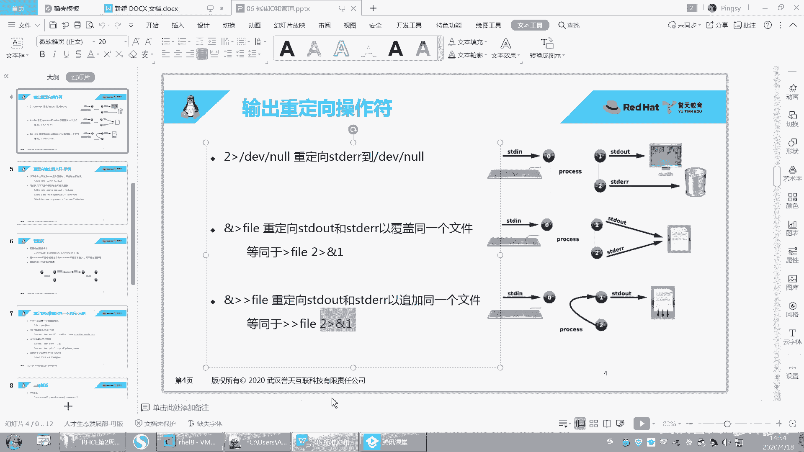

fend，然后。ETC。一嗯。然后杠 name。这如花是你们云聚散老师啊。啊，password。OK然后我们如果从定向到find out是吧？啊，从地上翻到out啊。

那么这个时候我们只会正确的输出到这个find out里面。那如果说我们想把错误的也一并输出到这个find out里面呢，我们就加一个二大于号。and一。

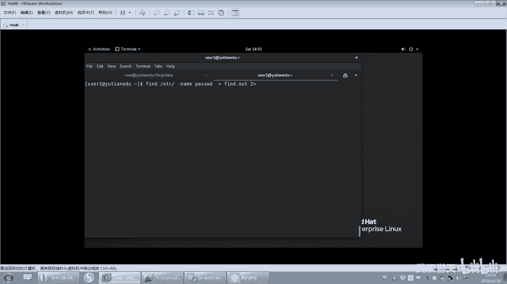

而且这个位置。呃，位置不能就是说。你的位置不能反着放啊。就他要放在后面看到吗？就文件在这儿，你不能把二大于号按在一放前面好放前面也不行，放前面好像不是不可以的啊。😡，你要注意啊。

把二代于号201放后面哦，这样的话那么正确的就会输出到呃，就这个错误的就会输出到find out里面了。

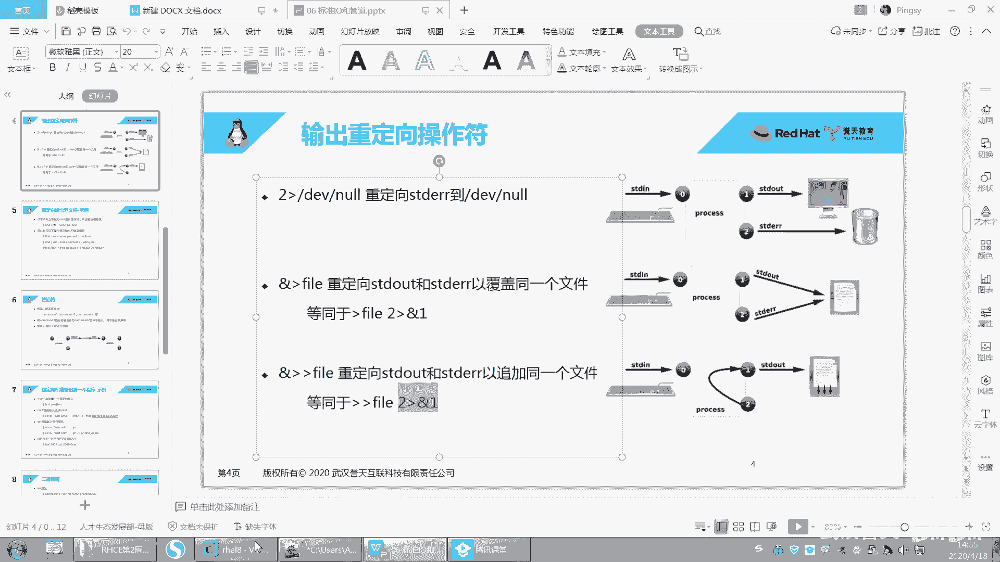

好，我们打开翻到的看一下。我怀疑你们来上课的就是。垂涎曾老师的颜值来上课的是吧？嗯。

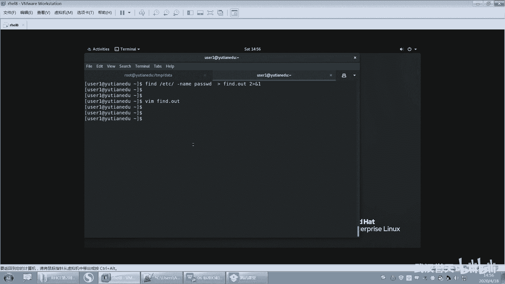

好。啊，同理这个地方也是一样的啊，就可以加这个这个呃这个这个大于号大于号，这个是大于号，对吧？一个是重定项，一个是追加，一个是覆盖，一个是追加啊。OK吧，这个这个没问题吧。这个没问题了吧。好吧。啊。

下面我们来看一下这个啊，下面还有这个这个是我之前我给大家写的一个例子，是我上课演示这个例子啊，这个大家就回去照着做一下就行了，好吧。ETC。

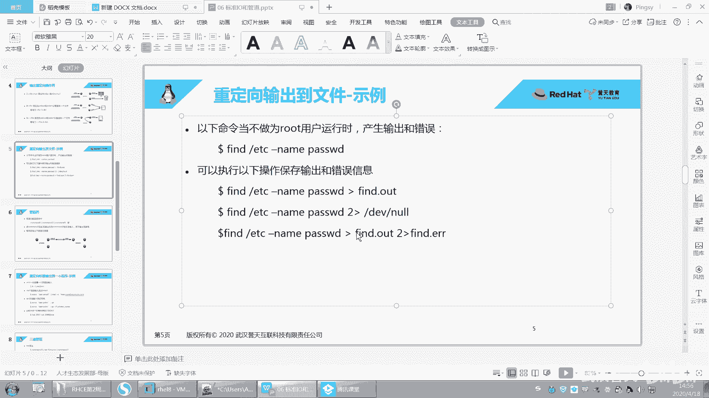

好，下面我们再来讲一个设备文件啊，讲一个设备文件。嗯。好，因为有些时候呀。呃，我们并不想。大家。呃，回来好吧，心回来，孙老师在给大家上课，大家就不要提其他老师了啊，要不然我会吃醋吃醋的呀。😊，嗯。

你看还是小虎同学这个。有颜色是吧？Yeah。好。要不然这下午就就就就就。嗯，就上不下去了，我上不下去了，已经。好。嗯，现在呢我们刚刚是把错误的输出给怎么样？

给重定向到这个错误的输出重定向一个文件里面是吧？其实所有错误的话，我们没必要去保留下，保留下来啊，就是直接丢了算了，对吧？丢了算了，也不想看到也不想看到。所以这个时候我们会把会去会会去这样写啊。

然后finend ETC password。然后。下面呢我们要加一个这个二的，因为错误的不想要嘛，是吧？错你正确的还是要输出，所以二大于号叫DVn。DV none啊，好看这里。

f查找ETC下面名字叫password这个文件呃，2代于号就是错误的重定向到一个文件里面叫DVn里面回去。好，那这样的话，我是不是只看到正确的错误的，我不想看对吧？错误的我是不想看的啊。好。

那在这个地方呢呃这个DVn是什么？😡，它是一个稳件，而且是在DV下面。看到了吗？这是不是在D一V下面有一个文件叫n啊？这个文件是一个什么类型的文件呢？它是一个C，它是一个字符文件，字符文件啊。呃。

字符类型的文件。我们除了字符类型的文件，还有什么？还有我们的不是DVSDA。这个文件它是一个快设备，叫B，是B开头的。这个文件是C开头的是吧？那么这个文件是我们的磁盘文件。

叫DVSDA是我们的磁盘文件啊。那这是我们的什么？它是一个空设备。这个设备大家可以把当做是一个什么，当做是一个。可以接收任何的。输出的也就是说你们可以把任何的输出丢到这个设备里面。

而且这个设备它不它不会去占空间，也就是说它不会占空间。😡，他就像一个。对它就像一个黑洞一样，对吧？它也不是回收站，而且它不会保留下来。对它不会保留下来，它直接就。😡，你你把什么东西。

只要是输出的东西都丢到这里。😡，嗯，它一并接收对，一并接收啊，OK吧，叫DV none这个文件记好啊，它经常会在我们的这个脚本当中会用到。好，我举个例子啊，它为什么会用到这个这个脚脚本里面会用到啊？

啊呃，假如说我现在我现在去拼一个东西，比如说拼一下3W点百度点com。很貔貅是吧？好。哎呀。哦，拼不通是吧？嗯。我今这个网络有问题。哦。

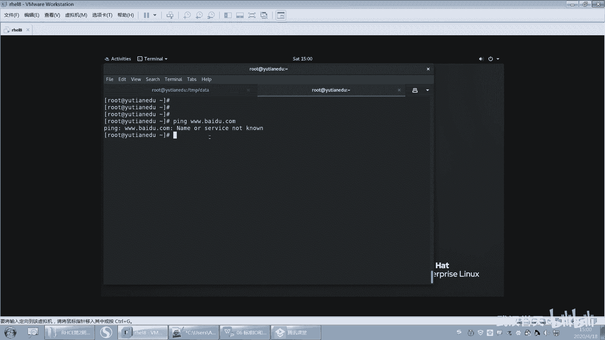

就被我。算了，他修改不了。

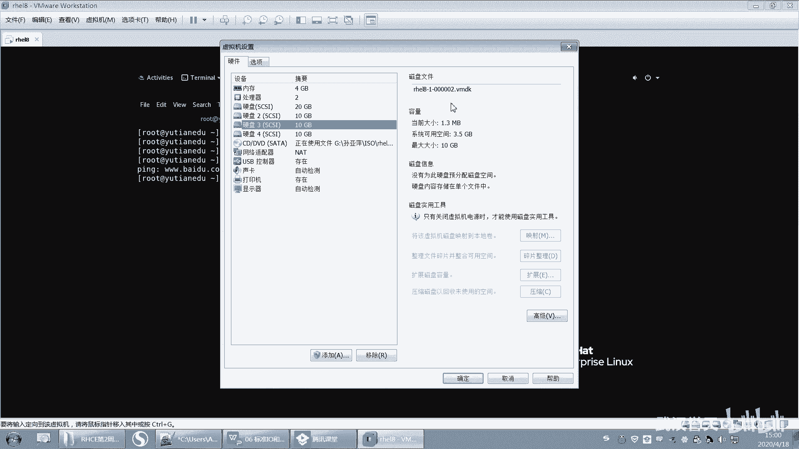

算了，好吧。不平好了。我看一下我的IP地址啊，怎么变成这个地址了？你给我修改。哦。等一下啊。好，先拼通了吧，先拼通了啊，那你看。像拼拼3W点百度点com是不是拼铜了，对吧？好，那我想去判断一个主机。

我去拼一个主机。呃，拼不拼得通，我们怎么去看，对不对？我们是不是看这个输出，看这里对吧？有没有这个这个TTL值，还有这个time这个这个值是不是看到这里啊，对吧？啊，如果拼不通的话。

比如说这样呃就这个pin啊，随便拼一个啊。嗯，111点呃那个172172025点。254。100好吧，好，拼不通的话，它可能就会显示什么主机不可达，或者是是。😡，甚至是没有输出。

而且卡在这个地方你说通啊还是不同了，对吧？有时候你是无法判断的。你看这个地方我们的判断哦，确实是同了，对吧？好。😡，其实在脚本当中，如果你把这句话写到一个脚本当中，我们后面会学脚本。对，会学脚本啊。

那么到底拼通了还是没拼通啊？我们其实根本不需要我们人为去判断，我们不需要去看什么，不需要去看这个内容，对吧？不需要看输出的结果，那不看不看怎么办呢？不看就把它怎么样啊，给重进项目。它给丢了啊。

后面加一个呃and。DV now。就是说你把这个输出全部丢到第一位那里面，不要。而且你你在写脚本的时候好，拼的话，我们拼几个包呢，我们拼两个包结束，好吧。啊，而且你放在脚本当中，你一看哇。

你一执行脚本这个好堆一堆输出，对吧？那你怎么样？你你这一堆输出我只是不想看，不想看这一堆输出。因为这个你我我只想让这个脚本显示它该显示的东西，对吧？我想让它显示什么就显示什么，所以不想看内容全部丢掉。

全部丢掉，丢到第一位那里面好，那到底拼没拼拼通呢，我又没法去判断，对吧？所以这个时候我们后面脚脚本的时候哈，会讲到一个叫一个一个命令执行完之后，它会有个退出码，会有一个退出码。啊，怎么去看这个退出码呢。

可以用eal dollar问号。😡，去查看叫一口多了问号，多了问号是指的上一条命令，上一条命令。他的。执行的退出码就是每一条命令之后都会有个退出码。零呢多了问号指的是这条命令的退出码是多少？😡。

显示是零显示是零，那么零代表是成功零代表是成功啊。好，拼一个失败的拼一个失败的。刚刚这个是拼失败了，对吧？我们拼两个包结束啊。好，拼两个包结束。好，第一位呢好，他拼是他拼成功了还是失败了呢？对吧？

我们啊这个拼两个包还不行。我给他一个超时时间，好吧。给一个超时时间，给个。超时间是大W吧。还小W。这个单位默认是什么来着？好，就结束了，看到没有？结束了啊，可能这个地方单位10秒钟啊，就结束了。好。

那拼成功了没有呢？看一下一口多了问号。怎么样是不是非零啊，是不是一呀，对吧？那我将来可以写个if语句，哎，写个判断语句，判断说它怎么样啊，它成功了还是失败了呀。哎，然后怎么样，然后再去判断这条命令啊。

是是零啊还是非零啊，然后再去判断这条命令是指定成功了，还是失败了。所以这个这个dV none啊，要记住，它后面会经常用到啊，会经常用到这dV none啊。啊，提前给大家讲了一点点这个内容。

后面我会给大家仔细讲这个退出码，还有这个脚本怎么去写啊。

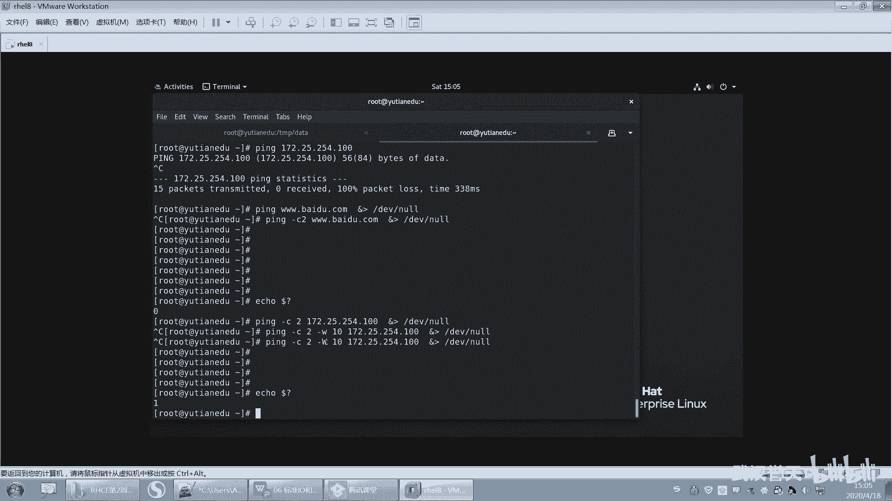

嗯，好啦，那就记住了，这个叫D位n啊，好吧，第位n啊叫叫叫这个呃一个特殊的字符文件。好，这就我们输入输呃输出是吧，只讲输出吧，只讲了错误输出和正确输出好，怎么去重定项，怎么重呃重定项符号，错误重定项。

正确重定项全部重定项。2大于号and一都记好了吧。好。

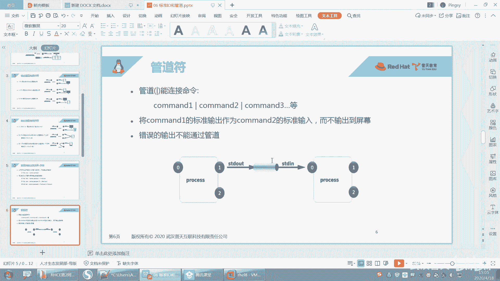

再来啊呃，我们下面要学一下管道了。对，下面要学习下管道了啊。嗯，这样子啊。嗯。我们之前还记得吗？我们之前学过一个叫data的命令，对吧？然后还学了1个CAL。

我们当时讲说要两想让在一条在这一个命令行当中。呃，去执行两个命令，我们中间是用分号来隔开的，用分号来隔开，对吧？那么就先执行第一个再执行第二个，对不对？那这是一种连接方式。我们之前讲的一种连接方式。

那么。这两个命令之间呢是没有任何的逻辑关系。就是我们之前说的对吧？那今天呢我们就要学一个学一个符号，这个符号呢就是用来连接两个命令的。而且这两个命令之间会有一定的怎么样啊？哎，关系对，会有一定关系。

这个叫管道辅管道符啊。好，管道辅怎么用呢？

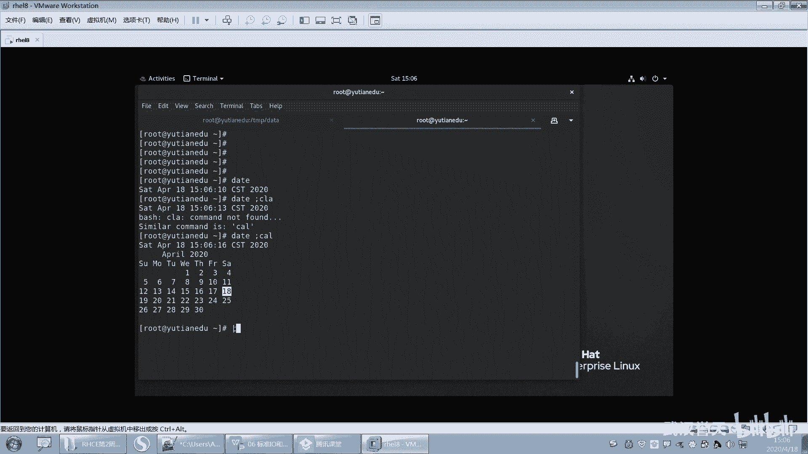

管道嘛英文单词叫pple。呃，英文单词叫pile啊，叫ple，就是就就是那个地下管道管道那个管道是吧？就是。排水的那个管道是吧，就就就那就那个嘛，对吧？就那个排布啊，叫呃呃叫叫这个好。

那么我们可以用这样啊commd。你们可以写一下啊，common一。哦，然后呢，管道。然后commond2。呃，然后管道commode3。啊，点点点，其实我可以怎么样，我可以加多个。

我可以一直这样去加下去。只要怎么样，只要你有还有东西可以加是吧？那这是什么意思呢？好，这个指的是啊command一执行的结果作为command2的输入。commond2执行的结果作为commd3的输入。

好，我举个例子啊。

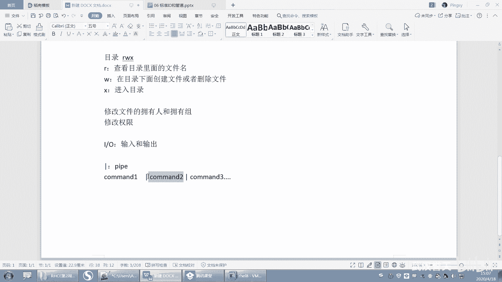

嗯。我们刚刚不是。这样去查了吗？对吧？这样去查杠name，然后password。好，这样去查会有两个结果会有两个结果啊。那么这个结果呢，我想统计一下它的行数，我们后面会学一个命令叫WC。呃，不是上厕所。

那WC啊叫what count。AL呢是指列出行有几行啊，回去了。好，这地方就是2，看到没有？对，就是2。好，那么这个地方这个管道符起到一个什么作用？本来我是可以这样统计的，比如WC杠L。

比如说啊统计一下这个文件里面。哎，有多少行啊哦，这个文件里面有多少行啊，有53行，对吧？那这个这句话的意思是。这个WC杠1。他所给这个命令输入的一些这个我这个内容是不是来自于password。

来自于文件，对吧？那文件的内容是不是给到这个WC杠L去处理。但是呢我们怎么样啊，在这个地方我们是将什么将第一个命令的执行结果，也就这两行将这个内容作为什么WC杠L的输入，让它来处理，统计一下行数。对。

统计一下行数啊。好，那你其实我像我我这样去，我是不是可以再继续WC杠L啊，这样是不是只有一啊？那它这个WC杠LL统计的是什么呢？统计的是不是这个地方的输出有几行。😡，能理解吗？

那统计的这个地方的输出有几行，这个二是不是只有一行啊，所以最后是不是只有一，那你再加是不是可以一直加呀？那你再加没有什么意义的嘛？因为这个一永远是一永远是一，所以这个管道符我可以一直这样加下去。

只要后面的这个命令可以接收来自于前面这条命的输出。😡，也就是说这条命令的输出可以作为下一条命令的输入，那么这样就可以一直管道下去，对一直管道下去。所以。这条命令这个管道符号，我们linux当中啊。

正是因为有了这个管道符，所以我们的这个什么。呃，我们的这个命令才可以各种以各种各样的方式，然后把它融合在一起去处理。好，你比如说啊。嗯。我看看举个什么例子啊，给大家用管道服是吧？好。呃。

我我我我就我就随便举一个吧哈，你看一下就行了。你你看不懂看不懂就算了啊。这个后面会讲嗯。好，我现在要做什么呢？呃。啊，要做一个杠F。😔，嗯。请1234。5。好。然后看这里啊。我先把它给行给截取出来。好。

看这儿啊看这儿。嗯。你看啊。呃，我想去截什么呢？我想去截，你看啊DF杠H就是我们后面要学一个命令，叫DF杠H它可以查根的使用百分比在这里看到没有？根的使用百分比是26%。26%啊啊，那这个地方是根嘛。

这是根空间啊。然后这是我对应的分区啊，分区的名字叫DVSDAE对吧？好，那么这是根。好，那么我想截这个数字叫26%。哎，想截这个数字叫26%啊。好，那我我用这样一条命令把它截出来了，看到没有？哇。

截出来了26%。看到吗？然后你可以你看啊，我第一步先做什么，我第一步怎么样，先把这一行给截出来。那么第一行先截截出来之后，然后再去截什么，再竖着截嘛，是不是要竖着截啊，那我用下面这两个。啊。

实现了怎么样，竖着把它截出来。所以你看啊我要把它截出来这个事情。😡，最终这个结果是不是说我可能没有办法用一个工具让它去实现，但是我可以通过什么通过很多个工具，然后结合在一起，然后通过管道连接起来。

然后怎么样，最后得到我想要的结果，而且我还可以再继续怎么样加管道。只要输出嘛，我还可以做我想做的事情，我还可以把这个26解出来，我可以把这个二解出来，我可以把6解出来，我可以把百分号解出来。

怎么解都可以。😊，啊，OK吧，所以这就是管道的作用啊，正是因为用了管道。但是你想一要如果没有管道的话，那么这个是这个linux里面你怎么去玩婉转它？好，截一遍，来先把这个输出输出到文件里面。

然后再用这个命令，然后去把这个行截取出来，然后再重叠向到文件里面，然后再用这个命令怎么样呃，再去做进一步的处理，再去重叠到文件里面再用这个文件里，那你就你这太累了吧，对吧？所以怎么样，一步搞定。对。

一步搞定啊，这就管道啊，所以他一定要会去用这个管道，这就候是管道。我们的我们的我们的这个命令才可以就是多种多样的去把结合在一起啊，结合在一起。😊，好，我们后面把这些这些这些我都会讲啊。

这个这个什么这些命令都会讲啊，都会讲。只要你学会之后，这条命令就看能看懂了，好吧。😊，好，这个是管道斧啊管道斧。可能因为我们现在学的东西不多啊，因为命令不多，所以呃要玩出什么花样，这个有点难是吧？

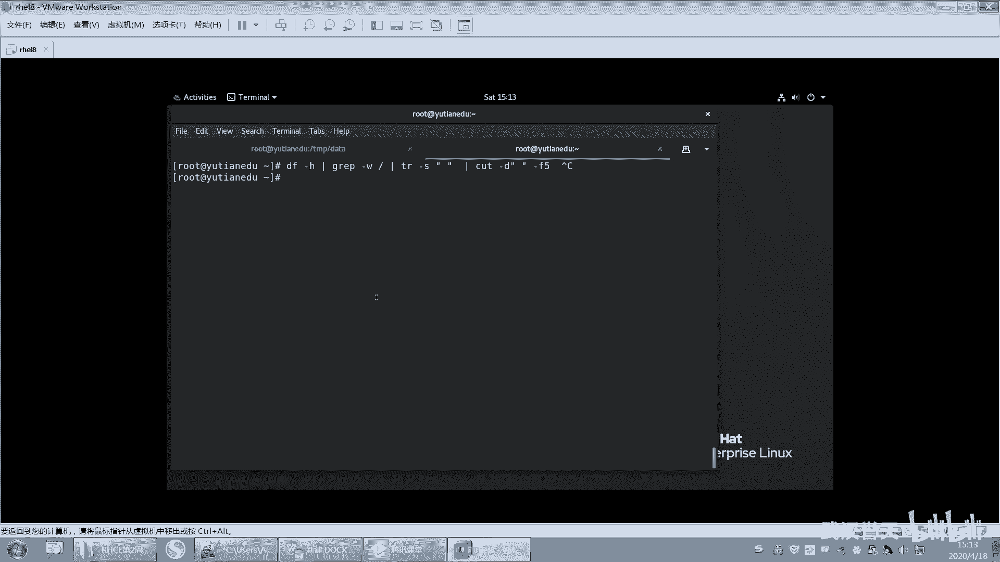

好，这里我举几个例子好不好？举几个例子啊。😊，呃，这地方有一个有一个一张图呃，这张图其实还是呃比较清晰的啊，但是有一句话。

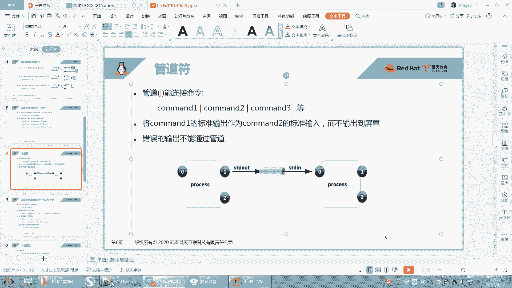

是这样的。切到U则一又有个坑啊，又有个问题就是。啊，什么意思？可以理解为fin的这是这这个这这。哦，对，是。呃，是的，是这个意思啊。呃，沈野同学嗯对嗯。好。

fend ETC呃下面的杠name password。啊，那么你看啊现在呢我想怎么样，我想对这个输出进行一下这个嗯进行这样一个统计有多少行，对吧？想统计有多少行啊，那么。这样我统计的话会有几行呢？嗯。

我有几行呢叫数是吧？123469好，不用数回车直接回车。唉，几行呢只有两行，看到没有？这个地方是不是只有两行啊，那前面这些是不是都没有统计啊？是不是直接输出到终端了，而且只输出了这个2对吧？只输这个2。

那说明什么呀？说明WC杠L有没有统计这些内容啊，只统计了什么，是不是只统计了这两行正确的输出。OK吧，它只统计了这两行正确的输出啊，它没有统计这些错误的输出。所以我们可以得出一个结论啊，叫什么呢？哦。

好，这个结论下的有点早是吧？😡，好，你可以再去测啊，错误的输出。是不可以通过管道的。因为你想一下，如果它通过管道了，一定会被WC杠L统计，是这样吗？那没有统计是为什么呢？是因为根本没有通过管道。

这个输出根本就没有到达什么，没有到达这个WC杠L，没有让WC杠L统过统计。其实我不嫌它输出的是什么，对吧？你输出错误的，我也给你统计，正确的我也给你统计，但是没有通过管道，所以没有统计啊，记住有句话哟。

叫错误的输出，怎么样，不可以通过管道，不能通过管道，O吧。😡。

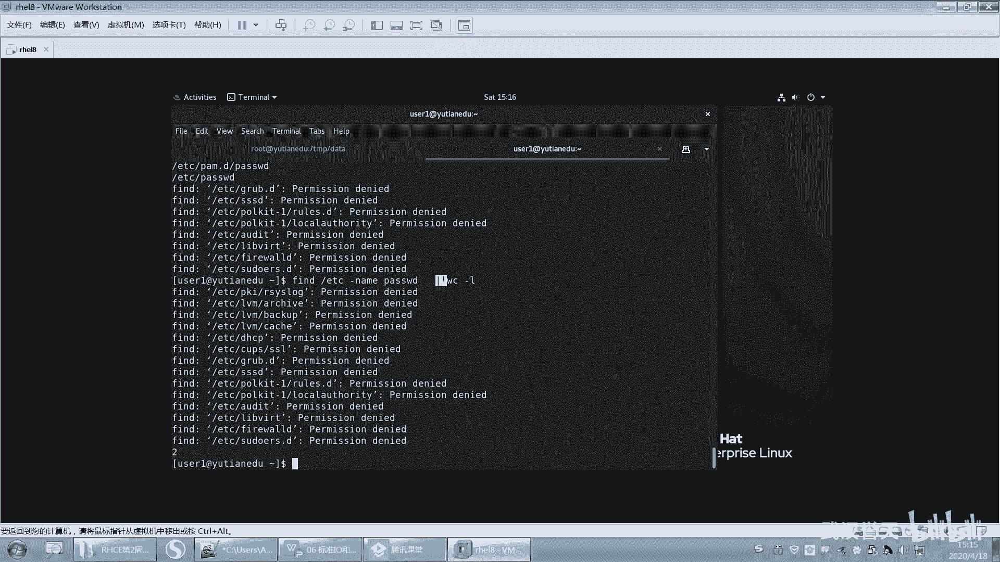

好。但是我现在就想让他通过管道，对吧？怎么办？怎么办让他就通过管道啊。😡，有没有同学能帮我实现？到目前为止，我已经讲过了怎么实现呢？怎么让他就通过管道啊？呃，好好很好啊，很棒，大家都听了啊。

大家都听了是吧，怎么样啊？😊，错误的是不是从这儿出来的呀？😡，那让他怎么样啊，作为正确的从这儿出来，是不是就可以通过管道，你看管道哇，真的画了一个管道哎。😡，是不是换了个管道啊？你看。

这图还是蛮形象的哦。是吧。所以。二大于号and1O。

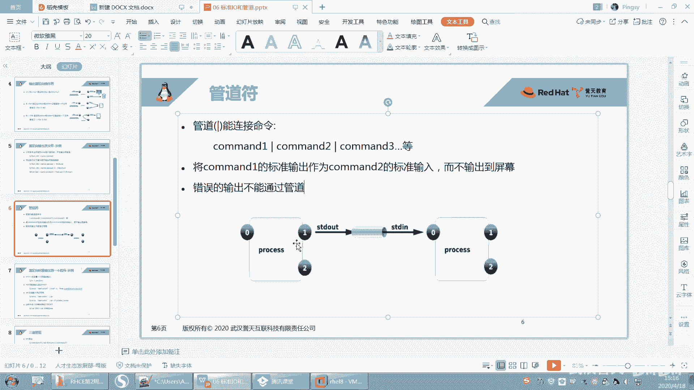

而且二大于号N一是在哪个地方呢？嗯。ETC杠 name。在哪里啊？是不是放在后面放在后面，对吧？哦，怕错了哦，就直接二大于号。and呃呃end一是吧，然后再来怎么样？WC杠要回去。统计了吧，对吧？

16行啊。啊，都统计了。如果没有统计的话，没有经过管道，在这一部分没有没有没有它统计，它就会输出了，它就会输出了啊，O吧，那二大于号and一2大于号and一啊。哦。

我是说你哪个地方这个敲的感觉有点不对劲儿啊。好，这就是二大于号N的一的作用啊。

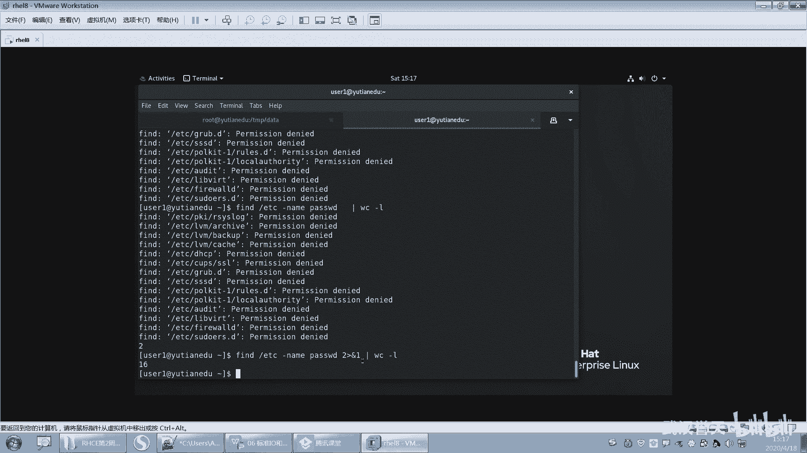

啊，错误的输出不能通过管道。但是如果让它作为正确的输出，它就可以通过管道了啊啊通过管道了。呃。这就是管道啊。好，下面有几个例子，我们来看一下啊。嗯，我们lesss后面也会学呃。

比如说我们之前学到的这个呃这个。

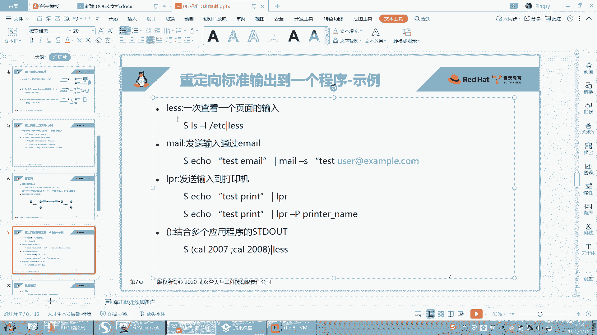

啊，比如说的data刚刚ha对吧？我们说这个命令啊太长了，要上下翻上下翻，对吧？那我就可以通过管道，然后将这个结果。丢给另外一个命令，让他分页去显示。这是我们后面要学一个命令啊，就是分页去显示。

那这样你一页一页的查看，而且可以上下这样去翻，对吧？这是不是就就是管道的唉管道的作用，对吧？管道的作用啊嗯就是一个命令的结果丢给另外一个命令来执行啊，这是管道啊。

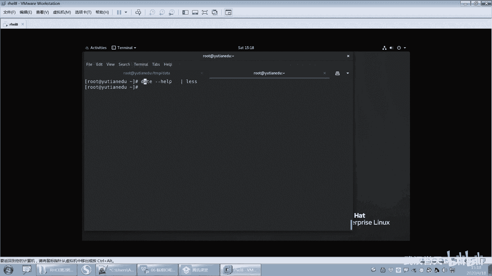

好，还有呃我们还可以去发一封邮件啊，这个邮件呢我们给大家讲一下啊。

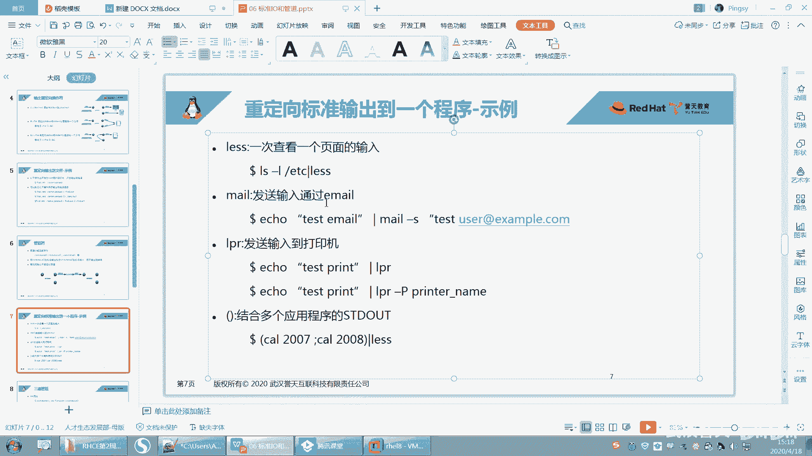

嗯，比如说。我要去。哦，不好意思啊，这个这个邮件好像他这个工具还没有装，那就算了吧，到时候装了再说吧，好吧。

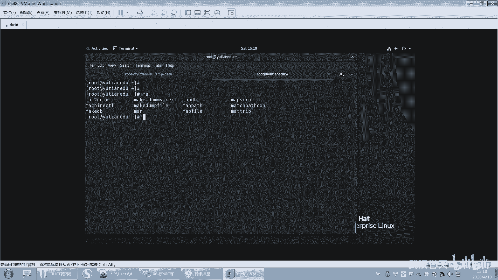

呃，这个命令好像没有装红帽七是装的，红帽八这个这个这个没有装是吧？好，没有装就算了吧，这个就不看了啊。呃，还有就是嗯比如说你可以eco什么，对吧？eco什么东西，然后。呃，这个是打印机吧。

这就是你连了个打印机，有打印机的命令叫IPR，不知道现在有没有了啊，IPR。

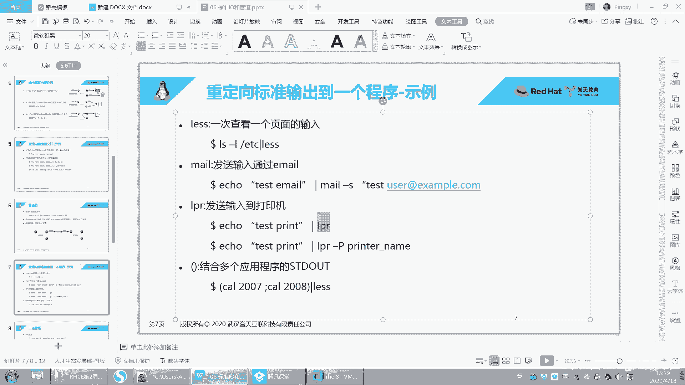

哎，还真有还有是吧，证明你还是有的IPR。

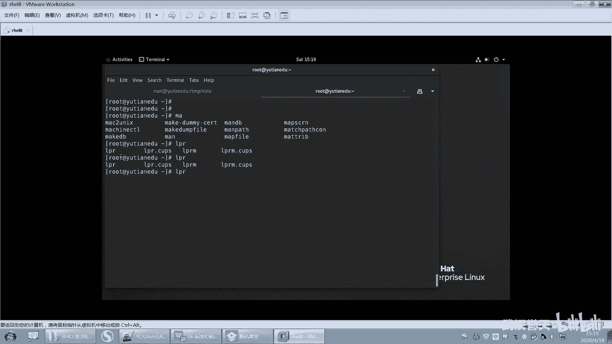

他是说就是呃eco test print就交交给打印机，然后呃打印机会把这个内容打印出来，然后这个是指定打印机的名字啊，就是管道的作用，好吧，将内容丢给这个命令的输入。

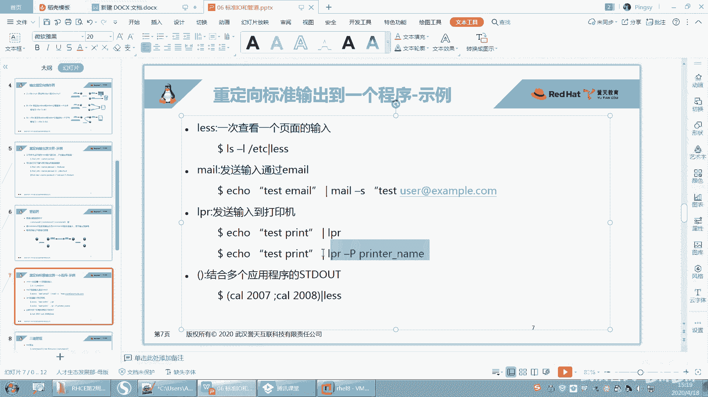

啊，这边的输出输入好吧。呃，还有我我再举个例子啊，是这个例这个例子是有问题的，好吧。嗯，我之前有有布置一些作业，是这样，我是这样布置的。我说要创建一个目录叫data下面的。当然sintoS哦。

比如说HE好吧。然后创建完这个目录之后，并且要给这个目录呃去修改这个。权限好，我我写几种啊，大家觉得哪个对的答错的啊。change O755吧嗯，77吧。然后data下面的HEL好，这是一种啊。好。

然后第二种。MKDRd下面的HEL。呃，改管道服千就问。77data下面的HHEL。哦，好，这这是第二种是吧？呃，当然还有第三种可能就大家就没有学过了啊。呃，HEL啊，然后and符号。

这个是我们后面要学的一个and符号，然后che就on。呃，西息的对他讲这样子啊。啊，需要。反正我我反正很多同学就是大概做就是这三种呃，他就不要分开，他就其实你分开做这样是不是也是对的，对吧？

先先创建目录，再再修改权限。啊，那这你第三种看不懂就算了。好吧，那前两种你觉得哪个是正确的，哪个是错误的。好，就说呃哪个正确，哪个是错误的吧。第一个对不对啊？第一个可不可以？第一个可不可以？啊。

一是正确的是吧？

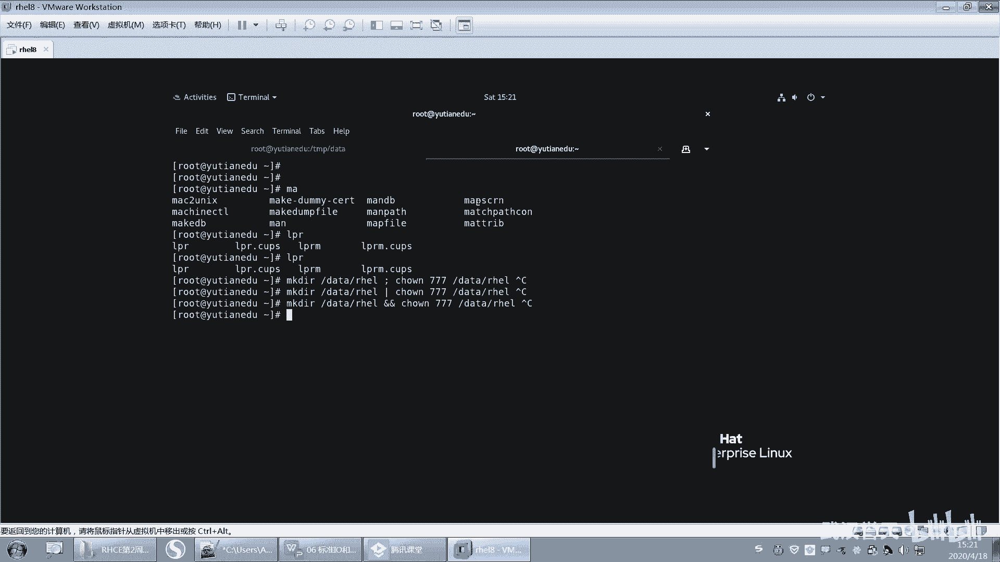

那第二个呢第二个是什么鬼啊？