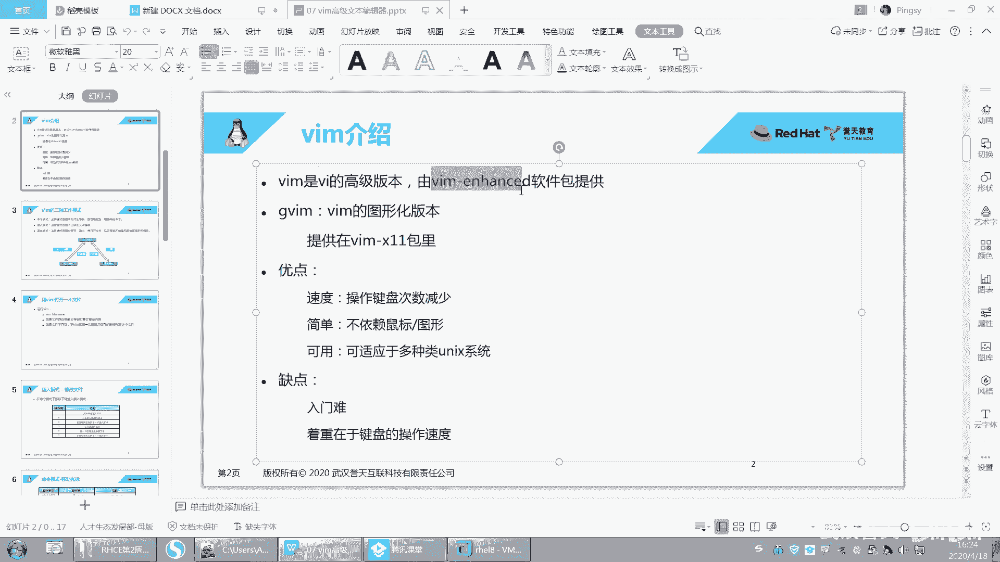

# 【已更新】最新版丨誉天红帽RHCE 8.0系列培训视频 - P27：IO重定向管道和vim的高级使用1-27 - 武汉誉天 - BV1cv411q74E

那第二个呢第二个是什么鬼啊？第二个。这是什么东西啊？你看一下啊，左边是创建目录，右边是修改权限，他们两个有关系吗？没有任何关系，而且左边这个管道左边的这个命令输出的结果有结果吗？你结果传递给第二个了吗？

😡，我。好像还有同学哇，他真的成功了。真的成功了。对，真的成功了，但是不能这样用，听到没有？不能这样用啊，它是空的，不能这样用。就是你不是说所有的命令，他们两个都可以用管道来连接起来。

而且你这样用有意义吗？没有意义啊。对吧。没有意义啊，所以管道不能乱用啊，你不能说任何注意，不是任何的命令都可以接受来自于管道的输入。😡，能能能记记住啊，不是后面。😡，如果这个千就问这个命令是吧。

它不能接收来自于管道的输入，那么这句话就是错的，这个就错的，不能执行。不能执行啊，所以要注意啊，不是这样用的，就是还果真不止一个两个同学这样去做啊，我不知道为什么这样去弄啊，没有意义，好吧。好。

下面我教大家来去用一个啊。呃。这个这个这个。他还真成功了是吧？哇。嗯，你看是成功了没有啊？没成功哎。哦哦，sos sorry啊，这边改成迁就O了是吧？哦，成功了的。哦，你千金mo是吧，写错了啊。😮，啊。

那成功了是吧嗯。哦。这个我们这个好算了，翻篇吧。好，翻篇啊。好，那下面啊我们想去修改密码。啊，修改密码啊。hhu。啊，修改密码呢，我们这样回车是不是这样看不到啊，是不是看不到这个密码，对吧？

所以我们在想啊唉。你你你们之间还有交互，你看不修改密修改密码，还有交互，对吧？还要来回敲两遍，所以很麻烦怎么办？我们就怎么样？我们就呃给他这个这个能不能说哎password这个能不能通过一条命令搞定啊。

而且不要交互啊，对吧？所以这个时候我们想能不能通过管道的形式把这个密码传递给什么password呀，对吧？能通过管道的形式啊。😊，好，那这个时候我们就去卖呀。啊，刚刚慢过了啊。对。

刚刚我们是卖过一个参数嘛？啊，卖过一个选项是吧？这个选项叫杠杠sing杠杠s啊，你再回来阅读一下。好，你看啊，还有这个选项啊是用自于用的indicate是吧？呃，暗就是显示还是暗示什么还是怎么样呃。

password读新的密码从哪里从标准输入，但这个标准输入可以是什么？可以是管道哦。其实说白了管道也是一种输入也是一种标准输入。管道也是一种标准输入哦。对，管道也是一种标准输入啊。好了。

那么这个时候我就可以怎么样。你看啊那密码怎么传递给他呢？你看啊eal我可以这样啊，eal redhead，然后管道password。你要给谁修改密码是吧？你们你需不是要指定给谁修改密码呀，那这样还不行。

😡，因为你要告诉他。😡，你的密码来自于标准输入。所以。怎么样加一个杠杠s。O吧，加一个杠杠t啊。好。前面会显示rehead这个rehead结果呢会作为password的输入。

而且这个密码是不是来自于你看我怎么知道是来自于管输入了那个密码来自于管道啊，是不是我加了一个杠杠s，有同学不加杠杠t。然后给谁修改密码呀，给root修改密码，这样O。这样是不是就成功了？😡。

对吧一条命令搞定，而且有同学还在疑问说能不能这样re ahead。他做的为什么要加个依扣啊？😡，这样行不行啊？啊他说d ahead嘛，你干嘛加个eal呢？这不多词一举嘛，对吧？还加个eal。

eal什么什么什么什么，我们加个eal是吧？😡，好，你这样会怎么样啊，会报错吧。😡，对rehead不是命令啊，那左边应该是个命令啊，你左边的命令是什么呢？rehead吗？rehead不是个命令。

所以报错怎么样？这个命令不存在，那这个命令不存在，所以你要让左边那个输出是不是是rehead就可以了嘛？左边的是输出是rehead那。😡，这样的话，这个输出是不是可以作为什么password的输入了？

对，就这个左边的输出就是一堆报错啊，就是一堆报错，就这个样子啊。唉，已经报错了啊已经报错了啊。好。呃。呃，这个就是你你别看这些小问题啊，有同学很纠结，因为他不懂啊，就很纠结。他说你你加个E扣干什么是吧？

咱一口做什么。

好了，那这个就是管道啊，管道的作用是吧？好，下面还有一个符号叫大于号哦，不是叫叫叫大括呃，小括号啊，小括号呃，这个小括号有什么用呢？嗯来看一下啊。

嗯，小括号，比如说data。还有这个例子啊CAL。呃，这个小括号假如说我这样呃大于号，然后到C呃的的到呃Fll好，我我这样的话啊，如果中间用分号。用分号来隔开的话。左边这个命令和右边这个命令是吧？😡。

那这样的话，请问当前还会有输出吗？哦，全部好不好？我们全部吧。其实全部全部都一样的，都是正确的。但就当当前终端还会不会有输出呢？哎，当前中端它是怎么样啊，它会有输出哦。对不对？输出的什么呀？

输出的是不是da呀？😡，因为我们这个分号啊。它将怎么样，是不是以分号为分分分界线，左边是左左边是一条，左边是命令，右边也是对吧？所以。如果你想让。这个地方完全全部输出的话。

那就像个小括号一起作为一个整体小括号作为一个整体。那么这个时候怎么样就全部输出到fill里面了。哎，全部设置到fill里面了啊。啊，那这个。这个就就就没什么啊，这个就是这个小括号的作用，小括号的作用啊。

好，这就合并输出嘛，合并输出的意思啊，将多个应用程序输入到标准输出。好，这是分号跟这个这个分号跟管道的之间的这个关系啊。你后面会经常用到管道的。🤧嗯嗯。这个。这个要看这个命令的。呃，他的解释啊。

要看这个命令的解释。好吧，一般这个命都会有解释的。OK吧。回来了啊。回来了啊。

嗯，我看了这嗯这么多命令啊，一般呃什么样的命令能接受来自于管道的这个。管道的输入是吧？一般文本处理的文本处理的这种都可以，基本上都可以。就是文本处理处理文本内容的一般都可以接受来自于管道的。

其他就不一定了。比如说CP啊，可不可以，那不行。RM啊也不行。嗯，像这种都不行。呃。大概是这样。除非这个命令有特殊说明，就像password。这种password这种它有特殊说明说它可以来自于管道。

那它加选项是可以来自于管道，否则一般一般的命令啊。因为我们管道它对于处理什么处理文本。是有必要的对吧？我们在处理文本的时候，我们可要通过通过管管道，然后呃将多个命令对这个文本内容进行处理，对吧？

处理处理多次之后，然后得来一个结果。所以一般。处理文本的文件这个这个命令都可以。你像WC啊，我们WC对吧？这种它是统计文本的，对不对？我们后面还会学什么gra啊。呃。st呀等等这些命令Nice啊。猫呀。

这些都可以。啊，就是处理文本的一般都可以。OK。好，嗯，下面呢我们来看一下啊。

继续。呃，我们有一个还有一个这个啊，这个根不是很重要。但是呢呃既然有的话，我们就跟大家说一下啊，这个叫三通管道叫T是吧？

好，我们先来看一下还有什么用啊。我记得之前执行过一个命令是这条命令是吧？比如说这条命令啊，511这条命令好，那么这条命令呢，如果。它管道用的比较多是吧？那一管道管道管道管道用了三个管道。

那么如果我一执行耶错误了，你们有可能做过错误了，对吧？不是我想要的结果，那到底是哪个环节出现了问题呢？是这个环节还是这个环节这个环节，那是不是要一个个试啊？那然我第一个啊执行一遍，第二个执行一遍。

第三个执行一遍，或者是我第一个怎么样，能不能说把它保存到一个文件里面啊呃，第二个也保存到一个文件里面啊，第三个也保存到一个文件里面，对吧？最后得到的结果。

这样的话我就可以分别去看第一个第二个第三个执行的结果。😊，好。但是这种。比较麻烦。但是还有一个问题就是如果你将这个结果保存到文件里面了，或者将这个结果保存到文件里面，那看会发生什么事情啊。好。

保存到文件怎么保存呢？我们无非就种重定向嘛，对吧？😡，呃，用重定向符号。好，假如说我们用一个。从定向符号啊从定向到这个。grave点 out。好，那么我用了重定向之后。在后面的话，我们看一下啊。

在后面就没有任何输出了，对吧？没有26%了。好，我们来看一下grave里面啊。gra里面是不是就这个这行保存内容是吧？啊，那么我们发现如果一旦这个内容保存到重定向了，它还会不会通过管道呢？注意啊。

如果一旦重定向了，它就不会再通过管道了。那么TR它没有接触到任何输入，所以在后面没有任何输出。所以你一定要记住。管道跟重定向之间，它们不能同时存在。也就是说你通过了重定向，重定向了就不能通过管道了。

能理解吗？好，那怎么办呢？我想达到这个什么，又要保存到文件里面，又想让它通过管道。所以这个时候我们就可以用第三，就用我们我们现在要学这个命令叫T。叫T啊，好，怎么用了呢？

管道T后面接上一个gra点out。啊，group点 out。好，TR也想保存吗？对吧？那你就加一个管道T。呃，TR点out。No。TR点O。对吧好，最后要不要保存，最后你可以重定向了嘛。

因为最后没有管道了是吧？最后你可以重定向到什么cut点out是吧？呃，或者你不充一下也可以把它保存一下。呃，就直接输出输出到当前终端也可以看是不是输出了，对吧？同时呢生成了什么gra点out。

TR点out，而且TR点outt里面呢。是不是有这一行？然后groupip连out里面是吧？是不是有这一行对吧？这就叫三通管道，三通管道，既它其实就类似于是重定向的作用，类似于重定向的作用啊。

只不过它可以重定向，把这个输出先重定向到文件里面。然后这个内容呢还可以通过管道。对，还可以通过管道啊，就是这地方这张图。那你可以看这张图啊，本来我们管道就是这样一个就是直一个横杠，但是它多出一条是吧？

叫三通管道，然后它的输出。那左边这个输出，通过管道之后啊，通过管道可以T是吧？T输出到这个输出到输到终端也可以输出到这个文件里面也可以，对吧？然后再怎么样作为下一个进程的输入啊，作为下一个进程的输入啊。

啊，这个他有什么用呢？呃，就这么用的，它用法是这样用的，呃，主要是用在什么？呃，这个用于比较复杂的管道连接的时候，中间用它来去连接，对吧？然后把把那个每一个管每一个管道的输出输出到一个文件里面。

然后怎么样把它记录下来，然后回去查看结果等等啊，就这个样。呃，但是平常嗯用的比较少，但是知道就行了。好吧，有这个有这个东西啊，有这个T这个这个个用法。嗯，好，这个是这个T的用法啊，T的用法叫三通管道。

好，下面我们再来看一下啊，我们之前学了这个。一般我们是现在都在学什么，都在学输出，对吧？呃，唯一学了一个输入，就是标准输入，就是管道呃，可以作为标准输入。好，下面来看一下输入啊输入。呃。

一般我们输入是来自于哪？一般我们的输入啊，它是来自于呃，比如说你看啊我刚刚不是讲WC吗，对吧？

好，你看我们这个输入可以来自于文件，是不是可以来自于文件啊？啊，也可以来自于我手动去输嘛。我不知道这个WC杠1可不可以这样。好像唉也可以，这个不知道怎么结束啊哦，这样可以结束，看到没有？

你看啊我现在是不是要统计，但是统计什么没告诉他，对吧？😡，它就会等待你输入okK吧，等待你输入，那我的输入是不是来自于键盘，看到没有？来自于键盘这样敲，对吧？好，结束怎么办？ctrorl D结束。好。

几行呢？统计了123456是不是6行啊？啊，那我演示的这一种是不是。输入来自于键盘OK吧，输入来自于键盘啊，那么这种呢输入是不是来自于文件？对吧这种输入可以来自于文件啊，输入还可以来自于什么。

还可以来自于管道嘛，是不是管管道啊，那这样。😊，这样是不是可以来自于管道，对吧？啊，这都是这都是的啊，这都是好，下面我们再来看一下啊这个输入嗯。

我们有一种叫输入重定向。输入重定向啊，因为这个呢命令它很它很特殊，它怎么样啊，它也不是说特殊吧，它就直接可以借，它本来就是接文件的对吧？它可以来接文件。但是你看啊如果我们。

这样啊。

我们就有个例子。呃，这个例子叫TR，它是转换的意思。

好，TR这个命令呢，你看我们来用一下啊TR。把大写转换成小写。好。它指的是将一种类型的字符转换成另外一种类型的字符。那A到Z指的是大写，小A到小Z指的是小写。好，那我这样回车的话。

是不是等待我输入ok吧？等待我的输入啊？好，那我写个大写喽，回车。是变成小写，我写个大写啊，是不写小写，我写个大写啊，它是变成小写，对吧？它就它就会帮我怎么样帮我去这样做这样的转换啊。

那我的输入同样是来自于键盘，对吧？😊，好。那我想让它输入来自于什么？来自于稳健，可不可以，对吧？我们。😡，让它来自于文件啊。好，来自于文件，这个呢我们不就不能直接接这个文件了啊，它怎么办呢？

还得用一个叫输入重立项。也就是说输入本来来自于键盘，但是我这个首项输入来自于什么？来自于文件就叫输入重立项。输入重立项啊。好，比如说点b选C。一个隐藏文件啊。好，我们让输入是来自于什么？

来自于这个文件啊，那么这个输入作为什么？作为TR的输入对吧？那作为TR的输入啊，跑回去了。啊，这个文件里面呢其实本来是应该有大写的，我们可以打开看一下啊。呃，起码这个U是大写吧，对吧？S是大写。

但但是我们在这个地方。的输出有没有大写呢？没有对，这个地方是没有大写的啊，全部转换成了小写。所以这个叫输入重定项，OK吧。这个用的比较少，为什么呢？因为我们通常这条命令呢。

我们都会用另外一条命令来替代了。这条命令是我们后面要学的叫。这个。我们一般用它来代替了是吧？用这个catch。呃，cat是我们后面要学了一个命令，叫呃cat的话就是直接你看cat。

点8小C我们每次看文件就是我我每次都要VIM进去是吧？但这次不用了，直接cat这个文件，就可以直接打印到当前终端。好，那么这个有输出了，这个命令是不是有输出了？那么有了输出之后，我是不是可以通过管道。

因为管道也是一种什么，是不是也是一种输入啊，也是TR的一种输入，对吧？那通过管道嘛，所以你你建这种方式见的比较少。那这种方式你用的比较少，是因为呃我们通常就用这个来代替了。那用这个ca什么什么。

你通过管道来代替了啊，但是你这个要知道好吧，这个标准输入要知道啊，好，那虽然这个小于号用的比较少，但是我们有一个符号用的还是比较多的。哎，这个符号叫两个小于号。嗯，叫两个小于号，那一个小于号叫输入。

那两个小于号叫什么东西啊？啊，猜一下两个小于号叫什么？我们之前一个大于号是什么？一个大于号是输出，对吧？两个大于号叫追加追加呃，然后现在是一个小于号，是输入两个小于号呢。好，两个小于号呢指的是多行输入。

啊，这个。这个就是我刚刚举的例子啊，大家可以这样看一下。呃，两个小于号啊叫多行。发送多行道输入。好，哎呀，这个地方。😔，看一下啊，这个mail又不能发邮件，我用什么来给它测呢？嗯。

用什么来给它凑想一下啊。多行输入。😔，我看这个我没试过啊，我看这个行不行。A我刚刚用的是这个例子是吧？嗯。这个可不可以多行输入啊ABC。好像也可以是吧？嗯。刚刚我们是什么？刚刚我们是一行一个输出。

一行一个输出是吧？那我看一下这个行不行啊。嗯。好，我试一下啊，写个大写的对对字。好，但是你看什么时候结束呢？怎么办？遇到ABC就结束。ABC回去了呀，可以是吧？你看。你看啊看这里。刚刚我们是什么？

刚刚我们是。一个输一个输入就一个输出，一个输入，一个输出是吧？但是我现在不想让一个输入一个输出，我想什么，我想它。😡，多行再输出。那给它传递多行对吧？传递多行啊，那传递多行的时候，我用两个小于号。

两个小于号表示啊有两个小于号表示。好，那么两个小于号后面接了1个ABC唉，其实你不接ABC也可以。但是为什么要接ABC呢？唉，如果你不接ABC，你下面所有的内容都会被大写转换成小写。

那么接了ABC代表示它会有个结束符，就是到哪个地方截止到碰到这个ABC就截止，后面这个随便写随便写啊，我我们一般是写英一呃这个这个你看啊我们一般是写这个。一般是这样写是吧。

写EOFEOF叫N of file。呃，end of of file是吧？end of file啊，这是文件的结尾啊，代表是文件的结尾啊，呃，这个随便写好吧，嗯，要写要写啊。好。

那这个地方在脚本当中会经常用到在脚本当中会经常用到啊。好，我。😊，这个脚本还没学是吧？嗯。脚本没学怎么办嘞？好，我我要不我给大家演示一下吧。好吧，没学就算了啊，我给大家演示一下。

看一下效看一下结看一下效果啊。啊，我我们其实脚本说白了啊，就是往一个文件里面堆命令就是样。呃，往一个文件里面去堆命令，就就这样啊，没别的没别的啊。好，我我在里面我把命令全部对到这个里面。😡，好嗯。

假如说啊。我们想去修改一个文件，而且往一个文件里面去写。😡，呃，写很多好。你往一个文件里面去写很多行，你在命行你怎么写，你是不是这样写？😡，一al比如说写个hello，然后重进向到文文这个追加到文件。

对吧？好，然后先写个word。呃，word。然后这些到文件就是你写多行嘛，你是不是有可能会这样写？😡，对吧但是你想一下，你写脚本，你是不是也可以这样写？😡，你脚本就这样写嘛，ic hello啊。

到这个呃呃root写个绝对路径啊。写个绝对路径啊。Root。呃，然后eal word。呃，到是吧，root下面的。啊，fi这样，但你可以这样去写，一直下去，但是这样子是不是写的很low，对吧？

而且很多行你怎么写？😡，好，那这个时候我们就可以用多行输入啊，多行输入。好，这个还没学是吧？catch不管它先用了再说。好，cat rootot它是一个特殊的用法啊。两个小于号EOF。哦，cat。

这个写个重立项，好吧，这个是追加吧，是不是追加呀？好，那看一下这句话啊，看一下这一行。这个这一行指的是。cat什么东西，然后从追加到这个root下面的fill，对吧？😡，好，那么这个是多航输入。

这个是遇到UF就结束。好，然后后面呢写上比如说ABC呃，好，EOF结束。好了。那么开的什么东西呢？开的这一堆东西，然后到这个文件里面。😡，么ca这一堆可能大家很难理解是，为为什么用ca是吧？

你就ca这一堆东西，那到这个地方啊。😡，好。遇到ABC就结束，这个比较适合一写脚本。呃，就是比如说啊你将来我们要配亚么仓库，比如说你要配个亚么仓库，就是我们要装包啊，配一个亚么仓库是吧？大家应该听过啊。

没有听过也没关系啊，你配个亚么仓库，你每次怎么样啊，每次都要手动去配，那你怎么办？而且还有比如说我要修改IP地址啊，每次都要去修改。那如果每次都一样的话，你要做同样的操作吗？

这个时候干脆怎么样写一个脚本，把命令全部对到这个里面。啊，那你往写亚3公交文文件里面去写追加一些内容，对吧？那这个时候你就可以通过这种方式，你这个随便写中间你就这个文件想怎么写就怎么写。

然后最后这一行跟最后一行固定就可以了。好，那我下面如果再写的话，这些内容是不会追加到这个文件里面的。这就是多行输入的作用。这个会经常用到啊。这样吧，我们试一下好不好？我们试一下啊，你看啊。

看会不会最终写到这个文件里面，上面我是不是先写的这个这个叫hello和word是吧？然后最后又写把这这三行，这四行写到这个文件里面了。好，呃，这样这个文件本来要执行的对吧？我是不是给他一个执行权限。

我们是要执行它嘛，对吧？给他一个执行权限。好，那诱人就有执行权限了呀。我这不是刚好我们上午学的吗？我要要执行这个文件，是不是要给他一个执行权限？😡，啊，那么怎么执行它呢？

是不是用root下面fill去执行啊，这样去执行呢？直接回车就执行了。没去。好，那我们验证一下最后我的这个文件到底有没有写进去啊。打开这个文件看一下。你看我真对写进去了。写了个hello。

这是我之前写的是吧？好，脚本里面是写个hello，写了个word，然后把ABC这四行是不是都都添加进来了？😊，对，都添加进来了。OK吧。那这四行都添加进来了，所以这个就是什么多行输入的作用。

它可以用来编辑什么？也可以用来编辑文件，多行编辑文件啊，多行编辑文件。救助作用。就是这个作用啊，就来编多行去。一次性多行编辑啊。一个文件的多行就这样。呃，用法其实呃就这么就这么简就这么简单啊。

这个不知道我说大家有没有听懂啊，就是你可能现在没不会写，对吧？没关系，你只要知道这个两个小于号是干什么的，它就是在下面它可以加入多行。然后遇到这个后面就是结束符号，遇到UF就结束了。

下面内容就如果还有就不要再。不要再写到这个文件里面。前面你就固定去用这个用法就可以了。这个是追加的意思。哦，can是看一下什么什么内容。看一下这个内容嗯。呃。这个听懂了没有啊？这个。

这个这个地方能不能听懂啊，这个两个两个小于号。我再说一遍啊。这两个小于号用用在什么地方？它就是用在我们在编辑一个文件的时候。编辑一个文件的时候，我想去输入多行，其实输入一行。

你看我直接e口是不是同一项就可以了呀。但是如果我要输入多行，我说要一口一口要写很多行啊。😡，但是有了这个小于号之后，我们就可以怎么样啊，我们就可以。把多行一次都放在这个地方，你想写多少就写多少。好。

那么这下面的内容都会被追加到这个文件里面，为什么是追加？因为这个地方我写的是小于小呃呃这个大于大于。如果我写一个大于，是不是就是重一项就覆盖了，写两个，是不是就是追加？好。

那么既然下面的内容都会被追加到这个文件里面。那如果这个脚本下面还有内容呢，比如说eco。对对对对，是吧呃，随便这个下面我随便写的啊。啊，道反正是不是命令也无所谓，你随便写一段字符串。啊。

如果没有这个UF，你可以不写，也可以执行通。但是如果你不写的话，下面所有的内容都会被追加到这个文件里面。所以你一定要给他一个结束符号啊，对吧？遇到什么就结束了呀，遇到EOF就结束。

也就是说他像读读读读读读到O，读到EOF了，知道哦这个结束了。就中间这个内容就追加到这个文件里面。我这么说大家能听懂吗？就下面就不下面就是其他的了。嗯。啊，这这能不能听懂？

其实小于两个小于号就是多行输入就给他多行啊那写到文件里面。我目前为止反正我见到最多的用法就是这样，我嗯没有见过其他的用法。如果大家如果大家见过的话，可以分享一下。我是我是目前就只见过这种用法。

这种小于号的。OK吧。好，没关系啊。我脚本里面用的很多，脚本里面用的很多。😡，OK吧，脚本里面用的很还是很多的啊。嗯。一般用在脚本里面写脚本的时候。其实我就已经写了个脚，其实脚本没什么高大上的。😡。

就是把一堆命令放在文件里面，然后一起执行，记是叫脚本给他一个执行权限。就脚本了，这个后面我会给大家总结脚本怎么写，以及脚本，还有一些其他的语法，我也会给大家讲。

在后面单独会给大家找找一个时间给大家讲的啊。

嗯，好啦，那这个就是这个这个命令好像没有是吧？没有的话就算了，没有，就就就红包7这个命令是默认就是有的。脚本语法跟命令没有什么区别，基本上是一样的。你在你在脚本其实说白了啊呃你把你放在脚本里面的命令。

在命令行里面也是可以执行的。你在命令行里面执行的命令放在脚本里面也可以执行。嗯。其实执行脚本就是执行命令嘛。好了。呃。那这张就讲完了。这张其实。呃，内容不多是吧，内容不多啊。好。

我们大概的花2分钟时间回顾一下啊回顾一下。嗯。看这里啊。好，这章我们学了什么？我们学了。IO。管道。其实说白了就是这两个。对吧I有管道。好，IO呢我们有三种类型的IO啊，第一种叫标准输入。标准输入啊。

第二个叫标准输出。对，标准输出。第二个叫错误输出。第三个叫第三个叫错误输出啊。啊，他们所对应的这个描述这个这个这个要记住STDLN是吧？STD什么？STD out这个要记住啊。呃。

还有这个STSTDarrow。呃，这三个标准输入输出错误输出。然后我们输入的话，默认是什么？默认是键盘。我们默认是从键盘输入的是吧？默认是键盘啊，其实鼠标也是一种输入是吧？点一点嘛。啊。

然后呢我们可以用输入呢，我们可以用这个这个小于号。小于号。这个输入对吧？这个一般是后面接的是文件。就接的是文件就小于号嘛，就是输入来自于文件是吧？还有一种呢我们叫多行输入。那后面接的就是一个。

叫多行输入，这个用在脚本里面用的比较多。就就我刚刚给大家讲的叫多行输入，这个是标准输入啊。但是标准输入还有一种我们讲讲嗯。键盘一种这种这种还有一种是吧？是我们刚刚讲的什么？叫管道啊。是不是叫管道啊。

这是不是还有一种？也就是说我们学了4种。今天我们学了四种输入啊，四种都可以作为输入键盘文件多行输入，还有这个管道，管道也可以作为一种输入是吧？好，标准输出呢。我们默认是什么默认是屏幕啊。哎，默认是中端。

默认是屏幕啊，那么输出呢我们有有什么？哎有大于号，这个是正确的输出，还有追加对吧？追加，这个是正确的追加。后面呢你可以接什么，可以接文件呢，也可以接设备啊，注意哦。它不仅仅可以是DV now。

它还可以是别的。比如说还可以是其他的一些设备文件，叫设备文件啊，可以是文件，也可以是设备文件。OK这个叫输输出输出啊。啊，还有一种错误的输出，我们叫什么？唉，是默认也是屏幕啊，默认也是屏幕。

然后我们可以二大于号，就二大于号，就是错误输出错误的追加呢叫二大于号大于号，对吧？注意加，同样这个也是一样的，对不对？这就是这这这是错误的啊。好，正确跟错，我们还学了两种，一个是什么？一个是2呃。

N的符号，N的符号大于对吧？还有N的符号大于大于，这个是全部追加，全部重立项，全全部重立项覆盖，要全部追加是吧？还有一个二大于号N的一。这个是把错误的。当正确的输出。

因为我们说二它标识就是错误的输出是吧？然后正确的我们标识为一啊，输出输入呢我们标识为0就012嘛，对吧？012，所以二大于后N等于一就是将二转换成一对吧？将二变成一，就把错误的这作为正确的。好。

那这个是。就我们的呃这个。呃，管道呃，不IO是吧？其实也把重定项也说了一下。呃，也把重新项也说了一下啊。好，然后再来呢我们就讲了管道啊，管道就是这个竖杠。管道呢其实就是连接什么多个命令。

它就连接多个命令的。呃，连接多个命令的啊，那管道呢要注意。跟什么呃，注意跟这个。这个符号的什么他们两个之间会有冲突，就有的时候如果通过了重立，又或重定向了，就不能通过管道了，对吧？

就重定向之后就不能通过管道了啊。之间的呃的关系啊，他们两个之间关系要弄清楚，重定向了就不能通过管道了。另外还有一种是。错误的输出。不可以通过通通过管道就要记住啊。错误的输出是不可以通过管道的。

但是我们可以将它变成正确的，用个什么2大于号N1。对，这样子啊就会就可就可以通过管道了。啊，就可以通过管道了啊，这个是管道，然后管道的话就是呃。其他没什么好说的是吧？我大概是这样子。对。

这就是我们今天下午讲内容，内容其实不是很多，主要你要你要理解。OK吧。嗯。啊，权限这一块。你怎么。😔，还在这里啊。哦，还有一个是吧，还有一个T命令是吧，三通管道。T。哦，T命令是吧？

这个就是用来解决呃哦用来解决这个的。那用来解决这个的是吧？就管道呃，注意跟它之间关系是吧？然后有什么重立向了，就不能通过管道。但是我们可以怎么样？用T命令，既可以重定向，又可以通过管道。

T命令既可以通重定向，又可以通过管道。好吧，这是我们还有没有别的，还没漏掉别的。OK那就TR是吧？PR这个命令。哦，这是个命令是吧？哦，后面再说好吧，后面还会单独讲单独讲。嗯嗯。好，呃。

剩下我们还有点时间啊呃我们把这个讲一下，把这个。TR就是translate。对转换的意思。translate转换的意思啊。我我我特地给大家总结了一下关于VM的一些高级的使用方法。在这一章我会给大家讲。

因为之前还是有同学已经用过了是吧？但是呢我我这一张也给大家举了一些例子，比较常用的VM快速使用方法，呃，也给大家总结一下VM到底怎么用的，好吧，大家认真听啊，认真听，好吧。嗯，好。

那接下来啊我们来学习一下VIM的高级使用方法。我们不再用以前的是么啊，不也不是说不再用以前的，我们不再局限于以前的摁一下I呀啊，就是摁一下冒号WQ啊啊，就保存了，对吧？😊。

我们对吧我们要去扩展它的用法啊，因为这样的话可以帮助大家快速去怎么样快速提高我们的文本编辑的效率啊。好，呃，那在开始之前我们来看一下我们这一章要学的内容啊，VIM的工作模式，三种工作模式啊。

以及三种工作模式之间相互切换。哦，还有在命令模式下推出模式下等等可视化模式怎么去用。因为如果你不了解这个VIM各种工作模式，你切换来切换去，最后你自己就懵了。你都不知道自己在哪儿。

你也不知道该在哪个下面用什么东西。所以一定要清楚VM它这种工作模式。在什么样的工作模式下能做什么事情，这个是必须要区分区分开来的啊，那也不慌啊，我给大家总结了，好吧。哦，OK看VM啊。

VM是VI的高级版本哦，VI的高级升级版啊升级版。呃，如果你的你是最小化一张，我不知道有没有VM好像没有。哦，最小环境好像没有，因为这个包它没有装。

它来自于这个VM enhanceh这个包由这个包来提供的啊。那VIM是如果你只有VI的话，呃，VI它的有一些。公有一些这个。就比如说高级功能可能就没有呃，所以我还是建议大家把这个VM装上装上了啊。

就是如果你最小化没有怎么办？装上它就可以用了啊。

