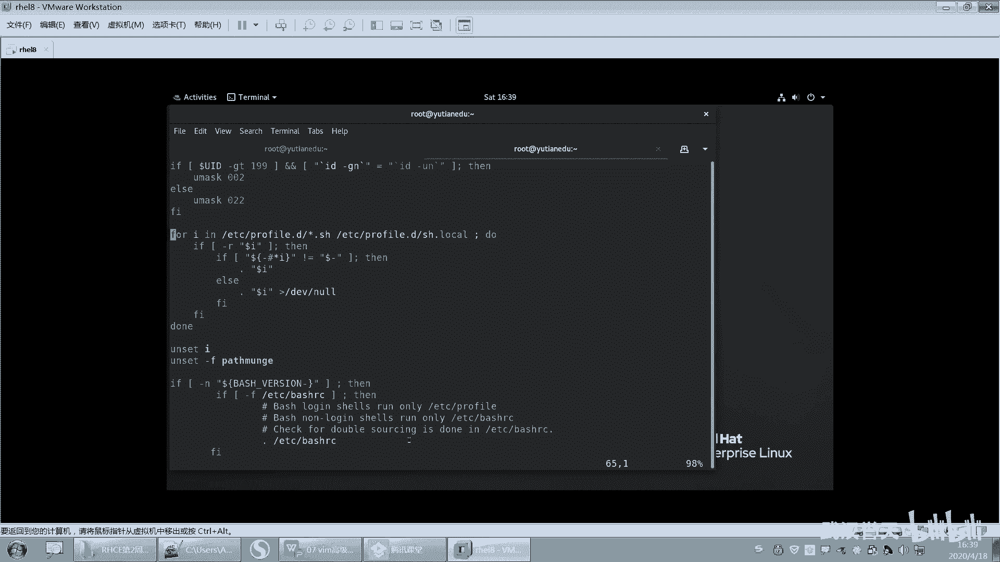
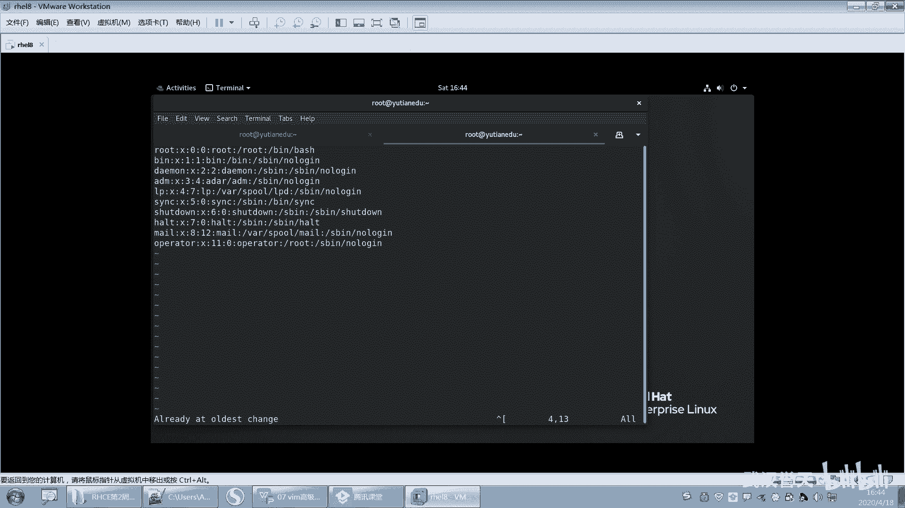
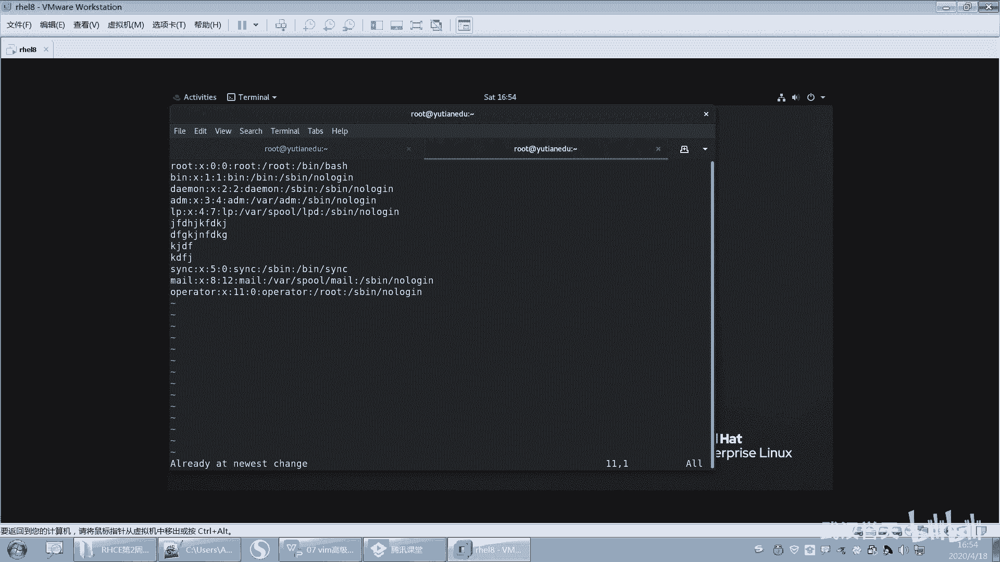

# 【已更新】最新版丨誉天红帽RHCE 8.0系列培训视频 - P28：IO重定向管道和vim的高级使用1-28 - 武汉誉天 - BV1cv411q74E

上它就可以用了啊。好，还有1个VM的这个图形版本在GVM就这个这个图形版本的话这个。这个我没装过，不过在windows里面我装过在list里面我没装过windows里面也有这个叫GVM的。

你们可以去下载去去去用一下。这个我就不得不带大家去下载了啊。windows里面也有呃，list当中也有list有这个包提供的，是吧？啊，那VM的优点是什么呢？VM优点啊，就刚开始的时候你可能用的不习惯。

对吧？但是呢你用习惯了之后，它会提高你的这个这个速度呃，简单是吧？但是我觉得它不简单是吧？呃，不简单，他他说的简单是不依赖于鼠标和图形是吧？哦，但呃，但你学会了，你就觉得它还好，它功能特别多。对。

功能特别多啊，你只能会只是会它其中的一些皮毛是吧？啊，它可用在这个各种类un里面都可以用都可以用啊。好，缺点呢就是呃刚开始你入门确实很难。因为你刚开始都不是，因为啊这个VM用起来啊，很多同学他就。

就是把那个文件不知道弄弄成什么样子了，是吧？保也保存不了啊，退也退退不出来呀啊，这最后都求救了是吧？算了，关机吧，关机重启一下，哎，文件坏了是吧？😊，啊，就就就这样子啊，然后他需要你就快速的操作啊。

快速操作。好，废话不多说，我们下面看一下啊。呃，VM的三种工作模式啊，这三种。这三种啊。嗯，我特地大家画个图啊。呃，第一种模式叫min令模式。第二种叫插入模式，第三种叫退出模式。最简单的是插入模式。

插入模式非常简单，为什么呢？因为在这在插入模式里面。没有过多的命令，就直接插入嘛，你就进去敲就行了，编辑文本对吧？这个是我们比较能理解的。好，看好啊。

现在我们我这样吧。我直接打开这个文件，好吧。好，打开这个文件啊，那我进来之后。现在能不能编辑呢？我们说不能编辑，对吧？我们是要摁一下I左下角呢。就是inser插入模式了，那我就开始输入啊。我就那输入嘛。

你你你你输入你还不会吗？这是最简单没什么窍门，对吧？就敲这叫编辑模式，这叫编辑模式啊。OK吧？好，A加ES我们就什么哦，这是我们之前学WQ就退出了。😊，啊，那冒号这是这也是另外一种模式了。好，再来啊。

你看啊我刚进来的时候，注意你看我刚进来的时候。

是不能插入。那这种模式叫什么呢？叫命令模式。😡。

这种模式叫命令模式呢叫命令模式。那在命令模式下能做什么呢？你可以去在命令模式下做，可以做很多很多的事情。比如说我可以快速去移动光标，我可以去复制粘贴剪切，对吧？都是在命令模式下做的。

比是在命令模式下做的啊。😡，好，那编辑插入模式跟命令模式对吧？那如果我想你看啊。

我摁一下I是不是变成了什么插入模式，对吧？我想回到命令模式怎么办呢？摁一下ESC就回到。😡，命令模式呢。

你看啊你从插入模式回到命令模式，你就摁一下EA键就可以回到这个命令模式了。如果你从命令模式想要进入到这个插入模式，你可以摁什么呀？可以摁呃，什么I，我们之前学的是I，对吧？但是还有很多其他的。

比如说A呀、O啊，对吧？还可以都可以摁啊。好，然后再来一种。就是退出模式。退出模式呢。你怎么进入到退出模式呢？好，这个退出模式啊，有很多地方，比如说网上它可能叫做什么EX模式，有的叫什么，反正叫很多的。

就是叫法不一样。我在这个地方我习惯性叫它退出模式，OK吧，就是我的课堂上，我给它叫退出模式啊。如果你换了别的啊，你不用管它叫什么，你就知道什么样能进入到这个模式，能做什么事情就可以了。

好，怎么进入到退出模式呢？摁一下什么冒号键那冒号键看到没有？左下角冒号键这个一闪一闪的这个地方就你在就你就在退出模式了，你可以做什么呢？你可以打保保存呢，你可以Q啊，你可以WQ啊，反正对吧？

这就是退出模式啊，退出模式也可以做很多很多事情，对，比如说我想显示行号啊，那我就怎么样就这样在退出模式下做。O吧，所以一定要了清楚三种模式啊。😡，好，那在这个模式下，我又想回到什么命令模式。

那我就摁一下ESA，你摁一下ESA就行了。😡，哎，那摁一下EAC就行了啊。啊，你就摁一下E呢，反正你你只要想回到mini模式，你就摁E就你摁一下，你感觉没感觉是吧？再摁一下都行，好吧，就回到这个。呃。

这个这个这个命令模式吧，你就可以你删除啊，对吧？然后剪切呀等等，都可以，OK吧。好，这三种模式怎么进入，没问题吧，三种模式怎么进入啊。

啊，再说一遍啊，命令模式想要进入插入模式，摁什么I呀，对吧？这些键，然后想回到命令模式，只要你想回到命令模式，来摁EA好，命令模式回到退出模式，摁冒号键。按冒号键OK吧，那退出模式能做什么？

你看它可以保存退出呃，还可以打开文件，还可以搜索替换。那在退都是在退出模式下做的。好，我们一个个来啊一个个来。呃。好。呃，这个地方我是刚开始啊，我们用VIM打开一个文件。那这个呢之前也讲过了。

我再说一遍啊。

呃，你看啊我们VIM如果你不打开文件，什么都不接。这样是不是可以打开一个VI变辑器，摁一下I就开始插入，对吧？好，你想保存ESA冒号W保存成什么文件，保存成root下面的fill点TSE。那。

你是不是可以？保存成什么名字啊，这个之前讲过了吧。那保存成什么什么名字，对吧？如果你不加绝对路径，就是保存到你当前这个路径下面的一个文件。不加路径的话啊，前面不加绝对路径。

就是这个非要点TATT就在你加目下面。好，那这样保存啦，退出啊，Q退出啊。那这样的话，fi点切IT是不是就被创建出来了呀？对不对？好。这个其实啊叫另存为，就是这个W呃fi点切7，这个叫另存为。

叫另存为嘛，就存为什么，对吧？好，然后再来啊，如果这个文件已经。呃，这个文件不存在啊，比如说我打开一个fell一这个文件不存在吧。好，怎么知道不存在呢？你只要看左下角有个new file。

就知道它是不存在的。好，摁一下I。😡，插入插入入入对吧？好，那么这个文件在你保存的那一瞬间。它就被创建出来了，看到没有？写进去了。在你保存那一瞬间就写进去了，然后你还可以怎么样退出。

这个是当后面这个文件不存在的时候。编辑它保存这个文件就创建出来了。好，当这个文件存在的时候，打开它开始编辑是吧？啊，那这就是我们之前学的WQ保存好，这是VM刚开始打开一个文件的时候要注意的地方啊。

好。然后再来我们看一下插入模式怎么进啊，我们刚刚是不是讲了个I呀，对吧？那插入模式修改文件怎么进去啊？那在命令模式下摁以下这些键就可以进入插入模式。进入插入模式啊，好NI就在光标的左边插入。

啊，其实你看啊。哎，你看我的光标是不是在这个这个地方啊？在这个D这个地方是吧，我摁一下I。😡，他就会在光标的左边，比如说摁呃输入一个A，是不是在光标的左边。输入啊。OK吧，没问题吧。😊，好，再来啊。好。

看光标啊，看我的光标，我还可以摁什么。

我还可以摁A，看到没有？摁小A呀，A是不是在光标的右边插入？

那你看啊我现在光标是不是在S上，那我摁一下小A，它就往后跳一格，你看到没有那。😡，你再来一遍啊，摁一下小A，那它就往后跳一个，然后你就在它的后面也是插入。这样子啊就小AOK吧。好，还有吗？

呃，还有这个or是吧，or是我比较常用的，我用的比较多，就是I跟or啊，这个or呢是指啊你看啊。

我现在呢不是要去我想去去下一行插入一行。那一般情况下我是这样做的，摁一下I，然后挪挪挪挪到最后，然后回车是不是这样对吧？但是没必要，就太复杂了，你的光标是不是在这一行，你摁一下小窝。😡，看到没有。

它就在下面插入一行。按一下小O在下面插入一行，你开始输入输入输入这样子。啊，这是小窝好吧。好，再来啊。好。那我摁大窝会怎么样呢？摁大窝，你看它是在光标上面一行插入一行。好。

摁一下大窝是不是在光标的上面插入一行。对吧开始开始输入就大窝啊大O。好，然后还有什么啊？呃，还有大A是吧，那大A呃在末尾插入一行是吧？好，再来还有大什么大A在行行首插入一行。

这个我其实都没有刻意去记它啊，你。就是。你看这个大A大I是吧，是不是在行首插入文本是吧？这个大A是在一行的结尾插入文本。大窝是在上一个，你记哪个呢？你就记个I跟窝就行了。

呃，至于这个在行首行尾，我一般有一时候我记不住，我就这样我摁一下end键。end键你会摁吧，home键end键你总会摁吧。那home键end键你记不住，你就home键end键嘛。

那第一行我看到同学在挪挪挪挪挪挪半天是吧？😊，那你home键按键叫N嘛，对吧？所有里面都可以N的啊。好，就就这个这个没什么好说的吧。

这个比较简单啊。好，这个是怎么进入到插入模式？咱们进入到插入模式啊，当然进入到插入模式的方法不止一种啊，不止还还不还不止还有别的还有别的啊。好，我就说这么多往下看啊。我给大家总结了好多呀。啊。

你就你这个不用记笔记了，嗯，你就看我这儿，你就看我操作就行了。我都给大家写好了啊。都给他写好了，好吧。啊，然后操作键下面啊呃进入编辑模式，这个我就就就说这么多，下面主要是min令模式啊，看好啊。

现在是在min令模式啊，怎么回到命令模式？

EC呀对吧？是是不是简单？好。嗯。这样吧，我去。嗯嗯。嗯。我挑几行啊。我放到这个文件。呃，打开pa。好，我用这个文件来做演示，好吧。

我，用这个文件来做演示，OK吧。好，然后看这儿啊呃光标移动光标啊移动光标嗯。上下左右键我就不用说了吧，上下左右键就是移动光标嘛。然后翻页我这个还不足一页呀。

那就。profill好吧。好，我来这个移啊，你让我移动光标，我上下左右键去移动，对吧？好，我想回到这个。😡，呃。我回到什么，回到最后一行，去到最后一行跟第一行哈，去到最后一行，你摁一下大G。

就最后一行了，如果你回到第一行，就GG。呃，就就就game over是吧？

就第一行就最后一行嘛，对吧？那大致看这里啊，我我先讲这里是吧？😊。

啊，那如果你想去到，比如说你想去到这个第十行怎么去，对吧？那你就是摁下十大G就去到第十行了，看见没有？哦，我怎么是主要是第十行，你可以你可以把行号打印出来，比如说s。好，你看我现在在继第十行啊啊。

第二十行20。哦，等一下啊。20大G那。你就去到20行，两个小G就第一行。两个小句第一行大G就最后一行，反正G大G嘛，就是去到某一个特定的行。

OK吧，就是这三个啊就这三个。嗯。一G就是第一行是吧啊，一G就是第一行啊，显示行号就是我先跟大家说一下吧，显示行号这样显示叫sNU。😊，呃，就是在退这是不是在退出模式下执行的。

你只要看到这个地方有个冒号。你就应该知道它是在退出模式下执行的sad NU。sadno NU就是取消行号取消行号啊，比如说有学这样。

我现在有行号了呀，我就把它怎么样复制一下，然后来复制，然后我我我复复制啊，我去到这地方，我粘贴的时候会把行号也复制下来呢。😊，会呀，看到没有？是不是也复制下来了啊，那是不是都复制下来了。

所以你要取消行号的话，你就。冒浩sno N U。这样就把行号取消了。好吧，行号取消了啊，你现在只需要看我操作，好吧，你看我怎么操作的啊。

啊，那么还有一些啊，我就跟大家简单介绍一下吧。呃，因为这种。就你看p置 up page置 down是吧，翻页嘛，上下翻页这个不用说了所有的记乎都有是吧？然后它还有一个什么cttrol F。

这个cttrol B，我从来没有记过，这个我就写在这了，你想记就记，不想记算了，好吧，不用记，不用记啊。好，然后还有一个就是。你看啊，如果你想转到杭首，哎，这个啊你看啊。

就是我现在我在这里我在这个地方啊。

我想去到杭首，就去到第一个第一个字符这个地方。那我是不是按home键？这是第一种方法，还可以摁什么呢？它还可以按零键哦，零哦，零0也可以去。好，还有一个。叫江间浩。什么叫间号呢？

就这个键就是你那个键盘上那个六上面那个数字叫间号嘛，就这个。

你摁着三个键都可以转到行首。对，都可以转到行的第一个字符。好，你记住啊，这个间号跟多了符号后面我们要学习的。所以你这个地方你呃你你就是现在记不住，后面也会记住的啊。

间号指的是这个行的第一第一个最前面多了符号是指的这行最后面。😊，结尾就是开头就是结尾，所以你摁多了符号也可以回到这个行的末尾，摁end键也可以。end键也可以啊。好，这在行一行内快速移动。OK吧。好。

你想去哪一行，其实就可以快速的去移动了啊。好，然后再来啊再来呃，这是移动光标。

下面呢我们来看一下复制。粘贴啊，就是两个一样的删。哦，看一下复制剪切和粘贴啊，这段我也总结了一些，很实用的啊，看好哦。

呃，看这儿啊。我先来演示啊。呀我不能把这个文件给删了啊。我就这个吧。好，呃，我现在想去复制呃，想去复制的话啊，我可以摁，你看啊，我想复制第一行。😊，复制第一行哦，注意是是在命令模式下摁的啊。😡。

如果你在插入模式下，你摁你你摁什么，这些都它都怎样，它就是原样输出了啊。😡，啊，第一行YY。P就复制了。你看啊我P我我这个光标呃去到最后一行，对吧？P它是不是在这个你的光标的下面插入啊，对吧？

这叫复制嘛，不是这就叫粘贴。复制怎么复制呢？再来一遍啊，我想复制两行，那就2YY2YYYY，你知道啥意思吧？就复制啊，我也不知道啥意思。OK然后P你看就复制两行，看到没有？😊。

OK吧你去到你看你还可以复制多次，比如在这个上面再来P那就复制多次，这个叫YY呃，NYY就复制N行，好吧，NYY就复制N行啊。好，这个是YY啊复制。😊，好，还有一个叫滴滴。叫滴滴啊。

那滴滴呢你看啊滴滴唉删了，第一行删掉了，对吧？啊，滴滴呢它其实只指剪切的意思。剪切啊，比如说。好，我剪切了，我是不是要粘贴呀，粘贴嘛，那P。😡，是不是粘贴了？对吧。啊，那如果你一直滴滴不粘贴。

那就是删除了。那或者是你你看啊2呃2滴滴就删除两行。呃，2DD就删除两行这样子啊，就是NDD删除两行。O吧NDD就删除两行啊。好，这个是删除这个是删除啊。啊，还有什么？还有比如说还有CC我们YY了是吧？

YY复制DB剪切P。呃，粘贴还有CC你看啊CC是干什么的？😊，你看这一行，我在这一行哦CC。😊，那这一行就被删了，而且怎么样变成插入模式了。看到了吗？那CC嘛CC其实叫替替换，把这行给替换了。

把这行给替换掉了啊，走走走走。😊，就可以输入了，对不对？好，这是CC啊CC。

好，OK吧，这几个讲完了吧。😊，好，还有这两个啊这个呃。😊，这两个你自己去测一下吧，这个它是什么呃，第一加间号就是删除光标之前所有的字符。D多了就删除光标之后所有的字符。呃。

DW是删除当前光标处的到词尾的时候字符是吧？这好多呀，我就演示一个啊，看好啊。

比如说啊你看啊第一。间号就是你光标前面的是不是都删掉。好，再来啊第一多了符号，因为多了符号是不是指最后对吧？好，那你摁多了符号，就你看当前光标后面是不是都删掉了？😊，那这就D嘛。D的意思啊。好。

还有一个删除这个删除叫什么？叫X。比如说我只想删除一个字符，那你看。😡，XXXXX那。X啊就是X嘛。X它可以删除一个字符。OK吧，你看XXXX对吧？就这样啊。

你可以摁多次可以摁多次啊。好，但是这唯一就是有一个这个CC啊，这个CC的话，你其他的你删的话，你摁dell也可以，对dell也是删除dell也是删除光标处的单个字符啊。CC如果你删了。

它会进入什么替换该行并什么？呃，还有病。进入插入模式啊。哦，我觉得这种是比较实用的这些像滴滴啊、X啊经常用。哦，DDX这种经常用啊。像这种山什么磁尾磁头词尾的这种，我一般就用X摁多下了，就是也懒得记。

这个你看自己好吧。好了呃，复制是不是也讲过了？😊，啊，当然有了，不慌啊。这个欢喜同学把备注改一下啊。好，再来一个啊，教你一个绝招啊，你看这个你你可能在其他地方看不到啊。

好呃，看好啊，我现在呢。呃。你看啊。我现在是12456开90是吧？我想把这个第四行和第五行。然后复制到第十行的下面，就或者复制到第九行的下面是吧？啊，其实你用2BD也可以实现。

不过我们用另外一种方法来实现啊，看好哦。冒号。好，第几行啊，第四行还有第几行啊，到第五行4逗号5对吧？啊，然后你是不是要复制呀，那就copy喽。好，复制到哪一行下面呢？比如说复制到第九行下面。

那么就敲个9回车。看到了吗？那。嗯。这行跟这行呢。是不是我复制的这两行？然后复制到第九行下面。对吧？好，这个是复制啊，记好哟，你说绝招啊，我特意给大家总结了，这之前都没讲过的啊。😊，好，再来。😊。

既然可以复制，还可以移动。来把第四行跟第六行移动到第九行下面。好，怎么移呢？看好啊，冒号注意哦，它是在什么，是不是在退出模式下。退出模式下啊，然后第四行到第六行4。逗号6。对吧你连续的好是逗号6嘛。

移动叫什么啊，什么MV啊，第九行哦，下面回车。😡，等一下啊。哦，叫M是吧？他没有MV，就是。4逗号6M第九行回去了那。是不是移过去了？就移到下面去了嘛。再来啊。冒号4对吧？第四行吧。

你也可以这样指移第四行嘛，就4。M9。你看是不是移到这里来了？其他就往上挪了嘛，那这样移动嘛。😡，这是不是这样移动啊？会了吗？嗯，连续的好行就是四逗号几几到第几行下面就99就移到第九行下面。

就这两个呢。嗯，一个是复制，一个是移动啊，复制跟移动啊。这个还是比较实用的唉，这个复制跟这个移动是吧？呃，然后粘贴嘛，粘贴这个。嗯。这个粘贴的话，我看一下啊，粘接光标注之前好，这个是一个小P。

一个大P啊，就是我们刚刚是学的小P是吧？这个是大P，唉，这个是大P啊。这看不出来是吧，就小皮大批的。那我标注一下吧，就大写啊。

大写皮啊好，你看啊我复制的话，比如说。我YY是吧，我复制，你看我的光标，我复制的第七行吧，YY嘛啊，然后我我想移动到这个第十行，我想插入到它下面我是不是摁小P啊，我想插入到这行的上面，我是不是摁大P那。

就小P大P嘛，小P就是在光标的下面一行呃，大P就是在光标的下面呃，大P就是光光标的上面，对吧？或者是前面后面等等啊。

嗯。好，就是复制会了吗？致啊。好，这个我们目前为止啊呃你发现呃这滴滴啊YY啊、CC啊这些是吧，是不是都是对行进行操作呀？是不对行进行操作。所以目前为止我们这个地方只是对行进行操作啊。

但是说老师我想对字符串进行操作，对某一个特定的块进行操作怎么办？是吧？后面教大家啊。好，你先把这个学会了啊。好，复制剪切粘贴没问题吧。好，再来啊。啊，下面呢我们来在命令模式下啊进行一个查找文件查找啊。

呃，这有两个两种查找方式，这个查找就比较简单了。这个你之前man会这里也会啊啊，在左下角输入一个斜杠，看到没有？左下角输入一个斜杠啊，就是你目前要操作了是吧？你你怎么办呢？因为有些时候有同学这样。

它这地方是这样子的，是吧？反正下面有的什么样的都有怎么办？你使劲摁ESC就行了，你多摁几次，然后再开始怎么样。

输入斜杠，然后查找user回车。没有是吧，查找并回车呢就查出来了。这是查找啊。好，然后你可以摁小N在这个光标向下进行移动，看见没有？那个那这个关键词是不是开始移动啊？好。

N大N是不是在关键词之间向上移动啊，对吧？这个之前就说过了啊，就就不多说了啊，好吧。

啊，这个是。呃，文查找这个关键词啊，查找关键词。哦呃，刚刚同学说问了有没有撤销啊，有啊，在这里啊，对吧？好，在这个地方啊。

好嘞，你看我刚刚每次操作的时候都都摁一下撤销。好，你看这个地方啊，这个B是不是被标高亮了，这是我刚刚查找关键词是吧？好说老师说我想退出啊，我想退出之后这个。😊，这个是不是就没有了呀？啊，你错了是吧？

还还有对，而且特别是当你不小心摁了一个A呀，对吧？全屏都是A，然后你退出之后再进来又是A。而且你打开别的文件，我看是不是啊。你打开别的文件。好现在全是AU，你看这个A全被搞亮了是吧？所以你就很头痛啊。

怎么办呢？好，打开它。好，去掉光标。呃，没有别的什么方法啊，就是摁下斜杠嘟嘟哒随便找一个不存在的，ok就去掉光标了，就这样子啊，就这么简单。😊，OK吧，就会了吗？就是输一个斜杠，随便输入一个不存在的。

找不到这个字符算字符出来，它就自动光标，这个就被取消了。嗯，因为我我没找到别的可以取消光标的这个的可能有可能是我没没没没有用过啊。😊，🤧好吧。好，那么有同学说了撤销怎么撤销？你看我滴滴这一行删掉了。

对吧？我想撤销怎么办呢？很简单，摁U，你看我每次都摁U。

摁一下小U。摁一下小U就可以撤销啊，比如说你呃比如说啊滴滴滴滴滴滴滴太多了是吧，你就一直摁UUUUUUU就这样撤销。

一直按嘛，摁呦呦呦呦呦是吧？这样就撤销了啊。好。你看啊。我现在呢。我插入一行，对吧？好。然后呢，我现在插入完之后啊，我后悔了，我说不应该插入算了U。😡，是不是就取消了，对吧？好，你取消了之后呢。

你发现哇我怎么能取消呢？对吧？我这完了，刚刚写的是对的是吧，怎么办？怎么恢复呀？😡，能不能恢复啊，对，怎么恢复呀？可以恢复啊，ctrl加R回来了。😊，看到没有？对吧本来写的。这个这个这个的写对了是吧。

然后以为写错了，好，撤销了一撤销。😊，叫再按一个cttrorl加R，就是取消撤销会了吗？

那。就这个叫cttrol件取消撤销。但是只能取消一次哦，只能取消一次吧。

好，你看我再来啊。嗯。滴滴。滴滴是吧？好，然后你你滴滴这个这个这个要取消是吧？U与U好，取消两次。那ctrol加Rctrol加R哎呀，它可以取消两次，它可以什么撤销两次唉。

就是说这个地方。就这个地方啊，它撤不撤销嘛，撤销完之后就就这个键，就这个呢。😡，这个这个这个说白你就不点这个键是吧，这是不是撤销啊，这不是要取消撤销啊？没问题吧。啊，就是U跟cttrol加R啊。

U跟ctrol加R好吧。嗯，好，还有一个大U啊，就是你想撤销的时候，比如说啊。

你看啊我在这一行我是不是删了呀？😡，对吧我又取到这行把删了。看到没有？那我只想撤销这一行的是吧，或者只想撤销这一行的，你可以摁一下是吧？😡，你可以摁一下这个。大优。也还不行。他只能这样哦。

就撤撤销这一行的，就是你的光标处这一行的光标处这一行的啊。

就大有，你就是你能撤销光标处所在的行。那别的行可能就撤别不了，只能撤掉你光标所在行啊。还有个点是吧？点的话，你看比如说啊。

你要我摁滴滴是吧，我就一直摁滴滴滴滴滴滴，但是我不想摁滴滴了，我摁一点。😡，它也可以滴滴下去，它可以重复你是吧？上一次的操作唉，就点点嘛，我本来摁DD对吧？摁摁累了算了。我就滴了几次之后，不想滴了。

我就摁点，然后呦呦呦呦U哎。Yeah yeah， oh sorryorry。我在这儿摁去啊，我在这儿。😊，呦呦呦呦呦就回来了。OK吧。好，大U这一行你看啊，我删了之后，如果你U一次是不是也恢复一个是吧？

那大U就把这一行都恢复了。啊，就是就这个意思。

啊，这个听懂了吗？这个听懂了没有啊？这个撤销的。这个没问题吧，这个跟这个是对的是吧？啊，这两个就是他们之间就是。是撤销跟取消撤销。那这个U呢就是你光标处当前这一行，如果有多个。

需要撤销的那你摁一次大U这一行都可以撤销了啊，都可以撤销都可以撤销啊。呃。人呢没有在记笔记吧，现在我没没让他记笔记啊。嗯嗯。这都是精华呀，我都给大家什么都给大家这个这个找了一些比较实用的。😡，我多累呀。

我写这个PPT啊。哦。嗯。再讲一个啊。下面还有我哎下面还有还有一些呀，这个到明天讲。嗯，我现在给大家总结了有一些比较常用的一些快捷键。啊，还有保存的啊保存的。呃，其实只要你word里面有。

基本上这个VM基本上都有基本上都有啊。

好，保存呃，来看一下啊，我们之前学保存的时候，其实学过了，比如说。呃，W是保存Q退出是吧？好，我们再来选一个啊。看我现在我。把这行给把这个不是编辑了嘛，对吧？把这个编辑了。然后编辑之后呢。

我又想保留原文件，我又想把我的文件保存成另外一个文件，就叫另存为吧，就叫用过吗？是不是另存为，我把这个文件修改了是吧？我想把另存成为另外一个文件，那原文件是不是还会保存原文件还会保持原样不动是吧？

好。那我就可以这样叫ESA冒号保存嘛，是不是叫W啊？这个叫另存为。哦，t下面的什么？呃，password呀。哎。哦，文件已经存在了是吧？好，然后再来呃，t下面的pass word点BIK啊。呃。

点BIK啊，就叫另存为，就是修改什么修就存储另外一个文件啊，W啊W前面叫W回车OK那。你看你是不是就变成这个文件了？就变成这个文件了是吧？好，那这个文件就可以退出了，然后打开att下面的。嗯。

他是我点 BK。好，你看这就是我刚刚保存那个文件，要另存为嘛。叫另存为啊。好，再来啊。再来我可以保存的时候，我可以选择性的去保存。😡。

什么叫选择性的保存呢？我可以怎么样？我可以写MNW到文件名，也就是把这个当选的M到N行保存到文件里面，呃，其他的不保存。

就这样。好，比如说这两行啊，我现的NU看一下啊。呃，我想保存第九行第十行对吧？那我就冒号。9逗号10W，然后temp下面的呃password点BKE1是吧？你看。回撤啊，这样就保存了。

就保存哪一个特定的行。

🤧OK吧。好，这是保存，其他的就讲过了，其他就不说了啊，这个是退出嘛，退出强制退出保存退出，强制保存退出，对吧？嗯。OK吧。好。呃，还有后面还有啊，比如查找替换呢。嗯，还有这个可视化。

这个可视化我觉得很非常有用，就可视化必须要回。呃，然后我给大家总结这个多方就是一些例子，还有多窗口模式，这个比较明天再讲吧，剩下内容现在5点钟话差不多。嗯。我所有的PP都会发给大家啊。

大家不用紧不用那个呃。好吧，今天就不讲了吧，今天要讲。大家听的听的累了是吧？嗯。好，这基本上够大家用了啊。因为你平时操作的话，我都是看我都是挑一些比较常用的快捷键。

然后放在这个里面给大家做为一些案例进行分享。嗯，你以后就把这里面会用就行了。别的你如果想扩展扩展的话，你再去扩展，你再去扩展一些其他的。好吧，那今天到5点钟了呃。今天我们就讲到这儿吧。

明天的话我们讲什么呢？看一下啊。我们也把VI讲完之后，呃，我再预告一下明天的内容啊。看好啊。呃，明天我们会讲VI的剩下内容，讲完。然后第呃这个这个这个对下集预告啊，第八章文本处理工具。我跟你说。

这张老厉害了啊。这个我给大家总结了很多，就是文本处理的工具啊，比如说。呃，这些对吧？这些其实跟以前一样，但是我给大家扩展了一些这个关于gra跟SED的内容。比如说啊。嗯，政则表示。我也会他讲。

对这个怎么用这些啊。这个你明天小本本要拿出来记啊。啊，这真的表示怎么用。然后我举了一些案例。然后还有这个呃还有。哎，这个SED怎么用？这个啊哎给大家举了很多这这样的例子。然后呢，这都有我给大家一个解释。

一个去做。OK吧，这是明天啊那。这有很多例子。看到没有？都很实用的啊。好。然后这个讲完之后呢。呃，还有这个hear，我们开始讲shar了啊。share的话也比较重要。这个。呃，这是明天的内容啊。

明天内容如果讲的快的话，我们再讲一章，讲的慢的话，我们就是就是讲然把它搞定它。然后这个工具的话，我也给大嗯写了一些作业，到时候大家回去练就行了。好吧，这是明年内容。OK今天大家呃其实啊是这样的。

我再给大家再多说几句话啊，再多说几句。😊，嗯。呃，有很多的就是学习方法的问题啊，其实你在我上课的时候。你就如果你认真听了。有一些知识点，其实你是可以记住的，而且可以消化的，能理解吗？但是如果说你指望。

哎呀，上课我就这样随便听一听，然后我下课再去补视频。我相信有一半的同学他至少他都是没有时间的，没有时间把这个视频从头到尾再看一遍。呃，我相信是很多同学没有，因为他觉得我可以下去看。

但是他往往就被其他事情给耽误了，或者是真的没有时间去看。因为看视频很浪费时间。你这两天在这学习，为什么？第一可以帮你去理解这个知识点。第二，有一部分知识点，其实你可以完全在课堂上就消化，而且去记住了。

笔记记下来就记住了，就就这么简单。😡，而且有一些难的，比如说这个有点复杂，对吧？那我可以下课再去针对这个地方，然后再去学习一下。😡，呃，再去看一下相关的这个视频，然后讲哪个地方讲到，我再去看一下。

这样的话再巩固一下，你不可能说我再下去把所有的视频从头到尾再学习一遍。那你要这两天干嘛呢？你这两天来学习是干嘛？那你下去我给你视频去看视频好了呀。能不能理解？而且你看视频还容易是吗？还容易睡着。😡，对。

所以我就希望大家能在上课的时候去把这个时间把握好啊，能够把我上课能够课堂就记下来的理解的就在课堂记下课理解理解了，下课再补一些那些可能比较难有点难理解的，比较绕的对吧？我再下课去补。

这样的话效率就高一些，一定要这啊，因为你觉对没有时间去就去看视频啊，很很很很难抽出来，当然呃有同学他也是下课把视频就补一遍。我觉得那种也非常好，因为他有时间对，他有时间去做这个事情，那你没时间的。

你就只能把这两段时间是不是把握好，对吧？真正来上课，那怎么办呢？对吧？你上课又不好好听，然后你下课又没时间去做。那你说你怎么跟得上。啊，我上说话有点难听啊，但是这个是这是这么个道理。🤧嗯。

我有时说话比较直接，呃，大家也也慢慢习惯就就好了。你们习惯一下啊。😊，嗯。H。

这老师还让学生习惯老师的是吧？😊。