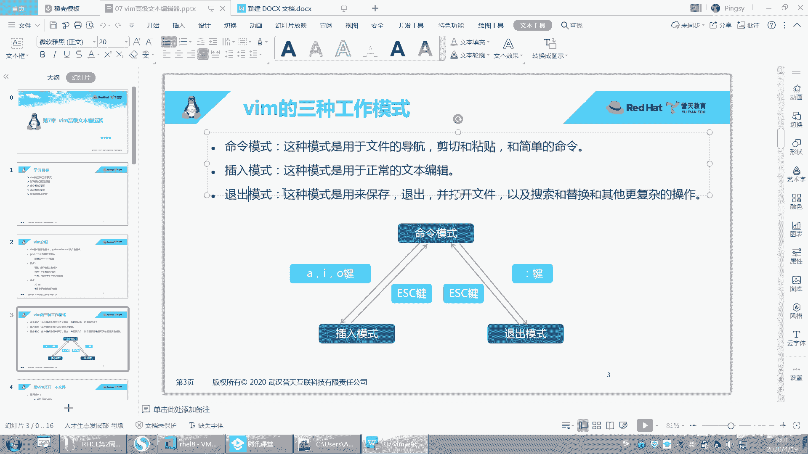
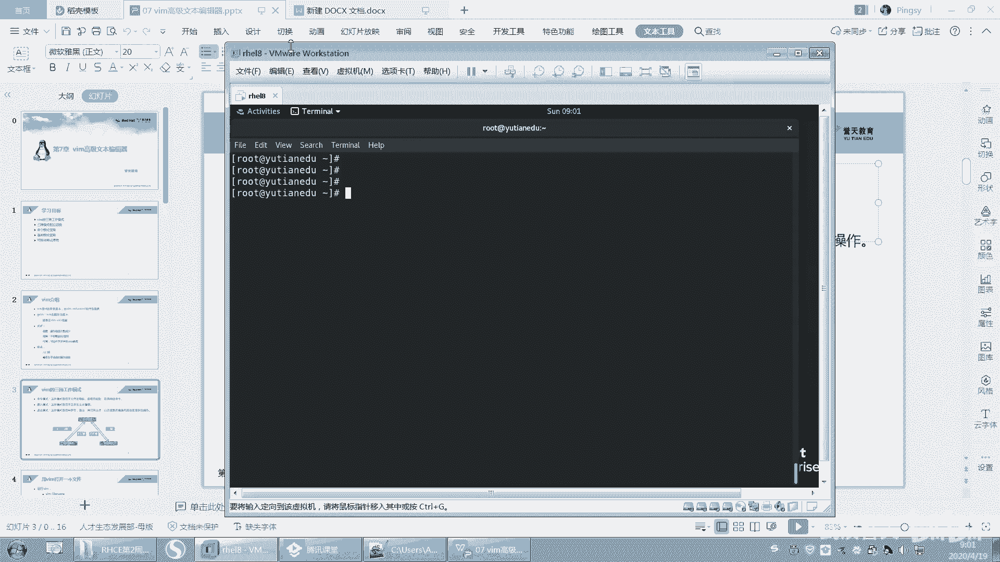
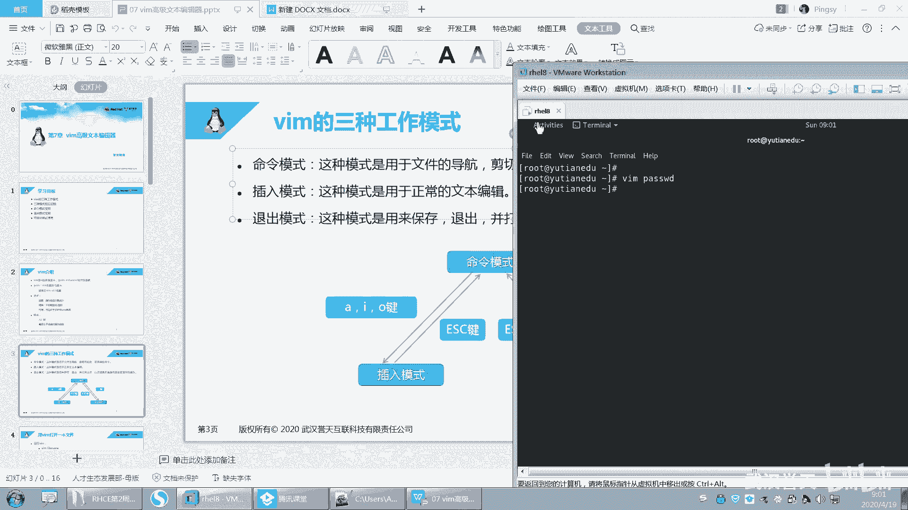
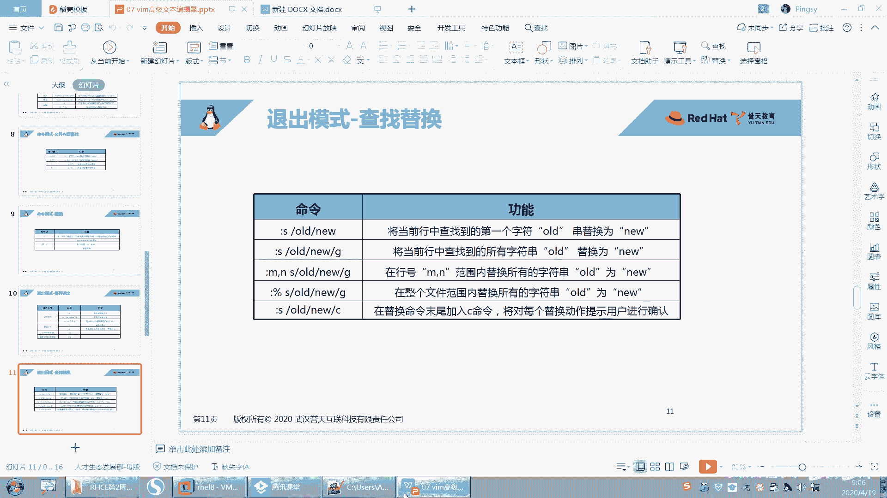
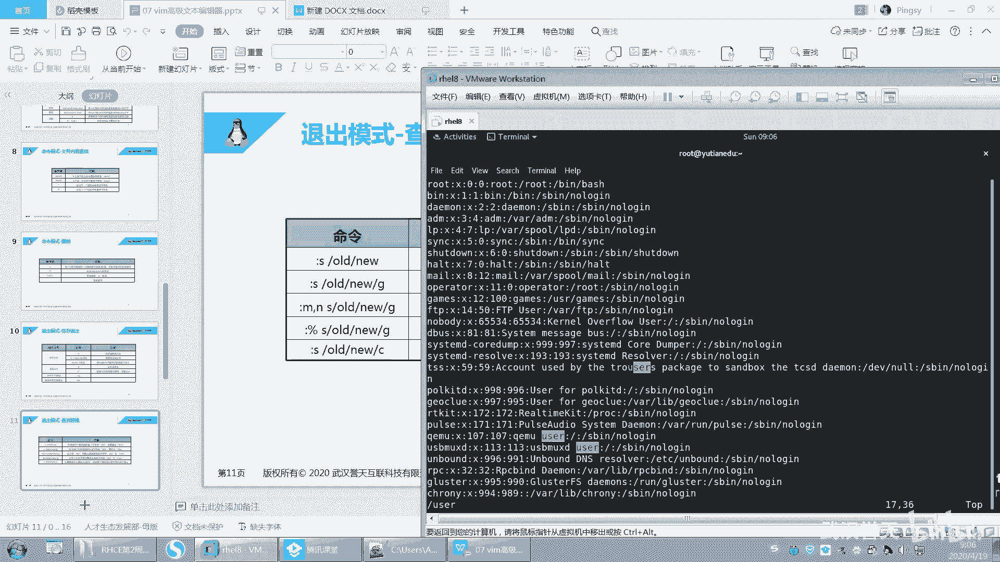
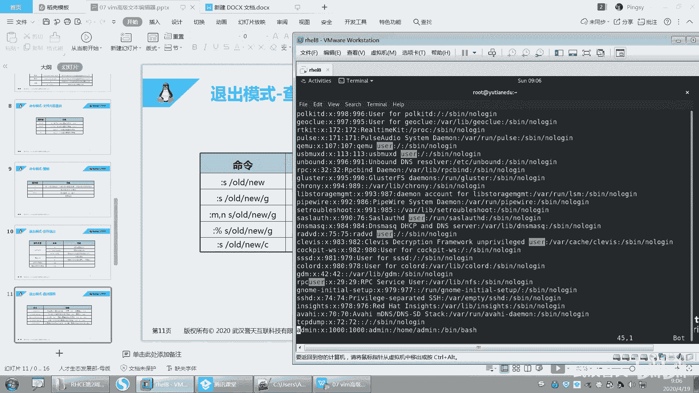
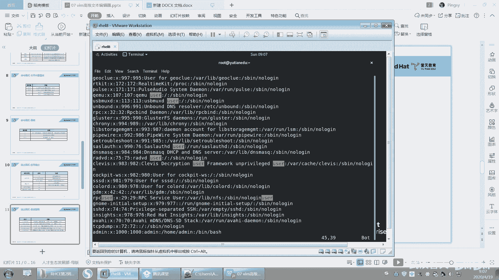
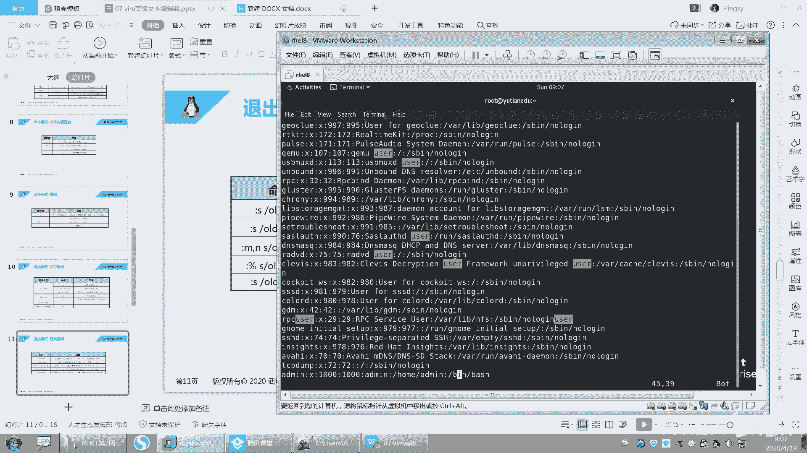
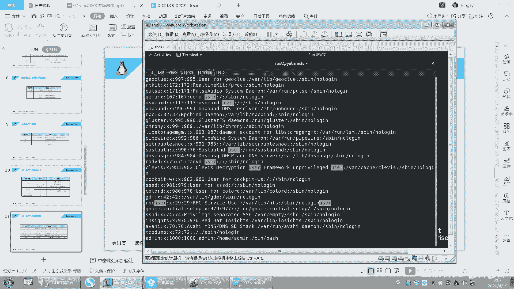

# 【已更新】最新版丨誉天红帽RHCE 8.0系列培训视频 - P29：vim的高级使用2-29 - 武汉誉天 - BV1cv411q74E

呃，我们昨天把这个VI讲了一部分是吧？我们接着昨天这个VIVM的这个继续讲啊。嗯。回顾一下啊，我们昨天其实有同学感觉这个VI这个呃有点复杂是吧？其实还好。

只要你把这几个呃工作模式在哪个工作模式下能做什么，呃，了解清楚就可以了。然后剩下就是你用你就去呃多敲几遍多用，这样就慢慢就记住了。呃，不行，你就再过来查一下，看一下这个上面有哪些可以帮助你快速操作的啊。

好。VM的三种工作模式呢，包括命令模式插入模式，还有这个退出模式。命令模式下我们。

怎么去进入到mini模式，对吧？其实我们直接比如说啊。

哎哎哎。😔，我们直接打开这个文件，那么这个文件我们我们当前这个模式就在命令模式下啊，反正你不管在哪种模式下，你只要摁了什么EC就能回到命令模式啊，回到命令模式。在命令模式下呢，我们可以用于文件的导航啊。

比如说你可以快速移动光标剪切粘贴，还可以执行一些简单的这个呃简短的命令。

啊，还有这个插入模式，对吧？这种模式呢就是正常编辑，这种其实没什么好说的。你只要能进入到插入模式，你就正常去插入文本就可以了。然后最后一种就是退出模式，退出模式呢是用来保存文件的啊。

保存文件退出打开呃或者打开其他的文件，对吧？好，这个还没讲完啊，还有及以及我们的搜索替换，以及更多复杂的操作。在推出模式下都可以去做啊。我们昨天仅仅是把这个命令模式其实讲了一下，对吧？啊。

正在讲这个推出模式啊。2。呃，min令模式跟插入模式之间，它们之间可以用AIO是吧？大A大I大O对吧？然后EC回到命令模式，ESC回到命令模式，只要按冒号键，你就会在退出模式下。那退出模式下能做什么。

你就可以按冒号键就可以了啊。好。然后前面的话我们就不仔细说了啊，就过一遍吧。VM打开文件啊。嗯，特别是当当如果啊你这个文件你不想保存的话，你就不要摁W，因为W的话它就会保存下来。好。呃。

然后插入模式怎么进，对吧？呃，移动光标怎么去移动，你记几个重要的，我用的比较多，就这个。啊，然后home键end键对吧？配件，pa down配置 down翻页啊等等，这样子用的比较多。还有这个显示行号。

其实这个显示行号这里应该是在退出模式下做的对吧？那退出模式下做的啊，但是为了让你去看到第几行，所以我把它放在这个地方了，你可以用这个来看一下。然后命令模式下的复制剪切粘贴啊，DDYYCC对吧？

然后D只要你看到D，它就是剪切的意思啊。好，YY的复制对吧？啊，这种是以行为单位进行操作的啊，以行为单位X呢它是以字符为单位，就是删除一个字符。当前光标处的字符复制。从哪一行到哪一行复制到哪一行去。

对吧？移动。还有粘贴P小P呃大P啊。啊，然后在mini模式下还可以进行搜索关键词。这个类似于就man帮助里面，你去搜索是一样的啊，可以输入斜杠。这个问号呢是指。呃，跟它相反，就因为呃这个斜注入斜杠对吧？

你这个word这个关键词，你摁N呢小N大N是不是上下这样移动啊？那如果你说的是问号，也可以去加一个关键词啊。那么这个时候你摁小N，它就是向上搜索了，就反过来了，N大N就是向下搜索了。啊。

其实你就记这一个就可以了，嗯，没必要再去记这个啊，你就知道这个有就行了啊。好。然后再呢就是撤销呃，如果做错了，对吧？你就撤销U撤销一次啊，摁多次U就撤销多次。但是请注意这个U一定是在命令模式下。

就是你无论是按这些字母啊，还是那按这些，是不是都在命令模式下，对吧？你不可能在插入模式下吧，对吧？啊，NU那么然后大U如果你在某一行操作多次，对吧？你想一次性恢复，那么就大U撤销光标所在行的更改啊大U。

好，然后cttrorl加R呢就是取消撤销，其实就是左上角这个word这个PPP呃PPT这个左上角这个撤销和反撤销，取消撤销这两个键啊。ctrol加R就取消最后一次撤销，对吧？点呢就重复你上面的操作。嗯。

你比如说你滴滴一直摁，那你就可以摁点点点点，它就重复你之前的操作。好，这个你不用记了啊，这个点不用管它。好，这是撤销啊，然后保存保存我们可以呃，我们学过了WQQ感叹号，WQWQ感叹号，对吧？

这种是我们之前学过的，然后我们昨天又学了两个新的，就是它可以另存为就是我不想修改当前文件，我想把另存为另成另外一个文件，那么就可以怎么样W加文件名。然后后面下面呢就是。某一行到某一行啊另存为成一个文件。

好，某一行到某一行啊。啊，这是保存保存了，现在已经在退出模式了啊，只要你看到冒号，你就是在退出模式下。好，然后再来啊，我们今天呃继续昨天的昨天讲到这儿了，是吧？😊，呃，在退出模式下。

我们还可以进行查找替换。好，我们来试一下啊。

嗯，现在呢我们打开这个文件啊，比如说我是搜索一个user。我搜索了一个U则，看到没有？这个是我在命令模式下搜索的啊搜索的那我现在干什么呢？我要在退出模式下，把它给替换一下。😡。

看好啊，在退出模式下把它替换一下啊。嗯。

这个。我看看啊。我再加一个吧，好吧，我再加一个啊。嗯。我在后面再加一个。U侧。然后。嗯。Useer。对吧啊，你只要加上它就会被高亮了啊，这是我搜索关键词。

好，然后现在ES回到命令模式了啊，现在我要干什么呢？我要把这个U则替换成替换成另外一个啊。

呃，然后在退出模式下做啊，然后输入冒号，左下角就会有个冒号，对吧？S。

