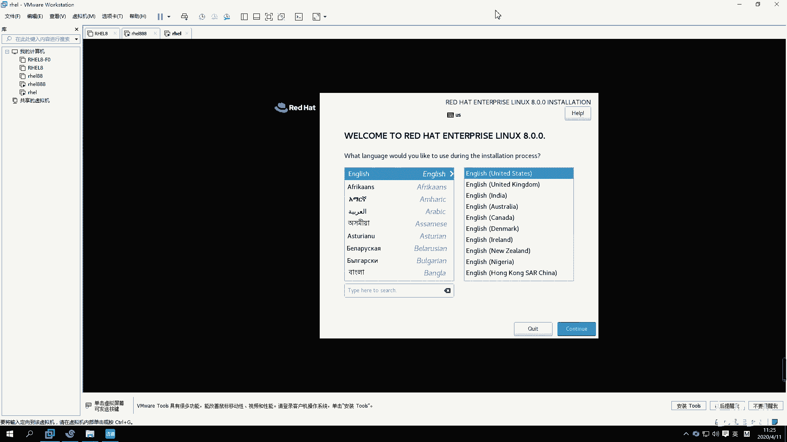

# 【已更新】最新版丨誉天红帽RHCE 8.0系列培训视频 - P2：rhel8.0系统安装-02 - 武汉誉天 - BV1cv411q74E

和之间就会共享缓存。共享缓存啊就区别就是这个其他的就还好啊，这就是CPU跟核之间的关系啊。这个大家要去了解一下啊，这个嗯CPU的构造。啊，那么现后来又出现个线程，对吧？又出现线程，那么有了核之后。

有了核之后啊，又有线程。那么和呢注意啊，和在同一时间确实只能计算一个任务。但是我们CPU有什么有一些分片原理。他就可以去把就单位时间，它把它切分，把时间进行切分，这个说又说多了啊。

它就可以去模拟模拟什么模拟线程，就是其实就是同可以看作这个单位时间内可以做两个事情。对，两件事情。当然这个线程不是真正的和啊，县程不是真正的和。所以它就根据什么线程最终大家可以去搜索一下啊。

嗯线程最终就是它其实是这样子的。嗯，我画一下这个图啊。哎哎哎。啊，这是1个CPU嘛，对吧？然后下面不是有盒吗，对不对？然后河是不是又分县城啊？对不对？我们核跟CPU之间是不是共享缓存啊？

那么核这个核其实这个线程是虚拟的，虚拟的啊，这个线程是虚拟出来的。啊，所以呢呃我们根据线程，那一个核可能会有两个线程呢，对吧？那这样的话呃，你看我这样一分呃，这一个CPU最后可以模拟几个VCPU啊。

那么就可以模拟是么？4个VCPU这样子啊，好，就是4个VCPU好吧。

哦，OK那这个地方就不能超过，就比如说就不能超过4。当然这个要根据你的物理机实际情况啊。好，再往下啊再往下选择内存，内存的话，你这个虚拟机啊呃如果就是一个单单的就一个虚拟机的话，你给2G就够了。

其实1个G。好像也可以运行是吧，你就给两个G吧，给两个G啊呃，当然你给它什么32个G，他也不一不一定能用到那么多啊，你可以就默认就行了啊。好，然后再往下面这个是选择网络啊，这个网络的话。

你就默认随便选一个就行了。现在呢暂时用不到什么，用不到这个网络啊，用不到网络。到时候我们学网络的时候，你再去选。再去选啊，就你选一个，比如说你不选的话，它将来就没有，相当于是不是选那个网卡。

它就没有网卡啊。那你就默认随便里面选一个就行了。我大概介绍一下这三个是什么区别啊。嗯，第一个呢是桥接模式，就是你选择第一个跟第二个的话，它就可以上网。啊，第一个跟第二个这两个虚拟机都是可以上网的。

如果你选第三个虚拟机就不能上网，就虚拟机不能连外网。嗯，不能连外网啊，就是不能上百度这样的。当然你选第一个你的物理技能上网，它也能它也可以上网。选第二个物理技能上网，它也可以上网，是这个意思啊。好。

这个不做过不做过多解释啊。这个后面我们学网络的时候，我再来讲这三个模式之间的区别。好，我们就选紧主机了，好不好？就选紧主机啊，你随便选，你你默认也行，好吧，就这样啊。好，下一步啊下一步。呃。

这个是我们这个磁盘的控制器的类型，磁盘控制器的类型。这个控制器类型呢，你就推荐就行了啊，就磁盘。嗯，控制器类型啊，推荐就可以了啊。好，下面呢是选磁盘的类型。呃，选磁盘的类型啊。

就是如果你是呃比如说你是15版本的win末15版本的就会新出现一个叫NVME的。呃，如果你是十0呃，就是1214版本的，它只有上面这三个，没有下面这一个。呃，这个呢你像这种IDE磁盘。

就是比较古老的那种磁盘类型。嗯。现在一般很少去用啊，性统会差一些是吧？还有现在比较常用，就是scars盘sta盘啊这种类型的磁盘用的比较多，你可以选这个也可以。

还有这个叫NVME的NVME是模拟的那个SSD模拟那个SSD啊，所以你推荐也行，好吧，你选scars盘也行，我们以前我们以前都是选scars盘的。嗯，你选s我们先选scars吧，好不好？

先选scars啊。呃，当然这个可能会性能好一点，但是随便没关系啊，随便选哪个默认推荐都推荐，或者你选这个这两个都行，好不好？好，然后下一步啊下一步。好，这个地方呢选择是不是要添加磁盘了呀，对吧？

那磁盘类型都选好了。那我们开始你是创建虚拟的虚拟磁盘呢？啊，还是使用现有的虚拟磁盘呢？哦，还是使用物理磁盘呢，对吧？啊，你看啊我们每次你像这种，你把你的虚拟机打开啊，把这个地方，你这这这是我之前装好的。

你装好之后，他们这个有一些文件，有一个以VMDK结尾的文件。这些文件就是磁盘文件，看到没有？就VMDK结尾的，为什么会有这么多，他把这个把这个一个就分成多个文件分别存了啊？看到没有？啊。

像这种文件就是磁盘文件，对不对？那么这个磁盘文件它也可以给别人用，就是你你这个磁盘对吧？呃，你可以给另外一台虚拟机来来去使用。那如果你想去用已经存在的虚拟磁盘，那就选这个，看到没有？那选第二个。

你去找到你的磁盘，那可以这样去选。啊，那你现在没有已经安装好的是吧？你或者你不需要用之前已经存在的，你需要创建一个新的虚拟磁盘，就选第一个选第一个啊。啊，第三个呢是使用你的物理磁盘。

当然使用物理磁盘的话，它性能要比上面这两个都要好一些。呃，但是我们只是做一下实验，对吧？就是没必要选物理磁盘了啊，你就选第一个就可以了，选创建新的虚拟磁盘，这是它三个的作用啊。好，呃，那下一步啊。

然后磁盘的大小。磁盘的大小啊磁盘大小呢这个地方是20G对吧？默认20G20G的话，如果你不做什么的话，20G也够了。嗯，这个上面你不存一些大的文件或者不做什么事情的话，20G也够了啊。

所以我们这个地方就默认选20G就默认就可以了啊。好，那么这个选了20G，是不是我的磁盘上就会少20G的空间呢？不是这样的啊，就是你的磁盘，你看我这个磁盘。嗯，我这个。这个还有挺多的是吧？

那我呃我选了20G，它是按需分配的啊，就是说你选20G它能用多少呢？一般装好这个系统之后，大概用个像红宝八要估计要用的更多一些，六七个G啊，七八个G啊，对吧？以前都是3到5个G啊这样子。

所以20G也够了。啊，那你用实G它就给他就给实际的空间，用20G就给最多是给20G空间啊。好，如果你想把这20G立即分配的话，那么就把这个勾勾上啊。立即分配所有的磁盘空间。那么你勾一勾上。

你的这个上面就会立即少什么，立即少20G的空间啊，那这个勾与不勾有什么区别呢？勾上的话，它性能会好一些，就是你的这个虚拟机的数据在磁盘当中，它是一块连续的区域。啊，就是在磁这个要跟磁盘原理有关了啊。

不勾的话就是用着用就分用就分。但磁盘数据可能比较分散，分散的话它性能就会差一些。这个我们将来会讲这个磁盘原理啊。呃，讲磁盘原理，所以就是就是你就讲有空间多的话，你就勾，不多的话。

你就这样直接不用勾就行了啊。好，这个是将你的磁盘存储成一个文件还是多个文件，这个你嗯默认就行了。这个你有强迫症，你就选一个对，就多个是吧？嗯，但是他说你看如果你拆分成多个文件。

你就像这种它是拆分成多个文件了，那它性能就会差一些，性能就会差一些。嗯。对吧。啊，然后你选一个也行，好不好？但是这个地方你如果太大了的话，你选一个的话，它可能不允许它就要拆分就要拆分啊。好。

然后下一步下一步啊。下一步呢是这个呃磁盘，最终磁盘名字叫什么？叫HELVMDK是吧？好，下一步完成。到目前为止，我们把硬件已经准备好了，还没有装系统。对，硬件已经准备好了啊啊。

就是HEL你看是不是具备了内存处理器。硬盘对吧？这都有了啊。网卡也有了。好，那么有了之后呢，我们开始连我们的ISO连我们的光盘那连我们的光盘啊。

呃，那我们不是用什么装啊？我们是用这个U盘，不是用光盘装，对吧？好，那我们光盘在哪个位置呢？好，你点这个地方连啊，那点一下这个CDDVD点一下。

呃，点或者是点这里设置呢右键右键设置，或者是点这里编辑虚拟机设置都可以啊。好，然后这个地方你可以选，你看啊这地方有CDDVD那这里有个叫使用ISO。文件对吧？选上它。好。

把你的那个比较大的那个文件ISO文件，你把它选上来啊，我在这里放着呢。我放到这个地方啊，你把它选上。看到没有？选上啊。好，打开。OK吧。这样的话就选上了，就是连到你的SO上面了啊。好，如果有些同学啊。

他他他第一次连的时候，第二次又连是吧？好，他每次开机的时候，这个地方有个中括号，这个不是这个这个有个括号，有个方方框，有个方框啊，这个方框的呃，如果可以选的话，我这个地方是灰的，选不了是吧？

如果你这个地方可以选，请你把这个勾勾上。嗯，把这个勾勾上，听到没有？如果你不勾的话，将来就连不到你这个SO上面啊。如果你是灰的，你就不用选灰色的，你就不用选啊。好，确定。好，开机。

开机啊。

啊，如果你是第一次装，它默认就会从你的光盘启动了。默认就会从你的光盘启动了啊。好，这边下面倒计时60秒是吧？你你看你的光标在这里。好，这是一个菜单。第一个菜单叫安装安装这个鸿贸企业版lininux8。

0是吧？第二个是测试这个介指并安装。测试的话需要时间比较长。对，需要时间比较长啊。然后第三个呢就是呃troub shooting，就是你将来系统要出故障了，那么你就选第三个okK吧，我们选哪个呢？

我们选第一个就可以了啊，你就不用测了，好吧，不用测了啊。好，把你的鼠标点进去，你这里有个小手，看到没有？鼠标点进去啊，上下键这样移动。点上下键移动啊啊，你的光标到第一个了是吧？到第一个了啊。

然后回车就可以了。好吧，你的鼠标怎么出来呢？摁着你的鼠标啊，摁着你的cttrol加alt键。controrl键加alt键啊，这个如果没有装过的同学啊，controrl键加alt键就出来了。

然后点进去就进去了。OK吧，你点进去才能这样去选啊，唉，点进去才能去选好。然后第一个安装啊回车。好，他就开始装了啊。跟上了吗？

你1二版本的也可以也可以装。

我就是我这个外面就是12版本的，我外面这个就是12版本的，这个没问题。

好，然后等一下啊。嗯，可以更新一下，你像功能多一些。

好了，下面我们来看一下啊嗯。在哦看到这儿呢，我现想起来一个事情啊，就是大家这个呃在学习的时候，这个英文的水平啊，英文水平。

呃，不要解压S文件不要解压不要解压啊。哦，就放在那儿就行了。呃，英文的话这个大家嗯。没办法去逃避他啊。呃，很多同学英文水平确实。确实很。怎么说呢？很很难看是吧？对，这个那我们这个我们我之前跟大家说啊。

我说这个。不需要勾嗯。

说这个英文水平不停能不能学呀，对吧？其实你学RGCE啊，我们RGCE可以赠送什么？可以赠送计算机英语啊。

对，可以赠送计算机英语。啊，所以。呃，大家在学完HHC1，基本上啊呃你的英语水平是可以提高一个档次的。但是呢有些同学他。他他遇到问题呢，他他很逃避，对吧？他逃避，他就是不想去看这个英文。嗯。

他就宁愿反正当不认识。对，所以嗯你一定要怎么样，一定要主动一点，然后不不认识就去查。甚至有同学连这个单词都不认识，welcome to对吧？wele to不认识，这个也正常，对吧？你第一次接触可能呃。

计算机运营。你说你之前不是学计算机的，可能很难受啊。所以这个问题一定要去克服啊，在这儿呢我建议大家以后就不要选中文的了啊，全部都是英文啊，包括我上课的系统也都是英文的啊，所以大家以后全部英文相见啊。嗯。

不要再是中文了啊。啊，呃，一定要去查弄个有道词典是吧，或者是。嗯，就是想办法，你要就把它查出来啊。好，然后他说这个地方呢呃什么语言是吧？what language would you like to呃。

你选择在这个安装过程instalulation process这个安装过程，instalulation安装过程当中，你选什么语言？也就是说这是你在安装过程中选的语言啊，那具体操系统将来是什么语言。

还需要在后面选。对，还需要在后面去选啊。好，这地方有个english，我们就默认就行了啊。你不要选中文就选英文啊，好吧，就选英文啊。没办法逃避的啊，而且我们计算机英语的话应该还好吧。

嗯，学过的同学应该是学过的同学应该觉得计算机英语嗯，它不像我们之前学的英语是吧？呃，之前的英语的话，你你要怎么样？你要去学语法呀，还要去学这个口发音啊，还听力啊等等是吧？你很头大。但是在这个地方。

我们计算机英语你只需要认识单词就可以了。认识单词啊单词嘛，你学几次，嗯查几次就认识了嘛，对吧？你这个有什么不认，你把单词认识了，你这句话基本上就能看懂，基本上就能看懂了啊，加上你那么零碎的是吧。

一点语法知识啊，你小你初中高中应该学过英语吧，这加起来应该可以哈，应该是可以应付的，好吧。对，应该是可以应付的啊。

好，这个就是这个英语这个啊。O啊，在这个地方啊，我们有一个安装概览installation summarym。好，大家bels有问题的下课再解决啊，先看这里啊。哦。

installation安装概览summary就概览嘛，对吧？呃，location就是你的什么定位啊什么之类的是吧？呃，locization是吧？好，这个是跟你键盘上，你可以点开，那分别点开它啊。

你第一个叫keyboard，叫keyboard，叫叫什么呃，keyboard就是我们这个键盘布局啊，键盘布局我们现在用的就是。这个呃美式键盘是吧，我们就默认就行了啊。默认就行了。语言的话，你把它点进来。

languagesupport语言啊语言语言这边我们问的是英语，把这个勾勾上，这个勾是不允许去掉的，你发现没？对吧？你去掉的话，它里面绝大多数的英英语啊。啊，然后还有这边你可以选择中文。

比如说你可以把这个。中文。你可以把勾上，对吧？你看。你勾上嘛，你勾上也可以也可以勾啊，就它可以支持中文。但是呢它里面。绝大多数还是英文，只有部分是就是。很少很少一部分才是中文啊。

所以这个大家嗯你还是我们这个里面还是选选英文，你把这个包勾上，你把这个勾上也没关系啊也没关系。好，那我就不勾了，好吧好。我就不装了啊。啊，那你说我现在是英文，我将来想去切到中文。

你需要把中文的那个安装包装上才可以支持中文啊。因为我这个地方我没勾。我没勾啊那。我在勾上的话，意思是说把中文的安装包就勾呃，那个装上这个意思啊。好，具体选什么语言，到时候开机之后还会让你让我去选择。

好了，那就是这个语言啊语言。

