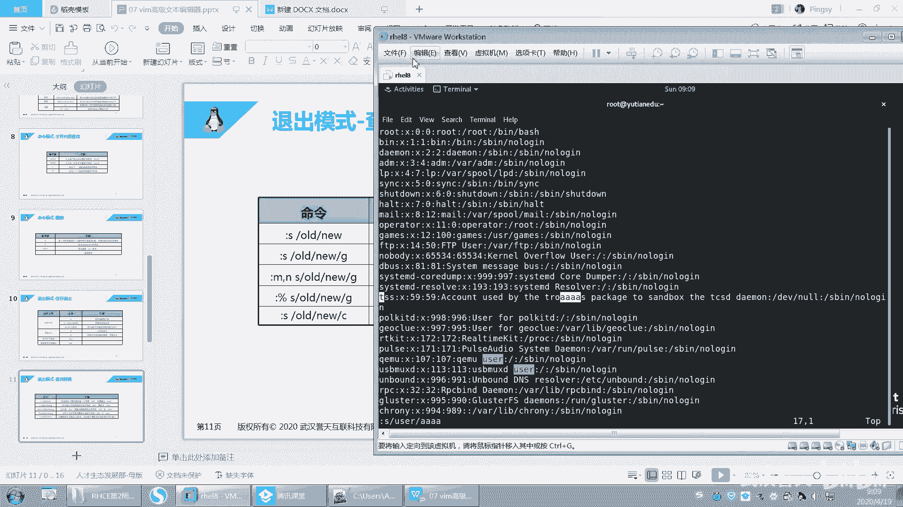

# 【已更新】最新版丨誉天红帽RHCE 8.0系列培训视频 - P30：vim的高级使用2-30 - 武汉誉天 - BV1cv411q74E

4。🤢。

S是指替换的意思啊，查找search，查找替换查找替换啊。

好，然后呢回车不不呃，空格空格键或者是不要空格键啊，直接呃这个这个输两个斜杠。两个斜杠在第一个斜杠后面呢输入你要替换的词叫user。在后面这个斜杠后面的替换，你你要替换的词，比如说替换成AAAA。哦。

看好啊，AAAA就这么简单啊，回去了。

好，他说这个没有匹配到是吧？啊，它还需要有空格哎。

等一下啊。嗯。等一下啊，试一下。输入语法写错了。呃，user。呃，userAAAA是吧。S。嗯见。Yeah。哦，我的光标看好是跟我光标有关系啊，等一下啊S。呃。userAAAA是吧。好，他是没找到。

等一下啊。S。U则。😔，诶。好，是这样的啊。呃，这个地方它有点特殊，它是指。我的光标所在处的对所在行，因为所在行没有所在行没有，你看这个地方是不是替换了，对吧？所在行没有啊。

所以它指的是我所在行光标所在行的替换。那我们想替换全部的话，我们就这样啊嗯这个这个冒号百分号。

百分号，然后S这样子啊。好，再来一遍啊。好，再来啊。嗯，百分号。S是指百分号指的是全部替换啊，就是全部替换，整篇文章全整全部全部替换，然后user。A哎哎哎。对吧好，这样的话就替换了。

但是我们发现还有两个没有替换，对吧？嗯，因为它只会替换这一行的第一个user，那这个是会被替换的，但这个没有被替换，那这个这个也被替换了，对吧？呃，但是这个没有被替换。

而且你发现这个地方哦还有一个大写的user是吧，查都没查到啊。好，所以我们这样啊，百分号再一遍啊。改分号。嗯，Uer。唉，然后后面加一个G叫global全局，就是这一行当中的所有都替换。

那这个跟这个都替换。OK吧。然后你加个I。这个I呢是指忽略大小写。忽略大小写的意思啊。好，回去了。哦，忘记输入了S。然后GI是吧，这样的话，你看这样是不是就是把它给替换了。

那这个地方这个大写的user好像也替换了吧。大写的U子也替换了啊，然后呢就都替换了，OK吧。

啊，所以就是这个。呃，这个没有写I是吧，那你不再加一个吧，嗯，你加一个I好吧，I就只忽略大要写。啊，忽略的还要写的意思啊。好。嗯，你们自己记一下吧，这个地方哎忽略他还要写。啊。

这个地方有这个地方加不加空格应该还好。然后这里呢就是M到N的话，M呃它是限定行范围啊，就是M到N行，只替换M到N行。如果是S的话，它只替换什么呃，当前行光标所在的行啊，然后这个呢就是G指的什么？

指G指的是这一行的第一个呃，本来默认是这一行的第一个替换。但G呢会替换这一行的所有。所有匹配单词啊。好，还有一个C哦，这地方还有一个C啊，这个C呢指的是什么呢？呃，C指的是，如果你在替换的时候。

它会提示你每一步都会提示你。比如说替换。第一个问你yes or no是吧？

啊，比如说这样啊呃百分号S，然后user。A。这样那他问你这个要替换吗？你就摁yes，它就替换。好，到下一个又问你，你就输no就不替换，然后就跑这个就是yes替换，就yes yes yes。

对吧这个就是它会提示你啊，提示你要不要替换啊，要不要替换，确认是否确认一下啊。

好，这个是查找替换啊查找替换。嗯，好。O。嗯，再来啊嗯我们。学的什么？我们三种模式差不多。其实其实这种模式下还有很多功能，非常多的功能啊。然后我们再来看一下啊，第四种模式啊，刚刚不是说三种嘛。

但是那三种是常用的啊。

第四种模式呢叫可视化模式。可视化模式啊。好，来一遍啊。

嗯，就是可视化模式是做什么呢？就是大家就这样啊，比如说你打开一个文件。我们刚刚进来的时候，对吧？我们只是比如说我滴滴呀、YY呀，这些是不是都是对行进行操作？都是对行进行操作，对吧？我们能不能这样。

呢用像鼠标一样，那我只想选择这一行啊，我只想选择这一行，而且我还只想选择某一列啊，就是S第一个字母这一列这样这样去划。那这种用作鼠标去选择这个我要。去修改的这个内容对吧？就当做鼠标的作用了啊，好。

右键呢复制对吧？然后就可以右键粘贴这样子啊，所以这这种模式呢叫可视化模式。那这个可视化的模式怎么用呢？好。

看这里啊。呃，我们摁一下VV可视化吗？waher可视化。

就这个单词可视化叫V嘛，这个单词英文单词叫V是吧？

好，你可以摁一下V小V。

