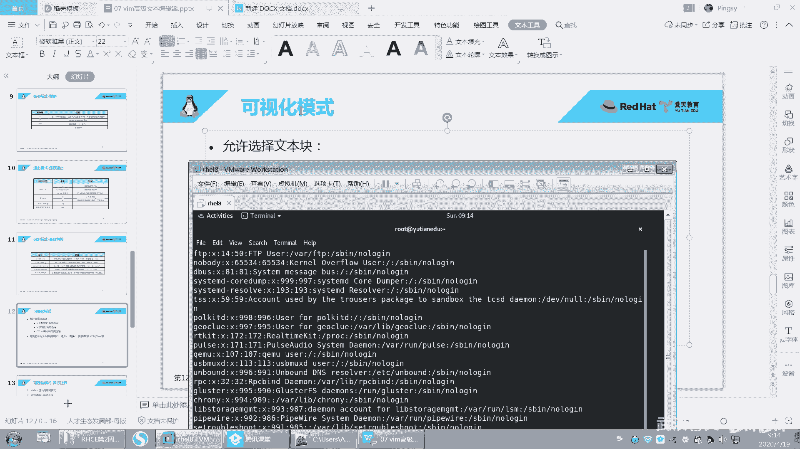
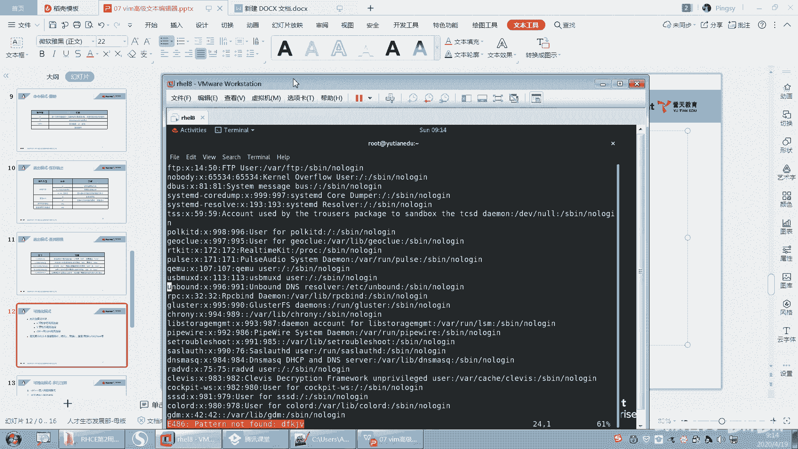
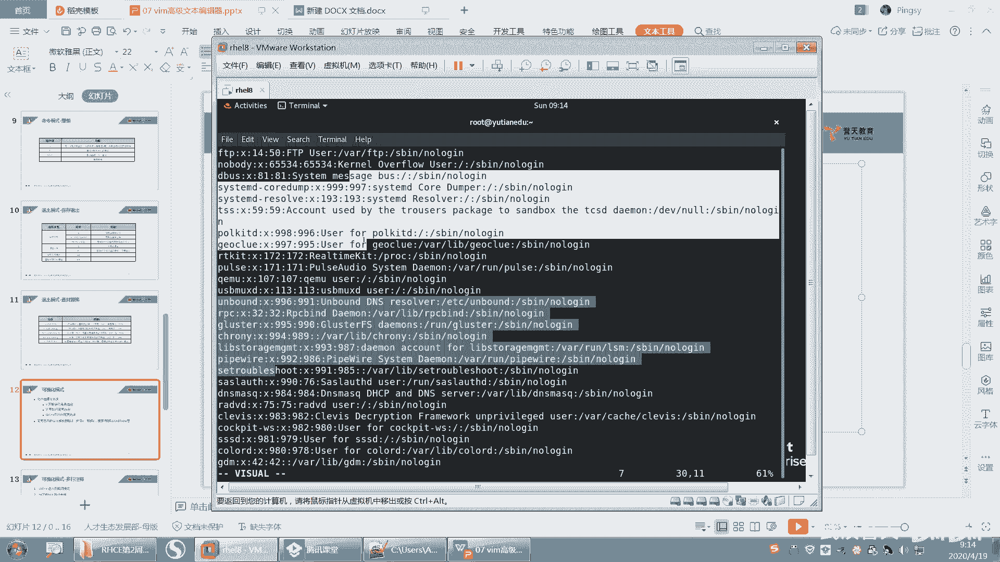
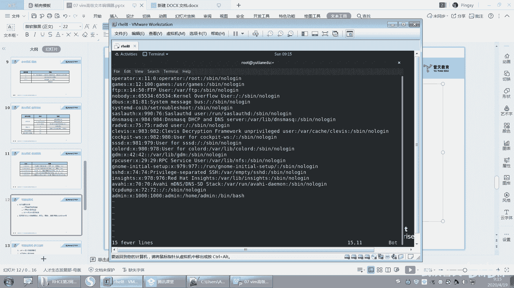
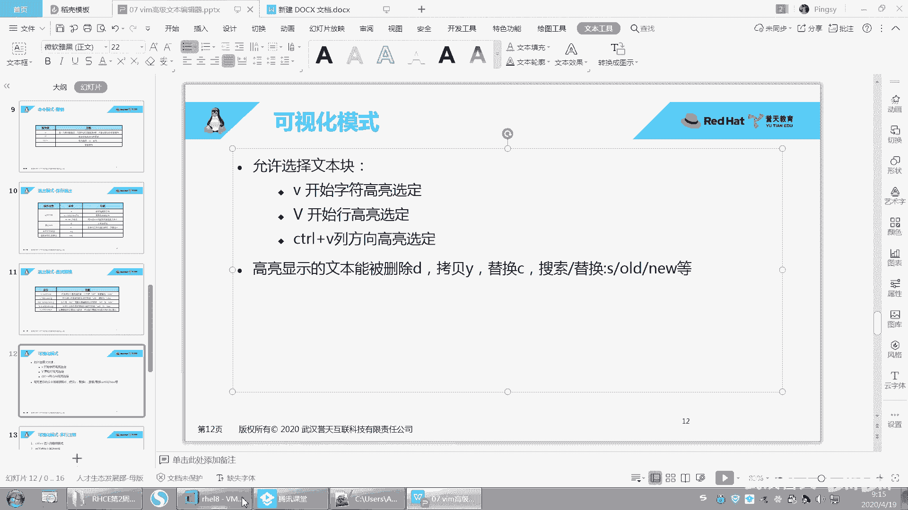
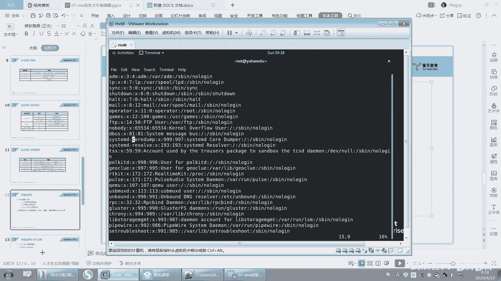
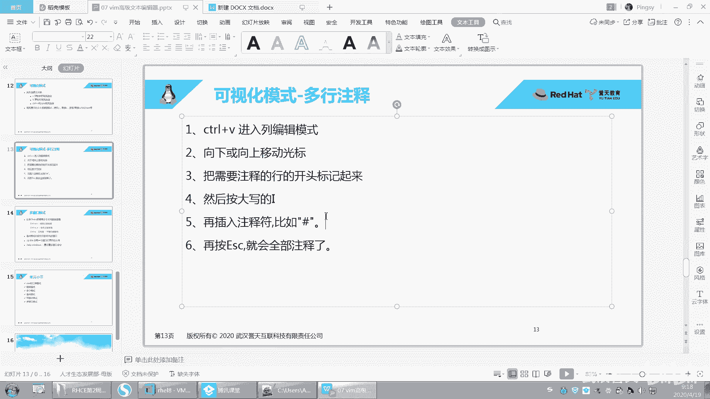
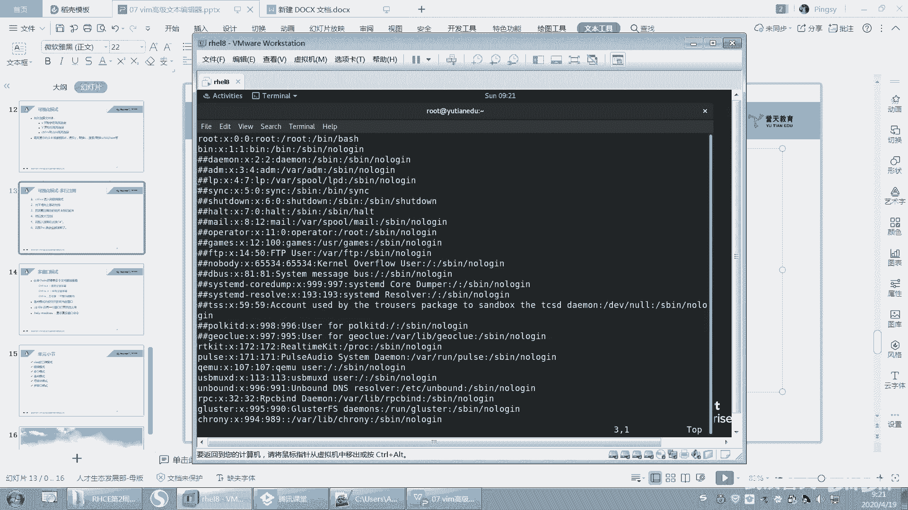
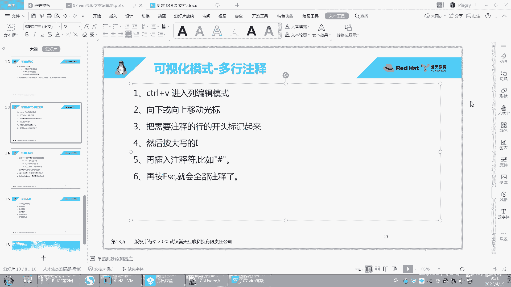

# 【已更新】最新版丨誉天红帽RHCE 8.0系列培训视频 - P31：vim的高级使用2-31 - 武汉誉天 - BV1cv411q74E

就这个单词可视化叫V嘛，这个单词英文单词叫V是吧？

好，你可以摁一下V小V。

看我的看我的光标在这里啊。好，上下移动看到了吗？那。左右这样是不是可以就就像我刚刚这样去这样去划单，划这个这个这个什么这个划这个选中的这个区域，对吧？选中的这个区域是一样的啊，好后再来一遍啊。

还我的光标在这里啊，然后摁一下小V，那这样是不是就可以这样左右去选，它是选这种连续的区域啊。那选这种连续的区域。好，那选上之后能做什么呢？选上之后你想做什么就做什么。

比如说我可以在选中的区域里面去查找替换，或者我在选中的区域里面去。比如说D。就删了。还记得吗？第一是不是就是那个呃剪切呀？对不对？剪切，那就D嘛，你就直接摁D就行了。但是只摁一次就可以了啊。

就是这个里面的可视化这个地方呃，高量显示的文本呃能被删除D拷贝Y替换C搜索替换，就是搜索替换，就是你直接输入什么冒号SO的原就是在你选中的区域里面去做操作啊等等等等啊。之前的都可以去做这样的操作。

好。然后U返回啊。好，V这样去选中它啊好Y摁1次Y就复制了，然后怎么样，然后跑到下面P，你看是不是就粘贴了，对对？粘贴到这个地方了啊，这是我选中的粘贴OK吧，所以就就比较灵活啊，你想去选。V左右权那。

对吧左右这样去选，然后D选了。就这样子啊。好，这是小V啊小V，然后再来啊还有一个大V。大V啊啊按上你的这个呃这个这个。Sve为。shift的 v嘛就是大V嘛，对吧？好，它是什么？

它是不是这样去选择这个这个行以行为单位，对吧？刚刚那个是以字符连续的字符，但是这个呢是以行为单位这样去选。好，同样操作是一模一样的。比如说D就删掉了。啊，操作是一样的啊，就是选的方式不一样。

它是以行为单位。那只能选航，你不能左右滑动，看到没有？只能这样去选航啊，那选成特定的区域。OK吧。好，然后呃。呃，Y然后就复制P就粘贴。OK吧？好，这个就是可视化模式啊。啊，还有一种模式。还有一种啊。

啊，不是，他说还有一种模式，可视化模式下还有一种操作叫control v啊，刚刚是小V对吧？然后大V，然后再来control v啊，看好啊，conttrol v啊，它能做什么呢？它可以对列进行操作。

我们刚刚是对行和字符，对吧？好，你看向下选，看到没有？那向下，然后向右选向右看到没有？向右选这样选中字符，然后好你有你向上那。这样看到没有？就这样去选择，它是以列为单位进行选的啊。

那我选上之后能做什么呢？一样的一样的啊，比如说D。哇，前面全删了，看到没有？对，前面全部删掉了啊。特别是针对那种注视行的，比如说你第一列对吧？一般你有井号，比如说你这这都是井号，对吧？井号井号唉。啊。

你想把这两个字母注释行，就比如说这样注释行把它删掉，这种比较实用。比如说contl v往下D唉，这样是不是就删掉了，对吧？好。O。或者那种连续的字符的，连续的空格，你可以用这种方式把它选上。

啊，这个叫control v啊control v。好，三种啊三种。第一个V就是以字符高量选定，对吧？然后大V是以行为单位进行高量选定啊，conttrol v呢是以列为列，在列方向进行高量选选定它啊。好。

你可以在高亮的部分进行这样的操作啊，进行这样的操作啊。就是之前的操作都是适用的。好。呃。呃，下面呢我教大一个这个。一个这个这个好用的这个。

案例啊我给大家写了一个案例，在这个地方。呃，我现在做什么呢？我现在要做批量注释，就是大家知道注释吗？注释就是。我是不是要在这儿把它注释啊？等一下啊。好，你看这样是吧，加个井号。

一般我们文件里面井号开头的行就是注释行。井号开头行就是注释行啊，那我是不是要进入插入模式，这样去注释它呀，这样是不是很麻烦？你看。这也太麻烦了吧，一行一行要去注释对吧？好。

下面我就教你一种批量注释的方法啊，看哦。啊，到时候写安伯的时候，到时学那个安博的时候，这个我们要写那个。playbook是吧？大家要会用啊，就可以快速帮大家去操作。比如说空格呀。

连续呃去掉或者加注释等等啊。好，来开始啊。control V。cttrol V啊，那可视化ctrorl V，然后往下挪挪挪，你要注释哪几行，你把它选上就可以了。啊，选上啊选上好，选上之后摁上。

按着大I就是插入嘛，插入那个大I就shift加I。shift加I啊，然后你是不是变成插入模式了，看到没有？那插入模式，然后输入井号。输入不井号那，然后EA就完了，看懂了吗？好，再来一遍啊，那全部注释了。

好吧，删掉啊，conrl v删掉了。B将删掉是吧？好，再来一遍啊。按着什么按住ctrl V对吧？那光标在这里往下挪，你要注视哪些行，你把选上就可以了，这样选上。好，选项之后摁着大I，摁一下大I插入嘛。

对吧？啊，它就回回到第一行了，回到第一行，然后输入你想输入的字符。比如说你输入两个井号也行啊，输入你想输入的字符啊，然后摁一下EA看到吗？对，他就注释了，就在前面加两个井。就你想在前面加什么都可以啊。

啊，就按这个来就行了啊，我给大家把步骤写在这个地方了啊。🤧嗯。

嗯。