# 【已更新】最新版丨誉天红帽RHCE 8.0系列培训视频 - P32：vim的高级使用2-32 - 武汉誉天 - BV1cv411q74E

嗯。好。那这个是多行注释啊，这个就靠你们自己练了啊，我就帮不了你们什么了，只能帮在这了啊。啊，下面还有呃可视化模式完了之后呢，我们还有一种叫多窗口模式，多窗口模式啊，就是说嗯像这儿啊。

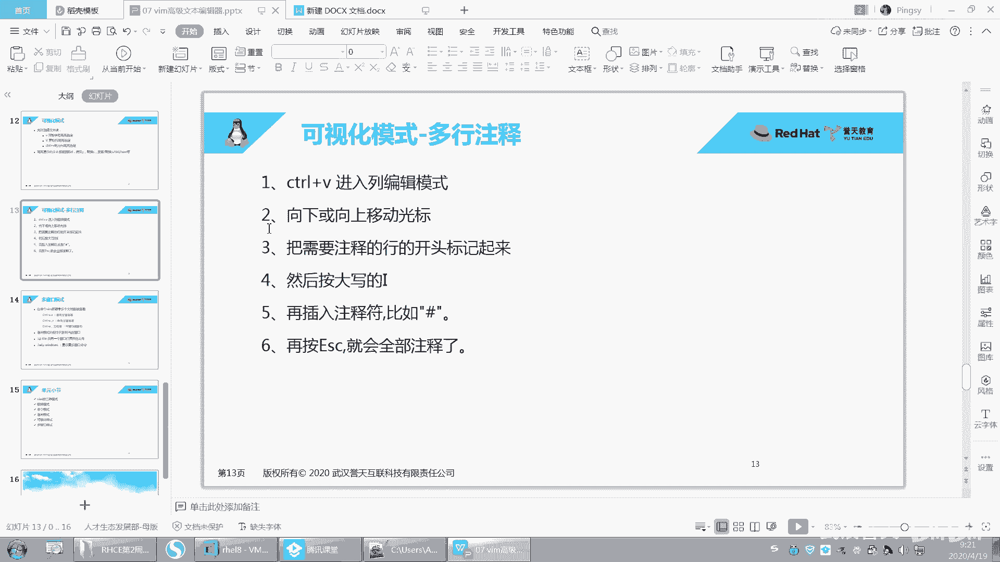

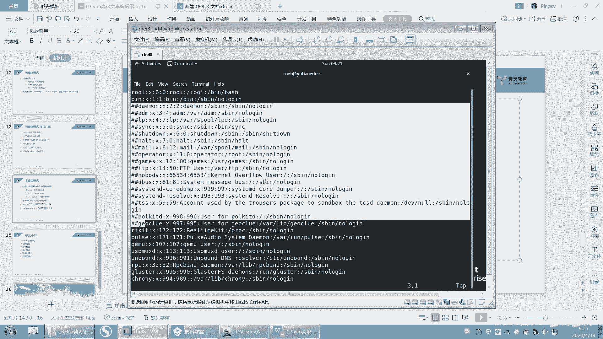

嗯，我在一个窗口在一个窗口呢，在这一个窗口上，我想在这一个窗口上打开多个窗口。就是说在这个上面我想打开多个窗口怎么办呢？我就control啊cttrol。WV唉，你看我就开了两个窗口，看到了没有？

开了两个窗口啊，然后这两个窗口呢它是怎么样？它是分开的，它不一样。你看左边是左边这个也就是说我在这个什么在这个窗口上，我开了两个窗口去编辑这个文件。好，你比如说我对左边这个文件进行编辑啊，比如说。う啊。

🤢，啊，右边是不是也会显示。看到吗？它这种比较适合于什么呢？比较适合于我看对照着对吧？对照着这一行，然后去编辑另外一个文件。对，编对照这一行，编辑另外一个文件。好，然后你可以怎么样保存嘛那。哎呀。

我退出了。好，那个窗口就退了啊，退出了。好，再来啊controrl W摁一下S就在水平方向上哦，在竖直方向上或者水平上呃，这个怎么水平数就是上上上下嘛，上下开两个。

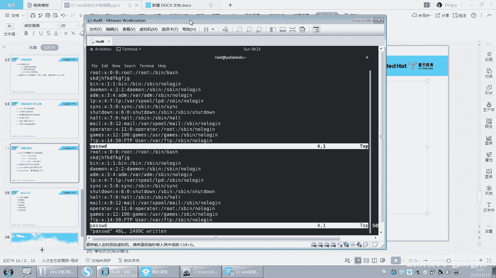

就这个啊ctrol W摁一下S，它就横向分割屏幕是吧？哦，摁一下V，就是在纵向分割两个。呃，然后你你想在各个窗口之间进行移动，那就按ctrl W。

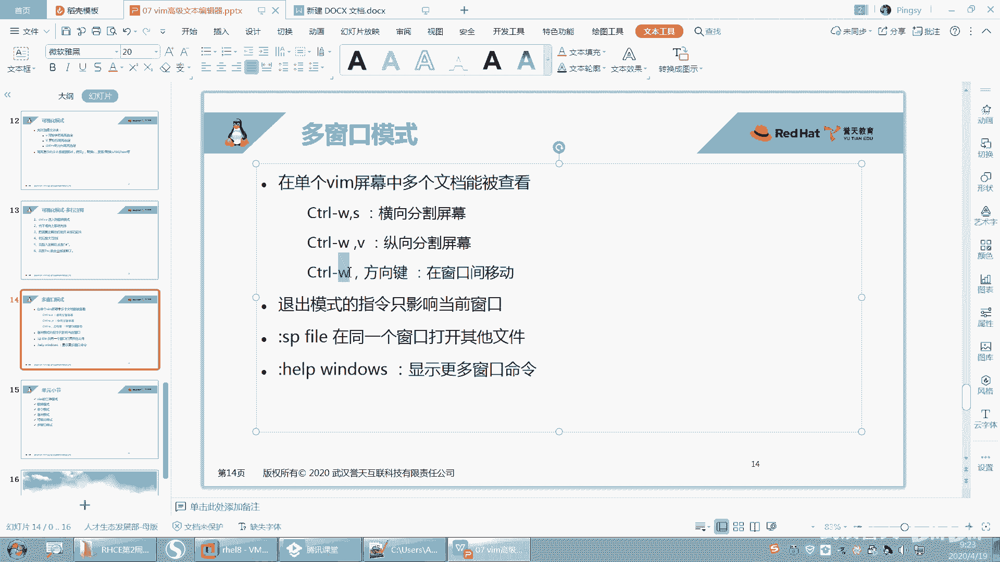

比如说com，你看我的光标现在在上面这个窗口是吧？然后我想把光标移动到下面这个窗口，那我就摁contrl W向下。看到吗？这样我就跑到下面这个窗口了，然后再来啊controlWV，你看又开一个窗口。

你可以无限这样去开conttrol W向上control W呃S，那就又开一个窗口，看到吗？你可以开多个，然后我对每每一个窗口操作。比如说我现在光标在哪个窗口，我就对哪个窗口操作，我可以退出它。

现在我光标在这个窗口，那我就怎么样，我就冒号Q这样退出，看到没有？光标在这个窗口，那就冒号Q退出这样子啊。啊，就是在开多个窗口，以及在多个窗口之间进行这样一个移动。

摁ctrlW方向键上下左右这样去移动啊。

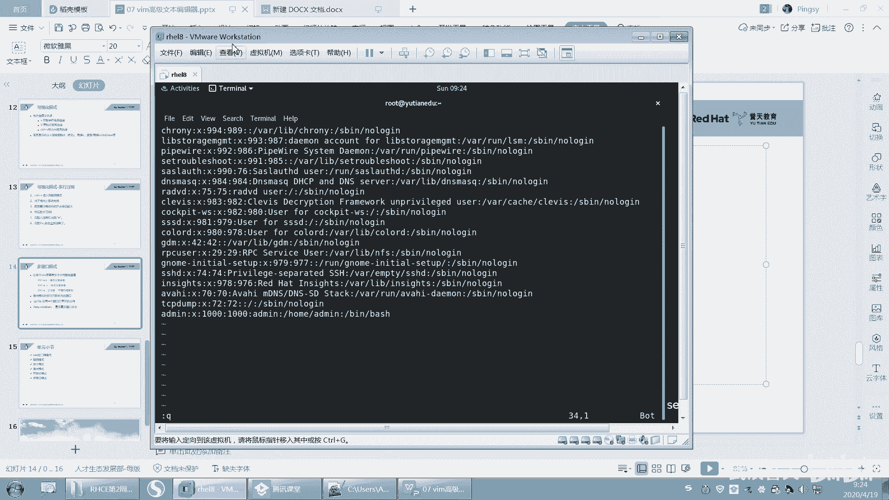

以及我们这个退出模式下，我们的指令就是我我们光标在哪个窗口上里面，对吧？我们的指令就发送到哪个哪个窗口里面。光标在哪个窗口啊，你这指令就发送到哪个窗口。

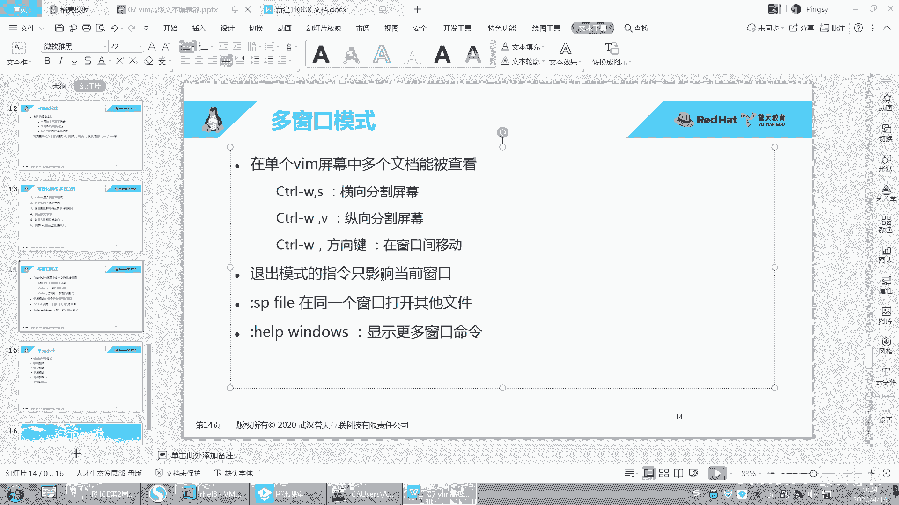

好吧。好，最后再给大家补充一个啊，这个之前呃。

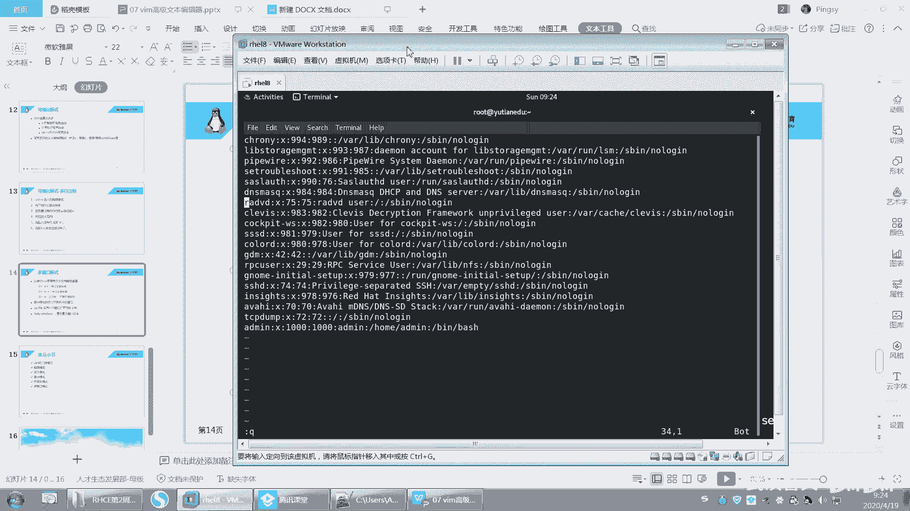

就特意给大加了一条啊，刚刚呢我是怎么样在这个。这个窗口上对吧？显示多个虽然显示多个窗口，但是呢我显的显示的都是同一个文件。但是我想怎么样在这个窗口上显示多个文件，开多个窗口显示多个文件啊，它这样啊。好。

在退出模式下冒号看到没有？在退出模式下啊，SPE。然后打开ETC下面的profile，打开这个文件。就SP打开这个文件啊，回车。好，你看。上面这个是一个文件，下面这是另外一个文件。

下面这个是password，上面这个ETC profile。然后这两个窗口是要多窗多窗口适用我们刚刚的是一样的啊。比如说在这个窗口之间进行切换，controrl W向下切换到下面这个窗口，看到了没有？

contrl W向上切换到上面这个窗口。啊，这是你在你只有一个窗口的情况下，你可以你可以你可以这样去开。OK吧，可以这样去开啊，然后上下这样对照着去写。啊。好吧。OK呃，这个。就讲这么多吧。

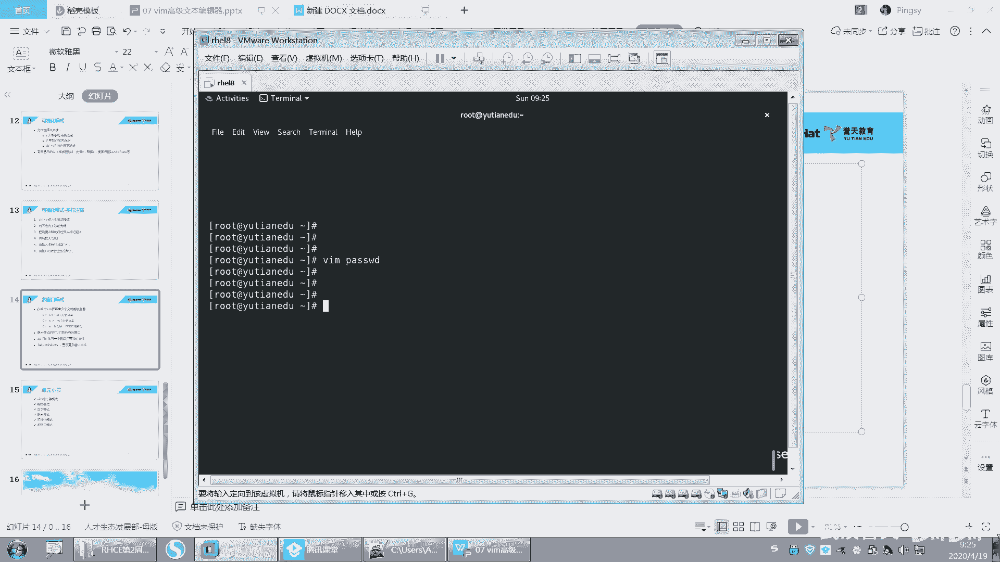

应该是够大家用了啊。呃，这张呢我你要会的啊，嗯基本上像我列在这个地方的。内容你都要会。就一个就是这个嘛，冒号SP加上一个文件，就在同一个窗口里打开其他文件嘛，就也是其实它也是多窗口。也是多窗口，就这个。

然后如果你想去显示更多的窗口命令的话，你就ha windows。

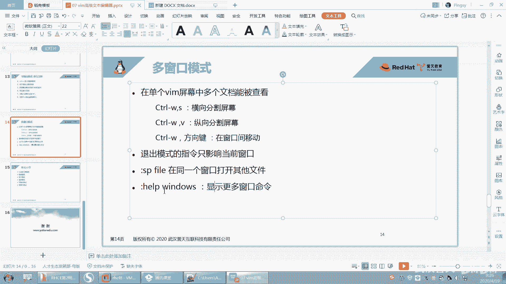

哦。还有window是吧？好像还可以help。比如说。呃，输入ha。呃，它这里面就有很多这种帮助，不过你能看懂的话，你就看看不懂，就你就百度去是吧？那就是在退出模式下，其实是有很多很多的功能的。

我讲的也只是其中的一部分啊，可能我们比较常用的一部分。你就去查帮助就可以了。VM的功能太多了太多了啊。

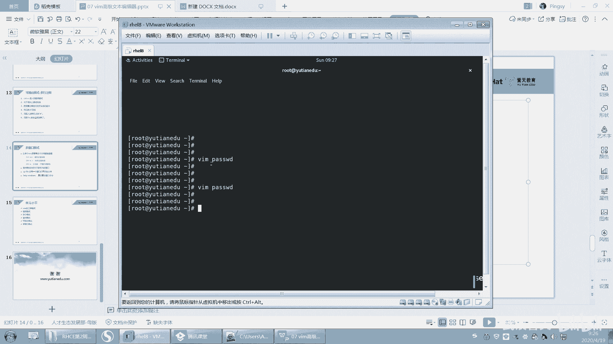

比如说什么还有什么，我看同学之前总结的。什么呃默认一个table键就几个空格，反正很多这个你们可以自己去再去扩展。呃，我告诉你可以这样做，你就可以自己去扩展在VIM里面，对吧？VIM里面。

因为每次table键呢它就。不知道几个空格是吧，你可以自己去设置啊，或者是设置高亮啊，设置显示行啊，默认就显示行啊，都特别多特别多啊。好。嗯。这张VM就到这吧啊，呃回顾一下啊。VM的三种模式。

后来我们又是不是又加了两种模式？呃，命令模式。呃，编辑模式退出模式，还有我们后面加的两种可视化模式，以及多窗口模式，对吧？这几种五种了吧。有5种模式，对吧？啊，那编辑模式mini模式推出可能。

那就就就这5种模式。那这种5种模式下面能做什么？呃，这个是你要知道的，而且我们在每一种模式下都给大家举例常用的一些这个案例都给大家举了，你就拿来用就可以了。嗯，主要是熟练啊熟练。好。

那这张我们就到这儿吧。

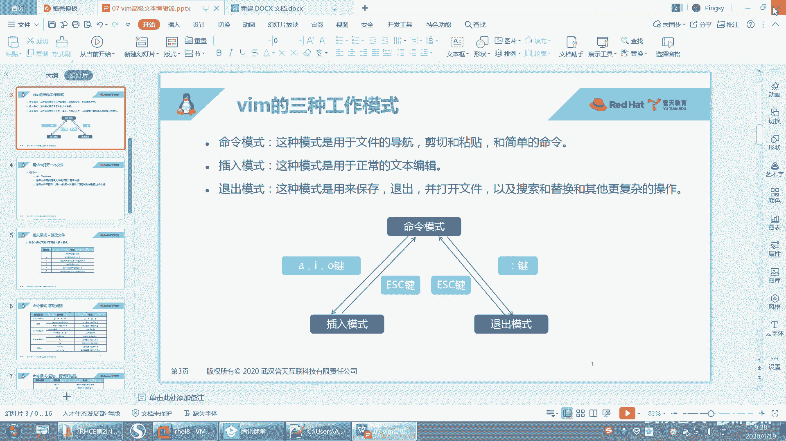