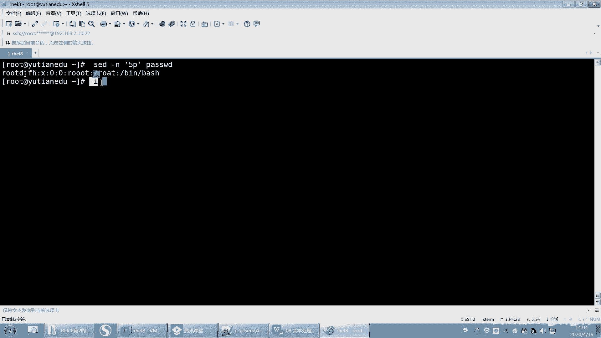
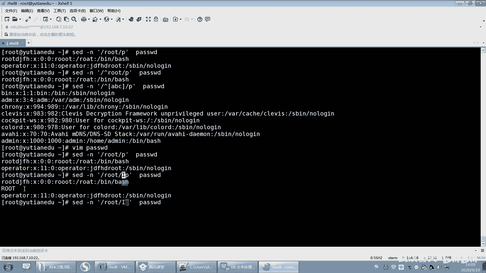

# 【已更新】最新版丨誉天红帽RHCE 8.0系列培训视频 - P37：文本处理工具2-37 - 武汉誉天 - BV1cv411q74E

好，王家良第一个。好，嗯，那时间到了，我们就开始了。还有一些同学还没上来啊，我我不等人的啊，你到时间点我们就开始啊。你们自己看着办。错过了，没听没没没没听上，不要让我再说讲一遍了啊，我讲过了。

这个设计时间把握好，好吧。嗯，O那我们继续啊，上午我们大概把这些命令呃给大家。讲了一下是吧？这张主要是文本处理工具啊。重点是吧，我们每一节课基本上都是重点啊，当然这张也比较重要。

它对于我们去处理文本内容啊，写脚本呢。都是有非常大的帮助的。好，呃，我们讲到SED了是吧？然后前面都讲完了啊，SED我们从SED开始啊。好，再说一遍啊，再说一下这个SED啊。

SED呢它是一种这个流编辑器，呃，它其实呃功能非常强大啊，它的原理呢大概是这样子。跟大家说一下啊，早上其实说过了是吧？它的原理呢就是他他每次就是读一个文件的时候，它会将这个文件读到缓存里面。

然后你所做的更改都在缓存里面，因为这个命令它是可以修改文本内容的。之前我们学的命令都仅仅是在输出里面输出的时候，输出终端的内容是吧？然后做了一些呃修改。那这个文件它是可以修改原文件的对吧？

那它也不修改原文件的话，就是对内存里面数据进行修改，然后将内存里面数据打印出来。啊，大概是这样子啊。

啊，那如果你对这个原文件修改要加个杠I啊，就直接提修改了原文件啊。

啊，它可以查到替换，对吧？然后不改变原文件哦原文件，但是你可以加杠I去修改原文件。

好，后面是这个SED的一些这个选项啊，选项。好，我们来看一下啊，那我举个简单的例子，比如说我想去打印第五行，那我就打印第五行嗯5P。啊，第五批。这样子。哎，就打印了，对吧？但是你看我们打印的出来内容。

哎，怎么这么多呀，对不对？我们说过了，你打印的时候，它会将怎么样，它会将我们的这个呃。

文本原文本内容也会输出呃，这样缓存里面也会输出，所以输出了两次啊，你要加一个杠N。哎，这样的话只是将缓存里面的第五行打印出来了。所以加P的时候，一般情况下。也要加个杠N啊，这样才能看到我们打印的效果。

好。呃，杠恩呢就静默的意思，不输出模式空间里面内容，对吧？

呃，杠I呢是呃直接编辑文件，默认是不对原文件进行操作的。就比如说你想去删除第五行。

删除第五行对吧？那。如果你不加这个杠I的话，它就不会删。它只是在输出的时候删了。那修改原文件就就就就什么杠I就修改了啊，后面我们会讲到啊。

哎杠一，如果你有多个条件，它们中间呢用杠一连接起来。比如说我又想去打印，又想去删除，又想去做这个又想去做那个对吧？那么他们之间就可以用杠一来连接，它可以连接多个多个命令啊，多个命令。好。

然后呢还有杠R杠R它是扩展正则表达式啊，记得上午学的呃gra吗？gra上午学的Egra对吧？gra杠E那这个都是支持扩展政则的啊。SED同样也是支持的那SED呃前面的内容那个政则表示支不支持呢？

也是支持的OK吧。好，所以我们之前学正的表示在graip这里都可以适用啊，都可以适用。好。嗯。这里有有一些例子是吧？嗯，好，我先看一下啊。好，这样吧，我们来看一下啊，对这个文本进行操作。

但是这个呢这一页指的是这个对地址进行对地址选选择地址的啊。好，我们用这个打印来举例啊，用打印这个来举例啊。

啊，你看啊第一个呢。嗯嗯。

第一个这个地方是一个井号，井号代表是数字指定要处理的行。所以这个地方这个数字这个五就是井号的位置啊，就是井号这个地方啊，当然这个地方你也可以空一个，这这都都可以啊，就空空格也可以，不空格也可以，O吧。

好，这个是地址地址范围内啊。如果不指定制地址的话，那么就打印整篇文章，打印整篇文章啊。

好，然后你看啊你要打印do了符号，do了符号指的是这个呃表示最后一行那。SED还可以是吗？后面可以接多个文件。呃，如果是多个文件的话，那么它为什么？为最后一个文件的最后一行啊，所以我们可以用多了。

你看多了符号。

你看多了符号指的是最后一行，看到没有？多了P指的是最后一行啊，我们这个文件的最后一行应该就是这个又就是admin，看到没有？就是admin啊。

好呃，然后还有什么？还有这个地方你可以接正则表示。接正则表达式啊，那能够表示能够被这是叫正则表达式REGregularex。啊，匹配到的行对吧？基于政则表示的匹配啊。

好，我们举个例子啊，SEB杠N然后你把它引号引起来，你这样啊，你这样养成习惯。啊，你看这边就是打印对吧？然后这边是这个这个这个嗯呃打要要要要查看的文件。然后那我们如果是正格表示，中间有两个斜杠。

中间就用正格表示。那右边这个就是PP就是打印，对吧？好，比如说打印root带root的行，那你看。嗯。带有root的好像是不是打印出来了，对吧？这个太多了，我修改一下啊。我的删音。好。这样子看到啊。呃。

SED杠N是吧，然后呢打印出了这个root。嗯，然后P是吧root这段匹配正在表式就这一行当中有root的就给你打印出来。那这有个root，这里有个root，对吧？打印出来了啊。好。

就是你你还可以这样吗？你看我们之前学的正在表示式不是有间号嘛？已root开头的行，那么是不是就是已ro的开头行，你还可以呃与什么什么结尾嘛，这都可以用，O吧，都可以用啊，还可以用什么，还可以用中括号。

中括号是之前学过了吧？啊，中国好比如说ABC。嗯。唉，之前是这样子是吧，以ABC开头的那。这是不是跟gra是一样的呀，对不对？跟gra是一样的啊，所以在这个地方它也是适用的，O吧，这是匹配特定的行啊。

匹配特定的行。😊。

啊，然后你还可以在前面呃那。匹配到的打印出来啊，这个呢就是这个表达式政则表达式我就不多说了。好吧，就之前学过的，还有之前还学过什么，还学过什么基本政则这种是吧？

嗯，还有学过这种。呃，这种都都学过都是学过的啊。好。嗯，这个后面要加个杠I杠I那是指PP的时候，忽略它要写。呃，如果我写一个大写的。比如说我在这儿写一个。嗯。我写一个大写的root是吧？

然后SED这样去打印的话。他会不会把大大写的打印出来呢？没有是吧？然后我们就可以加一个I。哎，这样的话就大写就出来了，看到没有？那就大写看了吗？

匹配大小写就是忽略大小写的意思啊。

好，嗯，还有一种情况就是呃比如说啊我想去匹配什么呢？我想去匹配这个嗯bush share，就是这一行里面是带bush share的。呃，它的登录信为冰bsh，就是带这个的可以吧？呃。

它的这一行当中是带有这个bebsh这个关键词的，就这一行哦，但是这个文件当中呢，比如说我是这样去打印它的话，那你斜杠斜杠这样子是吧，是不是写的bin呃bush？是这样吧。然后。你再把它引起来。

那你这样写的话。P。然后password你这样写是不是会有问题啊，对不对？哦，是因为这个斜杠，你看这有个斜杠，这有斜杠，这个斜杠本来是指你看这外面这个跟这个是不是要中间要匹配一个关键词，对吧？

匹配一个正态表示，但是这个里面是不是也带斜杠啊？那我们用什么呀？我们可以用这个呢反斜杠。反斜杠反斜杠指的是什么意思？反斜杠指的是去除这个后面这个字符的特殊含义。后面这个斜杠字符是什么特殊含义呢？

是不是指匹配正的表示外面跟它是一样的对吧？所以我要想让这个斜杠原样输出的话，那么我就在它的前面加上一个反斜杠O吧？反斜杠指的是去除这个斜杠的特殊含义，让它以斜杠原样去匹配，呃，就匹配斜杠啊。回去了。

那这样是不是就可以匹配到了啊，匹配到bebush跟bebsh，对吧？好，但是这样写是不是感觉哇，这看着很乱，对吧？所以它还有一种方式，它还可以这样写啊。也就是说在这个地方我可以怎么样啊，我可以随便写那。

这也是这个地方这个这个这个这两个摆分号你可以随便写嘛，你也可以写at艾呃，井号井号你都可以写。啊，然后再写上beanbsh。这个也可以达到效果，这个就是避免为了什么？避免你的关键词当中是有这个斜杠的。

看到没有？有斜杠O吧，这个就可以用井号来代替，但是前面要加一个这个啊，前面要加一个这个反斜杠，O吧，加个反斜杠。

