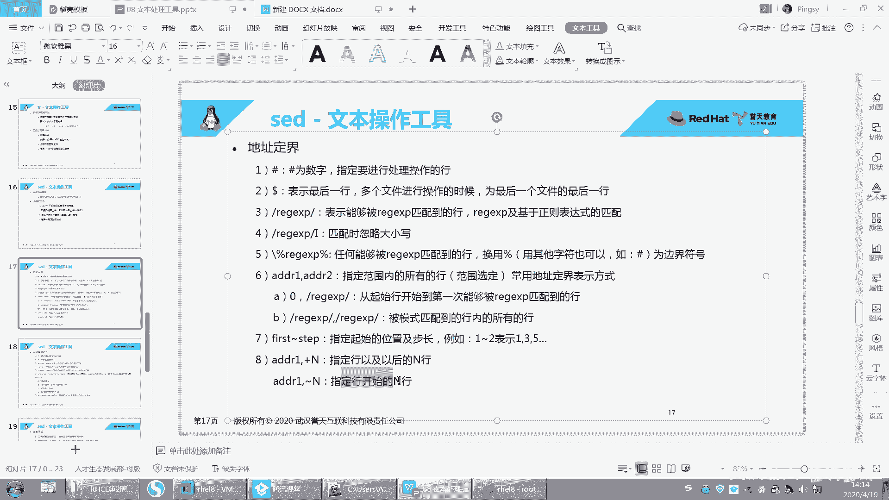
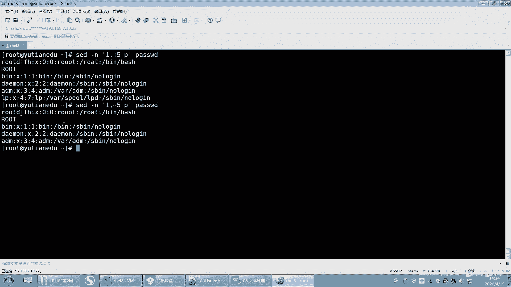
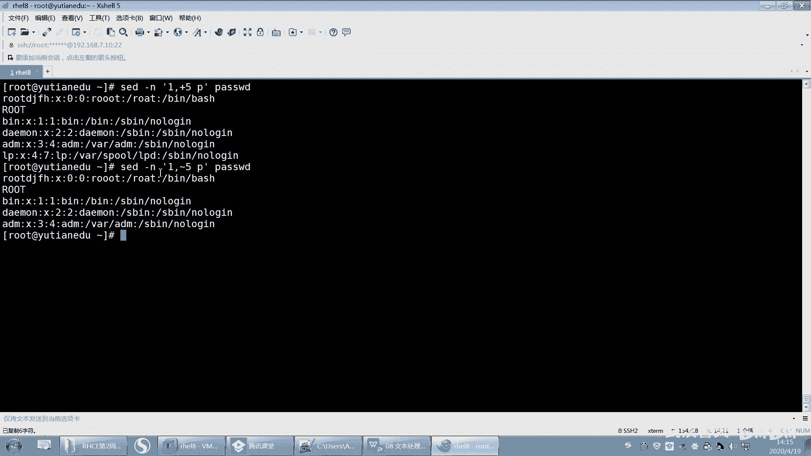
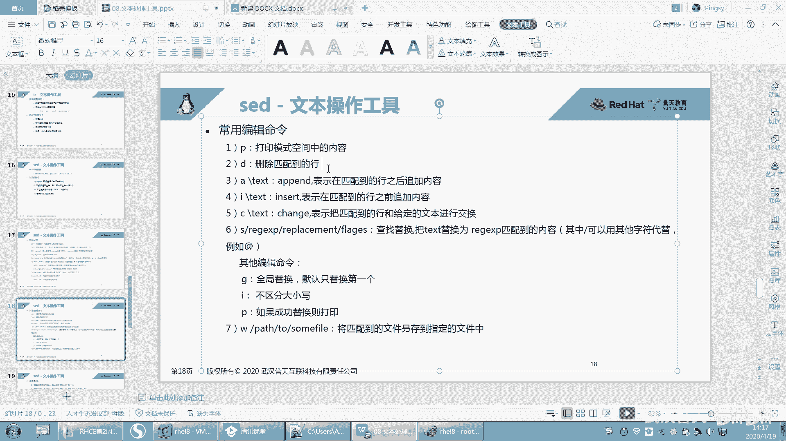

# 【已更新】最新版丨誉天红帽RHCE 8.0系列培训视频 - P38：文本处理工具2-38 - 武汉誉天 - BV1cv411q74E

要加一个这个啊要加一个这个反斜杠O吧，加一个反斜杠啊，就这个。

那这个反斜杠，然后中间加正在表示。好，用这种符号去代替啊。好。呃，括号应该不行啊，它括号不是这个意思。然后另外这个这个这个版分号可以用别的来代替是吧？

好，这个是第五个啊第五个，然后再来还有第六个，第六个就是介着呃界定这个地址的范围。地址范围的话就是第一行到第三行，那就是第一行到第三行这样子啊。第一行到第三行。好，然后还有比如说嗯你还可以这样。

第一行到。嗯，到匹配有root的行。嗯，这样也可以。那这样也可以啊，匹配到有root的行，这也可以，好吧。或者是这个你可以嗯。呃，user是吧，到root。呃，这样也可以，好吧。

就是这个关键词出现的行到这个关键词出现的行。

啊，就这样都可以啊都可以。或者是呢就下面这个一个匹配的行到另外一个关键词匹配的行啊，中间的行都打印出来。呃，好，这个是这个地址范围啊。啊，还有一种这个叫一啊，这个波浪号啊。

呃，波浪号的话就是这样的，如果是一。呃，逗号啊，不一波浪号2一波浪号2，这个一波浪号二指的是什么呢？指的是呃从第一行开始呃，隔一行打印一次。就是步长是2这样子，步长是二啊，隔一行打印词，这样步长是2。

OK吧。那那就打印的就是第一行、第三行、第五行点点点、第七行这样子啊。呃，还有这个还有这个地址到这个地址的范围是吧？加恩就是指定行以及。呃，以后的N行。呃，这个是指定行开始的DN行。

这个就简单说一下吧，好吧。嗯，就逗号对吧？加5指的是。第一行。呃，然后再数往下数12345，从这一行算起，从这一行算起。那如果是一。呃。🤢，去减吧。啊，拨浪号是吧？拨了号5。

12345。呃，从指定行开始的N行是吧？

这两个没啥区别。哦，这里是12345是吧，数错了啊。😊，这里是六行，那就是说这第一行下面数五行，那这个是第一行，下面这一行算了是吧，这五行包括这这第一行啊。

好。呃，这就是选地址范围啊，地址范围。呃，在哪个范围内做什么操作，好吧，这就是。基本上包括了所有的这个地址范围啊。好，那么我选上地址范围之后，我能做什么呢？我可以打印，对吧？我刚是不是打印啊。

一直在打印，对吧？那我还可以怎么样啊，我还可以删除删除啊。

好，SED那删除的话就不要杠N了，不用杠N了，OK吧。删除的话就不用杠N了啊。好，然后这样啊引号引起来中间是不是你要做做什么事情，对吧？password。好，那么删除第几行呢？删除第二行。空格D。

这样就删除了，OK吧。第二行删掉了，那一行有大体字母，那一行我就得删掉了，对吧？

那剩下内容是不是输出OK吧，剩下内容是输出的啊，看到没有？剩下内容是输出的。

好，或者你删除，比如说。一到第五行。No。1到5前面就没有了。我记得前面是什么root呀，addmin啊什么之类的是吧？那1到5就没有了啊，删除啊，删除的时候不要加杠嗯，听到没有？

因为它默认只是输出这个这个这个这个这个呃模式空间，就是那个缓存里面的啊，缓存里面的。啊，这个是删除啊删除。那原文件有没有变呢？注意原文件是没有改变的，你怎么原文件才能变呢？杠I原文件就变了，OK吧？

杠I原文件就变了啊，杠I回去了。好，前五行没有了，看到没有？呃，root那一行没有了，OK吧。好。

嗯，再来啊。嗯，这个DD会了吧，删除哪一行的哪一行啊。

不能撤不了啊啊，有同学说老师，那你这个删了怎么办啊？能撤销吗？撤不了怎么办？因为你怕删掉之后就没了，是吧？好，那你就这样，PCpasword到这儿覆盖一下啊。好，那么你怕他删错，你删错了，对吧？

那你最好是不是保留一个副本呢，保留一个副本，对吧？稍等一下啊。好，保留副本，我怎么保留呢？保留呢？我就SED。SED哦。杠I点BAK看到没有？然后。嗯，一逗号5D。然后password啊。

那么杠I我们说是修改原文件，对吧？那么点BAK是什么意思呢？指的是啊当你去修改原文件的时候，这个是不是真的要修改了？因为杠I嘛，那么。呃，修改完之后，password就第一到第五行删了。

而且它会保你保保存一个副本。这个副本的名字叫password点BAKOK吧。好，那我试一下啊。这个下面就会生成一个password点BAK看到没有？然后打开这个pasword点BAK看。是不是原文件？

没有变的那个文件啊，就是原文件，它就给你保留一个副本。就是如果你怕真的做错了，对吧？你还有一个。备份的一个文件。如果你真的修改原文件了，原文件是没有办法撤销的，OK吧，撤不了啊。

好，这是D啊D。呃，下面第三个AA后面加一个斜杠test，指的是A是指追加追加呃表示在匹配的行。呃，匹配到了行之后，这加内容是吧？好，那我们来看一下啊。

呃，我想在第二行。我想在第二行追加一个这个。嗯，直接加1个ABC好吧。那就第二行2。然后A是吧，然后反斜杠ABC。回去了。有没有啊有吧，看到没有？第二行的。下面追加1个ABC就追加进去了。

然后你写个杠I，它就写进去了，它就写进去了啊。啊，我就不写了，好吧，我只是让它输出一下，看一下。啊，这个是怎么呀？这个是这个追加啊，追加看到没有？先写地址，注意你先写地址，然后。怎么样？

写完地址之后写个A啊，这样这个你写空格也这个空格，就你加不加空格其实也还好。因为地址范围嘛，你要么你就是用数字，要么就是两个斜杠，对吧？啊，所以这个你空也可以，不空也可以啊。好。

那你还可以写个杠II呢就是插入，那就是在第二行，也就是第二行的前面，那就它就会变成ABC就会变成第二行，对吧？回去了。啊，那它就变成第二行了，I就是插入插入啊。

怎么啊？一直给我送花。哦，就是一一前一后啊，行前行后。啊，还有第呃第五个第五个就是。

呃，C是吧，C是指替换去改变改变了啊，就是说嗯我想。

我真的想把第二行换掉，把第二行换掉。第二行本来是什么呢？你看一下啊，第二行是不是就叫呃这个叫下下down的，是吧？下当的是吧？好，把第二行换掉啊，那就是C。回去了。好，那第二行下档那一行就没有了。

就替换掉了，O吧，就替换掉了啊，把第二行给替换掉了。

啊，这是C啊这是C。好，再来啊。呃，第六个第六个啊SS呢是指替换查找替换吧，记得吗？我们之前学VM的时候S查找替换的啊，然后这个是我们要。呃，替换的内容。这个是什么替换成什么内容？

其实你这个地方就写上什么old new就行了。对吧说白了就是old new嘛。但是我觉得他这个写的更规范一些，为什么呢？因为它这是一个正策表示。正字表达式嘛，就是你可以写具体的某一个单词，某一个字符串。

也可以写一个政字表达式，能理解吗？嗯，写个正字表把这个正字表达式就给替换掉啊，然后这个是替换成什么？然后后面可以加一些加一个，比如说可以加个什么啊，比如说全局替换回回顾一下VIM里面是吧？

然后如果全局替换的话，这一行全部替换，是不加个G啊，唉SED也是这样，默认只替换这一行的第一个。啊，OI呢I也是这样，I是指不区分它要写就是。你只要想起VM怎么用用怎么用的SED这个地方就怎么用。嗯。

然后P呢就是指如果成功替换则打印。呃，如果成功的话就字打印出来啊，打印出来。好，我们来试一下啊。

嗯。SED。嗯，然后password是吧，然后中间是这个我要做的操作。啊，我要S呃查找替换是吧？查找root。呃，替换成。呃，AAA好吧，好，然后呃这个这个后面也要写个斜杠啊。

就是这个地方你后面不加东西，你也要写斜杠，这个地方也要写啊，也要写。

啊，回去了。呃，这个地方本来就没有root了，是吧？我看一下啊。哦，原文件被我给替换了，所以这个地方是没有root的。好，再来啊。哦，这样这样的话，你看root就替换成了AAAA对吧？

那root就替换成了AAAA啊。好，那么这个地方这个root是没有替换呀，对不对？所以我们这边加一个什么加一个Gglobal嘛，这一行的所有都替换。那这一行的所有都替换啊，A好吧。

