# 【已更新】最新版丨誉天红帽RHCE 8.0系列培训视频 - P39：文本处理工具2-39 - 武汉誉天 - BV1cv411q74E

做替换。那这一行的所有都替换啊，A好吧，然后呃I的话我就不举例了吧，I就是忽略大家写嘛，大写也替换，小写也替换都替换，好吧，这个是忽略大家写啊。🤧嗯。啊，什么意思啊？嗯。对对，就忽略大家写啊。好。

你这个地方是不是可以是一个正则表达式，对不对？是一个正则的表达式啊，然后替换成某个具体的这个这个这个字符串啊。好，所以我就用root来表示的啊。

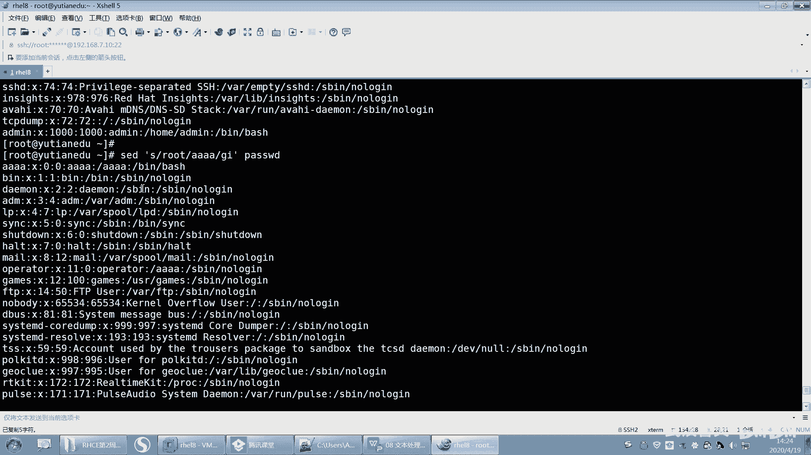

啊，GIP是吧？好，这个记住哦，后面我会很多例子，然后呃很经典的例子啊，然后让大家去学会这个查找替换的呃用法。嗯，好，先先先放这儿啊，先放这儿，后面我再说，好吧。

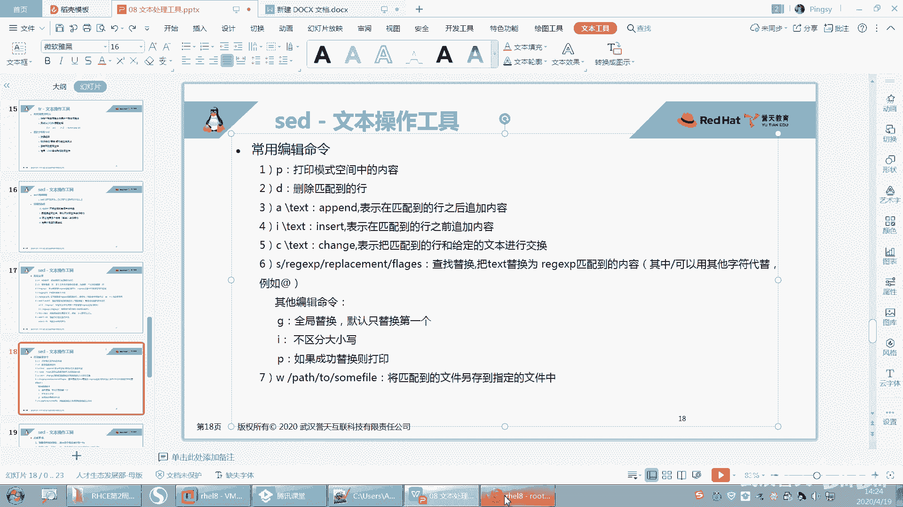

嗯，我看这个P是干什么的啊？P。哦，P1好像打印了两次是吧？P打印两次哦，这样啊。好，你这样你加个杠N。哦，你看。看这儿啊，我刚刚如果批的话，他是不是又把原模式空间那边我打印了一遍？所以。我就加杠根。

然后只输出什么，只输出替换的那一行。你看这样是不是更清晰清晰一些，只显示替换的那一行嘛，对不对？嗯，它跟它合并，就是你只要要打印了，注意啊，你只要打印了，那么你请前面加个杠N，否则你就会打印两遍啊，对。

匹配对匹配替换的那种打印啊。就加P一定要加什么，一定要杠加杠N啊，否则你看全部都有，这有一遍。只有两边对吧？有两遍啊。

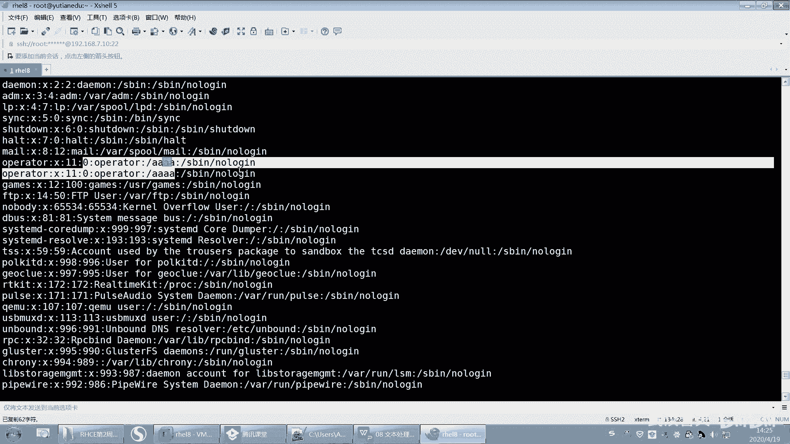

好。嗯。还有啊还有第七个第7个啊。第七个是W，后面加上一个文件名，它可以将匹配到内容指定到某个文件里面。

好，比如说我想把这个嗯。

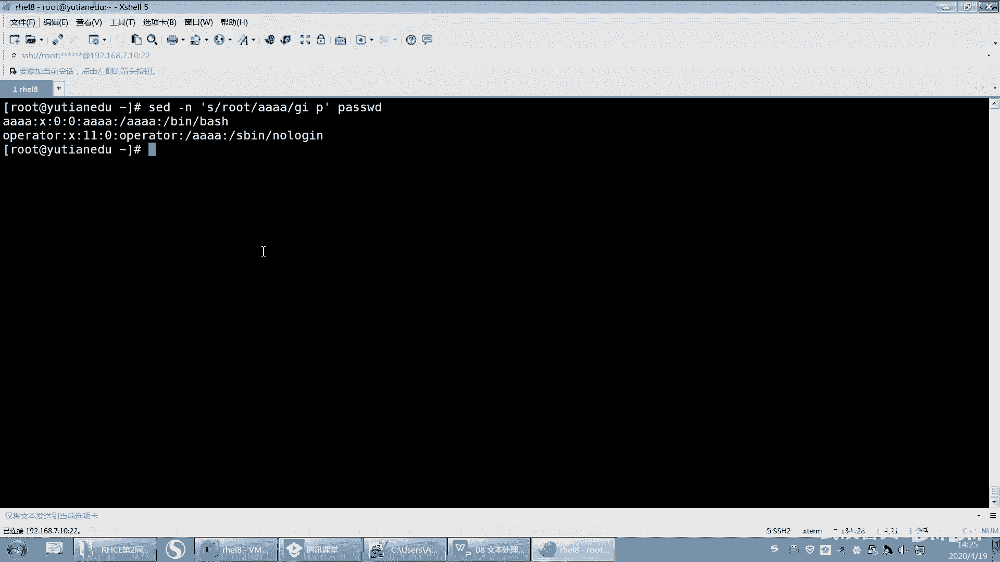

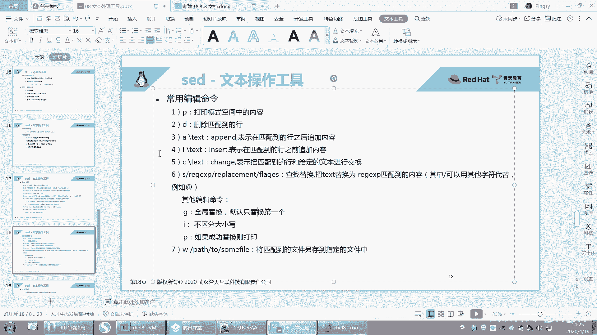

我想一下啊。这样吧，我把这两行。嗯。好，这样啊。我先搞简单一点啊，一逗号2像第第一行跟第二行呃，W就保存第一行1到2第一行跟第二行，然后W是保存保存到root下面的呃这个。呃，word下面的test呃。

test01好吧，保存到这个文件啊。就是W就是另存文嘛，对回车。啊，然后你打开。这应该有一个test。异议。😔，怎么哦，这sorry这东西我加了一个空格啊。那保存过来了吧，我为什么这个地方有个斜杠呢？

那为什么这个地方是因为我这个后面加了个空格啊，他把这个空格也打印进来了，那他把这个空格也算成这个文件的文件名了，所以这样把它去掉2这样啊这样回程。😊，好。然后你你你可以怎么样，你可以加个杠N嘛。

我看杠N是不是可以不用输出，看到没有？要不然他全部就输出一次，OK吧，全部输出一次啊。好，那么这个文件test02里面就是第一行跟第二行OK吧。好，这个是把什么什么另存为哪里哪里啊？

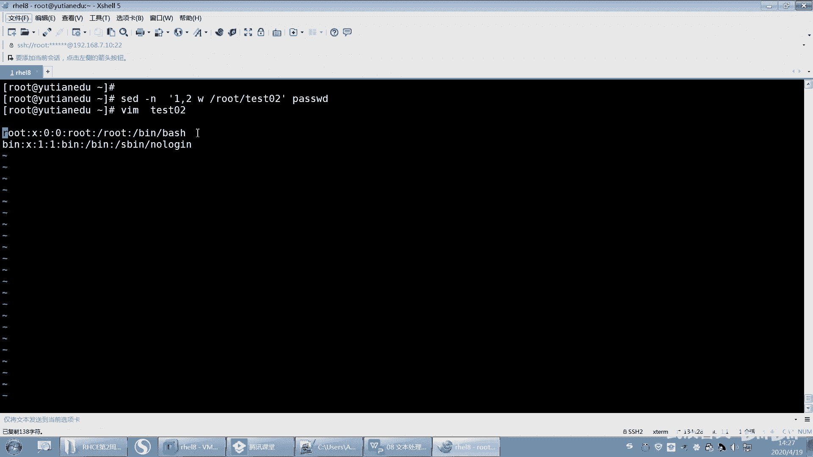

好。嗯。OK了吧，这张过了啊呃我每个都给大家演示了一遍啊。😊，啊呃这个地方有一个地址的说明啊，地址的说明来看一下啊。我们过一遍啊。呃，注意事项，如果没有指定地址。

那么我们的这个命令将会用在每一行每一行对吧？比如打印不指定第几行，那就每一行就打印啊，如果只有一个地址，那么命令则应用这个地址匹配的行。就是有一个地址就匹配那个地址的行码。

然后如果如果用逗号隔开两个地址，那么表示运用在这第一个地址跟第二地址之间，是吧？啊，如果地址后面有感叹号。那么。还有感叹号哎呃表示命令将不应用于匹配到的行。

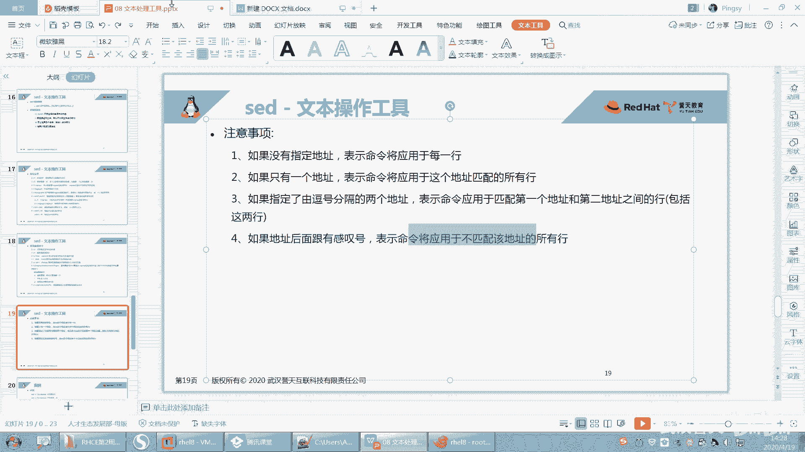

这个就是反选嘛，这是不是就是反选呀？就除了第一行到第二行。呃。叫感叹号。这样子。然后嗯再来。3402。你看是不是除了第一行，第二行，其他都都写进来了，OK吧，就加感叹号啊，这地方你加感叹号。

就除了这一行到这一行之间，就写到这个文件里面。😊，这这跟哪个系统没关系啊。都适用。

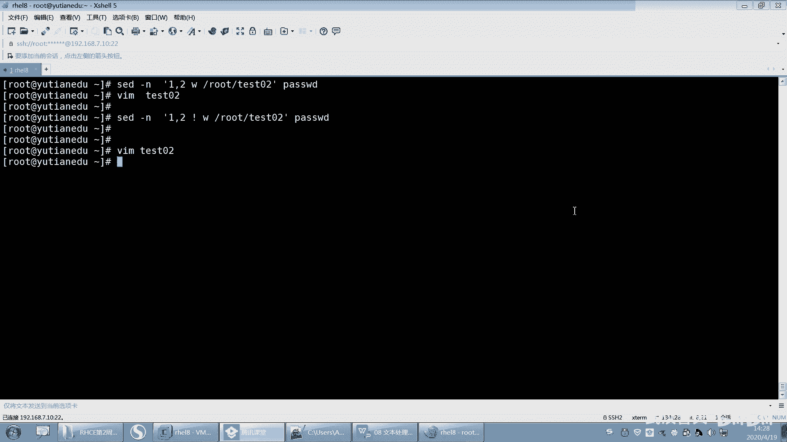

嗯。啊，呃OK这地址注意事项啊。这边有一些例子啊，我给大家写了呃，我特地给大家写在这个地方是吧，怕大家记不赢啊，那打印第五行对吧？然后打印最后一行，打印行第一行到第五行，然后root的行呃。

不行不我忽略大家写，然后带root的行对吧？同上这两个是一样的啊，你看我这样举个例子，用可以用百分号来代替，是吧？😊，然后这是删除第一行到第五行，这个是备份了是吧？将原文件修改完之后，备份一个文件。

把索点BAK。然后这就是在第二行下面插入ABC。OK吧，在第二行下面插入ABC啊。嗯嗯。啊，来了哦，还有一些案例哦。你看我给他家找了辛辛苦苦找的一些例子啊。啊，查找替换的这个还要不要我说。

这个是我之前说过的是吧？就会演示过了啊，SEDS把nse替换成hello后面接文件名，但是只替换这一行的什么第一个nose，对吧？第一个nose啊。

然后SEDSG这是不是替换所有这一行所有的nse都替换。那么这个一指的是我只替换第一行的所有的nose替换成hello是吧？然后这个这个呢这个指的是什么？这个就是呃呃第一行的第一个nse是吧？

然后这个是什么？唉，看好哦。

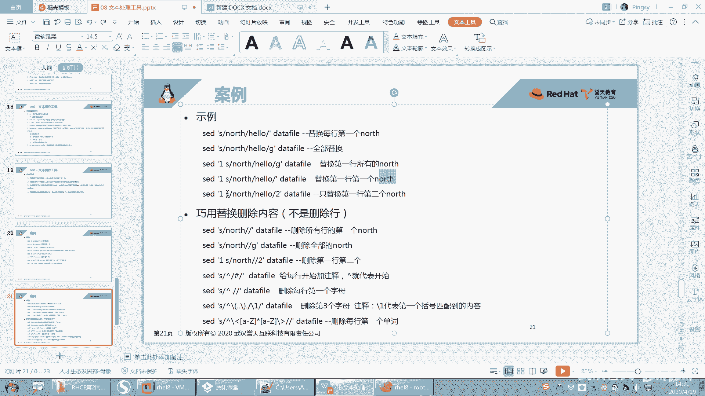

看这里啊。SED。呃，杠N是吧，先把打印出来。啊，我们最终要把它打印出来，把替换的行打印出来啊。啊，我想把S呢就是把root呃root注意root替换成AAAA。然后我想全局替换，我是这样替换的。

对不对？是不是这样啊。呃，你看这三个都替换了，对吧？但是我就有特殊怪癖是吧，要求我就想替换什么，第二个就想替换第二个哟，回车看到没有？第二个就替换了。看到吗？就后面你可以指定替换哪一个。

这个VM我不知道能不能做到啊，我没有试。什么东西好。卡吗？其他同学呢。啊，这个地方就指定替换第这一行的哪一个啊，指定替换那这行哪个。

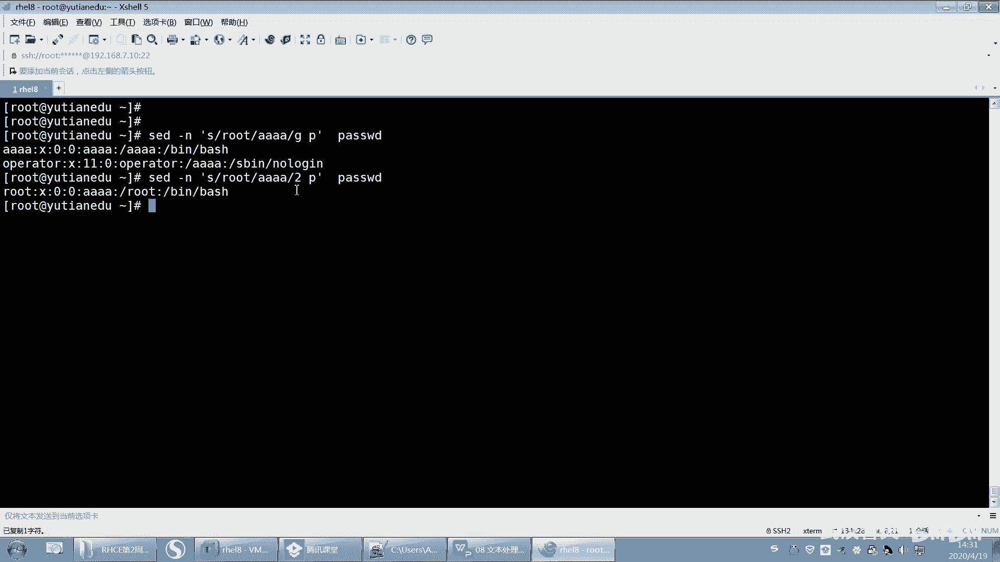

嗯嗯。好，下面是利用替换来巧妙的进行删除内容，而不是删除行，而不是删除行啊。好，这下面的例子很经典啊。好，看第一个。

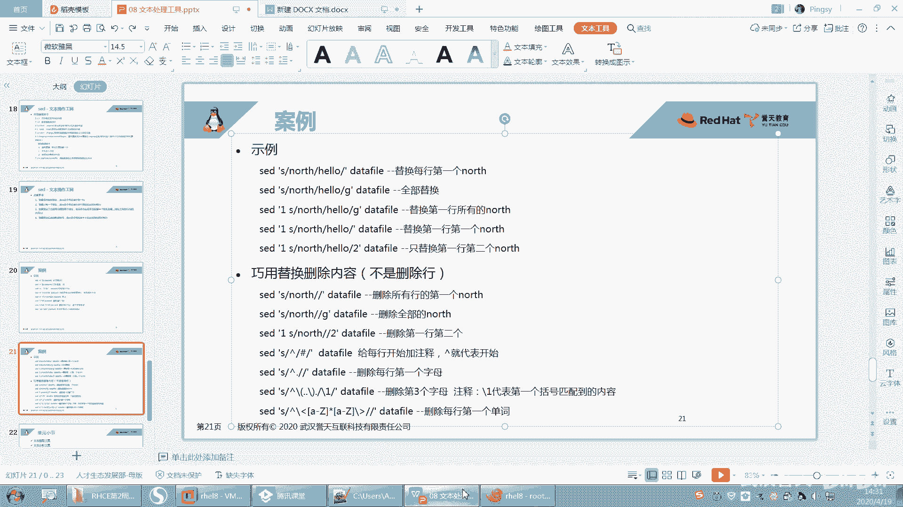

DF杠H哎，我记得有之前有同学是把这个呃。这个什么给截取出来的呀？呃。他把那个。26都整积出来了是吧？嗯，多了多了5。啊，他把这个26就给截取出来了。然后我说呃26%，然后我说要你要截什么。

要截这个26啊。嗯，同学们来告诉我啊，入 card怎么去截这个26。来快速告诉我ca怎么去解这个26啊。啊。用什么呀？用什么来截啊？cut。指定什么为分割符啊？指定呃。算了，我自己说吧。啊。

百分号是不是百分号啊？百分号为分隔符，然后第几个呀，是不是第一个呀？这样是不是就截取出来了，对吧？但是这种我一看哇就好就感觉呃这个没什么技术含量是吧？一看就看清楚了。

但是另外一种你换成SED也可以实现啊。SED呢就可以用什么查找替换。查什么呢？呃，他可以将这个。呃，比如说啊他把这个百分号要替换掉是吧，那就S查找百分号。然后替换成什么呀？空。看到没有？空就什么都不写。

回去了也实现了，看到吗？然后这个百分号是不是指的这个百分号对吧？差个百分号，然后后面这个里面没有写嘛，就没有写，没有写的话，就是空嘛，空就是把它去掉了，相当于把它删掉删了删了啊，是一样的。好。

运用这种技巧的话，我们还可以来实现一些更高级的功能来看一下啊。好，呃，那我现在呢想把这个文件的第一列，就这一列看好哟。这一列全部给删掉，不要了，全部删掉哟。第一个就是说第一列就第一个字母。

每一行的第一个字母我都要删了，不要了。每一行的第一个字母都删掉，不要。怎么做对吧？好，看好啊，眼睛不要眨啊。啊，那你同样也是不是要这样去做？那最后我想把它打印出来，那我就杠N。

最后我要写个P把它打印出来是吧？是这样吧，我先想好吧，之前的内容，然后剩下内容是不是要去做删除了，对吧？好，那删的话，我们针对怎么删呢？第一，它只能删除行，OK吧？好，那我想删呃这个这个第一个字母。

那我就可以用查找替换查找。😊，替换或者把什么插找成什么，替换成什么呢？啊，还记不记得我们有一个间号啊？间号指的就是开头的意思，把开头的。呃，好。这样吧，我们先说另外一个啊，说到这了。

我们可以在这个文件里面前面加一个注释，就是我们之前是用那个VIM来实现的，是吧？啊，那加个注释就在第一第每一行的前面加个注释，那我就可以把。最扛手换成。井号回去了。看到吗？啊。而且你还可以指定什么？

你还可以指定第几行，比如说1到第1行。S回撤。然后你再加一个什么，再加一个我加一个I，你就实现了什么。

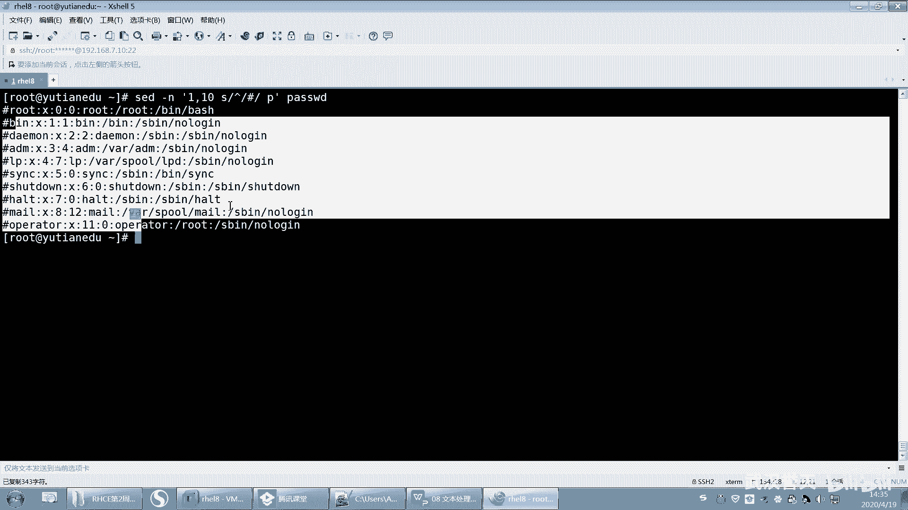