# 【已更新】最新版丨誉天红帽RHCE 8.0系列培训视频 - P3：rhel8.0系统安装-03 - 武汉誉天 - BV1cv411q74E

好，具体选什么语言，到时候开机之后还会让你让我去选择。好了，那就是这个语言啊语言。然后下面这个是这个。日日日期是吧。日期啊。啊，这里我们选择这个地方啊，我们选可以去你可以点一下，大概在这个位置。

我们是选择。A下上海。就是亚洲、上海啊，我们计算机的时间一般很少听说这个这个北京时间是吧？一般是上海时间，还有新疆、乌鲁木齐时间、重庆时间等等这些时间啊。所以这个是我们的时间时间啊，大家可以选一下。

OK吧啊，这里其实你看他他画了一些这个时区是吧？这个大家应该知道吧。嗯，时区呀。我们其实这个时间啊，而且下面我看一下啊。

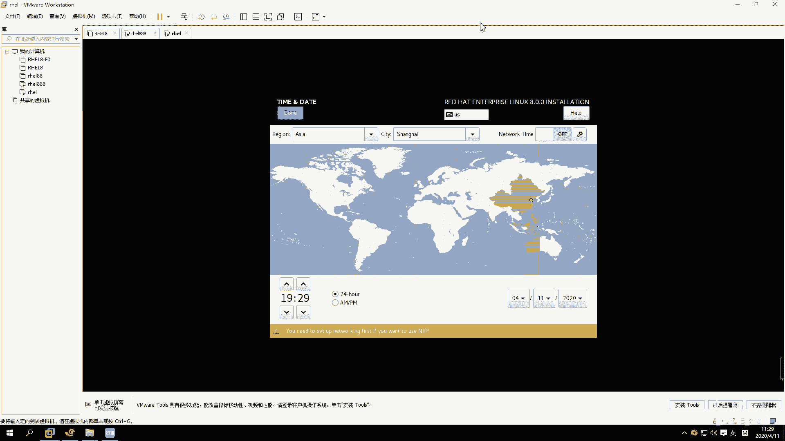

嗯。

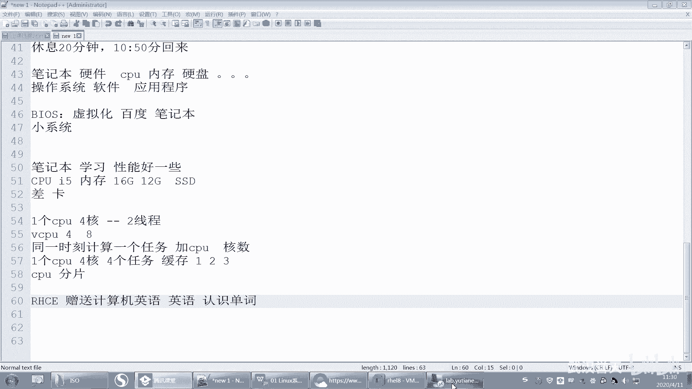

这楚。

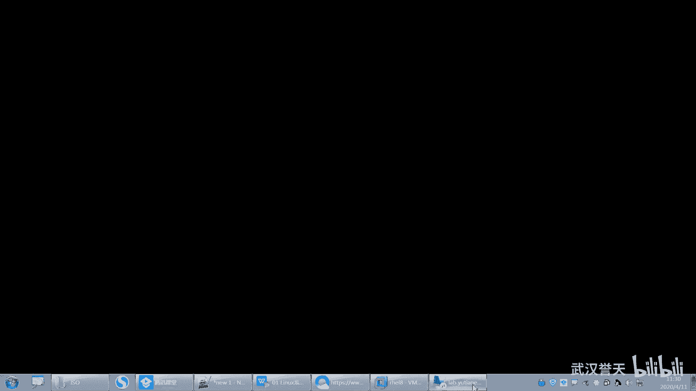

好，你们聊天记录我看不到的时候，你们你你就待会我再看啊，因为有时候点来点去就看不到了。好，然后这个时间呢你就嗯这是一个本地时间，对本地时间。然后右面有个网络时间，就是如果你将来系统不准了是吧？

系统时间不准了，它就会向网络时间同步。不过这个呢我们先不用管它啊，将来我们装好系统之后，我们可以去设置它。去设置它啊。好，这个就是我们的这个时间啊，时间选一下，好吧，选一下时区。选一下就你点不到的话。

你就在这选，在这选，找着找一下ok。啊，选了时区之后，你说我怎么选了时区之后，我就知道我的时间是多少了呢？好，注意啊，我们这个时嗯你们学有学地理吧，应该有学地理吧。我们地理上有分是吗？

是将全球分成了多少个时区啊，知不知道啊？这个跟地理就没什么关系了是吧？对，分了24个时区啊，因为一天是24小时，每一个小时呢就是每一个时区就是一个代表一个小时。那中国是在哪个时区啊，知不知道？嗯。

东八区啊，对，中国是在东八区啊。嗯因为我们最早的时候，它这边有一个本出，它有一个那个本本出自五线是吧？我记得是在英国好像是经过穿过英国，有一个本就是有个本出自五五线，然后我们往东数的话就是属八个时区。

就是呃这个时区，然后这边数的话，就是西西级区，对吧？西级区啊。

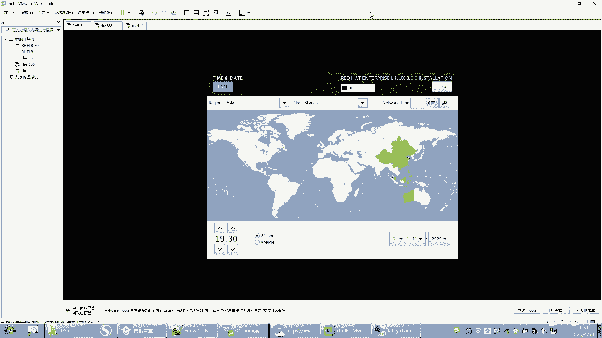

唉，每隔一个时期就相当一个小时呃，相差一个小时啊。呃，我们后面会有个时间叫UTC时间，UTC时间呃，这个UTC时间啊跟我们相差一般是相差8个小时的。就说我们这个我们这个时间，比如说你是上海时间。

这个时间就应该是什么？应该是本地时间啊，那么UTC时间跟我们这个时间相差什么？相差8个小时。UTC时间是世界统一协调时间啊，所以它是在什么在这个位置在那个本初字五线那个附近啊，叫格林威治时间，对吧？

大概是在那附近啊。以前是在那个位置，后来说时间有点不准，就在那附近啊，穿过英国一个小镇叫格林威治。啊，那个时间是比如说那个时间是0点，那我们就是8点早上8点是吧？我们比较要快8个小时啊。

有些时候我们要去选择UTC时间，而不是本地时间。这个要看我们的服务器是不是跨国的。一般跨国的话都要用UTC时间统一协调时间啊，否则如果大家都用本地时间。那么比如说那个那个美国用本地时间。

我们也用本地时间是吧？那么这个时间这个每次用时间，我们就是传输数据的时候，如果时间作为一个参参数的话，你们可能时间不一致。对，还就会导致可能会失败，防不到啊等等。所以这个是UTC时间啊。

后面我们讲时间的时候还会再说到啊。嗯。

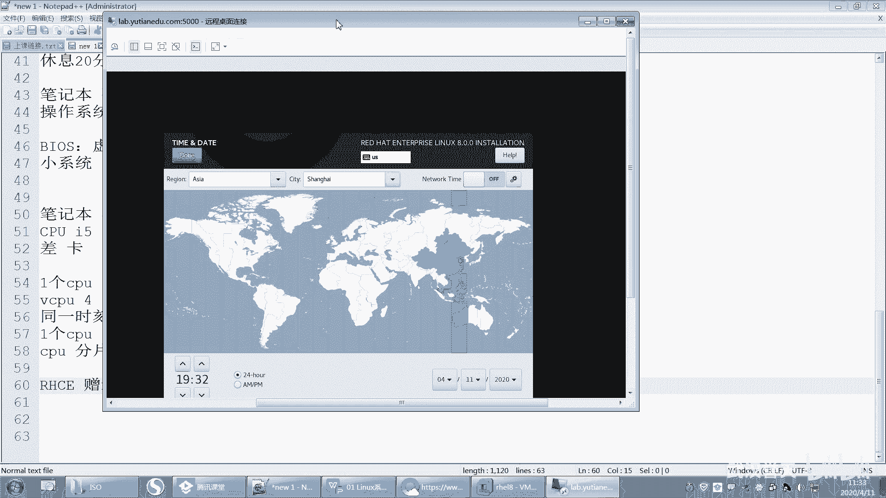

对。好，这个要去了解一下啊。OK确认啊。然后右边这个是安装员，看这儿啊，这有个安装员，这个安装员自动检测到了我们那个什么我们那个。哎呀，我为什么要点这个？好。这个是我们那个安装员啊。

它自动检测到我的什么ISO了。

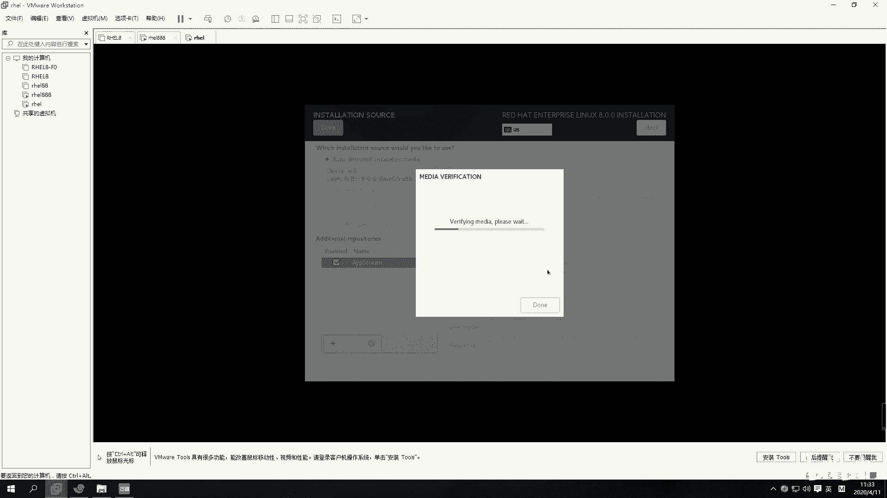

我手欠了，点这个鬼。

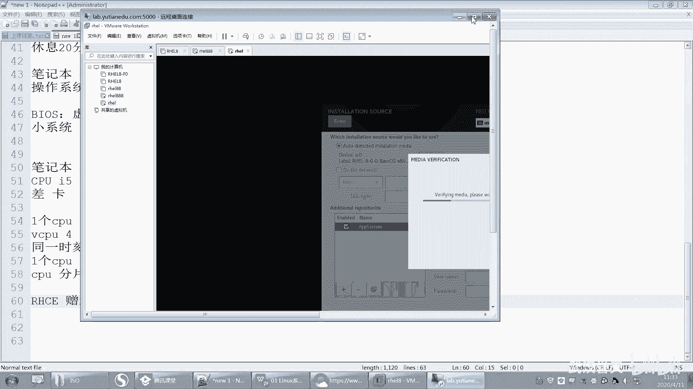

这边还等着吧。他应该是不是在检测呀？好，你看下面这个地方有个叫under the network，这个就可以从网络安装，就是你的安装安装员可以在网络当中，你可以把网络的地址写在这个地方啊。看到没有？

那下面这个是吧，就是它可以从网络安装啊。像我们之前我们在教室里面的时候，我们就让大家从网络安装，就那个安装员在就是在网络里面啊，在这个通过网络的形式去安装。好，其实就是你的ISO文件在网络当中啊。啊。

这个就默认就行了。然后下面这个是选择什么？选择我们安装的这个软件。其实这句话是什么。它是软件选择啊，就是在这个地方你可以选择你在装的时候。装什么样的软件，但是你不能一个个一个个去选择是吧？

它就给你归归个类。比如说啊这个第一个叫server with GI，还有个叫一般是这两个用的比较多，一个叫minim installminim叫最小化安装，它可以实现什bas function是吧？

就是实现一个最基本的功能。那么这个最小化安装的，它安装出来只有部分的是么？它只它就是呃软件包安的比较少，然后装出来也比较快，那个系统比较小，对吧？嗯，但是它很多那个功能都没有实现，很多包都没有装。

如果你想快速安装的话，你就选第三个，但是装完这个之后是只有字符界面，没有同一界面的，没有同一界面啊。好，所以我如果我们第一次学习的话，我们还是安装带有图形界面的。

带有图形界面就是这个第一个叫serv with GOIG的G的话，就是这个啊G就是graph graphic叫。叫什么？叫图形的啊图形的U呢就是user，叫用户。I就是interface接口。

叫图形用户接口，所以叫GUI啊GUI对。

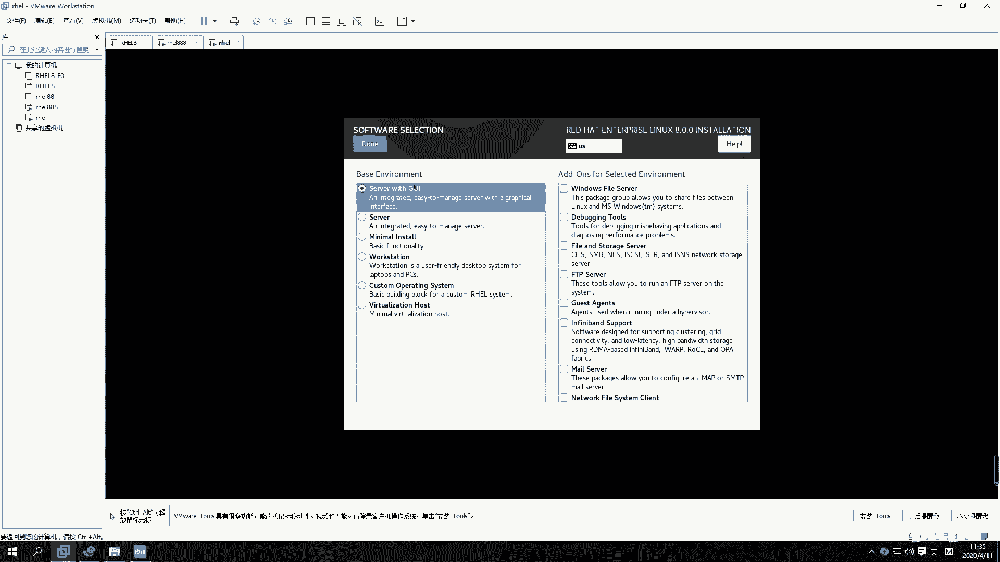

对，就这个有点知道啊，就GU我们经常会看到这个GUI呀和CMD是吧？😊，呃，CLI是吧。呃，这个是图形的，这个是命令行的呃，命令行叫command line嘛。这最基本单词要知道啊。呃。

common line嘛CL是吧？对com on line interfaceGUI就是图形用户接口啊，图形用户接口。好。

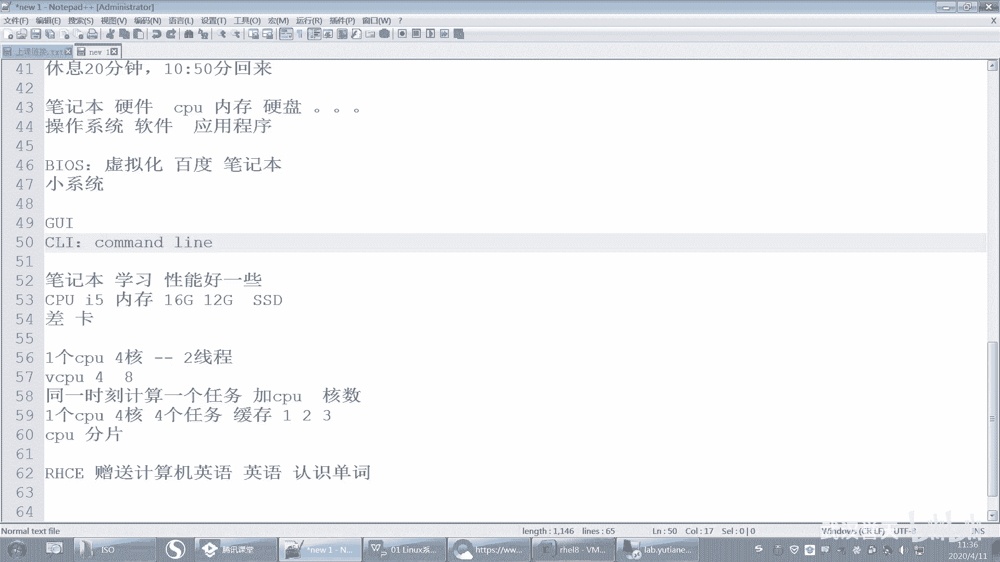

所以装这个就是图形，那右边这个要不要勾啊，这个都不需要勾，听到没有？都不需要勾啊。好，你看比如说它是要实现我什么文件ser是吧？或者什么实现FTB那你把这个勾勾上，它就会额外去安装一些软件包。

去实现这个功能。那这个不需要勾呃，如果你想去实现的话，将来我们直接在后面装好系统之后再去安装也可以啊。呃，如果你在勾勾上了，将来装包装系统的时候就非常慢，它装的包就很多啊，你就不要勾了。

O默认就第一个就可以了啊。好，确认。嗯。好，右边这个地方右边这个地方叫sstem，叫系统，那么叫安装instalulation destinationest，这个看不见了啊。叫安装目的地呃。

installation叫安装destination叫目的地d啊，点开进去就是说现在要分区了，现在要分区了啊，要知道分区吧，你们装过windows的，应该都知道是吧？它会一个分区，你把系统盘。

哪个C盘给多大，D盘给多大，对吧？啊，要不要分区啊？啊。然后我们选上这个啊，我们把那如果你有多块盘，你可以选择其中一个盘，把勾勾上，然后它就可以装在这个盘上20G20G。好。

然后这个存储配置那个下面这个有个那下面如果你还要呃去，比如说你再添加新的磁盘，这地方有会添加新的磁盘。啊，那下面呢是做分区配置，那分区你可以直接这样就过了，它它就自动安装了，自动安装了。好。

那我们呢选择手动装，选择后面这个啊叫customer。呃，oautomatic叫自动的customer，是我们手动装啊，手动装好吧，你们选择第二个手动装上啊。好，你点一下这个d完成，点一下再点一下。

就是你点一下，有时候不行，你就点两下。如果动了，你就不要点两下了啊。好，那么这个地方我们开始分区，呃，这里有个加号减号，加号是加加一个分区就去掉一个分区是吧？好，那这个地方是这个分区的类型。

这个分区的类型呢，这个地方默认是逻辑卷，对吧？我们就先不要选逻辑卷啊，逻辑卷的话我们后面会讲。嗯，你先不要选逻辑卷，它默认就是逻辑卷啊，你要选标准分区，你说老师什么是标准分区，不管它你就先选就行了啊。

对，先选就行了，选个标准分区，standard partition啊，standard partition标准分区好，然后这边点上加号，加上添加一个新的分区，就选一个加号啊。好，呃。

我们在这个地方添加一个什么叫mountpoint是吧？叫挂载点好，叫挂载点。好，这个地方我跟大家稍微简单的先说一下啊，这个跟文件系统结构有关了，跟文件系统结构有关了啊。后面我们会单独会有一门讲。

会有一张是讲文件系统的。但是在这个地方我有分区，所以跟大家把这个文件系统结构稍微简单的过一下。

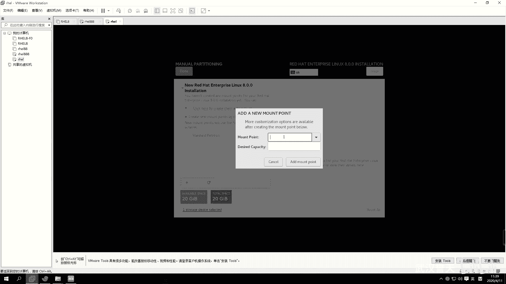

呃，先听一下啊。大概听大概听一下就行了啊。好，你说的是分区吗？好，呃，现在如果说我有一块磁盘啊，我有一块磁盘。这个磁盘呢我比如说我分了几个区啊，比如说我分。我这个地方分几个区啊呃分一个区呃。

分两个区分三个区啊，其实我这个磁盘不分区是不是也可以，对吧？你呃装windows的同学大家都知道啊，你不分区就一块就一块盘作为系统盘，作为那个C盘也可以。那你分完之后，比如说这个是windows的。

那就是C盘嘛，是不是C盘啊，然后这就是D盘嘛，对吧？这就是E盘，还有F盘，对吧？那么C盘呢，这个上面一个分区，这个上面一定会格式化文件系统格式化了，就是有个分区要格式化。嗯，那格式化有什么用呢？

大家一般听到格式化，就是一般就就是觉得哎呀把数据搞没了是吧？好，你先不管格式化是什么，你就知道有了格式化，格式化了之后，它就可以存文件了。呃，格式化之后，它就可以存文件了啊。好，所以要想存文件。

它都要进行格式化啊，都要进行格式化啊。同样D盘想要存文件都要进行格式化啊。好，那么这个C呢，我们先看一下windows啊，我们对比来看一下，因为大家对windows比较熟了嘛。C盘这个C呢它就是驱动号。

这个C代表驱动号。驱动号啊驱动号。呃，呃你们在C盘这个这个这个在那个windows在分区的时候，它会选择驱动号，你可以自己去选选C啊、D啊、E呀、F啊，对吧？这个叫驱动号啊，D叫驱动号啊。好。

那么你看啊这个地方呢。这是不是有几个驱动号？这个是其实这个本地磁盘，这个地方叫什么？叫券标，它就还有个起名字叫券标，你个最标可以修改的吧，对不对？这个卷标是可以修改的啊。嗯，重命名啊，它可以选修改。

但是这个驱动号一般选完之后就不能变了，就驱动号啊。啊，那么整个这个图标呢，这个图标你看啊这个图标这个图标叫什么呢？叫盘符，我们给它起个名字叫盘符啊。哦，叫盘浮。好。

那么如果我有一个U盘插入到这个PC机上面，它没有给我分配盘符，就是没有这个图标。那我是不是就没有办法去访问到这个。这个盘里面的什么数据是这样吧？大家知道你U盘如果识别不到，对吧？没有给它分配盘符。

它就是它就无法进到这个里面去访问数据。所以我们在这个什么，我们在这个windows当中，我们是通过盘符来进入到什么，通过盘符，然后进入分区。存什么存数据的是这样吧。哎，通过盘符，然后进入分区去存数据啊。

好，那么这个是我们把这些概念先了解清楚啊啊，这个是我们windows的。啊。再来啊。下面我们再说一下windows的目录结构是什么样子啊，windows目录结构其实也比较清楚啊。你像如果我进入到呃。

我进入到D盘，对吧？我就可以在这儿进，你看啊，我进入到某一个目录下面，那么这个目录是不是会有个路径，看到没有？会有个路径在这里有D呀，D什么什么什么是吧？好，然前面这个是就呃。

那中间这个斜杠就是这个目录是这个目录的副目录是吧，他们两个就是父子关系嘛，那它就是子目录，它就是副目录，这个没问题吧。好，那我进入到D盘的任何一个，比如说进入到D盘的任何一个，比如说目录下面。

是不是都是从D开始，这个路径是不是从从D开始，对吧？啊，所以我们的这个目录结构是什么样？大概是这样子啊，比如说是C盘开始。C盘开始对吧？是这样，它是反斜杠啊，就反斜杠。嗯。好，那么从C开始。

下面这个C到下面就会有一个什么，就会有一些目录。C盘下面是不是就会有一些目录啊，是吧？比如说你看这个C盘下面。是不是有这些目录啊，对不对？好，那这些目录下面是不是还有可能会有目录啊，我这样去画啊啊。

这个目录下面还还有目录，这个目录下面还有目录，然后目录下面是不是还有目录，目录下面还有目录。对，这个应该大家比较好理解啊。啊，那这样的话我们就会以看到这个C盘的目录结构，它大概是一个什么呀？😊。

它大概是一个这样的。就像一个树一样，像一个树啊。什么叫树啊？树是不是有根有枝是吧？有叶子，但是这个树呢它是个倒数倒数的啊。倒数状。是不是倒数状啊？反过来了跟在什么，根在上面。

然后树枝跟树叶是不是在下面啊，这树枝树叶是不是都是目录跟什么文件，对不对？目录跟文件就组成了树枝跟树叶啊，组成了树枝跟树叶。好，那么这是C盘的目录结构，同理可得D盘呢，是不是也是什么？第一盘。

D盘D盘是不是也是一个倒处状的呀？D盘也是一个倒数状的啊，啊同理E盘也是个倒数状。那么C盘跟D盘的目录结构会不会有交叉呢？就是这个哎呀E呀指到什么，指到别的地方了，他们两个按理来说是不会有交叉的。

能不能理解？当然这个有一种可能性就是那个叫快捷方式是吧？是快捷方式啊。我们先不考虑那个啊嗯快递快捷方式是比较特殊的一个文件。哦，那么。也就是说，C盘的目录结构跟D盘是不会有交叉部分的对，就是D盘。

对不对？这就是D盘啊。好，那同样一盘也是这样，CDE的目录结构是分开的。好，那我们说windows的目录结构就什么多根倒竖状结构叫多根。倒竖状结构是吧？好，那么每一根树它都会有对应的什么？

都会有对应的分区。那它都会有对应的分区。那么这根树的数据都是不是放在什么？放在C盘上，第二根树放在D盘上，第三根树放在E盘上。这这样说我能大家能听懂吗？这样说大家能听懂吗？好嗯。嗯。

实际过程中逻辑卷这个看场景，看应用场景，逻辑卷跟分区它都会有自己的优缺点。哦，分不分呃，如果你觉得分区对你来说没什么，你就不分也行，你不用手动分也可以，好吧。嗯，好，我慢慢来慢慢来啊，不要慌啊。啊。

然后这个是这个windows的啊，那我现在把windows讲完之后，你再来看这个linux，你会这个非常清楚啊。linux呢跟windows的目录结构它区别还是很大的。比如说现在呢呃我们有一块盘对吧？

这块盘呢分不分区呢，我们我们待会儿再说啊啊，windows的目录呃linux的目录结构，它只有一棵树，叫一棵单根单根。单根啊。倒树状。就一个就一棵树，那这棵树的根叫什么呢？就叫根，就叫斜杠。这叫斜杠啊。

这就是根，好吧，就根啊。啊，这是一个目录，OK吧？这是个目录啊啊，目录上面会有什么？会有子目录。目录下面会有子目录啊。啊，子目录下面，比如说我这个有一个目录叫它的路径是是这样写的，比如叫。

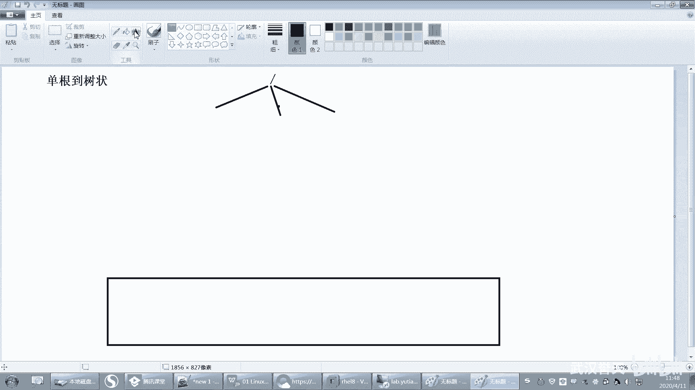