# 【已更新】最新版丨誉天红帽RHCE 8.0系列培训视频 - P40：文本处理工具2-40 - 武汉誉天 - BV1cv411q74E

十行。S回去了。然后你再加一个什么，再加一个我加一个I，你就实现了什么修改原文件了。所以你还VM是吧，就不用学了是吧？😡，O。所以。你看这个SED功能非常强大啊。

这就是巧妙的运用我们这个什么查找替换来去实现删除字符串。对，删除字符串啊。好。因为前面是不是可以匹配行，你想匹配哪一行就匹配哪一行嘛。那后面就是你要做的事情，对不对？啊。

那刚刚我们说到是在最前面加上一个井号。那如果说我想把第一个单词给删掉呢，就是说第一个R删掉B删掉，D删掉，现在你会了吗？R呢RBD这些第一个字母给删掉啊，其实也很简单。

只需要我们匹配第一个是不是通过什么？通过这个呃井号，但是井号第一个字母怎么匹配，我怎么去匹配第一个字母而，井号点点代表是任意字符。记不记得啊正则表示当中点是不是代表任何一个字符啊，无论这个字符是什么。

它就是任何一个字符啊，你是A也好，是什么也好。好，然后回去了。一呀。我神了吧。你加个杠，哎呀。删了两次啊，删了两次，我把原文件给替换了。你看我把原文件给替换了一次啊，刚刚。刚刚执行了个I，对吧？啊。

然后杠N的话，你看它是不是就是把第一个字母给删掉了呀，对不对？啊，看懂了吗？这个。

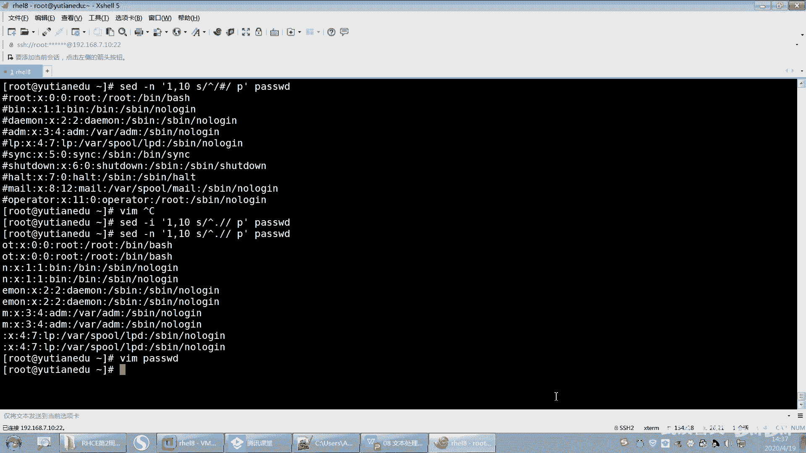

好，这个我例子也放在这儿了啊，大家可以去用一下，而且插好替换的时候哦，这个地方哦，这个例子跟这个例子是一样的，是吧？啊，我就重复写了啊。哦，哦这个不一样不一样啊，这个是删除是吧？

这个是将这个nse第二个nose这一行第一行的第二个nse替换成空，就是将第一行的第二个nse去掉，那去掉空嘛就去掉，对吧？好，我们刚刚实现了什么删除每一行的第一个字母，我们删掉了。

那下面还有一个更复杂的，看到没有？更复杂的哟。

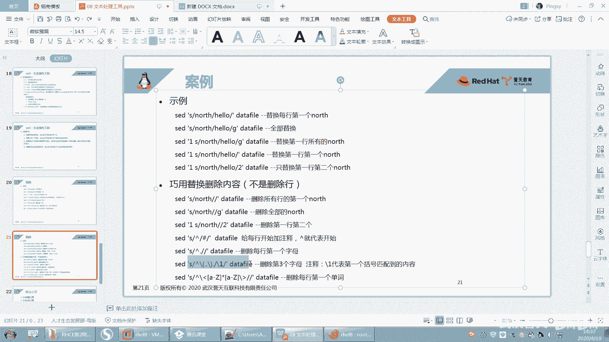

好，我们这个也来试一下啊。呃，我想。你看啊。嗯，他是我的。然后。我想干什么呢？我想把这个每一行的第三个字母删掉，那我怎么去匹配第三个字母呢？S。对吧啊，匹配第三个字母呃，第三个字母是怎么匹配？

是不是这样点点点。这个地方是不是就是第三个字母，那这个地方是不是第三个字母，第三个点是不是就第三个字母，对吧？然后。把它替换成什么呢？啊，这样啊，那我替换成什么东西呢？难道替换成点点吗？

你这点点代表什么呢？好，所以我把这个前面这个地方呢用个小括号把它括起来。

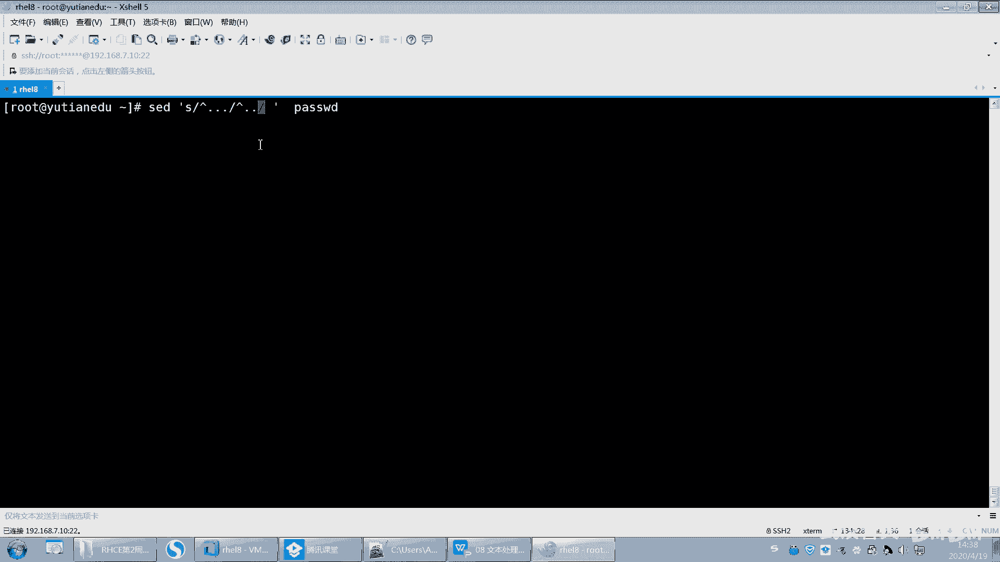

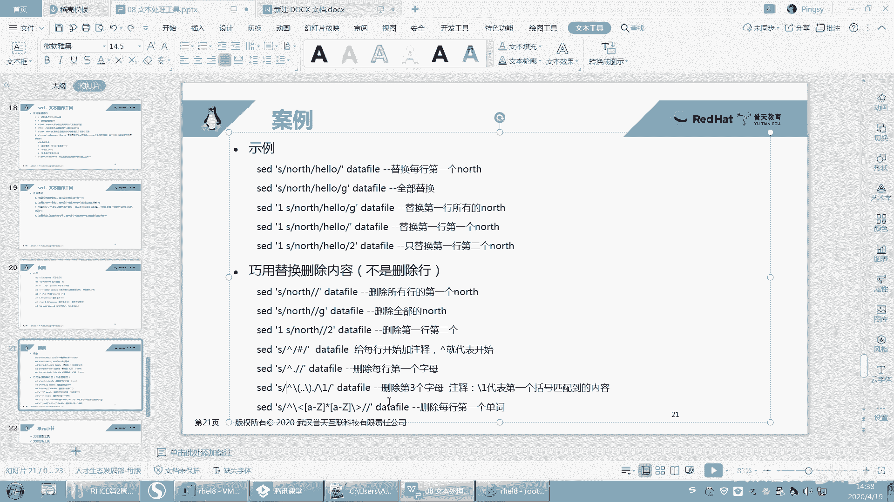

小括号括起来。小括号扣起来啊。啊，小括号因为加地方会有特殊字特殊含义，所以我们需要把它特殊含义去掉，加感叹号，不是加个反斜杠。好，那么后面我们是不是我这样写啊，斜杠一啊，斜杠一指的是什么呢？

它指的是我们小括号括起来的。因为我们小括号括起来作为一个作为一个整体，我们这件正则表示当中。

有这样一个吧，那小括括起来，是不是做一个整体，做一个单向处理，对吧？

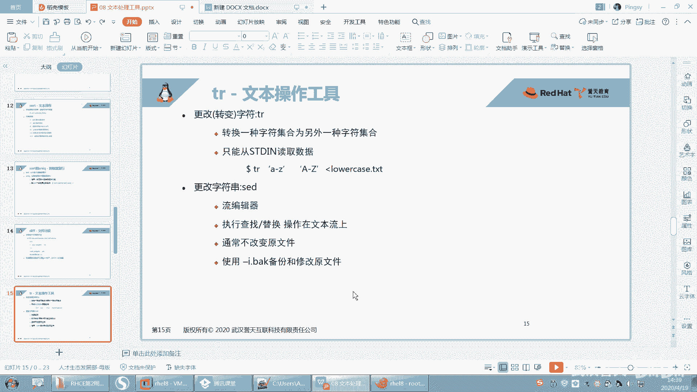

那么这个。这个反斜杠一呢指的就是小括号匹配的第一个小括号回去。第三个字母就删掉了。你看本来是OOT。那OO只是T就没了，只剩OO了。没问题吧。那本来是个T的是吧，所以就把第三个字母给替换掉了。

不知道大家看懂了没有啊？好，我再说一遍，我就不说了啊，没听懂就你就没听懂吧。😡，啊，这个点点是不是指的什么？指的是不是前两个字符，以什么什么开头嘛，然后这不是三个字符嘛。

然后我用我把这个点点是用小括号括起来了，作为一个整体，对吧？然后替换成什么？替换成斜杠一，斜杠一指的就是我小括号括起来第一个字符啊，第小括号括起来第一个项那小括号括第一个小括号括起来的内容。OK吧。

就是7杠1啊。好，这是一些比较经典的用法啊。

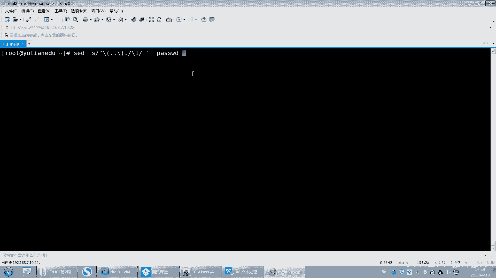

嗯。还有还有一个下面是吧，下面还有一个。那这个是什么？哦，删除每一行的第一个单词是吧？每一行第一个单词哇，这个也比较经典是吧？你看啊呃我我带你看一下好不好？第一个单词是不是以什么什么开头，对吧？

第一个单词嘛，然后单词是不是以单词是以什么开头，单词是以字母开头，那我认为是字母开头，然后这个是指什么？这个是不是指一个一个单词的开头，然后这个是指一个单词的结尾对吧？然后这个地方这个是什么？

这个是不是指我匹配一个字母啊。😊，啊，然后这个星号是不是匹配呃0到多次，匹配0到多次，对吧？然后以字母开头以字母开头以字母结束，中间有若干个字符。OK吧，中间有若干个字符啊。

然后那就那这个就是把第一个单词删掉，你自己去试吧，好吧，或者我帮你执行一下也可以。

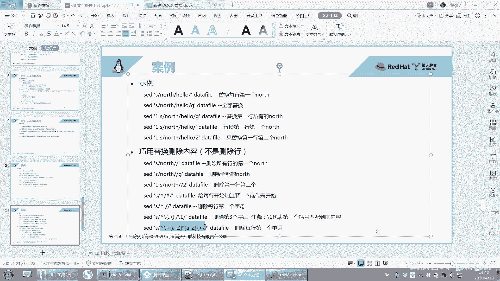

比如说把第一个单词删掉。好，看到没有？第一个单词就没有了。那就冒号前面是一个单词嘛，第一个单词就没有了啊。

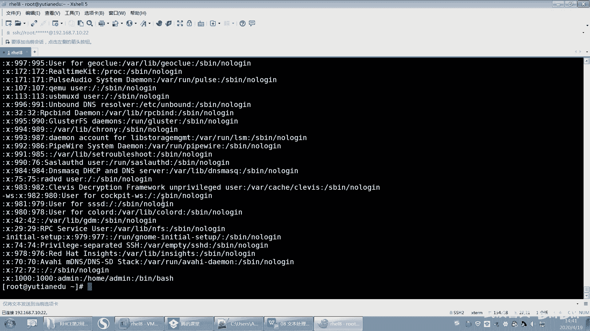

啊，这够了吧。不说了啊，说多了也记不住。O。好呃。绕晕了是吧？下次不讲这么多了，我看他绕晕了啊。😊，好了，说完了SED说完了啊。呃，当然SED的功能不仅呃不止如此啊，它还有呃其他的一些功能。

如果你们想对吧？再深入去学习，这个你们可以再去找一些资料去学习一下。我就讲这么多，不说多了啊，说多了你们大家都晕了。好。这是一些比较经典的，你你你就把这些弄会了就行了。那我就过了啊过了啊。好。嗯。

SED这块呢我们分了几部分啊，分了几部分命令，对吧？然后选项选项大概用的比较多的就是杠N杠I杠E杠R。如果用到用到了扩展正则的话，那你就要要用杠R了啊。比如说。

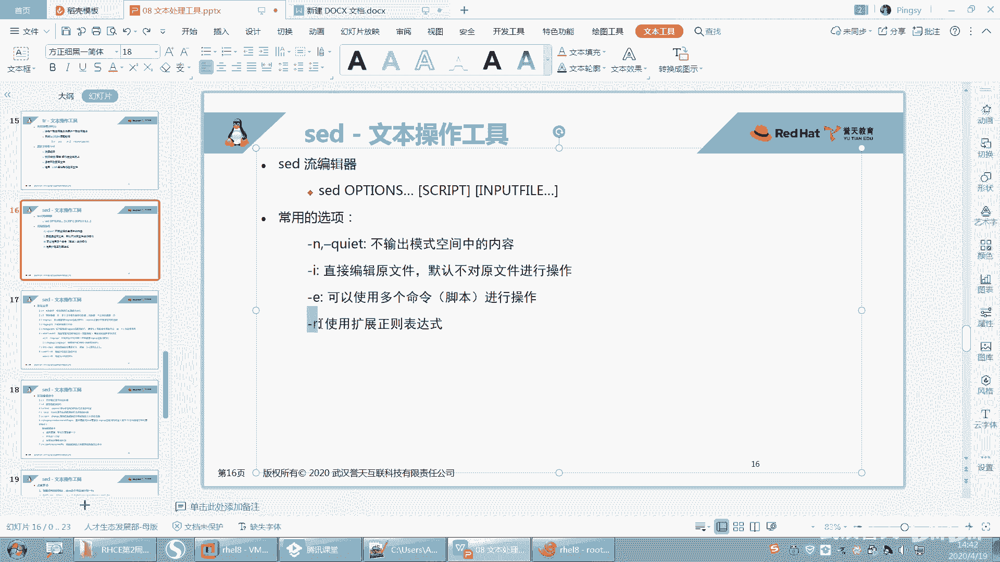

什么时候用到扩展正则，你还可以这样SED杠R，对吧？比如说或者我们在用的时候，我们可以比如说呃root或者什么或者user替换成什么什么东西，对吧？能理解吧？就S吗？No。啊。

或者这样的话它就能识别到什么？识别到这个树干嘛，就或者的意思。然后把这个替换成哎这样子啊，就就要需要就需要用到这个扩展工则啊，扩展工则。

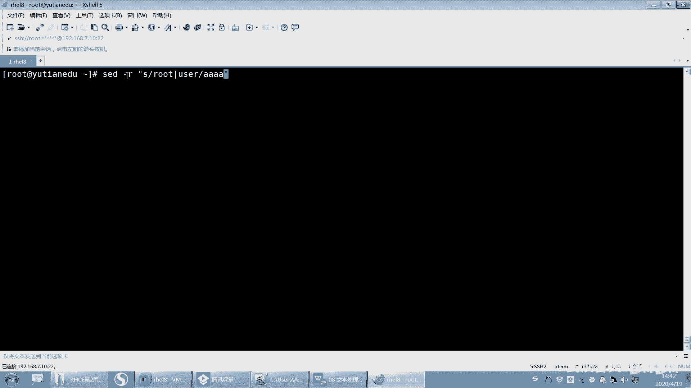

嗯。你们晕了是没听懂还是还是怎么回事，还是觉多了晕了。我讲的你们都听懂了没有啊？你不需要消化，你只需要看我演示就可以了。嗯，怎么这么多事儿呢？给你们讲多了，又说多了，又想少了，一些少了是吧？嗯。好。嗯。

这东西讲一遍，你能听懂就可以了。你还想把它记下来，这个很难，好吧，这个不太可能，除非你是那个。除非你你你的记忆力超强，否则你这个。想接下来很。好了，那我们把它关了啊。好，就说到这儿了啊，就说到这了。

SED。

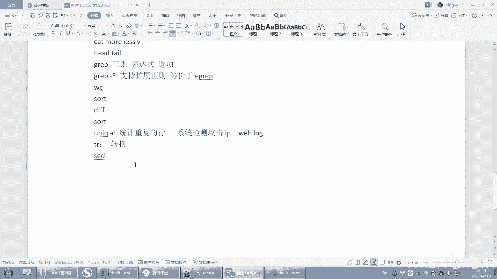

反正我都是讲了你们。我我我我应该每个例子我都给大家演示了，而且每一部分我都给大家解释了。嗯，如果你觉得自己没跟上的话，你就在看视频。嗯。再去下去再复习一下。呃，其实我基本上我讲了一堂课，你可能要花。呃。

两遍或者三遍的时间要去把它补回来，然后要然后去才能才能去消化，才能去慢慢哦感觉是那么一个意思了啊，那你上课的任务就是能看我演示，看我能把每一部分给你解释了，你知道哦，是这么回事就行了。嗯。

因为这内容太多了，我没指望大家去记住。嗯。你想气死我吗？你不用肯定会忘记啊，但关键是什么？关键是你要把这些例子要记下来，用的时候拿回去怎么样啊，拿回去就就嗯到时候直接用就去查。对啊。

用的时候直接查就行了，都没没没指望大家就要去记住它。因为这东西太多了，不可能记住的，包括我也不可能记住，而且我要去用的时话，我要我可能要去查，你只要有笔记记下来，这是为什么你要你们要去记笔记。😡。

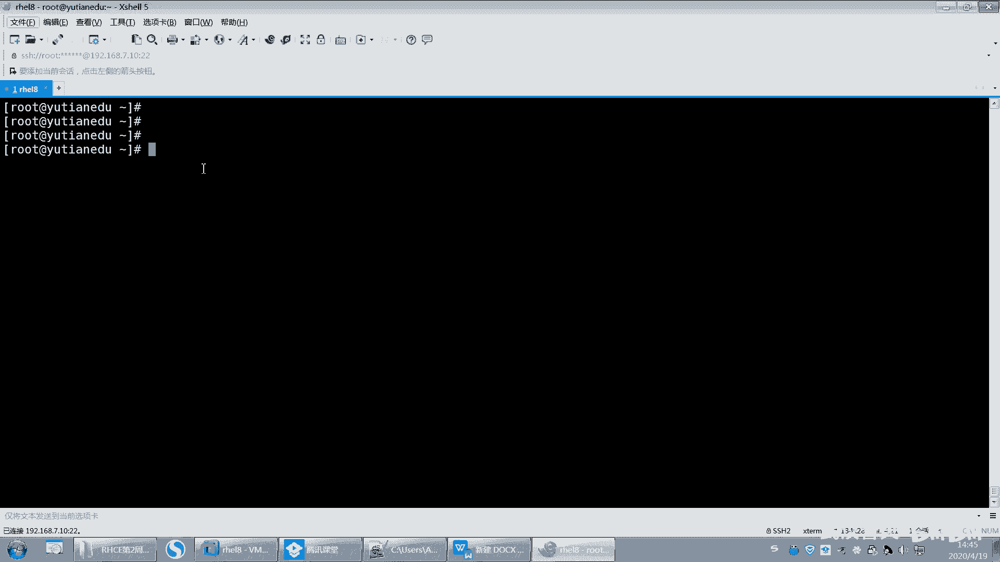

这就是这个作用啊，对吧？你要你要知道有第一要知道有这个东西。第二，你要有记录。你要知道大概我们其中我讲过这些选项，讲过这些正策表示，每一个是指什么意思，这些你知道就可以了。😡。

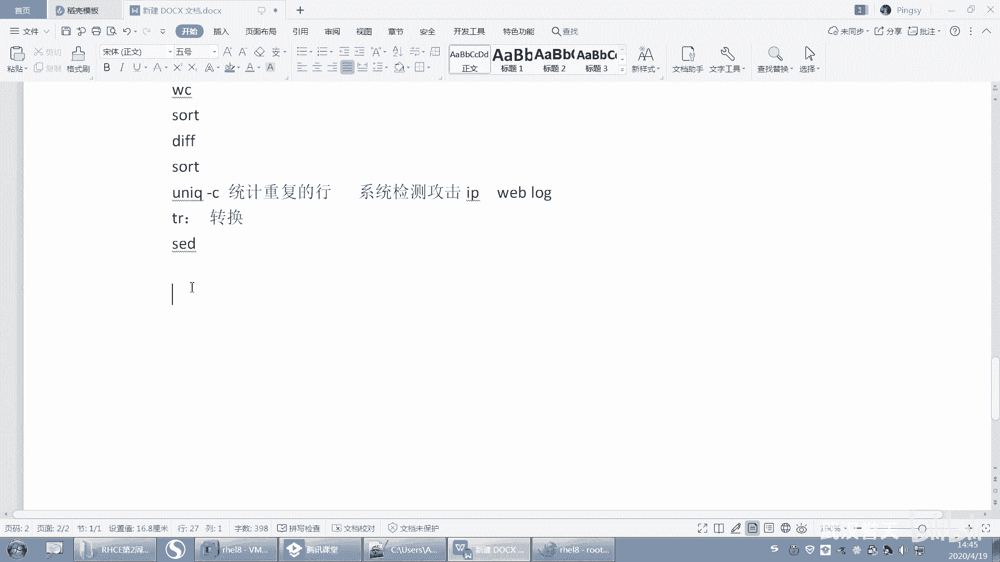

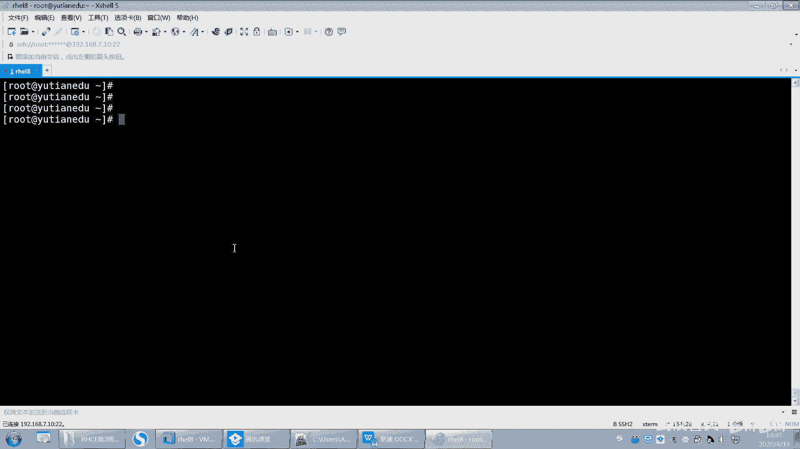

废话不说了啊。就看这个我我交了，那你们后面怎么样，就靠你们自己的造化了啊。哎哎哎哎哎，怎么又点掉摄像头了？好了。嗯。Mhhm。好。PPT不是给大家做好了吗？你看我为大家想的。😡，这么周到是吧。

例子也给大家举好，每一个都解释说好，然后还可以你全部演示出来。我就没见过像我这么好的老师了。

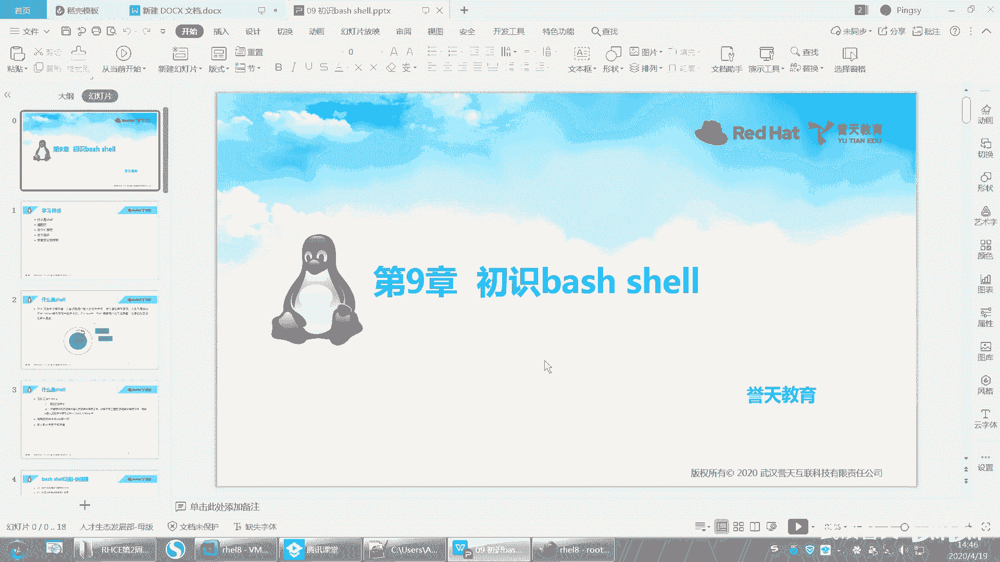

好嗯，那我们继续啊。