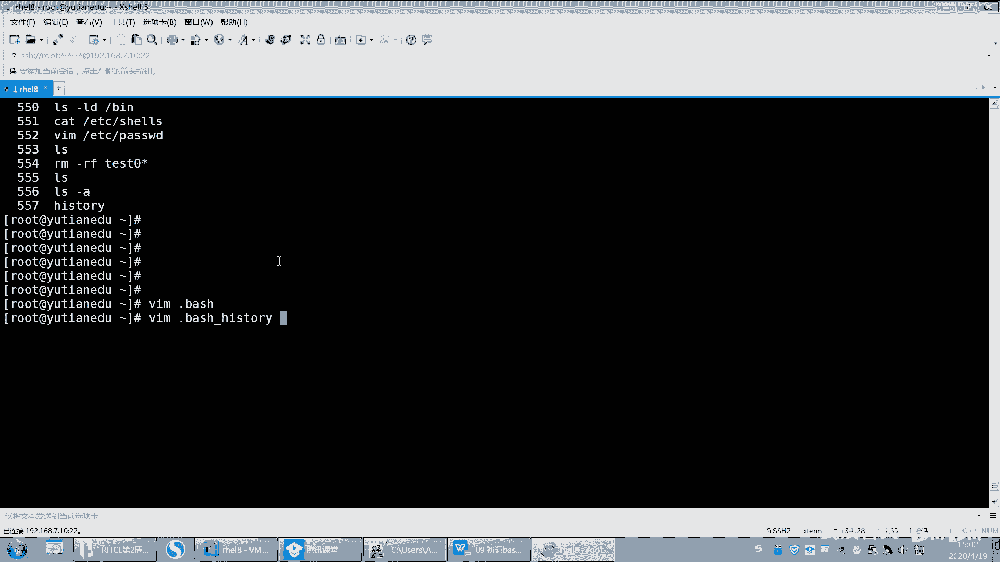
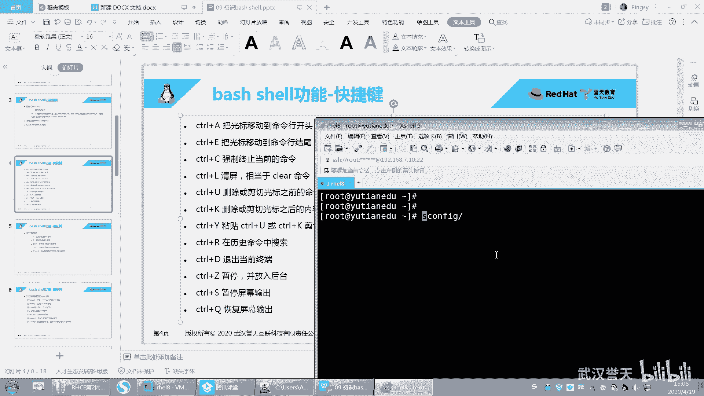
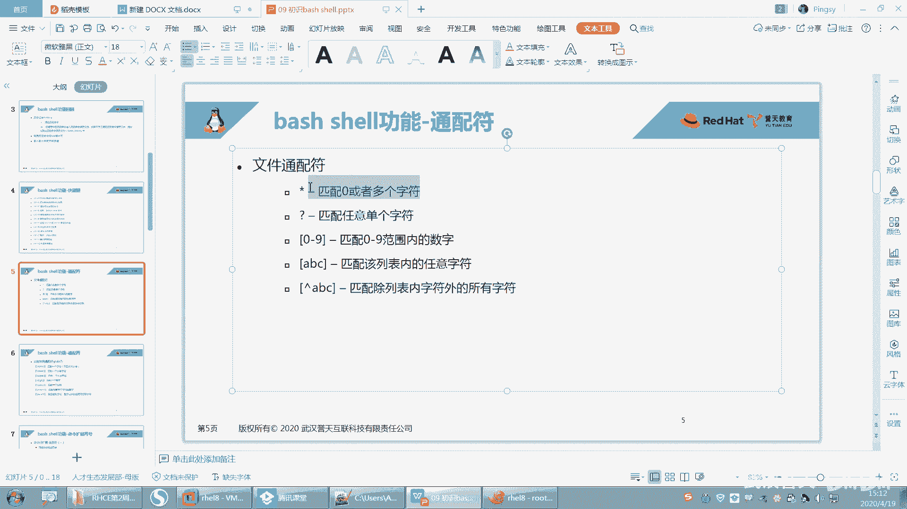

# 【已更新】最新版丨誉天红帽RHCE 8.0系列培训视频 - P41：了解bash shell-41 - 武汉誉天 - BV1cv411q74E

好呃，第九章啊第九章。呃，第九PPT我都会放在QQ群里面，你直接去找去去加那个QQ群就是了。你如果在QQ群里面。嗯。每周的PPT我再说一遍啊，呃，因为我也要现做，因为我们之前是没有PPT的。

不是说没有PPT是之前我们是英文版的PPT。英文版的PPT呃，所以。呃，这个PPT是我现做的。能理解吧。对，之前有个英文版PP，我怕那个英文版的PPT对大家来说阅读起来比较困难。

所以我之前上课一直是英文版的PPT。嗯，然后这个班呢考也是在家，可能最近需要把这个事情给大家做一下，对吧？跟大家把这个笔记都做好。嗯，所以。呃，这个PPPT也是我现做的呃，大家如果你让我一下子发给你。

我现在发不出来，我我说实话我发不出来啊，但是每周我上完课我都会给他发，我把我这周上课的内容都会给他发，所以大家不要着急，OK吧，不要着急啊，也不要催我，也不要去找我要啊，我这嗯每周我都会发。

大家到QQ群里面去下载。大家最好都要去加QQ群，为什么呢？因为我每次发的资料，我之前我就上个班的时候用的微信群，因为上个班开头不是我带的，后来我接了我每次发资料呢，他每次都找我去要。啊，又没保存啊。

又没这个又没那个的，我每次要要发又要发又要发，你们全部给我加QQ群去，我们全部都发到QQ群里面。QQ群里面它会保留的时间更长一些，听到了吗？😡，啊，你们直接找资料去里面找去里面下啊。好。嗯。

就还有的同学说老师我不怎么用QQ，我用的都是微信，对吧？你就这段时间你用一下QQ能怎么样嘞？对吧？因为我微信的话，我两边来回发，有有的什么不同步，我就统一都发QQ群了。呃，微信群确实不好保存呃。

每次又过期了呀，又怎么怎么样，就就很麻烦。😊，你就这三个月上课的时候用一下QQ，我不信哪个同学没有QQ群啊。没没有QQ的。嗯。好，第九章啊呃认识初始我们第一次接触到这个东西啊，之前我也学过呃。

说这个he是什么东西。但是呢呃估计同学ear是什么呢？对吧？不知道哎，那这张呢我们就开始来学习一下什么是啊。那么这章我们呃学了就学一些呃入门的唉，后面呢我们会学尔脚本，但脚本我放在后面讲了。

而且尔脚本你用的话需要用到什么，需要用到前面的内容，比如说我们学过的内容，哪一张VM你会用对吧？IO管道你要会用呃，这个文本处理工具上上一章内容你要会用，所以这都是基础，对吧？这都是基础内容啊。好。

而且是比较重要的内容，基础既基础又重要。啊，那么我们来看一下这一章内容，我们需要知道什么啊。呃，这章的学习目标我们要知道什么是share，什么是here啊，到现在为止我们还不知道我们只知道什么。

我们只知道哦，这里给我一什么，给我一个提示服务，在这敲命令，这就是share了，对吧？啊，可以在shaar里面去敲命令，对不对？好，大家同学先收回来啊，之前内容没听懂，晕了，就算了。

过去是呃喝口水换一换脑子啊，我们开始下一章了啊，跟之前那个没听懂没关系，这张跟那张没关系啊，是暂时没关系啊。😊。

OK吧。啊，不要再想之前的了啊。嗯。好，然后我们要了解一些通配符，在shaar当中，shaear支持的通配符啊，shaar里面支持的一些通配符。比如说信号啊、感叹号啊啊信号、问号啊等等这些啊。

还有命令的扩展符别多落符号啊，多少小括号啊等等啊，还有命令的别名，以及我们变量要会用变量，要会去设置变量，各种变量类型。啊，等等啊，都要会都要会啊，这是我们这张内容。好。

呃，什么是谢什么是谢啊。好，来我们来回顾一下啊。我们之前讲share的时候是在哪个地方提到了share是吧？是不是在文件的password里面的。最后。最后一列。最后一列叫SBno log in对吧？

是这个吧。呃，我们用的可以登录的here呢，是不是这个beb啊，这个是可以登录的hear，对吧？我们登进去之后，他给他给我去呃给了一个给了我，反正可以登进去，对吧？给我分配了一个命令行。

但是如果我把一个用户设置成BSB log in，那么这个用户就登不进去了，就是我昨天给大家演，昨天早上讲用户的时候给他演示的对吧？啊，那就是不同的shaar，对不对？😊，啊。

那么share给我直观的感受就是我可以在这怎么样敲命令了，看到吗？我可以敲命令了，对不对？好，那那到底share是什么东西呢？Oshare啊，它是一种命令解释器。

它能够识别用户在输入的用户输入的各种命令，并且将这个命令传递给操作系统。也就是说我执行那个LS。😊。

他怎么知道L是看呢？看当前目录啊，他是不是要去解释，那谁有由谁来解释呢？由share来解释，由share来解释啊，它的作用类似于在windows里面命令行是吧？这个这句话可以啊。

差不多windows是不是也有sharewindows里面有个share叫power share是吧？也有shaar啊。其实我们还有图形界面的sar啊，还有命令行的sh尔都有。share是什么？

是用户交互的一个界面，也是控制系统的一种脚本语言。好，这就是官方的话啊，来看我来给大家解释啊，看这里看这张图，这张图啊，我觉得这张图还是做的比较好的啊。呃，这里有张图大家可以看一下啊。

我们之前讲系统的时候。讲系统介绍版本的时候，对吧？讲到过有内核，是不是这样啊？是不是讲了有个内核呀， kernel嘛，然后这是什么啊？我们整个把这一个整体叫做是什么？叫做是操作系统，叫做是操作系统啊。

好，然后呢。我放大啊。这颜色换。好。我把这个整体交操系统，其实在内核的里面应该还有一个圈圈，这个圈圈它没有画出来。这个内核的里面我们叫做硬件。叫硬件啊，我就不写了，叫硬件。然后硬件的外面是不可啊？

硬件的外面就是 kernel，对不对？😡，啊，那硬件的外面是 kernel，然后呃呃呃因为K可以直接调度硬件，就是我们的内核是可以直接调度硬件的。我们当时是这样讲的对吧？那么说有内核，光有内核还不行。

因为内核呢呃它只能控制硬件，但是我们没有办法去跟这个内核去交互。就是说我没有办法去控制这个硬件，对吧？我没有哪一个入口能够去控制，所以我们才有了什么最外层的操作系统。那最外层的操系统对吧？

但是现在我们把这个操系统是不是。把内核加外面的这些东西，应用程序都作为一个整体叫操作系统了。但是最之前的时候，我们仅仅是外面叫操系统操作系统的一些组件。因为应用程序而里面叫内核，是不叫内核呀，对不对？

好，现在还把它分细了，又把它分细了啊。啊，你看这儿。他把这个内核跟中间有个here看到没有？中间有个here啊，外面是命令，对不对？那么你看啊这个share在命令和内核之间看到没有？在命令和内核之间啊。

好，假如说我在这个地方这个最外层，它给我一个提示符，我在这敲了一个LS对吧？那么系统怎么知道LS去看呢？因为它要读嘛？或者是我写了1个VIM对吧？一个应用程序，那他怎么知道是要打开一个文件呢？

那这个都是由什么由share来做翻译的。😊，翻译完之后，把翻译的结果丢给Kel来执行。那Kel再去调度硬件，然后去执行硬件。比如说你要VIM写就写进去，读如你就读出来等等啊，就是一层一层这样子啊。

那最外层跟我们交互的，是不是就是这个外层的这个命令。那么是不是由share来提供。然后我们在这敲命令，敲命令share来解释，解释完之后丢给内核内核来控制硬件。

所以share呢是我们外层用户和内核之间的一个桥梁，它起到一个桥梁的作用啊，这个叫surearO这能不能听懂？这能不能听懂什么叫shaar啊？比较抽象啊，就是他给我提供了一个share之后。

我是不是可以在这敲命令了呀？😡。

那他怎么知道LS是看呢？😡，对他是一个翻译的人，他是帮我去做翻译的这个人。😡，比如说你将来你在unix当中，你用的是比如说你弄的是C share或者是K share，对吧？它有别的什么share。😡。

就系统上面有很多其他的shaar，对吧？那不同的shaar，它翻译的结果可能是不一样的，能理解吗？对，翻译的结果可能是不一样的，同样我都是执行在这个命令行当中，我同样执行一些快捷键等等。

那么我们用bush sharear解释出来的，跟用K share C sharear解释出来的是不一样的。OK这就是不同的shaar，统称叫hear。😡，那我们系统当中有哪些share呢？

系统当中有ETC下面的shaars。😡，那我们默认啊当前红帽八只支持这些有SH sharear，还有bsh sharear。啊，有这些是吧？其实说白了这四个都是指的一个呃，你看啊。A病。呃。

SH它是不是链接到。他是不是链接到它？啊，然后你再来看呃，这个USR。Bing。哎。US啊。嗯，就并吧。啊，你看B是不是链接到USUSRB啊，所以所以它怎么样啊，所以最终都是哪个shaar啊。

是不是USRB下面的here啊，就这个here，所以它四个是一样的啊。因为在早些时候我们呃呃linux版本里面，有一种shaar叫这种叫这种就叫就叫SH。对，有一种类型的叫SH这种sha。啊。

那后来呢我们又出现bush share，那bush share是兼容SH的，就是说你在SH里面支持的bush share，我同样兼容你兼容你啊，所以现在我们都基本上都用的是bush share。

当然在其他的版本当中，还有比如说K share啊，C share啊，比如说在unix当中，它是呃就是就不是bush share。但是unix呢。它不是把像bP还是什么功能啊，比如说我在这敲了一个命令。

😡，啊，敲敲敲敲敲敲对吧？我们说哎呀，敲错了。好，左右键是上是不是移动啊？好，然后改一下CO好，那左右键可以移动，对吧？但是在我们的unix当中，那个默认的hear里面，你不可以左右移动哦。

你左右移动就是乱码，不可以左右移动，你就得把它删了，重新敲，那这就是不同的hear，它的功能是不一样的。而且在unix默认的hear里面是不可以上下翻的。你看我们是上下翻，是不是？😊，呃。

翻那历史记录啊，但是在我们的什么，在我们的这个unix默认的 share里面，它是不可以上下这样去翻，而且还不能table键。😡，不能table键的，你想要多痛苦，我们bush share。

它可以table键，它可以支持table键OK吧？所以我们用unux的工程式，它就痛很痛苦。uninux的工程师它就很幸福，对吧？你用linux之后，再用unix，你觉得哇这是不是人用的对吧？

所以这个时候我们在unix当中居然也可以支持bush share。😊，对，在unux当中也可以支持bussh share，你只需要装一个bus share的包就可以了。

对你可以网上去搜搜bu share把这个包装上，那么它就可以支持table键，哎，就可以支持就然后你装上之后还需要改一个位置，还需要改一个位置啊，改哪个位置呢？是不是把这个用户的。

把这个用户的这个后面这个地方啊，是不是改成。并bush。那么这个时候我切换到这个addmin的时候，那么是不是就调用了bush share来帮我做解释，来帮我做翻译。O吧。这这这个能不能听懂。

就是不同的hear，它们之间呃什么区别，以及我怎么去用这个hear。啊，你一定要改什么，一定要改这里。这样的话我才能用到这个share。

为什么我用addmin的时候切到addmin用的是by sharear，因为在这里定义了它的share登录share的类型啊。😡，嗯。啊，对它是立即生效的啊，就是直接改一下，它就可以生效了，就这个意思。

好吧。

好。呃，之前不懂share的啊，到目前应该应该应该开始懂了啊。那下面我们我们的任务就是要学习在这个bush share里面，我们重点是bush share到底支持哪些功能啊，对吧？有哪些特殊组字符？

这些特殊字符分别指的是什么含义啊？哎，这是我们现接下的内容啊。😊，嗯。好，这个是。呃，希尔的一些个回顾啊，这个地方这个标题写错了。线儿回顾好吧。好，我们来回顾一下。

我们之前嗯其实已经用过shift的一些功能了，哪有哪有哪些呢？好，有一个历史记录叫histtory，我们可以去翻历史记录，对吧？好，有的同学说老师，那这个怎么清历史记录啊。

我上次是不是跟大家讲过一个怎么去清历史记录的呀？

呃，是不是这样去清呃，然后e口空是吧，从定向到呃，bu呃呃呃bu historyistory是这样吧，是不是这样去清啊，但是你清完之后，你再hiistory它还是有能理解吧，它还是有好。

而且有同学发现我在hiistory。我黑色ory看到的内容。呃，跟我打开点bu。点bsh呃hory内容是不一样的。哎，是不是也有同学发现了呀，对不对？不一样的啊，是因为什么呢？😊。

它是这样的啊，就是你执行完这个这些历史记录，你用黑 storyory看的。

就是你的历史记录执行完之后，呃，它是保这个历史记录是保存在内存里面的，就是保存到内存里面的。

呃，他还没有写到这个点b黑里面。那么什么时候会写呢？一般在这个用户退出的时候，他就会写进去了。对，用户退出的时候就会写到写到那个黑呃点bu historyory里面。

啊，是这样吧，所以如果你想清历史记录，那你缓存里面的你想清的话，怎么清呢？叫history。杠C啊，我写的这sory杠C回去了就没了，看到吗？就清掉了。那你的点发型。For fail。哎，敲错了。

这里面是不是还有，那你就把它清把这个文件清空一下，所有的历史记录是不是都没有了？O吧，所有的历史记录都没有了啊。😡。

好，这就是清历史记录啊。清历史记录。啊，然后如果你想把这个当前这个historyory的历史记录本来是在什么？本来是在这个内存当中，你想把它写到这个什么写到文件里面，写到文件里面。

你就写一个什么historyory杠W就把它刷到把那缓存里面的那些历史记录，然后写到你的什么，写到你的文本文件里面，写到文本文件里面啊。

OK吧。好，呃，就补充了一下这个history历历史记录的啊。还有我们之前调用历史记录，对吧？感叹号啊，搜索历史记录，ctrl加R啊呃等等啊，对吧？那，这这些都是he。

就是bush sharebush share呃功能回顾啊。就是之前。好，然后还有table键补齐啊。当然如果你有最小化安装的话，table键是无法补齐的。table键补齐不了。OK吧？好。

我我们装了一个就是装了一个包之后，那个包怎么装，到时候后面再说啊啊，装了之后你就可以table键补齐了O吧啊这个也是bu share支持的功能啊，以及我们之前学到的输入输出重定向，还有管道等等。

都是什么都是bu share的功能啊啊，在其他的sha当中，不一定是这样子的O吧，我们学的是bush share啊，是bu share。好，那么我再来看一下关于在bu share新的功能啊。

新的一些这个呃。功能啊呃，这个里面我给它总结了一些关于share的一些快捷键。快捷键啊就是。嗯，但是这些快捷键呢。嗯。

你快速移动的我没怎么记。其实你比如说啊。😡。

嗯，像你看像这种啊，比如说我敲1个CDEDC confinetwork对吧？好，我想一般我想回到这个命令行的。这头部对吧？那我就ctrol A。啊。呃，妈呀，ctrol A还不行啊。我一般都home键。

行。Yeah。

等一下啊。有卡住了。好，然后呃home键嘛。就了。就不想让我摁成功呗。我发现。啊，home键是吧，然后end键，那home键end键这样子吧，它还ctrol A，其实我没有这样记过，这个你看你自己好吧。

看你自己啊，那ctl Actrl E。

然后但是这个要记住叫ctrl C，ctrl C就是中断嘛，打断对吧？那打断打断重新来打断啊。好，然后ctrol L清屏嘛，那清屏对吧？清屏啊。还有就是呃。比如说你是可以，比如说你就control u。

那cttrol u你就把把前面都删掉了。然后什么control K把光标后面的都删掉了是吧？其实就是剪切，然后ctrol y。

那ctrol y。就又把它什么粘贴回来了，是吧？嗯，ctrolU剪切ctrol y就粘贴。好，然后ctrolR是搜搜索历史记录啊，搜索历史记录啊，然后还有control D是退出当前终端是吧？呃。

这个你看啊这个ctrl D有什么用呢？就是你看啊比如说大写转换成小写，这个我其实我也演示过大写转换成小写。好，我写一个A小写呃，B小写对吧？那么想退出当前这个终端怎么办？ctrol D结束看到吗？

那从这里退出来，ctrl D结束啊。哦。呃，还有ctl Z啊，ctl Z的话嗯，后面我们学进程的时候，我再教大家用这个好不好？然后还有什么ctrol S controllQ啊，这个没怎么用过。

暂停屏幕输出是吧？

就是暂停屏幕输出，这个你用一下，好吧，我这个我也没用过。好，大概就这些啊，你要记住的必须是哪几个啊，你要必须要记住的啊，ctrl C呃，ctrlL随便你啊，然后cttrol R这学过了吧。

ctl Dctl C就是我们后面cl D后后面会学啊这个。啊，其他的话你随便好吧，这些你呃你随便你想记就记，不想记就算了，好吧。

嗯，复制就是复制cttrol shift加C嘛。复制是不是ctrl shift叫C。呃，conrl shiftcrl shift加C。哦，sorry啊，这个是我用的叉。

你在这个里面好吧，在这里面。呃，你看。选上。ctl shift加Ccontrl shift加V就这样就复制嘛。啊，但是这个地方呢它只能用什么？它只能用这个呃。他只能鼠标不能用就选不了是吧？

复制这个还真不知道复制用什么。

这里没办法复制，这个好像没办法复制吧。

嗯，其实你这些你不用记，比如说我我一般都用远程连，远程连的话，你看我直接就。对，复制呢就你你一般都用什么putty啊，或者呃这个s share啊，或者是什么seecCRT啊啊，反正这些工具连上去。

所以这些没必要没必要挤没必要记啊。

我也没记过。好嗯。

下面呢我们来看一下关于文件，就是bu share的功能之通配符啊，通配符。好，又来了啊。这些我其实之前是不是在那个正则表示里面都讲过了，是不是啊？那那这些又来是什么意思呢？好。

刚刚我们在正则表示里面学过了很多符号，比如星号啊。

中括号啊，那你把刚刚都忘记好不好？把刚刚都忘记啊，就是因为刚刚那些是匹配文本内容的，能理解吧？就匹配文本内容的时候，我们一般用正则表示。对，一般用正子的表达式啊。啊，然后这正子表示主要用在gra呀啊。

不不呃gra呀SED呀等等这些文本处理器文本处理工具里面啊。那么下面这个通配符是什么鬼呢？通配符一般匹配的是文件啊，文件名。

它一般是匹配这个文件名的啊，就是在我们的shaar当中，我们去匹配这个文件的文件名。我们一般用这个同配符来表示，比如说LS啊。对不对？后面呃比如说啊举个例子啊，呃我们之前。

呃，RM。杠RFt下面的星，对吧？这个是不是就是一个通配符啊，对不对？那么这个是不是指的匹配文件呀？t下面所有文件啊，那这就是通配符啊，还用来匹主要是用来匹配文件的。所以你要区分开来，一定要区分开来啊。

通配符和正策表达式区分开来啊。因为我我之前好像是确实没有讲过正策表示。但这次给大家讲了。呃，讲了话大家就会弄混就会混掉啊。😊，哦，OK吧，不要弄混了啊。那你说不能说这是正的表式吧。

那RM怎么支持正的表式呢？对，没办法支持啊，它只支持什么，它只匹配文件，所以它用的通配符务啊通配符。

好，在这个通配符里面，我们会学几个通配符，大家可以记一下啊。好。呃，第一个通配符叫星号，这就是最常用的一个是星号，它匹配是0到多个字符，其实它指的是匹配0到多个字符的意思啊。

好，呃，什么叫匹配零到多个字符呢？我们现在先不用删除了啊。呃，我们这样吧，我们我们可以这样啊，比如说。嗯，我先清空一下吧。然后复制一些文件。寄一些文件过来好不好？这些文件过来，然后创建一些。嗯。唉。B。

对。然后A对谁。嗯，B的。好，先这样先这些吧，好吧，随便创建了一些文件啊。好，嗯，现在呢我想去匹配这些文件文就这些文件的文件名，对不对？那我们可以用星号嘛，比如说ASLL啊。

呃我可以用星号是不匹配这个里面所有的文件啊，那它是怎么匹配的呢？它是这样的啊。它是一个一个去匹配。比如说。他就看A。A是几个字符啊？A是一个字符，那星号是不是0到多个字符呀，匹配吗？A匹配好。

B是呢B是别匹配，那这个是不是也满足要求啊，因为这是4个字符，那星号是0到4个字符，满不满足要求啊，满足。所以这所有文件是不是都满足要求啊？所以这就是星号的作用，那0到多个字符。

所以他会把所有文件怎么样全部打印出来。对，全部匹配上啊，全部匹配上。好，那么这个时候我们再来啊，如果我想去匹配A开呃B啊，比如说这个P开头的是吧？啊，P开头的那我就P星号。OK吧，回车。

那这样的话是不是把P开头都匹配到了呀。那么这个地方比如说我再创建一个P。😡，比如说P啊好，再来看啊，那LLP星号。那么这个P是不是有可能会匹配上啊，因为你看啊我回车这个P是不是也匹配上了，为什么呢？

因为这个P第一个你看这个P跟这个P是不是匹配，那么星号指的是什么？零到多个字符，那P的后面是不是零个字符啊，那零个字符是不是也也满足要求啊？O吧？所以那这就是星号啊，星号指的是匹配零到多个字符啊。

注意正则表示当中不是这样的，正则表示当中它指的是匹配它前一个字母，比如说点心，这个是匹配，么这是任个任意一个字符，然后星号指的是它前面这个字符出现零到多次，所以它跟正则表示里面是不一样的啊。

所以要区分开了啊。😊。

好呃，这个是星号OK吧，星号啊，然后再来第二个。第二个啊，问号问号呢匹配是。呃，一个字符单个字符。但是这个字符呢，我不管你这个字符是什么，反正就一个字符。这个是不是相当于正格表示的里面点。

正则表示里面的点对不对？好，那么就LL比如说问号回车，那么我输入一个问号，那这个问号是不是指一个字符啊，是不是指一个字符，那么这一个字符是不是有一个字符的是哪个满足要求啊。

是不是这个A啊ABCP这这就就一个的满足要求，对吧？好，那如果说我输入一个什么？比如说呃C开头。😊，呃，那么问号，那么这个问号后面这个问号是不是就一个字母？那也就是说这样我匹配下来的话。

CC问号是不是有两个字符啊，两个字符对不对？然后第一个字符是C，第二个字符是不是任意呀？那第二字符是不是任意啊？对吧所以这样我匹配下来的话，是不是没有任何呀？没有一个是C开头的，并且后面带有一个呃问号。

对吧？或者你可以这样。LALA问号有没有啊，没有没有对吧？没有以A开头，并且后面带一个字母，也就是说起码它是。它限制条件就是两个字符。对，两个字符啊。好，这个就是问号啊，这个就是问号。那LL问号星。

那这个是不是指前面第一个开头是一个字符，这个字符无论是什么，对吧？无论是什么吧，随便你是什么。那后面是0到多个字符，也就是说其实你至少要匹配一个字符吧，那就这就这个意思。😡，好。所以所以我告诉你。

如果前面没听懂，你就把它放，你就先放着，先放着，先不管它先不管它，你就听我现在讲什么，你就听什么就可以了啊。好嗯。通配符O吧？通呃这个通配服务啊。好，那剩下的这三个跟我刚刚讲正则表示里面的。

是一样的，用法一模一样。对，刚刚你听懂了，那这你也能听懂，刚刚没听懂，你再听一遍，好吧，再听一遍啊。

好，我们刚刚说这个问号啊，是不是匹配一个字符啊，但是这个字符是不是不界定是什么，不管它是什么，我都匹配，就一个字符。但是我想匹配什么，这个地方它有可能是ABC看到了吗？

就是第一个字母是A或者是B或者是COK吧？A或者是B或者是C啊，后面是一个星号，那么这个星号呢指的是0到多个字符，对吧？所以第一个字母是A是B是C，后面不管了，回去。那满足要求的是不是这些？啊。

看懂了吗？你一定要记住中括号括起来的一定是一个什么一个字母，不是三个啊，不是三个ok吧，不是三个再说一遍啊，重要事情说三遍。因为有很多同学他在匹配的时候，他把当这三个字母匹配了。啊，当ABC对吧？嗯。

对任何一个它只匹配一个啊。好，反过来我可以怎么样。啊，那你说。那这样啊。那你们来告诉我。呃。下面这两个怎么匹配？呃，就是呃怎么说废话嘛？嗯。好，这样吧。我们还可以加一个什么间号，对吧？是不是加个间号啊？

😊，啊，加个键号的话就是。第一个字母不是ABC是吧，而是其他的任何一个就匹配，那就匹配到P是吧？嗯，没问题吧。好，那我如果按照这种方式再去匹配下去的话，那我怎么把这两个匹配到呢？你想一想。

如果按照这种方式去匹配的话，那我怎么就把这两个匹配到，是吧？好，你就可以加一个什么。加一个。问号对不对？回去那。那为什么加个问号呢？

因为这个字母标较，它说只有一个，对不对？那么问号。