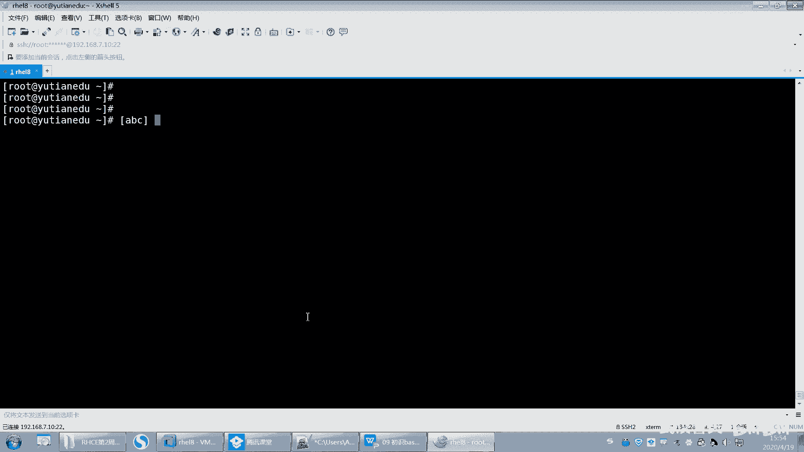
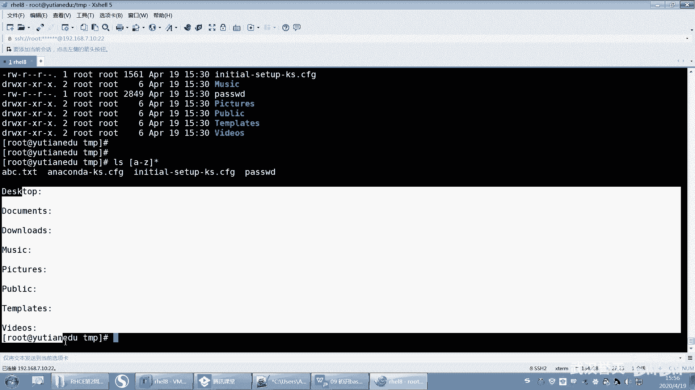

# 【已更新】最新版丨誉天红帽RHCE 8.0系列培训视频 - P42：了解bash shell-42 - 武汉誉天 - BV1cv411q74E

那为什么加个问号呢？因为这个字母不较它说只有一个，对不对？那么问号就是说后面你在后面至少有什么这个地方有个字母字符，这个地方有个字符，那这地方是不是至少有两个字符，两个及两个以上的字符，是不是就是它呀？

对，就这这两个嘛。对吧那这个P不满足不满足要求。OK吧。啊，没问题吧，再来啊再来啊。No。我发现这个。

红8这系统还是我电脑的问题啊。下次重新换一个文墨试一下。

老是卡住啊。呃，还有你看啊，如果你time清空的话，有个什么问题啊？你time清空，你RM杠RF新是这样吧，但是是不是还会还会有一些隐藏文件，这些隐藏文件是默认是不会被匹配匹配到的。

所以如果我想清空这些隐藏文件，我我怎么办啊？我要去匹配他，对不对？我就要这样去啊点心看到没有？嗯。RM杠RF点心啊。好，这两个文件它不会被清掉，因为这个是呃点和点点。点和点点啊。

因为我它其实为什么不能不清掉，其实按理来说它也能匹配到，它也匹配到了是吧？那这两个也匹配到了，为什么不没清掉呢？是因为我在这个目录下面，所以它没有没有清掉。如果不在这个目录下面有可能就清掉了。

有可能就清掉了啊，所以要注意OK吧，注意啊，点是指当前目录点点是指上一层目录啊。好，这样的话就没了。好，我来复制一些。嗯。这样啊我我再再再再再来一个啊ABC点T。诶。好，那出题啊出题啊。嗯。

我想去保留ABC点贴题，其他全部删掉，不要了。嗯。把这个文件保留，其他文件全部删掉，不要。好，给大家两分钟时间做一下啊。2分钟。坐一下啊。就这个。把这个文件保留下来，我再说一遍啊。

把这个文件保留下就不要了。😡，其他都不要了啊，OK吧，用到我们刚刚所学的这些。

对，原来我们刚刚是所学的这些啊。不对。你这样明显就把它删掉了呀。你试一下嘛，你自己你试一下，你看。我我刚刚是把root下面的文件复制过来，并且创建了1个ABCD电器。你可以你可以你可以试一下。

你你这样匹配哦，问号问号，你这不刚好把它。PP到了吗？你这个不行，因为你这个不够特殊，你要得看我这个。嗯，你这个也不行。不能满足要求，你这个是除了A以外的图选调。第一个除了A以外都删掉。

那我第二个有可能就删不掉哦。就没有同学想出来吗？季节松，你这个也不行。没。就是刚刚。你们写这个的同学啊，就是写ABC的这个同学的叫匹配，只要是匹配ABC这个同。呃，这个这个这样匹配的同学啊，都是刚刚。

就是忘记了啊，中狂老是匹配几个单几个字母啊。章程是RM，这个也不行。张成，你这个也你这个。你这个是第一个字母，除了X以外都删掉。

你就全删掉了。也不行。其实这个很简单，真的。这个很简单。还没有同学做出来吗？

我这个地方通配服不多吧，就这就这几个啊星号问号那虽然学起来感觉很轻松，对吧？但是以实际应用哎，就就不知道怎么去用了。

曾强说是RM。你这个是。什么意思啊？除了点ABC以外都删掉。除了点ABC以外，都删掉。哦，不对是吧。除了AB以外都删掉也不行。那第二个删不掉啊，反正你匹配第一个的话。也删标。那高伟同学。

你看你第一个字母是除了A以外，第二个字母是B，那你不是把它删掉了吗？你是不是要这样执行啊，注意你大家不要去匹配什么啊，不要去匹配这个B啊你。你匹配B，那不是把它匹配上了吗？而且你这个是匹配什么？

你这个是匹配的是这个两个字母。两个字母。好，算了，不为难大家了啊。还没有同学做出来，之前都有同学。😡，做出来的。之前是有同学做出来的。不行啊，季姐送你这个不行。呃，江道龙这个就是有点像对吧？

但是你试一下也不行。好，来看我这里啊。其实这题很简单，你只需要找出这个文件跟别人的不同点就可以了，对吧？你去说匹配第一个。有很多同学是把第一个给匹配上了，你看像这个同学呢。😊，呃，你这个。你这个。

不行啊，大哥。不能不能你不能把这个东西都写在这个里面啊，你这是这是这是中括号括起来是一个字符，OK吧。😡，它不是匹配这个字符串的不是匹配这个字符串的OK吧。还有你看冯亚男同学是这样的啊。

他是呃最后你是不是TSE啊，你这样是不是就把它给匹配上了呀？如果前面我算你没有没有错误的话，你就把它给删掉了呀。我是除了他以外的保留他呀。你要把匹配其他的，你的目的是匹配其他的文件，而不是把它给删掉啊。

而不是给他把删掉。好好好，这个没想到啊，大家没做出来哦。好。😊。

这样啊你只需要看这个文件跟其他文件有什么不同点。有同学发现了哦，它是以点TT结尾的对吧？它以什么怎么结尾，但是我们有没有讲过以什么什么结尾呢？好像也没讲过是吧？那你说匹配哦，它有几个字符。

你不能匹配它呀，你匹配是这些，你是保留它，对不对？好，这个文这个地方其实很简单，你没匹配第二个跟匹配第三个都一样。因为因为。😊，只有第一个文件的第二个字母是B。只有第一个文件的第三个字母是C。

想起来了吗？会了吧。好。第一个字母的。第一个字母的，你看啊第第二个字母，第一个字母管不管呢？第二第一个字母是不管，第二个字母是B，那是不是就这样啊？😡，啊，OK吧，是不是这样B嘛。

这是把第一个这样匹配上了呀，但是我不要它嘛，我不要把它删掉，把它去掉。所以中括要括起来。然后第二个字母除了什么B以外的都匹配，而且这个地方你要怎么样啊，你不能加点切AT啊，你加点切T。

你是想把它匹配上吗？你不是要把它匹配上，对不对？所以应该怎么样？😡，第一个字母无论是什么，但是第二个字母不能是B。呃，第二个字母不能是B，看到没有？啊，你要根据它特点呢，然后再星号啊。

而且第二个字母都是B，后面我管不管它是什么，我不管它是什么，反正你第二个字母不能是B。😡，OK吧，就针对这一题啊，你要根据具体情况来去做嘛，它可能不能适用于所有的这个文件。但是你要根据具体情况去来匹配。

好，那后面就要星啊，你不能不加星啊，不加星息号，这样的话是不是只有两个字母啊，你想哪哪个是两个字母的呀，没有啊，这些都不止两个字母吧，所以后面加星号回车来。

留了。看到了吗？啊，看到没有？啊，你怎么去回去练啊？你这样我是把root下面所有的文件复制过来了，你可以这样，你可以自己去试O你可以自己去试啊。那我执行了这个，然后创建了1个ABC点TIT。😊，好。

我们下课休息一下，你你你你下课再去练一下。啊，把我刚刚那个那个那个那个那个消化一下，好不好？

就讲了这三个啊，不就讲了这些，就讲了这些通配服务。哎，正好是吧，我这下课还蛮准时的。

这一看就是个麦霸。对不对？好。呃，同学们回来了啊，呃我下课呢突然想到一件事情啊。就是下课的时候，我都一直在想一件事情，想什么事情呢？嗯。是不是我对大家太凶了，感觉我突然想到这么一件事情啊。😊。

应该还好吧。嗯。啊，就是呃如果我有有那个对你可能就是凶了一点或者怎么样啊，就是呃你们不要不要介意啊，就是我对你没有什么恶意，就是没有什么恶意啊，就只是可能在学习这方面呢，有时候比较较真。

就有有有时候比较认真了。一认真起来就就就就有点那个了，知道吧？就是。嗯，对，就是就有点有点那个了。所以所以大家就是呃可能我上课怼你了是吧？但是怼你不是不是说那个啊，就是你千万不要因为这个事情。

然后对我心里记恨，对吧？说完了我就下再不想看到这个老师了，他怼我。😊，呵ふ。希望大家不要不要这样想啊。这是。嗯。因为我下课突然就就感觉是不是那个。是不是那个对大家太要求太太那个了，太太循环是吧？

因为我本来性子。又有点也比较直，就是有有什么话就说说什么话，有点直，这是。藏不住话是吧？啊，希望大家能够见谅啊，我们就我们谈来谈来学习的啊来学习啊。好。嗯，所以大家就是也不要。

因为我我就怕我哪方面可能言语上啊或者是方式方法呀，大家可能哪个地方做的不是很好。嗯，但是呢。呃，我的出发点是好，出发点是那个也希望大家。嗯，对。ふふ。好。嗯，那大家能够达成共识更好啊，我们达成共识更好。

所以我是帮大家呃把大家当做这样的朋友，或者怎么样一起来学习，我们相互学习啊。然后你们也有可以当做我的老师，对吧？我的或者是我都没有接触过的。对吧那你们接触了，那你们就是我的老师。那在这课堂上。

我是你们的老师，对吧？然后学生要听老师的话，是不是这样？好。OK嗯，那我们继续啊。😊。

刚刚其实我们就把这个通配符这个地方呢呃跟大家呃就是。呃，稍微讲了一下啊，其实也还好，这几个用起来其实还好。但是真正的时候根据需求来去回顾来去用这些知识点的时候，你可能就想不到这个其实也正常。

因为你要多练多遇到，对吧？嗯，然后才能去实现，呃，就是啊一下子就能想到，因为这个东西确实就是经验，有时候就是经验用多了，就就就这样啊，当然也要看你们对这个掌握的知识点牢不牢固，就是我知不知道对吧？

像有同学用的是匹配ABC的这种，那一看就是什么，他就不知道这个中括号匹配是一个字母啊。

对吧它中高括起来就是一个字母，所以你要先理解它的含义，然后再去用它。

对不对？嗯。好，嗯，这个是通配符啊，就说到这儿了，就说到这儿啊，通佩符。呃，这一周内容还是工还是这个量还是比较大的啊，因为很多很多特殊特很多符号出来了。呃，后面我们还在学谢的时候，还会学到一些符号，呃。

就比较多啊。啊，除了通配符，除了我们学的这几个通配符以外，我们还有这些通配符。😊，还有这些通配服务啊。嗯。

这通背服呢是比较常用的。我列了几个在这儿。当然还有很多其他的，比如说man一下man一下7globe嗯。glove是吧，就这个啊。这个下面它会有一些这个。呃，在这儿看到吗？但是他这个地方好像没有解释。

没有解释说这个是什么意思，是吧？不过这个也难不到大家吧，你就直接。实在不行，你百度去对吧？反正这个工作了嘛，又不像学小学生非要。呃，非要记下来或怎么样，你就去查就行了，好吧。啊，然后去用它。

那这也是一种通配服务。那它怎么用呢？看这儿啊看怎么用啊。嗯，我想匹配首字母是小写字母的。啊，首字母是小写字母的啊。好，看哦LS。首字母是小写字母，那首字母第一个字母是小写字母。

那第一个字母我怎么表示是不是用中括号括起来，是不是第一个字母啊？😡，对不对？那后面是什么管不管啊，不管对不对？那也就是说我现在要去匹配小野怎么叫小写字么是不是A到Z啊？😡，是不是A到Z这样去匹配啊。有。

这个大写是BPP。唉，这个大写等一下啊。

嗯嗯。LL。啊，其实这个是没哦，这个是这样的啊。它这个上面没有，这些不是匹配到的，这个指的是什么呢？指的是他看目录里面有没有。对，目录里面有没有啊，这个是没有匹配到了啊，匹配这这几个呢这小写字母OK吧？

好，那这是一种对吧？那我们今天又学了一种新的同位符，就是这个啊它可以。用你看啊是这个消息字母就这个就lower lower。好，呃，这个地方的话，我这样吧，我们把这个中括号去掉啊，不加这个中括号。

这个中括号不是加在这个外面的。

不是加在这个外面的啊。等一下啊。问区。可能。呃，它就只有单纯的一层中括号啊，只有这一层。好吧，我把这个改一下嘛，PPT上改一下啊。

嗯。没有，只只有一个啊。好，这这一个整体就作为什么？这一个整体就是一个小写字母。那不是啊，不是说这一整体就是小写字母，就是这个这个地方就代表是小写字母。😡，好哦，我知道为什么当时加这个中括号了啊哦。

我知道为什么加中括号了。好，我先还回去啊，因为你看。我有。嗯嗯好，先不看PPT吧，我把它拿过来看这里啊。😡。

看这儿啊。哦，LL我们说匹配一个字母对吧？后面是无论是什么，然后这个是小写字母，那小写字母怎么表示A到Z是不是这样，但是我不像我不要这样去表表示，那我就可以用那它整体就是这样的。就就这样看到没有？

回去了，那那这个地方是不是就小写字母，看到了吗？那这个整体代表是小写字母，其实是不是它相当于是。ABCDE这样所AA到Z啊，是不是相当于A到Z。O吧？能听懂我什么意思什么意思吗？这个地方指的是小写字母。

但是外面又加了一个中括号，指的是不是就是匹配一个字母？😡，这个字母可以是所有小写字母当中的任何一个小写字母。能理解吗？就这个lower啊，或者说匹配大写字母。😡，带有字母的呢就是upper嘛。

apper。对吧那这这是不是就大写字母那。大写字母刚刚那个LLL杠A到Z好像有点问题是吧？匹配的有点问题。好，这样我加个D。好，你看这样就出来了。因为我们看目录本身的话，看目录本身是不是要加个D呀。

对吧？因为刚好这个大写字母都是目录嘛，大写字幕都是目录，所以加个D加个D啊，加个D好，看文件也可以加D嘛。你看文件也可以加D吗？那看文件也可以加，所以就加D加D啊。好。

那这样的话就是大写和首字母大写和首字母小写。好，还有比如说匹配数字啊，数字呢，数字的话就是什么？数字就是digital，对吧？所以在这个地方，我外面又加一个中括号，是因为什么？是因为什么嗯，这样吧。

呃，我我给大家把这个PPT改一下，免免大家误会啊。我还是把这个去掉，还是把这个去掉啊，然后我把后面的注释改一下。这样。那然后匹配呃匹配一个字母匹配字母就是所有字母啊，这这是就是什么所有代表所有字母。

然后这个是匹配小写字母，因配大写字母匹配数字，匹配空格，匹配呃任意字母和数字，然后呃这啊反正就这样啊。所以那你外面你怎么去用，你是不是看你你加中括号也好，对吧？或者加怎么好，那你就自己去外加就可以了啊。

其实这个整体指的是小呃小写大写好，我要给大家列了一些用法，大家直接去用就可以了，好吧。

嗯，OK好要匹配空格呀，那你怎么匹配空格呀，你就这样去匹配空格。

比备空格啊。

好，那这个就不说了啊，同佩服。那还有波浪号，对吧？波浪号波浪号之前也讲过了呃，它也是我们share的功能，所以我都写在了这个PPT里面。然后波浪号是指用户的加目录，波浪号是指用户的加目录啊。

默认是指当前用户的加目录啊，如果是指某一个用户的加目录，那么就波浪号加上用户名，这个是第一天第一周的第一周课程讲的啊，第一周的课讲的。讲那个文件系统啊，第第二天下午是吧？

啊，这个还要不要说呀，你不用说了吧。比如说CD到波浪号admin，就进入到addmin夹是吧？然后呃然后波呃VM波浪号点bu。RC那就是打开什么当前加目录下面的一个点bu是RC。

然后我还可以打开addmin下面的。呃，点把小C这样子啊，OK吧。好的命下面点把小C。

好，这是波浪号啊。好，下面呢我们来再看一下关于命令的扩展服啊，命令的扩展服。

好呃。我们之前学过一个命令，这个命令呢是我之前提到过，但是我们有单独说就是eal eal hello看到了吗？那eal什么东西就显示什么东西，对吧？好，我想显示一个嗯，比如说我想显示一个。嗯。

显示个东西显示个eal the呃 the system。呃，name啊，这个语法可能不太正确啊，stems name。呃I。嗯。postst name是吧？好。看这儿啊。

我eco后面这一段内容是不把后面这段内容打印出来了，对不对？好。那么其实我想显示的是这个系统的名字是主机名，这个主机名呢是叫玉天EDU就是我系统的主机名叫玉天EDU。

但是在这它是不是就显示叫ho name啊？那我想让它显示什么呢？我想让它显示天EDU那同学说你想让它显天EDU，你不就写一天天EDU不就行了吗？但是你写天EDU，你是不是这句话只能用在这个系统里面啊。

那你又换一个系统，那你这句话就不能用了，对不对？所以有些时候你不知道你的系你的而且你的主机名有有可能是不会变。好，那因为我们系统当中有一个有一个命令叫hos name。对不对？

那有一个命令叫hosse name。好，那么这个命令在这个地方，我们系统有没有把这个host name当做是一个命令在执行呢？其实显而易见，我们是没有把它当做命令来执行的。

只是把这个字符串是不是原样给输出了，它是什么就输出的是什么。没有把它当命令。好，但其实我想让他怎么样，就让它作为一个命令来执行。之前我们讲说一行当中是不可以有多个命令的，对不对？不可以有多个命令的好。

eco那他又让它把当命令执行，我们就得用把它特殊符号把它给怎么样括起来，让它。执行对，让它执行啊。好，怎么让它括起来呢？我想去调用这条命令执行的结果。调用这条命令执行的结果啊。好的，就这样。

只需要在前面加一个多了符号，加小括号就可以了。看到了吗？那eal啊，the system名字is whose name啊，你们可以记这个特殊符号啊，叫多了加小括号，多了加小括号啊。

多了加小括号是指什么意思？中间是command，是命令哦，中间是命令啊，它指的是调用命令执行的结果。

记啊，它指的是调用命令执行的结果。好。也就是说。当我在后面碰到多了加小括号的时候。他就会把这个里面是不是当做是命令，然后把它给执行啊，执行完之后是不是引用了这个命令执行的结果OK吗？是这样吧，好。

那如果我写的不是一个命令呢，我写的是一个随便写一个，比如说hello，这个hello好像不是个命令，对吧？那我写了一个不是命令，它是不是就。😡，识别就就就能判断它不是命令，然后显示hello呢。

或者说就把它当hello命令来使那个执行呢。好，看一下啊。我们执行完之后，它就会报错，因为它只要碰到了在后面这个里面碰到多了加小括号，它就要把这个小括号里面的当做命令把它执行了。但是在这执行的时候。

这个命令是不是？不存在呀不存在是不是叫报命令，找不到，看到没有？啊，只要你用多了加小括号括起来，它就会当命令，所以中间一定是命令，中间一定是命令，OK吧？好。所以这就是多了加小括号的作用啊。😡，哦。

所以说这样也可以是吧？啊呃，这样是可以啊这样。就是这个。啊，这个这个符号啊这个符号呃看着很像单引号，对吧？但其实它不是单引号，它指的是你的这个键盘的。呃，哪个键啊，就是你table键上面那个键。

tableable键上面那个不是波浪号吗？波浪号波浪跟波浪号同一个键的那个那那个那个键呃，是那个啊返单引号是这个。😊，反撇号。对，反撇号啊，不是单引号，注意啊，它不是单引号。

但是这个呢呃我们自己用的话我们很少用，因为它很容易跟这个单引号搞混。有时候你分不清楚，你看不清对吧？还以为是单引号啊，但是有很多脚本里面它确实用的是这个符号，你也要能看懂，OK吧，你不用。

但是你能看懂啊，你用也行，只要你能看清，好吧，这两个符号是一样的啊。这两个符号是一样的，OK吧。好，所以就多了加小括号啊多了加小括号。好，你比如说我eal data是吧，这样是不是显示时间呀？

但是这个我本来想让它显示时间，结果呢他把这个字符串打印出来了是吧？所以我想让它显示时间，我就加一个什么多了加小括号嘛。😊，对不对？多少加小括，而且我还可以往里面加一些什么，就是说加百分号呃，百分号Y。

这是我之前学过的，是2020对吧？就一口什么什么东西啊。好，那大家觉得这样我可以执行吗？就多了加，然后host the name。这样可以执行吗？那我就直接多了，我不加E扣嘛，本来E扣是什么？

E扣就会显示预天EDU，对吧？那所以说你干嘛多此一举啊，你直接这样不就行了吗？你加个E扣干嘛呀，对吧？😡，好，如果是直接这样执行的话，他会报什么错呢？好，你们可以去想一下啊。我们说遇到多了加小括号。

是不是就会加括号里面的内容开始执行，然后这个时候就会执行hosse name。hosse name执行完之后是不是叫要预天EDU？好，那么在这个命令行当中，是不是相当于就引用了一天EDU。

那在命令行当中相当于就执行了一天EDU。就会报这样的错，你看你把它拿过来，它报错应该是一样的。看到了吗？啊，所以你只要碰到了什么多少加小括号，就会把小括号里面当做命令的，把执行，然后把执行的结果调用。

啊，把把结果调用啊。好，懂了吗？多了加小括号。

嗯，好，然后这个呢多了加小高跟这个这个他们两个是一样的用法啊是一样的用法。这个经常经常用啊，这个非常重要啊，非常非常重要。呃，他去引用一些命令执行的结果非常非常重要啊。

呃，比如说啊我举个例子。我们想复制。仿复制啊复制ETC。呃，复制ETC到tamp下面呃叫ETC。而且。嗯。好，而且呢我想给大加一个时间，比如说我想加1个20200419加个时间，对吧？

那这样你复制可以可以这样去复制，对吧？嗯。老是卡。嗯，没复制过来吗？嗯，GP杠RTCtime30。好，这样就复制过来了啊。😊，啊，这样复制过来了啊，那么这个时间是不是我自己指定的呀？

假如说我每天都要都想去复制一遍，今天复制一遍，明天复制一遍，而且这个时间要加上是当前的时间，当也就是今天复制的时候是今天的时间，明天复制的时候，明天的时间，后天复制是后天的时间，对吧？

那这个是不是就相当于是一个变化的值啊，那你这样是不是写死了，是不是写死了，明天写就写0420，对吧？好，这个时候我就可以叫什么，我就可以去用这个哎，用什么？😊，是不是可以用一个时间来表示啊。

这个时间是不是也可以用do了 data啊？那么do了 date的结果，do了 data的结果是不是那串呃没有，就是很难看的什么那个星期几啊，那一串是吧？所以我要改变它的输出啊，那就加什么呀，百分号Y。

然后百分号M百分号D是不是这样啊？啊。OK吧。嗯，但是我们之前已经复制过一次了，是吧？

我靠，这反应更慢。