# 【已更新】最新版丨誉天红帽RHCE 8.0系列培训视频 - P43：了解bash shell-43 - 武汉誉天 - BV1cv411q74E

好，再来一遍啊，回车。你看是不是就复制过来了，那明天我是不是还可以就就还是这条命令啊，明天还是这条命令，后天也是这条命令。所以这个就是遇到多了加小括号，就调用这个变量执行的是吧？啊不。

就调用这个命令执行的结果，OK吧，这就是经常会用到的一个多了加小括号啊。😊，嗯，OK。好，多少加小括号记好了啊。然后下面呢我们来看一下，还有一个叫大括号。大括号。大括号指的是啊这样啊嗯。

我们想创建一个文件，比如说创建一个文件，那你说我创建A创两个文件，BC这样行不行啊？哇，这还还真可以。哦，这样是可以的是吧？我记得之前好像好像不行哦，这样是可以的。好，或者是我创建什么。

我创建fill一呃，fill2啊，fill3这样是不是是不是很麻烦，对吧？所以它可以合并，就这样啊，fill因为前面都一样嘛，后面就是一。23这样子回车。看到了吗？就非要123，所以大括号它指的是记啊。

大括号指的是依次匹配大括号里面的内容，就依次呢外面的内容依次去匹配大括号，那这样去匹配，这样去可这样去匹用括号里面的内容。好，再来一个啊。好，你看啊我创建一个目录。创建一个目录啊。

然后这个目录呢是A括号ABC然后。123，反正就是目录嘛，管叫什么名字呢？好，这大括号括起来了，对不对？然后这个是指这个分格符目录与目录之间的分隔符复目录与子目录之间的分隔符。那么这个我们创建下来之后。

它就会创建多少个目录出来呀？你看。他。6个。你这数学没学好啊。嗯。9个是吧。好，所以啊你啊它是不是这样去匹配啊，这样去匹配，这样去匹配，然后这样这样这样这样这样这样是吧？所以它至少应该有9个吧。啊。

至少最终会创建9个啊会创建9个，所以ASA下面有3个SB下面有3个ASC下面有3个，所以大括号会了没有啊，大括号会了吧啊，大括号还我觉得还可以这样用呃，比如说嗯。呃，连续的啊，比如说fill。

比如说我是一段连续的那比如说。4。点点9。就是连续的连续的部分点点。O吧点点回车。就连续的那就是4到9，看到了吗？就连续的一段。呃，数字或怎么样，它就可以中间用点点表示。点点，所以选两个啊。

一个是逗号隔开的，还有一个是点点啊点点。

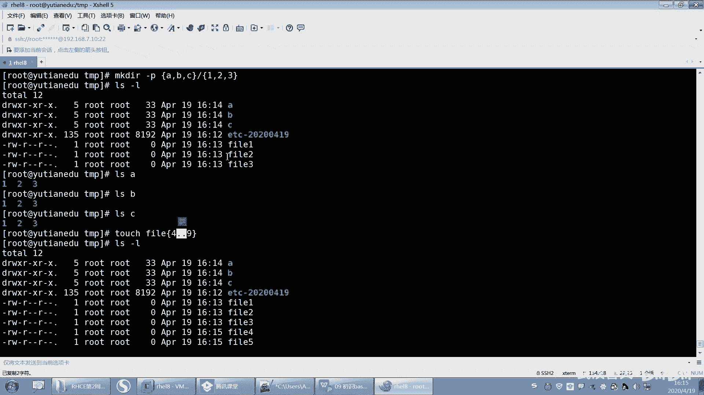

那这两种啊这两种。逗号隔开就依次去匹配1211135，然后这个就是14约12345678910。

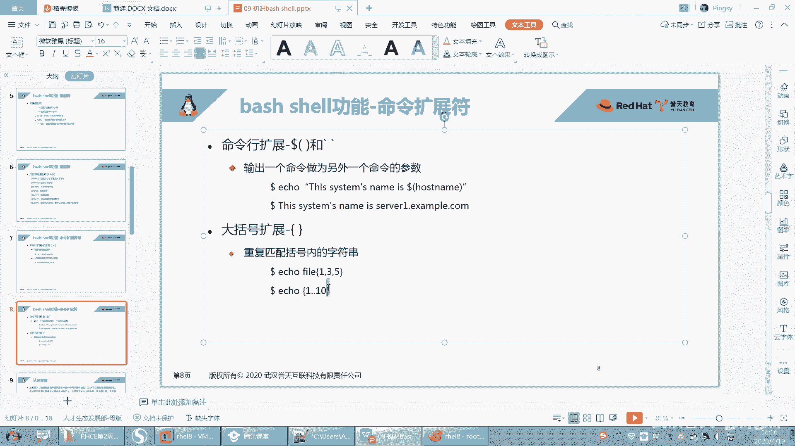

或者是你看1到100都可以。你看100个是吧，它有些匹配啊。

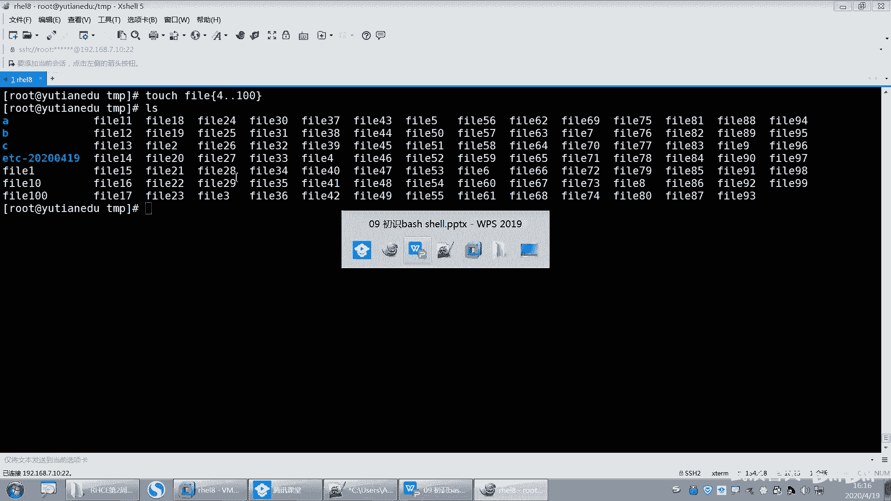

好了吧，呃，那那继续啊。好，大括号讲完了呃。大括号是吧，呃，这个多了符号，然后再来啊，下面我们看一下变量啊，看一下变量。好，变量大家应该也不陌生了啊。呃，你们从应该是从小学开始。

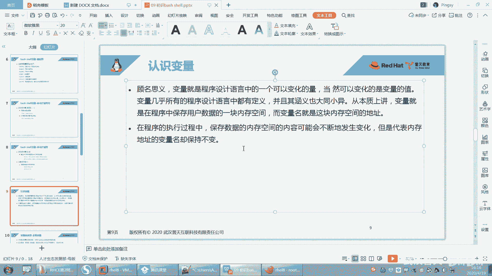

是小学吧还是初中啊？好像就学过2元1次方程是吧？学方程嘛，X等于1。X等于一Y等于什么呃，什么什么什么是吧？啊，这种那X这就是一个什么，它就是一个变量，Y也是一个变量，对吧？然后呢X加Y就等于3。

是是是这样吧，啊，它是一种变量。所以变量呢，我们其实很早就已经开始接触了。包括我们现在在学sar shear里面也有变量。

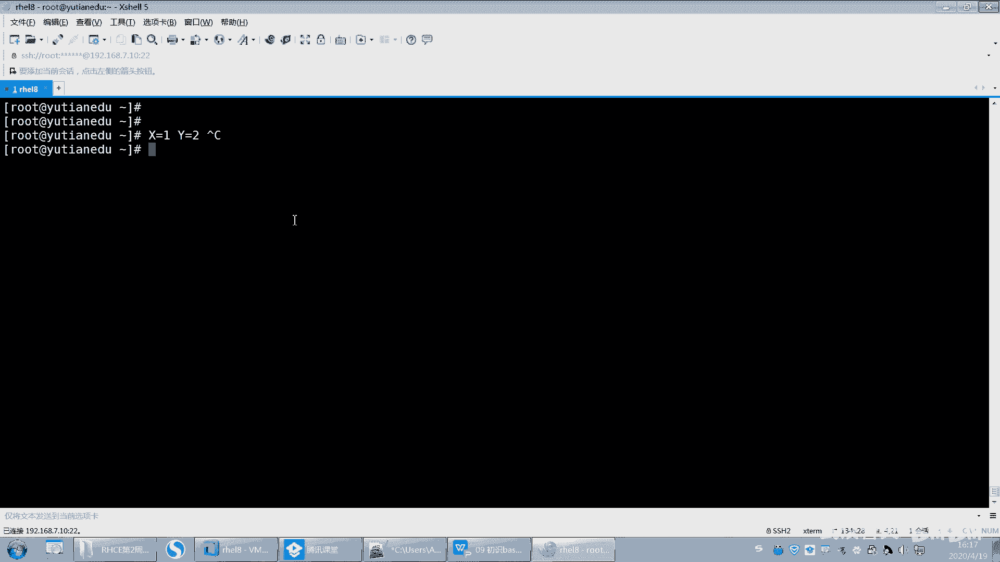

线里面也有变量啊。好，那么变量呢顾名思义就是一个可变化的量，对吧？当然呢呃变化变化的是变量的值，也就是X。

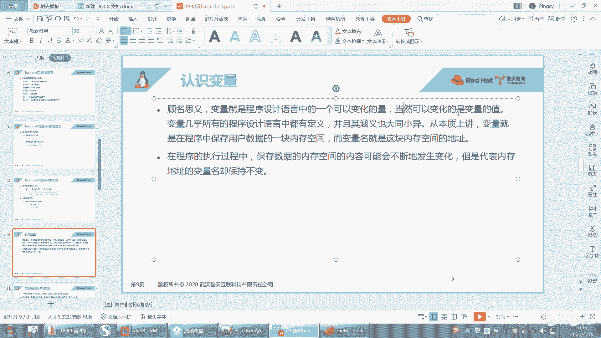

这个变量X变吗？X不变呀，是不是一直是它X呃赋予的值在发生变化呀，对不对？啊，今天等于一，明天就等于2，后天等于3，对吧？所以叫叫变量嘛，它的值一直在发生变化啊。😊。

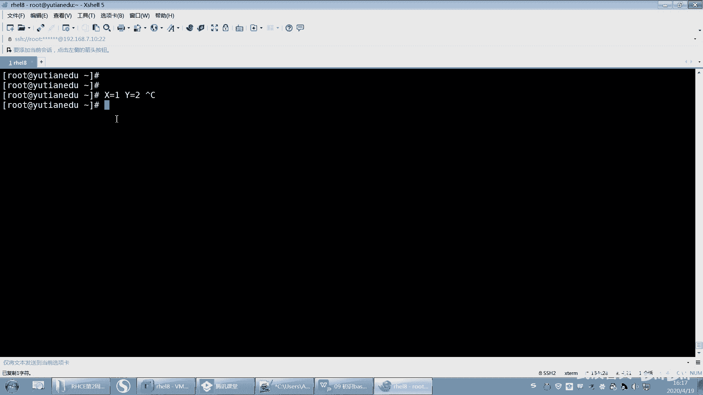

那么几乎我们所有的程序语言里面都有会去定义这个变量，而其含义也是大不相同，那么有了不一样的啊。啊，那从本质上讲呢，变量就就是什么？就是我们保存数据的一块内存空间。

而变量名呢就是这块内存空间的地址啊等等啊。啊啊保存这个这个内存空间的内容可能发生变化。但是这个地址就是说变量名不变，但是变量的值再发生变化。好吧，这就看一看就行了啊，这是它的一些定义。

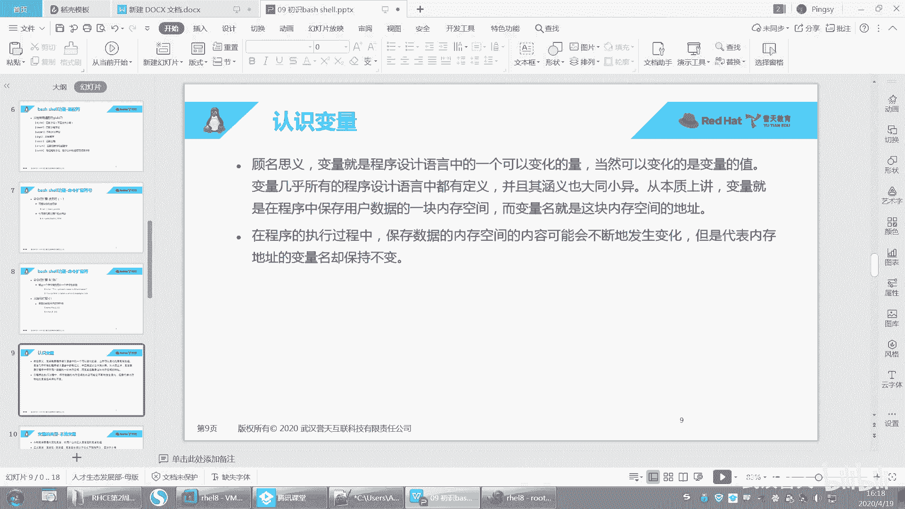

好，下面我们来看一下关于变量部分啊。嗯。你先先看我先看我看我讲啊。啊，我们定义一个变量。定一个变量啊。这个变量名呢在我们linux当中啊。啊，比如说A。呃，是个变量名。我给这个变量负值呢。

就A等于100，它就负值了。就这么简单，非常简单啊，而且我们变量在share当中。它的变量名啊，你可以你可以记一下变量名一般情况下大写。就是比如说A等于100，这样行不行？也可以。

但是就是说它是一个就是就是一种习惯吧。就是说一般情况下变量都要大写啊，变量都要大写。你比如说有的语言里面，它属欢首字母大写，对吧？比如说fall啊，这样子是不是？但是我们定义就是。

fill啊就这样去定义啊。所以在线当中，你一般情况下啊都是什么变量等于这个什么。啊，变量都是这个大写字母啊，变量大写字母，而且变量呢。这个变量比如说哎你可以是么变量这个你可以A呃一等于100。

对吧但是你不可以怎么样，2A等于200哦，这样不可以看到没有？这样就报错了，你就是不可不可以是数字开头呃，需要什么开头呢？需要字母和下划线，下划线也可以，比如说A呃等于100，这样也可以。OK吧。

徐建同学稍等一下啊，还没讲到那么多，先慢慢来，好吧。啊，所以这个变量的啊，它是要字母和下划线开头，但是数不能数字开头啊，而且要尽量大写对尽量大写。而且你在定义这个变量的时候，最好怎么样啊。

最好它是一个有意义的。比如说。fi啊，你不是说ABC呀，那这是什么东西啊，对吧？这这这这这就没有什么意义啊，就是没有办法根据这个变量你能判断出它是个什么意义的变量。好吧。OK啊。

这个就是我们变量的取值啊，不是变量的明定义变量名定义啊，那变量怎么负值呢？负值非常简单啊，就A等于100就完了。啊，A等于100就可以了啊，那么这就它的取值是100，对吧？取值是100。好。

那么现在我想去引用这个变量，比如说我想去看这个变量的值是多少啊。这个变量的值啊，我们可以用eal，你看ealA就是不是就显示A呀，它没有显示这个变量的值，对吧？所以我如果我想显示一个变量的值的话。

那么我就得加一个什么多了符号，多了符号啊。刚刚是多了些小括号，现在是多了，没有小括号了，就多了就多了ok吧，多了加变量名就调用这个变量的值，调用这个变量的值。O吧？调用这个变量的值啊。

你也可以把这个值比如说赋一给什么？唉多了A赋一给把这个变量值是不是赋一给B啊，那是不是这样就这个嵌套调用是吧？那把多了A的值，只要碰到多了，那么就把多了后面的这个是不是当做一个变量变量名。

对吧然后去调它的值。但是如果这个变量没有被定义怎么办呢？到了B。空看到没有？B没有被定义，那么它不会报错，它只会显示什么？只会显示空。不像有的语言，如果你没有去定义定义这个变量。

它就可能会报一些语法错误，对不对？但是在我们sha当中呢，它不会它直接就是空，不会报错啊，直接就是空指啊，空指。好，这就是我们如何给它赋值啊，如何给它赋值。好。

那么呃那我怎我我我我怎么知道我这个系统定义完之后，我怎么知道我定义了有哪些变量呢，对不对？好，你可以用。

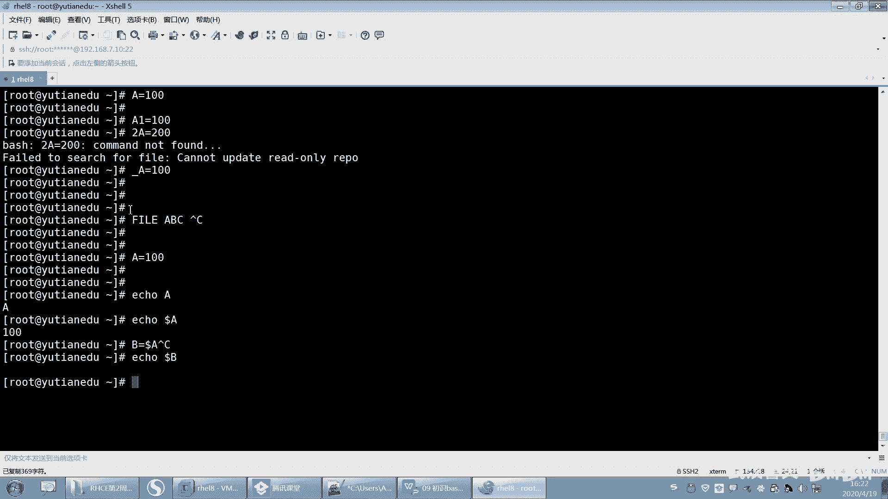

一个叫呃叫哪个叫set。

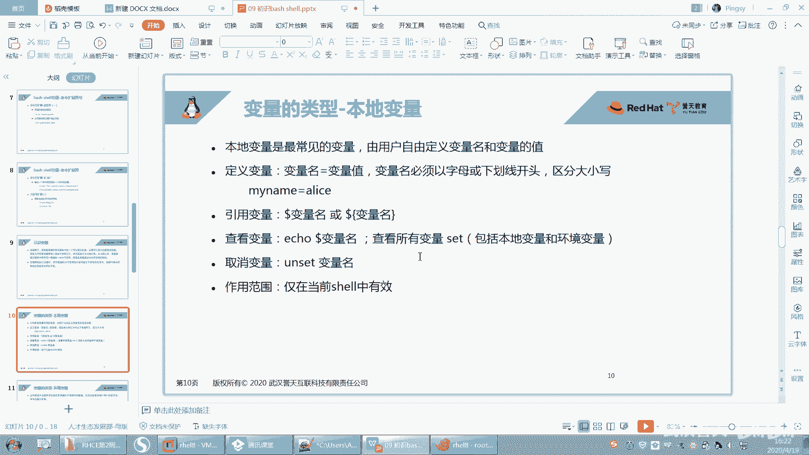

啊，叫set啊set回车。哇，这里好多。对吧这个。这样吧，我们过滤一下啊。喂。好，A等于是吧。好，所以你看我可以过滤出s的去查看呃，这个这个所有的变量，所有的变量啊，我定义的所有的变量grave杠A。

好，那么你这个变量定义好之后，我想把它取消掉，我不想让这个变量。嗯。啊，不想要这个变量了是吧？那就取消掉叫unet。😡，unad，比如说把A去掉。那你看这个这个是不是就没有了？这个是没有了。

就un set unet a。安ai a。哦，然后再来看AA。GA等于。好，那这个是不是就没有了，看到吗？就是unet是。取消变量set是查看所有的变量，按 set加变量名是取消变量。OK吧。

取消变量啊。好嗯，再来啊A等于100。好，现在呢我想显我想去嗯显示。100B就是100B。这个100呢我不想直接写100，我想写用A的值。去来代代就是代替啊。

就是我要用do了 A来代替这个100这个位置。那就是说do了 A啊，B是吧？好，所以我显示它的时候应该这样啊。多了。A。呃，B是不是这样啊，看到没有？多了A是不是100？B就是不是就显示B对吧？

但是它没有我们想象的什么那么聪明。😡，对吧他没有我们想象那么聪明，他怎么知道哦，A就定义了，B就就就就是一个单独要输出啊。所以这个时候他会把什么，他会把这两个。是不是看作一个整体。

那AB是一个整体AB有没有定义的，AB是没有定义的，所以输出空，所以输出空O吧，所以输出空啊，那如果说我想让它就显示100B，这个时候你就要需要加一个括号，加一个括号，这个括号，这个叫什么叫大括号。

注意是大括号，不是小括号啊，小括号是调用命令之应的结果呀，大括号是调用变量啊。好，所以你调用变量时候有两种方法，一种是什么？多了A，还有是多了什么？多了用括号括起来的这两种方式。

那你说这两种方式我用哪一种呢？啊，这种方式基本上都可以用，对不对？啊，没有错啊，没有错。但是这种方式是为了防止那像这种情况是不是无法去区分A跟B啊，那无法区分AB和单独的A和B这个字符串呢。

那这个时候如果遇到引起歧异的地方，那么请用它用大把它把变量名用大括号括起来，这样的话就会完全去区分A跟B啊，那区分开来。它就是个整体，对吧？概括括去里面就是个变量名。呃，除了以外，那就是什么？

那就是不是变量名，那是字符串啊，字符串。好，所以有两种方式去调用变量的值啊。

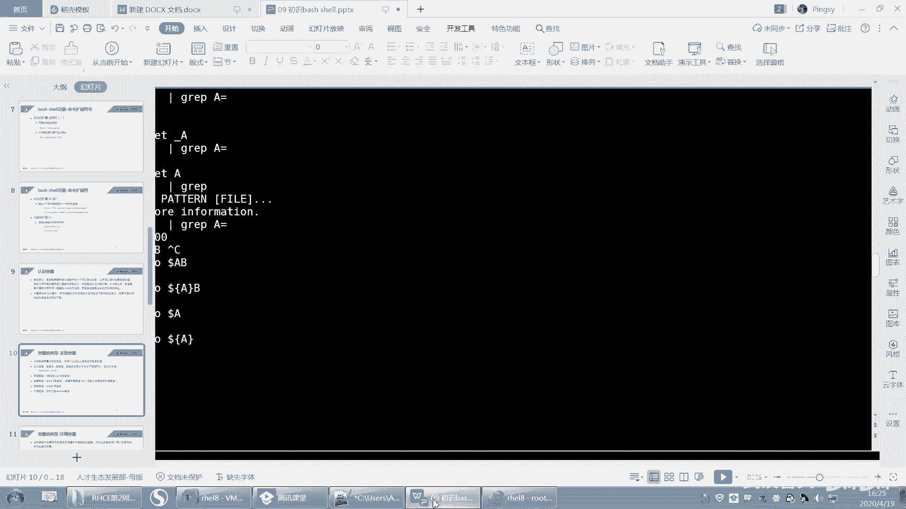

好，这地方我有给它写啊啊，定义变量变量名等于变量值，变量名必须以字母下划线。开头区分大小写大小写区分的啊，然后什么什么等于什么什么就负值了啊。那引用变量的时候呢。

就do了加变量名或者do了加变量名大括号括起来。好，然后查看变量呢就用什么用eco加多了加变量名，查看所有的变量，用st，对吧？好，这个有小括号，这个先不管它啊。那么这个就要取消变量。

取消变量呢就是an set加变量名。OK吧，NC加变量名啊。

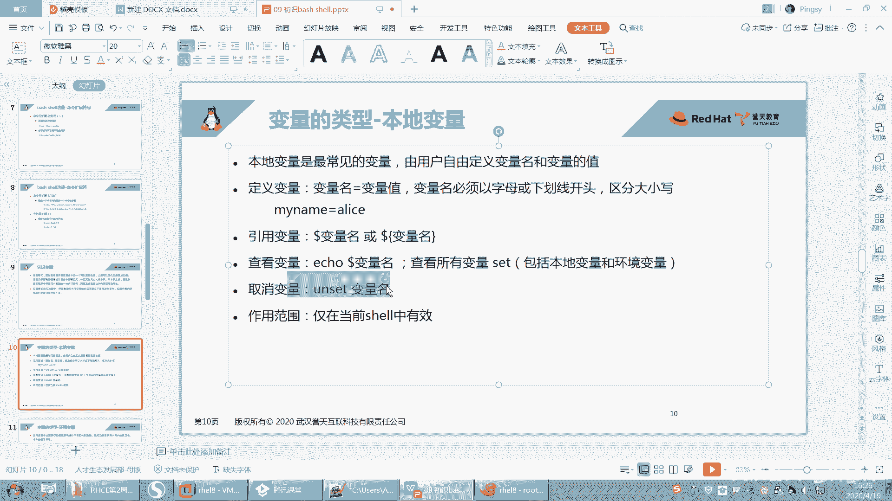

好，一般情况下，我们在这儿定义的变量。在这儿定义的变量啊，比如说ealA。等于100这个变量。它呢仅在当前shaar中有效，作用范围仅在当前shaar中变有效。所以我们称这种变量。

我们给它起个名字叫本地变量。

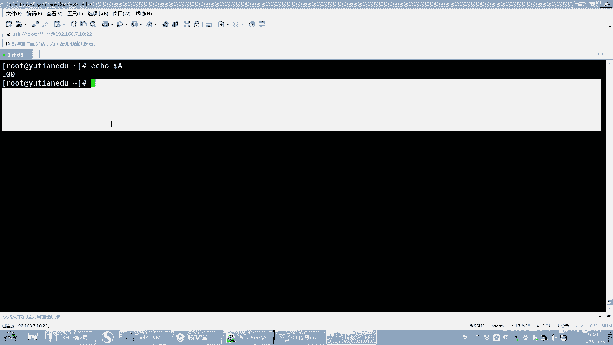

啊，当然有的地方也叫什么自定义变量，叫什么变量，什么变量，反正都一个意思啊啊，我们称它叫本地变量，好吧，叫本地变量啊。

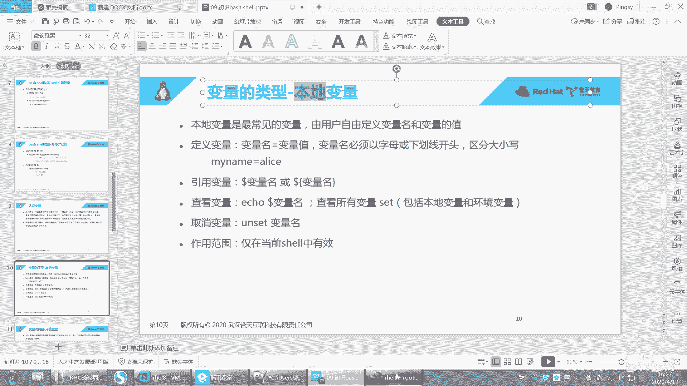

好，那么这个本地变量怎么在当前线儿中有效呢？什么叫在当前线儿中啊？好，你看啊，我现在呢。我这是不是有希儿啊，那就就给我一个什么，给我一个命令行，我是不是就敲命令，这是不是希啊？😡，好。那么你看啊。

我可以切换一下share。比如说我SU杠是不是切换用户了，那我切换用户的时候，这边又重新开启了一个share。😡，好，我退出来啊退出来又回到之前那个谢儿了。好，这样啊我切换用户用一个命令叫bush。😊。

我们系统当中有一个命令叫bush。好，唉，为什么这个。我们这我我就我们用sha的时候是B。我们是为什么是个这这个这个路径是吧？嗯，你看这个路径，我为什么是哦，它是bu学？因为呃你调用的时候。

它是这个文件来引引用的这个文件啊，就是我们那个password里面啊，引用的是这个文件，文件的路径啊，文件路径。好，我也可以执行bush。你看bush一下。😡，只要我bush一下。

它就切换了一个hear。😡，看啊which。bush是不是USRB下面bush，这个是不是就是它对吧？啊，所以我在这个地方bush一下，我就切换了个here。😡，切换了一个线儿。好。

切换歇了之后再来看A还有没有啊，没了，看到没有？A，这个值就不见了。好，我退出去。再来。再来eal多 A有没有啊？有是不是就有了呀？好，发息一下。就没了，看到没有？你叭一下就没了。😡，你退出去就有了。

😡，对吧那这个叫什么？这个叫这个A仅在当前事中有效。好，还是有同学感觉你这是什么鬼是吧？好，有点抽象啊，看好啊，我再bush一下。😡，然后我们有一个叫进程数，我们有个命令可以叫PSG。PSJ啊。

它可以查看这个进权数。好，你看哇它是一个树状，看到没有？它这个有点类似于那个train命名。装了没有，这个吹大家用过没有啊？😡，对吧类似于这个train命令是吧？😡，就是吹一下根。呃。

那它就是这样一个树状结构啊，树状结构。好，那么PS tree是什么呢？PS tree指的是进程的树，叫进程树。进程。我们后面也会学到呃，我们这个地方先简单说一下啊。就是说什么叫进程呢？

昨天是不是稍微点稍微点了一下啊，就是你那你开启个。

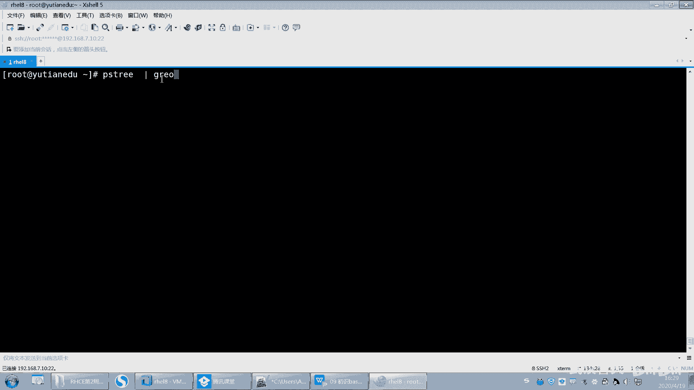

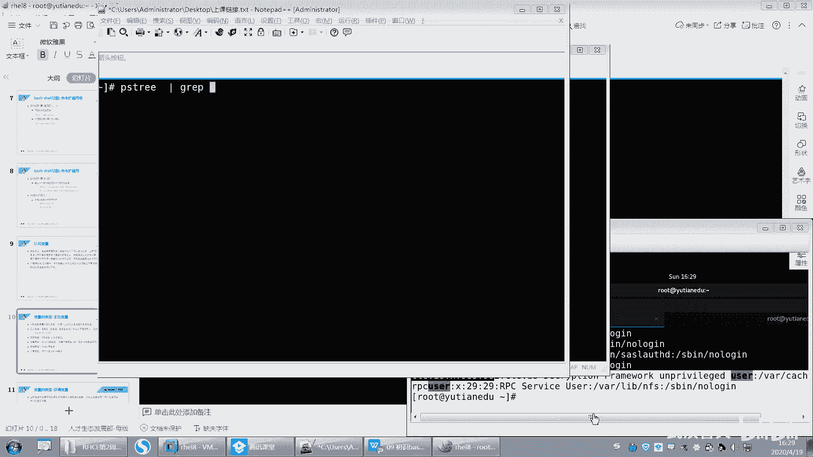

oh my god，我点了什么东西啊？嗯。

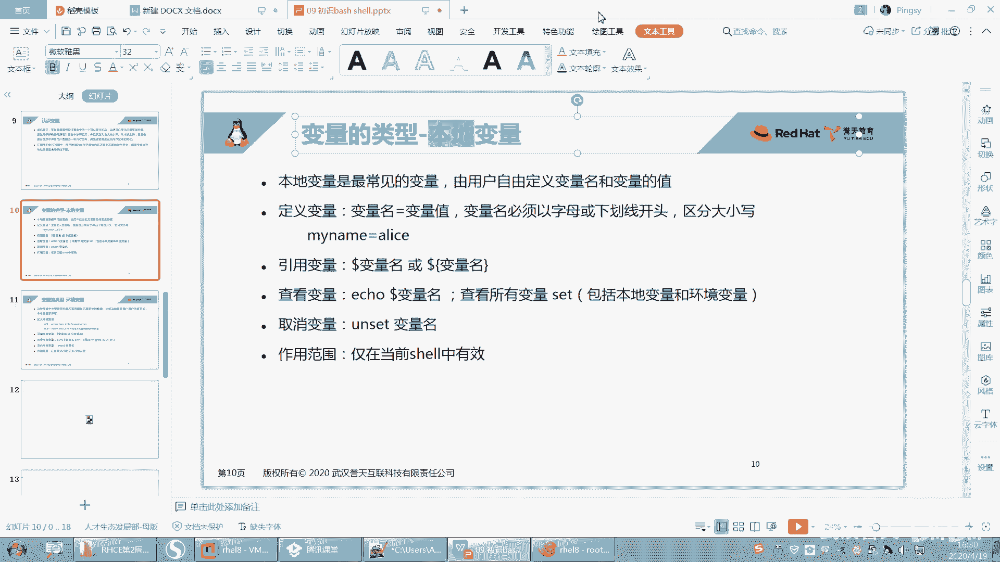

好。O。进程数你看它是这样子的。他继城有父继城，有子继城，有父继臣，有子继城，对吧？这是父亲，这是儿子是吧？呃，所以一般一把附禁城给干掉，那么紫禁城就就就也会呃也会退出，对吧？那你把紫禁城干掉。

那附禁城他有可能还在还在啊。好，所以我们每次开启hear的时候，它都会生它都会生成一个进程，生成一个进程。所以我们来过滤一下好不好？过滤一下bush，因为是bush shear嘛。

因为是bush share啊。好，你看这儿。我这里有几个bu，我这个gra，你看是不是在这儿执行的，这个gra是临时，就是它执行完之后。😡，他就没了。变量有什么用？变量有什么用途是吧？

我们这个系统当中全都是变量，全都是变量。嗯，你先你先听我讲变量是怎么回事。后面我再看教你一些系统的变量，这个变量有什么用，好吧，因为变量值是会发生变化的。嗯。好。突然问了变量怎么用。

我都不知道怎么回答了啊。哦，变量有什么用途是吧？好，那么我们再来看一下啊。呃，这个bu现在我在哪儿？现在我在哪儿？现在我是不是在这个地方在这个呃bush这个地方是执行grave，对吧？

因为这个grave呢，它执行完之后就结束了，所以它临时有一个grave的进程啊。😊，好，那我是不是在这个地方定义了一个什么？我在这里哦，是不是定义了个A等于100啊？然后我霸了一下，是不是去到这里来了？

😡，那你说你隔壁这是个什么东西呢？😡，隔壁是这啊，隔壁是gome tominal，是这里是这里啊嗯。

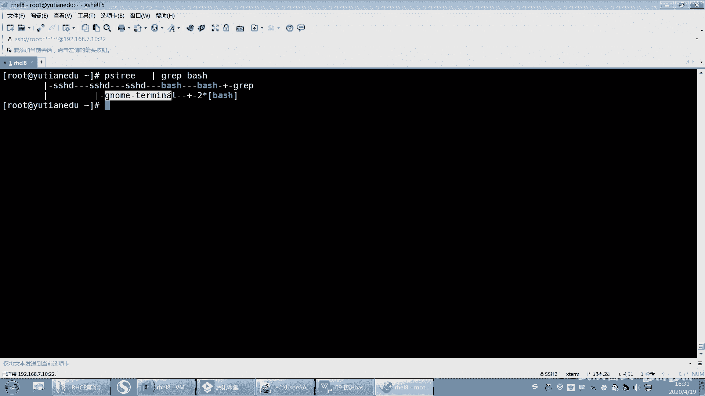

我这还开了两个。

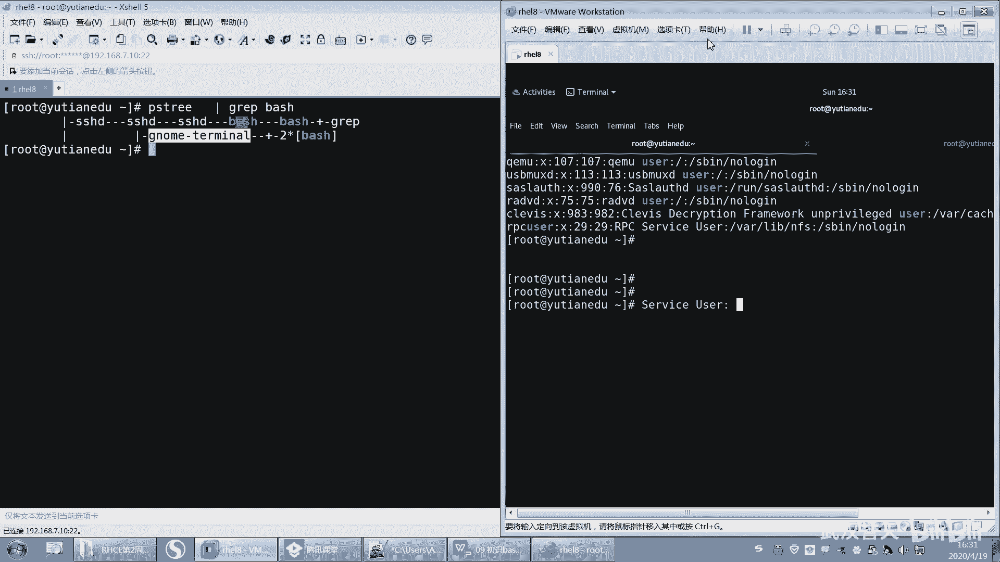

看到没有？那这个这个好，你看我退出一个啊。

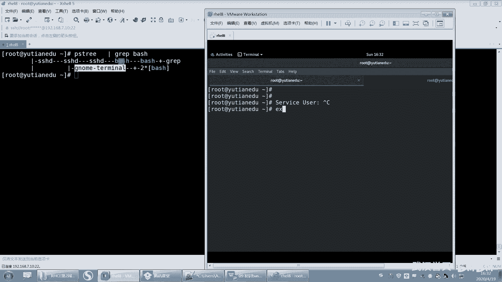

然后你再来看。这个地方本来是二嘛，这是不是变成一了呀？然后再退出一个。啊，这再看。是不是只有这个了？对吧所以只要你你开一个窗口，比如说在隔壁再开一个窗口。😡，那然后你再来看这是不是又多一个？对不对？

所以就是你只要开一个这样的窗口，它是不是就开启一个进程，这叫bush进程嘛，叫bush进程啊。😡，好，所以我在这个地方。在这里是不是看不到这个A的值，因为我在这儿了，我是在哪定义的这个A的值呢？

我是在它上面一个，我是在这儿定义的。所以你回来之后你就可以看到了，看到没有？回来之后你就可以看到这个值了，但是你。你看啊PSG。有点抽象吧，是不是有点抽象？那我现在回来之后，这个这个这个是不是关了？

你退出之后，它就关掉了嘛，关掉之后我是不是回到这儿了，回到这儿，这是不是就我定义A这个变量啊？😡，定义A的变量对吧？那么我在这定义的，我是不是在这可以看到，那我切换到别的hear里面。

那时候隔壁这个here能不能看到？那隔壁这个here有没有A啊？😡，有没有A没有A吧，隔壁这个事是没有A的。为什么呢？因为这个变量在这定义只能在这个hear里面有效。在别的线里面都没有效。

这个叫本地变量。这个叫本地变量OK吧，这本地变量。你像这个东西，这儿这都是变量生成的呀，这个东西都是变量生成的呀，那这全部都是变量啊，它怎么就哦它怎么是哦切是root的时候。

那呃我是root身份就显示root呀。😊，呃，我我是root身份，我就显示景啊，那怎么我我切到什么？😡，我就admin，它这就变成admin了呀，它这是不是就多了符号了呀？😡，如果你把它写死了。

这个情况这个这个变这个地前面写死了，那你是不是永远都会是一样的呀？所以这个地方是不是定一个变量啊，所以这个前面这个提示符也是一个变量怎么样呃，一个变量呃呃来控制的那这个变量在不同的环境下。

它的值是不是取值是不一样啊，所以这就是变量的作用啊。😡，对不对？你不能把一个值写死啊，写死了，你就它就不能随着什么环境的变化而变化了。😡，啊，这就是变量作用嘛，对不对？好，而且你像每个用户它都不一样啊。

能能听懂我说意思吗？好，那这个叫本地变量，本地变量它是没有办法进行怎么样。没有办法进行继承的，就这个变量值，它不能继承给其他的什么，不能继承给其他的尔。😡，好，那这个叫本地变量。

那还有一种变量叫环境变量。叫环境变量。就第二个，第一个叫本地变量是吧？

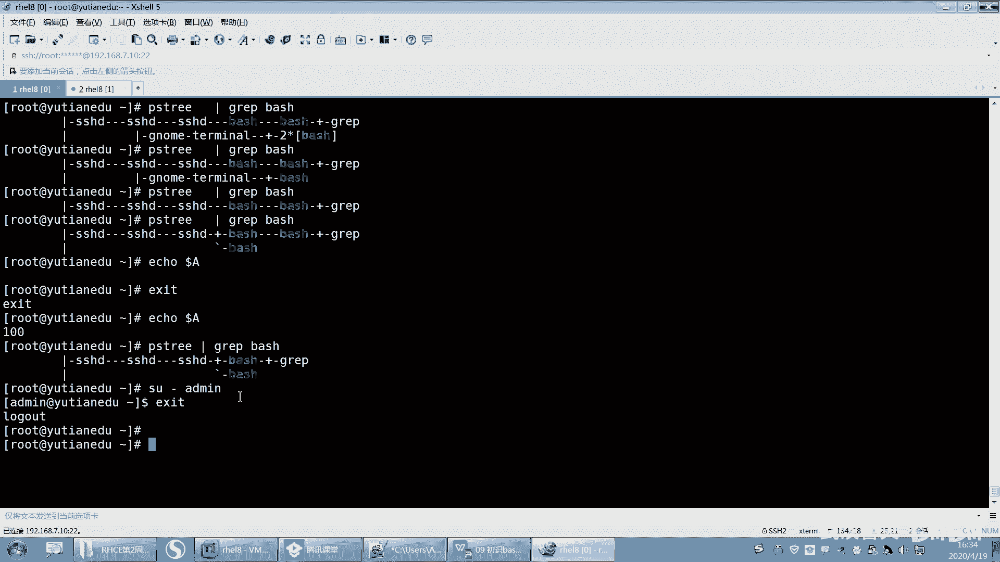

本地变量吗？还有一种叫环境变量。

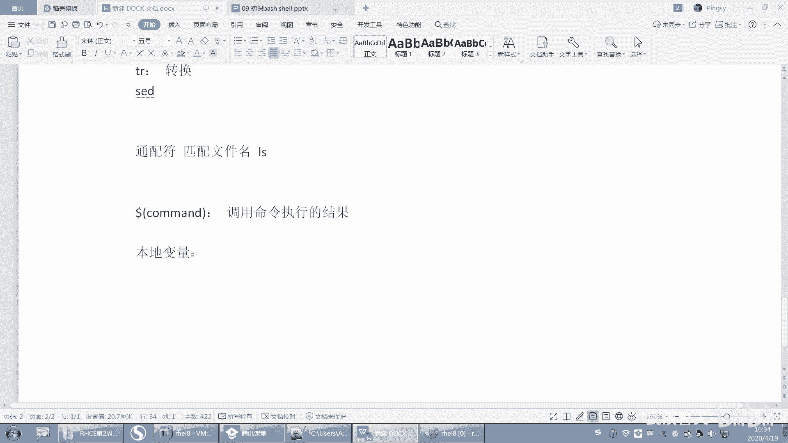

呃，环境变量啊，那环境变量是什么呢？环境变量用一句话就可以描述了，它指的是在当前sure和子 sharear中子sure啊。

中有效的变量。有效的变量。那么第一个本地变量。本地变量在哪个线儿有效啊，是不是在只在当前，只在。当前。虚中有效。OK吧，这个是指在当前序中有效，这个是在当前序儿和子序儿中有效。好，我们来测一下啊。

现在这个A。😊。

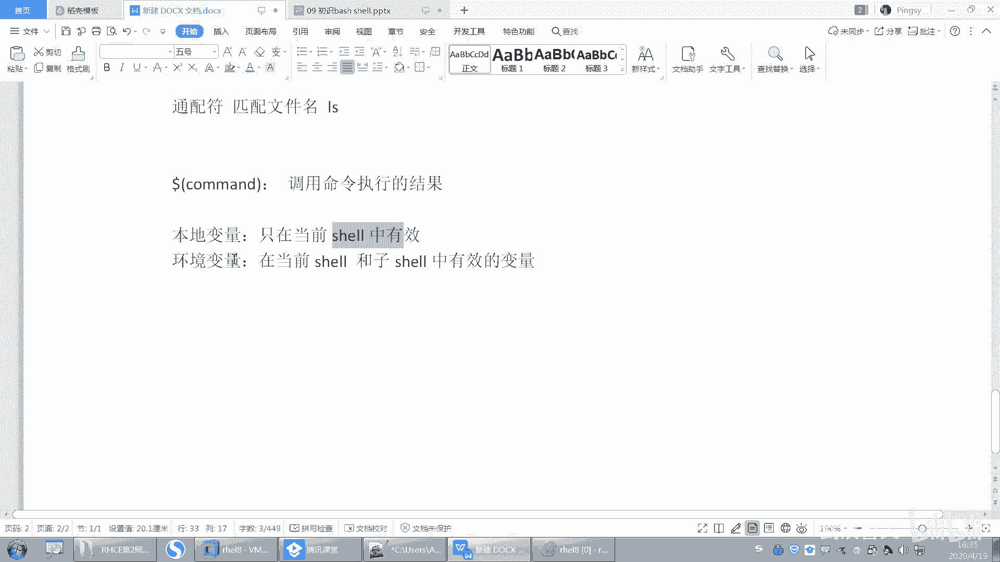

这个A啊它只是一个本地变量，我想让它变成环境变量，非常简单，export一下A，它就变成环境变量了。它就变成环境变量了啊。好，变成环境变量之后来看一下我是不是在这定义的A呀。

在这个 share里面定义的A，对吧？好。现在我要切换线了哟。😡，大气项。然后 equalal多了A。有没有啊，是不是还有啊，我现在在哪个 share里面了呀？我现在是不是在它的子 share里面。

我现在是不是在这儿了呀？😡，在这儿依然还会有什么还会有这个什么100哦哦，还会有这个A值哦。所以在当前线和子线中是不是都有效了，而且我还可以再切。那有没有啊，有它依然会继承，依然会继承啊。那你再看一下。

我是不是在这个 share儿里面了，它也有继承，对吧？那隔壁这个 share儿有没有啊？我在这定义的隔壁这个shire儿有没有隔壁这个buush有没有，你看啊。😡，没有啊，因为他们两个有没有关系啊。

他们两个没关系啊，他是不是他子线儿啊，这个线儿不是它子线儿啊。😡，就像你家的就像你家继承遗产一样，对吧？😡，你爸的遗产是不是只能继承给你？😡，对吧继承给儿子孙子嘛，对吧？

你不能继承给隔壁的那个谁谁谁是吧？😊，啊，所以这个叫环境变量。环境变量有一些值它会为什么呀？它会这样继承下来啊，这样变量值会继承下来，记住了吗？叫环境变量啊。好，退出去退出去。好，我其实只要我退出去了。

那么这个hear它就关了，就关闭了啊，就关闭了，这个hear也关闭了。对它sha这些变量，它都是定义在内存里面的。注意变量的值都是定义在内存里面的，OK吧。啊，能能不能理解变量值都是定义在内存里面的。

嗯。

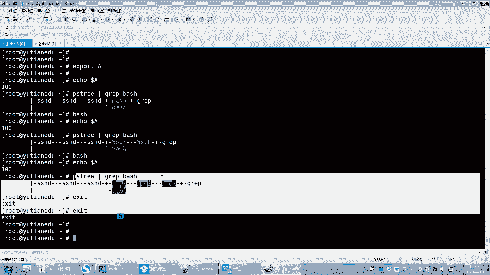

好。就像你们去写C语言的时候，或者是写java的时候，你们定义的那些变量是不是读一遍，你才能把那个值取到啊。你不读，你不执行你那个值怎么取到的，所以它都是在内存当中生效的啊，O好。😡。

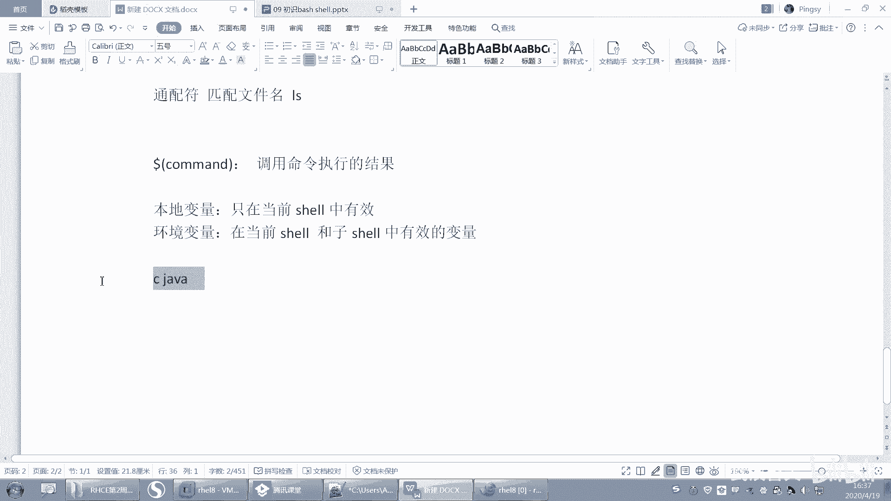

嗯。重启就没了呀，那肯定重启就没了呀，那没了怎么办？为什么你看我这个重启，那说老师，你不是刚刚说这个地方是个变量吗？重启就没了，怎么我重启这就还有啊，因为它写到文件里面了。你重启之后，它就会读那个文件。

把那个文件读到内存当中，然后又把这个变量加载出来了，OK吗？😡，A a form名。好，那我这个地方没有写文件，对吧？我是不是只写在什么？我只在这儿没有写文件吧，我没有写文件，那下次肯定没有了呀。

而且不仅是下次重启没有，我就把这个share退出，它就没有了。😡，那那个吸退了呀，那进程关闭了，还有没有啊，没有了。😮，定义变量的那个进程关了，它就没了，对吧？要想再有A等于100。

这样再定义啊再定义好吧。啊，而且我可以怎么样？export直接A等于100回车，这样的话它就直接变成环境变量了。就是定环境变量有两种方法去定义。第一个就是A等于100，然后再将它export。

再加到Xport就这样啊。呃，分号XportA。嗯，好，第二种方法就是什么直接export a等于100。这样的话那这种。OK吧。好，两种啊两种。好，那我想看这个系统当中所有的环境变量怎么看呢？

ENVENV回撤。啊，你看这里是不是有嗯。DNV。指的是什么？ENV指的是啊environment就是那个环境那个单词。ENVIROMENT是吧？嗯我感觉有点难。哪有一点不对劲儿啊。

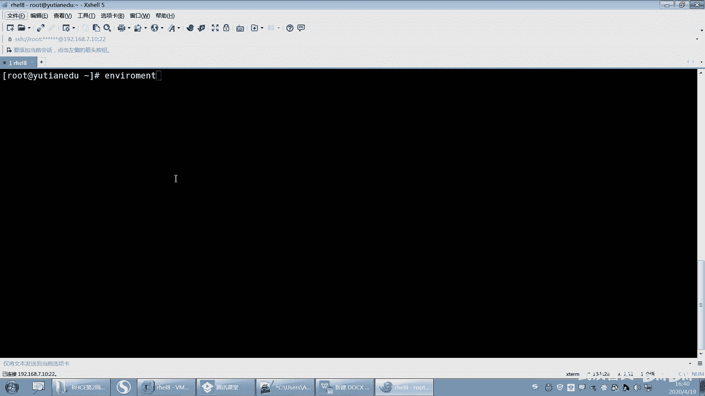

嗯。这个环境那个单词吧。

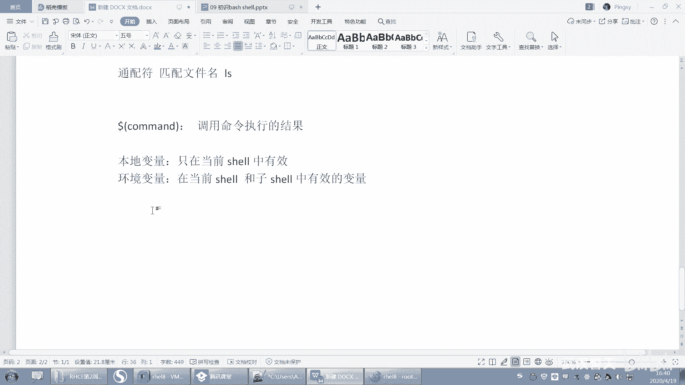

哦，VIRON是吧？嗯，咱们班大佬不少啊，ENVIRON对，这个少个N啊RRON environment这样子啊就是ENV啊。

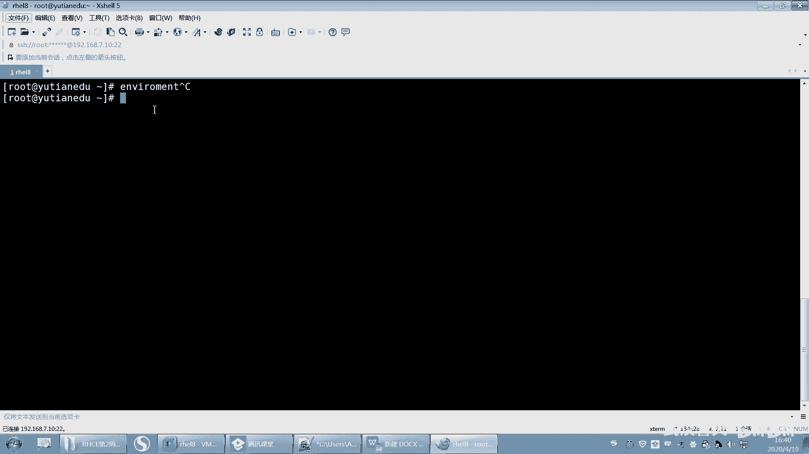

好，那么呃同样我们set哟。呃，区分一下啊，刚刚讲s set是查看所有的什么所有的本地变量。2。本地变量是吧，然后ENV呢去查看什么，查看所有的环境变量，你们记啊环境变量。嗯。嗯。环境变量是吧？好。

我们说呃这个呃就这这个。取消环境变呃，取消本地变量，用unet。同样你取消这个呃环境变量也用un setO啊好，unet a。

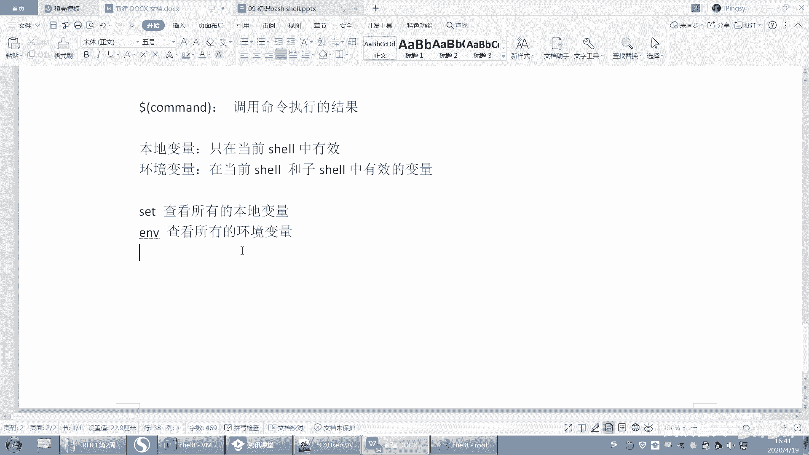

他就没有了。你看。啊，就没有了是吧，这个A就没有了。O吧，这都是我们系统当中的一些环境变量。好，un set a。

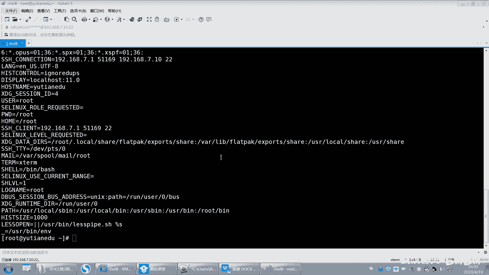

好，呃，在这儿我也给大家写了一下啊。嗯，那这种变量主要是保存适和系统相呃环境相关的一些数据啊。比如说你登录当前用户嗯用户的加目录呃，命的提示服，这都是这都是变量，对吧？然后定义环境变量。

环境变量export什么什么什么。好，然后引用环境变量哎一样的啊，然后查看环境变量这样子啊，ENV也可以是吧？然后取消环境变量aset作用范围是在当前sha和子线中有效啊，当前sha和子线中有效啊。

好了吧。呃，下面我们来讲一下关于系统的一些变量啊。

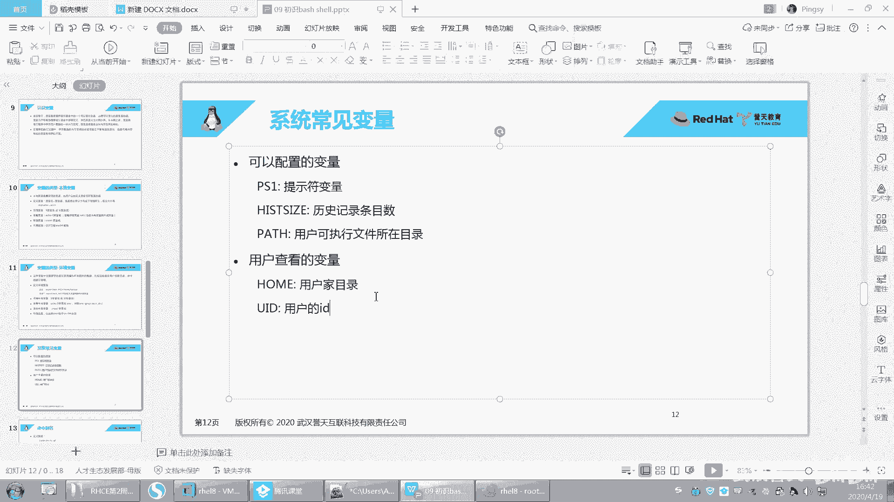

啊，刚刚不是说到那个提呃那个提示符吗？说这个提示符对吧？啊，我们来看一下提示符既然是个变量，那提示符是哪个变量呢？这个变量叫PS one。叫PS one啊，这个变量叫PS one。啊，呃。

你看这个地方它其实是有一些系统自已经定义好的变量啊，哦反斜杠U就是指的是么？指的就是这个呃。当前用户是谁？哦，反西杠H指的是我的主机名，反斜杠W指的是我这个这是一个相对路径，就是我当前的目录。

然后这是多了符号，对吧？为什么这是多了呢？因为。所有的用户都是多了啊，但是唯独只有root是井号，所以你可以写个判断呢啊判断如果是root，那么就等于井。如果是呃普通用户不写了，就不用其他的不用写。

就默认就等于井呃，多了嘛。然后如果是root就是井啊，这就是一个提示符的提示符的一个变量啊变量。嗯，他还可我可以更你可以慢一下啊，你说我怎么我怎么知道这个这个这个百分号优是这个就那个用户名是吧？

你可以搜一下啊，我觉得可以搜一下PS one嗯PSone那你看PS one这个值就是什么什么。提示符的值还PS two是吧，还ree。好，这里有啊。嗯，你看这个地方是不是有啊？呃，反斜杠。

反斜杠W就是什么？是当前的工作目录是吧？你看这是不是有说明啊，反斜杠doll了，他说如果有效的UID是0，那么就是什么？A呃，除此以外都是doll了符号。啊，玩具刚U是指这个吧当前用户的这个什么用户名。

好吧，这里都有都有说明啊，就是那个man巴啊。好，下面我要讲一个非常非常重要的变量。人证厅啊，非常非常重要。特别重要老重要了。好，这个变量叫什么呢？

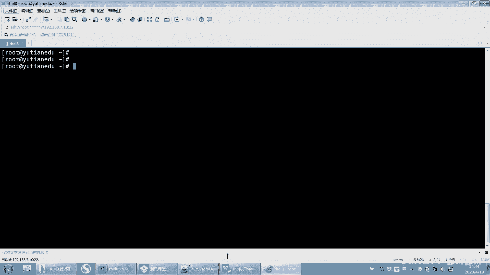

嗯。这个变量叫pass变量。

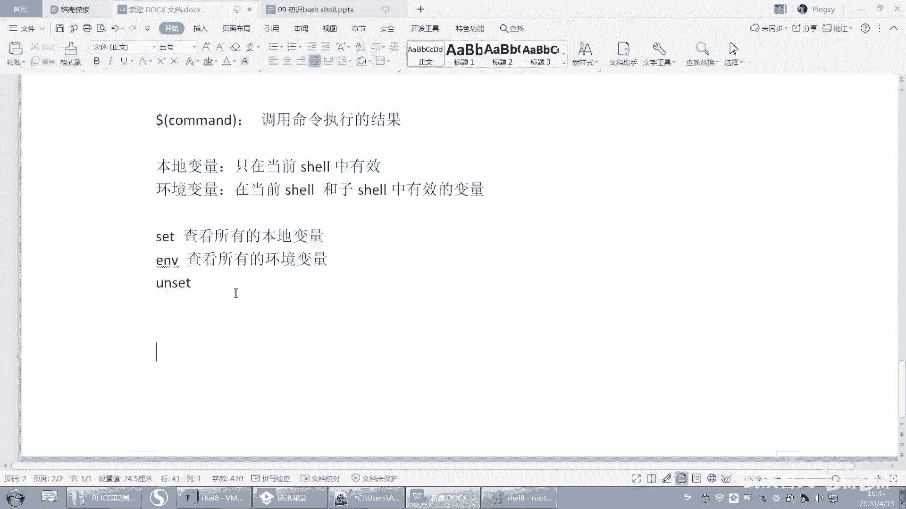

呃，很多同学应该听。