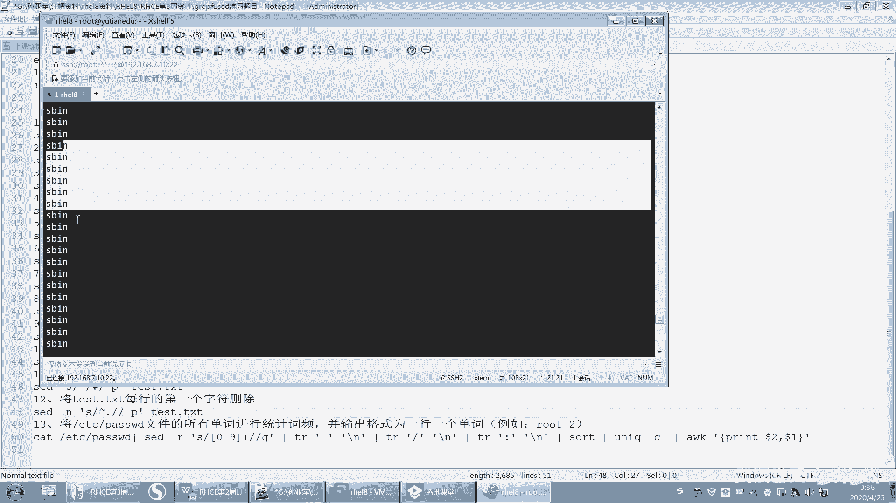

# 【已更新】最新版丨誉天红帽RHCE 8.0系列培训视频 - P46：bash shell补充-46 - 武汉誉天 - BV1cv411q74E

那3逗号4，而且为什么用egra？因为这个括号后面这个这个括号是扩展扩展征则，所以用的是egra。如果你用group的话。那你就要加一个什么，加一个杠大E这样子啊，加一个杠大EOK吧。

好。你可以去查一下嘛。我到时候这个也发给大家，你可以再去。测一下。No。对吧三位或者4位的数字都找出来了啊。

啊，第三题找出ETCg up呃，to点CFG文件中，至少以至少一个空白字符开头。也就是说呃它要有空白字符开头，并且后面又跟了空半空呃非空白字符。为什么加这个呢？因为空行不算呢？对吧我们不算空行啊。啊。

那至少一个空白字符开头至少一个嘛，那一个的话是用什么用什么呀？这个是空白字符，对吧？😡，看到没有？这个是这个间号在中括号的外面代表是以什么什么开头，然后这个是什么？这个是这个space。

这是一个是一个这个这个空白字符啊，那这么空白字符出现了什么？1到多次，因为加号代表是1到多次啊，然后后面呢这个指的是什么？后面又有一个非非空白，因为中呃间号在中括号的里面，所以它指的是除了什么什么以外。

那就是说除了空白以外的字符。OK吧。好，第四题我没有给大家出啊，这个我就算了。第五题这个同学说老师没有是吧？没关系啊，你只要把这个正子表式写出来就可以了。因为有时候装磁盘的时候，我们选的不一样啊。啊。

中括号括起来的表这个一个字符对吧？S或H，然后后面是A到Z啊，A到Z。这个比较简单吧。然后找出这个啊，这个有同学说老师没做出来是吧？嗯，好。

它是找出ALDUSR并cat这个命令中结果命令结果中文件的路径是吧？好，我给大家看一下我做的啊。

最后要实现什么样的效果？好，你可以看一下啊，我们先。现在是不是实现了这个命令执行的结果是这个对吧？其实我要找出的是这个路径和这个路径看到吗？那这个路径跟这个路径啊啊，那么这两个路径怎么找到呢？

我们可以用匹配group e group杠O啊E group的话，我们可以这样啊。呃，如果是一柜不匹配的话，我们不加杠窝的话，看一下。他就会把后面这个你看这个是斜杠嘛，点是不是任意字符啊。

然后心是指它前面这个出现了任意次嘛，其实这中间就是。任意个字符，任意多个随意的任何一个字符，那么以斜杠开头对吧？斜杠开头，那么后面匹配到了。好，后来加个杠窝杠窝指的是什么？杠窝指的是它只匹配。哎。

匹配到了这个地方就显示，其他都不显示了，这些就不显示，只显示这个就是杠窝的意思。好，然后路径的话，我们可以用什么用空格呀，这种分隔符，然后把那最后一个是不是路径，那后面这个不路径嘛，不是路径吧，对吧？

所以把它给过滤掉，O吧，就这样子。所以这个是这道题啊，就把它给过滤掉了啊。好，路径截取出来了。

啊，第七题，pro memory inform文件当中要求以大小写S开头的行，至少有三种方式实现啊，这个有同学也做出来了啊，以什么呃，这个忽略大小写，然后这个是一个以什么什么开头，对吧？

这个是一个做一个整体，然后S或者是小S或者大S这三种方式都可以啊。啊，这是扩展政则里面的是吧？啊，第七题，这个是什么或什么或什么，这个就扩展正则嘛。用竖杠隔开，这个没什么说了啊。

看PPT如果还不知道的话啊。第九题，输出一个绝对路径，要求用egroup，这个也不用说了吧，这个就是典型斜杠，就是直接把ETC截取出来。那呃里面包含一个斜杠，还包含一个斜杠，这个两个斜杠中间什么？

中间有任意个任意一个字符。然后这个杠窝指的是直匹配这个。啊，把这个提取出来就可以了，只直接显示ETC那我说提取出ETC对吧？我说例如。他的话就提取出ETCOK吧。好，然后取出ifconIPV4地址啊。

这个呢呃有同学做了。

嗯老师这个IPV4进去是吧？呃，IPV4地址的话。我们知道IPV4地址是在这个地方。是这样吧，是不是在这个叫annet是吧？哦，那那你结的时候，那你就要结什么？

and net但innet这个地方又有什么，又有这个。呃，有个6是吧，这是IV6地址啊。所以你要加一个。杠W就可以实现吧。你看杠W是不是就可以实现呀？啊，然后你这个就随意了，这个应该会了吧。

这个就可以多种方式去实现了。比如说AWK啊，或者用我们学过的，我说上课讲过了一个cut啊，或者讲一个TR是吧？首先因为有多个空格，所以我们可以把这个多个空格变成一个空格。那这样的话。

我将来就可以怎么样就可以去以空格为分格符啊。呃，以空格为分割服务。呃，D是吧。然后是第几列啊？哦，那就是第三列。对吧那这样是不是就出来了？啊，或者用AWK来实现也可以啊。

有同学用AWKAWK呢就是第几列啊，就是第一列第二列对吧？AWK这样的。呃，AWK然后。嗯。嗯，print是吧。do了2。好，这样啊就是第二列，不是你多了二，就是第二列。你你想打，比如说打一第一列。

那就多了一。多了二多了一降，而且可以改变它的任意顺序，看到没有？啊，然后它默认是以空格为分隔符的啊，会打印出来这样。啊呃，这个是grave部分的SED的话，前面其实有很多都我都不说了啊，这都讲过了。

上课期也讲过了。然后第三行第三行的第十行。

是吧。然后这个是匹配一个正则表达式，这个正则表式里面可以是作串嘛，也可以是正则表式来表示，是吧？然后删除test呃15行以及后面所有的行，15加15到doll了是15到最后一行是吧？

所以dollar符号就是最后一行D就是删除的意思。啊，然后这个teacher插替换就比较简单了吧。S将原来的这个root替换成TOOR并打印出替换的行是吧？然后P打印。好，第七题是将这个替换成这个。

那这个也没什么，这个也很简单。因为这个里面有个斜杠，所以你可以把原来这个替查找替换的这个斜杠换成。艾特符号或者换成任何一个字符都可以。比如井号啊。感叹号啊对吧？都可以啊。那你不想换的话。

那你就把这个给加一个反斜杠，前面这样子。去掉它的特殊含义。加个反斜杠啊。好，然后第八题。呃，5到10行所有数字匹配数字嘛，那就是这个数字是不是就这样匹配啊？1到多个吧，对吧？数字。

那你数字至少就存在一个吧，所以就是加嘛。然后这政则这是扩展政则，所以要加杠R杠R看到没有？5到第十行S就是替换，它要替换数字替换成空就删掉了。然后即是这一行的每一个查找到的这个匹配到的词啊。都替换。好。

然后P打印。好，删除删除这个地方啊，他说删除test这个所有特殊字符是吧？其实除了我们正常的数字大小写以外，其实其他的基本上都是特殊字符。所以你就把这些都排除掉就行了。对不对？0到9A到Z大A到点大Z。

然后加是1到多个字符，然后替换成空。这个就啊加正这是扩展政则是吧？因为加号嘛，加号是指扩展政策里面的，所以加个杠R。哦，然后这个是在20行前面。加入AAU是吧。啊，哦，这个是题目的问题啊。

这个有同学是在20行的行首加入AA哦，这个是哦，我这样写的话，就是在20行的上面一行加上AA，因为这个是指。插入是吧，插入，然后A的话是追加，就在下面一行。差呃加入是吧？然后这个是嗯。

这是在上面一行插入啊。好，这个上课也讲过了吧。这第一列都加上一个井号是吧？这个代表是最开头啊。然，都换成井号啊。然后这个也讲过了上课。是不是上上课也讲过了，对吧？将test每行的第一个字符删除嘛？

第一这点就代表第一个点代表一个字符，对吧？任意字符。啊，将这个任意字符替换成空没了，对吧，就就就删掉了。🤧好，第十三题我讲一下啊。

呃，第十三题。我们来看一下啊。现在还是要求password的所有单词进行统计测频，并输出格式为一行每一个单词，一行一行一个单词是吧？好，并且要求是这种格式root2这样。啊，首先我们需要进行排序，对吧？

呃，那排序的呃，不不进统计持频。同期词频的话，我里面有很多很多特殊字符。比如说我们呃像这个封号解封号。封号它是B个风格符啊，然后前面后面都可以是一个组呃词品，是一个单词，对吧？

而且这个反斜杠是不是也是反斜杠前面，后面是不是也可以是一个次屏，所以你可以将这个反斜杠将来去掉，或者是以它为风割，把它替换成这个换行符。呃，然后这个这个冒号也要替换成换行符啊，而且数字的话。

我数字你排不排这个都行，反正你把数字也可以去掉，就只排那个单词嘛，字符串对吧？呃，数字去掉的话，去掉也好去，就刚好我就把它去掉了。啊，那你就可以去掉SED吗？うんうん。杠R，然后查找替换S，然后中括号。

0到9。然后是加号对吧？然后出现然后替换成空，然后记这样子。啊，这是把数字的去掉了。数字去掉之后，你还要把什么？你还要把空呃这个这个符号，比如说这个。这是一个冒号是吧，把它替换成换行符。

换行符是反斜杠N啊，这个是换行符。这个是换行符的意思啊。好，然后再来你还有一个斜杠吧。呃，斜杠是吧，斜杠那就是呃这样的斜杠啊。呃，这样的斜杠，然后也替换成换行符。呃。对吧然后这种就是空行了啊。

空行了就不管它。啊，然后你再进行一个排序。Thought。那排序因为排序的话，它会将什么相同的数排在一起。

然后排完之后。你就可以怎么样？我们有个统计视频的叫unicor。杠C是吧，是不是unor杠C啊，unicor是指将相邻的。呃，因为已经排过序了，所以将相邻的这个数呃进行排呃，统计有几行相同的。

就有几行相同的。好，那么这边他就会将把它的相同的行就出现相同的行就出现。因为一行就是一个单词，所以出现这个这个词名出现42次。啊，那我们可以改变它的顺序。比如说呃可这个是空格，空格出现了211。

你可以把它过滤掉，这个也可以把它过滤掉。好，我们就不管它了啊。然后还要最后一步是把它打印出来是吧？打印出来的时候，我们是单词在前，那个在后面，那就是杠F。A杠A哦，不用指定了是吧，默认是空格。啊。

单引号引起来print。打印。第几行呢，先打印第二行，然后先打印第二列，然后再打印什么？第一列回去了OK这个就是实现了啊，前面是单词，后面是次频。对，后面是次平啊。

OK吧。看大家还有什么问题吗？没做作业的同学，估计我现在再讲一遍，你也不知道，因为我不可能再从头到尾跟你讲一遍这个怎么实现那给你演个例子。因为上在上周我讲课的时候，我就已经给大家演示过了。呃。

这个我现在这样讲，你只能做过了，你才能听懂。没做过的话，我估计估计还是不知道我在讲什么。上周的没有没有把它给。补起来啊，O吗？这个地方。看大家还有什么问题吗？所以作业一定要做啊，因为我其实那天非常生气。

当然也是为了大家考虑啊，因为我不希望大家任何一个人落下太多了。如果你不做的话，你就真的就是你越来越多越来越多。这是一个恶性循环，不太好。嗯。好了，那我们。哦，我们继续上课了啊，这个我没有给大家改。

因为大家做的方法方式都不一样，而且你用的一些这个我还要去验证，所以我没有给大家改，我只把前面给大家改了。不过这个地方你可以去参考其他同学做的或者是参考我做的都可以。只要你实现了就没什么问题。

而且要尽量用简单的方法去实现啊，不要搞太复杂了，越简单越好啊，越简单实现你的目这个这个这个这个功能是最好的啊，最好的方法。

好，因为上周的话我们呃这个share这块其实没怎么讲，嗯，没没讲完吧。嗯，作业不好布置，所以我就布置了一个别名。呃，但是我们。其实这周如果两天都上的话，我把谢尔会把谢儿所有内容都上了。

这样的话作业还脚本都好布置，但是又上一天，所以很麻烦啊。呃，等今天上完的话，我们先布置一点作业，然后回去大家先做着，做着的话到下次再一天是吧，然后再一起交上来啊。好，这个等我下课的时候再给大家说一下。

好，我们来看一下上一周的这个上一周的内容啊，上一周的我们是讲到了sharebu share，对吧？来回顾一下，大家记不记得啊。大家都很忙我很能理解啊，我理解大家可以很忙。

但是这个要把握好安排好自己的时间啊，我没办法替大家做主，所以大家尽量呃。安排好自己的时间，学习，还有工作的时间。好。嗯，巴 she我们讲过hear是什么，对吧？回顾一下啊，hear是什么。

然后巴 she又是什么呢？对吧？我们这里有一张图。可以可很清晰的看到这个here。你只要记住一句话就可以了。share呢是连接我们的这个应用程序或者命令啊，你敲了一些命令，那么它的一个桥梁对吧？

我们要让内核去识别到，我们敲个命令是什么意思。那么这个时候我们需要通过share来去传递啊，那不同的share，我们可以传递不同的。比如说我们同样也是输入，比如说我们可以上下键啊，table键啊。

或者是敲个命令。那最后你通过不同的share解析出来的解析出来的这个含义是不一样的那我们经常会用的一个share叫把here。嗯，这个是bush sharear啊。

所以我们最流行的hearlin史当中最流行的hear就bu气。所以大家学会bush就可以了。好。嗯，以及我们回顾一下bubush的一些功能，对吧？啊，我们学了通配符务。

其实这个呃我们在正则表示里面也可以用。像这种在正则表式里面也可以用，也是可以用的啊啊，但是我当时没有说，不过有同学也问也用了。这个也是在正治表式里面，也可以用跟这个通配通配符的用法是一模一样的啊。好。

之前我们讲过通配符，还有政则表示，它们的区别在于通配符主要是用来通配文件名的啊，就是文件名，它是什么呢？它是share的功能，它是把 share的功能。注意。通配符是buush share的功能。

也就是说。如果你换了一个he。那么星号可能就不是星号了呃，星号可能就不是说它匹配0到多个字符了，问号可能就不是匹配单个字符了，对吧？但是我们的这个。呃，正则表达式。正则表示一般是匹配字符串的。

是不是匹配文本内容的，正则表示几乎在所有的语言当中几乎都是通用的，几乎都是通用的啊。这点要记住。所以在我们去处理文本的时候，我们一般用正则表示，注意啊，区分啊，处理文本的时候。

就是正则表示匹配文件名的时候，我们用的是同配符哦，可吧？好。呃，以及我们还学了什么命令的扩展符号，波浪波浪号啊，加目录，对吧？还有这个do了加小括号，是指调用命令执行的结果回顾一下啊，把你的笔记拿出来。

调用命令执行的结果，然后还有反撇号跟它是一样的啊。啊，然后还有大括号是依次匹配，括号里面内容，还有点点一连续的连续的这个部分是吧？连续的数字数值或者是连续的字符串，我们可以用点点来连接起来。呃。

然后我们就学了变量。好，我们现在来回顾一下我们学过的变量啊。因为接下来我们还是会继续讲变量。啊，我们上周应该是讲了两个两种变量是吧？两种变量啊，第一个就是本地变量。

本地变量特点在于它只在当前shaar中有效，而环境变量呢是在当前shaar和子shaar中有效的变量，叫环境变量。那么子线可以继成什么？如果一个变量是环境变量的话，那么子线就可以继承这个环境变量了啊。

就是你切换到子线，我们怎么切的时候，我们用当时是用bush这样子去切到一个子 share里面是吧？加个子线里面啊。😊，啊，这样会继承叫环境变量啊，叫环境变量。好，我们怎么去查看本地变量。

怎么去查看所有的黄金变量，怎么取消这个取消变量啊，这个不分黄金变量和本地变量啊。啊，取消变量。啊，set查看本地变量ENV查看环境变量，取消变量有unet啊用unet嗯。好嗯。那我们去定义它的时候。

我们直接就变量领值是吧？是变量等值啊。而且我们在说变量等于值的时候，变量名怎么去取是吧？最好大写呃，是以字母和下划线开头大小一起区分啊，最好是大写O吧，然后最好是大写啊。啊，然后引用变量的方式有两种。

一个是door加变量名，一个是do了加大括号。这两种方式有什么区别？上课的时候是不是也讲过了，大家记得吗？大家都清醒吗？把你的这个笔记本啊、笔呀、纸啊，或者是这个这个这这这呃都拿出来啊。

然后开始上课然后开始记笔记，打起精神来啊。让自己兴奋一点啊。好。呃，对，就是说他们两个的区别在于是吧？有些时候我们没法去区分呃，那这个时候我们最好去用do加大括号，其实因为大括号是绝对没有问题的。

但是有些时候我们在这个do加变量名后面会加一些字符串，那这些字符串我们没办法去把它区分开来。所以这个时候我们用大括号把它括起来啊，但这种是绝对不会有问题的啊。好，然后还有这个呃黄金变量。

黄金变量就没什么好说，只是叫他把export一下是吧？export一下。好，那么以上我们讲的两种变量啊。呃，在系统当中其实用的比较多。我们其实系统当中比较多的是有其实既有本级变量，也有环境变量都有啊。

都有啊，就看应用场景。比如说环境变量比较适合于什么，适合于子需要要继承的那这种的话就只需要继承的。啊都基本上啊其实基本上系统当中很多都是这个呃环境变量。那你说本地变量是不是就没有用呢？呃，不是的啊。

接下来我们后面会学一些脚本，其实本地变量用的也比较多，也非常多。所以他们两个不是说哪个好，哪个不好。还有各自的应用应用这个场景啊。啊，然后这是我们系统用于看的一些看的是吧？查看的一些环境变量。

你可以去查用ENV啊啊，这个是我们可以修改的一些环境变量。啊，还有别名啊，怎么去定义，对吧？这个就不用说了啊。好呃，下面我们来看一下关于这个引号和反斜杠啊。嗯，这有一些特殊符号。

我们这张其实就学了各种各样的特殊符号了。那还有一个特殊符号叫啊反斜杠。反斜杠。其实我们在正则表示里面其实就已经遇到过了，它指的是屏蔽它后面呃这个后面字符的特殊含义。

好，我们刚刚讲了一个，你看我刚刚是不是讲了一个呃。讲了一个什么？嗯，我当时讲了一个例子，叫。哦，就这个你看啊。嗯，你看这个我们是不是空格呀，对不对？这个地方是空格为风格符，但是在指的时候呢。

嗯我们可以怎么指呢？我可以把这个双引号给去掉，我可以用反斜杠是吧？但是这样反斜杠的话指的是将后面这个空格的特殊含义给去掉。因为空格在命令行当中是有它是分格符。空格在命令行当是分格符。

但是现在我只想把它怎么样当做是一个空格来处理，当一个空格字符串来处理啊，那这个时候这个反斜杠就可以将它后面这个空格的特殊含义给去掉了。那但是这样的话就会出现问题了。因为这个时候你要怎么样。😊。

