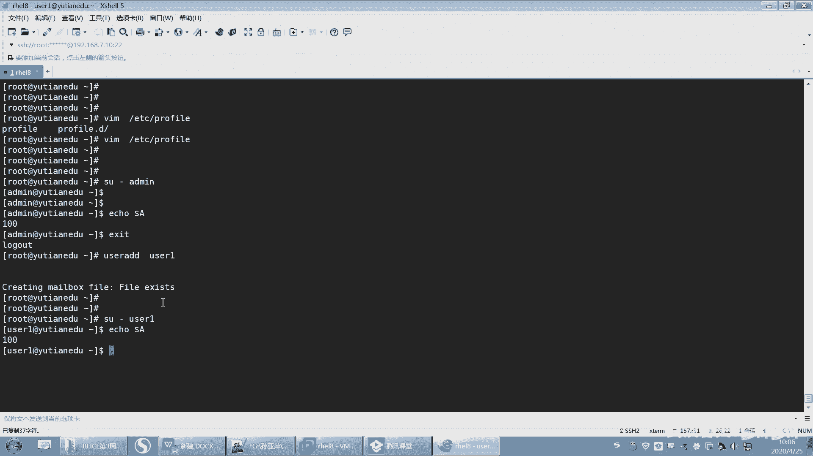

# 【已更新】最新版丨誉天红帽RHCE 8.0系列培训视频 - P47：bash shell补充-47 - 武汉誉天 - BV1cv411q74E

那这个时候这个反斜杠就可以将它后面这个空格的特殊含义给去掉了。那但是这样的话就会出现问题了。因为这个时候你要怎么样？呃，你要将这个空格这个再空一个啊，它只去掉它后面这一个呃这个空格的特殊含义。

但是它后面的后面这个这个空格就去不掉。那这个空格呢依然是分隔符啊，OK那所以这种方式也可以看到没有？这种方式是不是也可以，所以这个反斜杠指的是去掉它后面这个特殊呃这个这个呃这个。😊。

它的一个特殊含义是吧？好。😊，那这个用法跟这里是一样一模一样啊一模一样。比如说我们想输出呃eco啊。

啊嗯比如说你看这个地方有个例子啊，他说是你呃依co你花了多少钱是吧？好，you cost。

你花了5美元。

啊，你花了。哦，我就答一好啊。

啊，你花了5美元。好，那我们之前讲过。do了符号它是有特殊含义的。因为多了符号指的是调变量。是不是调用变量啊，后面接个就接了一个变量是吧，他把后面当变量名处理了。😊，OK那遇到这种情况。那多了。

我它又不是个他又没有定义这个变量，是这样吧？所以这个时候就会有空。所以当我们sha当中有一个变量没有定义的时候，它就默认为空啊，默认为空。好，那这样OK再往看啊，那我想让它原样输出，对吧？

就输出多了符号，所以我就选加一个叫一个反反向杠。在前面加一个反斜杠啊，它就原样输出，看到没有？要doll了原样输出啊。好，所以反斜杠你要记住一个，它可以去除任何字符的特殊含义。啊。

包括比如说我想显示什么，我想想显示呃，比如说我可以显示。这种是不是也是啊do了 data是吧？😡，呃，但是这个好像不行啊嗯。你这个有几个你要去掉几个嘞这个。啊，你看。你看这个啊，你把它去掉了。

你把这个多了符号的函去掉了，它后面就没办法识别了。所以我就加了三个反斜杠。加了三个反斜杠，他把多了符号也去掉，因为多了加小括号是叫要命令执行的，调用命令执行的结果。所以你有几个特殊字符就要加几个什么。

加几个反斜杠。那在这里看到没有？doll了啊，就原样输出啊原样输出。好，为什么？在我们在命令行当中，我们上周也讲过，如果遇到多了符号，如果遇到多少加小括号，它就会执行它的含义，对吧？

我不想让它执行这个含义，那我就用什么，你把它去掉它的特殊含义。那么去掉用反斜杠，还有一种方式啊，去掉可以用单引号。啊，对等一下啊。啊，用单引号也可以去掉，看到吗？

用单引号也可以将这个里面单引号内所有的特殊字符的特殊含义给去掉，看到吗？啊，所以你在这个括引号里面有多少个特殊字符，你只要加个单引号引起来，它就全部原样输出。啊，那它没有解释吧。

这个多了加小框没有解释是吧？将它原样输出了啊。好了，那这就是单引号。好，那同学说老师我单引号双引号尽量分不清楚，对吧？那这个时候我就给大家解释一下啊，如果你用双引号的话。😡，那么你看。

它有没有去掉多了加小括号的特殊含义呢？并没有他是不是。怎么样多少下小括号是不是执行了呀？这个命令是不是执行了呀？所以你这个加加个双加个双引号还没有起到什么效果，对吧？并没有起到什么效果啊。

所以双引号是去不掉多了，加小括号的特殊含义的，能理解吗？双引号是去不掉，但单引号可以去掉啊，反斜杠也可以去掉，只不过反斜杠比较麻烦，有几个特殊字符就要就要加几个反斜杠，所以我们习惯用用什么用单引号。好。

那么还有哪些地方双引号是去不掉的呢。我们来总结了一下啊，看这里啊。😊。

好，单引号可以去掉引号内所有字符的特殊含义。这个是单引号啊。双引号呢可以去掉引号内所有字符的特殊含义。除了以下四种情况去不掉啊，第一种情况就是多了多了号是变量引用符，变量引用符啊。

也就是说如果你在这个地方加上一个双引号。

它能不能去掉呢？去不掉，看到没有？去不掉多了的特殊含义啊嗯多了是指变量调用变量值是吧，是不是空啊？好，但是你用单引号就可以。单也号OK吧，这是不是很清楚了，是吧？

好，然后其次。呃，多了加小框也去不掉，对吧？呃，多了加小框也去不掉，就这个符号啊，就是再加一个叫多了加。😊，呃，多少加小括号和。哎，这个符号去不掉啊。啊，这个是双引号去不掉的。还有就是。呃。

转译字符去不掉。呃，转译字符去不掉是什么意思呢？就是。

嗯，你可以看这儿啊，比如说。转移字符本身是不是？也是什么转译字符本身啊，它应该也是一个特殊符号，是吧？好，那如果我这样去加的话，那么请问这个地方它会输出多少呢？我知道前面加个反斜杠是吧？😊。

那这个地方它会怎么输出啊？呃，加个双引呃，外面叫双引号，然后加个反斜杠。输出5。0输出5。0吗？dollar5。0O非常棒啊。对，doll了5。0啊doll5。0。

因为首先双引号是去不掉这些含这些这些什么这些符号的特殊含义的，对吧？所以我们就里面该怎么样就是怎么样加不加无所谓。所以那doll呃反斜杠就去掉dolo的特殊含义了，那么就原样输出，那就是多了5。0。

但是如果你加了单引号，那就不一样了。😊，他们全部怎么样，原样输出看到没有？叫单引号啊，所以啊这个反斜杠也是有特殊含义的。哎，反斜杠也是有特殊含义的啊。

好。那这个反斜杠，那双引号是去不掉反斜杠的特殊含义的。除不掉啊。但是单引号可以去掉，那do了呃，不还有感叹号，唉，感叹号啊，讲之前也讲过了啊，它是指调用历史记录，调用历史记录啊。你比如说我们家感叹号呃。

感叹号5吧。😊。

啊，那你加单引号是不是就输出输出什么输出感叹号5。但是如果你加双引号的话。加双引行跟没加是一样的。呃。嗯，加霜以后你看。是吧跟梅加是一样的哦，这是我之前执行过的一个命令。好。

所以就是第五个第五个历史记录是吧？第五条历史记录啊，多少加5。

好，这个是。呃，这个这个他这个符号这个符号啊。好，然后没问题吧。呃，单引号跟双引号区分开了没有啊？单引号跟双引号，那说老师什么时候用单引号，什么时用双引号？其实啊单引号用的场景。😊，呃，比较特殊嗯。

单引号用的场景比较特殊啊，就是在一些特殊的符号特殊的情况下会有单引号。什么情况下呢？第一个啊。我们想让这个单引号内所有字符都是原样输出的话，我们用单引号，就是我们刚刚那个alice是吧？

爱ice呃就是那个别名的时候，我们用单引号。😊，那双引号用的是最多的，其实双引号用的是比较多的啊。呃，双引号用的比较多，因为双引号它是去不掉这些含这些特殊含义的。呃，但是这些我们往往是想让它执行的对吧？

并不想让原样输出，而想让它执行的。所以我们用双银行用的比也比较多。这不过这个也也不能说哪个多哪个少吧，就只是说应用场景不一样啊。好。这个是引号和反斜杠啊。

好，再来啊。嗯。呃，下面呢。这样吧嗯。

啊。OK啊。下面我们来给家讲一下关于继续还是变量啊，还是变量。

嗯，我们之前讲的变量回顾一下啊，我们讲本地变量和环境变量。但是这两种变量OK有一个不好的地方是。这两个变量当你定义变量的这个hear。关闭了，那么这个变量就消失了，这个变量就消失了啊。好，什么意思呢？

比如说啊我现在。开启了，你看这样是不是开启了一个share啊？那是不是有两个here，这个hear跟这个he对吧？好，那么这个需里面我定一个变量。定一个变量啊，还或者你将export又怎么样呢？对吧？

啊，将变量环境变量又怎么样呢？但是这个时候如果当我这个shaar退出了，比如说把它退出了ESE退出了，那么这个。A。A是不是就没有了呀，对吧？就没有了。所以定义变量的那个血关了，它就没有了，A就没有了。

但是有些时候我们的变量，你会发现它会永久存在。比如说像PS one啊这个这个提示符啊，或者是我们的pas变量啊，你发现它永远都在，对吧？它怎么回事呢？它在哪儿定义的呢？

所以如果你想让一些变量永久生效的话，唉，我们就需要把它写在我们的什么写在我们的文件里面。😊，写在我们的文件里面，OK吧。好，今天我们先选第一个文件啊，第这个文件呢叫profile。

这个文件叫profile啊，叫ETC下面的profile。我们就会发现这个文件里面很多的都是都是一些这个变量啊。你看像这种大写字母。它是个变量对吧？啊，是代字母带字母的这个字符串就一般都是变量而。

而且还加在export了，看到没有？😊，这些变量都export了。对，这是我们系统经常会用到的一些系统变量。比如说pass变量。啊，所以说如果我想去定一个变量。哎，想去定一个变量啊。然后去定一个变量A。

好，那么第一个变量A等于100。那么这个时候。你看我定义在文件里面了哟。我把保存下来了是吧，保存下来了啊。😊，好，看好啊。那么这个时候这个A有吗？但觉这个A有没有啊，我定义在文件里面了，对吧？

那按理来说，这个A是不是应该要A就会生效了，对不对？好，但是反而没有生效。对，这个变量它是没这个这个这个变量它是没有生效的啊。那么没有生效的话，我们想让它生效，你必须怎么样？因为这个文件你写上来了。

我们说变量是。😡，在内存当中的一段地址空间，然后给他个地址空间付一个值，对吧？那么它既然写在文件里面呢，我们只是写在磁盘上了，但是并没有加载到内存当中。所以我们需要把这个文件重新读一遍，读到内存里面啊。

读一遍，读到内存里面啊。好，怎么让它读到内存里面呢？我们有一个命令叫sourcece。ss可以将这个文件重新的读一遍。好，s一下它，是将这个文件重新读一遍啊，然后读到内存当中。

那么这个时候我们再来看这个A就有了，看到没有？哎，A就有了啊。那么请问这个变量，这个A变量。它是什么变量呢？他是本地变量还是。这个A变量是本地变量还是环境变量呢？这个A定义在这个地方。

是本地变量还是环境变量啊？呃，这边是环境变量是吧？啊呃如果是环境面的话，你你你可能是应该有之前有学过的，是吧？好，那么呃定义它是一个环境变量是吧？啊，不对啊，它不是一个环境变量，它只是一个本地变量。呃。

环境变量条件是什么呀？是是不是需要把它给了export一下。这样是不是就变成环金变量了？😡，环境变量有什么特点？再说一遍啊，环境变量的特点是它的子穴是不是可以读到？它的子穴儿可以读到啊。好，我来说一下。

有很多同学。😊，他其实知道source指的是什么，source指的是将这个ETC profile读到内存当中，对吧？但是它可能不太理解，你看啊。还是不太理解sourcece的含义啊，我再说一遍。

你们可以记一下啊，source加一个文件名，它可以将这个文件的内容读到内存当中，在哪个地方生效呢？在当前sha生效，O吧，记住啊，sourcece是将这个文件读一遍，在当前这个shaar里面生效了。

注意。是不是在这个需里面生效了呀？好，那假如说我bu一下呢？😊，来A有没有啊？没有了，我切换到子序里面，A是不是就没有了呀？说明我刚刚source一下，是不是只在它所在的这个sha生效了。

但是在子 share里面是没有生效的。为什么没有生效呢？是因为你那个A是一个本地变量，本地变量不能继承到子序里面。😡，OK吗？这个能不能听懂？这是上周讲过的啊，只不过是我们现在换了一个换了一个什么。

换了一个这个文件啊，换成一个文件了。😊，啊，这这个地方能不能理解？好，我退出去了。然后这个地这个地方你再来看是不是就有了呀？其实我source了一下，是不是相当于我在当前sha直接A等于100这样子啊。

OK吧。啊。是不是这样啊？好，那为什么子需要里面没有呢？是因为什么？是因为我没有将它export啊，没有将它export。对，所以如果我想让它仔系里面生效，那就export a好，你看为什么。这个里面。

他们都是不是都export了呀？因为这个文件里面我们通常放的都是环境变量。所以刚刚有同学说哦，环境变量，因为他可能知道哦profi里面经常放的环环境变量，对吧？但并不是说你把这个变量放到这个文件里面。

它就是环境变量，你要叫它什么export exportport好保存。好，保存之后，我们再来sourcece一下啊。sourcece。啊，s索一下之后，这个时候它那个A是不是就变成环境变量了呀？

那么在当前shaar生效了嘛，在当前shaar里面是不是就是就是一个环境变量啊？那这个时候我们来bu一下export dollar A，这个时候是不是就有了，没问题吧。😊，啊，有没有问题啊？

这个地方就有了啊，就是因为我将它export了，在这个sure的子 share里面，哎bush里面bush一下子 share里面它是有的啊。什么叫子 share，记不记得啊？

那我是在这个he里面定义的对吧？然后在这个hear里面source，然后切到这个he里面一执行又有了，对吧？因为A继承到了子 share里面啊，A继承到了子 share里面。啊，外卖同学有没有问题啊？

能不能听懂？这地方一定要听懂啊，呃听不懂的话，继续不下去了啊。哎。绝大多数同学处于挂机状态。大家把自己的名字改成中文啊，这个中文有什么见不得人吗？好。O。好，这是我们第一个文件啊。

叫ETC profile。😊，交易TC profile啊。好。O。那么这个文件它是一个全局全局的配置文件。注意你看啊，现在如果我切到的命。你看啊我切到addmin，那么我切到addmin的时候。

它能不能读到A这个变量呢？同样是不是可以读到啊？好，然后我切到，比如说我us add userE。好，切到。😔，呃，切到U子一。好，柚子一有没有呢？注意U则一也有，对吧？所以你定义的这个变量啊。

所有的用户都可以读到，注意所有的用户都可以读到，这叫全局环境变量，叫全局。注意啊叫全局环境变量。所以我们有一句话叫。

啊，叫一个全局环境变量啊，这个我的PPT上没有啊。啊，是定义在。ETC profile里面ETC profile里面啊。一般情况下，我们定义在ETC profile里面啊。对。

我们定义在ETC profilefi里面的环金变量，我们叫全球环金变量。所有用户。所有用户。都可以都可以继承啊。对，所有用户登进去都可以什么都可以读到这个里面的变量。所有的用户登进去都可以读到这个变量。

但是前提是你要用SU杠注意。SU杠切换用户啊。因为在SU杠的时候，它会读到这个文件。

嗯，大家都发现我为什么SU杠切到这个用户的时候，没有sources这个文件，反而都有这个值呢？是因为你在SU杠那一瞬间，它读了这个文件，因为相当于这个用户是不是登录了一次，他就会读到这个文件啊。

这个所有的用户都可以读到。好，这个先不用管它。好吧，后面会大家总结哪些读到，哪些读到啊。

好，然后再来啊。呃，那这个叫全局的环境变量，对吧？全局的环境变量啊，那我如果说我us一或者admin都不想等于100。因为就是说。

其他用户都等于100，但是呢我不想等于100，我的命不想等于100。这个时候你就可以切到的命。😡，在addmin的加目录下面。在addmin加目下面有一个文件叫跟它很类似的文件叫点bu profile。

点bush profile啊，你打开这个点bush profile。呃。哎，点。点80。perfi打开这个文件啊。啊，这个文件呢。它指的是用户的用户的一个文件，因为在用户的加目录下面，对吧？

所以如果我定一个A等于200的话，我等于200，你们都等于100，对吧？好，那么同样这个文件也是这样啊，比如说A等于100是本地变量export一下，就变成环境变量，这个我就不演示了。

我就不export了啊，就直接A等于100了。所以讲它变量环境变量，就exportA呀，这是不是一样的呀，对吧？好，那就export吧。我去掉啊好，保存。好，那么这个时候我们说A还是等于100，对吧？

因为这个文件一样还没有生效啊，那怎么办呢？s一下。好，sourcece一下sourcece一下这个文件啊，它就生效了。到了A。啊，就等于200了，对不对？等于200了啊。好了，那这个时候呢。

如果我切到userE。哎，user一是不是一样还是等于100呀？因为在user一的加目录下面也是不是也有一个这样的点bu profile啊，那这个点bu profile里没有没有定义。

那么就读的什么读的全局的啊。没问题吧，是不是读了全局的呀？哦。读的全局的啊读的全局的。好了，那这个叫用户环境变量，我们定义在哪里啊？

哎，用户环境变量。一般定义在什么？定义在加目录下面，这个用户的加目录啊。嗯，好，定义在这个用户的加墨下面有个点bush profile。里面的什么环境变量，一般我们注意啊。

你说那我能不能在这里定义本地变量呢？当然也可以了啊，但是我们不建议因为本地变量有本地变量定义的地方，呃，环境变量最好都定义在就是profile，你就记住哦，它是定义环境变量的那你最好将export一下。

对吧？好的环境变量叫用户环境变量啊。哎，只只有什么。该用户可以继承。就只有这个用户可以继承，但是其他的用户是继承不了的啊，其他用户读不到，好吧。

这个叫用户环境变量。啊，那也就是说其实啊我们这些变量其实都是定义在文件里面的。啊。优先级谁最高？你说呢？刚刚我不就已经测了吗？全局是不是有个A呀？全局有个A，加目录下面有一个呃全局有个A等于100。

加目下面有A等于200，你说写的高？对吧这个地方是不是用户的维先。嗯。啊，这是用户为先啊，用户为先。OK吧好，呃，那也就是说我们把变量定义在这些文件里面，只要读到了这些文件，我们就可以让这个变量生效了。

对不对？就让这个变量给生效了啊，所以如果你想让这些变量哎，它永远都就都在那儿，对吧？不会消失，那你就怎么样定义在文件里面，然后读到读一下这个文件就生效了，对读一下这个文件就会生效了啊。

那你说老师那不是每次都要读这个文件很麻烦吗？好，不慌，慢慢解释啊。😊，啊，你说定义在这里是吧，每次都要读每次都要读才能生效，那这个对吧？就很麻烦。

所以我们后面会有一些叫登录 share和非动sha的一些呃。😊，这个这个这个设置啊，以免我每次都要去读一下它才能生效，是吧？好。呃，那这就是我讲的第四个变量啊。

本地变量环境变量用户环境变量和呃全局环境变量和用户环境变量啊，用户环境变量记好了吗？

下面呢我们要讲两两种sure。两种sh啊，注意这话是否有点柔一点绕大家认真听啊。你不认真听，记记忆力不集中的话，这个讲过就嗯讲过就就讲过就没听懂啊。好。看啊，你不要走神儿啊。

好，下面呢我们来看一下。登录线和。