# 【已更新】最新版丨誉天红帽RHCE 8.0系列培训视频 - P4：rhel8.0系统安装-04 - 武汉誉天 - BV1cv411q74E

目录下面，比如说我这个有个目录叫它的路径是是这样写的，比如说叫home。啊，还有一个叫什么boot。比如说啊还有叫什么，会有一些目录叫ETC目录啊。啊，当然还有其他的点点点非常多啊，非常多目录。

这个就不写了。好，那在这个目录下面还会有一些子目录。哎，子目录下面还有子目录等等啊。啊，这下面呃还有子目录是吧？比如说这个是home下面的。我就随便画几个啊。home下面的data。好不好？OK啊。

这就是它的一个路径啊，这是它一个路径，好吧好，路径从什么从斜杠开始。那后面这个斜杠呢，前面这个斜杠指的是根目录啊，这个是根目录。是根目录啊根。啊，后面这个斜杠是指什么？是这个是home是父目录是吧？

data是不是子目录啊，叫父子关系对吧？父子关系啊，所以这个跟这个斜杠跟这个斜杠是不一样的啊，只有第一个斜杠是跟，后面都是指分隔符，后面是分隔符啊，这是linux好吧，linux。好。

这是个单根倒数状的。那么我们这个根放哪呢？我们这个根的数据放在哪里呢？对吧？它总得放在一个什么上面吧。好，它就放在什么，放在分区上啊啊，放在分区上啊，那放哪个分区上呢？所以我们给它分一个分区啊。

分一个分区。😊，好，那么分的这个分区呢，我们需要那这个分区怎么样啊？它分完之后分区嘛，分区是不是要格式化呀？格式化是不是就可以存文件了，这是两部曲，对吧？呃，分区格式化存文件。那么我怎么去存呢？

我怎么去访问这个分区呢？我们windows是通过什么？windows是不是通过盘符。是这样吧，windows是不是通过盘符啊，一定要记住啊，通过盘符，那linux通过什么？linux通过挂载点。

lininux通过挂载点，实际上就是目录。它实际上就是一个目录。所以我需要怎么样啊？我要想去使用这个分区的话，往里面存数据，我必须给他一个目录。对，给他一个目录啊，就是将它跟一个目录对接起来。

那我给它对接哪个目录呢？你必须要对接的目录就是跟。啊，就是这个根目录啊，因为根所有的文件是不是都放在根里面啊，那根总得有为置放吧，所以你必须要分一个分区给根，然后把这个分区跟根目录跟根目录这个斜杠。

然后对接起来。我们把这个对接的过程叫什么叫挂载。啊，叫挂载啊，叫对接起来。好，那这样的话，我这个根是不是就可以存文件了呀，对吧？那么home呀，bo呀，ETC是不是都在根下面呀。

那么它们自然而然的是不是都存在第一个分区上了，这是第一个分区。对，自然而然都存在第一个分区了上面啊。好，这是分了一个分区。那如果说我还有还有一个再分一个分区呢，比如说我还再分一个第二个分区啊。

那么在分第二个分区的时候。第二个分区，那么第二个分区我也想去用第二个分区的空间。我第二个分区首先什么要分区要格式化，对吧？好，分区格式化完之后，我怎么去使用第二个分区呢？

同样我需要给它找一个目录跟它对接起来，比如找一个不目录。找一个目录跟它对接起来啊，找一个bot目录。啊，那么将来这个bo目录，你往bot目录里面去存文件。比如说这里存了一个叫呃bo下面的。

bo下面的fell是吧？那么这个bo下面的fell就会放在哪里啊，就会放在第二个分区上了。就放在第二个分区上了，OK吧。当然前提这个不同目录要事先要存在，一定要存在啊。如果它有一个不存在的目录。

那不行啊。也就是说什么意思呢？我现在我再画一个分区，对不对？再画一个分区，那我想把它放在哪里呢？叫data。或者叫test，随便叫啊。再再跟下面创建一个目录，叫test，我自己创建嘛，对吧？

我可以自己去创建呀。好，那么创建个test，我把这个test跟第三个是么，跟第三个分区对接起来。那么将来你往test里面去存文件。存文件就存在第三个分区上了。我这样说，大家能听懂吗？啊。

这就是我们linux的文件系统结构。对，linux的文件系统结构。那这个本来它是个目录。boot是个目录，test是个目录，但是它一旦给它挂载了一个分区了，那挂载了一个分区。

那么这个目录就会变成一个东西叫挂载点。它就会变成挂载点。OK吧嗯，这就是挂载点的由来啊，挂载点的由来。所以你看在这个地方，我们让选的并不是说选分区，对吧？我没让选要选的是什么？是不是选的挂载点呢。

叫mount point叫挂载点。

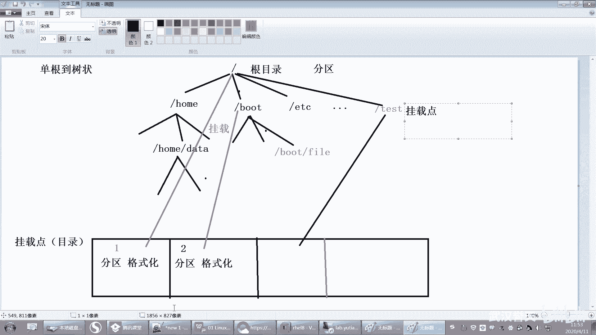

好，那么这个挂载点我们选什么？比如说我选一个boot。哎，选一个bo啊啊，bo我这个目录呢比较特殊啊，这个目录因为它是放这个呃放启动所需要的文件，所以这个目录啊呃你你给200兆其实就够了。呃。

当是你觉得太少了，你500兆也行，好吧，那也就是说我将来会给bo同目录是挂载一个分区啊，这个分区的大小是不是就是500兆啊那。

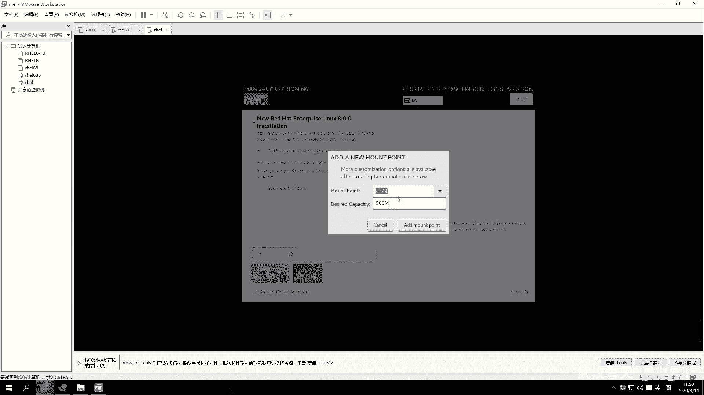

是不是就是这个那bo目录给它分一个分区，这个分区是500兆，然后挂载在了什么boot目录上，对不对？

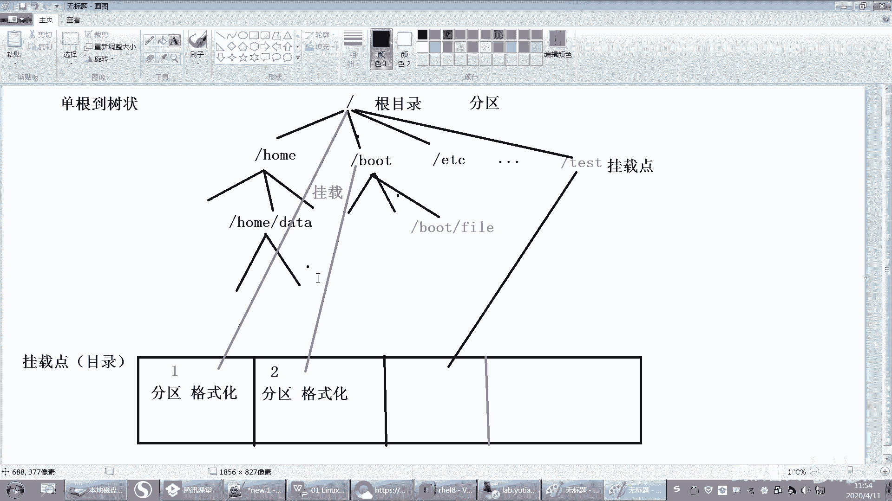

好。那就第一个分区分好了，那这是第一个分区啊，第一个分区挂载在了bo，它只显示它只显示什么？显示这个这个这个呃呃挂载点啊，挂载点好，再添加一个分区。好，比如说添加一个home分区，我给它两个G。

这个是放呃加目录的一些文件的。好吧。好，两个添加就添加一个好，再来一个你先分哪个后分哪个都无所谓啊。啊，你不要这个你这个分区大小，你不要分太多了。比如说bot，你分了什么10个G啊，没必要啊。

你500兆就够了，你分太多浪费空间啊。home的话看情况，一般2个G3个G啊这样子。好吧，那么最重要就是根，我所有的分区都可以不用分，我就必须要分根。因为所有的文件默认都在根下面。

所有的文件默认都在根下面啊，所以根一定是要分的那根给多大好，我现就开始问了啊，啊同天给了两个G。我请你给两个G，你这够吗？你不够吧，跟下面是不是还有很多其他的文件啊，就像你的C盘，你给少了。😡。

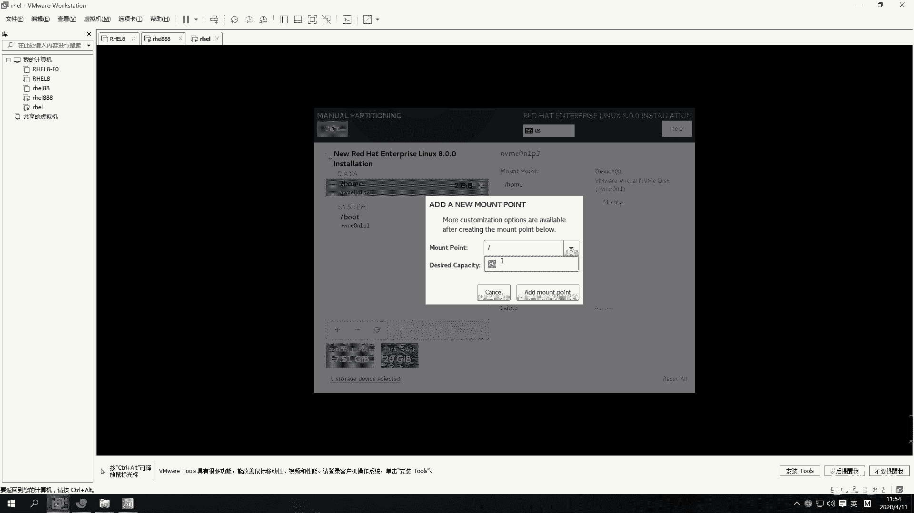

你们所有默认的文件是不是都放在C盘下面，刚开始的时候是不是都放在C下C盘下面。如果你给太少了，那你系统的文件是没地方放。😡，它会慢慢就满了，对吧？所以我们根呢给多大呢？呃。

你最好啊就是你你至少要给10个G吧，这是最少的呀。

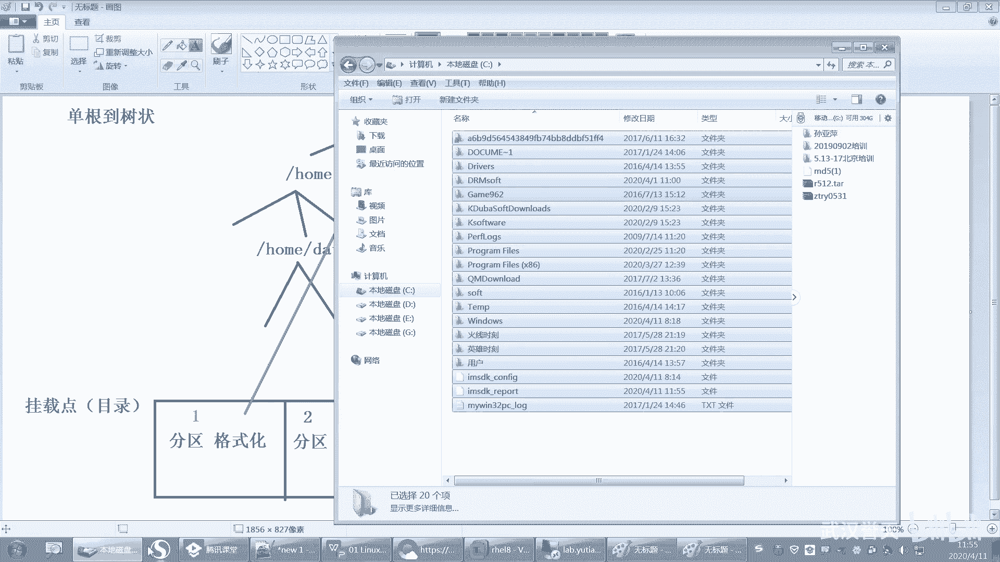

当然你说给8个G能不能装也可以装呃，但是不能太小了，5个G现在估计不行，6个G也不行。因为现在红帽八越来越大呃，越越来越大了。装装装完之后，它系统文件越来越大，所以一般啊你不要太抠了啊，就你20个G嘛。

你总共是20个G，给了两给出去两个G了，那你就给个多一点。比如说还剩16个G，那就给16个G。啊。也可以吧，你给17个G也行，对吧？所以稍微给多一点。嗯，而且这种分区你分下来，它是很不没有办法扩展的。

所以你你说哎呀都小了再扩一点，不行啊，逻辑卷才可以扩，这个扩不了，这个扩不了啊。啊，要给大一点，我看有没学分的时候，如果你分太小，系统装不成功的啊，它装都装不了，无法安装啊。这所有的分区。

比如说你都可以不要那这所有都可以不要，你就用这一个就行了。那给他20G分一个根，你说老师我分不清楚，分不明白呀，装不了系统啊。就把所有的空间给根就可以了。因为所有的文件都会放在根下面。

这个分区还有没有不懂的？我我就分两个，好吧，给你看一下啊。啊，如果你不要手动分，让自动分。这个还是那句话呀，要不要分呢？不分就放在根下面嘛，分了你就单独什么这个分跟不分有什么区别呀？😡。

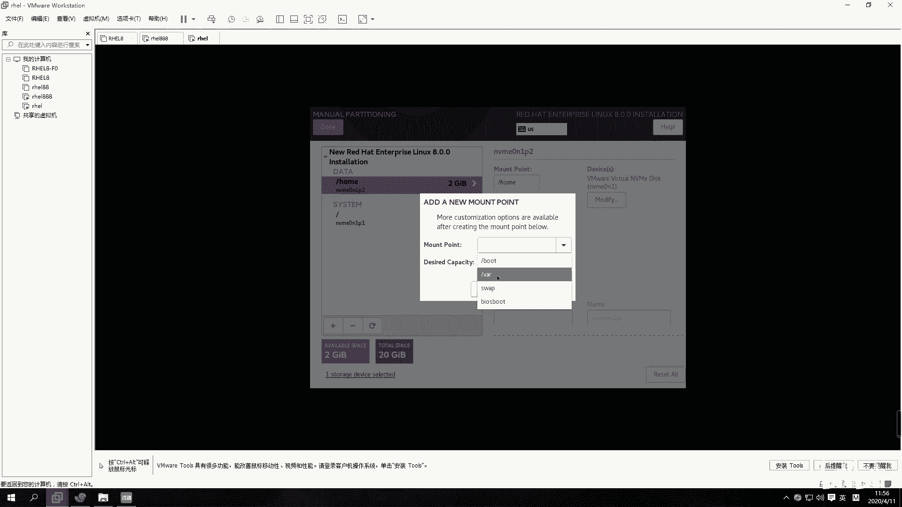

这个分跟不分不分了跟不分有什么区别呀？😡，你分了的话，这个bot下面最多能放多少多大的文件啊，是不是放500兆啊？😡，OK吧。哦，我挖目录对吧？万目录，那这个万目录说要不要分，对吧？你不分的话。

是不是放在根下面，那根有多少剩余空间，它就可以用多少吗？😡，是不是用根的空间，你往里面存文件，是不是放用的根的空间，OK吧。那么你把不得单独分出来了，你给不得分了500兆。😡。

不对什么叫弹性的这个这很好理解吗？你给基盘。你G盘多大啊，你G盘是多大？你你G盘好，比如说啊你默认文件是不是放在C盘下，对吧？就相当于哇是不是放在C盘下。那么哇现在C盘只剩多少空间了，只剩2。7G了。

那你哇最多是不是只能用2。7G的呀？😡，这。这不是什么弹性的，就就就。嗯，就这个意思啊。嗯，OK吧。啊，你单独分出来了什么单独分了bo是吧，给了500兆，那你往bot下面放，只放了10兆文件。😡。

那你bo是不是只剩剩下490兆啊，那这就剩余的嘛，它最多是不是只能放500兆往bot目录下面去放。所以这就是分出来跟不分出来的区别啊。😡，对，是这个意思啊。好，这个相当于就是什么windows的盘符嘛。

这个部分目录相当于它实它是挂载点。我们通过挂载点来访问什么来访问这个分区，来访问分区的空间啊，占用分区的空间。好，所有一切没有分出来的，都占根空间。好，都占空根空间，好不好？

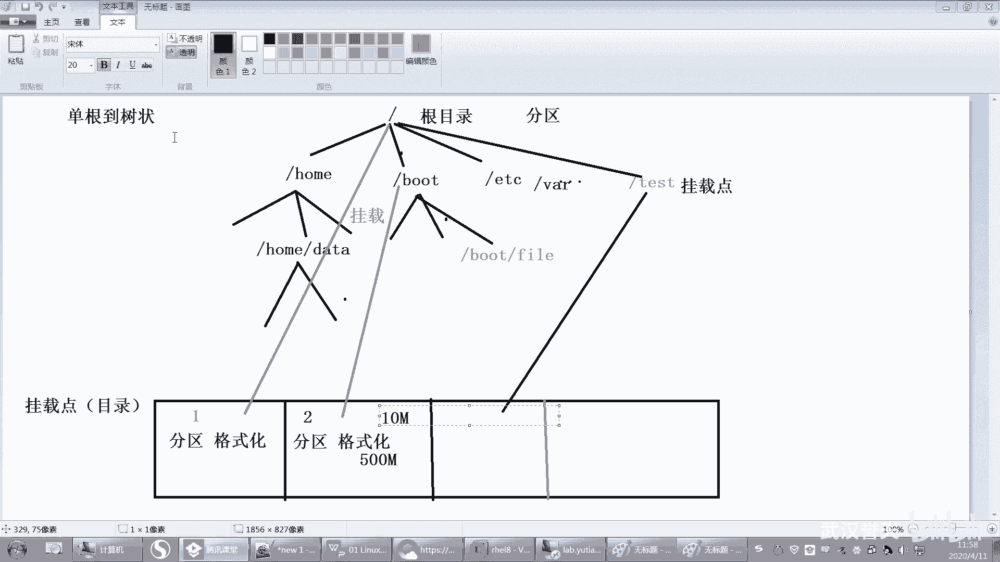

好，你们想尝试分一下，那我就分一下就行了。500兆。对。好，那我就分这三个，好吧，你们看情况，你们看情况去分啊。然后还有一个很特殊的，它不是挂载点，看到没有？它叫swepe。

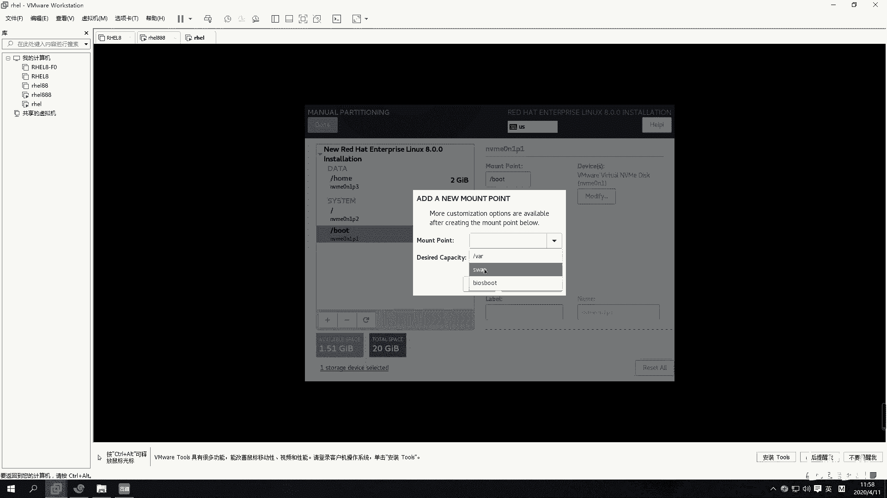

叫swipe啊呃这个swepe呢我来说一下啊。呃，还有一个空间，比如说我分了一个swipe分区，这个swib分区干什么用呢？😡，呃，12部分区叫交换分区，叫交换分区啊。它叫交换分区。那么这个交换分区呢。

它其实是磁盘的一部分空间，它可以格它也可以格式化，对吧？那它有什么用呢？我们是这样的啊，我们呃这边有CPU不内存就要结合其CPU跟内存了啊，然后我们的比如说内存呢，你一般有时候内存不够用了。

比如说你内存只有4个G是吧？哦。你内存不够用了，那我想放更多的数据，因为我们的数据啊。它其实都在什么？我们想去访问一个文件，比如说我访问一个。呃，fi这个文件。

我要去加载这个文件或者访问1个QQQQ对吧？应用程序。那么在这个程序想加载的话，CPU是不是要去给他个指令，说来打开QQ对吧？然后QQCPU就会去什么，他就会去内存里面去找看有没有QQ的数据。

但是这个时候QQ还没有启动，所以它的数据不在内存里面，它这个时候就要去怎么样，就要去磁盘当中去找这个QQ的数据，把这个QQ的数据怎么样加载到内存当中，唉，加载到内存当中啊，那把数据加载到内存当中。好。

那么由于内存呢有可能会不足，对吧？那我想要去使用更多的空间怎么办？我就可能要使用交换分区了。对，使用交换分区。好，这个我可能跟大家说的不是太清楚啊。好，我就这么说吧，我把这个说完，我们下课啊。

剩下的我们下午再装。呃，这个交换器后面我们还会讲。好，这就是。呃，CPU磁盘跟内存的关系啊。啊，CPU呢它其实也有也是有缓存的，但是它缓存比较小啊，内存呢。呃，也是纯数据的是吧？磁盘呢磁盘最便宜嘛。

速度最慢，对吧？啊，磁盘是比较便宜的。嗯，但是速度也比较慢。🤧好。对，就是虚拟内存，就是虚拟内存啊。但是我觉得windows那虚拟内存解释的不是很清楚，我觉得还是叫交换分区比较好，交换分区。好。

现在假如说啊你现在呢有一个有一个有戏，比如说啊我举个简单的例子吧。你现在呢要去打开一个文件，开始做作业是吧？开始做作业了啊。哦，你做作业呢，打开word，然后打开你的什么虚拟机软件呀等等。

那这些软这些软件的数据都会加载到内存当中。加载到内存当中啊，那然后你的数据就在这里了。好，那你加在内存当中，这个时候你就你本来是要写作业的是吧？好，加在内存当中。

然后其实你还有虚拟机文件呀等等都加载到内存当中了。那么你这些。虚拟机本来它就会占占内存，对吧？是不是很占内存呢？啊，那么CPU想要去使用计算这些数据，它必须要加载到内存当中才可以对。

加载到内存当中才可以去使用这个数据。好，但是这个时候呢，因为啊我们的内存太小了，所以有些时候我们需要做加一个交换分区，对吧？那这个交换区分区什么时候会用到呢？好。这时候。内存里面已经有一部分使用。

但是可用空间只有一个G了，可用空间只有一个G了啊，但这个时候呢你又觉得做作业很烦，对吧？想去打游戏，对，想去打游戏啊，那你的游戏的数据是不是在这里？游戏的数据是不是在这个磁盘上？😊，比如说打个。什么。

什么什么什么游戏啊。啊，这个游戏的数据在磁盘上，对吧？那你需要把这个游戏的数据是不是加载到内存当中啊？但是内存里面的数据是不是又不够用啊，只有一个G了，有可能你需要游戏，需要更多的什么。

要需要更多的游有更多的更多的这个内存啊，比如说你需要呃这个5个G对吧？或者4个G3个G这样子啊，好假如说你需要3个G，但是我内存已经没有3个G了。好。

这个时候内存就会他就想他就看我有没有swi分区叫交换分区。对，有没有交换分区。如果有的话，它就会考虑什么呀？好，你打开游戏了，那这些虚拟机的数据和文件的数据，它暂时是没有被访问到的。

所以它就会将这个数据什么？将这一部分暂时怎么样。😊，哎，他会暂时没有访问到的。访问到的数据啊，存放在什么？存放在swipe分区中。swipe中swipe里面啊。

也就是说这部分数据它会暂时的被放在什么swipe里面，对，放暂时的放在swipe里面啊。好，那么这样的话，我们的讯我的内存就可以空出来了，是吧？然后给什么给我们的游戏来去使用啊，游戏的数据来使用。

但是这个时候你玩游戏对吧？你玩了半天。一个也一个也没打死是吧，就被别人打死了。😡，啊，玩了半天一局没赢。你这个时候伤心啊，还是做作业，有成就感是吧？好，这个时候呢你就把游戏那。呃。

你又你又你又去打开虚拟机是吧？啊，又去查看文件啊，又去做做作业啊，把游戏给关了是吧？然，这个时候你又去访问文件和虚拟机的数据。那这个时候它的数据是不是在swipe里面。

那swipe里面是不能直接去访问的，所以它需要怎么样再把swi里面的数据再去调回到内存当中。对再调回到内存当中，然后再去使用OK吗？再让CPU去访问这个数据去计算它。啊，这就是swipe工具。

它其实就是什么？它暂时存放暂存我们。什么暂存内存当中没有访问到的数据。对，暂时存放内存当中没有访问到的数据，它是不可以直接拿来用的。OK吧，它是不可以直接拿来用的啊。

所以它其实并没有加快我们的数据访问啊，并没有加快数据访问，只是暂时存一下啊。因为你这个文件跟虚拟机没有怎么样，没有关掉。如果你关掉，它就可以释放内存，但是你没有关掉啊，没有关掉话，没地方放。

你又不能把把它清空是吧？所以还只有什么放在swipe里面。如果你没有swi，那有可能你这个游戏就运行不了。对，有可能就运行不了啊。好吧，这就是这个swipe啊。

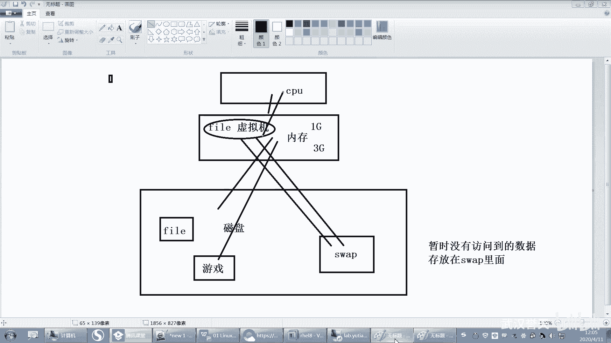

好，那这个swipe的话，我你分的话，swipe你现在不需要分，好吧，你们都不需要分OK吧，你分个，它不是画载点，因为我们不需要通过目录去访问。对，不需要通过目录去访问啊。好。然后那就这样了，OK好吧。

点一下。啊，接受呢接受点一下。它就格式化了。好，下面的话我们到下午再装，好吧，我们到下午再装啊，现在没有时间了，我们下午讲一下再装。嗯。当然当然你说呢？当没有了，数据全部清空了啊。

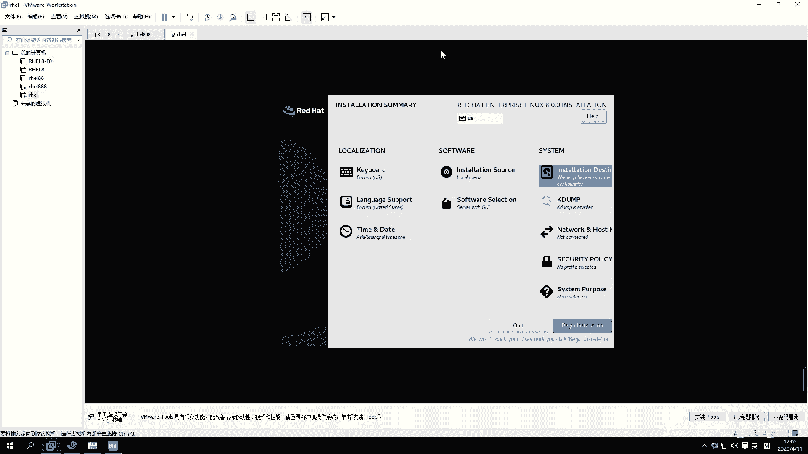

关机之后。好，我们下午的话。😔，呃，红红帽现在一般是叉S默认的都是叉S。默认都是差的啊。好，下午我们两点钟回来啊。下午我们两点钟回来，好吧，两点钟不要迟不要迟到啊，中午吃点饭，然后睡个觉休息一下。

下午才有精神。好，上午我们就先到这儿吧。

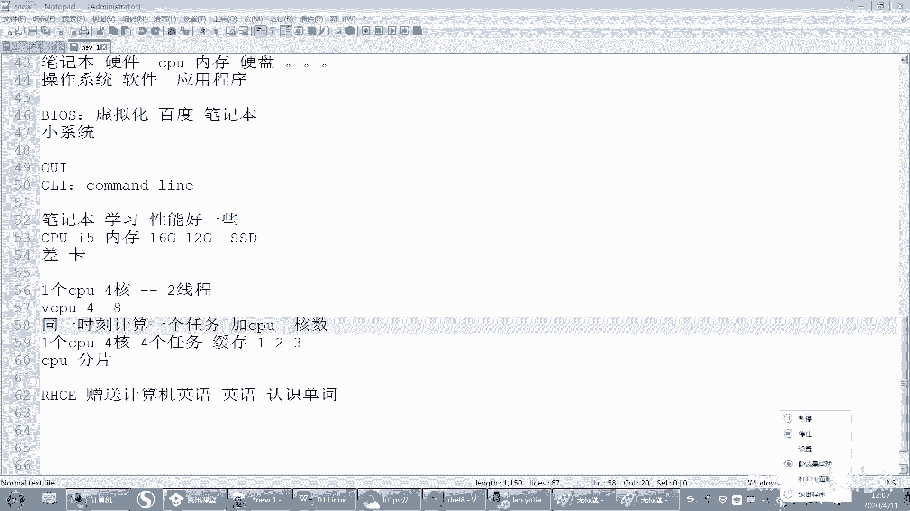