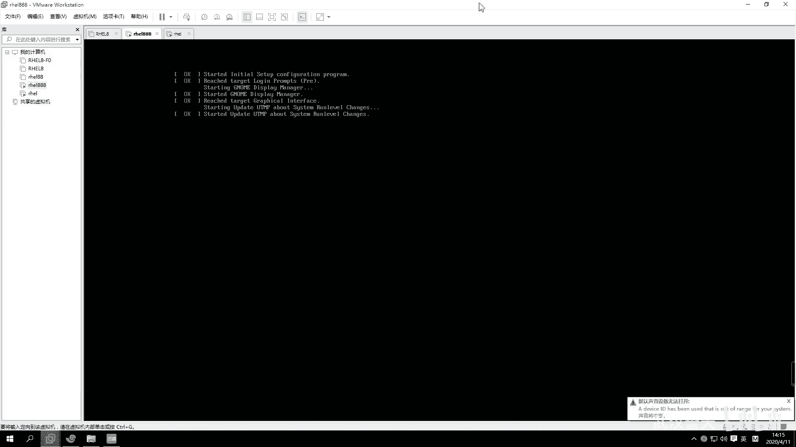

# 【已更新】最新版丨誉天红帽RHCE 8.0系列培训视频 - P5：Linux发展史和版本介绍-05 - 武汉誉天 - BV1cv411q74E

好了，那我们开始上课啊。我刚刚有同学还在问那个分多大的问题是吧？其实你。你想一下啊，就是你如果只分一个根的话。这个根给多大给给大概十几个G，反正20G差不多就够了，肯定是够了的。呃，基本上是够了的啊。

但是将来你要想去在。放一些业务的数据的话嗯。嗯，你就要去再添加新的磁盘，然后往里面去存数据。这是系统文件。其实这个相当于类似就是你的C盘嘛，对吧？C盘，你想你C盘给多大呢，对吧？嗯。

其实我们这个地方像bo这个分区啊，这个分区的话，它比较特殊，它是启动。呃，所以这个的话也没有说呃严格要给多大，你给一个G也行，那给多了也比较浪费，对吧？所以200兆基本上就够了。其他的话这个看自己情况。

一般home我们也不会说给太大。嗯，home也不会也也不也也不会给他的啊，就像还有一些分区，比如说老师，你说老师我能不能把这个ETC目录单独分出来，对吧？嗯，你刚刚我们在分的时候。

其实是没有看到什么ETC的，他只看到什么，只看到一些，比如说。呃，只看到这个了是吧？然后这个是可以看到了，这个也可以分出来。嗯，还有还还有swipe什么的，但ETC这些目录，当然还有其他的目录。

它都没有显示说能能不能分出来。这些目录是不可以分出来的，它不可以跟有一些目录啊是不可以跟跟分开的，就是说必须在跟下面。必须在根下面啊，不能放在别的分区上面。这是有它的启动。

它的这个呃就是系统在启动的时候，跟这个启动是有关的啊。所以这些跟系统目录是放在一起的。必须放在一起啊。好，这个可能要到时候你学了一些更深入的这个理论知识之后，才能理解它为什么是这样做的啊。啊呃。

其他的话就是bo分区，就bo得分区，你不能你给呃200兆左右给多了就浪费了，其他没什么特殊要求，其他没有什么特殊要求啊，就是这个根根你要给大一点嗯，能能你把所有的盘剩剩余的空间都给它就可以了。

就可以了啊，不要给太小了，同学给三个G啊，那三个G怎么够呢？完全不够。有的同学他还有什么给什么兆级别的搞不清楚了，是吧？没没填的时候填那个单位填出问题了，然后就没有装上。其他就没有什么特殊要求啊。

那分不分出来肯定是有区别的呀。你想一下啊。如果我这个父母父母不分出来的话。你往home里面存数据，一般home就是个人的私人文件，对吧？万一有个人往里面放一个很大的视频。

比如说放了或者你放了1个SO往的加目下面放1个SO，这一下子就是什么，是不是6点几个G啊，有6。9个G，那你把你的你你如果不单独分出来，home是不是直接加根空间啊，那你把根的空间是不是都都都占满了呀。

对吧？那导致其他的这个目录是不是没有空间去呃去放文件了啊。😊，那单独分出来就是你往ho，那它就不会什么这样跟空间啊，这就是分出来跟不分出来的区别啊。

好。呃，再往下面啊往下面走分区呢我们已经分完了啊，下面这个地方有个KK dumpK dump啊。这Kd是什么呢？Kd叫 kernelel dump kernelel dumpKd它指的是KK嘛。

K指的是这个。

嗯。colonel kernel的意思啊。其叫内核备份机制。叫内核备份机制。看什么直播。看什么直播内核备份机制啊，就是说呃它会预留。比如说你看这里如果你开启这个Kd的话，它就会预留160兆的这个呃空间。

然后你可以在这个你可以手动修改这个大小呢，手动修改大小。好，那么这160兆空间呢用来干什么呢？它是用来去对，是的，是这个意思啊。嗯，类似于那个黑匣子啊，它其实就是去监测。

你存就运就是存放你整个系统的运行状态的。嗯，那这边160兆谁也不能去占用它啊，当你的内核崩溃，其实内核崩溃也就像windows蓝屏一样类似啊。呃，windows蓝屏对吧？

内核加上linux内核崩溃其实很少见的，但是windows还是比较多，对吧？windows比较多啊。啊，那么如果你内核崩溃了，对吧？他就会去把这个内存里面的数据，然后生成一个文件。

将来你可以对这个文件进行一个分析。为什么我当时内核会崩溃，对吧？这个我记得是。我记得有有一些软件，比如说360这样的软件，它就会有分析。比如说你上次windows蓝屏了。

它就会分分析出说为什么上次蓝屏由于什么原因蓝屏，对吧？嗯，所以就是大概这个意思啊。那你如果只是做实验。那个内存又不够用，你把它关掉就行了啊，把这个inable这个勾关掉。应able代表开启的意思啊。好。

这K dump。另外右面这个呢右边这个叫network是吧？和。网络和主机名。好，你可以点开看一下，这个地方有一个主机名，这个主机名你可以去改一下。比如说我们改成这个。嗯，你可以随便你改不改都行啊。

这个地方。改不改都行，还有这个网络，那这就不改了吧，好吧，反正现在也用不到。嗯，就不不用改了，就放在这行吧，放在这儿吧。好，然后在下面这个叫安全的策略，什么security策略是吧？

这个安全的策略呢嗯是这样的，就是他给这提供了两种安全的嗯支线，就是第一种这个标准呢，这个标准是那个关于在金融行业的一个标准，就是支付行支付行业的一个标准。第二个是一个政府政府呃行业的标准，它不同标准呢。

就是它里面一些嗯安全的策略是不一样的。嗯，默认配置不一样的啊，但是我们这个地方没有选，你看。我们是没有选的呢no profile selected是吧？没有选的话，就是它默认的标准。

就是linux本身默认的标准。如果你想选的话，你就把这个下面勾勾上。但是目前我们都不要选，都不用去选它啊。都不要去选它，听到没有？啊，然后就让让它是默认的标准就可以了啊。好，然后这个是安全的策略啊。

然后下面这个是。呃，叫系统的目的purpose对吧？系统的意图就是系统是做什么用的呀？啊，第一个是在什么角色呀，这个是什么服务的级别，对吧？然后这个是什么用处，这个都不用选。嗯，为什么呢？其实你选上。

比如说我是一个红帽的servver版是吧，worktation版，还有什么computer node，就是计算节点什么之类的。嗯，你只是做一个标记，就是这个系统将来是做什么的，但你做不做标记。

将来也是一样的用对，一样用。所以这我们一般都就不用管它就不选noorspec嗯not是吧？spec是吧？spec就是不不指定啊不指定。😊，哦，这个也不用选，OK吧。好了，确定啊。好。

那这所有的我都点了一遍嗯，当然你们自己也去点一遍啊。好，然后下面有个安装不in。嗯，一般有些时候你们安装的时候，这个地方是灰色的，就点不了。一般情况下啊。原因就是。要么你这个安装员有问题，要么就是你的。

啊，这个这个这个这个什么分区根有问题啊，就是分的不对。还有没有有的是红色会标记一些什么感叹号啊，就说明这个地方是有问题的啊，你要重新修改一下，这样的话才没问题才可以安装，点一下。好，安装的时候。

这边有一个用户的设置，root密码，root密码，你点进去给他一个root密码叫rehead，随便你叫什么哈。但是这个地方你你是就是第一次这第二次确认是吧，confirm吗？确认再次输入。

我输入的是redhead这个地方大家密码啊，如果密码你一定要自己去记住啊，我一般的密码，我们环境的密码一般都是叫rehead，你也可以跟我一样，好吧，或者你叫1233456都可以啊。但是呢你设置完之后。

你密码忘记了。嗯，你问我我也不知道啊，而且。我也没有办法帮你去找回这个密码了，所以一定要记住啊，记不住就重装系统，好吧，记不住重装系统啊。好，点两下呢点一下，它会说你密码有太弱了，是吧？对。

什么密码太弱了呢？他说你再点一下。嗯，你想自己破也可以自己破，那破不出来就重装，好吧。现在解决这个密码的问题，唯一方法就是重装系统啊，你问我密码，我也不知道。好。OK下面这个你要创建一个新的用户啊。

因为你现在不创建，待会儿也提示你去创建啊，然后你点进去。呃，这个用户的名字叫什么？比如说叫admin，随便啊。好，呃，密码呢也随便设一个。啊，然后点一下。啊，他说你再点一下是吧。

那下面呢嗯anyway我再点一下啊，点一下。好，那这样的话，用户addmin就会创建了。那么这个root呢是我们的这个系统的一个管理员，叫root，它默认就有这个用户啊，默认就是用用户啊。

那除了这个用户以外，还有一个新的用户叫addmin，我们系统是不想对吧？他不想让你去用这个root用户去登录，不想用让你去用管理员去登录，哎，所以这个地方要设置。当然如果你是最小化安装。

这个用户可以不用设置。对，最小化安装这个用户，普通用户可以不用设设一个入何密码就可以了。好，因为我是图形界面啊，所以我呢我就要去设置一下。你密码卡在密码呢。好，大家可以看这里啊。😊。

这地方在安装后面看instalulation，对吧？哦，因此。inststore installst什么东西呢？后面是一个软件包的名字，它现在装包，看到没有？其实我们装系统，无非就是在装一些软件包，嗯。

然后再做一些基本的配置，根据你的选择，做一些基本的配置。后面这个是装了3000，一共要装1320个包，前面前面是已经装了191个包。好，如果这个地方你呢你的这个。嗯，一般默认就是GUI吧。

s with GUI是吧？s with GUI的话，它就是1320个宝，就这样子，你看看跟我是不是一样的。如果不一样，你要么就少选或者多选或者选错了。12个是吧？好，也行，没问题啊。1322个也可以。

好，等一会儿啊等一会儿。呃，这个还是比较快的啊。嗯。都都都都跟上了没有？

没上了是吧？好好好嗯。一定要一定要跟上啊，然后大家的小本本都都都都有了吗？记笔记的东西都有了没有啊？自己准备一个啊。

啊，稍等一下啊，呃，这个让他先装好吧，我这边有一个装到一半的，这个装好了，就是你你A呀。

呃，你你右边这个装装装好，安装好之后，所有的包安装好之后，在右下角就会有有有一个叫reboot，叫重启。对，叫重启。然后你点一下那个reboot，然后重启完之后就会成我这个样子了。

嗯，成左边这个这个字呢这个虚拟机的样子，重启之后啊重启之后。

这边装好之后，右面会右下角会有一个叫reboot reboot的图标，你点一下，因为现在比较慢，所以我就先继续往往后面讲啊。

好，然后reboot之后呢，这边有个license，呃，重启之后，它就会看到这个地方有个license。这license其实也就是一些嗯条条框框给你再告知一下，对吧？嗯，然后你就知晓一下就可以了。嗯。

当然你想去看也可以看，反正看不懂是吧？你点一下我接受就可以了啊。好。然后右边这个叫呃scor对吧？manager。嗯，这个叫订阅管理器。嗯，前面叫订阅，这个单词叫订阅的意思啊。

就是以前我们呃会去买一些那个报，就是买一些那些书，对吧？嗯，那个叫订阅啊，就是你们那个订阅号，你们微信有用过英文的吧，是吧？那个订阅号就是叫个s呃subscription。嗯。就是这个订阅的意思啊。

那这个订阅是干嘛呢？就是你点进去可以看一下，如果你买了红帽的服务，就是你你这个系统本来是红帽官方发布的是吧？你用它的系统，将来你这个系统出问题了，啊你又去买花钱买了它的服务，买了售后。

就买了售后的意思啊，买了售后服务之后，你就可以把你的信息填一下啊，呃，填在这个地方可以订阅。但是你现在说我没有买，后面再去订阅，可不可以也可以啊，没有买就算了，就就就这样就可以了。

他说你这个系统是没有注册的，看到没有？因为你的系统将来可能会提示说你的系统没有注册，什么意思呢？就说明你的系统怎么样是没有购买这个服务的，像stos啊。

就是大家可能用过sinto那个他就不会什么不会出现这个提示，因为它那个是完全免费的，不没有涉及到服务一说啊，就是。这个版本的待会儿我会介绍嗯这个这个版本。好。然后下面完成配置，在右下角啊右下角完成配置。

不算是盗版，这个是可以免费给你用的，只不过是你出现问题了。你出现问题了，他不会给你解决这个问题，你用也可以用能理解吗？用是可以用的啊，这个不算是盗版OK吧。不像有的那个你像windows，对吧？

你必须要买了是不是才能用，是这个意思吧？那我不买是不是也可以用？

嗯好，完成配置啊。对，这没有盗版，你什么盗版一说啊。

好了，那这边我已经进来了啊，已经进来了。然后大家可以看一下，这个地方有一个小人是吧？然后这就是我创建那个普通用户叫admin这个用户，你可以点一下这个图标，然后输入密码就可以进去了。呃。

当然你输入密码进去之后，是就是以这个用户进去的，对不对？那大家呢嗯大家就是后面在进的时候就用root来进root用户来进啊。用root用户来进就可以了。嗯，目前我们先用root好不？嗯，好。

然后root用户怎么点呢？下面有个叫notote list，它有一些用户没有列出来，你可以点一下notote list未列出。如果是中文叫未列出，点一下，然后这个有个用户名。看清楚这是用户名啊。

有同学在这输密码。啊，用户名叫root。好回车，然后密码是rehead。然后登录右下角登录就可以了。addmin进去了，那你就退出来的话，你就右上角有个logout注销。

那这个地方有一个。你看这里有一个那点一下。你看log in as in as log in as another user是吧，用另外一个用户登录。嗯，这样就可以了，好吧。好，这样的话我就进来了啊。

我就进来了。嗯，因为现在如果你不用root，就root进的话呃。

就是很多事情你都没有权限。所以我们刚开始学习，我们先用root吧。到后面你熟悉了或者工作了就不要用root了，root权限太大了啊。好，那么这边的话就进来了，进来之后呢，我可以看到一个欢迎的界面是吧？

那在这是不是让你选选语言啊？如果你之前选了中文，那你就可以选chinese是吧？如果你没有装中文，那你就只能选英文了。我没有装，所以默认就是拿英文进来啊，每一个新的用户登进来都会提示你，然后下一步。

这是干嘛的呀？哦，选择键盘布局是吧，就默认就行了，默认就行了啊。好，然后这是什么这个你这个隐隐私定位是吧，这个随便你关上也行，开启也行，随便啊，然就把关上了啊。哦，priiv嘛隐私嘛，对吧？哦。

然后下一步。不要用root中作千万不要用root啊，你可以你可以用普通用户提全，但是千万都不要用roroot。呃，这个风险很高，好吧，你们管理肯定不行嗯。然后连接你的这个什么什么东西。

不管它sep跳过就可以了。好，然后开启。这边系统我就装好了。这是这不是浏览器啊，你就把它关掉就行了。这是一个教你怎么用的是吧？反正我也没看过，你可以看一下，把它关掉就行了。

好，这就是我们红猫八的这个呃桌面是不是很炫酷？还可以吧。

你们你们我这有点慢呢，你们好了吗？高级黑是吧。呀，你们挺快呀。

うんうん。啊，我还比较喜欢这个界面，你可以你可以去改一下它的背景。这里右键呢change background。改一下这个背景是吧？呃，我们这个呃红帽八的图标都这个是扒出来之后图标都变了，看到没有？

以前是一个嗯以前是一个这个这个红帽，下面有一个人脸是吧？有一个人脸。然后呃后来呢红帽内部就把那个图标改了，把那个logo改了，然后把那个人脸脸给去掉了是吧？就没脸了，是不是？嗯。

所以他当时是说这个这这这个脸呢就是一个像一个神秘人物一样，对吧？让人感觉到就是很神秘。

