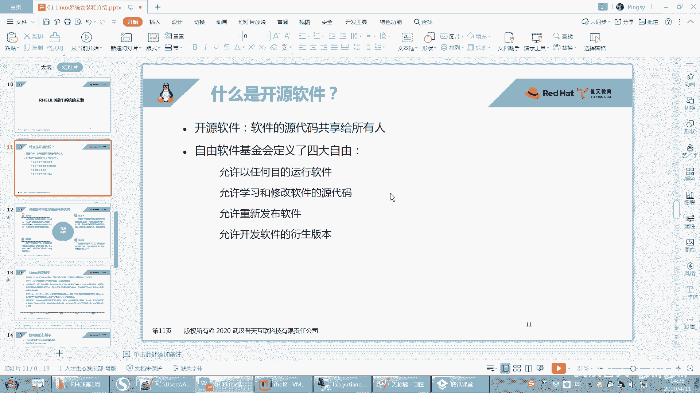

# 【已更新】最新版丨誉天红帽RHCE 8.0系列培训视频 - P6：Linux发展史和版本介绍-06 - 武汉誉天 - BV1cv411q74E

嗯，所以他当时是说这个这这这个脸呢就是一个像一个神秘人物一样，对吧？让人感觉到就是很神秘的感觉，但是也不知道是干什么的，所以就把它给去掉了。😊，嗯，就不要脸了。对。好，然后这边的话背景你们自己去改好吧。

我看到有个同学把改的那个炫酷啊，我我是没改过。

嗯，这个还在装是吧？那你们就等一等吧，你等一等装一下就行了。

呃，那个其他同学还有没有什么问题？关于装系统这块没有过一会儿如果没有的话，我们就过了啊。唉，那个我问一下啊，在远程的那个we back的同学。是之前都是重听的，我看绝大部分都是重听的。有没有新声啊？

YY同学有没有新，就是新声就第一次来听的。哦，你是第一次是吧，不知道他怎么他们怎么再分的啊。孙乐创是第一次吗？分区那个操作哪里不懂？分区那个操作。哪个操作？

分区那里我就选了一个挂载点嘛，然后给这个挂载点多大，就这样啊。有什么不懂的吗？是这个不懂还是怎么不懂？嗯。从哪儿选啊？啊，我。等一下啊。我这里有一个。有一个实验手册，我可以看一下啊。这里有一张实验手册。

如果没有。没有装成功的同学可以看一下这个啊。你就把这个点进去啊，license点进去，然后同意一下就可以了。你就你装软件，人后说你同不同意啊，你不同意就不要装了嘛。嗯。ほ慢。这边有啊这边。好。

那在这里啊。是这里吧。你你不是选到这个地方吗？然后点进去之后，你选这个手动装啊，customer普通的这个是自动的。要选这个。然后选进去之后，把这个地方改成标准分区。那，本来是逻辑院的吧，改了标准分区。

然后那写个加号。嗯，swib这地方给了两句是吧？然后分了三个分区嘛。一个是跟，一个是boot，一个是swipe。嗯，就这样，你可以看一下这个待会儿我发到群里啊。嗯，好。啊，还有什么问题吗？嗯嗯。

好，那你就会你装好这边就是reboot就行以了。

那reboot。点一下。就就这样就装系统就装好了。如果你装失败了，就重新来一次就行了，重新来一次启动嘛。

那这个地方你看如果你第二次再装的时候，这个地方这个勾就可以选了。看到没有？你一定要把这个勾给勾上。如果你再装系统的话，这个地方。

那你是不是把这个地方你要重新。

那就重新装一遍，好吧，把这个勾再勾上啊，有连接。因为每次有同学这个勾，他们他第一次装装失败了，然后又重新装了一遍。装了一遍之后，呃，它这个地方勾没勾上，就连不到那个SO上面。

好吧，把这个再统一一下。嗯。然后这样就行了。

好，那我们系统就装到这儿吧。

按照这个实验手册是可以装出来的啊。好了呃，没有问题，我们就继续了啊。我要知道进去下密码不是软 high吗？😔，我的妈呀，这个密码是你自己设的，不是我设的，我我不知道你的密码是多少哎。🤧好嗯。啊。

密码是多少，你要看自己怎么设的啊。嗯。好了，那大家先听我来讲啊，嗯你们那边系统没装好的，下去晚上。晚上再去装一下啊，我们先上课，好吧。上课啊。好。嗯。我们下面来看一下概念啊。

因为后面我们会讲一下linux的一些起源呢，发展史啊等等这些这个必须要去做一些稍作，要要有了解。然后呃那在这之前，我们先来介绍一下开源软件啊。嗯，我们今天上午讲的这个linux，它是一个开源的。

开源的linux啊。它是一个开源的软件，它是个操作系统，它也是个软件，而且它是个开源的软件，对吧？那么开源的软件。开源什么叫开源呢？开源就是指。软件的软源代码可以共享给所有的人去使用啊。

就是所有人都可以拿到这个软件的源代码。怎么还在讨论？密码不知道的重装啊。要么就试一下这个问题没有什么好说的了啊。ううん。不装ts没关系啊，不用不用装，你装不装都无所谓。现在你这个。我一般都没装。

一般装的话就会有一些高级的功能嘛，但是这个我也无所谓。

好吧，我们在微末里面这个无所谓啊，有需要的时候，我们再把它装一下，没需要我们就不装了，好吧。

好，现在装可能大家也不会，没关系啊，慢慢来。好，看这里啊。嗯，开业软件呢它是指我们源代码可以共享给所有人。我们的源代码呢就是我们的这个软件呢。嗯，他都是由这个。嗯，各种语言写出来的对吧？

比如说我们常见的语言，C元啊，C加加呀、java呀。还有现在还有很多流行的语言，什么构语言呢，对吧？嗯，很多这样的语言啊。😊，嗯，然后写的一些嗯对，写出来的一个软件。那么其实我们像普通拿到这种软件啊。

比如说我们这种。你像我们windows里面有很多软件，比如说啊。呃，像这种软件，然后这种软件是吧，什么这种软件，那这是windows里面的一些软件。这些软件其实都是闭免的。

这些软件基本上就windows里面的软件啊，基本上都是闭源的。也就什么叫B源。就是你可以用这个软件。但是呢你没有办法看到这个软件的源代码。也就是说它如果是用C语写的，你看不到C语言的代源代码哟。

就它一行那个程序员在什么一行一行写出来那个源代码是看不到的。啊，那开源呢它是指什么？它就会将源代码给贡献出来。那你想一下这得需要什么样的境界是吧？嗯，才可以把这个源代码给共享出来啊，就是我你创造了什么？

你发明创造了，然后给大家都都去使用，哎，而且还告诉人家什么秘方，对吧？对，还告诉人家怎么这个过程是怎么怎么弄出来的啊，得辛辛苦苦写出来的。所以到目前为止，我们呃在开源界啊能发展到目前为止。

其实是多么不容易，对吧？大家都有这样的都要有这样的精神，对，都要有这样的开源精神才能一步步发展到现在啊。那么在我们一些就是自由软件，有些自由软件就开源软件啊，有一些基金会。

有一些就是组织的组织的就是基金会啊，他们定义了就是你有四个自由，就是在开源的使用开源软件的时候，你有四大自由，就是你能做什么，对吧？你拿到这些开源的代码，你能做什么。好。

第一个呢就是你可以以任何的目的去运行这个软件。以任何目的去进行这软软软件啊，比如说你拿到Lux是吧？这linux它是一个开源的，那么这个开源的软件你可以怎么样啊？好，因为要等一下啊。嗯。画笔。好嗯。

2笔。😔，啊，你可以去以任何的目的去任何目的哦去运行这个软件。当然你的目的可以。不那么纯洁，对吧？比如说你要干坏事，对吧？或者是做好事，做坏事，攻击别人，这个都是允许的啊，无论你做什么都可以啊。好。

第二呢这是第一个第二个第二个就是允许学习和修改软件的源代码。你可以去学习它可以，因为你都可以看到了嘛，对吧？你也可以去修改它，你可以把这个原代码拿来之后，要你写的不行啊，我来给你修改一下，可不可以呢？

当然也可以了，对吧？好，那么修改完之后呢。我能不能把它重新发布出来呀？可以。第三。你可以去重新去发布这个软件，就是说这是你写的。当然有没有人用，有没有人看还是另外一回事，对不对？你写的好呃。

那别人可以可以去借鉴你写的不好，那别人可能不用，对吧？可能不用啊，所以呢这是第三个，你可以重新去发布这个软件啊。然后第四呢，你可以干什么呢？你可以去发布开发这个软件的一些衍生版本。

就是说呃什么叫衍生版本呢？我们这是个linux是吧？它是一个操作系统。那么我拿到linux源代码之后，我可不可以拿来做别的事情？就是将来它不是做操作系统。呃，去把它其中部分代码拿出来。

然后做放在别的软件里面，可不可以呢？也可以也是可以的。就是他可以做创建创建创造一些衍生版本啊，就是不做操系统，做别的事情也是可以的啊。所以这就是在自由软件的里面，你可以做的4件事情，要1234。

但是一般你去用别人的源代码，你需要标注你需要标注是么？你你这个这个这个出处是哪里？这个是对别人是什么尊重啊。嗯，你要去尊重别人的知识产权嗯，所以要去标注一下啊。好，这是开源软件。

那么开源软件它有什么优点呢？对吧？为什么大家现在都要用去用这个开源的软件啊？嗯，现在很多公司他们在做嗯比如说啊他们要去像国内呃一个linux是吧？但是说linux是一个开源的开源的操作系统。

那么这个开源的操作系统嗯，开源之后，那国内想去做一款自己的国内的这个操作系统，国产的操作系统是吧？那它是要自己去写一个操作系统嘛？当然不太可能也不太现实，对吧？嗯，然后这个开发成本也比较高。

所以呢他就什么用它的源代码，然后进行二次开发，对，进行二次开发，然后作为自己的什么？哎，就是自己的为国产的是吧？那其实国产现在有很多的很多的linux啊，就是国产的呃linux，对不对？呃。

像华为就有自己的，还有国内的什么麒麟啊深度啊。嗯，红旗什么反正很多国内的啊。好。所以大家去愿意去用啊。好，那它到底有什么优点呢？我们可以看一下。哎。好，这边呢我们列了几个这样的优点啊。

我们可以大概看一下啊呃，低风险低风险啊，就是如果你是用一些闭源的软件，那么这个B源软件它一旦没有人去维维护的话，比如它是A公司做的对吧？它是A公司做的这个B眼软件，你用它的话，你用它的软件。

这个软件公司倒闭了是吧？公司倒闭了，那你的这个软件有可能就用不了了，你就可能要去选择别用别的软件，对吧？这是有风险的啊。然后那一般开源的软件呢，开源的开源的软件，有开源的社区来维护，它是由社区来维护。

不是哪一家公司来维护的啊，它是有个社区的，呃，很多公司都会加入这些社区呃，来共同去维护这个呃这个开源的产品，所以一般社区很少有倒闭的倒闭的可能呃这个这种问题啊，所以一般大家愿愿意去用啊。

因为它风险比较低。然后第二呢，它成本也是比较低的啊，这个成本低大家可能就是我刚刚说的，大家如果想去做二次开发的话，呃，想去做开发自己的产品，你没必要说我自己再开发一个新的产品，对吧？嗯，真的没必要啊。

你就去用那些开源的就可以了，把开源的拿过来做一次二次开发，对吧？做二次开发啊，然后就可以节约你的成本，节约成本啊。啊奥迪三呢就品质也比较高，就是它的这个嗯推动推动啊。

就是有众多的人来去推动它这个写字不好写。就是有这个有整个社区来维护，对吧？那么它的生命周期，它的这个呃周期版本周期可能是比较短，就是说短可能呃。就是。就这个发展起来呃也是比较快的啊。

比如说你有一些bug，刚刚开发出来的时候有bug，那bug修复的也是比较及时。对，因为用的人多嘛，然后维护的人多呃，bug修复及时。嗯，等等啊，由社区来维护而研吧。啊。

最后呢就是你用这些开源的开源的产品，当然更安全一些，对吧？因为开源的嘛，你这些源代码都可以拿到。如果别人在这个开源的产品上去植入一些后门呢嗯嗯这个别人一看就能看到啊，一看就能看到啊。

所以大家愿意去用这样一个一个开源的产品啊，开源产品，无论是个人使用者而言，还是对于开发者而言啊，对于企业而言，他都允许愿意去用这个开源软件嗯，开源软件。好。那么我们知道什么是开源的软件了之后。

我们下面来看一下关于lininux的一个发展史啊。嗯，你要想知道linux。对吧linux它本身它的一些工具啊，或者说嗯它的各个版本，你必须要知道它是怎么发展过来的。唉。

为什么现在我们linux它叫什么？叫一类unux。嗯，叫类类有那个骚系统，对吧？为什么这样去叫啊，要这样去叫，那它跟unix到之间到底是什么关系，对不对？你这个要知道啊。好。

那么在说这个呃linux之前，我们肯定要提到的一款操作系统叫叫unux操作系统啊，unux操作系统。呃，这个unic实操系统呢。呃，是其实在很就是。嗯，因为那个词是哪一年，哪一年就是。

发布使用的知不知道啊？un啊。50年代。50年代吗。有没有同学知道啊？七八十年代是吧。嗯，很好，70年代比较接近了啊。对，70年代初呃，为什么会记住这个时间呢？嗯，你们对，很棒啊。

它就是1970年1月1号，71970年1月1号，因为其实是1969年，1969年的时候就已经发布，就已经就是已经开发出来了，是吧？对，然后到1970年1月1号有一个时间点，因为这个时间点很特殊。呃。

我们计算机的元年就是这一年，知道吧？唉，计算机的元年就是1970年1月1号啊，后面你们会经常会看到这个时间，时间的开始，就是从这一年开始，从这一天开始的啊，从这一天开始的，这个是unix诞生的时间，对。

unix诞生的时间啊，那么unix嗯是怎么出现的呢？unix又是怎么出现的呢？大家在当时应该有听说过啊，有两有一家公司叫ATNT是吧？呃，AT andT。哎，这个公司大家应该听过。嗯。

美国的一家公司对吧？然后这个公司它旗下它下面有一个对有一个贝尔实验室。这个贝尔实验室哎，这个这个大家肯定听过吧。经常会受到这个实验室是吧？对。很厉害啊，这个贝尔实验室有很多工作者，研究工作者啊。

呃当时是有一个研究工作者，嗯，好像是。假期在家休息吧，还是怎么样，对吧？嗯，说是说是老婆出去玩了，还是怎么样，他自己家没事儿是吧？他想去玩一个游戏，叫星际什么星际太空，还是什么星际反什么什么游戏的。嗯。

反正就是玩一个游戏，对，就是玩窝里玩游戏啊。😊，呃，玩游戏呢他没有就是没有好的操作系统去运行它这个游戏它就它呢就。自己写了一个，当然在这之前还有其他的一些操作系统啊，他自己写了一个unix。

就当时就是这个unix写出写了一个unix。😡，然后把它的游戏运行在这个unis上面。运行在这个unux上面啊，然后回来呢，他他们就放假回来之后，他就把这个呃游戏给他同事看，对吧？

说你看我这个游戏怎么样，对不对？好，当时他这个游戏是人家没相中是吧？但是人家这个操作系统相中了，有看中了他这个操作系统他说这个这个厉害啊，对吧？呃，但是其实当时呢。美国这个公司对吧？

他其实并没有重视这个操系统。他当时只是觉得哎呀这个操系统没有太去重视它的重要性，对吧？所以当时就是把这个这个呢其实也是当时是开源的，就是它是开源免费。就是说你用这个工具对吧？用这个呃操系统。

你我免费给你用，而且我还教你怎么用，对吧？源代码什么都可以拿到。对，就是当时最早的时候啊，就unix是这样子的。那当时人们也有这样的这个境界是吧？可能是他也没有重视它啊，这个也正是由于后面他重视了它。

他知道它他知道了它的利益所在，所以后面unix慢慢就会成为商业化一个产品，就慢慢就开始避免了。对，就是大家可能就用不用不太能用得起它了。嗯，所以这就导致unix后来就就就就很多人就就有点就是。

后来就发展发展出很多很多的小版本是吧？嗯，很多的小版本，这个其他的这个unix版本啊。😊，但关键这个unix，它后来还有一个问题，就是它跟硬件是要兼容的，就是说你拿一个unix过来，它需要在特定的。

比如说你惠普的服务器或者是什么其他的这个呃服务器，它上面都它都要去修改源代码才能运行的。嗯，他说跟硬件要兼容才可以，否则运行不了，就像我们普通这种笔记本，你装个unix嘛，你装没有装过呀，对吧？

装不了啊，所以慢慢慢慢的后来发展。嗯，这个unix就成为一个商业化的产品了。商业化产品刚开始是免费给大家用，对吧？

