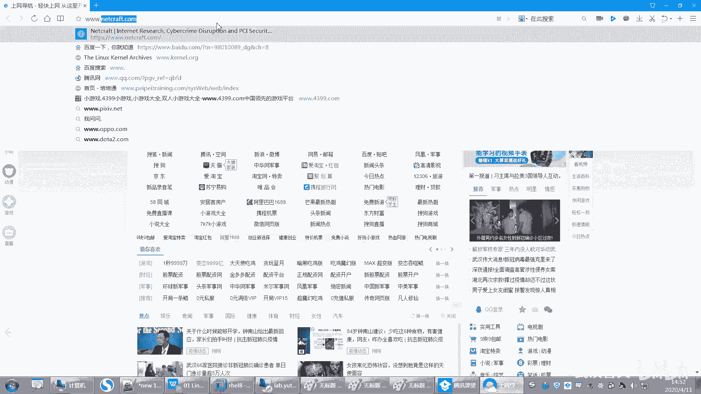
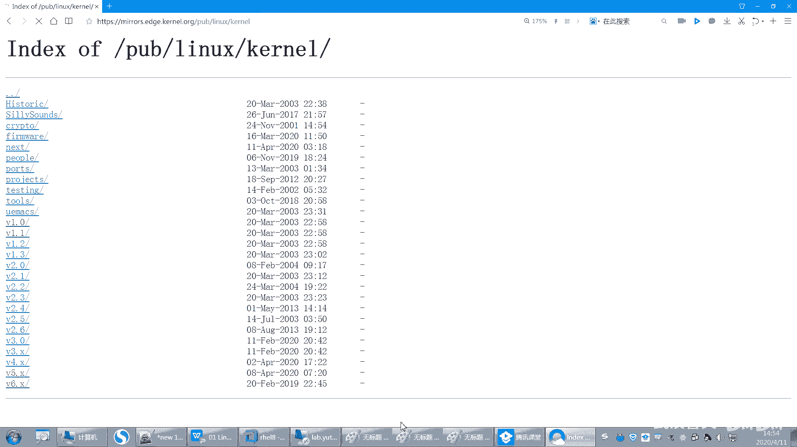

# 【已更新】最新版丨誉天红帽RHCE 8.0系列培训视频 - P7：Linux发展史和版本介绍-07 - 武汉誉天 - BV1cv411q74E

就成为一个商业化的产品了。商业化产品刚开始是免费给大家用，对吧？又开源，但是后面啊就不是这样子了啊，就不是这样。好，那么那这是unix啊，那就到unix呢要说到另外一个人，这个人叫什么呢？

是rihard Richardd啊。

就这个人。

这个人大家可能都没有听过他啊。呃，不过你要知道，因为他非常厉害。嗯，他非常非常厉害啊。呃，这个Rcha storeman呢，他呃你可能听过linux的创始人叫雷纳斯，对吧？嗯。

但是你没有听过这个人叫riacheltman哦，这个人当时他其实是这个他是做什么呢？他在一个开发小组里面，他是为这个unux写什么东西呢？写一些应用程序的，就开发一些应用程序。大家知道有了操系统之后。

你就要在下面去开发，就基于什么？基于这个操系统去开发一些应用程序。它本身就是一个研究，它就是一个。开发者啊就是个开发者，就写应用程序的。那么当时他写这个应用程序呢。

呃为ux但是后来慢慢unix不是转为商业化的产品了，对吧？unix慢慢转为商业化产品了。那么在他当时那个小组当中，他那个小组的人基本上有的人就是依然还是怎么样为unix服务，对为unix去写。

因为他们觉得嗯可能其他人不知道怎么想。他但但是他自己呢觉得什么，他自己觉得我写的这些东西用在这个上面，那这个给别人去用的时候又要去收费，又要去一堆这个版权问题，对吧？别人都用不起了，那他认为是什么？

他要有开源的精神，要贡献开源。就这个人最早的时候，他就觉得。我这些东西开发出来，就应该给别人免费去用。对，给别人去开源，就可以拿它的源代码，而且教他去使用。对他当时这个境界还是比较高的啊。

所以他当时就不与他们为伍，对吧？就觉得呃我不需要再跟你们一起了。对，不要再跟你们一起做这些事情了啊，但是他他也很难受，为什么呢？你不用unix，你用什么？当时的操作系统只有一个可选的对。

就这个unix啊。😡，哦，那后来呢他呢嗯他自己啊。它组织了一项运动，叫兼U运动，叫兼U运动啊。那这个兼U的组织这个这个名字呢其实就叫什么GNU is not。呃，unix你看啊那GNU对。

就组成了一个叫GNU计划，叫GNU计划啊，就是发起了一项运动计划。呃，那么这个项运动跟计划呢其实就是来倡导什么？倡导开源啊，倡导开源啊，就他认为。我们的这些。软件都应该开源。对。

都应该开源给到大家去去使用它啊。好，那么呃但是他也没办法，对吧？因为unix确实当时只有这一款这个操作系统可以使用啊，直到什么时候呢？直叫直到1991年的时候啊。这是一个转折点，我们linux诞生了。

对。呃，1991年的时候，linux诞生了啊，所以linux它是1个90后，对吧？它是个91年的啊，它91年，那现在为止，它可能就只只只有什么，只有30可能3030岁，对吧？还是比较年轻的啊。

还是比较年轻的。🤧好。那么linux当时是怎么开发出来的呢？它就有一个人叫什么，叫雷纳斯，对吧？就这个是这个人吧。

呃，就这个人啊叫雷纳斯托瓦斯，嗯，这个人呢呃现在还活还活着啊，就是现在还在为这个linux在做贡献。对呃，不过他听说这个人的脾气非常古怪，对吧？哦，非常古怪的一个脾就是那个啊然后当时他是一个在校生啊。

在校生就是好像是个研究生吧，嗯，他当时呢有一个什么呢？他有一个unix。

它有一台unix，当时有unux其实已经很不得了了啊。对，就已经很不得了了。然后它呢根据这个unux的架构。就是unix的架构。比如说嗯就是就是嗯这个unix的组成，对吧呃。

然后去自己写了一套呃linux。那么当时这个linux呢，虽然说是参考了unix，但是请注意它里面没有一行代码是抄袭unix的。也就是说它只是参考了它的架构，但并不是什么。

并不是代码抄袭了unix能理解吗？所以unix跟linux，它们之间其实是没有什么关系的。只不过它叫一类unix，对吧？它只是类似unix，但是它不是unix衍生版本。对，不是unix衍生版本啊。

因为没有一行代码是抄袭什么unix的。啊，那么linux当时开发出来的时候。它还用不了，为什么？因为它是开发出来的时候，它是一个内核。它是一个内核啊，什么叫内核呢？内核叫 kernelnal。

唉叫 kernelnal啊，我们内核是一个操作系统的心脏核心部分啊。对，它是一个核，就是就相当于什么？就我们操作系统的心脏一样，没有了是吧人嘛？没有操没有人的心脏一样，对吧？人没有心脏。

那就没有办法泵血了是吧？你就活不了了啊，没有内核那。😡，就。免谈对吧？免谈啊，所以这个内核呢它是用来做什么？它是用来控制。硬件的。对，它是用来控制硬件的。就是说我们要去往里面写数据。

那要通过内核来去写到硬盘当中，要去调度CPU要通过内核去调度，要去调度磁盘，要通过内核去调度，OK吗？调度网卡要通过内核去调度，所以都要通过内核内核跟硬件就是交互。好，但是问题是有了内核。

我能不能去人为的干预呢？人为去干预是吗？我就是人为去想去什么。😡，人为干预想去往里面，比如说我想去控制它，我想人为能不能给我一个接入口，就是比如说我点鼠标啊，我说我敲命令啊，对吧？

那能不能呃给我提供这样一个入口，让我去控制我的什么硬件啊，没有对，只有内核是无法去控制它的。它虽然可以控制硬件，但是人为没有办法去干预它。😡，好，那么需要有什么才能去人为去干干预它呢？哎。

就是这个操作系统。需要有操作系统才可以去干预它啊。对，需要有操作系统。其实说白了就是我们所说的OS。那你说老师操作系统不就包含内核吗？不是这样的啊，是当时他是我给大家画张图，大家就知道了啊。

我们要弄清楚啊，就是他们之间的关系是什么。呃，如果说。好，如果说我们中间是硬件。当然，没有硬件是不可不可能的，是吧？好，那么这部分呢就是我们的内核。啊，就是部分就是内核啊，那外面的就是操作系统。哎。

外面就是操作系统啊，但是呢我们现在啊我们现在所说的操作系统是包含是这两部分的。那我们这个这个外层外层操作系统跟那个 kernelel组合在一起，才是我们现在所说的什么操作系统。😡。

所以我们现在已经把它概念就是已经已经混合在一起了啊。所以现在我们所说操作系统其实是包含什么？包含内核和外部的这个操作系统。这个操作系统是什么呢？这个操作系统其实就是所谓的什么应用程序儿啊。

就是一些应用程序。就是一些应用程序，就是这个应用程序可以给你提供一个入口。唉，你可以呃去操作它就是提供这样一个。比如说可以提供一个图形界面呢，我可以点点点，可以提供一个命令行，我可以去输入命令，对不对？

那这就是应用程序啊，包括我们后面会学的一些命令等等，都是属于这一层啊，那都是属于外面这一层，OK吧。啊，那么有说内核还没有办法用，对不对？啊，而且呢当时啊。

雷纳斯把这个内核给什么贡献出来了，也就是说他把它给开源了，哎，把它给开源了。那么开源之后呢，网上就有很多黑客嘛，对吧？那大家对它都比较感兴趣。因为这个当时呃也是轰动世界的一件事情，是吧？嗯。

能有这样一款内核出现，而且开源，那是大家多少人都很兴奋，对吧？所以当时内核刚开始写出来的时候，其实非常小的那个内核很小很小，后来呢呃大家逐逐渐的去完善它，完善完之后呢，到1991年的时候，呃，就是那1。

0的内核就发布了1。0版本的versionin。呃，1。0V就发布了啊就发布了。好，直到现在我们这个内核已经到我昨天看了一下，也是5。6。呃，V了，就是5。6点几5。6点几版本了啊，就是光内核啊。

光内核已经是5。6点几。我们所说的什么红帽八是吧，什么红帽七，那这种是什么操作系统版本是操作系统版本啊，好。这个就是内核，而且我可以大家去看一下。

我们内核。源代码都是可以去拿到的。你们可以去访问一个网站。

这个网站呢叫3W点 kernelel点ORG。

嗯。

对我们红帽八的内核版本是4。10。4。18是吧？呃，是4。18吧。哦，4。18是吧。🤧嗯，好。

然后这里有个3W点colp点进去看一下。然后这个linux，然后 kernel。然后这是V1。0版本的，就是呢。呃，这个是它最早的这个内核1。0的。当时这个版本你看它得有多大呀，是不是只有一个兆啊。

一兆左右估计解压缩出来估计有个不到10兆吧，嗯，不到10兆，这就是源代码。你可以把它下下来解压缩看一下。对，减要缩看一下啊，然后这都是一些补丁包补丁包啊。好，然后呢呃现在是什么版本了呀？现在是5点。嗯。

现最新的是无链机的，就是变更日志啊。那现在是无连机版本了，看到没有？而且现在大概有多大量呀，100兆左右了，100兆左右解压缩出来估计有将近快一个G，相信一个G的内就光内核呀，光那个代码就一个G的。呃。

这个就比较大了啊。这还不包括操系统啊，还不包括外层的操系统吧，光内核就有100啊100兆压缩之后100兆左右。嗯，那这就是内核，你想去看它的源代码，你就来，我也修改一下是吧？

我将来也想加入到开元社区里面。呃，呃，现在这个呃雷雷雷纳斯还在这个就是在为lin的内核发展做贡献。对他还在这个社区里面，为linux内核发展啊，做贡献啊。我们红贸八用的是4。18的内核是吧。

你可以去找一下。嗯，这就是大家可以自己去看一下啊。

好。

那我们再回来啊，刚后说到哪儿了？好，那么我们来看一下啊。

那这个呢呃就差操系统了是吧？那操系统谁有呢？GNU组织有啊，对不对？好，那么我们这又回到了GNU组织了啊。那GNU呢不是由这个什么reachsman就是发起了一项运动吗，对不对？那么他当时是为谁呀。

是不是为unux写应用程序的，对不对？是不是为unux写应用程序的呀？那刚好怎么样啊？Glinux。它可以兼容unix的一些应用程序。它开放了它开放了一些接口。所以一般如果当时是unux上面那些程序。

它可以移植到我们的linux上面，linux上面。它可以移植到我们的lins上面了啊。所以很多linux上面的应用程序都它都写了一个什么unix，对，什么什么unix。

而且嗯还会有可能会带什么GNU什么什么东西。对GNU什么什么啊，还GNU比如GCC有一款编译编译软件叫GCC是吧？呃，这个是GNU组织开发出来的嗯GCC。

所以将来你在linux上面会看到很多这种什么兼优什么什么东西，然后unux什么什么东西，对吧？这应该知道了它们之间的关系了啊。呃，它是之前unix在用，然后后来移植到了linux上面。

它还可以用还可以用。后来chardman就专注于在linux上面说开发什么开发应用程序啊啊，而且一直到现在为止，linux都是有开源的开源的操。对开源操。所以就是现在为什么大家都去用这个linux。😊。

对，都去用这个leaings啊，因为它是无国界的，就是像这种这种东西，它就没有说哪一个国家开发出来的是吧？它是社区社区哪个国家的人都有，它不是属于哪一个国家的组织。嗯。

所以这种如果是各个国家出现一些呃矛盾呢，对吧？那么不会影响到。那你像windows的话，它就有可能。就有可能是吧？只是说有可能啊会影响到我们去使用它啊。好，嗯，那这个就是我们的什么。

这个就是我们的GNU和linux之间的渊源啊，GU和linux之间。好，你把这个大概捋顺一下以后应该就稍微清晰一点啊。呃，linuxlinux的logo是什么，知道吧？看我们这个PPT上是吧？

呃，这个PPT上场对mice logo就是这个小企鹅，嗯，就是一个小企鹅啊。哦，坐着的小企鹅，这linux的一个logo linux的logo啊，linux的logo。好。呃，那我们再看一下下面啊。

嗯。那么我们来看一下。现在我有了什么，我有了这个什么有了硬件啊，有了有了内核，有了操系统应用程序，最后组成了一个什么组合组成了一个操作系统啊，组成了一个操作系统。

那么我们一般做对这个操系统做二次开发的时候，我们会拿内核。那把内核拿过来呃，甚至还可以把别人的操系统拿过来，我进行修改，对吧？然后做成自己的是么这样的一个发行版本。

对，这个叫发行版。呃，像我们我们这个就RHEL嘛，就是其中一个类型的发行版。对，就是其中虹贸公司拿过来嗯修改的，然后做了一个发行版啊，发行版。但是这个发行版非常非常多。对，非常非常多。

它最终都是基于什么？这个内核开发的啊，基于这个内核开发的。所以他们都是一家人对他们都是一家人，呃，他们最终都是由这个内核，他们内核都是一样的，只不过内核版本可能不一样，对吧？

但是你你你只要找到跟他同一个内核版本，那他们就是一家人。好。那么我们就可以在这个应用程序或者在内核你也可以修改，都可以修改。这两个都可以修改啊。好，最后做成自己的发行版本。那么红帽呢是其中一家公司。

红帽很早就开始做这种这样的发行版本了啊，它大概是在1994年的时候嗯，这个人就是红贸公司的人啊，在linux内核内核呃系统内核基础之上，对吧？然后做了很多这样的呃集成了很多这个源代码，嗯。

像我们linux上面这些操作系统应用程序啊，一般都是也开也是开源的，就应用程序这种软件，它一般也是开源的，嗯，一般也是开源的啊。

好，那么最后呢就发布了红帽的系统呃，红帽最早的版本叫什么呢？红帽最早的版本啊叫这个东西。

叫什么redhead。123456789就是最后好像。最高版本是叫redhead9。redhead9啊就是最高版本，就是最早红猫的版本啊，它就叫redhead什么什么什么。😡，好。

再后来呢他没有再去继续这样叫了，因为他改变了自己的方向，他想做服务器版本server版服务器版本。所以他后来分了两分了两个方向，一个就是server版。server版叫什么？叫HEL。对，叫鸿猫企业版。

呃，当然还有其他鸿猫有自己的版本，其他自己的版本啊，待会儿我会来给大家介绍，这是其中一个版本啊，其中一个版本。

嗯。好，你看大概就是这样子啊。嗯，这个这个应该没有没什么问题吧。我一直在给大家说，自己说嗨了，不知道你们听听没听清楚我在说什么啊。😊，好。所以红帽现在也是什么呃，开源行业和linux的一个领头。

这个呃带头公司吧，对吧？带头公司啊。好，那么下面我们来看一下关于linux的一些发行版本啊，linux的发行版本。首先是红帽的发行版本。

红帽旗下有三个版本，红帽旗下有三个版本啊，一个叫红帽企业版linux。还有一个叫呃fidora。斐多ra啊。还有这个叫cents三个我都来介绍一下，必须都知道啊。

第一个就是我们今天用的这个今天我们装的这个系统。这个系统叫鸿贸企业版linux。啊，它叫企业版。那么它一定有个功它它的特点就是什么？应用程序和功能稳定稳定啊，我们要的是什么？我们要的就是稳定对吧？

要的就是稳定啊啊，嗯而且它更新的比较慢，因为它功能更新的话，它需要测试一些功能，所以呃可能更新的要慢一些。一般红帽的话44年左右。4年左右有个新的版本，像我们去年是去年的时候，红帽八呃出来是吧？

而1414年的时候是红帽七，红帽七想一下经过多少年，大概4年左右4年左右啊，更新一个新的版本。嗯，更新一个大的版本啊，就是7到8下一次再到9，可能要又要4年左右以后，对吧？嗯，4年左右以后啊。好。

然后它呢它的一个特点就是它有专业的技术支持服务。当然这个服务我们说过了，你是要付费的，是要付费的啊，就是你不交钱，人家不管你。呃，你可以免费用，你想怎么用就怎么用，但是你要怎么样，嗯，你要出现问题了。

那我不给你解决，你交钱我才给你解决。而且这个服务的费用不低对，不低啊，所以国内有很多他用不起啊，对吧？那他怎么办呢？那只能用一些其他的版本是吧？那待会儿我会介绍啊。好。

但是绝大多数都是根据它来呃开发出来的嗯。啊，呃都去基本上都是用它比较知名的啊，就这个红包企业版的。好，第二个叫斐doa斐doa啊，斐dora的这个版本它是面向于嗯。面向什么呢？面向桌面版的。

它其实面向个人和桌面的。为什么要面向个人跟桌面呢？因为这个呢不是面向企业的啊，你看它没有带企业吧，不是面向企业的啊。😡，啊，面向面向个人跟桌面的话，桌面的话就是说它图形界面很很很炫。图形界面很炫。

大家可以去到它的fra的官网去看一下啊。嗯，它呃图形界面跟windows有了一拼。对windows那个图形界面呃相当于是比较炫的，是吧？但是它呢。

