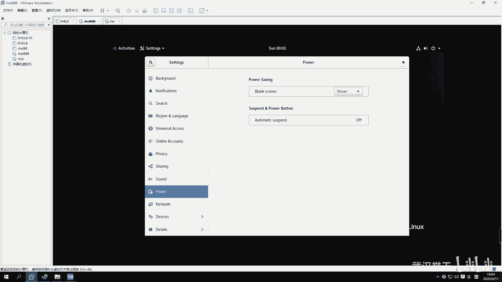

# 【已更新】最新版丨誉天红帽RHCE 8.0系列培训视频 - P9：Linux基本使用方法-09 - 武汉誉天 - BV1cv411q74E

好。呃。刚刚有同学刚刚肖老师找我要这个有同学。😊，找肖老师要计算机英语资料是吧？😊，我刚刚说的那个赠送计算机英语。是。你不懂我的隐晦意思吗？😊，啊。还成老师计算机英语资料在哪是吧？😊，嗯。

这个没有资料啊，就是说呃是在学习的过程当中呢，呃陪跟大家一起啊。然后对这个学习这个英语啊，就是说嗯我会给大家解释。对会给大家解释这个呃英语单词，还有一些基本的这个呃看把排错呀。

呃所以你要对这些单词要有敏感，就是你看见它以后，你要能。嗯，要能认识他啊对，要能认识他啊，这是我的目的啊，这叫计算机英语啊。😊，嗯哎，笑死我了。😊，八级呀八级没有考啊，我英语专业才考专八吧。

我是考了6级，我们我们非英语专业的应该是不会考这个考专八的吧。大家要最好把这个46呃4级哦这个四嗯。这个这四级的话一定要考过，好吧，这个有的有的公司它有硬性要求的，如果你们还来得及的话啊，呃。

最好还是要把这个英语英语四级考过了，就还是在校生的啊。在校生的同学还来得及把英语四级考过了啊，因为这个他有的公司它有硬性指标的。你必须要过4级。嗯，如果。如果那个的话就算了，好吧，社会人士考不了啊。

修为人是考不了这个英语四级。在校的话就还是珍惜啊，还是珍惜这个学习的时间。嗯。嗯，有那个好像成就是。有一有一个那个那叫什么？这个不太清楚，那个没考过。好嗯，不说了啊，我们上课。

下面呢我们来看一下第二章啊，第二张呢这个是linux的基本的使用。我们要先去会用一下，就操作界面要熟悉一下啊。好，呃，这张呢我们会去学习一下关于怎么去登录这个linux操作系统。呃。

还有怎么去呃还有这个控制台是吧？有几个控制台呃，怎么去启动一些图形。呃，你要会去简单的执行一些linux的命令啊。呃还有最后你要去会去编辑文件啊，编辑文件啊，最后呢我们稍微做对root的root用户呃。

做一个基本的了解。好吧。呃呃，下面呢我们来看一下啊，关于等会去登录操系统。呃，我们linux提供了两种登录方式，两种登录方式啊。第一个呢是图形图形登录，就是第一个第一个这种方式啊，就图形登录。呃。

这个这张图可能放的不太正确，应该是那个登录界面啊，就是这个图形的。嗯，第二个呢就是这种字符界面的，看到没有？字符界面的啊。好，我们来看一下啊。

呃，图形界面呢就是这样子。如果你选择了sver with GUIGUI的啊，就是GUI那就是带图形的。那么带图形的话，嗯，它这个地方就会有进来之后就会看到这样一个登录界面啊，登录界面啊。

你可以怎么样在这输入输入呢？那就是这样的是吧？然后在这输入一个。Root。嗯，然后再输入密码这样子啊，就你输入用户名跟密码就进来了，就这样子好吧，进不来就密码输错了啊。有同学他有一个小键盘，你知道吧？

我我这个真的呃，有的同学他他的笔记本是有小键盘的。他在输密码的时候，他用的是小键盘上面去输密码。嗯，然后导致他怎么都进不去，他说老是密码不知道啊，他是问我，我说我也不知道啊。😡，那要不我帮你破一个吧。

那我我在你身边，我可以帮你破，对吧？那我现在不在你身边，我没办法帮你破啊，所以你这个要注意输密码的时候，千万不要你最好不要用小键板，有时候你摁出来，没摁出来，你搞不搞清楚的啊。好，这是通过图形界面。

图形界面去登录啊，还有一种登录方式就是这样子的。嗯。Yeah。

我不动。外部没有吧。

啊，就还有一种界面是这样的界面啊。还有一种是这样的界面。好，然后这样的界面的话就是嗯看一看这个是鸿贸企业版8。0的，是吧？然后这个是我们的操系统版本啊，下面是内核版本。嗯。哦，这个好像有。

他说激活web的conl，对吧？web的登录方式哦，就开启这个，你是应该是stoS8了吧那。对。他这个web console。嗯，通过web这个这个web去登录是吧？好。

然后下面这个就是输入这个呃用户名，输入用户名啊，root。好，然后再输入密码。这样的话就登录进来了，对，登录进来了啊。呃，然后你们呢就是在这个地方要记住啊，在这是log in这个地方是输入什么。

输入用户名，password的输入密码啊，有同学在这个这个地方输入密码，在这输入用户名，反正搞来搞去也没输对啊，不要弄错了。而且这个地方你输入密码是看不到的啊，就是其实你已经输进去了，对吧？

但是你看不到你输的这个内容，嗯，它没有回显，没有回显啊，然后这个就可以直观的给你一个什么给你一个这样的命密行。给你一个这样的命令行啊。

好吧。OK好，这是两种登录方式啊。但是现在就第三种了是吧，web界面啊。这个我要研究一下web team怎么登呢？还没还没研究过。啊，那么这个图形界面呢并不是所有的这个呃系统都会有图形界面的啊。呃。

你需要它由什么来支撑呢？它里面有一个叫X window的X window的啊，就是是这样的啊，就是在这个你看这这张图啊，这张图这个操系统这一层面需要安装很多的应用程序，很多的应用程序。

那里面有一个叫X window的。呃，叫X window的啊一个一个图形协议框架。嗯，这个它可以提供什么？提供这个我们的图形，就上面可以跑图形，就上面你只要跑图形。

你就是要装这个什么X windowX window啊。那么这个图形上面呢啊它会提供一些，比如说有了这个图形之后光有这个还不行，你还要装一些图形工具啊，这个图形工具呢，包括比如说啊还有什么有这个有两种。

有两种啊，一个是这个gome，就是我们接下来会学到的这个gome。它这个桌面工具叫gorm，呃，还有一个比较常用的叫KDE的KDE的。这两种是比较常用的桌面。对，第一个叫gor呃，第二个叫KDE。

我们红帽企业版的话用的是gor，这种工具都是开源的桌面工具，就是这个你看到的这个界面。

No。这个界面它就是什么？它就是gor工具啊，gor桌面。gor这个工具提供的一个桌面啊，那你可以在这点对吧？右键等等啊，这gor工具。

啊，所以你要想实现，比如说你之前没有装图形界面，那你就首先要装X window，要再装一个什么gome这个桌面工具才能或者装KDE才能实现中出现图形啊实现图形。好嗯。这个是这个图形控制台啊。

图形控制台好，这是虚拟控制台，对吧？那图形控制台跟虚拟控制台之间呢，它可以怎么样？哎，你不慌啊不慌啊。

啊，他嗯还没到那呢啊。然后通讯控台跟虚拟控台呢，它可以进行进行切换，对吧？比如说啊你我刚刚在这个这个地方是吧，是不是在这儿啊？

嗯，在这个地方呢，它呃有一个这个字符界面，就是就是字符界面啊，我们可以怎么样啊？执行呃第一个命令，我们今天选第一个命令叫starX。这也叫star X，它可以怎么样？它可以开启一个图形，那。

你执行一下star X啊，不过一般这种开图形的话，它很耗什么？它很耗这个。很耗性能的啊。嗯嗯。嗯，现在直引s达雷不行了吗？嗯。好，待会儿它就会开启一个图形啊，开启一个图形。

好。呃，其实那个star那个star的话呃刚刚执行的什么，是叫star X是吧？那个star那个X呢指的就是这个X window的意思，把它开起来得开起来啊。嗯。

你要想执行star X能够开启这个图形的话，那么你一定要怎么样要装X window和这个桌面工具才可以开起来啊，才可以开起来。

好，那么我们这个图形控制台跟虚拟控制台之间呢，它总共有几个呢？我们一共啊提供了几个虚拟控制台跟图形控制台呢？呃，我们红帽八跟七是一样的，七是几个，它就是几个。呃。

红帽八提供了5个虚拟控制台和一个图形控制台。5个虚拟控台和一个图形控台啊，一第一个图形控台就是我默认进去的这个。

那我默认进去是其实是这个看到没有？默认是不是这个啊？那我每次进去的时候，它都是这个图形控制台，对吧？图形控制台啊，然后我也可以切到什么，切到这个虚拟控制台嗯。

比如说呢是不是切了一个虚拟控制台，对吧？啊，这就是虚拟控制台。虚拟控制，其实说白了就是什么，就是字符界面啊，字符界面。那它们之间是怎么切换的呢？你可以摁着这个cttrorlalt加F1。😊。

controlal F1啊，然后control all F2，ctll F一直123456这样子去切换。嗯，一般就cttroll F一就是那个图形控制台，图形控制台就cttrol order F1。

然后conttrolal加F2到F6，就是5个虚拟控制台。对，5个虚拟控制台啊。好，你可以在虚拟控制台上执行startyle X运行图形。但前提是什么？你需要装途形界面才可以style X啊。好。

那是这样的啊嗯。我们这个地方呢，比如说啊我现在这个操作系统是吧，上面是不是有很多很多的控制台呀？那有一个、2个、3个、4个、5个。6个是吧？好，第一个呢就是我们的什么图形控制台，图形的啊。啊。

其他的都是什么字符界面，都是这个虚拟控制台，虚拟控制台。好，那我们在这个控制台之间进行切换。比如说我在这个控制台之间，这个控制台对吧？呃，这个空台切到这个空台，我们摁什么呀？

是不是按ctrolal加F2，cttrolal加F3contlal加F4F5F6是不是这样去切换呢，对不对？啊，那么我们刚刚是不是切到一个虚拟控制台，在这个虚拟控制台上，然后执行了一个什么star X。

对我在这个虚拟控制台执行了一个star x啊，那我在这执行一个star X，是不是就跳到第一个图形控制台呢？是不是就跳到第一个图形的界面呢？注意啊，不是不是啊。好。它并没有进入到第一个控台。

要想进入到第一个控台，一定要用controrl al加F一才可以进入。那我star X是什么意思呢？star X是指的是什么呢？指的是你在这个控制台上在这个控制台上开启了图形的应用程序。

对开启了图形的应用程序。所以你直引star X是没有切换控制台的，能不能理解是没有切换控制台，切换控制台，只能通过contrl al加F1F2F3F4F5F6这样子去切换啊，这样切换。好。

那么我们sex前提是不是要这个操作系统上面要装什么X window吧，是不是X window啊嗯才能执行s啊。好，你们可以去试一下啊，怎么进行切换。

cttrolal加F6是吧，嗯输入密码。

呃，我们红帽手像是红帽红帽六的时候，它只能开一个图形，红帽七可以开，就是你你有几个你就可以开几个。红帽八，就是你有几个，你就可以开几个。不过你图形开的多的话，它一般它就是就是怎么说呢？它带很难带起来啊。

嗯。呃，是这样的，你的conttrol键跟old键。FOF2那个键有可能它是那个声音，好吧。你要把它换成那个F2那个键。就是你们的键盘上。你们这你们键盘有时候摁F2，那不是声音键吗。

或者什么什么其他的亮度啊，那些键是吧？那不是那个你要换一下，切一下，你把它改一下。😡，才能摁出来，否则摁不出来的啊。

嗯。嗯。你们自己去研究一下，好吧，看摁哪个键。好。嗯。

那这个就是在不同的控制台之间进行切换啊。那么什么叫控制台呢？其实控制台说白了，它就是一个操作界面。控制台啊，它就是一个操作界面。但实际上我们现在所说的控制台已经不是以前那个控制台了。我们现在的控制台呢。

我们以前啊最早的时候说控制台，什么叫控制台，什么控制台就是什么？就是你的键盘啊，有鼠标啊，还有显示器啊，对吧？那这一整套，我们叫一个控制台，叫一个控制台啊，但是现在我们所说的控制台都是虚拟控制台。

其实说白了它去就你就一个什么？你就一个鼠标键盘显示器，对吧？但是你是不是可以切这种把它模拟出很多虚拟的控制台，对不对？虚拟的控制台啊，所以我们叫控制台啊，控制台啊，那么这几个控制台呢。

为什么要做这么多控制台，123456，对吧？啊，一般我们图形界面啊，比如说你装了图形界面。我装道图界面，我可不可以不开图形界面的？当然可以不用开图形界面啊。因为开图形界面的话。

图形处理它需要消耗更多的这个资源。对图形处理啊，所以我们效率要高的话，一般都很少开图形，很少很少开图形啊。像我平时如果没有什么特殊需求。我一般都不开图形。嗯，而且消耗的内存还会少一点，还会少一点啊。啊。

那么嗯。啊，那么如果第一个图形控制台卡卡住了，对吧？第一个图形控制台卡住了，或者第二个也卡住了，那么你就可以有更多的控制台。比如说你可以切到第什么切到第三个控制台呀，啊，切到第三个控制台。

然后切到第四个控制台对吧？他们各个控制台之间是相互独立的，相互独立的啊，就是这个控制台崩了，没关系，不影响第二个这个也崩了没关系，不影响第三个对吧？就就是崩了之后我还有几个总共有6个嘛。

因为怎么能6个都崩了吧，对吧？所以它就给为什么要给这么多的控制台啊，给这么多控制台，就是防止我们的什么某一个界面某一个控制台崩呃崩崩溃之后，我们可以用其他的控制台来去呃去操作啊，因为你在哪个控制。

然后操作其实都一样的嘛，因为它跟这个用户的操作界面是没有关系的，对不对？没有关系的啊，啊，这就是我们提供一些控制台。但是一般我们很少说这个除非你真的说这个控制台卡住了，你就要在这个控制台里面去操作是吧？

才会去切控制台啊，否则一般很少会去切控制台的，一。

那我们就是有网络的话，我们就远程登录了，远程登录了啊。啊，很少碰到说控台卡住的成绩，就这种情形啊，不过以防万一嘛，他给我们提供了，我们就知道就行了啊。

好，这个是图形界面跟字母界面之间进行切换啊，进行切换。好，那么下面我们来看一下关于gorm工具的一些这个使用呃一些这个简单的使用啊。嗯我们来看一下，我们先切到同界面啊。

嗯。我去吧。这个设置一下。😔。

嗯。

啊，然后这就是一个黑色的这个这样的一个图形界面啊，呃，图形界面。然后在这边呢，我们可以比如说我要去敲命令，对吧？我们在那个字符界面直接给你一个命令行，直接给你一个命令行。但是我们在图形界面。

我们怎么去敲命令，对吧？你就可以点这个地方，这个有个小红帽，那我们所有的啊就是你包括你将来用红包把考试的话，它桌面上什么都没有，什么都没有啊。你需要点这里。

嗯，这地方有个浏览器，对吧？那火狐浏览器就这个。我把这个机器关一。感觉还是会很慢，这图形就会跑很慢。好，然后下面有个terminal，看到没有？有一个终端，你就是打开点一下点一下啊呃。

红帽器实右键就会右键叫在终端中打开是吧？那这个没有，这个就在这里啊，那点一下terminal，点一下啊。

然后就会出来这样一个黑色的界面，看到没有？一个黑色的框框，对吧？

啊，这个黑色的框框上你就可以那它给你一个提示，一个提示符，你可以在这敲命令呢。呃，在这在这敲对吧，就可以敲。

