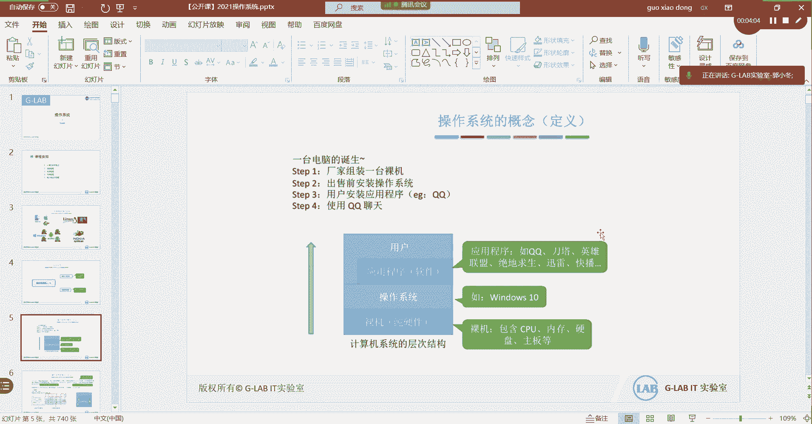
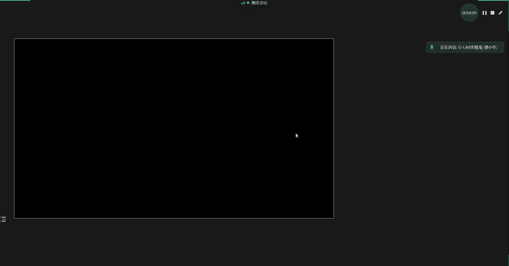
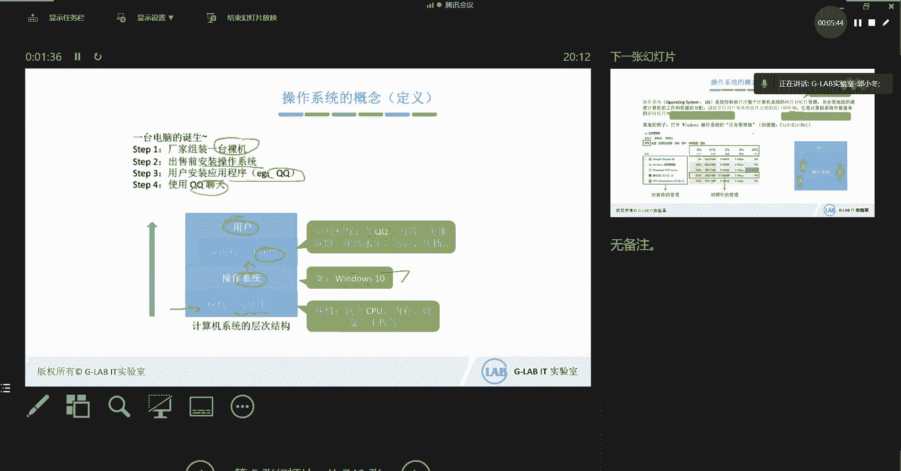
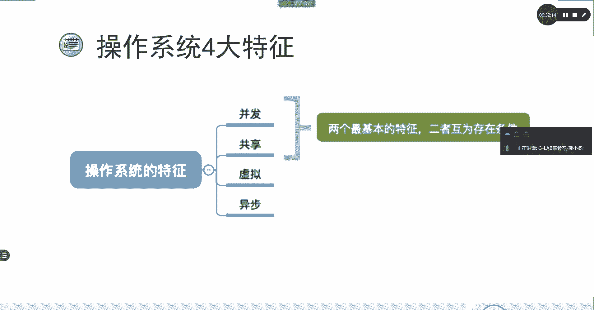

# 操作系统详解：01：操作系统概述

在本节课中，我们将学习操作系统的基本概念、核心功能与目标。我们将探讨操作系统作为资源管理者、服务提供者和硬件扩展者的角色，并了解其四大基本特征。课程内容旨在帮助初学者理解操作系统在计算机系统中的核心地位和工作原理。

## 什么是操作系统？

上一节我们介绍了课程的整体框架，本节中我们来看看操作系统的定义。

一台计算机的诞生过程通常如下：首先，厂家组装出纯粹的硬件设备，即“裸机”。随后，在裸机之上安装操作系统。最后，用户可以在操作系统上安装并运行各种应用程序，例如QQ。

因此，操作系统是安装在计算机硬件之上的一套系统软件。它位于硬件与用户应用程序之间。

## 操作系统的功能与目标

理解了操作系统的位置后，我们来看看它具体承担了哪些功能和目标。

### 1. 作为资源的管理者

操作系统负责管理和协调计算机的所有硬件资源（如CPU、内存、硬盘、摄像头等），并为上层的多个应用程序分配这些资源。这确保了多个程序能够有序、高效地运行，而不会相互冲突。

以下是一个资源管理的典型流程示例，描述了用户使用QQ视频聊天的过程：
*   **文件管理**：QQ软件本身以可执行文件的形式存储在硬盘的特定目录结构中。操作系统负责管理这些文件的组织、存储和检索。
*   **存储器与处理机管理**：当用户双击QQ图标时，操作系统将程序从硬盘加载到内存中，使其成为一个活动的“进程”。操作系统负责管理进程的内存使用和CPU时间片的分配。
*   **设备管理**：进行视频聊天需要使用摄像头。操作系统负责调度和管理这个硬件设备，使其能为QQ程序所用。

这一个简单的用户操作，背后涉及了操作系统四大管理功能（文件、存储、处理机、设备）的协同工作。

### 2. 向上层提供方便易用的服务

操作系统将底层复杂的硬件操作封装起来，向上层（用户和应用程序）提供了简单、统一的接口。用户无需关心硬件如何工作，只需通过这些接口发出指令。

这体现了典型的“封装”思想。例如，驾驶汽车时，我们只需操作方向盘、油门和刹车，而不需要了解发动机和传动系统的内部工作原理。操作系统同样隐藏了硬件的复杂性。

操作系统主要提供两类用户接口：
*   **图形用户界面 (GUI)**：用户通过鼠标、键盘与直观的图形界面进行交互。
*   **命令行接口 (CLI)**：用户通过输入文本命令与系统交互。CLI又可分为两种模式：
    *   **联机命令（交互式）**：用户输入一条命令，系统执行一条。
    *   **脱机命令（批处理）**：用户预先编写好一系列命令，由系统批量执行。

### 3. 对硬件机器的扩展

操作系统是最接近硬件的一层软件。它将功能相对单一的硬件（如只会计算的CPU、只会存储的硬盘）有机地整合起来，并通过复杂的逻辑控制，极大地扩展和增强了整台机器的功能。

这就好比给一个只会转动的发动机和只会滚动的轮胎加上一套传动系统，从而组装成一辆可以行驶的汽车。操作系统正是计算机的“传动系统”，它让硬件组合发挥出远超简单叠加的强大能力。

## 操作系统提供的接口

上一节我们了解了操作系统的三大角色，本节中我们具体看看它提供的两类主要接口。

在操作系统架构中，存在两种主要的接口：
1.  **用户接口**：即前面提到的GUI和CLI，供用户直接与操作系统交互。
2.  **程序接口（系统调用）**：这是操作系统提供给应用程序或程序员调用的接口。应用程序通过调用这些接口（例如，C语言中的`printf`函数底层会调用显示相关的系统调用），才能使用底层硬件资源。

**程序接口（系统调用）是统一且规范的**，这确保了不同开发者编写的软件都能以相同的方式可靠地调用系统资源。

这里需要区分“库函数”和“系统调用”。库函数是编程语言（如C、Python）提供的、预先编写好的功能集合。一些库函数内部封装了系统调用（用于请求操作系统服务），而另一些库函数则完全在用户空间实现，不涉及系统调用。

## 操作系统的四大特征

最后，我们来总结现代操作系统共有的四个基本特征。

1.  **并发**：指在一段时间内，多个程序可以同时运行。操作系统负责在宏观上管理多个任务的交替执行（微观上可能仍是分时串行）。
2.  **共享**：即资源共享，指系统中的资源可供多个并发执行的进程共同使用。共享可分为两种形式：
    *   **互斥共享**：如打印机，一段时间内只允许一个进程使用。
    *   **同时共享**：如磁盘文件，允许多个进程同时读取。
3.  **虚拟**：指通过某种技术，将一个物理实体变为多个逻辑上的对应物。例如，通过虚拟内存技术，让用户感觉拥有比实际物理内存大得多的内存空间。
4.  **异步**：在多道程序环境下，进程的执行并非一贯到底，而是以不可预知的速度向前推进。但只要运行环境相同，操作系统需保证多次运行同一程序都能获得相同的结果。

---

本节课中我们一起学习了操作系统的基础概述。我们明确了操作系统是管理硬件资源、提供用户接口并扩展硬件能力的系统软件。它通过文件、设备、存储和处理机管理来充当资源管理者，通过GUI和CLI提供用户服务，并通过统一的程序接口（系统调用）服务上层应用。最后，我们了解了并发、共享、虚拟和异步这四大操作系统基本特征，它们是理解操作系统复杂行为的基础。在接下来的课程中，我们将深入探讨进程管理、内存管理等具体模块。