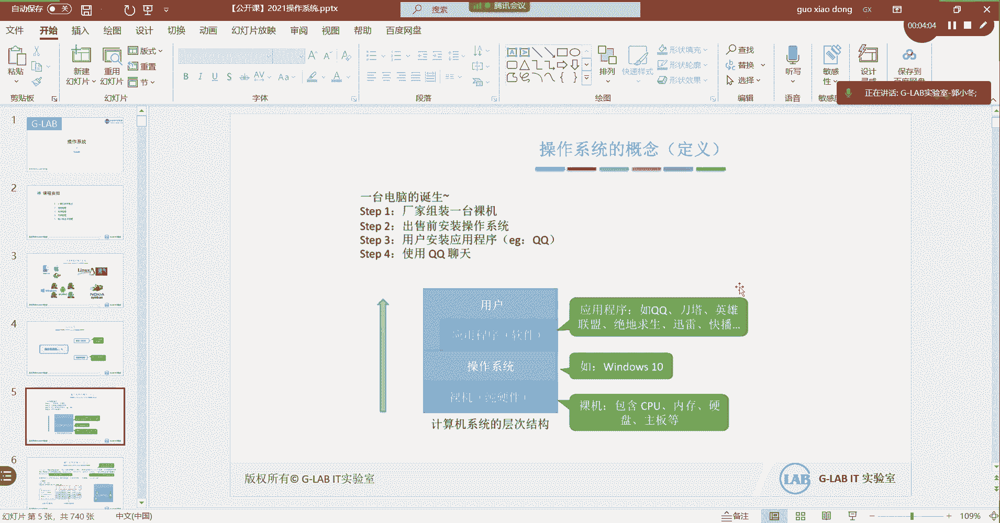
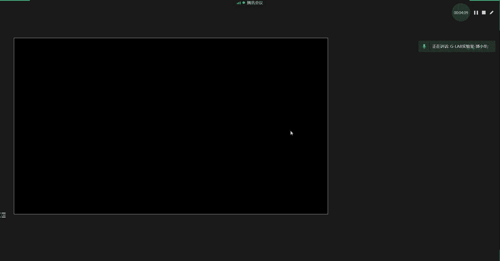
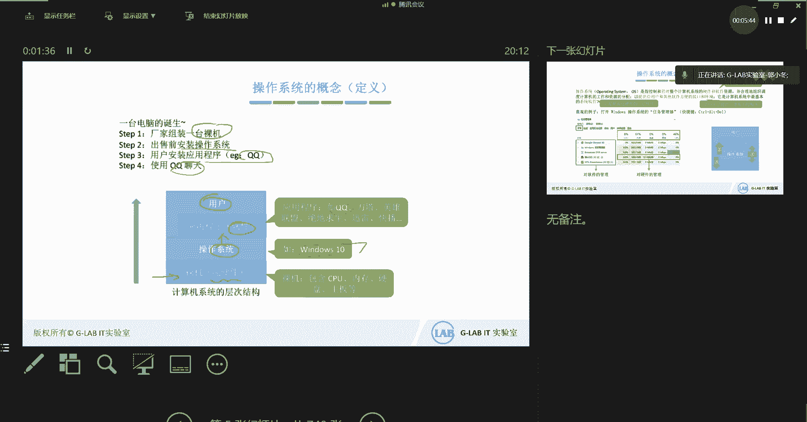
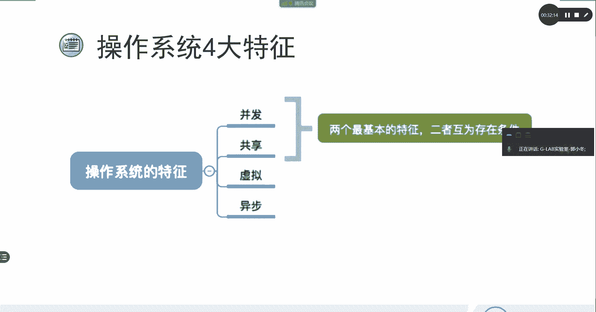

# 【操作系统详解01】操作系统概述／Linux／系统运维／G-LAB郭主任2021最新录制 - P1：1-操作系统概述 - 竞予科技 - BV1hK4y197n5

好，本套的视频相关的一些配套资料，请各位嗯去加我们这个marary小姐姐的微信，然后跟他呃去去要这个相关的资料啊，不要跟我要，好不好？这个是视频资料相关的获取。那接下来我们开始话不多讲啊。

我们开始今天的内容。那么这套课程呢，我们是讲操作系统，为什么没有讲到底是什么类型的操作系统呢？对吧？其实我们不去啊具体到某一类的操作系统。比如说现在主流的操作系统啊，呃。

linux和windows操作系统，包括苹果的mac OS是吧？没有具体到某种类型的操作系统，我们嗯把这个所有的学习的方向啊，不局限某一个操作系统，说明现在学的这套东西是所有操作系统都是通用的底层逻辑。

所有操作系统都通用的底层逻辑，底层框架，底层的实现方法，这就是这套课程要给大家讲的内容，对吧？好，这个没有说是哪个操作系统啊，好不好？然后第二个就是我们这套课程呢是更加的去讨论啊。

注重的点在我们底层的实现方法算法的实现，机制的实现操作系统底层的系统调用是如何实现的，也就是说它更加注重底层的实现方式，而不像我们平时所学的linux的操作系统如何通过实操去部署一个这个相应的服务。

对吧？部署相应的一些架构啊，这实操性的东西在这我的课上可能这套课程里面是没有的啊，实操相关的，大家可以关注我们gIT实验室的这个红帽的CE或者CA的课程啊，linuxCE和CA的课程。

那套课程主要就是讲如何去实操啊，如何去实操。OK好，那么接下来我们来看啊。好，我是那个资料白T实验室的郭主任啊，大家好多人这个有认识我的，又不认识我的。没关系啊，我们这期课免费课由我给大家来上。好。

那么我们这次课程主要会讲五大块第一大块就今天要讲的内容。我们会讲计算机系统的一个概述啊，概述相关的一些内容。好，第二个会讲进程管理，这个内容应该是比较重要的一块，也是最难的一块啊。

然后呢内存管理文件管理和IO的管理。这些都是组成操作系统不可缺少的一些功能组件啊，一个操作系统然能正常实现它的一些功能需求，肯定会离不开下面所讲的这四大块进程管理内存管理文件管理和IOO好。

那么我们来开始今天第一块大家熟悉的操作系统有哪些呢？对吧？在我这张PP当大家能看到操作系统现在主流操作系统分三大类啊，右下角的。这种这种叫塞班的野人的操作系统，大家可以忽略啊，很早很早了，对吧？非常老。

那么现在主流操作系统，移动端的也好，PC端的也好，总共就分三大类。第一大类就是这个左上角苹果OS叫m克 OS是吧？呃移动端的是IOS的手机上的操作系统啊，手机也是有操作系统的。

然后第二大类是linuxlinux呢其实它在PC端也是用的比较多的。现在比较重要的主流服务器，90%以上的重要的服务器都是linux的O然后呢，windows呢windows操作系统。

这也是我们平时日常工作啊，用的比较多的，好吧，好，那么这些都是我们常接触到的一些操作系统。好，那么这个是操作系统。那么接下来第一个内容我们要来讨论的是操作系统，什么是操作系统，对吧？

它的带它的定义是什么？那么操作系统的功能和目标是什么？好吧，那们来看什么是操作系统呢？先看第一个问题，什么是操作系统。那么我们来讨论一个问题。一台电脑它是如何诞生的呢？一台电脑。

它应该是由厂家组装一台裸机。看清楚啊。

诶。画一下。

来给他画一画，好吧。一台操作系统是如何诞生的？首先它是由厂家在底层装了裸机啊，然后呢在裸机之上安装操作系统。O然后在操作系统上再去安装一些程序，比如说QQ啊，这就是我们买了一台电脑回来的一个完整过程。

那么操作系统很明显是装在裸机上的一套系统，对吧？装在裸机上的一套系统，所以呢用我们这个这个图上呢表示，大家能看到，在最底层的话，它是裸机裸机可以理解为就是纯的硬件啊，硬件包括CPU内存硬盘。

还有主板相关的一些东西。那么在这个上面装了一个系统软件。我们系统软件叫操作系统。比如说装了个win10，对吧？好，在win10上面又装了我们平常日常用的比较多的，比如说QQ对不对？

装了这些日常应用的一些软件，然后最顶层的就是我们我们叫什么用户。是吧我们是用户吧。那么用户在使用操作系统的最直接的体现，它其实在用操作系统上面安装的软件吧，对不对？软件吧。

OK那么我们要能够通过QQ实现双方的互相聊天，它一定是离不开应用程序，这肯定是直接给我们的第一感觉，肯定是用的是QQ这个应用程序吧。应用程序肯定是离不开的，对不对？

啊，我这个PPT。稍等。你怎么自动主显示器？不用演示。好，这样就看看清楚了吧，对吧？OK好不好？啊，这样就好多了。好，继续啊。那么用户在使用QQ软件的时候啊，他肯定离不开这套软件。

但是你要知道最本质能够用用QQ实现聊天啊，实现聊天，包括视频，它肯定是调用了底层的硬件吧，对不对？它一定是调用了底层的硬件啊，叫裸辑是吧？硬件。那么不能直接用户不能直接用硬件去实现我们的软件的一些功能。

它必须要通过操作系统才能够对实现对底层硬件的调用，才能够实现QQ互相聊天是吧？所以看到这个图，我们对操作系统做一个简单的概念。操作系统它本身实现了什么三大块，哪三大块呢？第一个它实现了。资源的管理。

对不对？为什么我用QQ也能聊天，微信也能聊天，对不对？那么我在我的电脑上装了一堆软件，他们之间是如何协同工作，最终去调用底层的硬件来实现服务的呢？对不对？一定离不开底层的操作系统的一个资源的管理。

对不对？一定是离不开我们底层资源的一个管理。所以它的第一个功能就是它是资源的管理者，实现了硬件的资源分配，来为我们顶层的软件啊，按照硬件的需求实现资源分配。好，第二个呢是向上层提供了方便应用的服务。

这个也能理解，为什么这张图当中，为什么我们的用户没有直接去调用裸机，直接去调用裸机，让裸机来为我们的软件直接服务，而不使用操作系统。为什么后边一张PPT大家就能看到为什么？

那是因为底层的这个硬件是可以直接被用户的软件调用的。因为操作系统。本质上他也可以理解为就是一个软件。为什么我还要在软件之上再跑一个软件，最终来实现我们整个操作系统的这个这个实际应用呢？

其实当用户使用的软件变得很多的情况下，那么底层的硬件到底把硬件资源给哪一套软件来使用的话，就会存在一个选择，对吧？AA软件也需要申请硬件，B软件也要申请一个硬件。

那这个时候没有一个集中管理的软件来进行协调的话，那么这些软件之间就没有一个正确的良性机制。那么他们互相之间就有可能只有一个软件能正常工作，另外一个软件不能正常工作。

或者两个软件为了去抢占资源都不能正常工作，对吧？所以。我们的第二个说向上层提供方便应用的服务，就是我底层对吧？是什么样子，不关心我上层的软件应用只需要去关注软件的功能实现。

让底层的需求的调度或者需求的相关的一些需求的取舍或者需求的一些申请啊，或者这些相关的一些硬件资源的呃使用了，这不是由软件自己来去考虑的，就就丢给了操操作系统来干这种事情，对吧？OK所以呃让底层更加透明。

它向上层提供了便异应用的，更加的服务。哦，这是一个最接近硬件的一层。所以操作系统它其实因为要调用底层的硬件资源，所以它更加是接近硬件，更加接近硬件，没问题吧。好，然后如果我们打开操作系统。

打开这个任务管理器，能看到当前在系统上跑了哪些跑了哪些软件，跑了哪些应用，跑了哪些进程是吧？呃，linux可以用PS可以用PS是吧？AUX去看，对吧？去看到系统上所跑了哪些进程。

这个就是我们在系统上的一些软件所实现的一些功能或者叫软件啊，就是这块应用程序，OK好，那么在这里我们呃把上面的三个功能对应着我们操作系统架构来看的话，是操作系统，它实现了资源资源的管理。

底层的硬件资源到上层的软件应用，实现了一个协调。对吧第二个向上层提供了统一的接口，有了统一接口之后，不管什么样的应用程序，它只要调用统一的接口，就能够实现对底层硬件的使用。好，第三个。

它能够更接近硬件能够让底层的硬件更好的去为上层服务。这就是第三个，我们要讨论的特点，最接近硬件的一程。好吧好？好，我们一个来看第一个它是如何对资源进行管理的。我们举个例子，如果你打开电脑。

通过QQ跟你的朋友进行视频聊天的话，那么首先我们打开QQ呃，QQ的可执行文件或者QQ安装过后，会放在什么位置呢？它会放在我们windows的一个目录下面，你找到这个目录啊。

一定是打开一级一级的打开这个目录，最终找到QQ的执行文件啊，这个安装好的程序的执行文件。OK好，接下来找到这个执行文件以后，双击打。开打开了以后，QQ就能够正常的运行。正常运行了之后呢。

你就可以用QQ的视频聊天功能实现跟你朋友之间视频聊天。好，这么一个简单的应用，现在呃在我们电脑上所有的人在使用电脑的人应该都会都会用吧，都会用到吧，对不对？那么我们把这整个过程详细的去理解一下。

这整个过程离不开整个操作系统的调度。我们首先来看。安装的软件一定会放在某个目录下面，它目录和目录之间是怎么区分的？为什么会有目录层次结构，对不对？目录层次结构对应的最底层的存储方式是什么？

那么这个就涉及到操作系统文件管理。这就是涉及到操作系统的文件管理。这听懂吗？好，当你双击打开可执行的文件之后啊，双击打开了QQ的应用软件，它就会把应用软件读到内存里面去。

这个时候就会存在一个我们之前经常提到的两个概念，一个叫一个叫程序。一个叫进程。对不对？好，没有运行的。没有运行的程序，它就是一个简单的静态的，它是一个静态的。而程序只要被内存加载，也就是只要运行起来。

只要run起来，它就会立刻变成一个进程。对不对？所以呢嗯程序可以理解为是没有被运行的进程，而进程可以理解为是被运行过后的程序。对吧所以当我们打开执行软件的时候，呃。

我们会把程序写好写好某些特定功能的程序软件，加载到内存，然后再用内存读到CPU那么此时就会在操作系统上产生一个进程。对不对？那么进程。运行了它的功能就实现了。那么在操作系统上，如如果有多个进程。

也就是说我这个进程如何呃只要运行进程，它就要去底层申请硬件资源嘛，对吧？所以双击打开QQ点EXE这个过程伴随着呃上层的应用程序向底层的操作系统去申请硬件资源，这个硬件资源该如何调度，对不对？

如果我退出了QQ它的硬件资源是不是会呃清除掉，对吧？是如何实现打开应用程序产生进程的过程当中，对底层的硬件实现调度控制的，ok那么这个就是在。处理机管理或者叫存储器管理。OK处理机管理或者存储机构管理。

这两个内容是我们接下来要讲的非常重要的2块啊，就是我们会细到具体到我们具体到一个某一个特定的进程是如何被内存处理加载，被CPU处理加载，中间要经历哪些过程。OK所以这个过程伴随着处理机管理和存储管理。

好吧？然后如果你要想跟你的朋友进行视频聊天的话，这个势必会用到摄像头，对不对？摄像头，这就是我们的设备管理。这叫我们的设备管理，设备是如何被调度出来，然后实现管理实现使用的。好，那这一个整个的过程。

伴随着操作系统四大块的处理。这四大块的处理，就是我们重点要学的操作系统。它在如何实现的一个过程。它是如何实现的一个过程？好吧好？好，那么这个是一个简单的例子，帮大家去理解。

平常啊我们经常用电脑没有思考这些问题是吧？那么把这些问题可以提出来，大家可以讨论讨论，思考一下。好，接下来我们来讨论它是如何向上层提供方便的服务的。这个很容易理解底层学过计算机的啊。

大家应该都知道底层的话，硬件它只能够看得懂零和一的机器语言。要么是零，要么是一，是不是这叫二进制的机器语言，只能够被底层的硬件识别。所以底层是非常丑陋的。

对吧那么我们也提到过说用户是可以直接领利用直接使用底层的硬件，只不过你在写代码的时候，就必须得能够写一个底层硬件能看得懂的二进制代码，底层硬件才能够被你用吧，对不对？那么有了操作系统之后啊。

他会把底层的丑陋的硬件给呃隐藏起来，然后暴露在外面是漂亮的啊，在硬件之上啊，漂亮的把它的这个漂亮的接口呃，这个暴露在外面。那么所有的人在使用的时候看到的是它美丽的外表。那么根本不需要关心底层到底是什么。

你只需要跟这个暴露在操作系统外面的这种嗯美丽的友好的交互接口进行通讯就可以了。你不需要去知道底层丑陋的硬件到底是什么样子。这个就是操作系统如何向上层提供方便应用的服务的？好，这是一个典型的封装的思想。

这是一个典型的封装的思想啊。封装的思想在我们学技术当中经常会遇到这个封装的思想非常普遍，也非常常见。操作系统把一些丑陋的硬件功能封装成简单应用的服务，然后使用户啊能够方便的使用计算机。

用户无需关心底层硬件的原理，只需要对操作系统发出命令即可。OK上面只需要关心说小姐姐我需要一个服务啊，这个服务是什么？你不用关心呃，这个服务是怎么实现的，你不用关心，你直接去调用小姐姐这个服务就可以了。

所以它会呃更友好的来提供给我们一些服务接口，让我们来使用底层的硬件。好，那么关于封装的思想啊，我们这边举一个简单的例子，让大家来类比一下。呃，车子大家应该都知道是吧？其实大家现在开汽车啊。

汽车其实它是有很复杂的零件组装起来的，那么我们在开车的过程当中，根本就不需要去知道底层各个零件之间是如何实现工作的，底层的最底层的硬件各部门各零件之间是如何实现工作的，这个我们不需要理解。

也不需要知道我们只需要知道它好看的包装好的外在的一些华丽的一些接口是吧？我们只需要知道如何去呃操作，我们只需要知道踩油门，只需要知道踩刹车，只需要知道呃去控制方向盘。

就能够对实现对汽车的这个这个使用是吧？对吧？所以暴露在汽车最外边友好的接口是这个而底层去最终实现的，是每一个零件。这就是一个典型的封装思想。而操作系统也是这样子的。好。

那么这个就是向上层提供更加友好的一个服务。那么在我们的系统当中，我们用户有好的服务界面大概可以分两种，一种就是GY。大家看到图形化界面啊，就我们能够操作操作系统，通过鼠标键盘。

能够看到更直观的图形化界面这，这就是图形化界面，包括手机也是的，更加直观的图形化界面，这个我们把它有一个统一的说法叫做GUI叫GUIO那这就是它向我们提供啊向用户提供的一个友好界面。

那同时我们还有CLI，它还有一个叫CICI命令行界面。它也是可以直接让你使用底层的操作系统，对吧？这个CLI我们有两个方法，在分别在这个linux也好或者windows也好，有两种CI的命令行方式。

第一种大家可以打开CMD打开comode，直接在这里去直接在这里去使用命令啊，这个就是我们windows的使用方法。如果用linux的话，大家可以打开min终端，就能够看到这个CI的命令行。

而我们linux的正正常的日常运维主要的运用的方式，就是CI的。啊，这个运维方式吧，对吧？那么命令行还有一种方法叫批处理CI的两种模式，一种是单个的命令行的方式。第二个叫批处理。

批处理其实就是用户说了一堆的命令，然后你给他集中的去做。对吧而刚才一个命令一个命令的去输，这个叫单个的命令行，这不叫批处理，对吧？所以命令行有两种实现方法，一种叫呃单个命令，一种叫批处理，一种叫批处理。

不管是哪一种，它都属于操作系统向外暴露给用户让用户更好的去使用的接口，这个叫CI接口，还有一个叫GUI接口。好吧？好，接下来我们来看。向上层提供服务更好的服务。在这里呢我们要重点分析一下这个这个图啊。

这个图当中啊我们要怎么去理解操作系统底层的硬件。要能够被正确的使用，或者说要能够被正常使用，它离不开上层的操作系统。但是呢有些时候啊程序员他会写程序的时候啊，它应该先调用我们的一个叫库函数吧。对吧？

一个叫我们所说的库函数，那么在操作系统当中会向外暴露出一些程序接口，这个程序接口就是为了让某些特定的应用程序能够调用的啊，某些特定的应用程序能够调用我们的程序接口，从而实现对操作系统的调用。

那在这个图当中啊，比如说我们写了C语言写了hello world调用了一个print函数，叫print函数，对吧？那么这个函数就只能是C语言调用。

它才会在显示器当中显示相关的一些呃数据显示你的这个相应的一些信息。那么这一块调用了print函数的这个过程，其实就是操作系统啊，其实就是我们的。C语言调用了操作系统对外提供的程序接口。

然后呢才会在底层的硬件显示器上去显示我们呃C语言当中的一些信息，有打印出来的一些信息。OK打印出来的一些信息。好，在这个图当中，我们要解释一下啊，嗯大家应该明白嗯。这个大家应该明白。

这个操作系统本身它在嗯它在这个这个实现一些特定的功能的时候啊，它必须要让我们它最终的目的是要让我们去使用它，对吧？我们要使用这个操作系统，对吧？那么使用它的时候，刚才我们有讲过，它会它会去呃。

它会去做出它会做出一些友好的接口。这个一些友好的接口能够方便我们的用户啊去使用它。这个友好的接口是CI或者刚才讲的GUI。对不对？OK那么嗯如果我们在写代码写程序的时候，我们也要去调用到。

其实我们的一些软件都是去调用底层的硬件来实现的，对不对？那如果我们写代码写程序的时候，写一些应用软件的时候，那么它也会有一些接口能够被软件和应用程序所调用。这部分的接口，就是我这里要讲的程序接口。

这个是专门给我们的程序调用的，这个叫程序接口。听懂了没？所以我们再回过头来看这张图，刚才的那个图啊。看这个图。就这个图啊，看这个图应该能够看的很清楚。用户啊，你看这里用户这个地方啊。

用户是可以直接跟底层的操作系统去使用的，用户是可以直接去使用底层的操作系统，对不对？那直接去使用底层的操作系统的时候。

这个部分我们给它叫做CI我们做了CI或者做了GUI这样我们可以直接去去去使用操作系统。这个就是操作系统向上层提供友好的界面。然后呢，我们在用户可以去使用我们的应用软件或者应用程序。

那么应用程序再去调用操作系统的时候，这中间我们就把它叫做程序接口。啊，这中间我们就把它叫做程序接口。而且大家要记住，操作系统对外的程序接口都是统一规范的，知道为什么吗？这部分一定是统一的，而且是规范的。

为什么程序接口一定是统一规范的。因为嗯你不能说设计出不一样的统一的程不一样的程序接口，那这样就会出现呃你们部门的开发写出的软件啊，调用的是一个不一样的统一的程序接口，不一样的程序接口。

另外一个部门写的开发的软件，它要调用另外一套程序接口。那这个时候他们之间如果不统一程序接口不统一的话，就很难实现对相同操作系统的硬件资源的调用。就很难实现。所以这一套接口一定要统一。

所以大家在写代码的时候，只要涉及到调用底层的硬件，那就一定会用相同的统一的接口来调用它啊，这样来实现对操作系统底层硬件的调用。对吧所以这套接口一定是统一的啊一定是统一的。好。

那么这个程序接口我说清楚了之后，我们来解释一下在这里为什么还有一个库函数。什么叫酷函数？不光是C啊，我们写pythonpython也是有很多自己的酷函数的对吧？有很多自己的酷函数。

那么酷函数在这里就有一个问题了，我们的库函数和我们的程序接口。他有什么区别？我们的库函数和程序接口有什么区别？好，嗯，大家想一下啊，库函数是呃C语言或者编程语言。它写好的一个程序接口调用的软件包。

这可以理解为是调用程序接口的软件包。那么写这个软件包其实就是打包。打包好了之后，它的好处就是呃开发语言直接调用库函数，就实现了对底层的呃这个程序接口。一会儿接下来会有一个专业的名词叫系统调用。

叫系统调用。如果直接调用库函数，就实现了对底层的系统调用。就实现了对底层的系统调用。OK那并不是所有的库函数都要直接去调用程序接口，直接实现底层的系统调用的。不是的，有些库函数的功能。

它不需要去实现程序接口的调用。也就是说有些库函数啊，它不用下来的。他不需要下来，直接直接是库函数自己写的一些功能就可以了。它没有必要实现底层的系统调用。对吧？

OK所以大家要区分开库函数到库库函数和这个程序接口之间的关系啊，嗯每一个开发语言都有自己的酷函数，它是对某些特定的功能进行打包。那么这些软件包是可以实现对底层的系统调用，也是可以不去实现。

也就不需要也是可以不需要对底层实现系统调用的酷函数也是有的啊，这分两两类啊，一类是实现底层系统调用的酷函数，还有一类是不用实现底层系统调用的酷函数。好。好。

那么这时候我们来给大家总结一下这个地方我们讲到了操作系统到底是什么，它实现了什么功能，对吧？好，操作系统呢它的这个呃总结一下吧，操作系统我们直接给用户使用的，就2个GY和CICI又分两个。

一个是联机的命令，一个是脱机的命令是吧？呃，区别就在于一个是一句一句的讲，一个是一堆一堆的讲。好吧，然后呢嗯操作系统在这一部分，它还给程序员预留了一些程序使用的接口。

这个程序使用的接口就是方便软件应用软件直接调用接口使用底层的硬件啊，所以这一部分是程序使用的接口。这一部分是用户直接去使用操作系统的两种方法，一种是GUI一种是CI对吧？一种是GUI，一种是CIOK好。

那么嗯不管是不管是这就这一部分红框框出来的部分，这个统一的，我们把叫做用户接口。这个我们把它统一叫做用户接口，好吧，好。这个是我们第一块的内容，接下来啊还没完。第一块还有一个功能。

就是如何向下实现对硬件资源的拓展。这个要举个例子了啊，就是它是离硬件最近的地方，也就是说啊它是直接调用硬件的。那么它能够把硬件的功能扩充或者叫扩展，它能放大硬件的功能。举个例子啊，下边这个例子啊。

非常好理解。就比如说我们在发动机发动机它只会转，对吧？它轮胎它只会滚。但是如果你在发动机和轮胎上面装了一套传动系统。覆盖一层传动系统。覆盖了传动系统之后，让发动机带动的轮子去转，发动机带动的轮子去转。

那这就使原始的硬件机器得到了扩展吧。所以中间加了一层传动系统，它就会把原来只会转和只会滚的发动机和轮胎的功能放大。放大。而在操作系统的整个架构当中，操作系统就是这个例子当中的传动系统。

比如说我们的这个硬盘它只会只能存放数据是吧？其实内存和硬盘它都属于存储器，只不过一个速度快，一个速度慢。然后CPU它是计算器啊，它有计算器寄存器存储器，这都有是吧？那么CPU它也只是负责计算的。

那么显示器它只负责显示，你给我显示什么，我就显示什么键盘它是标准的输入设备，那么这些硬件单个看的话，它们的功能非常单一。但是如果在这些硬件之上加了一个。操作系统他就会把他们所有的功能放大。

所以现在大家所使用的操作系统的功能为什么这么强大啊，使用的计算机功能为什么这么强大？上面有很多的应用软件，大家都都都用的越来越多是吧？功能越来越强，那就是因为。操作系统把硬件组装不简单，不是简单的。

仅仅简单的组装在了一起，它还实现了更复杂的逻辑控制。对吧和更复杂的功能扩展。那实现了我们现在的操作系统的使用。所以我们呃现在这个公开课要跟大家讲的，其其实就是它是如何把这一堆硬件组在一起。

实现功能的放大，实现功能的放大。OK这就是这件事情，我们要做的是这件事情。好吧。好，那这个是最后的这个操作系统概念的总结。首先概念上它负责3块啊，它负责3块。第一块硬件的调度，对吧？资源的调度。

硬件资源的调度向上为用户提供简单应用的服务，它是一种系统软件，扩展了底层硬件的功能，对吧？它是离硬件最近的呃一套系统，它扩展了底层硬件的功能。好，这是它概念。第二个，它是资源的管理者体现在什么地方啊？

我们下载QQ去使用它的时候，中间伴随着操作系统的呃四大过程，文件管理设备管理存储器管理和处理机管理。OK向上提供的服务啊有两个接口，一个是用户接口。

用户接口主要是GUI或者叫CI还有一个是提供给程序员的软件开发所使用的程序接口。这个叫程序接口。这个程序接口我说过了，后面有一个专业的名词叫系统调用。我们经常讲系统调用，经常讲系统调用，说的就是软件啊。

提供给软件用来给软件调用的程序接口。程序接口只要被调用了，就就是说的实现了操作系统的系统调用啊。OK然后对硬件机器的扩展啊，扩展了机器，这就是我们前面讲的这些内容的一个简单的汇总，好不好？好。

接下来我们来讲一下操作系统的四大特征。我们来讲一下操作系统的四大特征。操作系统四大特征。嗯。

稍等一下啊。