# 操作系统详解：04：操作系统运行机制 🏗️

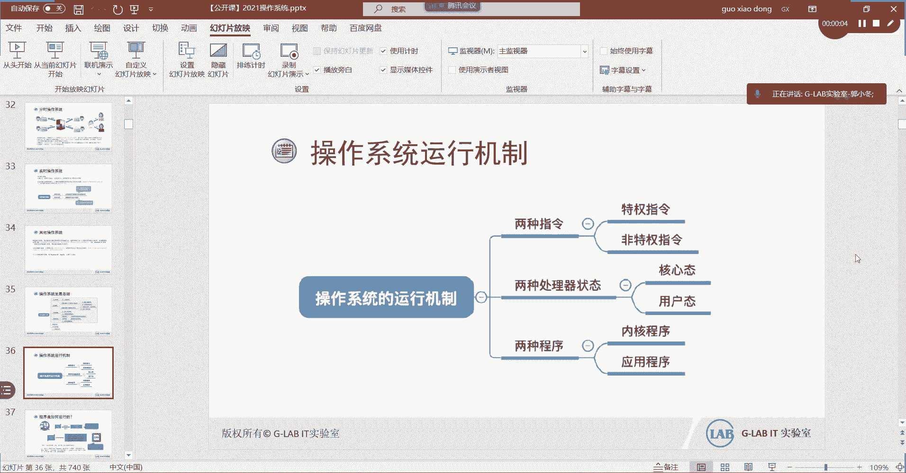

在本节课中，我们将要学习操作系统的核心运行机制，特别是用户态与内核态这两个关键概念。理解它们是掌握操作系统如何管理软硬件资源、保障系统安全与稳定的基础。

## 概述

操作系统作为硬件与应用程序之间的管理者，其运行遵循一套严谨的机制。本节将重点解析这套机制中的核心组成部分：两种处理器状态（用户态与内核态）、两类程序（应用程序与内核程序）以及两类指令（特权指令与非特权指令）。我们将通过比喻和实例，清晰地阐述它们之间的关系与作用。

## 程序的运行与指令

上一节我们介绍了操作系统的基本框架，本节中我们来看看程序是如何在计算机中运行的。

所有程序（无论是QQ、微信还是操作系统自身）都需要通过编译器转换为CPU能够直接理解的二进制代码。CPU的工作就是逐条执行这些二进制指令。例如，一段C语言代码 `int a = 0; a++;` 经过编译后，会变成一系列二进制指令送入CPU执行。

这里需要明确：**指令**指的是被CPU执行的二进制机器码，它与我们在命令行中输入的命令是不同的概念。

## 核心概念：两种程序与两种状态

理解了指令的执行，我们就可以深入操作系统的核心运行机制了。这个机制围绕着两个关键划分展开。

### 内核程序与应用程序 🧠

以下是两种核心程序类型的定义：
*   **应用程序**：为用户提供特定功能的软件，例如QQ、浏览器、游戏。它们运行在相对受限的环境里。
*   **内核程序**：操作系统最核心的部分，直接管理和控制硬件资源（如CPU、内存、摄像头）。例如，Linux系统的内核就叫 `Kernel`。

> **关键点**：一个操作系统的核心其实就是它的内核。有了内核，就能调度硬件。这也是Docker等容器技术只需一个Linux内核就能运行多个应用的原因。

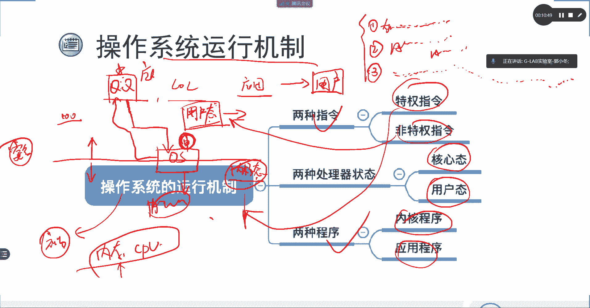

### 用户态与内核态 🔒

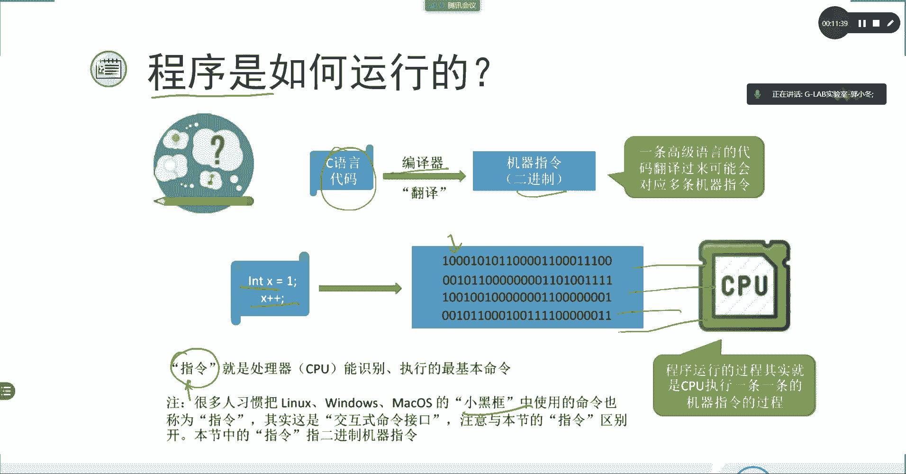

为什么要有这两种状态的区分？我们可以通过一个比喻来理解。

想象你去银行取钱。你不能直接进入金库拿钱，而必须通过前台的柜员（**用户态**）提交申请。柜员核实你的身份和权限后，通知后台工作人员（**内核态**）从金库中取出现金交给你。金库（硬件资源）由银行严格保卫，客户不能直接进入。

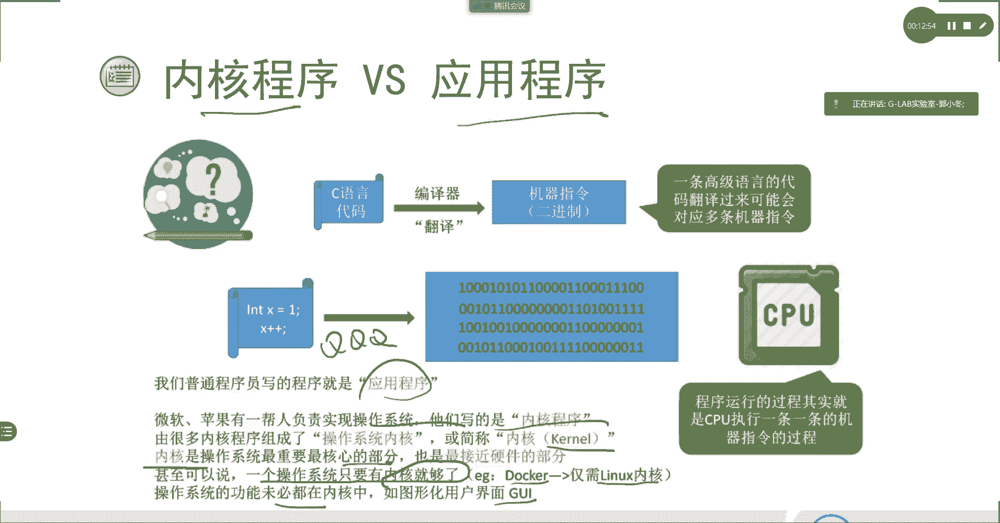

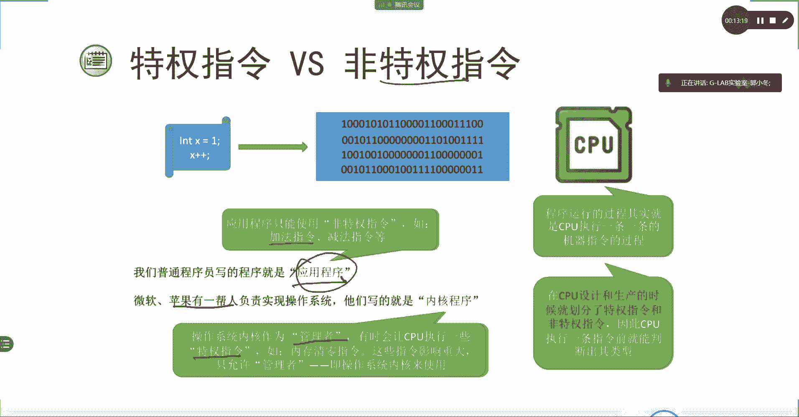

将这个比喻映射到计算机：
*   **用户态**：应用程序运行的状态。就像银行客户，只能在前台办理业务，不能直接接触金库（硬件）。
*   **内核态**：操作系统内核运行的状态。就像银行后台，拥有直接操作金库（硬件）的最高权限。

这种划分的核心目的是**安全性**。如果不加区分，一个恶意程序（如被植入黑客代码的QQ）就可能直接操纵内存、清空数据，破坏整个系统。通过划分态，确保了只有可信的内核才能直接控制硬件，应用程序必须通过内核“申请”才能使用资源。

### 特权指令与非特权指令 ⚙️

与两种状态相对应，CPU指令也被分为两类：
*   **非特权指令**：在**用户态**下执行的指令。应用程序的普通运算（如加法、循环）都属于此类。公式表示为：`用户态 -> 执行非特权指令`。
*   **特权指令**：在**内核态**下执行的指令。用于执行硬件管理、内存分配等关键操作。公式表示为：`内核态 -> 执行特权指令`。

## 状态切换机制

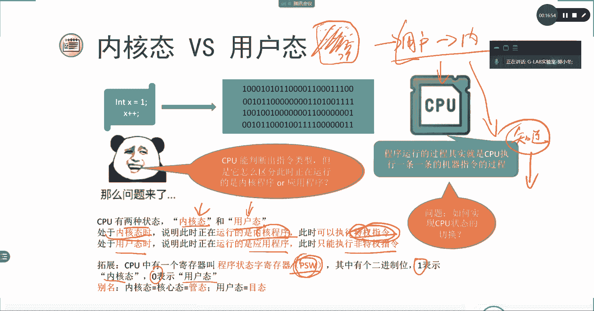

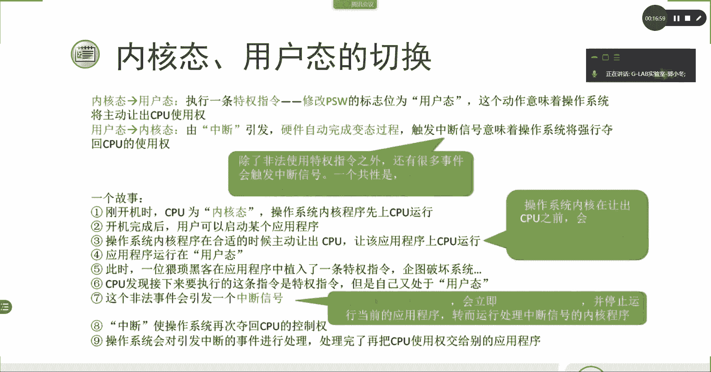

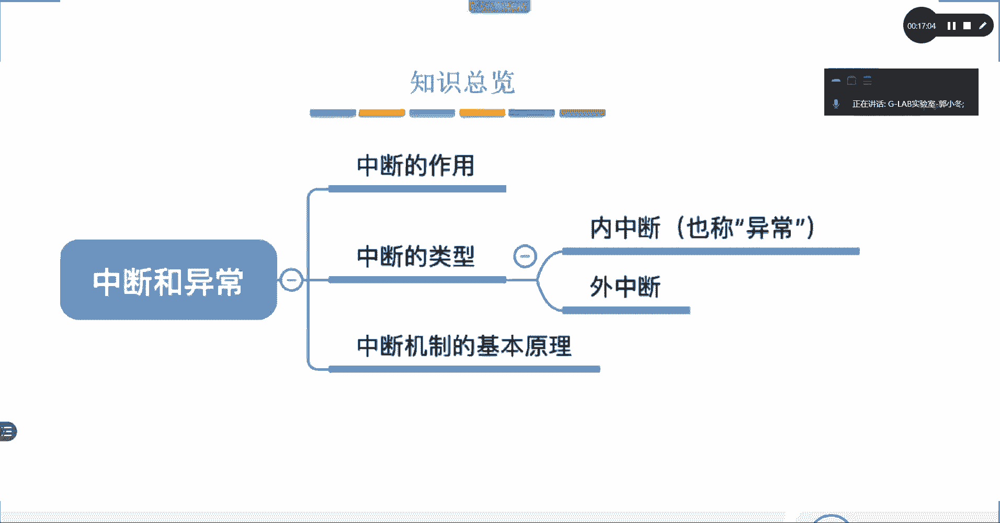

我们已经知道用户态和内核态需要切换，例如当QQ申请使用摄像头时。那么，CPU是如何知道并实现这种切换的呢？

### CPU如何区分与切换状态？

这个过程涉及几个关键步骤：
1.  **识别指令**：CPU的指令集是规范化的，它能识别出当前要执行的指令是**特权指令**还是**非特权指令**。
2.  **状态标识**：CPU内部有一个特殊的寄存器（称为**程序状态字PSW**），其中包含一个标志位。通常，`PSW=1`表示**内核态**，`PSW=0`表示**用户态**。
3.  **触发切换**：当CPU在**用户态**下遇到一条**特权指令**时，这被视为一个非法或异常事件，会立即触发一个称为**中断**的机制。

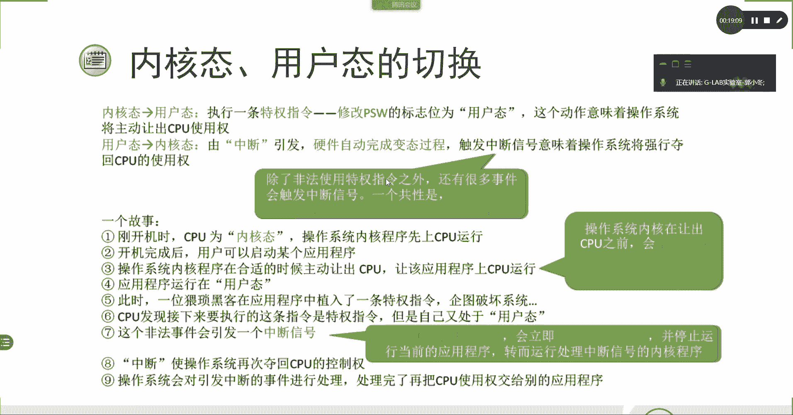

### 切换过程详解

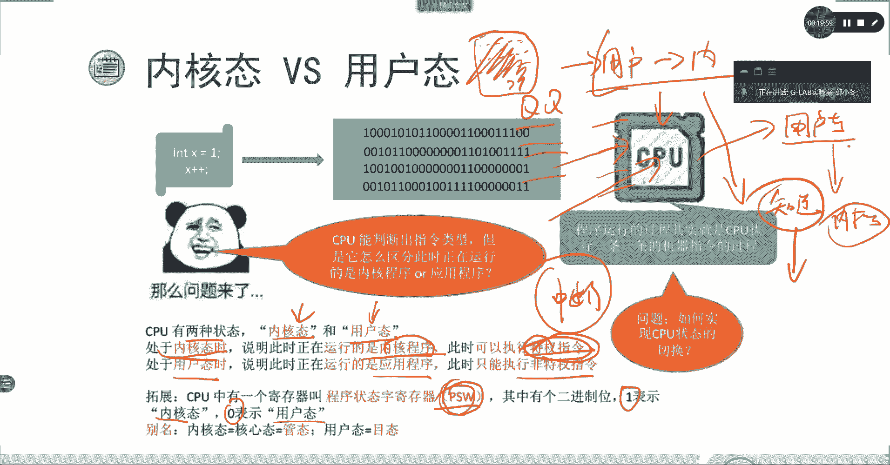

以下是两种切换方向的具体过程：

**1. 内核态 -> 用户态**
这个过程相对简单。内核程序执行一条特定的**特权指令**，主动修改PSW的值（例如从1改为0），CPU便从内核态切换到用户态。这相当于操作系统主动让出CPU使用权给应用程序。代码概念上可表示为：
```c
// 内核态下执行特权指令
set_psw(USER_MODE); // 切换到用户态
```

**2. 用户态 -> 内核态**
这个过程由**中断**机制触发。中断是操作系统重新夺回CPU控制权的关键。
*   **场景**：CPU在用户态下执行应用程序，突然遇到一条特权指令（可能是程序错误或恶意代码）。
*   **动作**：CPU识别到非法操作，会**自动**触发一个中断信号。硬件会立刻保存当前现场，并将PSW修改为内核态值（例如从0改为1），从而将CPU控制权交还给操作系统内核。
*   **处理**：内核接管后，会处理这个中断事件（例如终止出错程序），处理完毕后再决定将CPU交还给哪个应用程序。

> **提示**：中断分为内中断（由CPU内部事件触发，如上述非法指令）和外中断（由外部设备触发，如键盘输入）。更详细的中断知识将在后续章节讨论。

## 总结

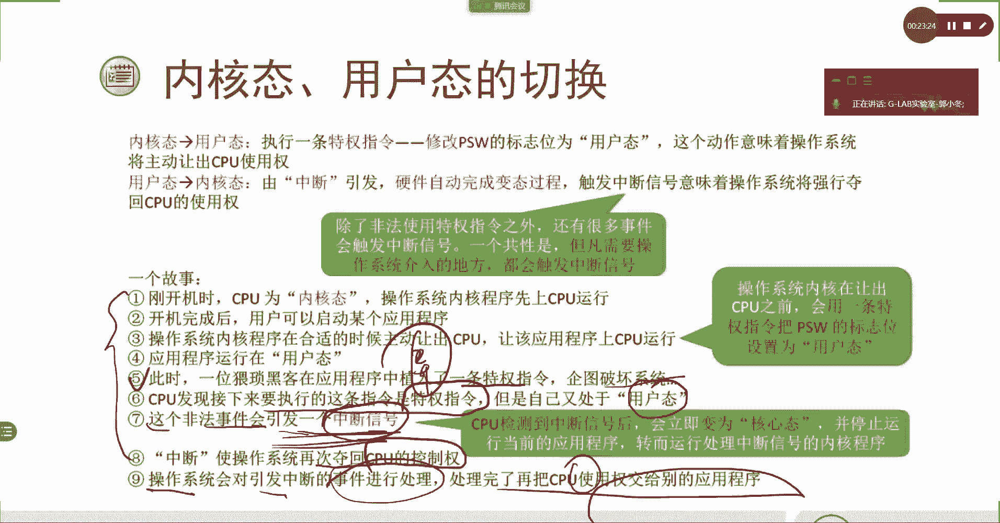

本节课中我们一起学习了操作系统运行机制的核心内容：
1.  **两种程序**：**应用程序**服务于用户，**内核程序**管理硬件。
2.  **两种状态**：**用户态**运行应用程序，**内核态**运行内核程序。划分两者主要为了系统**安全**。
3.  **两种指令**：**非特权指令**在用户态执行，**特权指令**在内核态执行。
4.  **状态切换**：
    *   **内核态 -> 用户态**：由内核通过执行特权指令**主动**切换。
    *   **用户态 -> 内核态**：通过**中断**机制**被动**触发，由硬件自动完成。

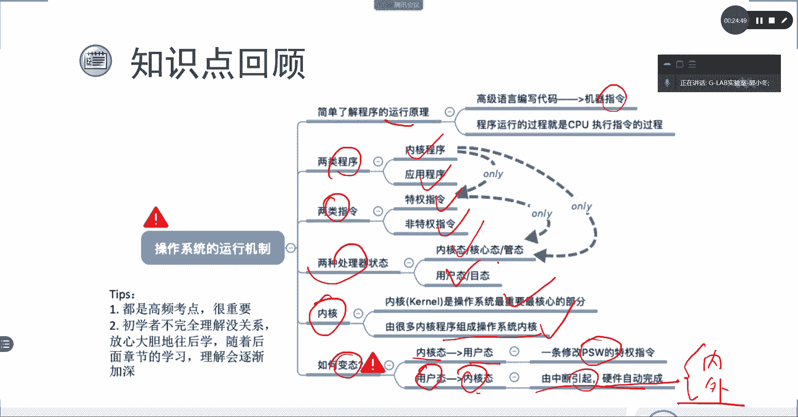

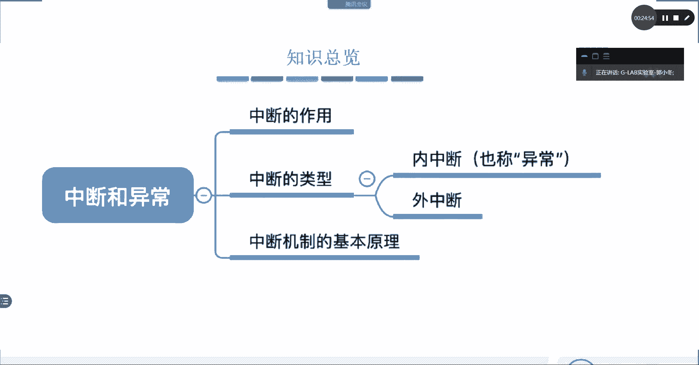

理解用户态与内核态的隔离与协作，是理解操作系统如何实现资源管理、多任务和安全保障的基石。在下一章节，我们将深入探讨**中断**这个至关重要的机制。