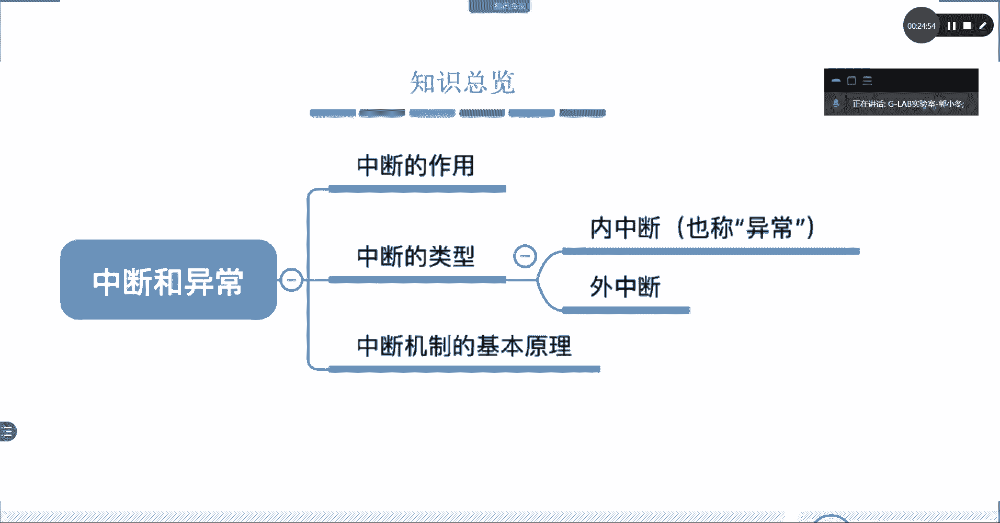

# 【操作系统详解04】操作系统运行机制／Linux／系统运维／G-LAB郭主任2021最新录制 - P1：4-操作系统运行机制 - 竞予科技 - BV1S64y127ao

好，接下来我们来看操作系统的运行机制。

操作系统的运行机制大概是什么？这里只是做一个大概的讲解，因为更详细的处理啊，包括内存CPU还有IO的一些文件的一些处理，是在后边的章节当中会给大家讲。

所以在我们今天的包括明天可能啊今天的今天给大家讲到的这个内容只是一个操作系统大概的宽泛的一些概念。那么具体的一个实现方法，对吧？我们在后面陆续会给大家介绍。那么这块要给大家介绍是操作系统的运行机制。

在这里重点讲两个概念，一个叫呃应该其实这边看到的是三个概念，但是其实就是两个比较核心的东西，一个叫内核态，一个叫用户态。一个叫核心态，一个叫用户态，或者叫内核态都可以。那么这两个概念是在说什么东西啊。

这边再说啊，这这是整个操作系统大框架的这个分类，叫内核态和用户态核心态和用户态也都可以啊，没问题。那么我们来讨论一下，这边再说什么东西啊，这边再说什么东西，举一个实际的例子吧。

就大家在使用操作系统的时候啊，我们装的QQ刚才有讲吧，我们装的QQ啊，什么微信啊，撸啊撸啊，对吧？这些都属于应用程序吧。应用程序是给谁用的，是不是给用户用的？对不对？是给用户用的吧。好。

然后用户在用QQ的时候，假设在跟别人视频的话，QQ是不是要要占用硬件资源，要视频的话，肯定会用到摄像头吧，肯定会要申请底层的硬件资源，要调用摄像头，对不对？要调用摄像头吧。所以用户在用应用软件的时候。

势必会用到底层的硬件资源。那么要获取到这个呃摄像头。要用到摄像头的话，那么是用户直接来调用摄像头，还是需要去到操作系统来申请啊？讲到现在应该是知道吧，一定不是用户直接去调度摄像头。

而是到操作系统来申请硬件资源，由操作系统来分配硬件资源。这能听懂了呗这能听懂了吗？OK好，这个里面就会出现一些问题。举个例子啊，问题在哪儿？😊，首先呃用户是要到操作系统来申请硬件资源。

那么最终的体现是用户让应用程序应该是应用程序。来操作系统上申请硬件资源，然后呢，硬件资源申请好了之后，也是被加载到。应用程序上嘛，摄像头必须要挂到硬件程序上才能够视频啊，对不对？对吧？

所以我说的是用户通过操作系统申请，其实本质上是用户在使用应用软件，通过应用软件来对操作系统进行硬件资源的申请，这个说清楚了吧，这个没问题吧，对不对？好，这里头会面临一个什么问题呢？

就是嗯QQ来操作系统上申请的话，对不对？申请。QQ来操作系统申请。QQ来操作系统申请。那么在QQ。就这儿啊就这在QQ和操作系统，包括用户QQ的操作系统往上的部分。这个叫用户台。这叫用户态。

然后一旦涉及到要操作系统去申请硬件资源的时候，这边往下的部分把它叫做内核态。把它叫做内核肽。好，这个我画清楚了。我们来想几个问题，为什么要有用户态和内核态的区别？为什么要有用户台和内核态的区别？

如果没有用户台和内核态的区分，QQ直接申请操作系统，让操作系统去申请这个硬件资源不可以吗？不可以吗？为什么要有用户态和内核态的？内核肽的区分。好，我举个例子。大家去银行取钱对吧？嗯。

这个例子大家能理解的吧，我们去银行取钱，对吧？你把钱放在银行，你去取钱的时候。啊，你虽然肯定是要办手续，对不对？是吧你肯定是要到柜台去申请办手续，办手续其实就是在找这里的QQ，在找操作系统嘛，对不对？

OK那么办完手续之后，办完手续之后，对吧？嗯，是你你你你可以选择自己直接进去拿，还是让别人给你拿？是不是让别人给你呃，肯定是要让后台的那帮人给你拿吧，对不对？

是让你的柜台上的操作员给你去拿这个现金100万，假设我要取100万。越南盾。对吧然后呢，他拿从从后台把这个100万现金拿给你，对不对？100万现金拿给你。好，那么嗯在分这个在银行分这个界限区分。

他的目的是为了什么？是不是安全性啊？对不对？如果不是这种机制的话，比如说嗯你可以你你办完业务之后，你就可以进去取啊，对吧？你可以进去取啊。你可以直接进去取啊，不分用户台，也不分内核台。

不不去分这个银行的柜台和后台、前台和后台。那么我就我去我办完业务直接进去取。可不可以？对吧？可以当然是可以啊，但是不安全。好了，可以的是可以当然不安全。

当嗯如果说不分这个不分这个这个重要的划分的这个职责界限的话，对吧？嗯，你可以进去取，当然你也可以呃让别人帮你取，或者说没有这个银行的安全保卫机制的话啊。

这个安全保卫机制可以理解为就是内核泰里面的一些机制了，那么相对来说没有界限，没有人给你划界限，把这一堆东西保护起来，那么他也是不安全的。也是不安全的。所以说我们在取钱的过程当中，他一定要划分责任范围。

那么有了责任才会有安全机制，对吧？所以我来到用户泰申请，你到后台去取钱，这整个责任后台从你往后是你负责的。所以说你负责就一定要保证他的安全，所以呢这个时候就会有一些安保是吧？

有些保安有一些保险相当有一些密码，有各种安保。机制。所以呃在整个的取钱的过程当中，从我的申请到拿到钱，它是一个安全的过程。对吧同样的在这里。不分两个肽可不可以，当然也可以，但是不安全。

它的它的不安全点在哪呢？就是QQ啊，它既然没有任何的这个界限，不分任何东西，那就有可能。通过用户直接渗透到底层去调用硬件了吧，也为他可以直接进来拿钱。也是有可能的嘛，部分用户台和内核台对吧？

他就可以直接通过操作系统底层去调用底层硬件。所以呃调用摄像头这倒没什么太大的问题。但是如果在呃底层去去能够让用户直接控制到内存。或者CPU那这个问题就大了。只要能够接触到内存。

它是不是可以把内存里边所有东西都清掉啊？都清掉，你可能清掉的不仅仅只是自己的，他把其他所有的应用程序在内存当中运行的数据是不是全部清掉了？对不对？所以呃不能够让用户直接通过操作系统调用底层的硬件。

直接我说的是直接他一定要有要分这个呃两个比较重要的安全区域。第一个区域叫用户态，调二个区域叫内核态。内核态的安保机制是十分严格的内核态里面只能由操作系统自己才能够去操作去调度硬件。用户态只负责申请。

他没有权限，没有资格到内核态去调用任何硬件。这样区分是不是更你明确了，对不对？所有的硬件所有的应用程序在申请硬件资源都只能到操作系统来申请，没有人有资格，对吧？越过操作系统到底层去申请硬件资源。

没有只有操作系统，它自己才能够对底层的硬件进行调度。这个就叫内核肽。所以刚刚那个地方刚刚这个这两句话，我已经把内核肽和用户态说清楚了，对吧？那么这两个肽伴随着衍生出了两个概念。

对吧用户太执执行的指令叫非特权指令。在用户态执行的指令叫非特权指令。在内核态所执行的指令叫特权指令。对不对？在特权指令OK然后在用户态执行的程序叫。应用程序吧，我们比如说QQ这个叫应用程序吧。

然后能够调度在内核态运行，能够调度底层硬件，我们把它叫做内核程序吧。我们把它叫做内核程序吧。所以明白了用户态和内核态，大家就明白了剩下的两个概念就全懂了。对不对对吧？OK所以在这个框架当中。

我们解释了第一个。对吧为什么要分用户态和内核态？你就想我给你举的去银行取钱的例子。对不对？所以这个重要区域啊不是闲杂闲杂人等都不能进的安全性考虑。对不对啊，为什么要分用户态和内核态？第二个，用户态。

在做什么事情，内核肽在做什么事情。对吧好，第三个用户态产生用户态的指令叫非特权指令。呃，内核肽的指令叫做特权指令。对吧用户态的程序叫做应用程序，内核态的程序叫内核程序，这是不是这两个概念？说清楚了。

听懂了没？这两个概念是不是说清楚了？OK好的，那这个就是操作系统的运行机制。那么说到这儿的时候，我们还需要去，我们把后面PPT过一下，后面有一些形象的例子啊。

就是程序是如何运行的呢？我们的所有的程序都要经过开发语言编译器去编译成二进制的，然后送到CPU上一个一个去处理吧。编译成二进制，比如说定义了一个整形，给它赋值，然后做了循循环加加对吧？做了加加的操作。

那这个时候呢我们会编译成二进制送到内存上去处理，对吧？好，这里所说的指令就是CPU要处理的二进制指令。它跟我们在windows或linux当中打开的小黑框的那个命令的指令不是一个概念啊。

我们这里所说的指令，统一的指的是呃被编译器编译过后的二进制代码。然后呢，被CPU能够直接执行的二进制代码就叫指令。

OK那么内核程序和应用程序就是呃我们的内核，我们的内核程序，我们应用程序就是比如说QQ啊，比如说QQ。然后呢，比如说内核对吧？呃操作系统的内核就是我们的内核程序。呃，操作系统的内核。

比如说lininux它叫 kernelnal，这个应该知道吧？ kernell是操作系统最核心的部分，它就叫内核程序。这个程序呃现在已经到5点几了是吧？已经到5点几了。那么它它最核心的部分。

那么甚至可以说一个操作系统，只要内一个内核就够了。因为内核是直接调度硬件的东西，它是在U，它是在内核态里面，所有的硬件调度都是内核说了算的。所以如果大家对容器了解的话。

你都知你应该知道这个只要一个内核我就可以跑很多东西，我不需要再装其他的东西，我只要一个内核，因为docker就是跑在内核上的，仅需要linux内核就可以了。对吧啊。好，然后操作系统功能未必都在内核当中。

那么可以用图形，比如说图形化界面，它不在这里解释了内核程序和应用程序。

然后特权指令和非特权指令是什么意思嘞？就是特权指令的话就是内核。去执行。管理所用到的指令。而非特权指令是应用程序在运行的时候所产生的让CPU执行的二进制指令。对吧刚刚跟刚刚说的是一样的啊。

然后内核态和用户态，这才是最重要的，对不对？内核态和用户态这才是最重要的。那么在CPU有两种状态，一种是内核态，一种是用户态，对吧？一种是内核态，一种是用户态执行内核程序的时候，它一定是在内核态里面。

对吧执行普通应用程序的时候，它一定是在用户态里面。那么在内核态的时候，说明正在运行的是内核程序，对吧？可以执行特权指令。在用户态的时候，正在执行的是应用程序，只能执行非特权指令。好，这里有一个问题来了。

CPU它是怎么知道？CPU是如何实现CPU状态的切换？也就是说程序在运行的过程当中，就是CPU执行一条一条机器指令的过程，这个没有任何问题，对不对？但是。CPU怎么知道去做用户态和内核态的切换的？

他是怎么知道切换的？首先先解决解决这个问题之前先解决另外一个问题。另外一个问题是CPU它知不知道哪些指令是特权指令，哪些指令是非特权指令。就CPU能不能识别哪些指令是特权指令，哪些指令是非特权指令。

能不能？答案是肯定能啊，对不对？CPU的特权指令和非特权指令都是被规范化的，都是规范化出来的。所以大家可以查到CPU的特权指令和非特权指令。这个指令啊相应的都是规范的非特权指令，它是一个它不是标准。

不是一个呃标准化的。但是特权指令一定是标准化的东西。对吧一定是有特权指令标准化的东西。这第一个问题解决了吧。第二个问题，用户是呃这个CPU是如何实现用户态。比如说来了一个特权指令。CPU在用户态。

它是不是要从用户态切换到内核态才能去运行特权指令啊？对不对？只有内核态才能够运行内核程序，才能够运行特权指令吧，对不对？对吧？所以接下来第二个问题是CPU如何从用户态切换到内核态。如何切换？

这里有一个叫寄存器PSW值这个值啊如果是一就代表是内核态，如果是零就表示叫用户态。所以有了PSW这个标识位，那么CPU就可以去从用户到内核之间进行切换了吧。有了标志的位啊就可以实现用户和内核的切换。

用户态和内核态的切换。好，这个问题解决了，我们再解决第三个问题。它已经是已经能够已经已经有了标志位，能实现切换吧。OK那么CPU是如何知道要切换呢？他是如何知道要发生切换？比如说你来的是一个特权指令。

对吧那他在用户态他不就知道要切换成内核态才能运行了吗？对不对？是，没错，是这样的CPU是如何知道切换，是通过代码的判断，就是它是去判断过来的指令到底是特权指令还是非特权指令。

然后才实现用户态和内核态的切换，对不对？对不对？OK但是我们要有一个专业的解释叫中断。

中断中断应该在这一章会讲吗？

对，会讲在这儿它有一个中断，中断下面会重点讲中断。这个先不说，我们先说这个例子啊。

就是现在讨论的点就是用户态和内核态之间的切换。到底是怎么实现的到底是怎么实现的？我们知道了CPU它能不能判断是用是这个特权指令还是非特权指令，它是可以的，对不对？我们也清楚了呃。

CPU它是如何来实现这个呃切换，它是如何实现切换。因为有1个PSWV用来帮助CPU来标志用户态和内核态的区别。第二个问题也解决了。第三个问题是我们如何对吧？我们如何来。实现CPU的PSV0到1的切换。

如何来实现，对吧？一定有人得告诉他，或者说一定得有一个机制，让CPU收到了特权指令。切换CPU受到了非特权指令切换。对吧所以接下来讲的是它切换的过程。首先还是要复习一下内内核态到用户态的切换，嗯。

执行一条特权内核态啊到用户态，它执行一条特权指令，就可以把PSWV标志为用户态了。这个动作意味着操作系统主动让出CPU使用权。所以从内核态切换成用户态是不是特别的简单。简单吧。

因为内核它属于呃内核属于操作系统，操作系统最底层接近硬件的东西。所以它要从内核态切换成用户用户态，就相当于从一个安保级别更高的范围走到一个安保级别更低的范围，对不对？

所以它就很轻易的通过内核向CPU发送了一个特权指令。特权指令的结果就是修改了PSWV的值，它就直接。让出了CPU的使用权，让出了使用权之后就给了用户吧。那现在就变成用户可以上CPU去跑程序了吧。

就变成了用户台。好，问题在用户态到内核态是如何来切换的呢？

举个例子。就是现在啊我现在这就是普通程序吧，我的QQ假设是QQ应用程序都转换成了二进制，它要跑起来，是不是要上CPU跑跑起来，要一条一条上CPU吧。好。

这个时候啊正常在CPU上跑CPU应该是处于用户态吧。对不对？那么突然有一条程序，它是特权指令。CPU它识别出来是特权指令，它是不是要从用户态切换到内核态才能执行啊？对不对？用户态到内核态才能实行啊。

对吧对吧所以这个时候我们要讨论的就是用户态如何切换到当有需要的时候，如何从用户态切换到内核态。或者叫核心态。我这边有个例子。

一个一个一个一个简单的故事，大家来听一听啊，就是。当我刚开机的时候，操作系统刚刚开机的时候，系统刚加载，对吧？呃，没有任何应用程序在上面跑，所以CPU一定是为内核态。因为它要加载内核。

它要把内核加载到CPU加载到内存。所以此时的CPU一定是内核态。OK好，开机完成以后啊，用户呢登到操作系统上了。只要用户上了机器，那么可以启动某个启动了某个应用程序的话，操作系统会立刻从内核转换成用户。

因为有有应用程序要上CPU跑了吧，所以呃内核会发出会发一个特权指令，让这个CPU的PSW值发生改变，让出CPU让应用程序上CPU运行。这时候的应用程序上去运行的时候，CPU应该处于用户台。好。

到了第五个第五个，此时，一位猥琐的黑客在你的QQ的应用程序里面植入了一条特权指令的代码。对吧这个是恶意的代码，直接直接植入在你的软件当中。那么企图破坏你的操作系统，要进来破坏你的系统。CPU发现啊。

接下来要执行的这条指令是特权指令。这边是不是说明了CPU是能够区别特权指令和非特权指令的吧？对吧CPU发现哎来的是一个特权指令，但是自己是处于用户态呀，用户态是不能够执行特权指令的。

所以这是一个非法的事件，它会引发一个中断，这个叫中断信号，对不对？好，中断是操作系统再次夺回CPU的控制权。所以像这种啊，我们把它叫做中断。O在后面会给大家讲，这个叫内中断。

也就是说是由用户当中的应用程序。主动中断的就是内部的一些恶意的攻击啊，或者说像是内部的一些意外呀，或者是不可不可预期的一些一些一些程序的一些问题啊，导致的中断，这叫内中断。

对吧那么中断是操作系统再次夺回了CPU的控制权。操作系统会对引发中断的事件进行处理，处理完了再把CPU交给我们的应用程序。所以这个过程告诉我们，从用户态切换到核心态的一个异常的这叫异常。

核心态的一个异常的案例。这个叫异常的案例。这个案例告诉我们，如果发生不可预期的错误产生的中断，CPU会立刻。贡献出它的这个这个然或者或者叫内核啊，内核会立刻接替CPU管理。把把用户再踢出去。

直接直接直接去去处理这个直接接管这个CPU的控制权。是吧所以这叫中断对吧？这叫中断，这个叫内中断，这个叫内中断。所以嗯其实在后边一章，我们会给大家再去讲中断的一些其他的场景，有很多它分内中断和外中断。

好吧，我们下面再给大家讲。好，那么我们今天的这个主要的这一这个章节的知识点，简单回顾一下，了解了程序的运行原理是吧？是通过呃CPU执行二进制的机器指令。

两类的程序内核程序、应用程序，两类的指令、特权指令、非特权指令两种状态，内核态和用户态。对不对？然后内核主要是操作系统最重要最核心的部分，对吧？那么它内核啊内核它是呃内核态最重要的执行的指令。

有很多的内核程序组成的操作系统内核。好，如何变态？啊，就是从用户态到核心态的变化，用户态内核态到用户态直接发送特权指令，修改PSW代码。用户态到内核态是由中端引起了硬件自动完成的。

就是这个啊用户态到内核态。我们在下一章下一个章节会重点讨论内中断和外中端。对吧这是一个比较复杂的过程。也就是说哪些情况会导致CPU在应用程序好好跑着的情况下，突然被中断了，突然被中断了。

那么系操作系统该如何去管理一些异常的情况，对吧？这叫用户态到内核太之间的管理。

好不？好。

