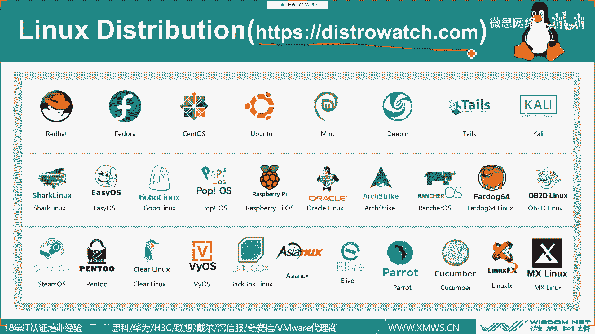

# 【红帽认证】Linux手把手安装教程 - P1：公开课_Linux介绍及安装 - 微思网络 - BV1p54y1p74G

好那我们就开始上课啊，那今天晚上这个课呢就是比较简单啊，一个小时教一下，跟大家讲一下什么是LINUX系统，以及呢会教大家怎么样去一个安装，那我相信今天晚上能来的同学呢。

应该就是对LINUX比较有有兴趣的，而且是零基础的同学对吧，那如果会的话，肯定也不会来听这么简单的课，那我们来开始讲一下什么是LINUX啊，那LINUX呢现在肯定很多人都听过。

说它是叫做类LINUX的一个操作系统，所以说我们想要了解LINUX的历史。

我们首先就要知道LINUX的一个历史，那我们首先来看一下啊，时间回到这个1958年，在当时在美国有一个公司叫做ATNT啊，中国中文的名字叫做美国电话电报公司啊，就相当于我们现在的中国电信和中国移动。

差不多这样的一个公司，不过在当时，他在美国是垄断了整个长途电话的业务，就是说我不进入计算机行业，然后我也不能不能卖任何跟it有关的产品，违反反垄断法就可以了，反正这个协议当时就这么签下来了。

然后呢到了1969年，这个ATND的子机构贝尔实验室，这个大家应该都知道，就发明了这个LINUX系统，所以呢他发明了LINUX系统以后，它的版权肯定是属于ATNT的对吧，所以他就不能卖。

于是呢ATNT就决定把这个unit系统给开源了，我们来看一下这个啊LINUX系统有什么这个特点，首先呢它是呃它有四个优点，一个是高可靠性，第二个是兼容性很好，第三个是高校，第四个呢是它的生态系统好。

我们来看一下啊，好高可靠性呢，其实就是因为LINUX这个系统呢它是模块化的设计，也就是说每个组件呢我们都是独立工作的，如果说某个组件出问题的话呢，他其实不会影响到其他的组件运行，也就是说整个系统的。

不会因为你这个模块不工作了，我整个系统就不工作了啊，这个是高可靠性，第二呢它是兼容性啊，LINUX系统呢它是当时一个很热门的高级设计语言，C语言写的，所以在当时，基本上所有开发人员都是会使用这个。

C语言的开发，所以大家都使用同一种语言，所以它的兼容性很好对吧，那怎么去理解这个呢，就比如说像咱们的学员也有来自湖四海的对吧，那大家如果都说方言的话，肯定就没有办法沟通，但是如果大家都说着普通话。

所以大家就可以进行一个愉快的沟通对吧，这是兼容性，第三是这个LINUX系统它很高效，这是因为它是首款多任务的一个操作系统，在当时的CPU呢处理任务都是叫做顺序执行的，也就是说每个任务呢按顺序排队执行。

假设我的第一个任务啊，我卡在这里很久，那后面的任务呢只能等他执行完以后，才能继续执行，那这样子的话呢就特别慢对吧，就好像我们去景区游玩，要排队买票对吧，如果前面呢只只有一个窗口。

那前面的第一个人买票又特别慢，那后面的人只能就这样子干，等着对吧，那这时候如果说景区在在隔壁多开两个窗口，那后面的排队游客，就可以转移到新的窗口去买票吧，这样子的效率就提升了是吧，充分的利用了这个资源。

最后一个是生态系统，就是它是因为开源的，刚刚说过，由于他跟1958年的时候签订了这个协议，他不能卖，所以他就免费公开了，所以大家拿到这个原版以后呢，就可以自己去改一改，去发布自己的版本啊。

大家都可以用一个免费的操作系统，所以呢它的生态环境就很好。

后面也诞生出了很多优秀的一个版本啊，好时间呢我们就再次跳跃到了1983年了，ATNT发布了首款商业LINUX操作系统，什么叫做商业LINUX操作系统呢，啊意思就是我要收钱了对吧。

但是呢我们刚刚说了580的时候，不是签订了这个协议，说不能卖吗，这是因为在1974年的时候，那ATND就可以不用遵守我们之间的约定了，拿到了82年就是法院判决他败诉了，那就所以到83年呢。

他就火急火燎了，就推出来了自己的商业系统，并且说好我要收费了，现在开始呢啊，我不把它开源了，我把它闭源，所有人要用的话，必须给我交钱，好可以看到D啊，隔年就是83年，他刚发布第4年啊。

就是4年就是1984年啊，民间组织就坐不住了，就是这个理查德斯托曼是一个程序员啊，然后呢他就发起了一个计划，叫做g n u project，GNU计划，那这个计划呢它只有一个目的。

就是让整个LINUX系统可以重新免费分发，那具体是怎么做呢，就是说你LINUX系统上面有的所有软件，我全部通通的用我自己的语言重新写一遍，但是写完以后呢，我就让他免费的让大家去使用，就是因为这个组织啊。

他认为LINUX你从开源到闭源啊，这样影响到了这个开放贡献的精神啊，这也是开源精神，那这个GU计划呢他做了很多事情啊，首先就是他发布了很多免费的软件，包括我们LINUX以后学习到了这个share bh。

这些软件全部都是这个GU计划写出来的，并且呢他们提出了一个协议，叫做开源协议，GPLGNU的公共许可证，那这个协议呢它是受到法律保护的，也就是说当你使用这个协议，协议协议发布软件的时候啊。

别别人也可以免费的，就是对你的这个软件进行修改，但是修改以后再次进行重发布的时候，也就是二次分发的时候，必须也把你修改的代码给它开源啊，这样子呢，这个开源的精神就被无限的传递下去了啊。

这就是GPL所规定的一个事情，当然配音学习其实也很多啊，像GPL这种是比较严格版权的，还有一种叫做宽松版权许可证啊，比如说BSB，像我们平时用的苹果的这个系统，它就是基于BSD的那BSD这个开源协议呢。

它是允许你二次分发的时候不用开源啊，所以说比如说你里面放了一些核心的代码，你不想让别人看到，那你就使用BSB这个协议来进行一个发布好，但是这个计划呢他确实写了很多很多软件啊，但是呢它没有内核是吧。

但他曾曾经是尝试要写出这个内核来，但是一直失败啊，那没有内核代表了什么呢，就好像你买一辆车的时候，有有轮胎，也有内饰，都弄得很好，有方向盘，但是呢他没有发动机，这就是没有内核的这个意思。

所以说他这辆车开不了对吧。

好时间就到了1991年了，这个芬兰的大学生林纳斯呢，他就发明出了这个LINUX，几位注意啊，这个是指内核啊，LINUX内核那就自己手写出来了，并且呢他就使用GPL这个许可证发布了。

那我们刚刚说到了，这个居然有组织刚好缺了什么，就是他没有内核对吧。

它有很多软件好，那这个LINUX的开发作的内核呢，内核相当于是跟计算机操作系统，硬件沟通的一个软件啊，就现在就好比还是那辆车，这时候呢有发动机了，但是没有方向盘，没有轮胎，也没有这个内饰。

所以这辆车也不行对吧，所以呢当这个LINUX把这个LINUX写出来以后。

并且以GPL发布，就相当于这个内核有了软件对吧，然后呢GNU这个组织也有了内核，他们两个就合在一起啊，就叫做JULINUX，所以说现在你想要完整的啊，严格意义上来说，你指LINUX操作系统。

你指的是GULINUX，而不是单独说LINUX，如果你单独说LINUX呢，其实它指代的是这个内核好吧，那GU的这个全称叫做GNUNLINUX，所以我们可以看得出来，就是GU这个组织。

其实是想跟LINUX划分关系的对吧，就是说我们跟GU不是一票人好，所以呢这个啊我们可以看到啊，这个LINUX这个吉祥物是一只企鹅，那GU的组织呢它是一头牛对吧。

所以呢就是他们两个合在一起，就变得很强大对吧，后面呢因为LINUX系统的开源，并且是以月为学习发布，就有很多很多的开发者去使用它，然后呢然后可以免费的二次分方嘛对吧，就创建出了很多各种各样的版本。

比如说我们这一我们主要就是讲了一个课程的，内容呢，讲的就是这个红帽。

我把它放成全屏哈，好比如说红帽的企业版本对吧，好REHAE啊，叫做H1龙好，还有红帽的之前的社区版本叫做fedora，然后呢，我们现在企业用的最多的一个LINUX系统CENTOS。

那渗透OS呢以前不是红帽了，不过现在已经是了，在2014年的时候呢，红帽把这个cent os给收编了，好还有我们很出名的一个LINUX的桌面发行版本，乌班图对吧，还有一个mint也是桌面发行版。

不过它是很清亮的好，下一个呢，DP呢是咱们国人自己开发出来的一个发行版，它是深度公司开发出来的啊，里面有很多，比如说像百度网盘啊，还有微信呢，全部都集成在里面了，就是他们针对国人的使用。

然后做了一些定制好下一个TALS啊，这个是这个斯诺登，就是这个棱镜计划的曝光者斯诺登，他所使用的一个操作系统，这个系统我也用过，它只能安装在U盘上，所以呢你看它的logo是不是一个U盘啊对吧。

然后呢U盘上面还有一把锁，然后这个系统在运行的时候呢，如果你把U盘拔出来，这个系统就没了，而且呢下一次你插U盘进去的时候呢，里面的所有东西都被清空掉，也就是说每一次打开这个系统。

你都是得到一个很干净的一个系统，而且在这个test里面你想要上网，那你走的全部都是洋葱路由，也就是说你走的这个网络流量啊，是不会被追踪到的，没有办法去跟踪你，所以说他是为了隐私而生的一个发行版，本。

好下一个卡利，那它是一个很出名的渗透测试的一个发行版啊，里面有很多很多的啊，比如说破解工具啊，或者是针对漏洞利用的一些工具啊，里面有很多，包括什么WIFI破解等等等等很多好好，第二行的话呢。

你看我们就其实我认识的就不多了，我只认识一个这个oracle linux，还有这个树莓派对吧，那其他的我基本上也没有怎么见过啊，啊可以看到他们的图标都挺可爱的，也就是说因为发行版太多了。

所以大家就发挥创意，就搞了很多很可爱的一个图标对吧，那我们来讲一下这个oracle linux呢，其实它就是基于什么，它就是基于红帽的，因为他给红帽公司交了一笔钱啊，这个订阅费。

所以呢他就其实呢是一模一样的，这两个系统，只不过那图标不太一样而已，然后奥利款拿了他的授权好，我们看第三行啊，steam os啊，没有看错啊，就是LINUX底下呢他专门出了一个发行版本。

让你在上面玩steam的游戏，那这个发行版本的特点就是在上面装显卡，非常的方便，因为玩游戏，玩这种单机游戏是肯定需要显卡的对吧，那在LINUX底下呢，其实装显卡的不是一件很容易的事情。

但是这个发行版本就把这个步骤给简化了，就是为了让你能够在LINUX上体验到steam，的一个游戏啊，好我们继续啊，好第三行的这边，这个v BIOS是一个很出名的一个，软路由的一个系统。

好好我们看到这个亚洲LINUX对吧，亚洲LINUX是中国和日本啊，一起合作开发的一个系统，它也是基于什么红帽的，它也是基于红帽这个版本，然后做了一些定制化的一个东西，好我们再来继续看我的鼠标呢。

好在这好，Parrot，这个叫做鹦鹉对吧，其实这个系统跟卡利呢他们是一家来的，也就是他也是一个渗透测试的一个发行版本啊，里面也有很多工具啊，稍微有一些不一样的，但是呢这样这个PO的这个系统会更好看一点。

我觉得好，下一个cucumber黄瓜LINUX对吧啊，这里是名字取得特别飘逸的啊，这个系统我当时没玩过，不过这个q com呢他目前还是社区，还是有人在维护的啊，最后一个MXLINUX，是目前啊。

社区投票出来最好用的桌面发行版本啊，仅是乌班图是仅次于他，乌班图仅次于他好，这些发行版本呢就介绍了差不多了，那其实我们看到我们输出这么多发行版本呢，其实他们最终啊我少说了一个东西啊。

就是说如果大家还想要了解更多的一个发行版，那么就可以访问这个网站啊，把这网站给记一下，我们可以直接访问这个网站呢，去这个看更多的发行版本。

比如说我现在我打开我的浏览器啊。

好打开浏览器，然后呢我们输入dio watch，那我们稍等一下，你这个网站呢。

因为在国外比较慢嘛，对吧好，我把这个调好了，那它上面就有很多发行版本可以看对吧，你看是没有排名对吧，是不是我说的MXLINUX目前目前是排在第一名对吧，那第二名他们JO也是一个啊，发行版本好。

乌班图现在排在了第六第五名啊，那说明他的排名是有所下降啊，好这个网站呢还有一个什么功能啊，比如说我现在想要下载渗透OS这个系统，我在这边搜索渗透OS，然后点击确定。

然后呢他就会跳转到这个渗透S的一个界面啊，比如说他会先介绍这个发行版是属于谁的是吧。

属于红帽的，对不对，然后呢他还告诉你这个发行版可以装什么桌面，比如说gal或者是KDE是吧，然后他的状态是什么啊，是活跃发展中的。

是不是，然后呢你想要下载这个镜像操作系统，你总要下载镜像安装对吧，它下面也提供了镜像下载站点可以看到吧，所以呢等等我们要安装的时候呢，我们就会从这里进行一个下载。

这个时候呢我们先不下了，我们就先继续往后看好。

刚刚说到我们说了这么多的一个发行版本，其实就是最主要基于两个，一个是红帽系的，另外一个是几遍系的啊，刚刚我们已经介绍了，红帽系呢就是有他的红帽企业版对吧，还有一个红帽的现在叫做后端版本。

然后呢渗透S叫做社区企业版对吧，C社区的意思，ENT是enterprise的缩写，也就是企业的意思叫做社区企业版，那红帽呢最主要的就是这三个，包括比如说还有oracle linux那些。

就是他卖给别人的一个相当于是图标，那DEBA呢它是一个社区维护的一个组织啊，它里面有很多系统，比如说我们很出名的乌班图，还有树莓派软路由，那其实呃如果说整个发行版来看的话呢。

大的发行版本的数量主要还是基底店比较多。

那红帽的话呢主要是商业会多一点，好我们来介绍一下红帽这个公司啊，红帽呢它是一个开源社区的领导者，也是这个全球最大的LINUX系统开源服务商，并且它也是开源社区的，最最主要的贡献者之一啊。

虽然这张图好像有点老了，现在是21年啊，不过我们可以看一下19年的时候，红帽的代码贡献量是多少，是8%，8%对应的这一个对吧，在19年的时候呢，第一名其实是什么，是英特尔。

所以说开源社区是有很多大厂在一起维护的，然后我们看底下的这个时间线，看到吧，汕头S在14年的时候加入到了红帽，然后呢去在前年啊，2019年的时候呢，蓝色巨人IBM去把红帽红帽给收购了。

所以呢红帽现在就越来越强了对吧。

那红帽呢，所以他因为他自己出了很多的系统对吧，而且呢它也在社区里面地位也很高，所以呢他就针对自己的自家的系统，推出了一个认证的体系啊，啊主要主要有三个，一个是IHCSA叫做红帽认证系统管理员。

那第二个是IHCE也是我们目前啊，比如说企业很多运维都会持有的一个证明啊，证书叫做红帽认证工程师，那最高级的叫做红帽认证的架构师，那IHCSARGC1呢，其实他们要考的话应该是同一天一起考掉。

早上考IHCSA考试时间是三个小时，那下午呢考二级C考试时间是四个小时好，那早上的考试如果没考过的话，你下午考过了，那你这个C1的证书是拿不到的，你拿C的证书是必须持有rh cs a的认证。

也就是说早上的考试你必须过好，那早上的考试考什么呢，主要是我们在这个C的课程里面有两节课，一个是IH124，I h234，那这两个课程，主要是讲一些红帽系统的一个基础管理，比如说怎么配磁盘啊。

怎么恢复系统等等啊，讲的一些原理的东西，然后当然肯定是有动手操作，因为红帽的考试呢他就是上机考试的，没有一道视频问题，全部都是上机动手的题目啊，好当你通过早上的考试以后呢。

下午的考试呢就叫做啊H294的课程，叫做N社保自动化，那考四个小时有15道题，你把这15道题全部都是自动化的任务，你把它做出来以后呢，你就拿到这个证书了，那这个是目前企业里面最多证书的一个。

有很多运维都会考这个证书啊，那如果你觉得爱丽丝你已经很熟练了，你还想挑战一下自己，那么这时候你可以挑战他的最高的认证啊，叫做RHDA架构师，那考CA的前提就是你首先是要C的吧，不然你就没资格参加。

然后呢ta里面有很多课程啊，好像十几20门课程，然后呢你自己在里面选择五门考试，并且通过就行了啊，五分是你自己任选的，然后呢考完以后你就拿到了这个ca的证书。

那你基本上在红帽在LINUX生涯就算是非常圆满了，也非常的强啊对吧。

红帽根据红帽官方的统计啊，就是财富500强里面，有90%的公司都在使用LINUX系统，只有不到7%啊，他的服务器还在使用windows，当然这个统计指的就是，他们提供了服务的服务器啊，那桌面的话呢。

其实windows还是占大头对吧，桌面的话windows确实是好用，这个咱们得承认是吧。

但是服务器领域的话，LINUX确实很强，好我们来看一下这个124的一些课程目录啊，主要就是啊说了刚刚也说了，是一些很基础的一个东西对吧，管理网络怎么样添加用户，怎么样删除用户，怎么样讲一些文件的权限。

然后怎么看日志对吧，那134的课程呢是啊就是一些提高了对吧，比如说这个管理逻辑卷，然后有些高级存储的功能，怎么样控制启动的过程啊，就是这些很简单的东西，然后呢最后呢294讲的就是自动化啊。

这个就是之后的正式课里面的内容啊。

那我们今天的理论的东西呢，我们就讲到这里了，我们就开始讲一下怎么来安装这个LINUX操作系统，好我们把这个关掉啊，如果需要这个PPT的话，大家可以加一下我们的这个客服的老师啊，稍等一下啊。

啊把这个线给它打开好。

然后呢我们继续啊。

好我们现在呢就开始做一个安装服务，我们需要有一个虚拟机的吧。

这个是我已经装好的，我们不管它好，虚拟机呢就是用来虚拟一台电脑的。

或者说一台服务器的，那我们首先新建一台空的一台设备，好文件点一下，然后点击新建虚拟机好，这里选择典型就可以了，我们点下一步，然后呢稍后安装操作系统啊，我们就暂时不用管这个镜像的问题。

因为我们现在还没下载，对不对，所以我们就稍后安装，我们先把这个硬件给创造出来，然后呢这里选择LINUX系统对吧，第二个版本呢按照我们需要装的版本，我们来选，那到底是要装七还是八呢，大家来决定好吧。

想要看C的就把七打在这个讨论区，想看八的就把八打在这个讨论区，然后哪一个多的话，我就装哪一个好吧，看大家想看什么我就装什么，嗯大家都是两个都想看吗，那我就以七为例吧，我先装一下T好吧。

如果咱们时间足够的话，我再把八给装一下，让我们装圣人位是七的64位好吧，然后我们下一步啊，学习机昵称就随便取一下就可以了，比如说呃我就test scent os7好，点击下一步好，磁盘的大小呢。

这里建议给到30G就可以了，因为我们等等用了最小化安装，而不是最大化，那我们就给个30G足够了，那下面这个单个或者多个的话呢，选哪个都可以啊，默认的话它是多个，那我得下一步。

这时候我们点击完成好，我们看到左侧呢，底下左侧这个底下就创建出来一台空的啊，一台机器，这个就相当于是一台电脑，但是这个电脑里面的整个系统都还没有装对吧，这时候我们首先先把它的内存啊，CPU先给调大一点。

我们点击编辑虚拟机设置，然后呢我们把内存比如说调到两句吧，现在给一句的话确实是有点过分了对吧，那处理器呢我们给他双核足够了，接下来呢可以看到啊，因为我们要安装系统，这个系统镜像文件其实就是光环的。

可读的英文件是ISO对吧，那我们现在呢就需要找到这个ISO，但是我们现在还没有对吧，我们先确定好，我们来讲一下这个DISCORE，过去呢我们要下载镜像对吧，假设我们现在要下的是圣龙S7对吧。

那我们现在就点这个镜像，下载站点的第二个对吧，miles就镜像的意思，我们点一下好，我们做，我们就跳转到了cs官方的一个镜像下载站，可以看到吧，SX点ORG就跳转到一个镜像列表的网站啊。

不过这网站可能会稍微有点慢，啊已经不是稍微有点慢了，是很慢了对吧，好刷出来以后呢对吧，这其实就是全球的一个镜像站点，好，那时候我们往下找，可以看到有china对吧，或者说我们找到最底下啊。

这个设置一下有点有点太底下了，很好，那算了，我们就看到china，我们就不找了，好看到china以后呢，这个就是咱们国内所提供的一个镜像站点对吧，比如说有阿里云的，有北京外国语大学的对吧。

那我个人很喜欢用，北京外国语大学的这个经销商，然后呢这边有两个mirror点，哪个都可以啊，我们往上翻一下就知道了，一个是HTTP的对吧，一个是HTPS的PHTPS就是加密的。

那我们通常来说这个加不加密也无所谓，我们就点这个HTTP就可以，那我们就找到外国语学校对吧，然后点击这个mirror htp的啊，我们点下去，唉，这时候呢我们就跳转到了这个。

北京外国语大学的开源软件镜像站了对吧，那他这底下呢就提供了很多的目录，那这里面其实就是版本对吧，比如说我们现在想下载七的，那七的话用的最多的是7。8的好，我们现在先不讲这个，我们先假设一下。

我们现在装8。3的，那我们就点下去，我们找到8。3这一个目录，我们点一下，那我们的镜像文件的后缀是点ISO对吧，所以说我们就要找到这个ISO目录，是不是在这里啊，那后面加个S就是复数形式对吧。

就是说这个里面的镜像不止一个的意思。

那我们就点下去，他就让我们选择什么架构对吧，那我们现在其实都X86614架构，所以我们点这个架构的目录进去，这里面呢就有很多的镜像了对吧，你看点S的是吧，那我们就可以把这个这个DVD1这个镜像。

把它下载到本地来，那它有多大呢，8。6G其实我已经下好了对吧，但是我们今天我们先不装八，我们先装七的好，所以说找这个镜像呢非常简单，大家要懂得怎么去找，而不要说啊，工作中如果遇到说哎。

我需要装一个装在7。8的，那你都不知道去哪里找，你只能去百度搜索，然后呢通过别人提供了百度网盘去给你，那这样子就不太对吧，而且呢这个镜像的安全也得不到保障。

好我们现在返回上一级目录啊，我们先返回返回再返回好，我们假设现在要装7。8的，那我们就找到7。8这一个目录对吧。

找到了，然后我们点进去以后，哎我们发现跟刚刚8。3的有点不太对是吧，8。3里面明明有很多目录，而且有点ISOS的目录，但是这个目录里面只有一个文件在read me对吧，没有其他的，那如果出现这种情况呢。

其实就表示说官方认为你就是官方建议啊，7。8这个系统你就不要再用了，因为我都已经更新到8。3了，所以你就一起升级到8。3比较好，07：30的话呢建议不要再使用了，但是这个只是官方说一说而已对吧。

咱们是不可能，因为很多业务系统的部署上去以后，不太可能经常会换，你不可能会升级对吧，而且为了兼容性呢，可能他的其他的系统也必须跟原有的系统，保持一个版本一致，所以呢大家我现在这是我这个服务器。

这个企业里面的服务器是7。8啊，那我基本上所有的服务器我都要装7。8，那如果这时候没有怎么办呢，其实他这里面有提示，他说read me对吧，我们就把它给下载下来好，我们把它下下来，好下完以后。

我们把它用以文本文件的形式把它打开，把它打开好，右键我把它打开方式改成这个记事本好，这样就打开了对吧，那移移开了，好好打开，里面里面有一句话，他说如果你知道你在做什么对吧，并且呢你确定要7。

8的这个系统，那么你就去访问什么呢，他给了一个网站对吧，他说去访问这个网址，然后获取他的软件安装包对吧，那我们就把这个网址给复制一下，把它给贴过来回抄对吧。

唉这时候呢来到了，就是这个也是官方的一个镜像站对吧，只不过这个支线站呢他不太维护了，所以呢我们就在里面找到我们想要的，比如说我们要7。8对吧，好，那我们找找到7。8了吧，让我们点击一下，好进去以后呢。

是不是熟悉的味道了，对吧好，我们找到这个IXOS在这吧，好我们点一下，啊这个网站会稍微有点慢哈，因为呢这个站点在海外，啊这个确实是慢的有点离谱了，我再啊进去了啊，刚说完就进去了。

那这个里面目录就只有一个X86614，那我们选架构了，那没得选对吧，我们只能选差了好进去以后呢，又是熟悉的味道了对吧，就有ISO的镜像文件了是吧，我们就把它给下载下载就可以了。

那在这个下载里面可以看到它有很多ISO对吧，有DVD的，有这个life goal的对吧，还有这个KDE的，那KD的BO其实就是桌面的版本，就是比如说我是用啊哪一种桌面啊，他们两个的长的样子不一样而已。

但是呢我建议在企业里面啊，大部分人都会选择安装这个minimum，就是最小化的安装，也就是说我这个系统装完以后，它只提供了最基本的功能，其他的那些多余的软件我一概不给你安装啊。

这也是为了一个安全的着想对吧，因为你越大的系统，那你输出到攻击面积越大，可以理解这个意思吧，如果说我的东西我的系统很小，很很精巧，那你能攻击我的点就很少对吧，所以说这是为了安全考虑。

就把这个系统装成最小化安装就可以了，其次就是如果说你装了一大堆没无关的软件，那突然哪一天某些软件被爆出有高危漏洞，恰巧你就装在你的系统上，那你是不是这个系统很容易就糟糕了对吧。

所以呢我们一般会选择装这个mini这个系统，那我们就把它给右键下载，或者是你把它这个链接复制到百度网盘，或者是训练里面进行下载就可以了，那么现在改完以后呢，好这个浏览器用不到了啊。

这个也用不到了，下载完以后呢，我们就可以通过这个DVD挂载着光环的镜像，给这个虚拟机进行一个安装操作，好，我来找一下我这个镜像在哪啊，在这个G盘的镜像文件里对吧好，那我们呢就双击这个光驱好，等它弹出来。

然后呢我们选择使用ISO镜像文件好，点下去以后浏览，浏览到我们刚刚的这个盘就行了，比如说我刚刚是盘的呃镜像文件对吧，那我们就找到刚刚的七，我们下载的是七对吧，7mini al最小化安装，点击打开。

那我们现在我我其实想给大家演示一下，这个八的安装，因为八的话它跟七的话稍微有一些不同，那我找一下八的吧，我找一下8。3的在哪，在虚拟机共享文件夹里面啊，好那在这个8。3我们就装8。3给大家看哈。

然后我们选择打开，确定好，这样子呢这个光盘也挂好了，现在只需要开机虚拟机就可以了，好我们点下去以后，好等它加载一下，哎可以看到这个加载界面已经出来了，那咱们就通过这个键盘来控制它就行了啊。

可以看到我基本上下是可以切换的对吧，那第一个呢就是说我直接安装这个SY，S8。0的系统，那第二个呢他说什么，他说先干嘛，测试这张MIA是媒体是吧，光盘媒介的意思对吧，也就是说我先检测看光盘的完整性。

检测完以后没问题了，我才进行安装啊，就这个意思，那其实检不检测那真无所谓对吧，那通常就直接安装了选水，选冰刃和资料进行安装。

好那我们就三个问题，因为这个光盘有8。3个G，所以加载的时候可能也会稍微有点点慢，如果虚拟机的配置给的高一点的话，那这个速度会快的很多，好可以看到他现在就在加载各种各样的东西，好了光标已经出现了。

好第一个映入我们眼帘的是什么呢，就是让你选择语言对吧，其实你可以选择中文的啊，一直往下翻就可以看到有中文对吧啊，中文还可以选择繁体中文或者是什么简体中文，但是呢如果说是你自己个人用于学习的话。

那么你你安装这一个简体中文是没问题的。

我也支持，但是呢如果你是装在企业里面啊，用作服务提供服务的一个操作系统的话，那记住一定要使用啊英文版，这样子呢不会出什么，比如说之后什么字符这些问题等等，一些很复杂很复杂，很难处理的事情。

所以呢默认就用这个英文版，而且呢咱们就是干运维的嘛，多少英文也会看一点对吧，所以呢我们直接用英文版的话，以后多看自然也就会了，好点击continue，我就继续，刚刚我应该给我的这个CPU分四核。

内存也分4G，这样子的安装会稍微快一点好，接下来我们到这个安装界面了，里面有很多选项对吧，眼花缭乱好，我们来看一下啊，首先有两个红色的，就是爆红色的，并且有一个感叹号的这个地方呢。

这个意味着你必须要点进去看确认才行的，也就是说我们现在先点这个红色进去，他这个是告诉什么说什么呢，就是说我们要把这个系统安装在哪里，可以看到它已经帮我选好了对吧，我们刚刚分享一块硬盘是30G的对吧。

那就他已经帮我选好了，如果说你这个系统有多个硬盘，那他这边旁边就会显示对吧好，那然后呢正常来说啊啊它是需要做一个分区的，但是呢我们默认就可以了，正常来说用默认的就是最好的，也不需要你自己去做一个分区。

不像6。0时代，你装这个系统以后呢，他还要需要进入一个分区的一个步骤啊，给往下分几个区啊，给home分几个区，给根分几个区，那比较复杂对吧，那我们直接点down就可以了，好点完以后呢，他检查一下啊。

没问题，他这个红字就消失了对吧好，接下来我们来看一下前面这个，第一个是选择键盘，那我们是应啊，英语的话，那就英文键盘就没有问题啊，第二个呢是安装语言是什么，就是我们本地的媒体对吧。

你看我们点下去以后呢啊，不仅可以选择这个光驱，还可以选择什么，可以从网络上进行一个下载，通过网络自动化一个安装啊，我们这个就不用管它，好语言我们也选好了对吧，接下来看什么软件选择对吧。

现在是什么server with jy对吧，也就是说我们现在装进去的，其实是图形化的一个界面，可以看到我们点下去以后，右边有什么各种各样的软件和工具对吧。

比如说你看有支持windows file server软件包，还有什么FTP是吧，还有什么是gus agent，是什么虚拟机的一个相当于是TOS一个工具啊，里面有很多很多，你可以自己选，那我刚刚也说了。

我们如果是给企业安装这个系统的话，那肯定是选择什么minimal install，就啥也不要，怎么什么都不选，直接用基础功能就可以了啊，不要说以为是服务器就点这个server。

这个点server的话里面也是GUYA的啊，所以呢也不方便，日后反正很麻烦，就是啊，所以我们去点minimal install就可以了，然后点击down好，选完以后呢啊这个开大码我们就不用管了。

它默认就行了，接下来呢选择这个时间和日期对吧，点下去好，我们看到这个我们的地区是吗，现在在美国我们是肯定要切到中国的对吧，所以呢这边地图直接点就可以了，可以看到这边是中国对吧，我们点下去好。

等下去完以后呢，刚好这个城市也选好了，是上海对吧，时区是对的，接下来呢我们设置一下我们的这个时间啊，比如说我们用24小时，那现在的时间是8。05分，那我们就把这个调到20。05分，那我建议大家呢。

如果说你装完这个服务器，你去你的企业里面没有NTP的服务器啊，没有这种寿司仪之类的设备，我建议你安装系统的时候，就把这个时间给设置好啊，不然的话，其实在里面设置时间是非常麻烦的一件事情。

所以把这个设置好了，然后呢我们就点击确定就可以了，好最后还有一个红色的，有两个红色的啊，第一个是让我们创建一个root密码，那在这个LINUX底下呢，每一个系统，它都有一个唯一的超级管理员的账号。

那这个账号的名字叫做root啊，叫做根对吧，那你就需要给它设置一个密码，因为你装完以后呢，你最终你先进去的时候，你就先进去好，那么就点进去设置一下密码，这个密码呢尽可能设置的长一点啊。

如果说比如说我只设置一个一的话，这样也其实也可以，但是它底下提示说你的密码太短了，如果你确定的话，你就按两次这个down对吧，那我们现在为了演示，我们就写两个一就好了啊，然后呢按两次啊。

这样子呢可以看到当你密码设置完以后，刚刚这个用户这边也是红色的对吧，它消失了，也就是说其实你可以不用创建用户，你只需要系统有一个唯一的用户就行了对吧，那唯一的用户是谁呢，就是root对吧。

所以呢你看begin store这个就变成蓝色了，我们也就意味着现在我们就可以开始安装了，那我们就点击begin install啊，这样子呢这个系统就开始安装了，那接下来我们做的就是等待就可以了。

啊最小化安装还有一个好处，就是它安装的时候会比较快，如果说你用GY安装的话呢，它里面的组件至少要安装个一两千个，那大一点的话，3000个也是有可能的，那最小安装的话，其它组件也就几百个啊等等。

也许我们可以看得到啊，可以看到现在就已经可以看到了吧，它的组件只有多少个，383个，非常的小，所以装的时候呢会非常的快，好那我们就稍等一下，如果有什么问题有提问的同学呢，就把它发到讨论区里好吧。

啊如果说大家在家里的网络觉得不好的话啊，需要这个镜像文件，或者是需要咱们这个虚拟机，咱们我现在这个虚拟机呢是15的破解版本，如果需要用虚拟机或者是需要镜像以及等等，咱们装完以后呢需要用到的插件啊。

来连接这个系统的这些工具，那你不知道在哪里下的话，你可以加一下我们的老师，加一下我们客服老师，然后呢找他要一下就可以了，包括今天的这个录屏也可以找他要一下，以及我的PPT都可以找他要。

啊别看他现在卡在这很久了，但实际上等等一货，你一瞬间就到最里面了，很快的，当大家自己在家装的时候呢，可以给这个虚拟机多分一点配置啊，比如说有条件的分个8G内存也可以对吧，然后分个八核CPU也没问题。

这样子的速度呢肯定比我快很多的，因为我的CPU其实不是很强啊。

我的CPU是I5的，I58代的稍微弱了一点点。

也是因为我这边已经开了两台虚拟机啊。

一台8。3，一台7。0的虚拟机啊，导致我这台安装的时候会比较慢一点，总算又动了一点点，啊我先把这两台关机吧，啊不然的话太占资源了，这台关机了，这台也关机了，卡住了啊，一关马上就跳到这来了，那就快了。

好装完了对吧，他就提示我们说要重启系统了，那我们点击重启系统就可以了，哎这样子的话，一个LINUX，一个主流的，一个企业的服务器的系统就被我们安装好了，对吧，然后他呢你还不在四秒钟。

它就进入到了这个八的系统里面去了。

好这就是我们的渗透S的一个登录界面，那我们刚刚说过了，这个操作系统里面唯一的一个最高权限，用户叫什么名字叫做root对吧，那我们输入root，然后输入你刚刚自己设置的密码，我这边是一对吧。

我们输入一回车好，我们就登录到这个系统里面去了对吧，可以看到已经登进去了，这时候呢第一件事是干嘛呢，我们首先先要关机，好的，我会说为什么我们关机怎么命令呢。

power of p o w e r o f f回车执行好，这样子呢，这个系统就马上一开机就被我关掉了。

对吧好诶，干什么事呢，我们右键这个虚拟机对它进行一个打一个快照，好拍摄快照快照什么意思呢，就是相当于你玩游戏的时候一个存档的点对吧，那我们就相当于装好这个系统以后呢，这个系统啥都还没有配。

我首先先给他来了一个存档啊，这个时候我就比如说叫做初始化安装，这底下描述呢，我建议大家把这些root密码写在上面啊，不然如果大家很久没做实验的话，可能就会忘记这个root密码。

那你就可能如果你不知道怎么做恢复的话，你就只能重新安装了，就比较麻烦，所以呢我一般会这样子写，会root一个斜杠一把这些密码写在上面，然后点击拍摄快照，给它做一个存档，这样子呢你下一次开机以后呢。

就从这个存档之后开始啊，做实验，你可以随便的对这个系统爱干啥干啥，反正呢你搞坏掉了没关系，再恢复成存档就可以了，对不对好。

那我们重新来啊，我们再次开启虚拟机，哎这个时候呢我们在里面做什么东西，我们都不用害怕了，因为呢我们有个存档，对不对。

好我们等他开机，怎么正式开机这么慢啊，进来了对吧，好进来以后我们是root，我的密码是一回车进来了，这时候呢啊我们看到这个小窗口啊，黑色的窗口啊，首先它不能复制粘贴，而且呢你看我把这屏幕放下来以后呢。

你按上键或者按下键的时候呢，它其实是不可以往上切的，你只要按住shift和这个page up down，才可以进行一个上下切换，比较麻烦对吧，而且这个字体呢稍微看起来比较小，那很不方便，你做实验对吧。

主要是不能复制粘贴啊，以后你自己学习的过程中，有很多实验需要复制粘贴的都做不了，所以呢我们需要用到一个终端软件叫做TSHELL，或者如果说大家有CRT也可以的，也支持去连接它。

但是他们IP地址是连接不了的，所以呢我们第一件事情，就是给大家分配一个IP地址，首先我们要确定一下我们的这个虚拟机啊，右键设置，我们要确认一个事情，我们确认的网卡是NAT模式就可以了。

可以看到我们的网络适配器是什么啊，NAT模式对吧，好确定以后呢，咱们就可以开始做事了，好怎么样把这个你的IP地址配钱呢，它是自动获取的啊，因为这个虚拟机它里面有一个DHCP服务器啊。

自动可以给你分配个地址啊，命令是什么呢，NMTUI好，回车以后呢，你就发现进入到了一个蓝色界面对吧，好进来以后呢，咱们只要选择第二个这个激活连接就可以了，我们回抽，然后呢。

把这个现在ENS33是我们的网卡名字啊，然后我们通过这个键盘的左右键，来控制这个光标，好，我们把它移到这个active上面，点击点一下，这时候呢把这张网卡激活，可以看到这个变成directive了对吧。

所以就证明这张网卡已经被激活了，好我们返回，然后再点击退出，这时候其实你的IP地址有了，怎么看，比例很简单啊，IP空格A回车哎，这时候就可以看到我们的IP地址分配到了吧，192。168。127。

135对吧，这是我们分配的地址好，这时候呢我们就可以用我们的插线来连接了，我们打开插插线啊，如果大家同啊想要这个插线的软件的话，可以加一下我们客服老师可以去找他要一下啊，啊这时候呢我们点击新建。

在主机里面填上ACC地址就行了对吧，192。168。12，7。135是我地址对吧，然后这边我可以把名字改掉，比如说要测试啊，SA2S8。3对吧，然后点击确定它就会出现在这个底下。

然后我们再双击对它进行一个连接好，他就说要验证主机密钥了对吧，我们得接受并保存好，输入用户名root密码是一好，这个时候我们就登上来了对吧，好枪械的好处就是你可以把它随时放大，缩小对吧。

字体的话可以看得很清楚，而且呢还可以对它进行一个，比如说复制粘贴对吧，就非常的方便是吧，非常方便好，进来以后呢，我们也有IP地址啊，我建议大家还要做两件事情，首先就是把防火墙给关了。

因为之后的很多实验的话，防火墙不关的话做不了，而且呢恰好大家可能在做实验的时候，就会忘记这件事情，所以说直接把它关掉就行了，好命令很简单啊，system啊，system CD l就是系统控制的命令啊。

意思啊，control对吧，好stop停止，王宝强叫什么firewall对吧，FIREWALL后面跟着B啊，就是把它的进程给停止掉，好停止掉以后呢，只是他现在没有在系统里面运行了。

但是呢他下一次开机的时候，它还会自己启动，对吧好，这时候所以我们要把它字体都给关掉，system c t l disab啊，就是不允许的意思啊，啊FIREWORD回上啊，这时候整个防火墙就被你关掉了。

我们可以查看一下它的状态啊，system c t l status查看状态，FIREWOR回城好，可以看到现在是什么dead对吧，没有起来对吧，然后呢，disable也表示他说这个下一次不会自启动了啊。

就这么个意思好，除此之外呢，我们还需要改一个配置文件，叫做SLINUX，这个也是必须要改的，否则嗯在你自己学习的过程当中，假设你在网上看了一篇文章啊，教你某某怎么装那个软件，怎么启动。

你就会发现这个软件怎么起都起不来，按照他的教程绝对做不到啊，这是因为这个系统里面内置的一种，安全的模式啊，叫做SLINUX，那我们先不管它是什么对吧，我们第一节课不可能讲那么多东西。

我们要做的就是我们把它关掉，我们用vi命令去啊，然后跟上它的配置文件，E d c s e linux configure，好，回收好，我们找到这个INFORCING，看到了吗。

然后呢把它改成disable就行了，好我们复制上面的右键复制对吧，然后我们把这个官号移动到底下，按I键编辑，把它删除掉，然后呢再粘贴就好了啊，这就差写了哪一个好处，然后呢按下现在底下是不是有个银色的。

就表示我们现在插入模式中，我们输出的任何东西就会变成文本，所以我们按ESC键把它给关掉，ESC按下它就没了，对不对，好，这时候按住shift加上两个Z就保存退出了，非常方便好，把关完以后呢。

第一件事是什么，肯定就是power off关机，把它重新做一个啊存档对吧，把它关机好，关机就断开连接了。

那我们这边其实也能看得到，它已经被我们关掉了，好这个时候我们再右键快照拍摄好，这时候我们就可以取出哎，比如说是IP地址是什么呢，是192。168点，或者说我们说叫什么玉玉配置对吧，玉佩。

然后呢在描述里面写上我们的IP地址，IP是192。168。127。135，然后防火墙关对吧，防火墙关闭S1LINUX关闭好拍一个快照好，拍完以后呢，我们还可以看一下它的管理器对吧，快照管理器啊。

我们就知道哎我们现在处于哪个位置，我们处于的是这个玉佩的底下对吧，那我们如果随时想要还原的话，我们如果说刚开始学，我们想把这个步骤多多练习几遍的话，我们就可以先还原到初始化状态。

然后呢再进行自己能做到这个预配置，把这个命令给敲头练来，就这样子一个学习的一个过程好。

那今天的课程呢也差不多啊，刚好讲了一个小时，算的时间刚刚好差不多就结束了。

那如果有什么疑问的同学可以提问，然后呢需要PPT或者是需要软件的话，可以找我们的客服老师要一下。