# Linux入门与红帽认证：P1：课前说明 📚

在本节课中，我们将学习课程的基本要求、红帽认证体系介绍以及Linux系统的初步认识。课程旨在为初学者打下坚实基础，确保后续学习顺利进行。

---

## 课程要求与学习方法 ✍️

为了确保学习效果，请大家遵守以下几点要求。

### 空杯心态
无论之前是否有基础，请以从零开始的心态学习。Linux课程建立在计算机基础知识、硬件知识等之上。如果遇到不懂的概念，请课后主动补充相关知识。

### 保证出勤
请尽量每周按时上课。学习一旦中断，很难找回状态，可能导致学习周期延长。坚持跟完全程是最高效的学习方式。

### 课堂笔记
所有学员必须准备课堂笔记，可以选择电子版或纸质版。我会在课堂上留出时间供大家记录，并会不定期抽查笔记。

### 课后作业
课后作业对巩固知识至关重要。是否完成作业取决于个人，但不做作业将难以跟上进度。建议按时提交作业，以便我和助教老师及时批改反馈。

### 实名信息
请在所有学习平台（如腾讯课堂、Webex、微信、QQ）使用实名。这有助于师生间相互认识，未来在职业圈中也能相互帮助。

---

## 红帽认证体系介绍 🎯

上一节我们明确了学习要求，本节中我们来看看红帽认证的具体构成。

红帽认证是一个金字塔形的体系，主要包括以下三个级别：

1.  **红帽认证系统管理员**
    *   简称 **RHCSA**。
    *   这是初级认证，包含`RH124`和`RH134`两本教材。
    *   主要学习用户权限管理、基本命令操作、网络配置、磁盘管理和故障排除等基础内容。

2.  **红帽认证工程师**
    *   简称 **RHCE**。
    *   这是中级认证，红帽8版本的对应课程为`RH294`。
    *   核心学习内容是 **Ansible自动化运维**。考试形式是在一台控制机上使用Ansible管理多台受控机。

3.  **红帽认证架构师**
    *   简称 **RHCA**。
    *   这是高级认证，由多门课程组成。
    *   需通过其中任意五门考试即可获得证书。每通过一门都会获得一个专项证书。

**关于考试的重要说明：**
*   RHCSA和RHCE考试均为实操，满分300分，210分通过。
*   报考RHCE通常需要同时通过RHCSA和RHCE两门考试。
*   RHCE证书有效期为三年。若过期，只需重考RHCE即可续期，RHCA证书则永久有效。

---

## 为什么学习Linux？ 💻

了解了认证体系后，我们来看看学习Linux系统的价值和前景。

Linux是一个操作系统，位于计算机硬件与应用程序之间。作为系统工程师，掌握Linux至关重要。

以下是Linux广泛应用的一些领域：
*   **服务器领域**：绝大多数企业服务器都运行Linux系统。
*   **云计算与大数据**：主流的云计算平台和大数据框架都构建在Linux之上。
*   **嵌入式与物联网**：网络设备、防火墙等很多嵌入式设备采用定制化的Linux系统。
*   **国产化趋势**：在信息技术应用创新产业中，国产操作系统多以Linux为基础。

Linux正在变得更加易用，图形界面的发展降低了入门门槛。但命令行操作仍是高效运维的核心技能。早学习、早掌握，将为你的职业发展带来显著优势。

你可以通过专业网站查询大型互联网公司的技术栈，会发现其底层服务器几乎都运行着Linux系统。

---

## 实验环境准备 🛠️

理论介绍完毕，接下来我们开始准备实践环境。本节课的剩余任务是安装Linux系统。

我们需要准备以下两个软件：

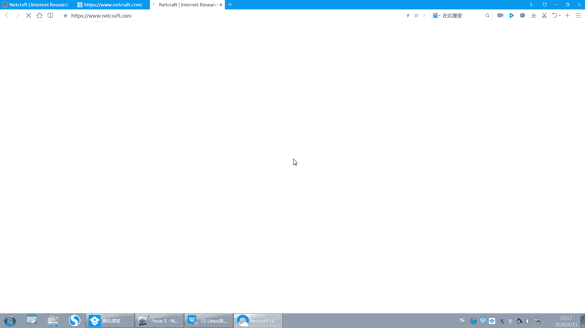

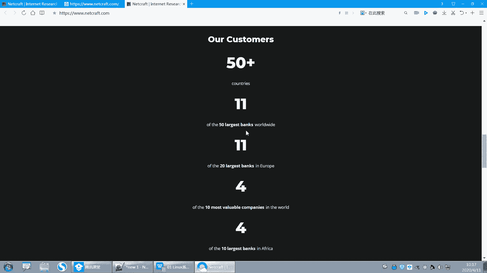

1.  **虚拟机软件**
    *   推荐使用 **VMware Workstation**（15版本为佳），也可使用开源的 **VirtualBox**。
    *   该软件用于在你的电脑上创建虚拟的计算机，以便安装Linux系统而不影响原有系统。

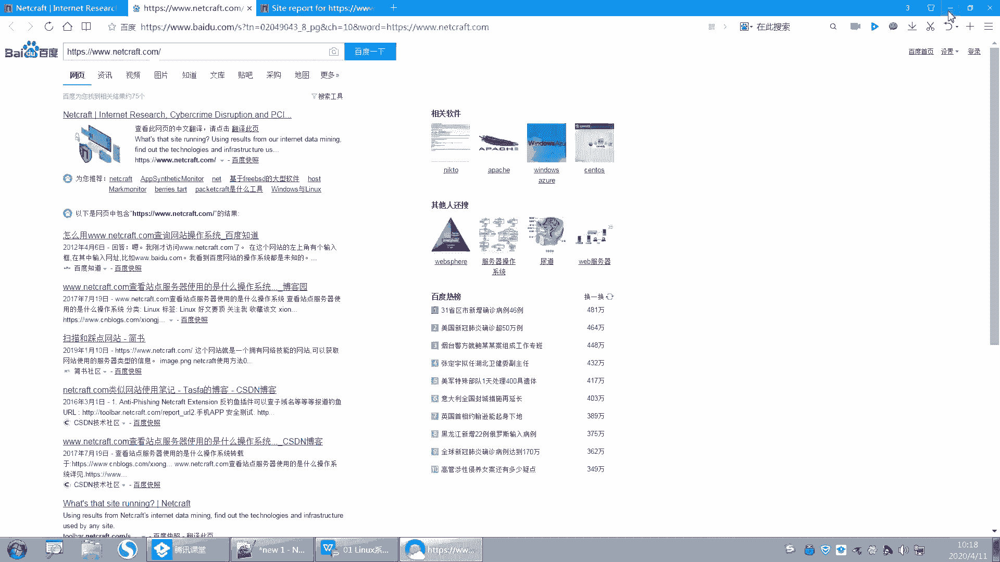

2.  **系统镜像文件**
    *   即红帽企业Linux 8.0的安装光盘镜像文件（ISO格式），大小约6.9GB。
    *   该文件将作为虚拟机的“安装光盘”。

常见的系统安装方式有光盘安装、U盘安装和网络安装。今天我们将在虚拟机中使用光盘镜像文件进行安装。

请大家在休息时间检查是否已下载好上述软件和系统镜像。稍后我们将一起进行系统安装步骤。

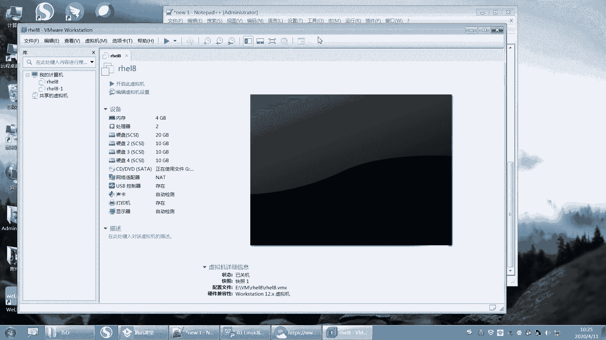

---

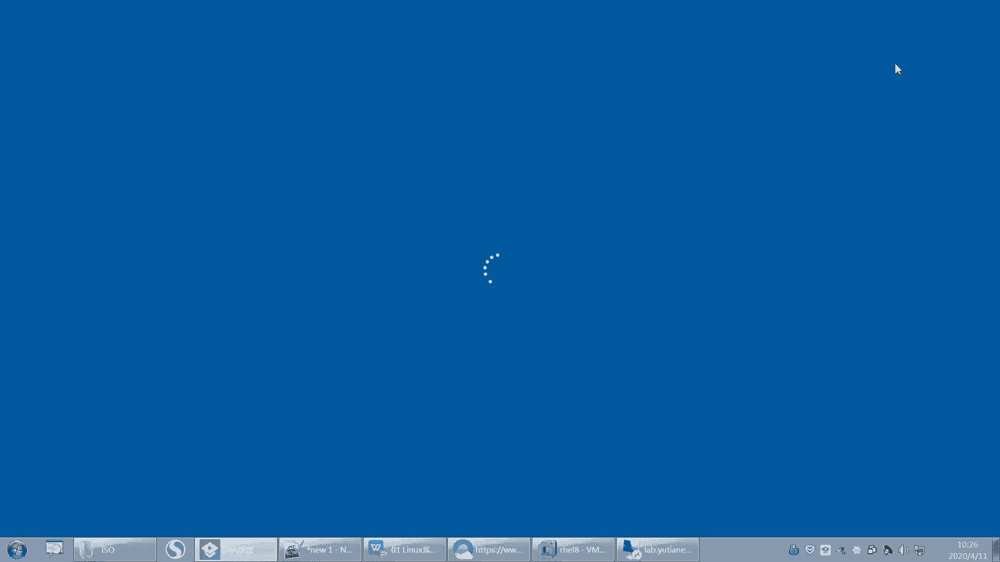

## 总结 📝

本节课中我们一起学习了：
1.  课程的学习纪律和要求，强调空杯心态、出勤、笔记和作业的重要性。
2.  红帽认证（RHCSA、RHCE、RHCA）的体系结构、学习内容和考试相关说明。
3.  Linux操作系统的重要性和广泛应用领域。
4.  搭建实验环境所需的软件工具，为后续动手实践做好准备。

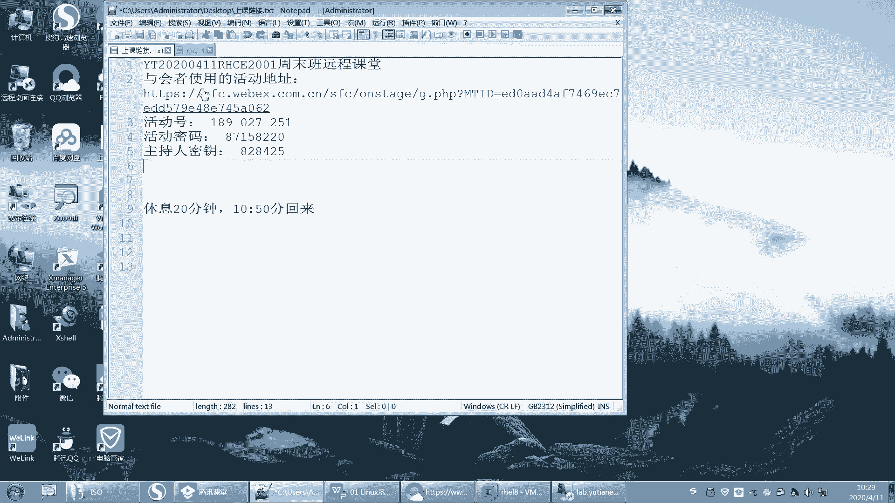

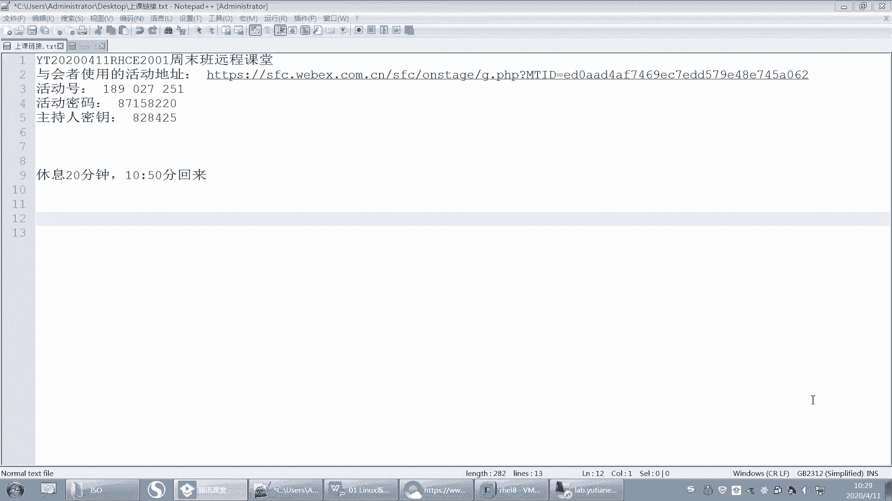

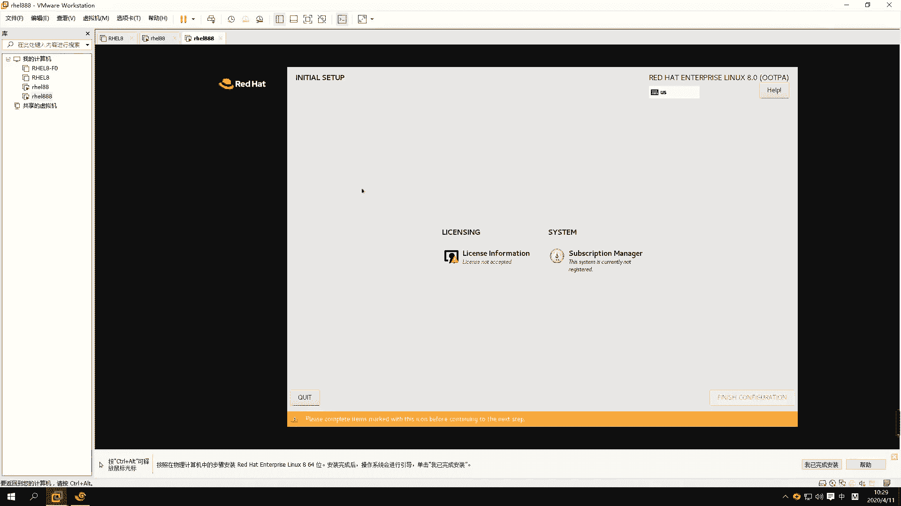

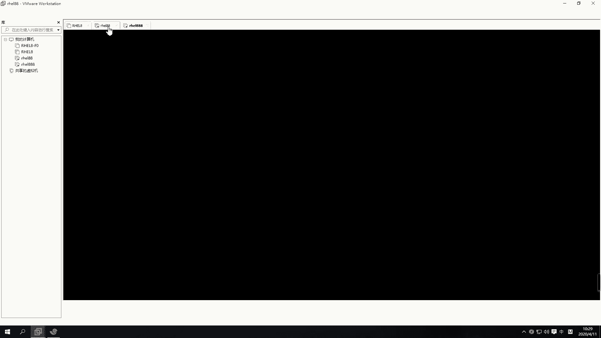

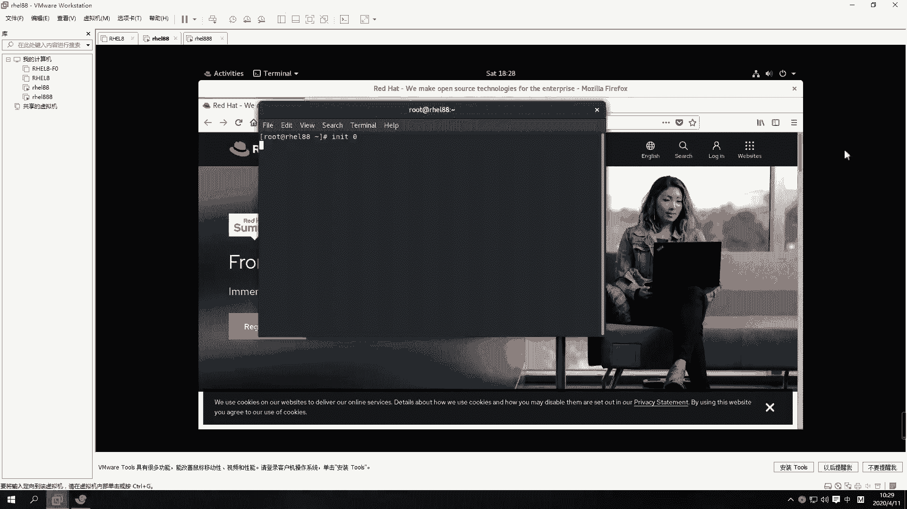

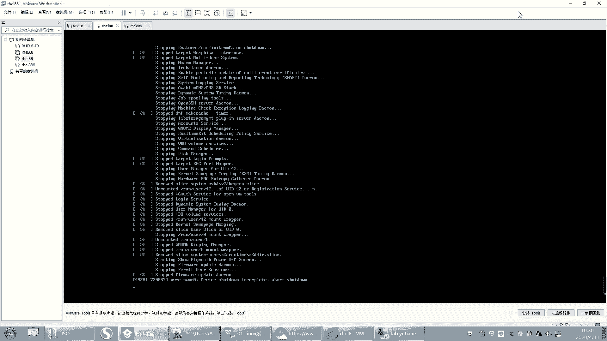

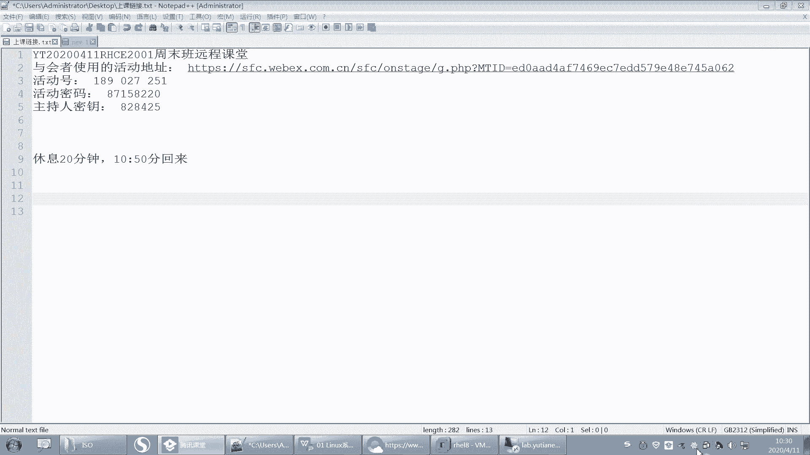

请大家按照要求准备好学习环境，我们下节课将正式开始Linux世界的探索。