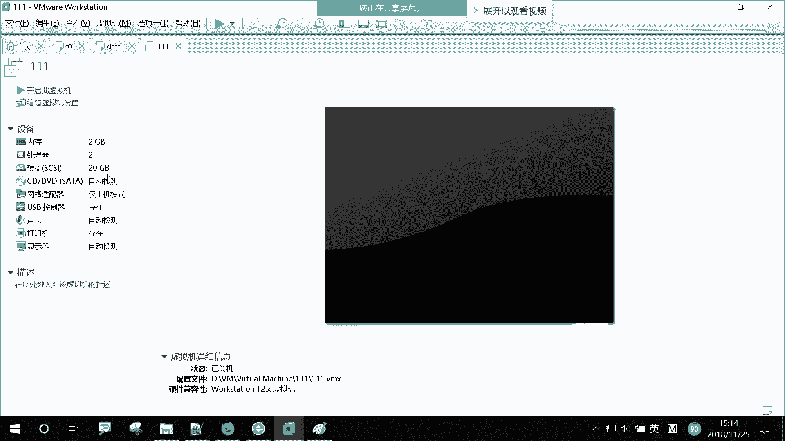
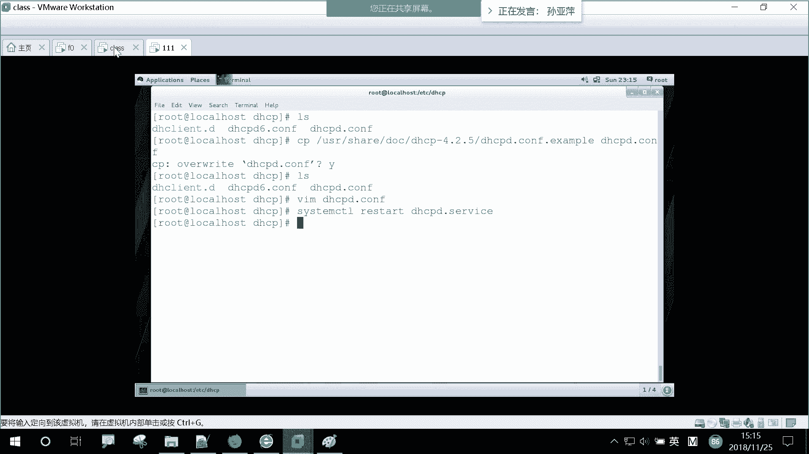
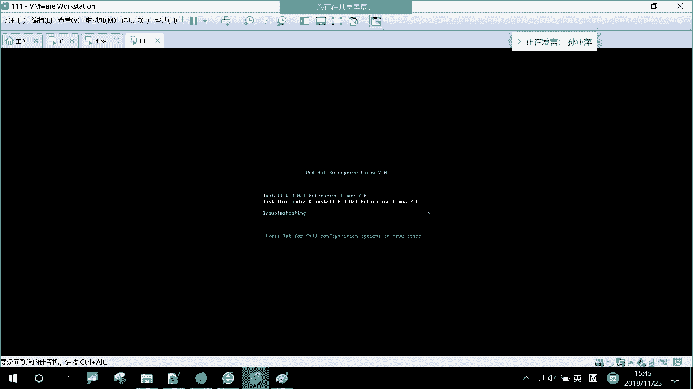

# 【誉天孙老师主讲】Linux入门课程／Linux视频教程／Linux运维／红帽认证／RHCSA／RHCE／ - P1：kickstart自动化安装脚本和DHCP搭建 - 誉天孙老师 - BV1ch411Q7hR

第14章主要是我们的一个虚拟化，还有一个自动安装部署，对自动安装部署。我们先来讲后面这个啊要自动安装。对，自动安装。现在这个大家应该都体验过，但是远程同学可能没有体验过啊。

本地的同学如果用过物理我们的物理机，当时让你们装系统的时候，对吧？你们我说你们重装系统，但是让你们重装系统一个个点。那这样的话。😡，跟平常装修的没什么区别，对吧？那么我们让你在那选说你可以再选F1呃。

进入到那个那个选择那个菜单里面，对吧？呃，NFF8F12，然后进去呢可以选那个菜单。比如说你是安装一个呃什么虚拟机，安装一个呃红帽企业版的虚拟机呢，还是什么F0F1F2这样子，对吧？那么你我说按顺序。

12345这样，你这样每次一选选完之后。他是不是自动就安装好了呀？😡，对吧对，这这个自动就安装好了，你可以吃个饭，上个厕所回来就已经安装好了，对，就已经安装好了。那么这个过程叫自动化部署。对。

自动化安装。那我们今天呢就来学这个自动化安装是如何实现的啊，是如何实现的。我们要把整个这一套搭下来啊，对，包括我们电器CP服务器，还有我们的TFTP还有虚拟机呃自动化部署这一套。我们今天下午的任务啊。

嗯，嗯在你的加目录下面在你的加目录下面啊，大家经常会看到一个叫ANA什么con什么con就怎么读吧，这个文件对吧？就看到一个这个文件啊，大家觉得好像是他没什么用吧，平时反正放在那儿也没管他。

有些人甚至不是看着不爽，你烦了再说，对吧？对，这个文件大家不知道怎没有打开看过啊。我们来打开看一下他到底是干什么的。拿来看一下啊。你每安装好一个操系统，它都会在你的加目录下面有1个ANA什么这个文件对。

就会有一个这样的文件。这个文件记录了什么东西呢？记录了你在安装操作系统的过程中。的那那些设置，那些配置。比如说啊你选的语言是什么？你是英文呢还是中文呢？你选的安装句子，安装路径是哪里呀？

你root有没有设命码呀？root有没有呃有没有创建一个普通用户啊，你的分区是什么样子的呀？😡，你分居格式画什么样类型呢？😡，选择什么样的包安装啊等等。没声音吗？嗯，那个。嗯。他都会帮你记录下来啊。

甚至大家有没有就是看到我们的物理机自动化安装之后，它的IP地址，它的一些设置什么什么样仓库啊，是不是都给你配好了呀？对吧它都会记录在这个文件当中。对，这个文件就是在你安装好操系统的时候。

它是设有有哪些配置，有哪些设置。我们来阅读一下这个里面到底写了什么东西啊。好，我们从头看一看啊。这边有注释行，对吧？对，注释行注释行就是表示一个说明嘛。呃，我们是虹贸RHAL7，然后它是这个sstem。

我们的系统一个认证的信息，你看啊。他说是否要开启这个认证啊，对吧？对，就是我们shadow就是密码的一个认证。他用的加密方法是什么呀？是不是下5要2啊，对，就是下5要2啊啊，下面这个是reboot。

在安装完之后怎么样啊，重启吗？对你们在装操系统的时候，最后一步是不是有一个重启的步骤啊，就reboot右下角是不是点一下reboot，对吧？对，这个地方就是那个按钮，就是说你装完操系统之后给你重启一下。

对，重启一下啊，就reboot reboot。好，下面这个地方这里啊叫我们的一个安装员。对，是一个安装员啊。呃，我们在用光盘安装的时候，它应该是本地的一个光盘，对吧？指向的是本地光盘。

如果你是比如说网络安装，对吧？你的光你的那个安装员在网络当中，那这个地方可能就会写HTB什么172。25。254264什么IHE2什么之类的对吧？对它就会去写这样一个安装源啊，安装员。好。

这个地方这个地方。叫fllwork configuration，对吧？代表什么呀？😡，fairwork enabled吧。😡，是不是非work开启了呀，对吧？对我们这个防火墙它是开启了。😡。

但是它什么呀？只放行了一个服务叫SSH对，就放行了一个服务叫SSH。所以你这个servver这个安装好之后，我是不是就可以S去登录它呀，对吧？是因为它放行了这个服务啊，放行了这个服务。好，这个没问题啊。

然后first boot对，first boot disable，这个是什么东西呢？对，这个就是不知道大家就是安装的时候有没有注意到啊，它有一个安装完之后，就是你把所有的包那个地方进度条是不是跑完了啊。

跑完之后，后面是不是有专家设置Kcom可当吧。啊，有一个Kd那个那个那个那个过程吧，是不是设置那Kd，我说那个是多少兆，那个是用来就是内核崩溃的时候用的吧。😡，那个，我给你看一下啊。

我们有一个命令叫first boot。这应该有印象吧。有没有印象？这是不是你装完包之后，后面还问你是否要开启K档目啊？对吧你是否要开启开down啊？然后你说是的，你要开的话，你就在这里呃自动把开启。

对吧？你要不开，是不是把它取消掉，对吧？然后下一步。后面是不问你要不要订阅嘛？😡，对吧对，要不要购买他的服务？你说你要注册的话，就是前提你要就是买了他的服务。然后这个地方你写yes，我要注册。

那后面就让你输入什么序列号什么之类的那你不我们一般选不注册，对吧？因为没有购买。😡，也没有购买服务好，然后再finish完成，他就退出来了。所以这个地方是什么意思呢？😡，就是把关了呀。我不要这个过程吧。

是不是这意思？对我把它关掉。因为我安装的时候，我还要自己选嘛，我不想自己选，我不想选那个什么Kdown什么那个东西，那我就把它关了。对，就把杠杠diableable关掉了啊。😡，啊。

这个是exor什么什么什么呃disk是用这个U呃用这个VDA这个盘啊，用VDA这个盘。哦，这个呢看这里啊，这个是什么呀？这是什么？😡，不键盘布局啊，keyboard是什么键盘吧，对。

键盘布局用的是我们的美式键盘，对，用的是我们的美式键盘。这个其实是不是在我安装操系统的时候选的呀，对吧？那右上角那个地方啊有右上角。啊，这个是不是语言，这个我就不多说了吧。哎，语言是英语啊，对。

系统语言是英语英语。如果你选中文，这个可能是什么Z跟啊什么之类的。好。看这里啊，网络信息network。他设置的你的网络信息是由什么获取的呀？😡，哎，电HCP获取的啊电HCP获取的你的你的这个啊。😡。

叫 systemystem network。然后script。你是不是电GCB获取啊？😡，对，就是设置这个地方啊，就是你这个将来你这个迅集装好之后，呃，由DHCP给你分配地址。对。

由DHCP给你分配地址啊，所以就是。就是他对，就是。呃，在哪里？在这里对吧？好，然后呢他又给他设置了一个主机名叫什么local hostlocal domain对吧？网络上面设置一个主机名哦，看这里。

它什么root password对，是加密吗？就你的密码加密吗？如果不加密，它就是明文的对，就是明文的啊，对，它是加密码，加密对吧？好，这里有个S inlink。s links我们还没有学。呃。

其实默认我们操系统s links是我们内核的一个功能啊，就是默认它都是开启的对，默认都是开启的。这个地方呢杠杠infor enforcing这个是代表开启的意思。对我们下周会讲s mix。对。

下周一来就来讲s links啊，这个代表它是一个安全机制，就类似于防火墙一样，对它跟防火墙供能功能功能可能有点不太一样。对，都是那个关于我们的安全方面的啊，就是否要开启啊，对，要开启，对吧？对，要开启。

啊，下面是什么呀？service就是我们服务，就是你是不是要关掉K dump啊，对吧？对，把这个服务关掉，然后把这个服务关掉，把哪些服务起起来呀，是把这个服务起起来，把网络服务起起来。

把SSD什么起起来，把它起来，把它起来，是把它这些都起起来呀。唉，这个这个应该可以看懂吧。😡，对，这个可以看懂啊。哦，往下这是什么呀？😡，是不是时区啊？对time重啊，时区时区你看他这地方是美国时间。

没有改。纽约时间转吧？啊，看这里啊。这个叫putloader configuration吧。这么是吗？foot loader aend，这是什么东西啊？😡，这是什么东西？就看这。😡，这叫什么呀？😡。

就不是说这个东西叫什么，而是说这后面这写的这些这些应该叫叫内核参数啊，就叫内核参数。叫b loader启动过程中，我们向那个内核是pre的一个参数啊。对，叫内核在这是在这里啊，在这里。😡。

我们应该是在哪个地方设置内核参数啊？还记得吗？是不是在这里啊？你内核参数是不是在这里啊？😡，是在这里吧，对你把它内核内核参数，然后写在这个位置，对，写在这个位置，然后加到后面，然后重新生成一下。😡。

那个哪个啊？是bo。Grow up。graup two对吧，g up。点CFG是不是重新生成一下它呀？这个下面重新生成一下，它那个内核参数就会在这里啊，因为你启动过程中读的是这个读的是这个文件啊。

读的是这个文件，只不过这个文件是由什么ETC default on grab，还有ETC什么de点下面那些文件生成的对吧？对，你看是不都在这里对，这叫内核参数啊，你想向它传递一些内核参数。

你可以其实这个文件也可以编辑，对吧？但是如果你重新执行了gra to make confi是不是就被覆盖了呀？所以最好是在ETC default那个里面去配置，可以理解吗？好。

这个我们之前都做过这个实验的啊。哦，我们再来看它再来看它。这个就是一个传递了一个。呃。传递了一个内核参数啊，有TTY0就是consl口嘛，对吧？是不是可以conl进去，是不是可以consl进去啊。

它这边是不是追加了一个呀？对吧是不是追加了一个对，在那个基础之上又追加了这个这个呃内核参数啊。然后刚刚location就是我们磁盘的类型。

应该是MBR格式的对MBR格式的time out呢是不是也是一个呃time out是什么，是不是倒计时啊？对吧就是那个你就进入那个菜单的时候，倒计时一秒，对倒计时一秒就进去了。

然后它的启动driver是我们的启动盘，是VDA，也是我们的启动盘啊，启动盘。啊，他说这个地方是否要清空这个mussterMBR对吧？对。

musster boot record就是我们的MBR对MBR是不是要清空它呀？对，要清空，重新重新生成这个MBR啊。对，重新生成要清空吗？要清空，是否清除所有的分区啊？

因为你这个盘是不是有可能之前已经被分过了呀？对吧之前可能上面有分区啊，有MBR啊都有。那那我就把它全部清空。对，全部清空。然后重新呃把这些分区也全全部清空啊，分区也全部清空。好。这个就是什么呀？

这个就是我们的分区信息。对，分区信息它分了一个区，是根分区，对吧？它类型是叉24，然后是在VDA上面分的对吧？大小大概是。6个G对吧？对，6个G左右啊哦，再往下看，我们看这边啊。再往下看。

就是下面这些什么百分号post，这些都叫安装后脚本。对，什么叫安装后脚本呢？就是你把操作系统装好之后，你是不是有可能会有一些需求？比如说啊你装好操作系统，哎，你的项目仓不赔好了，是不是你的服务器起来了。

你某些包已经装了，是不是在你。😡，在你安装好操系统的时候。给他做一些操作啊，就是你不想怎么样，不想就是呃如果你有很多台，那你虽然自动化部署了，但是后面有一些后续的工作，比如说要配M仓库，配网络。

配一些什么乱七八糟东西。那你是不是可以写在这个装安装后脚本里面，就是装好操系统，它一并帮你把这些都执行了。对，一并帮你把这些都执行了啊，就可以理解吗？😡，嗯好。这好多啊，它设置了好多内容，你看。哦。

这个到end啊，就百分号post到百分号end中间的内容都叫安装后脚本。对，哎有安装后脚本啊好，你看啊这地方。百分号package。代表的是。安装完超系统之后。把这些包一并帮我装了。对，一并帮我装了啊。

叫百分号pack到百分号ad结束。看这里啊。

是不是到号I的结算？对吧那中间这些内容呢。都是我们安装后之后，把这些包全部给我装好，把这些包全部给我装好啊。好，那那现在我们要写这个文件来。

啊。来从头到尾写一遍。我看都费劲去，还别说写了。😡，啊，可以吗？那么就要写这个文件了。利息是吧。CP1个是吧，已经写好了，那。对，我们有工具来实现啊。对我们有一个工具是专门用来写这个。哦。

这个名字应该叫kickstar。对，叫kickstar，用kickstar来实现一个自动化的安装。对，用kickstar来实现一个自动化的安装。然后你安装完之后，用kickstar。

它就会生成一个叫加目录下面生成1个NNA什么con这个KS点CFG的它的一个文件。对我们用哪个工具呢？

我们用这个工具叫sstem呃 confi kickickstar对kickstar这个工具呢现在它是没有的。就是你看啊他现在没有这个命运，对吧？😡，对我们需要把这个包装一下，需要把这个包装一下啊。

刚 installstore。把这个包装一下啊。你们以后如果再出现亚么仓库不能用的问题，你就这样啊，把那个。把你的class room重启一下，好吧。and classroomroom重启一下啊。

因为你的安装员在classroom上面，因为你的仓库，你的仓库指向的是classroom。对，所以classroom上面呃有一些那个没挂载上去，所以它安装员出问题了，你们直接就把它重启一下。

最简单暴力的方法。啊，我在这边安装好了啊，安装好了，然后这个命令就有了。就是它叫system systemtem啊，它是一个图形化的工具。对，一般以什么systems confi什么开头的。

都是一些图形化的工具。图形化的工具。它这个工具跟这个包的名字是一样的对，就叫system confi kickstar kickstar。好，我来打开啊。看这里啊，你看kickstar的配置。

kickstar的配置。我们一个个来看一个来看。这个地方第一个让你选默认语言，对吧？对，默认语言，我们是选中文呢，还是选英文呢，还是选什么之类对吧？我们就默认选这个英文啊，选英文。他的一个呃语言啊。啊。

键盘是不是美式键盘啊，你们就默认。默认啊对，默认一下这个基本，不要让你选啊，你选完之后，你说不定NA它出来个B是吧，对。😡，对你出了摁都不是你想要的。好，下面这个地方选什么呀？哎。

选时区这个地方你得往下找，它在到下面了。等一下哦。我觉得这个地方我没找到什么简单的方法，能够快速的去找到asia、上海。嗯，在在这里对吧？对，在这里啊，叫呃叫什么亚洲、上海对吧？as选上海啊。好。

这地方人问你要不要选UTC时间呢，对吧？大家知道UTC时间叫什么时间呀？UTC时间叫世界统一协调时间，对吧？对是世界统一协调时间啊。这个时间是不是就是我们的那个叫什么格林威治的时间，对吧？😡，啊。

1970年1月1号。要中毒了吧。😡，哎，这这。这个是UTC时间啊。跟我说的不是一个事儿。啊，这个。UTC时间啊叫世界统一协调时间。这个时间我其实跟大家已经说过，强调时间的重要性，对吧？

如果你你的公司是一个跨国公司，对你的公司可能有一台在美国或者在什么呃印度，对吧？在非洲。那你跟他时间时区是不是一样啊？如果大家都用本地时间的话，那你跟他向他发个消息，他是不是你们两个时间不一样啊，对吧？

或者是比他前面或者比他后面对，那这样的话他会把这个时间给呃消息给丢弃掉，丢弃掉，所以你们两个时间要保持同步，对，保持同步，那就向谁保持同步呢，就像我们的UTC时间，就是我们格林威治的时间。

对大家统一都都换成格林威治的时间，这样的话，我就不是本地时间，对吧？对，都是我们UTC时间啊，UTC时间，所以如果你是一个跨国的公司，以及你的公司开到国外去了，对吧？那你需要把它加上UTC时间啊。

但如果你就只一个国内的时间，那你就国内时间就好了，对吧？本地时间。好，这地方我就不勾了啊。😊，好，下面呢要干什么呀？是不是要设置root密码呀，对吧？哦，设置一个root密码啊。😡。

他说要要不要给这个密码加密啊，我加密。如果你不加密的话，将来你生成的那个呃文件里面啊，kickstar脚本，它就是一个铭文的叫redhead。对你加密之后，它就变成一串加密的字符串了。加密的字符串。

别人看不到你的密码是什么样子的对吧？好。这个地方是你的一个你你你写好这个脚本，这个脚本将来安装在什么样子的服务器上面，对吧？你是安装在什么叉6的，还是什么AMD的，还是in特尔什么什么之类的。

你可以在这里选啊，你看还是可以选IBM的之类的，对吧？我们就装在普通叉86服器上面，就选这个选这个。好，这里。下面是什么呀？这里是什么呀？是不是安装后之后要不要重启啊。

是不是就是那个kstar脚本里面那个reboot呀？😡，对吧就是那个reboot啊，你勾上的话，它就重启。对它就重启。啊，你所以你安装好之后，它就开它就成开机状态，也就是个开机状态啊。嗯，这个地方叫。

什么。安装过程中是字符界面呢，还是。图形界面对吧？你是字符界面呢，还是图形界面？嗯，我们在装操系冷的时候，我们在装我自己装的时候啊，那重新点面条键。就是图形结啊，不是你装好之后啊。

是你在装的过程中是图形界面还是字母界面？啊。是不是同一界面啊？对，那肯定是同新界面，有那有有有有图片嘛，对吧？不用见面啊。😊，所以你装的时候，它只会有一个进度条，说装了百分之多少，对吧？😡。

如果你是字符界面的话，它就没有那个什么蓝色的背景，就各种各样的背景，它就纯字符的对，纯字符的。它装的过程中他都有啊在在这跑，在这跑在这跑，然后他在装包在干嘛在干嘛全都给你写出来。对。

这个过程你全都可以看到。😡，而且用如果用字符界面的话，它就比较省资源。快嘛，对吧？等于一旦启图新渐面，它就呃比较消耗性能啊，消耗性能。好，那这个地方呢我们就选个。呃，图形界面好吧，默认是图形界面啊。

我们看一下跟我们之前自己装的时候有什么区别。如果你感兴趣，你可以把它勾上，就让它勾上，就是字符界面，不勾上就是图形界面啊，就是图形界面。哦，这个地方叫什么安装的圆，就是类似于安装源之类的对吧？呃。

安装方法你是安装一个新的操系统，还是对它进行升级呢？对吧？对，是对它进行升，还可以对一个操系统进行升级也是可以的啊。这个地方我们就安装一个新的对吧？一个新的操系统啊，你的安装源来自什么位置呢？

对你可以来自什么呀？是不是来自光盘呢，或者是NF或者FTP或者HTP或者是我们的本地硬盘，对吧？对我们就来自哪儿呢？来自HTTP。对，来自HTP啊，这个地方我们选HTP就是一个网络的安装员，对。

就是一个网络的安装员。那这个地址嗯。就是我们172。25点。25。254。250上面的对吧？在250上面的一个叫它是这样的啊，他他这个路径搞的有点蛮复杂，它它分开写。对它上面先写那个server。

然后下面再写它的具体的路径。对它是在server下面的RHEL。7。0呃。叉86吧。64位对吧？然后是DVD吧，我看一下啊。我不太确定。我，访问一下啊。好像要没有count。就就这个啊就这个路径。

content那个是254上面带个conent吧。就这个啊172。25。254。250，然后HEL7。0叉8664，然后DVD这个路径啊，我刚刚应该是没有写错吧。HEL7。01叉8加64DVD对吧？

没有写错吧，我你写错了，等会儿还得改。装不起来怎么办？好。这个路径就是它啊就是它。当然你可以用本地的一个光驱去挂载一个光驱，然后去装都是可以的啊。哦。嗯，这个地方叫bloader option。

就是我们的引导程序。对引导程序。嗯。就是。😡，我们的磁盘啊就是你安装在那个磁盘上面，它有可能它是不是有一道程序啊？对吧这个地方就是你是否要安装一个新的，这就选这个的话，就是代表你是安装一个新的引导程序。

对吧？一个新的引导程序啊，这个地方就是不要安装引导程序嘛，那什么时候不需要安装引导程序呢？😡，就是你如果装的是双系统。😡，我们这个引导程序它跟什么系统它没太关系，就是它可以引导我们的linkux。

也可以引导windows，对它都都是可以引导的啊，都是可以引导的。所以如果你装的是双系统。得装的是双系统，那么上面有可能你装了一个windows，对吧？再装个linux。

那你是不是就不用装那个安装介指呃按引导程序了呀？对吧它同样都是可以引导的啊，同样都是可以引导的。所以一般呃这个地方我们没有，对吧？没有，我们就需要选上叫install一个新的。

就是这个其实就是就是哪个命令啊。啊。安装引导程序的那个叫。G up to。install to grab to install啊。对，就是那个命令啊，就是那个命令。你要不要安装啊，你你要安装一个新的。

因为没有嘛，我们那个新的磁板上没有操系统，什么都没有，对吧？啊，这个地方叫你什么？😡，grab grab是吗？option就是grab要不要加密呀？😡，呃，这个gra加密是什么意思？就是我们在。😡。

破解密码的时候，你是不是摁一进去啊？那摁一进去。那如果你给你的grab那个菜单加个密，你摁一进去，你是没有办法去什么没有办法去那个修改的。它需要让你输入用户名跟密码。对，这个地方就是你可以给它加个密。

但其实如果你能接触到那个位置，我估计。你你你你再加再怎么加密，我应该都能破了吧。😡，啊，对吧大想想是不是真破。等会。然后grarab加密了，你E摁进不去怎么办？😡，那第几周作业来着？第四周。对呀。

进不去，你怎么你怎么破？不知道是吧。😊，秋你怎么办？第五周作业都白做啊。😡，啊。我听到有人说了啊。去哪儿啊？救援模式你都能进去了，你什么你你你ETC目录，你什么的话，都能看到了，你还破不了密码吗？😡。

啊。所以你grab再怎么加密，我只要能碰到你这台电脑，我救援模式进去立马给你。😡，可以吗？对，但所以就算grab好像没什么意义是吧？grab加密就骗偏那些不会的呃不会进作业模式的人。哦。

那这个地方有加个密啊，待会我们来看一下什么效果。呃，加个me，然后root。呃，我密码密码是。Red， red hand。啊，grab是不是要加密啊，那我就不加密了呗。

就readhead啊就readhead。啊，然后intstore安装的什么option，对吧？你是怎么样啊？你是安装在什么MBR是吧？你就选这个啊，就选这个MBR格式的对，默认选这个好。

看下面这个地方叫 kernelnel什么呀？这个翻译过来叫什么呀？对内核参数对内核参数啊，如果你想给他传递一个内核参数，那请写在这里。对，写在这里啊，或者你要把防火墙关啊，防火墙后面会设啊。

把SC6关掉啊，或者是什么之类的，传递内核参数，你就写在这里可以吗？啊。下面。这个地方是我们的一个分区的信息啊，嗯我们的master boot就是我们的MBR，你是否要清空它呀，对吧？对。

我们什么时候不清空啊，就是双系统的时候。😡，他们已经有的操系统，你能不能清空啊？😡，你肯定不能清嘛，这个磁盘上面有一个操系统啊。😡，肯定是不能听的，对不对？对那这个地方我没有这个清空，那是不清的时候。

就是上面如果有操系统，你把MPI都清空了，那个操系统不就坏掉了嘛，对吧？对，所以这个地方就clear啊，clear clear。好，这个还蛮考验的啊。如果这个。如果上面什么都没有，你是怎么装都行，对吧？

那万一上面有个操系统呢，你还要自动化的去装的话，这个风险还是蛮高的啊，万一不小心把它。😡，装挂了是吧？本来有的那个装挂了，但一般双系统一般就是我们自己的笔记本装装双系统。

哪搞个那服务器上面转来装个双系统来。嗯，那个跑服务的时候开linux，那个我办公的时候，我开windows是吧？哪这么节俭的，拥有一个福气。啊，然后是否是否要移除所有的那个分区啊？

对我们移除所有已存在的分区啊，等于说是否要移除linux分区啊，是否移除已所有呃保留所有的分区啊，我们就移除所有的分区啊，移除所有的分区。啊，支付这个地方是否要初始化初始化那个磁盘卷标啊。

我是初始化啊初始化。😡，好，下面是分区啊分区。我们添加一个分区。在这个地方添加啊。嗯。这个地方叫挂载点吧，对吧？又现在又教大家装操系统。😡，这跟张涛秀有什么一样的呀，对一模一样嘛，就差不多，对吧？哦。

挂载点，那我这个地方刚开始的时候要给你们解释什么是什么的吧，现在不用解释了。啊，我把分一个bo吧，分个200兆，好吧。哦，单位有啊200兆。然后呃OK确定。啊，分好了一个区啊，然后再来分一个区啊。

再分一个根分区，我就分两个啊，就分两个。呃，根分区分多大呢？这个地方你可以设啊，你可以分，至少你至少怎么也得5G以上吧。它它你装个操系统得3到5G的样子，对吧？对你至少怎么更分区也得个5G以上。好。

看下面啊看下面嗯。他说呃这个是最大多少，对吧？也是最大多少。然后这个地方呢，你看这里叫fill？是不是将剩余的空间全部用掉啊？😡，对吧就冲填满剩余的空间。就是比如说啊你前面主分了很多分区。

那剩余的分区全部分给根粉区，全部分给根粉区，这样就呃没有剩这个磁盘就没有剩余的空间了，就没有剩余的空间啊。那我就把剩余的空间全部分给我的根分区啊，全部分给我的根粉区OK啊。好，下在我是分两个区吧。

对我现在是分两个区啊。呃，注意这个地方。他是没有办法做裸辑卷的。对，这个地方是没有办法选逻辑卷的啊，但是并不代表说我们自动化安装部署不能把它设置成逻辑卷。因为这个工具它不支持，但是我们可以手动编辑。对。

手动编辑。我们写好那个cakeickstar脚本之后，我们可以手动来编辑，让它成为逻辑圈。对，这样是可以实现的啊。它这个工具其实还有还是有一点缺陷的。比如说后面我们都不选不了包包都选不了。

我们需要自己去敲啊，自己想。啊，其实写脚本这个过程呃，我们有时候装操系统啊，比如说你有很多台操系统去装，那你你宁愿是花一个星期时间来把这个操系统一个装好，还是宁愿花花一两天时间把这个脚本。😡。

你不肯定愿意写脚本啊。😡，对吧你写完脚本照时因个因为这个脚本可能一下子写不好，对吧？可能需要反复的去测试，对，反复的去去去写，反复去修改。那最终得到一个比较满意的一个脚本。

那你写完之后自动化一部署就可以了。以后反正你写好了以后就可以用了，对吧？你你要如果你要一个个去装的话。下次又来一批，你都得加班是吧？对你加班干干什么，加班装操系统是吧？好。这边分区我已经分好了啊。

分区分好了，然后下面选我们的一个呃选网卡，得添加一块网卡啊，这个网卡我们就要叫E0，比如叫一t0，然后自动获取自动获取IP你也可以配静态的都是可以的啊，在这个地方选看到吗？哦，我把步骤分析分出来了啊。

我只是给你们演示一下，多分一个嘛。要懒的话，我就分一个根问题就可以。对吧。啊，这个ETH0添加了一块网卡，叫ETH0，它是DHCP获取的，它的IP地址DHCP获取啊啊。

往下这个地方就是呃密码是不是要呃怎么样啊，是用哪种加密方式，对吧？你是MD5的还是下256还是下512，下512这种方式就是加密强度最高的，对加密强度最高的？哦，然后什么你看是不是还可以加入ld呀。

对用Ld来验证，对吧？还cursed什么之类的。啊，下面。Slinux是不是要激活呀，对吧？你是激活active就激活diable就是关掉嘛，对吧？这个就是第三种模式啊。

叫呃允许呃那个 permissionmission那个permissive那个这个我们先不用说啊，就激活激活。啊。这个呃防火墙是不是要关掉防防火墙啊，那我就把先把防火墙关掉啊，先把防火墙关掉。

inable是不是就开启啊，对吧？diable啊diable。啊，下面这个地方就是。是否要安装途形界面呢？对，就是你是安装完之后，是图形界面安装，还是说是我们的字符界面还是字符界面，对。

有没有图形界面的意思啊。如果你勾上代表它是一个图形界面，就带图形界面的啊，带图形界面的。然后你看on first boot。是不是就是那个first book呀？😡，对吧对我给大家做演示了啊。

那个first boot是不是可以关掉Kdown啊，是不是要注册呀？那个地方你看这个是不是enable，然后diable，我们就把它关掉啊，只能到时候安装一半，还得让我去选。对。啊。Disable。

下面这个地方你看啊package吧，是包我选择呀，这方是空白的。没办法选。对他这是个。嗯，就是。什么proper哦，下载包一个什么可能还有它的自己的限制吧。但是我们可以到时候自己去自己去选择啊。

自己去选择。啊，这个地方看这里啊。呃，package呃，下面叫安装前脚本，对，叫安装前脚本。如果你安装前有脚本，你就写在这个地方。但这个比较少用。我我们一般用的是安装后脚本，对，叫安装后脚本。

也就是说你操系统装完之后，比如说啊你想给他配一个样仓库，那我们就在这地方配啊，我们先在这地方写一个，将来你安装好之后，样仓库哎，自动配好了，对吧？对，自动配好了啊，啊，我们来配一个啊，不配。来洗脚本。

就把它当脚本。啊。什么东西？啊，怎么写？用哪个工具啊？你是不是要往件文件里面写东西啊？😡，依口吗啊。一口是吧。谁说嗯。😀太嗯。😊，妈cat。看吧，你交了吧，那个多行输入的是不是交了？对，现在用上了啊。

比如专写脚本的时候，教大家写过这个脚本，一直没用上，对吧？哎，这个地方用上了啊，这个地方用上了。啊，cat是不是大于号叫重定向嘛，对吧？对重定向，然后cat到哪儿啊？

ETCy么点IPOS点D下面是不是这个目录下面，然后创建1个DVDEIPO点这个文件，因为这个目录是存在，对吧？这个文件它不存在，是不是可以。对吧这个文件事件它是可以不存在的啊，然后后面怎么样啊？😡。

是不是两个小于号？这个叫多行输入吧。对两个大于号是什么呀？😡，多行输出。😀はは。😊，对，追加啊追加。😊，追加啊，然后我不是说UF这个地方你可以随便填嘛，对吧？ABC都行嗯。也就是说。

只要碰到他是不是就结束了呀？😡，对吧哦，看这路径有没有写错啊，ym点IPOS点DDVD好。然后开始写仓库内容啊，叫DVD比DVDVVD。name等于HEL7。0，对吧？啊，然后base。URL对吧？

thisURL我们写一个地址叫也是也是写那个HTP。填那个地址啊，叫172。25。25。250RHEL7。0。川86。呃，64。U为D就是这个啊。这个也是一个样子仓库，它是也是一个安装员，对。

也是一个样么仓库ATPL72。25254啊。好。类似于R后面该写什么呀？😡，对，enable enableABLEDenable等于一对吧？然后要写什么GPGcheck。呃，CHK记不7个等于0吧。

好吧，我们先不检查啊，先不检查，记不记切等于0。然后后面结束位对吧？EOF。点EOF啊，然后结束完之后，我还想让他哎来把我帮我装几个包，好吧，对，帮我装几个包，叫ym杠instore。呃，叫装一个包吧。

叫HTTPD好吧，然后把它服务起起来。嗯，startHTPD。刚刚一，然后enable disable把那个star那个服务是不是起起来，然后开机自己弄对吧？对，待会我们装好之后，看一下这两个服务，哎。

这个服务有没有装好，对吧？有没有服务有没有起起来。那这样我就知道他个脚本有没有执行啊，对不对？还，还有这个这个样仓库有没有配好。如果你样仓库没装好，你是后面是不是也没有办法执行啊，对吧？对。

也是没有办法执行的啊。啊，然后我们把它保存下来啊，把这个保存成一个文件。呃，KKSkstar嗯，叫KSkstar啊，然后。上面。嗯。01吧，好吧。保存在入跟目录下面啊，保存在这里。哦。

我可以把这个关掉了啊。你会发现在这在这个地方是不是就多了一个KS01CFG啊，就是我刚刚保存那个文件，我们来打开看一下啊。就感觉。怎么样是不是还挺像回事儿啊？啊。

对吧那我们也写好了一个kiickstar脚本，对吧？这样。呃。这个怎么跑这儿来了？asof，然后安装安装它是一个安装脚本，对吧？这个安装脚本，然后K什么什么keyboard US这个怎么这样的？

对reboot，然后你看密码是不是加密呀，对吧？如果你那地方说不加密，这地方就写的是什么redhead对，不加密就是readhead。😡，然后时区上海，然后你看我这个URL是不是就是HDB这个地址啊。

对吧？对，URLD就是它安装员啊，就是它安装员。这个确保不要写错啊。原是。呃，英语对吧？然后fiairwork关掉了呃，DCP获取添加一个网卡，叫EH0。嗯，选择下轨2的这种方式，然后是字符界面，对吧？

对，字符界面字符字符字符安装啊，就是不是重新界重新界面安装，重新界面安装first boot关掉S links开启，对吧？对，put loader是MBR你看password，这是那个grab。

grarab的那个那个那个那个那个密码啊，对rehead，我设置是readhead grab那个密码。好，然后呃那个MBR清空吗？清空呃，那个所有的分区都都都清掉吗？都清掉，你看这里啊。

你看我是不是分两个区啊，对吧？一个分区叫bo分区，然后它是chvevis，然后size是200兆，one是200兆啊，还是单位是兆。然后这个地方有个根分区，你看到有一个杠杠group。😡。

代表的是剩余的空间全部给根分区。对，代表剩余的空间全部给根分区。因为有时候你也把握不准，说到底剩了多少，对吧？你也不知道他那个磁板是不是有多大呀，对吧？对，那你就加一个杠杠g对，杠杠g。啊。

你看这个地方是不是我刚刚写的呀，ca什么EDC什么ym点IPO呃，DVDIPO这个然后就是我写的那个仓库，对，没写错吧。写错了不要怪我啊，反正你们也看着。对ym杠 one install。

然后enablestar对，这个叫安装后脚本。

哦，那还不够，对吧？还不够啊，大家发现没？其实我们在安装的过程中，不仅仅只有一个用户吧。

是不是必须要创建一个叫什么普通用户，是这样的吧，否则好像那个你你装完之后，他还会让你说再创建一个普通用户嘞，是不是还是要自己创建呀，对吧？以及我们安装包怎么安装？比如说将来我安装好这个。

我想让他跑虚拟化，我又不想一个个这样去y么刚y么 group嗯y么 group install store什么vis什么什么之类的那我就全部写在这个脚本里面就可以了，对吧？那下面呢我们来看一下。

找个样本啊，其实我也不记得怎么写，我看别人怎么写的。

跟别人怎么有抄过来不行吗？😡，在这个下面这个F0下面是不是有一个呃看到这个。对吧我们打开它看他怎么写的啊。你好啊。😊，嗯，这个地方这种类似我这个这个我们现在都能看懂了，对吧？看下面啊。嗯。

这个地方有一个叫看这里。是不是有责看到了看到看到吗？你啊是不是创这个地方是不是相当于创建一个普通用户啊？😡，对吧你看user杠杠name，然后costy。

然后刚刚password的是rehead来抄过来。反正不会写就抄呗。对吧。你不会写，你抄都不会抄那。😡，好，放在上面，我们找一个地方啊。省得到时候安装完之后，还得我自己手动去创建一个。

那我们就写跟他写一样的，对吧？对吧？反正要抄抄全套的是吧。啊，这个地方我就创建一个工具叫addmin啊，叫cospy，叫admin。好，然后看还有什么可抄的啊。你看这个是pre是安装前脚本，对吧？嗯。

你看他这个地方也挺多内容。嗯，看他的啊。就是你看他是不是也用这种方式啊？你看是不是cat什么什么之类的，对吧？跟我们我们跟他用的一样，对吧？跟我他跟我们用的一样是吧？😡。

你看修改它的各种网卡的各种信息都是这样去修改的啊。你想给他配静态的那你只能用这种方式给他配静态。啊，然后。再往下看啊往下看往下看。嗯，这是安装后脚安装哦，安装后脚本对，安装后脚本。你看这个它装好之后。

你的F0装好之后，自动是不是会有一个什么B20的那个网那个那个网卡呀？对，就是在这里设置的对，就在这里设置的。哦，然后。呀呀，好多呀。设置的蛮多的。我们要找到包在哪里？哦不不在这里啊。

反正我先复制过来再说嘛。

对吧从package开始啊对从package开始。

就摁着呢。嗯，在这里。

packackage开始啊到end，你看这个地方visualization是什么呀？是不是虚拟化所需要的包啊？

对吧对虚拟化所需要的包啊，那一并装过来。你看叉11就是我们的图形界面，看gome desktop对吧？对，都是这些。你看这都是我们想要的对吧？我们就复制过来啊。嗯。检查一下吧，看有没有什么问题啊。

应该没有什么问题了。我们可以用一个工具来检测一下语法有没有写错。好，大概。还好吧，应该没什么问题了啊。好，那下面用一个工具叫这个啊，叫K。KS5什么这个工具来检测一下你的kickstar脚本。

kickstar脚本啊，叫KSV什么。T。Jo kiss。检测一下啊。OK吧，对，OK的啊，那怎么怎么装呢？😡，对吧。怎么装这样子装啊。嗯，我先创我先相当于是不是先买一台电脑过来，对吧？对。

插上网线得让它插上网线，然后开机是吧？这个过程中我就相当于买电脑嘛。我来选一下啊。这个就不用我说了吧。😡，啊，别C一上完操系统不会装是吧？啊。有没有操系统还会装的？嗯。我都快。要class吧好吧。

我内存多搞一点啊，要不然装的慢。装哥给个4G吧。你要跟你的那个呃那个嗯我选紧主机模式啊，因为我的这个F0，它是一个电视CP服务器。我到时候待会儿用P叉一部署啊，用P叉一部署。对。

所以你要跟他在同一个网段里面选我选紧仅主机模式。这个地方我就选个100G吧。好吧。嗯。那这个这样我这个是不是就买回来了，电脑买回来了是吧？对，电脑买回来，然后开机对吧？开机你要插上网线呢，你不插网线。

你怎么弄个嘞？

对，下面我们来看一下啊。呃，我这个开机它默认我先这个开机啊，它默认是就是。呃，叫。HHCP获取啊，默认是从P叉一，就是你的你看这里啊。这个就是我们你们装操系统的时候看到的吧。

是不是你们物理机装操系统的时候看到的呀？😡，你看啊叫linux，然后什么boot from什么什么什么，这这有好多，对吧？对。这就是你选一个，然后一回车是不是就装好了呀？对，待会儿我们也做个菜单。

那放这我们一回车也装好了，对吧？对，我们也装好了啊。那这个怎么做下呃，等等我讲完这个，我去教大家怎么做。但是现在我先不说啊。那我们先把这个菜单做出来，大家如果看不懂，没关系啊，我们待会儿教大家去做。呃。

我们这个虚拟机呢，它默认是从P就网络启动啊，就是你的虚拟机装好之后。就是你的你的笔记本是不是也可以设呀，也可以设置从那个从U盘启动，还是从本地磁盘启动，还是从网络启动，对吧？对。

这个它默认就是从网络启动，你也可以摁一下EC就进来的时候，那个白色的画面进行摁一下EC，然后选择是从。选择是从网络部署还是从什么部署啊，那这个地方我们重新我们。呃，这个怎么怎么怎么说呢？好，这样啊。

我应该验C这样子，它聚到一个bo下面。但是这个bo呢。没办法教大家这样吧，我就把菜单做好，你们先看一下，好吧，也看一下。然后待会儿我教大家如何做菜单，对，如何做菜单。

好，我们去到这个地方啊。嗯，行。嗯。这个是。这个我这个讲完之后大家都要会做啊都要会做。我们这个地方给它标签打上class。lal叫HCE。啊，都叫安CC一吧。哦，这个地方我选。我，不放在这。没有。嗯。

我把这个kickstar脚本放在一个路径下面啊。啊，我放在这儿了啊我放在这儿了，你看啊。我放在这儿了，对吧？然后你看我这去这样去访问的时候，比如说我在这个地方去访问啊。呃，172。

17我的kstar脚本要放一个位置啊，你可以访问到172。25。254。25。然后是H曲叫KS。我ki家脚kickstar的脚本。😡，呀。没有啊。我放过去了吗？He。哎，我的那个脚本怎么没了？

我是康ten德。你这里可以看到看到吗？刚刚那里怎么看不到啊？你看这里是不是这个我脚脚本在这里啊，我从码能够访问到我这个脚本啊，从网络HTP的形式能够访问到它啊，然后我在这个地方。我在这个地方啊。嗯。

在这里这个地方，我的cakeickstar脚本应该是这个路径，这个没问题吧。对，是这个路径啊，就将来呃那个菜单对应的是不是这个cakeickstar脚本呢？对，对应的是这个脚本啊。

你看这地方其实有很多脚本，你看到吗？这个不就是你平时选的吗？你的F3，你是不是自动执行它呀？😡，可以看懂吗？对你的F3，你的F2F4F5是不是都指引它呀？😡，对我就是在这地方加了一个加了一个而已。

待会儿我这个地方都会帮大家解释这是什么意思什么意思什么意思的啊，待会儿我们自己会写自己会写。😡，啊，KSHDP172。25。254。250，然后KSKS01FG这个没问题吧。好，我来保存一下啊。好。

然后我在这边重启啊。

重启重启。我看一下能不能看到那个菜单啊。这是在DHCP获取地址看到了吗？

就不是看到了。哎，就是我刚刚做的菜单。没有。放大一点给你们看到。是是在这里。对吧哦，那我就选他喽，让他自己装，好吧。

我回车啊。我看一下啊，他他等会儿他就会自己去装。稍等一下啊。嗯，来了啊，看这里啊，他是不是自己在装啊？这是个图形界面吧。对，这是一个图形界面啊，你看它自己在装。对，我们就等他装好啊。

我们休息休息10分钟，然后回来他就装好了。

好吧，那你们先去休息一下啊，我们回来继续开始啊，继续教大家如何做那个菜单，好吧。

原亮同学，我们休息10分钟啊，休息10分钟。嗯，是仅主机模式，就是什么哪个网络连接模式啊？是你相当于这个他的物理机吗？因为我的F我的那个圆是在哪里呢？我的圆是在F0上面，F0是172。25。254。

250。然后我跟你之间是不是通的，物理上是不是通的。

这能理解吗？😡。

好，待会再来说吧。

No。Okay。

远程同学回来了吗？我们看看啊。等一下啊。十分钟了是吧。我的这个都快满了。你看他。我上课了啊。嗯，看这地方在干嘛？在执行安装后脚本对吧？得 post installation script。好。

他现在他在好像重启了。

Eminrated。看一下啊。不会加班狗。行不会意。失败了吧。Permin。嗯。看一下。有差点。还好。嗯啊，他重取了啊。哦，等他成功了啊，就成功了啊，看这里。是不是再重启了，你直接登录就可以了。

然后你再设一个自动登录。哎，他就不用输入密码了是吧，自己自动登录进来了啊。你们的物理机应该没有自己输入过密码吧，是不是一开机就进去了？😡，对吧那都是自动登录啊。

哦，这么一个操作系统就装好了啊。对你写好一个脚本，你还以后还愿意手动装吗？就不愿意手动装了是吧？

好，我们来看一下装的效果啊。嗯， if跟fi。按他的IP是多少啊？IP是。239对吧？对，239。哦，那么我们的样仓库有没有装好呢？我们看一下啊。我们直接ym clean wally list。

我看一下。这代表我样子仓库是不是跑的？😡，然后我看一下我的服务有没有记起来啊。😡，叫HTTPD。是不起起来了？对吧对它都是安装后脚本。对，安装后脚本啊，所以。这个过程怎么样？应该可以吧。对。

下面我们就要学。一般不是不交。

哦，刚刚有同学问到我这个class怎么跟它联系到一起的对吧？是因为我这个F0上面它有1个DHCP服务器，对，自动跟它叫P叉E部署嘛，对吧？它的安装员是不是都来自于我们这台服务器啊。

都来自于我们F0这个服务器啊，因为你看安装员是不是都在都在我们的。这个网络是不是大家有点昏呐？就怎么我会在这也访问到了呢？对吧。你看安装员都在这里啊，它是我F0F0是不是172。25。254。254呃。

172。25。254。250啊，对吧？它是F0上面安装语员都在这里啊，不在这里，那我是怎么P叉一怎么获取到它的地址的呢？是因为。😡。

我跟你相当于我跟F0之间相当于怎么样啊？用网线是什么呀？😡，是不是连在同一个交换机上面呀？😡，我物理是不是通的？😡，对吧我物理是同，因为我们两个同时选了紧主机模式，看。哦，这个是仅主机模式，对吧？

这个也是。对，这个也是金主机模式。对，这个也是金主。那这样的话，我们我们两个之间是不是就相当于在一台交换机上面，这样就物理打通了啊，它就会去这个网络中，就是这个网络中去找有没有DCCP服务器啊。

那接下来就是我们接下来要学的啊，接下来要学的，我们下面呢要学会。把这一套。都给他搭下来啊。嗯，包括我们的什么呢？包括我们的DHCP。然后加上我们的TFTP。对，TFTP还有什么呢？

Im the kickickstar脚本。也kickstar脚本，还有我们的HTTP以及或者是FTP就HTTP吧。对，ACPTFTPkickstar脚本加上我们的HTP等等服务。

然后共同去部署我们最终的这个一个环境啊。现在呢我用自动化kickstar，然后是不是部署了一好。

这样一个一个一个服务器，对吧？对这个我已经部署好了啊，那将来呢我就在这个上面。不署一台ACP服务器，对1个ITP服务器，1个TFTP服务器等等啊。

好，那我们下来看一下THCPTFTP等等是什么东西怎么搭啊。嗯。我得去找一下课件。

这就哦还加上P叉一对吧？对，还是P叉一，这不过只不过只不过这个P叉一是我们网卡或者是我们bios的功能。对网卡现在一般都有P叉一的功。嗯。看这里啊。

我们如何去配置我们DHCP和我们的P叉E那DHPCP叫什么东西呢？对，叫DHCP叫动态的主机什么配置协议。叫DHCP啊，就这几个单词的缩写。对，就是这几个单词的缩写啊。然后电CP呢。

它是监听在我们的67号端口UDP67号对UDP67号，就是你把这个服务器起来，它就会自动监听67号端口。然后68号端口也会监听。它这个是面向服务，面向客户端的，就是用68号来回应客户端。

用我们的68号端口来回应我们的客户端请求啊，也回应客户端的请求。那么在我们进行DHCP获取的这个过程当中。其实我们工作当中绝大多数应该都是静态获取，对吧？也，很很少有用这个电HCP的。

但是有一些时候也会用到也会用到啊。那DHCP总共有4个过程，对，总共有4个过程。第一个叫DHCPdicovery。对DHCPdi啊，比如说啊我在这边我这边F0，这个是不是1个DHCP服务器啊？

他如果是一台电器CP服务器。然后呢，我在。

我在这边是不是开机呀？是不是开机，然后选择什么呀？P网络启动是不是网络启动？然后那这个这台计算机呢，它就会去到什么呀？去到整个网络当中去找说谁是DHCP服务器啊，对吧？对他就问谁是DHCP服务器啊啊。

那这是第一步啊，叫DHCPdicovery。他去问谁是DHCP服务器。好，然后当那个DHCP服务器收到别人发过来问，他说谁是DHCP服务器啊，对吧？他是不是收到了呀？同嗯嗯这个必须你们在物理上是通的啊。

物理上是通的。好，然后。他就回应回应他回应呃就回应一个包叫借GCP呃，什么offer，对吧？对，回应这个包。那这个回应这个包就说跟他说说哎，我是DHCP服务器啊，你要干嘛对吧？你知我干嘛？啊。

他就回应说我是对我是如果这个网络当中有多台DHCB服务器，那么谁先收到这个消息，谁先回答。对，谁先回答他就听谁的对谁先回答就听谁的啊。所以就是谁先回答，就是他们去谁谁先对对他做出反应，对他做出反应。

然后当那个客户端。收到之后就说哎，既然你是DHCP服务器，对吧？他就向他请求request，那么DHCP request对吧？他说那你既然是DHCP服务器，那你能不能给我分配1个IP地址呀，对吧？

那你能不能给我分配1个IP地址啊，他说可以啊，那就分给你呗，对吧？然后他是不是就给他回了一个什么包啊？DHCPACK这个包对回来这样一个包，然后。我们的客户端是不是就得到了一个地址啊？

对吧电梯CP从它的地址池里面，然后给了一个地址，给他分配了一个地址。对，给他分配了一个地址。这个地址除了给他IP地址之外，他还给他了一个什么租约期。对，叫租约期。租约期。一般情况下。

lins当中默认是两个小时，对，默认是两个小时，为什么要有租约期啊？因为给你我们地址是有限的对吧？我们的地址私有地址也也是有限的啊。那么如果比如说啊你们每个人来我这里，对吧？我DCP就给你分个分个地址。

那如果你没有租约期的话，那这个地址你是不是就带走了，分给你是不是就带走了呀，对吧？那别人再来，你你分走一个，他分走一个，最后地址时里面地址是不是用完了呀，都没有任何回收嘛，就没有回收。

那你需要把这些地址隔一段时间要回收，就是他会问这些地址他还在用吗？对他还在用吗？两个小时到了还在用吗？如果你再用，我是不是你继续用啊，就给你续约嘛，对吧？那你就再续两个小时，如果你没有再用啊。

那我是不是把这个地址收回来？😡，那别人来的时候，我是把这个地址再分给别人，是这样的吧？对，再分给别人啊，所以这是我们DHCP获取呃，就是我们的。😡，呃，计算机去获取我们的一个地址的过程啊。

由DHCP来获取这个地址的过程有分为四个部分。就是第一个就是他先发一个请求的包，对吧？你像这个网络中广播说哎呀，谁是DHCP服务器，对吧？然后DHCP服服务器收到之后，就从它的地址池里选一个地址给你。

但是如果他地址池的地址全部用完了。他是不是就分不了了，他就不会做出回应了啊，他就不会做出回应了。所以第3个，他说既然你是JGCP服务器，那我你就给我分个配分配个地址呗。对，他就请求给我分个配地址呗。

那我就分配个地址，对吧？啊，后来servver呢就给他分配一个地址，对，这个获取IP的过程就结束了，获取IP的地过程就已经结束了，这样的话，相当于他是不是有个IP地址呀，将来是不是可以访问你什么那些源。

对吧？要不然你怎么访没有IP地址，你怎么去访问那些安装源的呢？对吧？😡，好，这个过程可以吧，哎，这四步啊这四步1234，这上面那个都认识吧。啊，这是DHCP的过程啊。那下面呢我们来配一下，好吧。

我们来配一下这个DHCP啊。

呃，我们的这个电HCP呢，它在我们在这个上面配啊，在class上面配。嗯，在配之前呢这样啊。我现在这个地址是。我这个地址是不是1个DHCP获取的地址啊？对吧我待会儿要把这边的DHCP给关掉。

所以你需要把它现在改成静态的对，改成静态。现在顺便我教一下大家如何去改啊，如何去改。现在它是DHCP获取的，我要把我的一些IV地址呃，这那个DNS还有网关的信息要跟他一模一样。对。

跟他一样怎么去查怎么去查呀？就这样去查呀？😡，啊，这样是不是可以查看这个配置文件的具体的一些信息啊，对吧？好，回车。😡，来看一下啊。考，因为我们那天下午的考试啊，它是DHCP获取的。有些同学他就想。

能不能自己改一下，其实可以不用改。但是有同学改过，他改了之后。他把那个广关啊或DNS之间就是写错了，写错了之后，你下面所有的服务都会出现问题的。对他这都是基于IP或者是我们的域名，对吧？

完如果你那个地方写错了，那你下面的那个就会容易出错啊。那怎么把你的DHCP改成静态的，要学一下啊。嗯，你的。自动连接就是这个地方是不是相当于啊不等于yes啊。😡，对吧on等于y啊。

然后看一下他的IP地址是多少啊，他IP是1720250254。239，网关是多少呀？172。254254是吧？对，网关是254DNS是250。对，DNS是250，我们就改这三个就可以了啊啊，这样改啊。

这样改NMCLUN mode对吧？英欧接的是它的配置文件的名字吧。对，然后IPV4address。引号引起来单引号引起来啊，然后172。25。25。254。239吧。然后24。然后后面是写什么呀？

后面该写什么呀？😡，啊。网关呀。对，254点网关是多少？254。对，写完了啊，是这样的，你们在那个面拿的那个模拟环境啊，他那个网关不是这样配的。它是一个什么GW，你们可以看看那个题目里面。

还是GW那个版本，它是因为它是7。1还是7。2是那样配的。我们用的考试的版本，记住我们用的是7。0。我们这一套环境都是7。0的，所以网关就写在这个地方。考试的时候也是这样啊，我之前碰到一个同学嗯。

他之前他他只练过那个模拟环境。😡，他没有搞过这，他他这个可能忘记了，后来练练练，他就这地方他就记住是GW，后来网关没有更行过。网关没有开成功啊。我说既然你这地方写不了，那你去V置文件里面写，可不可以？

😡，没想到对吧？对当时一紧张，可能根本就没往往往那方面想。那那下面发生什么事了，我也不知道。对。啊，ITV4。DNS。IPV是DNS啊，然后172。25。254。250DS跟它一样昂样一样啊。

然后后面该写什么呀？IPV4。ms这个是干什么呀？😡，是不改成静态的呀？对吧因为如如果你不加这一条，它默认就DHCP的对，默认就是DHCP的啊。你不加这条，它就DHCP就是DHCP，所以改啊。改完之后。

CON up一下。激活一下啊，然后你再来看这地方。这段看不出来，对吧？我们去到这个里面看。你看这地方它是不变成了no none呢。对吧就变成了n啊变成了n好，这是静态的啊。

因为我待会儿要把这个DHCB给关掉。

如果把DCP关掉，它地址就没了。哦，我把这边给关掉啊。嗯，叫到。哦，还有一个还有一个。哎254上面还有一个那个HCP的。

好，关了啊全关了。然后那这边我们自己来做啊，我们自己来先把这个DCT给打好，T给打好。

哦，怎么扎呢？我们需要装一个包。叫DHCP。呃，就叫点击CP。对，就叫点击CP。把包装好啊，然后把服务提起来。服务叫。叫DHCPD对，叫DHCPD，然后把它enable。啊英语报啊。呃。

inable完之后呢。我们需要去编辑它的配置文件，它的配置文件是什么呢？我们可以看一下RPM杠QC呃，DHCP对吧？2文件就是这个叫ETCDHCPDHCP点confi。对，我们去编辑这个文件啊。

叫ETCDHCP。DHCP。康复。这个文件啊，但这个文件是空的。他说什么呀？😡，他说让你去看这个。对，让你去看这个。对，它是一个模板。它是一个模板啊，待会儿把这个模板复制过来。对，复制过来。

叫AUS还 share dose。这个下面有一个嗯。CDHCP。哦，这下面是我的配置文件，应该是它，对吧？应该是它，但是里面是空的，我们把那个给复制过来啊，叫E呃叫USR。那个模板sure，然后dos。

HCP。这就叫嗯DHCP。哦哦，这个啊不知道。呃，当前目录下面叫DHCP。D点confir。把它覆盖啊，把这个文件给覆盖掉。😡，把这个文件给覆盖掉啊，就这个例子用这个模板来配置啊，用这个模板来配置。

覆盖吗？覆盖不管它啊，就覆盖它。然后我们来。来这啊，打开它。你看这里面是不是有内容了，对吧？这是个模板啊，这是个模板啊，怎么写呢？嗯，看这里啊。我们去到这个地方。叫optiondooma name。

这个是域名，对，域名。这个域名我们写com这个域名代表什么意思呢？就是将来如果你的安那个计算机安装好了之后，对我们的就是将来有一个系统是根据你这个电CP是不是安装好了，给分配的IP什么之类的对吧？那么。

影响他的是什么呢？这个地方影响他的是什么啊，是这个地方。

你们安装好之后，应该叫ETC叫resolve，是不是这个里这个里面对ETC resolvesol这个里面应该是放的我们的那个DNS的信息，对吧？对DNS的信息。

ge search如果你在这个地方写的是com呃example点com。

那么将来在这个地方search后面就写的example点com。对，那这个有什么用啊？对，它是这样用的啊。我们大家拼的时候，你你拼的时候是不是拼他的计算机名主机名啊？😡。

按你来说那个serv0serv零点，它要它的它的完整的名字叫exampble点com。这叫serv零点ex点com，你拼它是不是可以拼通啊？对吧但是有时候你不你懒吗？😡，对吧你太长了，不想拼。

就拼他什么，是不是就拼这个呀？😡，对吧你看我们平时SSHroot at server是不是 server0啊？😡，对吧所以你聘他的话也拼得通。是不是也拼同了呀？😡，怎么回事呢？

就是因为这个地方search是example，就是如果当你后面不添加这个完整的这个域域名的话，它会帮你自动。对，自动补齐啊，就可以理解吗？对它就自动补齐啊。所以你拼它为什么能拼通啊？就是因为这个地方。

他啊对，就是因为他。所以将来如果你在这个地方写了example点com，那么就会影响客户端的这个地方，可以吗？

就影响他的这个地方啊。

啊。下面这个地方啊叫option， domain name server叫什么DNS的什么呀？就是你给你你。地址是不是连DNS信息也有啊？啊，有没有啊，五关越FQ都有，对吧？它就是在这个地方设置了啊。

你看我可以写一个。呃，叫应S172。25。254。2250。对，这是我们一个DS服务器。对你可以指向它啊，你可以指向它。但是如果你自己是D下DS服务器，你是不是可以指向自己啊？对吧对。

也可以指向自己啊哦，下面这个地方叫什么呀？😡，租约期对，叫租约期啊。释放是吧。吃吃放。你回去。我查一下好吧，不认识的单词。你们都去百度一下，都去那个那个字典。你要是觉得懒。

你拿那个那个有道词典上面有个拍照。实在不行，你拍一下，好吧。这个招都教你们了，再不会。啊，这叫租约默认的租约期啊，默认的租约期。这个是叫什么最大的租约期，对吧？对，600。600秒是吧，就7200秒对。

7200秒大概是。多长时间啊几小时啊。两个小时是吧。大概是两个小时啊两个小时。啊，再往下看再往下看，这个下面呢都是一些配置的模板啊，对配置的模板。然后我们找到一个最全的模板，就这里。对，这个地方比较多。

对吧？它内容最全。好，那在这个地方跟上面，你看这个地方我们是不是也要配置什么DS啊？对吧是不是也要配置什么dooma name啊，这个跟上面是什么关系呢？😡，对，上面这个地方叫全局配置，这叫全局的。

下面呢就是。就是比如说啊好，先这样，我先不说这个啊，我们先来配啊。这个地方是子网subsubnet对吧？对，是子网啊，子网子网就是你将来分配的地址是属于哪个网段，就是你要呃分配的是哪个网段的地址。

也是子网子网啊。比如说子网是172。25点。254。0是不是172。25点24。0网段呀？对吧然后你的子网掩码应该是24位的对它的子网掩码是24位的啊。注意这个地方必须要跟你本。

本系统的IP地址在同一个网段，否则你是不能分配这个网段的IP的。可以理解吗？对，否则你是不能分配这个网段的IP的啊，你的主机的IP地址必须要跟它在同一个网段，就是在172。25。254。0网段的。

否则你是不能分配它的。你看这些上面是不是都跟他不是在同一个网站呀，所以它不能分配，它就没有生效，你放在这儿也不生效。😡，是不生效的啊。啊，然后这个地方呢就是rain rain range是吧？😡。

这个是什么呀？是不是范围呀？对你要分配到地址，也就是我们说的地址池，对，地址池172。25。254点，比如说是100吧。然后到哪个网段呢？到172。25。254。200。好吧。

我将来分配的地址空间应该是从100开始到200结束吧。对吧对，100开始到200结束啊。好，然后这个地方就是我们的DNS的一个呃，就是DNS的那个。地址啊DNS的地址。我写上172。25。254。

250。下面是多门，这个跟上面是不是一样的呀？😡，对，这多就是域名呢域名域名。哦，这里配了一下，上面配了一下，对吧？这个是什么关系呢？我刚刚说了，上面是全局对吧，这个是不是这个网端的时候用它呀？😡。

对吧全局如果跟他不一样，听谁的？是不是听他的呀？对吧听他的啊听他的就是在这个地方配了为准。对，在这个地方配的为准啊。因为你分这个网段的时候，可能你分还要分其他的网段，对吧？对，比如说17是。

其他的比如说是从10到20，对吧？我想跟他分的不一样，对，那也是可以的啊。或者是这个本地上面有多个IP是不是也可以，对吧？对，也是可以的啊。啊，这这叫局部嗯。哦，后面叫什么呀？这个是什么呀？

routers。😡，rous是啥呀？不知道。如它的损是啥呀？😡，对。那我就设置172。25。254。254啊，这是我的网关对，这是我的网关啊。嗯，然后下面是什么，这什么地址啊？😡，这次都知道是吧。

声音比较大啊。172。25。254。255对，255啊，然后下面就是默认的租约期和最大的租约期，对吧？对，这个是也是跟上面是一样的啊，就上面是全局的，下面是这个这个这个网段的对这个网段的一些配置。啊。

我保存啊保存。重启一下服务。叫DHCP。好，那我怎么测呢？😮，对吧那再来一个。再来一个啊。嗯。一一吧，我也现在想不起什么名字了。这个地方测怎么测，就看它。能不能获得IP嘛，对不对？😡，对。

看他能不能获得IP啊。就这样吧。

啊，周后新又新创建了一个啊，那我跟他之间肯定是物理上是通的对吧？哦，那互IP啊或IP看到这里啊。

呀，这地方都满了。原这方是不是在DICP会IP啊？😡，对吧对他他的请求啊，在请求。Cder mark地址GUI。等一下啊。No boot。 F name received。What。No否持。嗯。

他这个是。P叉一没有。嗯。赔偿一退出。嗯。他可能是。他需要一个。就是引导程序，就是他需要引导有P叉E的这个引导。那这样我们先把那个TFTP打好之后，再来看这个好吧，对TFTP打好之后啊。

我们先把这个TFTP这个这个协议先来讲了啊，这个电器CP我们现在已经配好了。其实就已经配好了，我们结合那个TFTP的一起来看这个啊。

这个TYTP是干什么呢？😡，对，叫TFTP。这个这个这个单词叫啥呀？Okay。叫琐碎的对吧？微小的是吧，小的琐碎的一些事情。有一些你就比如说你工作中都是一些琐碎的事情，那就是这个琐碎的。😡。

这个意思对吧？啊，这个叫小文件传输协议。对，叫小文件传输协议啊，不要这个一看过去都不认识。叫TFTP对，是这个协议啊，叫小文件传输协议。其实在应该在疏通里面，大家应该有用过这个协议的。

也在网络方面应该是有用这个协这个协议的啊。嗯，那这个协议他能做什么事情呢？嗯，它是这样一个过呃作用啊。嗯，这条没有写。升级版本的是吧？啊，我们看始嗯。

我们看上面这个地方啊，我先把它关机。

我们看一下DHCP里面啊。电GCB里面。他有一句话，你看这里啊。😡，嗯，你看啊。这个response的时候就是电HCP第二步的时候，它会我们电HCP啊，它除了有什么？除了有嗯给以给你分配IP的功能。

还有什么功能呢？它可以给你提供一个什么呀？一个文件名，还有一个next server的IP。😡，对，nexest server的IP就是你的文件名。

就看啊文件名和nexest server的IPnestt server。是什么东西，对吧？还不知道，我们来看一下啊。

在这个里面。在他的配置文件里面。我们可以在这个地方加。远程同学还能听到吗？远程同学能听到吗？断了是吧。

这个。难正我要退出来，重新。你们那边是不是也断了呀？我我重新进一下吧。Y max总是那种出现问题。网断了吗？但是我这地方还有网啊。这没显示断，但是我的那个网络。Y box断了。呀这么多我。愿。

都掉线儿了是。你你们现在登上了吗？还能听到我声音吗？原声同学能听到吗？尽到的回一下。嗯。可以听到吗？可以听到刚刚怎么没吱声啊？可以听到是吧？嗯，好。那我们继续啊。

啊，我们回到这个配置文件当中，你可能到现在还是迷糊的，不知道我们在做什么啊，慢慢来慢慢来，我把这个过呃那个把这个就是过程讲完之后，我们再从头到尾打通一点啊，这样大家就应该思路比较清晰了。啊。

他说他可以提供一个文件名和一个什么呀？和1个IP地址对吧？对和1个nexest server的IP地址。对nest server的IP地址啊。我们看一下啊。

这个IP地址怎么这个文件名和那个IP地址怎么提供呢？在这个地方写，这叫fill name。fe name叫P叉Elinux。0。呃，分号，然后叫next。Sver。呃，叫172。25。254。239。

好，这是什么意思呢？叫fill name等于P叉Elinux。0，这个名字是固定的对，这个名字就是它就是它啊好，nexest server叫172。25。254。239，也叫239，是指是TFTP的。

TFTP的。地址也是TFTP地址。现在我要在这个本机上面装1个TFTP服务器，对装1个TFTP服务器啊，叫小文件传输协议，对叫小文件传输协议。啊。

所以那个你这个电CP这个配置文件当中是不是可以提供这两个功能？反正也现在也不知道在干什么，对吧？我先说了再说啊，对，先说了，还可以提供这两个这两个信息啊，一个就是这个文件，一个就是这个IP地址。

对这个IP地址。这个IP地址其实就是TFTP的服务器的IP地址。对TFTP服务器的IP地址啊。好，下面呢我们把这个TFTP给装一下啊。TFTP它需要装的包角TFTPserv。

对，叫这个啊叫TFTPserv对，提供了1个TFTPD的一个服务。对，提供了这个一个服务啊啊，这个是客户端，因为这个是这个是客户端用的啊，这个是服务端用的也是客户端，这是服务端。我们服务端就装这个包。

对服务端就装这个server这个包啊。

啊，叫TFTPserv。哦，装好了之后，按理来说，我们该起服务了，对吧？但是它这个地方需要改一下啊，它需要去到一个配置文件改一下，它它现在起还起不来，他需要把这个功能开开。那叫ETC嗯。Be康。啊。

不是这个不是这个。这个目录。叫TFTP是这个啊是这个。是这个文件啊是这个文件，然后去到这个配置文件当中，把它的那个TFTB的功能开起来。因为它默认是关的啊，你看disable是不是等yes啊。

对吧Eable等于yes啊，把这边方改成什么呀？改成no对，改成no啊。这样才可以把这个服务相当于开启了，对开启这个服务。哦，开启完之后，我们需要把服务重启一下。服务重启一下，但是起的不是TFTP。

而是叫。这个服务。对，这是他的领导，对，由他来管。对，由这个服务来管GFTP啊，所以需要重启它对，需要重启他啊。啊，重启了之后。这个TFTP他就会。呃，TFTP啊，它就会有一个它自己的根目录。

对他自己的根目录，它的根目录在哪里呢？叫va label。TFTP下面。下面是空的对，这下面是空的。这个就是1个TFTP它的一个配一个登目录啊，就所有以后它的一些文件都放在哪儿啊，都放在这儿对。

都是放在这儿。大家还记得我在那个DHCP的那个配置文件当中写了1个P叉Elinux点0这个文件，对吧？这个文件它是一个它是一个真实存在的文件啊。它这个文件是什么呢？它叫引导程序。哎。

现在就跟我们那个我们系统启动流程那地方有点累，要回顾一下那个地方啊。好，我们回顾一下啊，系统启动流程还记得吗？啊。系统启动流程的时候。是bis去读什么呀？你的。😡，是不是引导程序呀？

对吧是你去读你的引导程序啊，然后你的引导程序是不是就在你的磁盘的第一个第零词到的第一个扇区上面的第多少个字节啊？哎，是不是4六字节啊？对，然后读到你的引导程序，然后引导程序是读什么东西啊？李老师。

你读什么东西啊？😡，啊，你grab丢了的时候，你的grab配置文件丢了的时候，你做了什么事情？😡，内核参数。你在修复grab grab配置文件的时候做了什么事情？你是不是经常给gra提示服啊？😡。

然后你要s什么东西啊？😡，什么root等于什么东西，对吧？那个在找什么东西啊？😡，是找root目录。所在的分区吧。你角入的目录索在分区干嘛呀？😡，都不记得了是吧？😊，正常啊呃，不怪大家。

所以可能大家没时间也去复习，他是去找他的配置文件吧。因为我们那个grab配置文件丢完之后，是不是有一个grab提示符啊，你grarab提示符是不是因为你的配置文件丢了，所以。😡。

所以你要手动充当那个配置文件呢，是不是这样子，对吧？你要手动充当那个配置文件，然后来去找唉那个呃什么根目录，什么那不不是根目录，是不的目录所在的分区，对吧？然后不动目录所在分区。

以及读它的什么内核文件ram disk文件，还有什么一些乱七八糟的东西，对吧？对读这些东西，然后去加载分分区啊等等。这就是它启动流程嘛，对吧？好。那么我们P叉一就网络启动的时候，网络启动的时候。

它也需要去有一个是不是需要有一个引导程序呢？就不是啊。你怎么去引导？我怎么去网络中去启动呢？这个问题大家想过没？😡，你看啊。我们在本地启动的时候，是不是那个grab引导程序在你的本地磁盘上面呀？

对吧所以才能把你的操系统给引起来嘛，可以慢慢的开起来，对吧？但是如果你网络启动的话，你怎么启？😡，你怎么把操作性操系统起起来？😡，你是不是也需要引导程序？需不需？只不过这个引导程序在哪呢？😡。

是不是在网络中在网每个什么一一个网络中的某个位置，对吧？对。😡，所以这个引导程序应该在我们这个TFTP这个这个目录下面。对，在这个目录下，因为这是我们TFTP的一个跟目录。

还记得我们TFGB是不是小文件传输协议啊？😡，对，小文件传输协议啊。好，看这里。

基本有点绕啊。你看啊。DHCP给你提供了一个文件名，这个文件名就是这个引导程序的文件名，可以吗？啊，可以吧，好。DSCD给你提供了这个文件名，然后你通过TFTP这个服务去下载这个。什么稳健。对。

去下载这个文件。这个文件其实它就是一个引导程序。你下下来之后是不是去读这个引导程序啊？对吧对你的elese去读这个引导程序啊，然后这个引导程序是不是引导你要引导程序，是不是应该去找一些配置文件？

对吧我们待会儿来说配置文件啊，这个过程能听懂吗？对，这个这个这个这个所以TFTB是不是去下载它，因为它叫小文件传输协议嘛，对吧？它是去下载这个文件呃这个文件啊，因为这个文件它可以放在哪里啊？

是不是DHCP那个配置文件里面。对吧由DHCP来告知他这个文件名。对，来告诉他这文件名。好，我们慢慢再往下来啊。我们先说一下这个。这个P叉E启动大家能力就是我们先说一下这个P叉一启动吧，可能就不知东西。

不知道P叉E到底干什么，对吧？P叉E叫什么呀？叫预启动的执行环境，对吧？对，要预启动的执行环境叫这个看P叉E就是预启动的执行环境，叫PP叉E，对吧？对，就是要预启动的执行环境啊。

他提供了一个什么我的 loader，就是我们的引导程序。😡，对，就是我们的引导程序。现在我们很多呃我们的网卡以及我们的bis其实都是支持P叉一的对，都是支持P叉一的。他在网络中去找哎。

有没有能提供这个bload的引导程序的对吧？对，有没有能提供的啊，是DHCP是不是可以给他提供啊，对可以给他提供这个文件名。然后他通过那个TFTP那个服务是不是去下载它。对吧你去下载那个啊，你看啊。

我们的网卡和我们的bels现在都支持P3E对吧？对，都支持P3一啊。然后P3一的启动过程是什么样子呢？是这样的啊。网卡是不是向DHCP去请求啊？😡，对吧去请求就DHHCP获取的过程，就获取IP的过程啊。

然后电梯这提供了一个什么呀？😡，putloader吧，是不是有引导程序呀？😡，对，提供了一个引导程序，同时提供了一个什么呀？TFGP的s啊IP吧。对吧对，提供了一个这样1个IP地址啊。

然后网卡去到这个TFTP这个服务器上面去下载什么呀？board loader到自己的内存里面，对吧？对，然后去读它。对，然后去读它，这是不是一个引导的过程，对吧？引导的过程啊。好。

你看bise是不是去执行这个引导程序啊，对，去执行这个引导程序。啊。接下来引导程序怎么样啊？用TFTP就是去找什么呀？是不是该去找配置文件了？😡，是不该去读配置文件了，对吧？找到引导程序。

然后后面该去读配置文件了啊，哎呦该去读配置文件啊，我们再往下看看这里啊。刚刚说的那个引导程序是P叉Elinux。0啊，是这个文件。对，是这个文件啊。好，这个文件由谁来提供的呢？是由这个包来提供的对。

是由这个包来提供的。好，我们来看一下啊。

我们可以l来找一下啊，它这个已经这个包装过了。远程同学还在吗？嗯，再听吧，没问没问题吧。好，你看啊这个P叉1。P叉Elinkux。0这个文件你啊在哪里啊？是不是在这里啊呃在这里啊，是不是它呀，对吧？

它在哪儿啊？它是不是在USR sharere这个这个下面，然后你看啊这个地方。😡，叫RPM杠QF吧。它是来自哪个包啊，它是不是来自C呃slinux这个包啊，对吧？这个文件是由这个包来提供的啊。

所以怎么办？把它复制过来。😡，不知道本地。是不是复制到TFTPserv的登录下面啊？😡，对吧好，复制过来了啊，复制过来在这里对，在这里。啊，我们在这边。我重启一下服务啊。嗯，再把C那个DHCP重启一下。

好，我们来再来这里啊，现在刚刚找不到bloader，对吧？找不到。

你先听你们先听好吧，听完之后我们有实验手册，大家可以如果感兴趣的同学可以照着做。你看啊看这里啊，现在IP地址货到了没？😡，把这个擦掉啊。

我挡出来。把你们。

啊，你看啊。cline的IP呃那个IP地址是不是172。100呀，因为我地址池里面是不是100100到200，对吧？😡，好，子网掩码。然后呃DHCP的地址是不是他，就是我DHCP服务器的地址啊。

是239。然后gatetway网关，这些都是我之前在DHCP配置文件里面配置的对吧？好，往下看啊往下看。😡，你看啊。在这个地方。他说什么呀？unable to什么呀？是不是找不到配置文件的？

对吧你会发现刚刚我没有P叉一点links好像进都进不来，对吧？对他说他说报没有word loader，什么，没有什么启动什么之类的。😡，好，现在我putloader引导程序是不是已经有了呀，对吧？好。

我们一步步来啊，引导程序已经有了，配置文件现在没有，对吧？那配置文件在哪里呢？我们去找一下啊。

看这里啊，我们PPT上面有你看啊。第一步，我们已经有引导程序了。对，已经有引导程序了。第二个，他去search去找我们TIPTFTP。这个目录下面的一个文件名，这个文件名是什么东西呢？是这些东西，对吧？

你看啊。这个是相对路径的写法吧。对吧。😡，相对路径的前法，因为它是TFTP啊，TFTP它的举它的它的那个登目录在哪里啊？是在va labelbel TFTP boot那个目录下面吗？你看啊。😡。

是不是在这里？这是不是TFTP的根目录？😡，对吧对，是TFTB的根目录啊，因为这个地方写了一个绝对路径呃，相对路径的写法，所以大家可以认为它是在呃TFTB的根目录下面，它是不是一个目录啊？

对吧它是不是一个目录啊，对它是一个目录啊，那现在我们是要创建这个目录吗？

对吧是不要创建这个目录讲P叉Elinux。点CFG吧。是不嗯写错了哦，没写错吧。对PCElinux点CFG啊，这个目录已经创建好了。对，已经创建好了。然后我们去到这个目录下面，下面什么都没有，对吧？

他去找配置文件，找的是谁呀？是这个目录下面的一个文件。

对，是这个目录下面这个文件，那这个文件。大家可以认为是g。可以认为是那个叫什么bo下面的grab two点grab点CMG。对，就是那个文件，但是我们不能用它，对吧？我们用什么呢？我们在去哪里找呢？

我们这样啊，我挂一个光盘过来。我们的光盘里面有那光盘为什么能够能够从光盘启动啊？就是因为它有过的loader也有什么呀？哎，什么什么都有，对吧？配9文件什么都有哦，挂一个光盘过来啊。

我们从它的光盘里面去找。

哦，挂过来啊，把它连上。好，挂在这个这个下面了啊。挂在这个mon下面了啊，我们看mon下面看一下。LS看一下啊。这里有1个ISOlinux这个目录，我们去到这个目录看。你看啊你没发现这些目录好像。

感觉有点熟悉，但是又又熟悉又陌生的感觉对吧？你看你看是不是不是这什么？这什么呃，还有一个叫叫这个就感觉什么，就是不是内核文件呢，就类似。对吧。😡，找这个啊叫ISOlinux点CFG。

我们去这个里面看一下，好吧。有人听不下去了。你看啊这个里面我们先看下面看下面。这里面写什么东西呢？😡，你会发现这是什么呀？这是什么呀？😡，你从光盘启动的时候，它是不是有几个菜单呢？

第一个什么安装红贸企业版lininux。第二个什么呃测试这个介指并安装，对吧？第三个是什么？什么什么那个救援模式什么之类的对吧？对你看是不是就是这个文件提供的呀？😡，对吧它就是一个配置文件。

你看我们自己在本地启动的时候，那个bo grab里面是不是也有个个菜单呢？那个菜单是不是有也有它的配置文件提供的呀？对，这个文件就是来提供这个功能的这就是你启动的一个配置文件。对，启动的一个配置文件。

那我把这个配置文件怎么样啊，复制过去，对，复制过去啊。角CFG。不知道哪里去呢？叫我们的根木下面。one label TFTP，然后是P叉一这个下面啊，因为它是不是去到P叉一这个目录下面去找啊，对吧？

因为这个地方你看它写了啊，它去到这个下面去找找这个文件。😡，好，复制过去之后，改名叫default。对，就改名叫default，改成这个名字啊。好，那我们就去到va label。呃，TFTP这个下面啊。

你看啊。再去到P上E。这里啊在这里。LS看一下是不是defa对吧？好。

好，来再来再来啊。重启一下。看他会干看看他会有什么效果啊。就在货IP。好，你看啊这里啊你看这里。😊，他干什么呀？😡，他不是试图去加载这个P叉 elink点defa呀。对吧他是不是找到这个文件了？对。

但是又报错了，因为什么呢？它缺少什么呀？😡，他是找不到这个什么image这个文件呢。😡，对吧是不是找到了他？

对，为什么找不到他呢？因为在这个地方这个配置文件当中。第一句话你看到没？是不是就他。这个地方你会发现它是一个文件名吧。😡，注意啊，这个地方里面如果没有它是一个相对路径的写法。只要这个里面是相对路径。

那么它的绝对路径应该是什么样的呀？是不是哇 labelbel TFTP boot呀？因为那个是TFTP根目录吧。所以如果你不写的话，默认就是在它的根目录下面可以理解吗？对。

你看啊叫VEA什么什么什么之类的，你看这个就是它一个一个一个文件，然后拍 out600秒。😡，timemo600秒是什么呀？就是你进入到那个菜单里面。😡，呃，就是记量在菜里面是不是倒计时下面6060秒。

它这个单位不是不是600秒，不是秒啊，是10分之1秒。对，600除以10不就是60秒吗？还是10分之1秒啊。你们在安装操作系统时候，那下面不是倒计时660秒吗？😡，对吧那个菜单下面。没骗你们啊。好。

再往下看啊，看这个文件里面还有什么东西啊。😡，你display这个boot什么MS机，还有一个什么门又是否清空啊？然后这个你看men you background是背景色，是一个图片，看到了吗？

点PNG的图片。我们历当中图片格式偏N激，对是偏N激。然后你的title是不是红包企业版什么7。0，然后下面这些是什么东西呢？就是它的字体啊，它的那个菜单的那个那个在哪个位置啊？宽度啊、长度什么之类的。

那个可以理解吗？对，就是你的菜单的那个设置啊。好，看下面啊。好，这这下面就是一些那个菜单的内容了啊，菜单内容好，那么这些东西我们刚刚在哪里看到过呀？啊，这个什么boot什么这些这些这些在哪里看到过呀？

好像在那个。你刚睡醒吧。在那个ISO里面是不是看到过，你看。😡，在这个SOlinux下面，是不是你看是不是有这个文件呀？😡，你看是不是有这个这个这个布的这个文件呢，然后是不是有这个PNG这个文件呢？😡。

是不是都在这里啊？😡，好，那我们把它都不都复制过来啊。都复制过来啊，CP新全都是我要的对，全都是我要的啊，那就复制到5。我们下午的任务就把它听懂啊，实验我们回去练，或者我们有时间再再列啊。都复制过去啊。

都复制到根目录下面，都复制到根目录下面啊。😡，好，再来啊看一下啊，现在是不是都都有了呀？😡，啊，这个目录下面有一个配置文件，对吧？好，我们再来重启一下啊。

现在他找这个文件应该可以找到了吧。😡，对吧我现在复制过来了啊。集中注意力啊，这一会儿一会儿你没听到，一会儿就过去了。看到了吗？啊，是不是有个菜单呢？对。

这就是我刚刚把那些那个呃那个光盘里面的一些文件复制过来，这个说明我是有没有有是不是有配置文件了呀？起码有配置文件了嘛，对吧？对，起码有配置文件了啊。好，那我们我们再来看啊，再来看这一步我已经完成了。

不过你这样安装它装不了。对，装不了，因为没有安装员。圆还没有啊，还没有圆，那回车他也安装不了，对他也安装不了。他只是看到这个这个这个这个这个菜单我看到了。对，菜单我看到了啊啊。

那么我们继续啊我们继续。所以你看啊。😡，他去找这个文件。我们再去那个下面看一下啊嗯。嗯，我么说呢？我们我们去到这个这个配置文件里面去找一下啊。我们来修改一下这个配置文件啊，修改一下这个配置文件。

这个配置文件其实按理来说应该。应该可就是。上面的我们已经知道干什么了，对吧？这个地方其实我们大概知道它就是一个菜单。那这这个里面是什么东西呢？😡，对，我们来一个个分析啊。第一个label叫linux。

对labellinux这个是什么东西呢？

这个啊就是一个相当一个标签。比如说啊。你看啊我在这个地方，我摁一下EC，我摁一下E C啊，然后这个地方是不是出来一个bo呀？啊，你可以直接敲linuxlinux它就启动了，一回车。它就启动了。

它启动的是什么呢？它启动的是这个下面的这个菜单。

可以理解吗？对你可以在那地方手动敲好，你这里啊。啊，我把它取消了。进来啊，你看啊我table一下啊，我table一下。你看这个内容看看看这里啊。😡，你呀我在第一个菜单上table一下，是不是就是他呀？

😡。

他就是谁呀？他就是这里。😡，这个相当于就是这个菜单下面内容是不是它？😡，啊，对吧？所以你可以直接敲linux，它就启动，它就从这个菜单上进去了。只不过我们每次敲是不是很麻烦呢？😡，所以给你做了个菜单嘛。

然后你菜单回车进去是不是就进去了？😡，不就安装了呀，就开始安装，对吧？好。这两个搞清楚了吗？😡，你看啊，如果我把这个地方给注释掉。我把这里注视点啊。😡，Yeah。我把这里给注释掉。保存。好，然后。

至于这个服务都不用记。好，我把它重启一下啊。他这个地方。呃。重启重启。它就会变成linux，它没有这个菜单了。他就会显示那个标签label后面的内容。你看啊。你看是不是变成linux啊。

对吧就是如果你没有给他菜单，它就显示的是label这个地方的内容。😡，你是不是这里啊？对吧但是当然你在那个boot那个后面敲linux，它也是可以启动的对，它也是可以启动的啊。啊，我把它注释掉啊。

把它注释去掉好，下面往下走。这个菜单我知道了，那后面是不是 kernelel啊， kernelel后面接的是什么呀？😡，大家需不要清醒一下？坐直啊坐直。一会该睡着了。对我知道大家听的也比较辛苦啊。

我讲的也挺累的。我要再坚持一下啊坚持一下。这是CE。对。而把CA的内容给大家讲一下，因为讲到虚拟化casestar脚本，顺便给大家在地方讲一下啊，对没没有boss没有。啊。

然后这个地方啊 kernelel kernel后面。是什么东西啊？😡，是内核文件吧。你的gb菜单里面是不是也有这一行啊？😡，对吧对它也有这一行啊。

那这个 kernelnal这个文件是不是就在它的TFTB的跟目录下面啊？😡，在不在？😡，有啊。上一层目录对吧？它的根目录是上一层目录，是不是在这里？是不是在这里？对吧还有一个叫叫叫叫。

就这里是不是有他这个是什么，还记得吗？😡，这个叫ram disk文件吧。就是你去驱动你去驱动根是不是没有驱动啊，呃驱动就在根里面，对吧？是不是你先把这个文件下载下来，然后在我的内存中解压。

然后就有驱动了嘛，然后再去驱动你的根。😡，对吧就是讲那个系统启动流程的时候，是不是讲到过？对吧。嗯。我们把这个讲完再再再休息一下啊，嗯扛不住了。啊，我们再去到P加E下面啊。我们再下来看啊，deultt。

他这个是不是相对相对路径的写法呀？如我刚刚说了，如果是相对路径，是不是就是在它根录下面？😡，得在TSGP根目下面啊哦，这个我不用解释了吧。😡，是不是就是那个ram disk文件啊？😡。

对吧就是那个ram disk文件啊。😡，啊，什么。是。哎呦，我好像跟你不在一个世界里面。😊，我老是听不到你在说什么。😡，low一遍是意再过一遍吗？是这意思吗？😡，再搂一遍是。我，会过的啊会过的。

我先把这个对这个我还把它讲完讲完之后，我们再过一遍，好吧，其实这个服务你几分钟就答完了，我讲的过程。我要跟大家。那个说一遍啊。嗯。这个地方我们可以理解了啊，这个地方可以理解了。好，再往下走。😊。

我们把后面这个地方。把它写成一个什么呢？kickstar的脚本。好。我写KS啊，我待会叫自动化自动部署啊，KS等于什么呢？嗯，等于HTP我的KS那个脚本在哪里啊？应该是在25250上面吧。对吧。

是不是250上面那KS下面的。呃，KS下面的KS01点CFG对吧？是它吧，你看啊。对KS然后HDP呃斜杠172。252254。250KSKS01是这个吧，这个脚本其是通过网络的形式去找到我们F0上面。

它现在在F0上面，对吧？也可以在F0，你你也可以在本地，待会儿我们先在F0上面。待会儿我把它用到本地上，好吧，对，本地你需要搭HDDP服务才才能用啊才能用啊。

我那待会儿我跟这个菜单进去之后，是不是自动来帮我执行这个Kstar脚本呢？对吧对，自动来保证执行这个Kstar脚本啊。那好，那这样我保存啊。保存。这个服务好像都不用重启，我不管了啊，那在这边我们继续了。

重启一下啊。哦，它现在又变成呃inst了，对吧？我按这个按下去，它是不是就帮我执行那个kstar脚本啊？哦，哦。没车啊。看那有没有在装操作系统啊。远程同学那个。没睡着吧，我就怕睡着。样啊。

我们让他等会儿我们看到那个安装的界面，我们就休息，好吧。看不到就不要休息了。这个呃HTTPTFTP还有kickstar，我们待会儿呃这个这个完了之后，我们把前面过一遍，好吧，哎，过一遍。

后面还有一个内容啊，叫KBM还没讲完啊，所以下午的时间下午的内容比较多。对我们要会在我们的这个这个操心里面装虚拟机。对，待会我们来装虚拟机。

这个是呃是温，这个是这个里面的训集啊，不是温末里面的训集。

有点懵是吧？待会儿我再捋一遍，你就知道了，你看是不是在装了呀？😡，好，休息10分钟啊。4点05分回来回去清醒一下啊。这不是不不是回去清醒一下，你们课下清醒一下。😊。

