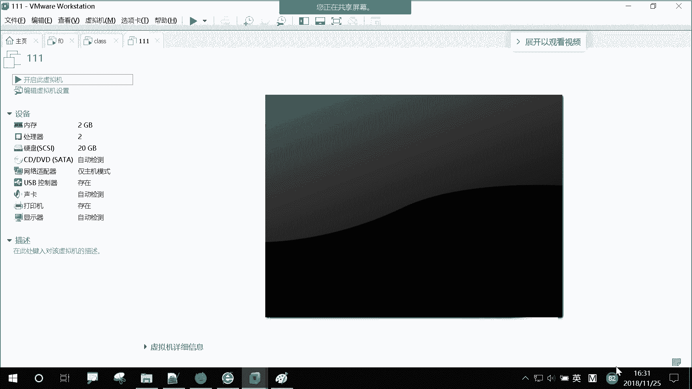
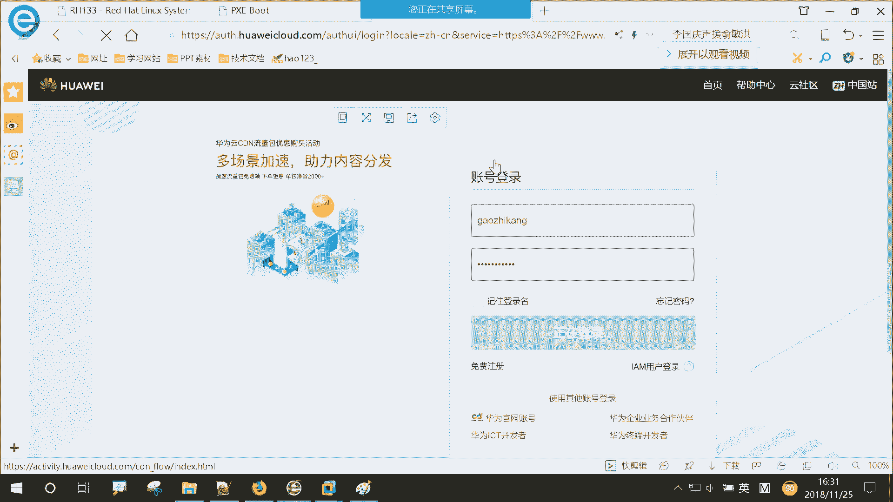
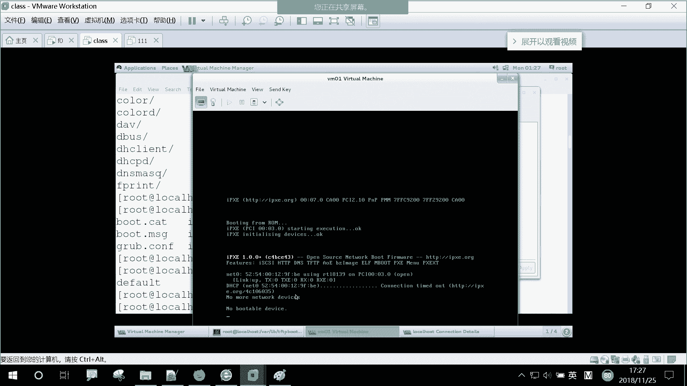

# 【誉天孙老师主讲】Linux入门课程／Linux视频教程／Linux运维／红帽认证／RHCSA／RHCE／ - P2：PXE环境部署和KVM虚拟机创建 - 誉天孙老师 - BV1ch411Q7hR

啊。看这里看这里啊，呃，我装这个class的时候，是我第一次用那个kickstar脚本装的对吧？

你看我第一次。就是装好这个class的时候，是不是用这个keystar在这个F领上面写一个keystar脚本。😡，是这样的吧，对吧，我写了个脚本，然后用来装我这个class，大家可以认为这都是物理机。

都是物理机啊，对，认为都是物理机。那我class通过网络的形式，通过P叉E的形式，然后来安装了一个操系统，可以理解吗？

对，那就是一个kickstar脚本。对，kickstar脚本。好，我们再来回顾一下啊。

我们PR已启动的过程。P叉E启动的过程啊。你看啊。这个叫P3一叫什么执呃预启动的执行环境，对吧？然后P3一怎么样啊？提供了一个butloader对吧？对，提供了一个butloader。

但是你前提你有这个bloader，这个是不是你有得有IP地址啊？😡，你是不是电器CP给他分配个IP地址啊，对吧？你看这里啊，我们先看这里吧，这P加E的启动过程就是网卡呢向我们的电器CP去什么呀？😡。

就是获取DHCP获取IP地址，对吧？对像网络中的DHCP获取IP地址。然后呢，DHCP提供了一个butloader名字和TFTP的serv的IP可以吧？现在应该可以理解这个地方了吧。对。

这个名字是什么东西啊？😡，是不就是一个文件名，对吧？一个文件名是用来断什么的呀？😡，是不是引导程序对它是一个引导程序啊，对，是一个引导程序。然后第GCD把你这个名字，把这个引导程序的名字告诉你。

然后你是不是去下载这个文件呢？对吧这个P叉一就是我们的引导程序就是谁呀，是不是就它。😡，这个文件啊，它是一个相当于它是一个呃固定的一段代码，你打开看是编辑不了的。就是你你你它这个是乱码，你们可以看一下。

里面是乱码，就相当于就是那个我们的446字节，对吧？相当于是那个啊，只不过还放在文件当中，也放在文件当中啊啊。然后你从电HCP那获到了一个地址，然后你通过这个地址怎么样啊？😡。

然后电CP同时给你给到你一个地址之后，也给到你一个文件名，也给到你个IP地址，对吧？给到TFTP的IP地址。然后你通过电CP给你分配的IP地址。

然后也知道这个IP地址是不是去到这个TFTP server上面去下载这个 loader啊。😡，对吧去下载它，然后去bis你的biss去读去去读这个引导程序。是这样子吧，对，去执行这个引导程序啊。好。

执行完引导程序之后该干什么呀？是不是。读它的配置文件呢。

对吧去读它的配置文件啊，它的配置文件。在哪里呢？在va labelbelTFTP。P叉一这个下面对吧？对它的配置文件在这里啊，对它的配置文件在这里。那么它的配置文件是不是提供了一个菜单，是这样子吧？对。

提供了一个菜单啊，那这个菜单里面它有什么菜单那个那个名字，你看啊。😡，他这个菜单里面呢。是不是有一个呃一个菜单栏，对吧？有个菜这个这个这个菜这个菜单栏啊啊，这个配置文件里面有个有个有个菜单栏。

然后同事给你告诉你这个内核文件是不是在哪？😡，对吧内核文件这是相对路径的写表示方法。它内核文件在TFTP的serv的跟目录下面吧，对吧？然后同时告诉你什么ram disk的文件是不是在哪？😡，对吧对。

这个就是跟我们的那个系统启动流程是一样的啊，同时给你了一个什么kickstar脚本。你通过这个脚本怎么样去安装你的操作系统。😡，啊，这个过程可以吗？这个过程可以吗？可以啊好。所以我做了什么事情呢？

就是我在这个F0上面，我们F0就是呃F0它本身就是一个DHCP服务器，同时它也是个哎TFTP服务器。然后我在上面创建了1个Kstar脚本，然后通这个KKstar脚本，然后去安装了我的class，对吧？

😡。

然后后来我把这个F0上面的TFTP是不是都关掉了呀？对吧把这上面还有254上面都关掉了。

好，然后我把class是不是做成了一个DHCP啊？😡，然后把class也做成了1个TFTP对吧？对，它本身也是1个TFTP，也是1个DHCP对，也是1个DHCP。

嗯。那这边这个是不是通过我这边这个DHHCB和TFTP来装的呀？

这个操系统。是这样吧，这这几个关系绕清楚了吗？😡，以前我是F0上面，它已经搭好了，对吧？我直接用。那现在我自己搭了一个新的，对，在class上面搭了一个DHCP搭1个TFTP。

然后我通过呃这个111就通过这个class这个。来装的。这个这个过程可以吗？好。那么我们再来啊。我们再把这个安装的过程再给大家回顾一下啊，我把这下面都删了都删了啊。好，我们第一个从头开始来啊。

从头开始来。第一步我们是要搭什么呀？DHCP服器吧。这搭电机CP服器啊叫电CP。HCP对吧？还要TFTP吧。😡，哦，我一并写了啊一并写了。嗯。角D角这个怎么事呢？DHCP和TFTP啊。

当然这两个包我已经装过了吧。对我已经装过了啊。对，所以你第一步应该搭它应该搭它，对吧？把这两个软件装起来啊。然后我们把电器CP的。呃，哦，现在等会儿再起伏吧，然后我们是要编辑什么呀？

DHCP的那个什么呀，配置文件对吧？对，DHCP的配置文件它在哪，是不是在这里？😡，我们第一次去看他的时候，它里面是不是空的呀？😡，对吧它里面是空的。

它告诉你要去看什么USL sharere do下面的DHCP那个一个一个一个模板，对吧？然后我就把做什么做什么线啊，要是把那个模板给复制过来了呀。😡，叫叫叫USR。Sure。dos然后DHCP。呃。

然后叫DHCDHCPD点。com复 exampleamp，然后复制到V呃，不是va是ETC。DHCP然后DHCPD点confer是这样吧。我是呃是不是这样复制啊，对吧？把它覆盖了对吧？啊。

我这个地方就不覆盖了啊。😡，哦，那我把这个模板复制过来之后，重命名成它，对吧？重命名成它，然后你去到DHCP下面。ETCHCB下面是不是就这个是我刚刚复制过来模板。对吧好，然后呢，我去。CPD点c复。

我来打开它啊，然后我是不是在这里面做了一些配置啊？对吧？好，第一个配置我是这个doman name，就是我们这个域名，对吧？我们影响客户影响这个装好的操作系统呢，是不是那个ETC resolve里面。

对吧？我说拼 pin的时候，你拼的是呃serv也可以拼通。因为为什么呢？它是后面帮你加了这一段的好，这个可以啊啊。我们给他电器CP的作用，是不是就给他除了分配IP地址，还要分配什么呀？呃。

子网不什么什么子网掩码，还有网关，还有DNS是不是都要分的，对吧？😡，啊，那DNS呢将来它的DNS就是这个对，就是这个这个可以理解吧。啊，下面这个租业期跟最大租业区域就不用说了吧。对，这个都知道了啊。

这是我们的两个小时，最大租业期是两个小时。好，这个地方呢我们DHCP除了给他分IB地址，还有其他的作用，对吧？它提供了一个什么呀？😡，文件名叫它配那个什么P叉Elinux。0，对吧？

这个是我们就是它是一个什么呀引导程序。对，是在这个DCP这个配置文件里面告诉他的啊。好，然后又告诉了一个什么n server。n server是239，239是谁呀？

这个neces server是指的谁呀？😡，对，TFTPserv对吧？这TFTP服务器啊，因为你是不是要去到TFTP服务器吗？去下载一些文件呢？对吧对，所以你要知道TFTPserv的IP地址啊。好。

再往下走，我们去设置DHCP的它一些呃分配的地址。比如说啊它分配的子网掩码是这个网段的对吧？对，呃，这个是这个网段的子网啊，然后子网掩码是它然后是分配这段，这到这一段的对吧？对，然后这些我都不用说了吧。

这是它的网关，然后这是他广播地址是它资料作源期，对吧？好，我们把它配完之后，我是把服务重启下呀。对，或者你起你如果你之前没有起过，那你就star。叫电HCPD。好。这电GCP已经配好了。

下面是不是要开配那什么TMTP的对对，开始配TMTP啊。第一次你装好TMTP之后，你需要在一个配置文件中把它开起来。😡，叫训训的这个啊叫TFTP。然后去到这个地方，把diable本来是yes，对吧？

你改成no。对diable是yes的话，是不是就关掉，no就不关嘛，对吧？好，关完之后你要重启一下服务吧，重启一下这个服务重启的是什么呢？是虚拟的这个服务，对吧？对，这是他领导，他TFTP由他来管，对。

由他来管。所以你把它重启一下。对，重启一下。好，下面我们是不是要去到TFTP的？根目下面啊。对吧要去去把那个一些什么那个呃P叉Elinux。0什么那些配置文件，是不是要放到那下面啊？好，我们去到。

W label。叫TFTP下面。哦，我们首先要复制那个P叉Einux。0，对吧？那个P叉Elinux点0叫US。在哪里啊，我也搞不清楚啊。哎，这个时候用上这个locket了。呀，这怎么有？V钱钱。哦。

这个这个是因为为什么？😡，它是基于数据库的查询吧，对你没有根据数据库，所以这段找到了啊。😡，对，这个还是我们之前的知识。啊，然后把它复制过来啊。APP复制到本地这个呃TFTP的根目录下面。对根目录下面。

同时要创建一个什么目录啊？叫P叉Elinux点CFG吧，是不是要放进这个目录啊，因为这个目录里面要放配置文件，对吧？对，要放配置文件啊，那我们就去到这个配置文件，去到这个下面。那配置文件哪里来呢？

我们可以从光盘里面复制，对吧？对，从光盘里面有模板，我们可以把它复制过来啊。啊，光盘在哪呢？我们把我把它挂载在了呃mo上面，下面一个SOlinux的这个目录下面啊，它的配置文件应该是是不是它对吧？对。

是它啊，然后你把它怎么样啊复制过去。复制过去重新命名成什么呀？重新命名成什么呀？对，default。

重新命令了default，因为你在启动过程，你会发现它会是不是找那个default呀，对吧？它找的是default啊，对，好，复制过去。😡。

然后同时这个下面所有的文件是不是都是我想要的呀？😡，对吧还有啊注意点。这个文件跟这个文件必须要跟你将来安装的操作系统的版本要符合。因为就是内核文件嘛，对吧？将来你的安装操作系统的那个版本一定要跟它符。

特别是这个什么呀ram disk文件，因为它是不是要驱动啊，你版本不一样，你怎么驱动呢？对吧所以这个地方比如说你要安装一个linux7，那你这个地方来源是不是从那个linux7的光盘里面复制过来呀？😡。

是这样吧，对，从那光盘里面复制过来，这样就保证它版本的一致性啊。好，复制过去复制过去。叫TFTP复制过去了啊，那我们进入到这个。进入到这个目录下面看一下。这些文件是不是都都已经有了？😡，好。

那我们在该该干什么呀？是不是要去编辑那个。编辑那个配置文件呢。😡，对吧编辑这个配置文件啊啊，然后比如说我自己再来做一个菜单啊，12344YY。我自己来做一个啊。是。哦，我这个呢叫HCE。也叫2HCE。

然后后面我后面那个菜单，我也叫HCE。我不想叫叫这叫安。啊，然后这个地下面下面这个地方这个是内核文件，对吧？这个是ram disk文件，对吧？对，这两个文件啊，下面这个地方我要让它P叉E部署。

我就要我P叉一kickstar自动部署，那我就写kickstar脚本。Kickstar HTTP。172。25。254。250。然后应该是KS呃KS01点DFG对吧？是它吧？对。

因为这个脚本来自于哪儿呢？你这个脚本啊，你放哪儿都无所谓，只要你能访问到就可以。对，只要你能访问到就可以啊。同时你看下面啊这个地方下面有一有一个这个叫什么叫manu default，你看到了吗？对。

这个是干什么的呢？这个就是说我们进出那个菜单的时候，它是默认停留在某一个菜单上面呀。对吧它是默认在那个菜单上。那我想现在呢我想让它默认在这个菜单上，在我新创建的个菜单上，那你就把这一行。怎么样啊。

复制过去滴滴了，然后。来喂。呃呃批。行，没了。哦，滴滴。P是这样吧，对，复制过来啊。那这样的话，等会儿我这边开机的时候，是不是默认停留在这个菜单上面啊？😡，对吧默认停留在这个菜单上面啊啊。

那我保存啊保存。他这个文件默认它是6，他是没有办法修改的。你改成644就可以。

好。这边它这个已经装好了啊，那我们再试一下啊，我重启一下。如果你装好了，默认它是从硬盘启动的，你需要修改一下，从网络启动。

那这个你要快快速的摁下。EEESC啊啊没看到是吧？在那个白色的那个界面上，快速的摁下ESC就可以进入到这个里面，可以选择从哪里启动，看到吗？它默认这个心是不是从硬盘启动啊？

对你中你从nettwork book，就是从P加E启动，对从网络启动啊，回车。你看是不是自动停留在这里啊，而且这就是倒倒计时60秒。😡，你看这个菜单就是我刚刚做的对我一回车进去，他是不是又又要装超熊了。

对，就开始自动装了啊，这个构成可以吗？应该没没什么问题了啊。啊，只剩自己，你在这里敲RHCE回车，他装然也装了，对他也装了啊。好，我们就不装了啊。我把这个关机，要不然我的我的都80多了。

刚刚九十几了。

嗯。整个这一套应该没问题吧。从DHCPTFTPkickstar都没问题了，对吧？现在还差什么？😡。

HTP是吧。对。后面我们还有一个叫。QBM。今天下午那个嗯知识量有点大啊。这前面我们一套是不是打通了，菜单会做了吗？😡，对，会做是吧？但是这个源我们还不会做，就HDB那个安装源。

我们那个casestar脚本安装源还是在那个250上面，对吧？对，还是在250上面，待会儿我们把它放到本地，对，把它放到本地啊。

呃，这样吧，我给你们看先教你们如何放到本地，好吧，然后待会儿我再讲KVM对，待会儿再讲KVM怎么放到本地呢？你需要搭1个HTEP的服务啊，这个我们后面会学的。叫HTTBD。像HP呀。行哦都装好了啊。

这个因为就是安装户脚本，我那个里面写好了，装好了，然后去到他那个叫什么bu呃，他有他自己有个根目录，你像TFTB有个根目录，他自己也有个根目录，对他也是有根目录的啊，他根目在哪呢？在这里面。

所在这里啊在这里啊，我们创建一个叫pub。再创建叫KS。叫KKS好，这两个目录啊，KS我用来放那个kickstar脚本，可以吧？然后pub用来放什么呢？用来放安装员。对，安装员怎么办？

其实我应该把那个MNT下面的所有文件是不是复制过来呀，但是复制又太占位置了，怎么办？直接挂过来。对吧。我直接把它挂在这个pop下面不就可以了吗？😡，哦，是偷懒了啊，这嗯EVCD然后然后pub。好。

我直接挂过来了啊，然后你再来看。呃，你进入到pop下面。你看这是不是就是我的光盘里面内容啊，对我把这个光盘里面内容当做我的安装员，对，当做我的安装员啊。好，我把Kstar脚本也复制过来。我K大脚本。

我用SCP复制过来啊，SCP呃172。25。254点。2ing。Mo后。compent下面的KS下面的KS点gas01点CFG吧。对，是这样吧。No， yes。哦，我把它复制过来了啊，看啊。😊。

这个过程看懂了吗？我是不是pub创建一个目录，这是HTTP的根目录啊，所以你访问的时候应该是访问的时候应该是HTTP，然后冒号172。25。254。239冒号，你要访问pub是不是pub呀？😡。

对吧它的就是这个HTB的根是从。😡，从Y3WHTM2开始的吧。对，所以你只需要从这里写就可以了。对，只用写pub就可以了。不用写前面的。你我就是别人哪知道你那个目录到底放在哪里去了嘛，对吧？

你只用知道它的根，不用知道它的根目录在哪，你只用知道根目录下面有什么东西就可以了。对你访问KS的时候，是不是这样访问啊？😡，对吧也就这样访问啊啊。所以我的那个TFTP那个one label。呃。

TFTFTP。进入到P叉一。这个配置文件这个地方我是不是应该。😡，我这样写了呀，应该叫cakestar，然后是。是不239啊。啊，对吧？对，是239啊，因为我的是不是放在239上面了？好。

同时你的那个kickstar的文件也要改一下啊，因为kickstar文件里面那个安装员是。还是250是吧？呃，我放哪里去哦，不忘。3WHTMM。这个下面啊。KSPS，你看这个安装员是不是还是250啊？

对吧我把它改成。239对，把它改成239啊。239，然后斜杠pop。是不是写杠pa，对吧？安装员是他啊，好保存。

那这样的话，你在这边。来再来安装你的安装员就在class上面，我就跟这个F0没有任何关系了。

对，没有任何关系啊，除非网关跟它有关系，对吧？DNS跟他有关系，其他都没有关系了，对，都没有关系了，可以吗？HDP很好理解，对吧？好。

呃，这个完了吧，这前面是不是完了？对，这一套就完了啊。那下面。我们来讲一下KBM。

PBM。

哦，KVM啊就是。嗯。就是这也是这张内容啊，就是我们的前面这部分。后面这部分呢因为讲到kistar脚本，所以把那一套DCP啊、TFTP啊、ICP啊全部给大家讲，对全部给大家讲。

然后这个地方就是呃前面的虚拟化。对，虚拟化。其实现在不多说虚拟化大家应该都是知道是干什么的对吧？大概都知道什么干，但是具体干什么还估计还不知道，对吧？对。现在我们为什么虚拟化这么成呃，就是这么火。

应该不是说虚拟化这么火，而是云现在很火，对吧？云计算现在很火。对，为什么云计算现在这么火呢？对吧？是这样的啊，就是我们现在。我们是多数去使用我们的物理级去搭服务，对吧？给自己比如你要上线一个网站。

搭一个网站，搭一个什么邮件服务器，搭一个什么论其他的什么服务器。那么你们这些呃服务器。是购买的物理机放在你本地，然后你要还有什么布置机房啊，还有什么空调啊，什么各种各样的，是不是都要你去布置。

还拉网线啊，各种各样的对。那这样的话，你成本是不是很很高啊？一个小型的创业公司，你刚开始要创业的话，你的成本光光光这个成本买服务器什么乱七八糟东西就已经比较高了，对吧？所以很多人很难去承受。

特别是小的公司，他购买这一套，还有有人去维护，万一坏了怎么办呢？对吧？还有人去维专门去维护他。所以现在我们大多数的很多中小企业企业的业务全部移到到哪里去啊？哎，全部移到云上面去了。对。

全部移到云上面去了啊。所以你像我们后现在啊，我们像我们做一些呃，特别说我现在啊像我们大数据的实验全部都在云上面做。对，如果我我搭集群嘛，他的集群很多，那我总不能去买几台服器拿过来打吧？呃，成本也比较高。

我还得维护他。对吧那这样的话，我直接就在网上哎购买几个集集群，直接买回来自己你买回来自己搭好了，你直接可以用了。对，直接可以用了啊，所以。没有什么成本，基本上基本上就没有，不需要你维护吧，坏了。

需不需要你修啊，不需要你修对，坏了，不需要你修啊。😡，所以这叫云，那么云的世界我们可以看一下啊。我我就。有。好运是吧。我只有华为云的账号啊，没有阿里云的账号，所以给大家看一下华为云吧。哎呦。

这个怎么不卡嘞？

嗯。

我刚我这边都关了。他只有他那个内存还没有回收，对吧？

他关注说重启开始。哦，我们来看一下啊，就是你看这边啊，它它有个那个产品，这边有个。嗯。这里啊产品这里这方有个腾讯云服务器。对，现在我们国内做云做的最好的应该是哪一家？

阿里云吗？应该是亚马逊吧。哦，我说的是国内吗？嗯。Sorry啊。口误。国内是阿里是吧？😡，啊。对现在。那怎么说啊，全世界还全。啊，然后这个叫ECwo叫弹性云服务器，弹性云服务器。其实阿里也是抄的什么？

亚马逊的吧。对吧。啊，这个是华为的云啊，华为的云你可以怎么样，你要买电脑怎么样买在这里买，对吧？😡，立即购买。啊，买电脑是吧？你看一下啊，要多少钱。我们不搞包年的吧，搞个按需的，好吧，得用多少。

它它的好处就是你可以。哎，用多段时间他就呃那个扣多少钱，对吧？就扣多少钱，给搞个按需的啊。然后你可以选择什么区域？它这个因为你购买这台主机，你购买这台主机，它有可能是一个虚拟机，也有可能是一个物理机。

对吧？但是当然我们这个地方选的它是一个虚拟机啊，因为如果你选择的是裸金属服务，它购买的就是一台物理机。对，裸金属服务，它就购买的就是一台物理机啊啊，那我这个地方弹性云服务器，它基本上就是一个虚拟机。

所以你的虚拟机最终肯定是要落在某一个物理集上面吧。你怎么能云，你以为云是什么？你以为是天空上飘的云啊，飘在空中是吧？它肯定要落地在空落地在我们的一个物理服器上面，对吧？就相当于我们文墨上面跑个虚拟机吧？

类似啊，当然不是啊。😡，好，这个地方就是他有很多区域，比如说。什么北京、上海、广广州是吧？哎，香港现在有了。啊，然后你可以在这里选各种各样的型号，你看他选多少个CPU啊，选多少个什么呃这些。

CPU内存怎么选，你随便选，你想怎么选，你想要什么样的，它就有你想要什么的都有啊，你可这样选，我这个地方我就不多说了啊。主要是跟大家看一下，然后你可以选镜像，你看到吗？

对你可以选sows还是windows，你这个操系统装起来是是是装的是sows还是windows啊，应该现在有有红猫的了，以前没有红猫的，现在有但然现在最近好像发现有了，以前是没有红猫的，叫sdows。

还有其他的。然后你把它选上之后。都不需要你自己装操作系统，你知道吧？你写完之后一创建，他自己给你装好。😡，得自己给你装好了，很快对，很快。当然它不是说呃一步步再给你装啊，它是一个模板，对吧？对。

把那个模板。他已经装好了，把正模板一部署一下就可以了。好，然后比如说你部署完把超系统装好之后，你还要部署一些应用。比如说你将来要跑mycicle啊，你要跑一些数据库啊，跑一些什么其他的应用，对吧？

它这里都有，你看没有一个市场镜像，你看。选择镜像。你看这个地方有一些基础的软件，呃，基础的开发工具。超系统。你看跑PHP的数据库的，你看数据库的mycircle的。就是你如果选了这个的话。

那将来你你操作系统装好之后，这些数据库什么东西是不是都帮你装好了呀？对，这些应用都帮你装好了啊。然后他刚开始不要钱，看还有这个哎呦这个要的比较少，对吧？😡，刚开始不要钱对吧？后来慢慢要钱对吧？

等你用的差不多啊开始收费了。啊，这个就是这样一个那个啊，而且还有什么呀？还有什你看还有还有公网IP你看。还有公网IP对，比如说你要购买一个公网，我这个地方选一下，看要多少多少。选个公共镜像吧。

选一个圣诺S的好吧，圣诺S的现在7。5的。现在是几毛钱三毛钱是吧？当然我这个配置选的是好像最低的吧。现就选了1个CPU，我我多选点，好吧。要不要显得太抠了？我选4个CPU好吧，然后8G的啊，我就选这个。

下了1。7块了是吧？8G以下1。7块了哈。然后你看还有宽带宽带，你宽带是多大？嗯，是你看。哇。这个。有点高是吧？带宽带宽啊。贷宽贷款。这个带宽还是蛮。这个费用还是蛮高的啊。你看那个弹性IP他也要钱。

对弹性IP他如果呃你要的话，他也要钱。不要他就你不要他就就少了一点。😡，然后你还可以设置入的密码呀，就设置一些什么密码什么之类的。然后点弄完之后点购买。一会儿它就创建好了。

你就可以有个公网IP去登录它了啊，S去登录它了。😡，对，然后登录上就开始。但是部署呃什么网页呀，网站啊，搭网站，搭网站服，大诸能量服务都可以正常去用了啊。他也不他你做实验的话，一般也不贵，对吧？

Yeah。他没钱了。好，这个我就不多说了啊。😡，嗯。刚刚说到云对吧？我们这是云层，我们呢就可以在这上面去自己去自主的去购买一些购买一些自己想要的。比如说呃主机啊，或者购买一些服务，对吧？对啊。

大家可以把它当是服务啊，当时是服务，它都是一些商品嘛，对吧？你去购买一些产品去购买就可以了。当然这不这层呢它是云层啊，对，直接给你打交叫的是云层，但是底层我们用的是什么虚拟化技术，它这种技术。

它不是一个产品，对，底下它用的是虚拟化技术啊，这么我跟大家说一下啊，我们底下。对，用的是虚拟化技术。什么叫虚拟化技术呢？就是比如说啊你这个地方有几台物理机，对，有几台物理机。一般我们现在就是像亚马呃。

像嗯。现在比较火的一些虚拟化技术，就是虚企业级的虚拟化啊，企业级对我问大家，你们用过虚拟化吗？呃，自己也用过对吧？we末嘛，win末就虚拟化嘛，对，这是单机版的对吧？vo station工作站式的啊。

我们一般企业当中都是用的企业级的虚拟化，叫企业级的产品啊，企业级的产品。对，通常呃像微软的叫什么呀？有h v对吧？对，微软叫h way。😡，那个那温摸的叫什么呀？😡，屏幕叫KBM，不是KBM。

它是一种技术，它是一种技术。我现在说是产品。😡，对。那个不是它不叫viscenter啊，它叫vispher。😡，小薇。SSVS。为斯 feel吧。对呀，叫visfi啊。

win win more的叫vispher，它这个虚拟化的这个产品啊，叫常vispher。😡，对他这个企业级的虚拟化叫vis菲。然后我们那个那个那个叫什么呃，ctri对吧？叫希杰的。嗯。

希捷的叫citrix。CT。CC谁区就是诈拼了着。我就听中中文吧，思姐。思杰的它的产品叫镇缩ber。这叫Z server，然后还有我们的微软的叫什么呀？😡，Hle V。对，微软叫hp v。

然后还有我们红帽的，叫红帽叫什么？叫RHEV。也叫RHEVhaV啊。哦，微软的它叫helle v，然后红帽的叫HEVHU叫红贸entterprise呃企企业级虚拟化，对吧？它直接叫红贸企业级虚拟化。

对这个名字具体怎么来的，我也搞不清楚。对，思杰的叫正 server，然后呃那个微软叫ha v，然win more叫visfi对叫visfi。我们说一下win more winmo它的一个架构啊。

它有一个角色里面，就刚刚有同学说的叫viscenter。这叫viscenter。V center。那vis center呢它是一个管理的角色，对它是一个管理的角色。然后下面呢就是我们叫ESSI。对。

叫EXSIEXSS就什么呢？就是我们所说的物理器。对，就是所说我们的物理级。然后在这个物理上面部署一个叫yesI的角色，yesSS角色啊。那么这个viscenter呢是不是用管管理我们的物理集啊？

对它用来管理我们的物理机啊对，管理我们的物理机。其实很多这种虚拟化的产品它都有这样一个架构，一个叫管理的角色，一个就是我们的物理机。对物理机。呃，就是我们的一就是呃win默还是这样叫的啊，像其他的产品。

你像华为的，它叫什么ki呃，叫什么。呃，CNAV呃CNAVRM对吧？对他叫的名字不一样，但是角色都差不多啊，他用来管他们的管他们的啊。啊，你的虚拟机最终部署在哪里啊？就在其中一台物理机上面。😡，对。

就在其中一台物理机上面。比如说这是你在那个云上面购买的一台虚拟机对，购买的台虚拟机啊，那么。在这个我们的这个yesI，它的配置是越高越好，对吧？肯定是越高越好嘛。那你越高是不是可以跑更多的虚拟机啊。

对吧？它可以跑更多的虚拟机啊。一般我们虚拟化刚开始的时候就是为了节约资源。😡，对我们当时小鸡很很早虚拟化出来的时候啊，就是小鸡，你的小鸡上面后来也跑也跑一些虚拟化了，为什么呢？因为它性能太好。

性能太好了，但是你只用它部分部分的资源是不浪费呀。😡，但是你又不能说跑两个业务，你跑两个业务，那之间是不是相互相互影响啊，对吧？你收一个业务当掉了。那另外一个业务是不是怎么样啊？有可能会受到影响，对吧？

你系统往一崩啊或者怎么之类的。😡，但是它比较稳定啊，以防万一嘛，你都买小鸡了。😡，嗯，还是跑两跑两个业务嘛，但是后来呢虚拟化出现之后，它就可以将这两个业务隔开隔离开啊隔离开。哦，那这样的话。

EXEXI上面可以跑多个虚拟机吧，是不是跑跑多个虚拟机啊，对吧？哦，那就比如说这跑了230个吧，好吧，30个也不多吧，还好啊，现在配置都比较高了。对他跑了30个。这个少一点，好吧，20个吧。

那么虚拟化什么，它有很多虚拟机啊。那这样的话，虚拟机有什么好处呢？一方面节约资源，对吧？对它其积着大量资源，这个上面可以跑很多业务。那另外一点呢，我们的虚拟，比如说你这个VM。诶，万一哪天崩了呢？

为以你那坏了呢。😡，对吧。😡，所以我们的汛机可以支持迁移。对它可以把这个虚拟机迁移到另外一台物理主机上，而且这个迁移的过程非常快。几秒钟签过去。几秒钟就迁过去了。那他是怎么迁过去的呢？底下要有什么呀？

对共享存储。哎，共享所以你是不是用的？你的共享存储，你的虚拟机的数据是放在哪里啊？😡，是不共享存储里面呀？你所有的虚拟都放在共享存储里面啊，他们都可以用，他们都可以看到这个虚拟的数据。

都可以看到这个虚拟集。那你其实签的时候签的是内存中的数据，而不是整个把虚拟机的数据全部迁到迁过来，所以是不是快，对吧？对，当你这边一你这边啊它就会检测这个讯集有没有挂掉，一挂掉直接迁过来。😡。

对直接迁过来会在这边直接开机，在这边开机。那也可以在线前。对，什么叫什么时候在线钱呢？比如说你这个ESI坏掉了，我想去请求，对吧？然后把它在线迁过来，这叫热热牵移，这叫热牵移。如果是坏掉之后关机了。

然后在这边开机叫冷冷钱，对吧？对，冷牵啊。啊，而且这个过程都不需要你自己去签呢，它可以自动签。😡，对，可以自动签，它有一个调度的一个算法，叫DRSS叫动态资源调度。你可以设置一个策略，什么时候签。

当你这个yesI这个上面，哎，比如说CPU跟内存的资源占用太高了，对吧？性能是不是会差呀？对吧跑太多业务了。那这样的话，它会检测当你的CPU资源达到多少多少，内存资源达到多少来迁过来。

迁到那些比较空闲的上面。对，其实我们的虚拟化远远不止这些功能啊，对，远远不止这些功能。那这个viscenter呢就是用来管理这些物理机的。就是当你这个物理机挂掉了，有一天突然就挂掉了，对吧？那挂掉之后。

这个虚拟这个物理机上面跑的虚拟机怎么办呢？啊，怎么办呀？所以是不是要有人去检测他，不断的跟他去发心跳关系，就是你还在吗？对吧？他说在你还在吗？不吱声也在吗？不吱声。他是不是就挂掉了？对吧对他挂了。

那这上面的训集是不是要被迁移到其他的物理集上面啊？对吧对，就要迁过去迁过去啊，所以他就会在其他的物理机上面开机。对，开机，然后是不是正常可以访问了呀？对吧别人业务也不会断嘛，业务可能会断那么一会会儿啊。

可能对你来说没什么感觉，没什么知觉，没没没有那个。没有感知啊没有感知。所以这是我们的虚拟化啊，叫虚拟化。这个是用来管理我们的物理级的啊，对，管理我们的物理级，这是虚拟化层。

我们云计算底下必须要有虚拟化吗？😡，不是吧，对，不是，就相当于你如果你购买一台裸机，是不是就不需要了？😡，对吧哎，就购买裸辑就不需要啊，所以云计算是云计算虚拟化是虚拟化。

只不过云计算现在用了很多的虚拟化技术，对吧？底层用了很多的虚拟化技术啊，像刚刚这个说的是opent，就是云层的啊，云层的这个技术叫 openent。那什么叫云呢？云就是我们刚刚在这里做的一些操作。对。

就是在这里做的啊，云这本叫什么叫自助服务。😡，自助服务，你说来创建一个虚拟机，那你最你本来说你要跟这个管理员说来，在这上面是不是创建一个虚拟机啊，但这时候你不用跟他说了，你只用跟什么。

你跟华为的关系就什么就是金钱交易是吧？😡，对。一跟那你交钱呃，你自己来买。😡，对吧底下就自动帮你创建了一个虚拟机，是不是这啊？对吧只要你充钱，他最多就是你没钱了，提醒你说欠费了是吧？然后你再充钱进去。

所以这个就是。我们的一个虚拟化大概是这样啊，这个我不能多说了，再多说没时间讲了啊。嗯。那么这是虚拟化的产品，我们虚拟化用到哪些技术呢？我们红帽用的是什么呀？😡，给，红猫用是KVM。对。

红猫现在用的是KVM啊，然后思杰用的是什么呢？😡，这。对，实际用的正我们华为之前华为之前的虚拟化啊，华为的虚拟化叫VV叫forcingpher叫forcingpher。呃，什么什么之类的，对吧？啊，呃。

现在以前华为底层用的也是我们的字，但是现在呢它改成KBM了。所以现在华为的已经算升级了，对吧？那改版本了的嘛，底层的虚拟化技术就变成了KBM了。这是两个虚拟化技术啊，它并不是产品，只是两种技术而已。😡。

啊，其实我们红帽。在红帽五的时候，我们用的也是正。对，红猫五的时候用的也是赠。那个时候用的好好的对吧？哪知道后来赠什么呀？😡，竟被四姐给收购了。对对吧对Z被思杰给收购了。那时候红帽老后悔了是吧。

早说我也先先踏一步把它收购了呀，对吧？哦，那个时候哎被他收购之后，红妈就想。我还要不要再用它呢？😡，我要是用它的话，相当于帮他不用的再好，对吧？别人也会说赠是四姐的，并不是说正是我红帽对吧，对吧？对。

因为这个。他是挂在我们的呃这个四姐下面的对四姐四姐被他，他被他那个证被四姐收购了嘛，对吧？后来红帽呢就决定不再用证了。对他就决定不再用证了。所以从红毛六开始。红毛六开始他用的叫KBM。

这个KVM是怎么来的呢？它是收购了一家以色列的公司。对，那家以色列的公司，他他是做这个虚拟化的，对做这个虚拟化。然后他把它收购回来之后，然后改名成了叫KVM。对。

改名成叫KVM这个KVM其实名字取的挺有意思啊。那为什么叫KVM呢？它叫什么啊？😡，叫 colonel。Vual machine对吧？叫基于内核的虚拟化。对，这是红猫五教材，没有啊。

叫基于内核的versionual machine。对versionual就基于内核的 kernelnal。有。Colonel。应该是base。connel base。

然后是verual什么motionine，就VM就迅集嘛。对训集啊，把训拟集那个那个那个那个后面两个单词的缩写。为什么叫这个叫基于内核的虚拟虚虚拟化呃技术呢？对，是因为他有点跟那个正有点。

他有点那个什么还是还是有点什么，就是当时赠呢。它就它不是基于，它就是什么？如果你要用虚拟化赠这种技术的话，比如说你装了一个虚拟机，对吧？不是装一个系统。

然后你想在这个系统上面跑虚拟化怎么办呢？你需要重新再另外装一套内核，叫赠的内核。你 arey name。呃，name杠R对吧？你的内核应该是应该是这个吧，这是你的标准内核，对吧？

如果你红猫就红猫五的时候，如果你要跑虚拟化，你需要重新另外再装一个一套内核，叫 kernelnal。😡，Z这个内核叫cr z。😡，是基于内核，基于正的一个 kernelnal。也就是说你要想用虚拟化。

你必须要有两套内核，就是你需要重新再维护一套新的内核，重新维护到新的内核，那这样的话是不是很麻烦呢？一些驱动什么的？如果你在原来那个标准内核能用。你说不定你在这个正的内核里面是不是用不了啊，对吧？对。

这样的话就很麻烦，当时也比较麻烦啊，所以后来呢呃洪帽起这个名字就叫基于什么？内核的虚拟化技术，所以说跟大家有点注意的对吧？对，反正你不是进器内核，我是基于内核的，我怎么样啊，我不用升内核。

对我不需不需要再另外再维护一套那个内核。😡，对，那是他是怎么做的呢？😡，他就是这样做的啊。就是你在这个上面。

跑一个训集跑一个训机啊，它就是一个什么呀？它的表现就是一个进程。对你看啊我把那个训集是关掉了。PSAUX grapeKBM啊。你看啊。这个地方。是不是有个进程很长，对吧？对，这个进程很长。

这个就是我的classroom那个虚拟机。😡，看到吗？就是你每开启一个训拟集，是不是就相当于开启了一个进程呢？😡，对吧就相当于开启了一个进程啊，所以它不需要升级内核，也不需要对内核做任何配置。

只需要安装一些呃软件包。比如虚拟化的包，虚拟化的包组就可以什么就可以跑虚拟化了，对，就可以跑虚拟化了啊。然后呢，你每开启个虚拟机就相当于开启一个进程，对，开启个进程，这样的话是不是很方便啊，对吧？

就不用再另外去维护一套新的内核了。对，不用再再去维护一套新的内核啊，所以到现在。我们用的都是KVM对，用的都是KVM。所以正跟KVM的关系大家搞清楚了吗？对，红帽五的时候用的是Z呃，红从红帽六到红帽7。

现在以后用的就是KBM对，就用的就是KBM啊，就KMKBM叫基于内核的虚拟化技术，对基于内核的虚拟化啊，可以吗？这个zen跟KBM可以吧啊。下面呢我们就来。去搭一个虚拟机啊。

就用这个KVM来搭一个虚拟机啊，怎么搭啊？

我们在这个地方，我新创建这个上面答，好吧，在这个上面答啊。怎么搭呢？我们有一些工具啊，叫叫vertman。这个是干什么的呀？这是不是看我这个里面有什么讯急，对吧？对。😡。

如果你这样执行了一个wordt manager，能够看到这样一个界面，而且没有什么报错什么之类的，代表你这个环境可以跑虚拟化了。对，可以跑虚拟化了。因为我之前。

在kickstar文件那个包组里面是不是把那些包组全部装上了呀？对吧就那个虚拟化的包组啊，对虚拟化的包组全部装上了。所以我可以打开它来创建虚拟机了啊。

而且我们所有的就是像镇的虚拟化跟我们的个KBM的虚拟化，它的命令是一样的。对，命令是一样的啊，因为方便我们大家管理嘛，我不管你底层用的什么虚拟化，反正我命令都是一样的对吧？这样的话。

我学我我我我可以用这个命令管理QBM也可以用让他管理真对都是可以的啊。好，那么我在这里创建一个训拟集啊，创建一个训集，点这里点这里啊一个小电脑。点这里，然后这个地方呢给迅集取个名字叫VM叫VM01。

可以吧？对，取个名字叫VM01啊。好，然后。在下面。你看啊它是从哪里，你看是从安装员是ISO是是那个光盘呢，还是HDPD啊，还是HDDP啊，还是P叉E啊，还是什么导入一个磁盘镜像，就是导入一个磁盘镜像。

什么意思呢？就是之前是不是已经做好了，对吧？把那个磁盘文件导进来就可以了，导进来就可以了。当然我们装了什么P叉一，我们当用要用P叉1了，对吧？对，我们当前这次就是一个P叉一的环境啊。对。

我们就用P叉一啊，就用P叉一这几个没问题吧，就是安装源嘛，对吧？对，从哪里去安装嘛，安装源啊。啊，如果你选了HDP，你还要选这个，你还要写那个URR地址。对HD地址。啊，我们选P叉一啊选P叉一下一步。

哦，这个地方呢你是OS的类型，是linux啊，还是windows啊，还是什么呃什么其他的。我你看啊它可以选linux，可以选solo race，还unicunux还可以选，对吧？

s racelinux我们选linux啊，还这个地方可以选版本，我们安装7对，安装7啊。好，下一步。这地方给内存给多大呢？我给个2G吧。2048要不然等会儿装的慢。2048啊。好，然后。

内存呃CPU不用说了吧。好，下一步啊。这个地方是不是选什么呀？😡，是不是选那个磁盘文件的？😡，对吧你看啊，如果你是选择这个的话，那将来安装好操作系统之后。它是自动创建1个8G的磁盘文件。

是吧因为win末是不是也是这样子啊，你在微末在在创建虚拟机的时候，是不是也是让你去选是创建一个新的虚拟磁盘呢，还是用以前的虚拟磁盘呢，还是用什么什么之类的，对吧？对，这个地方你就如果你勾选了这个将来。

😡，在va library在这个目录下面啊。在这个下面在这个目录下面就会生成一个，比如说你叫VM，它就会生成1个VM点什么呃那个后缀名叫什么来来着？一个磁盘文件。对，生成一个磁盘文件，这里这里还没有。

对吧？对这地方还没有是空的啊，待会儿我装好之后，它下面就会生成一个磁盘文件的一个一个一个一个文件的一个文件。哦，就是虚拟机的磁盘文件是放在这里，可以吗？😡，啊，然后再往下。转一下看这里啊。

他说可以选择一个什么呀？😡，已存在的一个storage，对吧？😡，这个地方的话就是你看浏览浏览，你可以选择本地磁盘。你是不是这个地方就是说你是不是可以先滴滴一个文件呢？😡，啊，然后滴D一个多大的文件。

然后这个地方是不是可以选那个那个文件，然后把那个文件当成磁盘文件，可以吗？对，把那个文件当成磁盘文件啊。好。然后再往这里看啊，我把这关掉，我等上它就自己就怎关。取消掉啊，我让它自动创建啊，自动创建一个。

而且这个地方还可以写什么呢？它有一个好处，它可以写它可以选安装在具体的某个分区上面。对，就比如说你在这个地方。For disk杠L。这里比如说有一个空一个空，一个一个没有用使用的分区，或者你装个逻辑卷。

它可以把这个虚拟机装到什么呀？逻辑卷子上面，它也可以装到你那个分区上面。😡，对，它都是可以的。比如说你装在一个分区上，比如说啊DVSDA呃呃SDB吧。

SDBE就将来你在你的这个上面呃分了一个区叫DVSDBE。那么你在这地方写上它的路径，将来你的虚拟机就让装在这个分区上面，这个可以吧，得装在个分区上面啊。好，这个我们先装在磁盘文件上，没有分区啊。

我们就装这个磁盘文件上面。好，这个地方立即分配所有磁盘吗？这个就是我们如果立即分配的话，就是我们什么。就是说这个文件就是8G对吧？对，如果不分的配料就是用多少给多少，对，就用多少给多少。

当然如果不勾上的话，它就叫精简磁盘，这叫精简精简就是用多少给多少嘛，对吧？如果勾上就是普通的呃一块盘给你用。呃，这样的话勾上的话就是性能要好一点，对吧？对它连续啊数据连续，那我们不勾了啊，空间不够啊。

嗯。正创建1个8G的磁盘，往这里看啊，重点来了啊，你们经群里经常讨论的。桥街呀什么什么什么NAT啊，什么景主地啊，就在这个地方给他讲啊。认真听啊，远程同学还在吗？以后不要问我了啊，在这方讲。😡，嗯。

在哦。好，你看啊。嗯。这个地方。就是选择你的网卡的模式吧。我们在分末上面是不是选仅主机模式，还是调接模式，还是什么？NAT模式对吧？对，还是NAT模式啊，这个地方只有一个什么呀？NAT模式对。

只有1个NAT模式。是为因为我安装好虚拟化之后。就像你安装好win末之后，自动会不会是不会生成一个两个虚拟网卡呀？你看啊。不知道大家有没有注意到。看到没？是不是一个系的网卡？

这个就相当于你在你的windows里面那个VMnet1VMnet81样。😡，这个就是那个NAT那个那个那块虚拟网卡，对NAT那块虚拟网卡啊，叫网络地址转换那块网卡。啊，下面呢我们要来做桥接啊，对。

做桥接。我们这地方是不是还没有桥接呀，是不是没有桥接模式。我们分末里面自带桥接模式吧？是因为KVM天生就不带桥接功能，你需要怎么样？你想用怎么办？自己创建对，自己创建桥接器，自己创建啊。

因为这地方只有NAT那怎么创建呢？我们还要教大家如何创建桥接器啊。哦，在创建调节器之前，我先给大家讲一下。桥接的原理对，桥接的原理是什么样子的啊？

嗯，如果大家如果觉得下午呃可能有点着急，明天怎么样。如果大家想要视频，我可以把今天下午视频给你们拿回去看，好吧。啊，可以吧，这个福利不错吧啊。嗯。好好。嗯，我把这个给。擦掉了啊。Yes。我花花。啊。嗯。

我们现有2块2个。嗯。你录的没有我录的好是吧？😡，啊，然后这两个有2块物理机啊，有两两个物理机。你的物理机上面是不是有很多网卡呀？😡，对吧你屋理上面有网卡。😡，然后这个地方呢。

比如说哦这个画个线就不太好，画个这个啊，因为下面今天下午内容太多了是吧，记不了那么多。啊，然后把你的物理网卡是不是要连到你的交换机上面啊？这样的话就是这两个物理机是不是物理上打通的呀？对吧好。

这是物理层面啊物理层面。那么在你的物理机上面。是不是会有虚拟机？好，这里有个训集，我画往往下面画一点啊，迅集在下面叫训集。这个虚拟我就画一个虚拟集啊，就画一个虚拟集，还有可能有其他的虚拟机，对吧？

在这边呢画一个虚拟集。然后这个虚拟机你是不是给他选了有网卡呀，是不是给他配了一个虚拟网卡呀，就配了一个网卡啊，配了个网卡。😡，哦，有可能你你就我就写一个网卡吧，这边你是不是也有网卡。

就是你在温末上面那个添加一个网卡，选择什么仅主机模式还是什么模式之类的，对吧？对，这就是你的那款网卡啊。对，这就是你的那块网卡。好，然后。现在我需要怎么样呢？我这个虚拟机跟这个虚拟机要通。有通啊。

叫VM01。嗯。然后这边是VM02。我跟他之间要同。是不是有这个需求，对吧？怎么通呢？对吧我跟你之间是不是要通过这个虚拟网卡要通信，对吧？你虚拟机是不是直接跟你虚拟机直接的，是不是跟这个这个虚拟网卡呀？

但这个虚拟网卡你跟他通，最终是不是要经过这个物理交换机啊？对吧呃，经过这个物理交换机啊啊，所以我们怎么办呢？我们一般想一般啊我们说桥接模式是不是可以通啊，对吧？桥接模式可以通啊，所以。你会看到。

我们的物理网卡啊，它可以做成一个桥接器。对它可以做成一个桥接器。比如说他做成桥接器在这里。大家可以把这个桥机器当成是一个什么呢？虚拟交换机。jo vs。叫viual switch，对吧？叫虚拟交换机啊。

叫虚拟交换机。每一个物理网卡都可以创建一个虚拟交换机。我们叫物理网卡，一般叫上行链路的专业词汇啊。的上行链路啊。对吧然后这边是不是比叫上行链路啊，也就是说每个上行链路都可以创建一个虚拟交换机。对。

用物理网卡创建的虚拟交换机，叫虚拟交换机啊，虚拟交换机。好，那你的什么呀？你的这个虚你的这个虚拟机的网卡，你是不是要选一个模式啊？然后你选一个模式叫什么桥接模式。😡，对你选了一个模式叫桥接模式。

意思就是说你把你的虚拟网卡连到哪儿啊？😡，虚拟交换机上面。对连到虚拟交换机上面啊。好，这是逻辑的概念啊，对真这是逻辑的概念。一般我们网卡连到交换机上面，是不是有是不是有那个线呢？但是这里它没有线对吧？

这叫端口，对叫端口。就是如果你还有其他的。如果你还有其他的虚拟机，是不是也可以连调节到，就是连到这个虚拟交换机上面啊？对吧那这样的话，你每每连一次就是不是就占了一个这个虚拟交换机的一个端口啊，对吧？好。

这个地方连到这儿啊连到这儿，然后。你的虚拟，因为我这个虚拟交换机是由谁创建的呀？😡，是不是有你的物理网卡呀，对吧？由你的物理网卡创建的，所以我是怎么跟他通的呀？我是这样通的啊，这边同样它是不是也是。

一个虚拟交换机啊。对吧然后他也选择桥接模式桥到这个虚拟交换机上面的，对吧？好，那我跟你之间怎么通呢？是这样通的啊，首先VM发个包对吧？发送个包，然后通过你的网卡，然后到达你的虚拟交换机，是这样吧？对。

到达你的虚拟交换机，然后虚拟交换机又是上行链路做的对吧？它是不是通最终通过你的上行链路出去啊。是不是这样子对，通过你的上行链路出去啊，然后到达物理交换机可以吗？对，到达物理交换机啊。

然后这边的物理交换机又从这里出来，然后到达这个。😡，物理网卡上面对吧？物理网卡然后到达虚拟交换机，虚拟交换机到达最终到达。虚拟机上面。所以你跟他是不是通了呀？是这样通的，可以理解吗？好。

所以我们可以把它这个虚拟交换当成一个桥接器。对它是一个桥接模式啊，是一个桥接模式。好，怎么。那你这个上面所有的虚拟要想跟外面通，是不是都要调接到这个虚拟交换机上面啊？好。

我们KVM呢又把这个物理网卡相当于把这个物理机也调到这块虚拟交换机上面了。大家都瞧到这个上面，然后最终通过这个上行链路除去，就通过这个上行链路出去啊。好，这叫桥接模式啊，叫桥接模式。

那调节门式跟我们的紧主机模式有什么区别呢？叫仅主机模式。我们的紧主机模式跟它的区别就是仅主机模式有虚拟交换机，但是没有上行链路。可以吗？他没有上行线路，是不是出不去啊？😡，他最多是不是只能跟他的。

这个宿主机这个物理机通啊。😡，对吧就也就是说我们的虚拟交换机不一定都要有上行链路。没有上行链路，它就是井主机模式。有上行链路，它就是桥间模式，就是桥间模式，这下可以吗？

调接模式跟及主机模式是不是可以理解了，理解了啊。好，下面呢我们来做一下这个调接器啊，来做一下这个调接器怎么做呢？你们在这个。😡，上级链路什么上线链路两个。其实你看啊你的上级链路，你看说两个对吧？😡。

一般我们做那个做team，就是两个物理网卡，对吧？我们两个物理网卡中间是不他们两个可以是不是可以做一个棒做一个棒的，做一个team啊，然后绑到一起，然后把这两个做成一个什么虚拟交换机吧。😡。

这样的话是冗余吗。不绑你不是你搞两个虚拟交换机干嘛，两个物理网还干嘛？你你再来一个物理网卡，它还可以怎么样也可以调节。😡，他可以用别的讯息调节到这个物理网卡上。不行，调节到不同的那个。

当然你如果这样出去，这样这样又回来。那那那那这样没必要嘛，对吧？虽然说理论上也是可行的啊，理论上也是可行的。其实在这个温末里面。你看啊。默末里面是不是可以选，你调接到哪块物理网卡上面啊？😡。

你看啊这个地方。嗯。😊，呀出来呀。好，在这里啊你点一下更改设置。它本来是灰的，你点一下更改设置才能改。比如说你有多块物理网卡，那你这块物理网卡最终调接到哪块物理网卡上岗，你看桥接模式，对吧？

你这个地方可以选择什么呀？桥接到哪块物理网卡上面吧。😡，你那这个地方是不是我的一个无线网卡？就是如果说你想通过无线网卡出去也是可以的。你可以调到你的无线网卡上面，这是我的那个有线的对吧？

对我调到是我的有线网卡上面啊，所以你们要你们要要想跟外面同，你要连的是有线，那你就想你就调到有线上面，你要连的无线，是不是调到无线上面啊？😡，对吧所以你有如果有多块网卡，你可以选择啊，你可以选择的。哦。

我们来做这个桥接器啊。你们衣服config。😡，来看的时候，在这个下面是不是有个叫B20的呀？对，就个叫B20的啊，这个B20它就是一个调节器，对它就是一个调接器啊。我们刚装好的操系统是没有B20的吧。

只有这块物理网卡，对吧？那我相当于我做成B20之后，是不是相当于就做了一个虚拟交换机啊？😡，然后你们以后的网卡是不是只要调到我这个B20上面就可以了。是不是是不是这样子，是是这个意思吧。好，那下面呢。

我们就来做这个桥啊做这个桥，我们温末里面自带桥，但是呃KBM里面它是不带桥的，对，它是不带桥的啊，我们需要自己去做，怎么做呢？ETC config。network下面啊，然后。复制一个配置文件。

叫E欧叫if con叫BR0复制一个啊复制一个啊。好，然后来修改它来修改它。把B20修改一下啊，注意你的IP地址是配在B20上面的，在物理网卡上不要配IP地址，听到了吗？

你的IP地址是配在B20上面的啊。😡，好，我把这些多余的先删掉啊。嗯。把这UID群删掉。好，这个地方device要改一下。这叫B20。叫B20啊，然后这个嗯还有什么呀？还有name要改一下，叫B20。

B20，然后呃这些这个妈地址删掉啊，然后留下来这些可以吧？对我这个IP地址是配在我的B20上面的对吧？对，配在我们的B20上面的啊，然后下面要交一要要要加一个叫。嗯嗯嗯。

嗯，叫叫突然想不起来叫啥来着。我看一下啊。突然脑子短路了。嗯，叫叫。哦，叫这个啊叫type叫bridge，因为它的类型是一个桥，对，是一个桥啊，所以这个地方。

加一个。Tap。啊，下面有吗？哦，在这里啊。眼花了。把这个地方改成。Bridge。呃，BRI这个大小写要严格区分的啊。叫BRIDGE对吧？对bridge啊。好，改好了啊改好了，然后保存。

然后要修改一下物理网卡的配置，把那个IP地址信息全部去掉啊，全部去掉。全部去掉。然后把这个地方嗯。IPV6这些先全去掉，然后UID我去掉啊。然后device，然后下面要写。BRIDG调到哪个上面。

把你的物理网卡也调到B20上面。对，把你的物理网卡也调到B20上面啊。可以吗？把你的物理网卡调到B20上面啊。😡，好，可以了啊。嗯，在做这个之前，需要把一个服务停掉。把这个服务清掉。

那个地址就放在上面呗。他是物理网卡吗个地址吗？😡，把这个服务停掉啊，为什么呢？因为。😡，嗯。B20哪有什么mark地址嘞？😡，因为这个服务这个这个服务管不了那个桥街，就管不了这个那个那个桥接啊。

我没有改吗？B20。我删我删掉了呀。嗯。嗯，然后重启一下网卡服务啊。如果你把那个n这个大写的这个net manage关掉的话，它它会报错。对它会报错的。哦，好了啊。来看一下。嗯。

这个B20是不是就做好了呀？对吧你看啊B20做好了啊，然后在这个物理网卡上是不是没有I没有IP地址，没有IP地址啊，B20做好了。B20做好了啊，你可以在这边拼一下，能不能拼通啊。

嗯172025。254。239。you。

拼同了吧，生效了啊生效了啊，我们再来这个地方。这地方你需要重新选啊，他这地方。他没有识别到，再重新来啊，叫VM01，我就快点点了啊。Unix。然后搞1个20。啊搞大一点，要不然。嗯，创建一个新的磁盘哦。

这地方点adance这地方啊，你看是不是自动出来的呀？你看出现了1个B20，看到了吗？就相当于你的这个虚拟机的这块网卡是不是翘到B20上面啊？对，调到B20上面啊，好选上啊。

然后他设置了一个mark地址给他就这个这个虚拟虚拟网卡的mark地址是它啊完成。呀开机了呀。啊，他自己开机了。看一下啊，他DCP的货地址看到吗？嗯。我先把它关机啊先把它关机。好，我们先把这个说完啊。

我们等会来管他。😡，把再把那个还有一些其他的模式啊，刚刚说到B20，我们已经做会了，对吧？我们已经会做了啊。好，那么其他的像如果你想给它添加一个仅主机模式的怎么办，对吧？

有没有可能我要添加一个仅主机模式的，我们可以这样添加啊，在这里叫edit，看这。eddit然后叫呃叫connection details就点它。然后在这个地方有个虚拟网络，看到了吗？这叫虚拟网络。

然后在这里添加。添加一块添加一个虚拟网络，就相当于添加一个虚拟交换机嘛，创建一个独立的一个网络，对吧？一个独立的网络啊。好，这的网络叫my network。给 my network取个名字啊取个名字。

好，在这里你看啊。嗯，IPV4地址是是这个网段的对吧？然后电启动DHCP吗？就是你看啊它这个网络还有DHCP的功能哎。😡，是吧。你的微波里面是不是也有啊？😡，你们打开过看看过吗？你如果选择了，你看啊。

😡，如果你选择了那个什么。呃，比如说你选择仅主机模式。那这里是不是可以它有电HCP功功能吧？如果你选择仅主机模式，你那个配置文件里面写的DHCP获取，那这个地方是不是可以自动获取啊？

就是它是温末自带的功能啊，当然我们这个KVM里面它也有这个功能。对你可以把它enable它就有DHCP的功能了。有DHCP的功能了啊。好要继续。啊，这IPV6我就不管了啊。😊，这个地方看这里啊。😡。

这里有个叫是什么意思啊？

这是不是独立的网络呀？独立的虚拟网络就是。😡，进主机模式。如果是一个独立的虚拟网络，就是仅主机模式啊。你看这里叫foring，看到吗？什么呀，转发吧，是不是转发呀，它叫NAT模式。对NAT模式啊。

你看啊转发的话，还有可它是NAT模式啊，对叫NAT。我们待会来说什么叫NAT啊。那我就创建一个独立的网络，那就是仅主机模式吧。😡，对吧。好，再继续啊，那就完成了啊。你看将来。

将来你在这个虚拟机上面添加一块新的网卡，它就可以选什么了呢？你看啊。Network。然后你看这里是不是有。本AT还可以顺门来的话去。对吧你可以选桥接模式，你也可以选NAT。

你也可以选my network。对，都可以选都可以选啊。这个就叫添加一个呃呃呃。仅主机模式的一个一个一个一个虚拟网卡啊。哦，这地方没问题了吧。啊，这个创建什么进什么呃调节器以及我们的紧主机模式。

是不是就可以了？

好，那最后一个啊叫。这是叫什么？NAT模式对，叫NAT模式。NAT模式是什么东西呢？它是这样子的啊，就比如说我我的我我linux本身可以作为一台防火墙。对，可以作为一台防火墙。

我这边有一个有1个IP地址。这边有1个IP地址，这有一个虚拟的网络，这个这个这个它的IP地址像比如说啊叫17192。168。122。012。1吧，是吧？然后这是你的虚拟机，这可能是不是你的虚拟机啊。

你的虚拟机呢上面配了1个IP地址。😡，得配了1个IP地址，是大概就是呃是192。168。122点呃。192。168。122。10，比如说是1啊。哦。

然后你选择的这个这个大家可以当做是1个NAT的那个虚拟网卡，可以吗？NAT的那个虚拟网卡。

就是你创建好之后，它不是有个VRBR0吗？你看是不是这个就是他呀。😡，啊，对吧？就是也就是说你这个虚拟机将来选择的是NAT模式，是不是就相当于调到这个这个虚拟网卡上面啊？

对吧啊，那你是怎么上网的呢？比如说这边是interinternet，对吧？它有一个转换，比如说这边你的地址是一个公网地址，最终是不是从一个公网地址，或者从你的呃计算机你的呃地址出去啊，对吧？啊。

它是这样的啊，当你数据包发过来之后，NAT的模式就会去找，它就会去找这个其他的接口。是什么呀？还有个追踪追踪就是。他会追踪什么呢？它其实就是一条防火墙规则。😡，对。

就是一条防火墙规则ip tables一个maskcu的就是大家一个那个路由器的那个原理，懂吗？路由器的原理。对吧你的是s有私有IP地址，对吧？你的地址，你你的这个数据包出去怎么出去呢？

它是跟踪你这个地址是多少，我就把这个数据包伪装成是这个地址发出去的。😡，啊，可以吗？这就是NAT的功能。所以最终你无论你只要在这个网段，你无论是自动分类是一个什么地址。

它最终是不是都把你这些包通过这个网口伪装出去啊。对，通过这个这个这个比如说这个地方有个IP地址，通过伪装成这个IP地址，所以在外面能看到你这个主机吗？是不是看不到啊，对吧？是看不到的啊。

他只以为他以为是从这里发出去的对吧？对他以为是从这里发出去的啊，其实是从这里面对，然后转换出一个这叫NAT转换，叫网络地址转换嘛，对吧？然后数据包发回来之后，是不是再转换呢？再转换一次。

然后发到我们的这个虚拟机上面。可以吗？这个NAT转换原生同学可以吗？三种模式我已经跟大家讲了啊。嗯，我我我好累呀。

好。那最后一步啊，我们这个训机还没搞完，对吧？他还没系统还没装。😡，嗯，我们看一下啊，怎么回事。这个启动的顺序，我们从P叉一启动啊，从P叉一启动。然后开机看一下啊。

它是找不到那个but loader是吧？

按，这里。no boot没有启动设备。

没有启动设备吗？系。哇。No。嗯。等一下啊，我看一下。S。Yes。

这个没问题啊。no book， no more network没有我的网络。😔。

现在是嗯是桥间模式是桥间模式。

调节到B20上面。哦，这个怎么是虚拟？把这个给删了。And don。这个有个delete吧。启动从P上一启动，然后开一下机。

AC服器。必须无。嗯。没有过。😔，哦，我我把这个讯机给删重来啊，我们重新创建一个。你看这地方生成了1个VM01的image，一个它的磁盘。Ch音。

No from her disk怎么从。😔。

稍等一下啊。可能是。

嗯。

我刚刚我那个DCP可能有点问题啊嗯。因为我从那个HTP那个那个就可以启动了。就我改成了那个HTP这个地址，不是P下一了啊，不是P下E。

嗯。

哦，所以这样的话就可以安装完了啊。刚刚那个P叉E不知道我现在没找出来什么问题。

按你说应该。Sy next。哦，那么。

今天就到这儿吧，好吧，然后这样的话就可以自动就就可以安装了啊。就是你看到那个菜单的界面，它就可以安。其实这个虚拟机跟这这边这个是一样的。

跟这个温末上面的是一样的对吧？就刚刚创建了一个这个在微末上面创建一个虚拟机，开机DHCP获取也是可以的啊。因这个时间如果感兴趣的话，大家可以下去有时间了啊，可以做一下。但是最近我们先把考试搞定啊。

然后我我先别慌先别慌啊，我把我们的考试的那个环境先跟大家说一下。

嗯。等一下啊。

