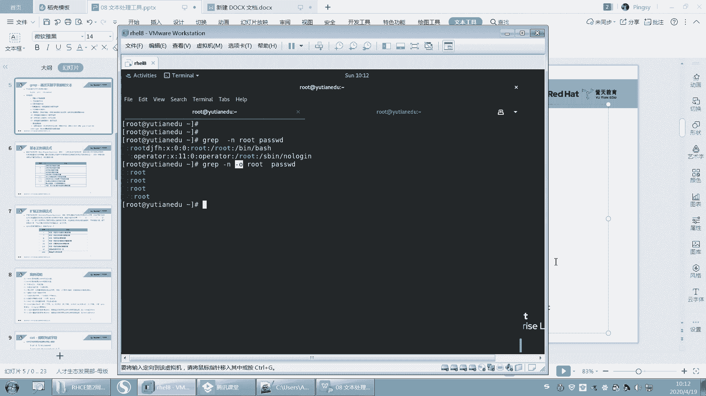
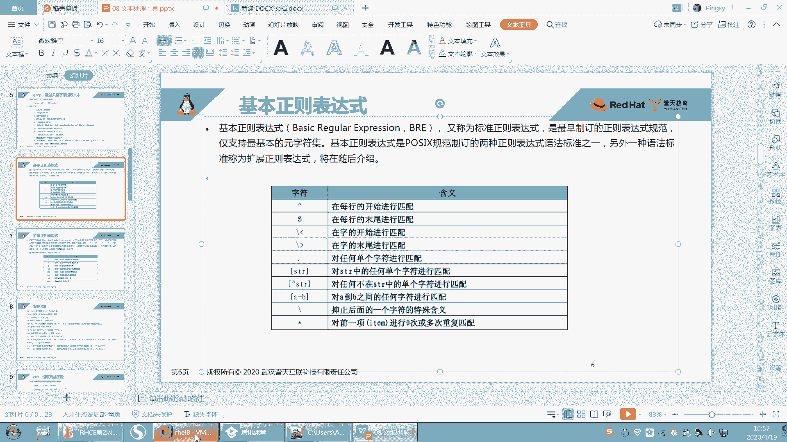
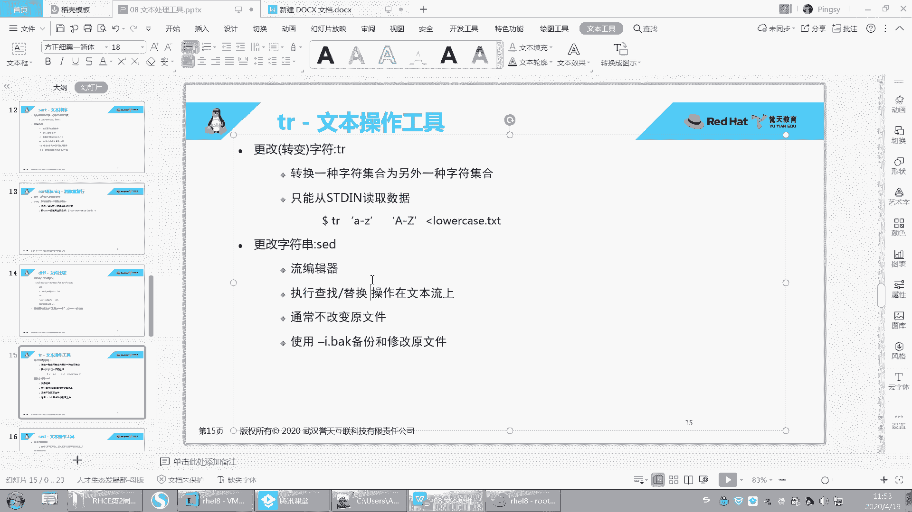
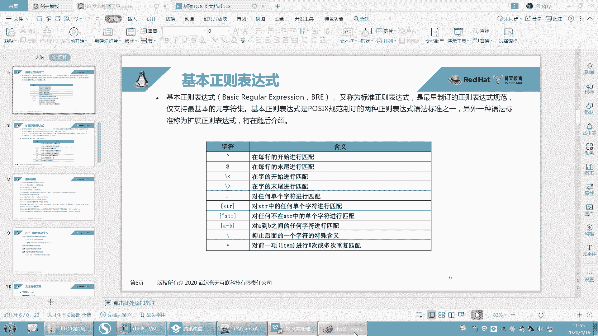

# 【誉天孙老师主讲】Linux入门／红帽认证／RHCE 8／RHEL 8.0／Linux基础视频 - P10：文本处理工具＜1＞ - 誉天孙老师 - BV1Dr4y1A7jz

嗯。好，下面我们开始下一章了啊。那个同学们都在吗？在吗？给我个回应看一下。看一下的。今天有很多同学请假了。那呃其实呃是。呃。我已经习惯了啊，因为每次都是第一周的人比较多，第二周然后还好。

然后后面就慢慢呃到中间的话就是剩下的部分都能坚持了。然后前面第三周、第四周、第五第三周第四周，后面就会流失很多人啊，要么就是陪女朋友去了，是吧？要么就是什么反正各种跟各种事情，然后去请假。

然后就是落下很多，能坚持到最后的基本上都都一遍都可以跟完。嗯，就消失了，人就不见了，不知道去哪了。反正就是各种忙，工作忙就是忙什么忙。嗯。陈陈乔是吧，你问他去吧。好。😊，嗯。嗯。好。

那下面呢我们开始第八章内容啊，第八章内容呃，文本处理工具呃，这张的话。呃，内容还是比较多的啊，因为。将来你写脚本。呃，还是做什么？基本上啊你的这个。嗯，都要靠这一张都要靠这一张啊，就是你玩的转不转了。

对吧？呃，这张是能够体现你的功力的一张啊。呃，当是我们这张会给大家列举出比较常用的还是那句话啊，不可能把所有内容给大家讲。但是你要把常用的这些都能用下来记下来啊，这个是我们只上课给大家做一个引导啊，好。

然后文本处理工具呢，说白了其实就是怎么去处理这个文本内容，比如说我查看文本内容啊，呃，过滤文本内容啊啊过滤一些关键词啊，对文本内容进行处理啊呃，文本内容修改啊，查找啊、替换呢对吧？等等统计啊排序啊。

那这都是对文本的内容进行啊，包括你们以后如果要处理日志，比如说处理一些日志文件，对吧？那这些的话那都要用到这一章的文本内容，一些要写脚本呃，也要用到这张的内容啊，所以这章非常非常重要啊。嗯。好呃。

虽然前期再说一句废话啊呃，但也不是废话。呃，虽然前期的内容比较枯燥，呃，就感觉没有什么高级的这些呃比较炫酷的功能，对吧？但是我觉得这是才是你体现你功力的时候啊，你的基础一定要打好，你才能去，对吧？

你扎马步练功要加马布，对吧？要扎好，要不然你怎么去。去去去。练一些更高级的功能，对吧？啊，然后这张我们分三个部分啊，就是文本的提取，就是查看文件内容，然后分析文件内容统计分析对吧？

然后可以对文本进行操作，文本内容进行操作。比如说可以用呃，我们后面会加1个SED，对吧？对它进行这样一个文本编辑啊好。然后第一个文本提取的部分啊，我们会学习这些工具。嗯。

文件内容包括cat啊、more呀、less啊，那这些可能大家之前也已经也已经接触过了啊，比如说关键词提取group啊，还有这个列，还有字段cut这个这个这个这个呃。也都是提取是吧？啊，这个是行体取。

这个是列提取列提取啊。好。哎呀，这两张重复了我删掉。好，那我们看一下第一呃第一部分啊，cat more和 less啊。

呃，大家可以自己拿出来去记啊，因为我每一个每一个这个呃工具我都会给大家介绍，所以你是完全有时间自己去记下来，我边讲，你可以边记的啊。好。

第一个工具catch记啊第一个工具cat它就呢就是查看最简单的就是查看什么查看文件内容啊。比如说啊我们之前每次去查看文件的时候，是不是都用这个是吧？我还唉不敢用cad是吧？我就用ca发的有同学看不懂。

所以我就一直用VIM去看，那VIM的问题是你每次去看，你还要退出来，万一你不小心误操作了这个文件。😊，那么还可能导致什么把文件损坏了呀，对吧？有可能我记得之前有一位同学是这样的。他VM可能没有用好。

那VM没有用好，然后他给我怎么样啊，他给我在这儿root这里加了一堆的这个字符串，或者在哪个地方加了，反正不小心修改了一个地方，结果后后果就是什么，后果就是连系统都进不去了，系统都进不去了哟。😡。

就一个文件，就这个pasword文件被它搞坏了。呃，误插误插入了一些字符，然后导致系统都进不去了。然后我还是进行就业模式，然后给他给他呃这个这个改过来之后，他才能进去。呃。

其实你看linux它就是这么脆弱啊，所以。你要懂他啊，你要懂他，你才能玩好他，否则你就被他玩是吧？好，那么呃VM它会有交互，但是我只想看一遍，不想什么重复的这样去看，还有交互很麻烦。

所以catch就帮助我们去打打印，将这个文件的内容打印到当前终端回车。好，上下去翻看到没有？上下去翻啊，那下去翻，对吧？好，但是我们说这样向下去翻的话嗯。对，这是在我们那个呃那个那个控制台。

那个虚拟控制台不能上下翻是吧？那一看看一遍就完了。所以我们后面会学一些分页的工具啊，加上我们昨天学的管道啊，那么这个K呢比较常用的一个工常用的一个选项叫杠N。😊，哦，cat杠N。嗯。

前面就会打印这个行号，看到没有？前会前面就会打印这个行号啊，行号啊，OK吧，这个是我们比较常用的一个呃常用的一个选项常用的一个选项啊。

好，那cat呢它还可以打印，它除了打印一个文件以外，它还可以打印多个文件。

啊，打印一个文件就加一个文件名喽。那打印多个文件呢，那我就cat呃ETC password EPC profile。啊，回车好，你你你看啊它就什么，你看打印完这个。打印完这个这个这个这个什么。

这个password完之后是吧，然后再什么再去看这个啊，可以看这个。No。用cad是不是比VM打开速度要快一些？这个应该差不多了吧。你看了跟VM应该差不多了吧。一般如果是嗯一般如果文比较大的话。

我们不会说全部都看吧，很少。嗯。反正都要从头到尾这样读一遍，你ca要读一遍，然后你这个这个VM也要读一遍，反正都是要读一遍。啊，然后你我不知道这地方可以不以加杠N喏，他应该应该也可以加杠N吧那。

对吧两个合并打印啊合并打印。而且我们打印出来之后，我们是可以把它重定向到某一个文件里面，对吧？把这个结果给重定向到一个文件里面，这样就把两个文件内容全部合并成一个文件。啊，就这样子做啊。

这边tab下面的。呃，time们下面fi是吧？好，这个是ca啊ca嗯，记住啊，就是一个杠N，还有打印多个文件这样子啊。到当当前终端好吧啊，那么cat呢它在不在一些虚拟控台下，我们说它不能上下这样去翻。

对吧？上下这样我们这个呃上面这个滚动滚轮是不能用的那怎么办呢？我们只能叫分页显示分页啊，那第一个分页工具呢，比如说啊我们cat一个文件。啊，通过管道的形式。嗯，这样吧，我们直接学more。

就是more啊。直进行了分页。cad就一次性全部显示完，对吧？😡，默呢就可以将这个文件进行这样分页的显示。那这显了显示了53%是吧，你往下。没有。好，你可以你可以回车键，还上下键还不能用，是吧？

你空格键就是翻页。哦，我结束了是吧？啊，你的回那个呃回车键就向下翻滚动，看到没有？向下滚动啊。好，从头到尾滚动到最后的话，结束就结束了就没了，OK吧，就没有了啊那。啊，从到尾结束就没了。好。

那么你空格键它是翻页，空格键是翻页啊，记一下啊，more这个键空格键是翻页，然后这个回车键是上下这样去呃呃。上下这样去翻滚动是吧？它要滚动啊。好，这个墨仅仅只只能看一次，从头到尾看一次就结束了那。

他只看一次啊。每次只看一页。对，从头到尾看一次。好，那如果你想来回这样去看的话，我们就只能用lesss这个工具了。

less这个工具啊。好，再来啊less password刚刚是more是吧？现在是less啊，less呢它也是一个分页工具。那么这个分页工具呢，它可以来回多次查看那。上下见翻。然后回车键空格键翻页。

上下键这样翻。对不对？然后下一键就样去翻啊。好，在lessice下我们还有很多功呃，还有很多其他的一些功能啊。比如说我们可以搜索关键词，比如说在下面左下角。方你看光标在这里，对吧？我可以输入一个斜杠。

Useer。回车。那就把一U字给高亮了，对吧？然后摁小N在这个高亮的这个词之间向下移动，摁大N在这高亮的词之间向上移动。这样去移动它啊，移动这个。移动对吧？好，这个让大家想起什么没有啊？然后。

然后Q退出看到没有？然后lesssq退出。哎VM啊。呵。我们质建好一个东西，就是应用的这个lesss这个这个这个工具。啊，跟VM有点像是吧？啊，是有点像啊，然后这个呢是其实啊呃大家应该。

应该我说大家就知道啊，man man帮助你会用吧。man帮助你会用吧。man的话。M password。然后你看是不是可以上下翻，然后输入user对吧？然后N。呃，上下N，然后Q退出。记起来了吗？

所以man呢它用的它man它也是一种分页，它也是分页，对吧？他也是把这个章节分页了。那么这个分页工具用的就是less啊，分页工具用的就是less啊。好，再来一遍啊，let's pass。好。

上下这样翻关键词应该会了啊，只要你慢会，你这个less就会，你这个地方就不用记了，你就直接什么。用法跟man帮助是一样的对吧？man帮助的那个使用是一样啊。好，它还有一个功能。

比如说啊我现在看着看着对吧？上下翻翻翻翻翻翻翻好，翻完之后我想怎么样啊，我想去修改了，比如说哎这个地方想去修改这个文件，对吧？那你就可以摁一下V。😊，呃，摁一下VV叫VM。所以你知道了吧，啊，摁一下V。

你就进入到VI编辑模式。然后你还可以上下这样去怎么样呃这样去选摁一下I是不是进入插入模式哒哒哒哒，你VM能做什么，在这儿就能做什么，你摁一下V就调用了VM变辑器，直接。直接可以编辑文件了。

然后你想退出就EC冒号W。啊，ES冒号WQ是吧？啊，WQ就又回到什么，就又回到这个什么。😡，这个less这种模式下啊。啊，会吗？你又回到这个lesss这个模式下，摁一下V啊。

摁一下V就进入到VI编辑模式。

好，总结一下啊。嗯。嗯。搜索关键词对吧？然后N小N大N在关键词之间向上向下这样去移动，摁一下V就可以什么。呃，进入VI编辑模式，对吧？进入VI编辑模式，那摁一下I就可以进入编辑模式了等等啊。好。

那麦帮助呢其实就是lesss来分页的啊。

好了，那么再来啊，我们其实这个工具啊。我们是直接用这个命令，比如说more呀加password啊，以及less。加password对吧？就这样去看好，那么。我们还用了一种就是cat这种这种方式。

这种我们是不是昨天刚学过的？就你可以用cat一下，然后再进行分页，对吧？OK吧呃，ca一下进行分页。好，我说一下这个啊。呃，这个其实跟这个是不是结果是差不多的对吧？我们先打印一下，然后再去进行分页。

但是这两种方式呢，哪一种更好呢？呃。你看啊这种方式比较灵活，就是我可以先看，然后后面怎么去打印啊，我只需要修改后面这种对吧？我可以去灵活的去修改less啊等等。啊，但是这两个呢就像刚刚有同学说的。

那两种效率是不是会不一样呢？对，两种效率会不一样啊。就是说如果你这个文件比较大，那么你就用more就行了，你就不要再cat了，然后再less，对吧？或者再more，这种方式就处理了两处理了两次。

而且还用了一次管道，能理解我说的意思吗？就是下面这种方式，其实它是它效率其实相对来说是比较低的。但是这种方式我们平时还在用。因为当你文件很小，就是没有什么那个嗯没有什么太大差别，系统一般般。还好，对吧？

就是也没有呃，就是想嗯快速去提高效率，对吧？或者是就是你自己人人的效率啊，那我可以再这样ca一下，然后less。因为在后面的话，我们还会加一些很多管道一直往后面加，对吧？那你修改的话。

你只需要去修改后面的就看你自己，好吧。🤧看你自己啊。不可以ca之后，你再ETCpassword，然后less对吧？然后你按V不行，看到没有？这个是不可以的啊，因为你这个cat完之后。

是这个内容是输出到终端的，并并不是一个文件了。你只有在直接这样的话。他才可以NV。OK吧，它才可以NV啊。对。嗯。好。呃，这个是more cat less啊嗯这几个。

好。呃，再往下啊再往下。

呃，我们这个刚刚呢就是学习了怎么去看这个文本内容，全部的哟，从头到尾去看对吧？从头到尾去看这个文本内容，但是有些时候我们并不想看完，对吧？我们想看这个文件的某某一行或者是某个特定的行或者是某几行，对吧？

或者前面几行，后面几行，那我们就可以进行过滤啊，进行过滤。好，第一个。第一个啊，我们看这个文件的前前多少行就head。Head。好。headd password。那么这样的话就看的这个文件的什么啊。

这个文件的123456899十0行对吧？十行。但是在这儿呢，我就怎么知道它是是前十行呢？好，这个你可以加一个工具啊，这个head我查了一下这个head好像没办法去显示这个行号，就显示哪一行到哪一行。

对吧？但是你可以怎么样，你可以这样catch他说的，然后再什么head。嗯，这样一般这种处理文本的这种工具，它都可以同接受来自于管道的输入啊。好，回去了。因为cat呢它可以加什么，它可以加行号。

那加行号。然后再来这样的数十行显示十行啊。啊，那么为什么是显示十行呢？因为head默认就会显示这个文件的前十行，默认就是前十行啊。但是我想显示前五行，那就杠N5就显示的前五行杠N6就显示的前六行OK吧。

杠N6就显示的前六行啊。呃，它还有一种。呃，用法。它还有一种用法啊。好，你把这些案例可以自己记下来啊，比如杠N5就显示前前五行就完了，是吧？好，然后再来。它可以这样啊，前面加一个减号。

我不知道是是减号还是加号啊，我试一下啊。回车。哎，你看看啊。它这显示多少行呢？好，我们看一下这个文件总共有多少行啊。总共有46行，对不对？是不是总共有46行啊，那我写一个减号就代表什么样啊？

后面六行是没有看到。好。它指的是除掉后面六行以外，前面的都看前面的都看。所以这个减6减6就-6的意思啊。杠6就除了后面六行，前面都看OK吧。

这我没有写啊，你要自己写一下啊，我都没呃没有把所有例子，所以你还是要记笔记。好呃，就是显示除了后面六行以外都显示啊，你只要记住它显示哪几行，对吧？怎么是后面六行去掉，因为head永远是看前面。

所以它减六肯定去掉后面六行啊，对吧？呃，因为还有一个叫tell嘛，还有一个叫tell是吧？那跳嘛。tell叫他看尾巴是吧，是不是尾巴呀，tell就是看末尾。末尾十行末尾十行啊啊。

我只想看末尾这个五行或者四行，那就杠N4。好，杠N4啊。哦，telll的话。它跟那个head是一样的。比如说它可以加个减，但是这地方好像不是加减，是加加号。假似。加4的意思指的是什么呢？

加四指的是你看啊，因为tailll是不是永远都看末尾啊，那也就是说它是不是可能会从第四行开始看。我猜的啊，我因为。因为我也有时候记不清楚那。所以我就根据这种方法，因为天上就记住它看尾巴，看末尾是吧啊。

但是你不能用减，你用减的方法没有用。😡，试一下啊。用减其实它默认就是减是吧？默认就是看四末尾四行啊，所以看加从第四行开始看呢，就这样子啊。看到没有？从第四行开始看啊，记啊从第四行开始看加4。啊。

看前面看后面对，掐头去尾就是这样OK很好啊，你这个总结的。好，呃，这个选项呢杠N呢是我们最常用的ca呃呃那个head，因为head是头嘛，它要是尾巴，对吧？啊。

那tell呢它用的最多的其实是这样子的啊嗯。我们后面。有可能。会去经常会看一些日志，日志文件，就日志文件是什么呢？日志嘛，日志就是它会记录你这个系统的什么呃运行状况。呃。

或者比如说啊你这个系统来收发的邮件，他都会记录下来，或者是记录你这个系统当中嗯这个安全的。比如说创建用户啊，创建什么什么，他都会给你们记录下来啊。好，我看一下看一下看一下啊。嗯。唉，这个是空的是吧？

message看一下啊。好，你看这个我们有一个日志文件。呃，叫哇 log下面的message messagesage这个日志文件啊，这个日志文件是我们经常会去看的。

我们系统当系统当中绝大多数的这个什么呃日志都会记录在这个文件。什么叫记录日志啊，就是。呃，日志呢我也给大家说一下啊。嗯。我那个word怎么关掉？好，我们日志其实是有几种。2。

记录方式的啊日志其实说白了就是。系统做了什么事情？他会记录下来。对会他会就它会记录下来啊。哦，那一种也是要实时的记录日志，实时的啊。什么叫实时的呢？就是呃比如说你今天呃，你你今天这个一天的比如上课。

对吧？呃，我我我边写我边讲你边辑我边讲你边辑边讲你边辑。那这种是不是叫实时的。对吧叫实时的啊。啊，那我们系统这个message呢，它就是实时的，它默认就是它就是实时去记记录的啊。就是你做了一件事情。

我就记录下来，做一件事情我就给你记录下来，是吧？😡，好，当然呢。还有一种日志。他是先记录的。呃，先记录的一种日志，就是先记录这个日志是什么意思呢？呃。

先记录的日志啊嗯这个先记录日志一般它是它作用就是防止什么，防止。我防止数据丢失的。哦，相信大家学过数据库的应该都知道。哦。叫先记录日志，对吧？

就是比如说哦我今天要去我今天要去上啊C一的什么第二周的第二天课程是吧？然后我今天要上什么内容，什么内容，什么内容，对吧？好，那你比如说你记笔记的话，呃，这个这个例子好像不太好，是吧？啊。

比如说你今天陪女朋友去玩好，这个例子啊，你你今天约好了陪女朋友去这个游乐园去玩是吧？不要去看电影啊，但是呢你女朋友呢对吧？每次都觉得你这个说话不算话，对吧？每次说好了周六陪我去怎么样啊，陪我去游乐园。

玩完之后要去看电影，但你就你你又报了啊去C一班，对吧？你这回又要食言了，是不是这样啊？😊，好，但是呢他说怎么办？他为了你做到这些事情，对吧？来，你给我先写下来。😡，你会先写下来啊。

写下来之后写在纸上对吧？啊，今天几点出门对吧？然后唉到哪个游乐园做什么，然后几点钟买电影票买好，然后到哪个地方去去去看电影，对吧？全部要先写好，对不对？好，写好了之后，你按照这个去做。😊，好。

你说你今天没有做怎么办？😡，因为你去上HC一班了是吧，上课去了，把女朋友抛弃了啊，然后他就第二天又拿这个什么，又拿这个书这个这个这个这个这个你写的小纸条是吧，来，你再怎么样，今天一定要做了。

反正我不管你今天你你写好，你只要写好了，你一定要给我做，对吧？你不管哪一天做，反正你后面哪一天，你必须要给我做了。😡，呃，虽然这个例子呃感觉还不错是吧？因为我们数据库里面就是这样的，数据库就是这样。

你不是说好了，你要写一个数据吗？你不是要做一件事情吗？😡，怎么样？如果我没有先记录下来，那你没做是不是就没做了？😡，但是我是不是要先做先记录下来？😡，先记录记录之后，我就每次去找你，你有没有做呀。

你有没有做呀，你没做怎么样，我给你我我就怎么样，我就让你去做。对你就不断的提醒你，不断提醒你啊，终于有一天你把它做了。所以这就可以保证我们所比如说我执行条思口语句，对吧？😡。

那么我写了往里面写了一个条数据，那我先记录下来，那可能没写进去，因为有一些延迟网络或者是等等一些故障问题，对吧？没有写进去，所以这个时候怎么样，他就会先记录下来。然后每次去读日志。

看日志里面有有没有记录。如果有记录，就每次让你去写，每次让你写写成功了之后，这条记录对吗？就呃就算你完成了，就标要记你完成了。😡，OK吧，这就是这个这个先记录的啊，所以有有两种有两种啊。啊。

那我们系统里面呢一般就是这个实时记录的OK吧。

好，那实时记录的日志有什么好处呢？😡。

实时记录的日志就是我做了什么事情，他就给我记录下来，做什么事情给我记录下来。那这样的话将来对于我们什么啊进行排错是有非常大的好处的啊，进行排错。呃，排错的话，嗯，比如说啊将来你搭一个服务。

搭1个HTTP服务，搭1个web服务，对吧？或者搭1个DNS的服务等等。那么如果出现了错误，或者或者是哎正确了还是错误，要怎么样，它都会在记录在日志里面都会记录在日志里面啊，那么记录日志的时候。

我可能要怎么样实时的去看日志哦，到底发生什么发生了什么事情，对吧？所以你看啊如果用t去看的话。😊。

Tll。好，tell去看，那么它只能看几行呢，我们来看一下啊，它只能看十行，因为默认都是十行嘛，对吧？好，但是这样一看是不是看完了，你每次都这样去这样这样去翻，是不是很感觉很累，对吧？

所以呢你可以加一个叫tell杠F。😊，T杠F啊。叫what哇 log message。哎，对它可以实时的去监控你的这个日志文件，它永远都显示末尾几行。本来是它显示末尾十行，对吧？假如这个日志文件。

而且这个日志文件它有它一个特点就是。他是怎么样？他是往后面去追加的，因为。对它是往后面去追加的。你看它是不是一直往后面去加，按照时间，你看按照时间的话，它是往后面去追加，所以我是要每次都要看末尾几行。

对吧？末尾几行啊啊，那或者比如说我今天。😊，呃，我看一下取取下网络俯看会不会有日志产生啊。好，现在是。好，这样啊，因为日志一刷刷刷很多，对吧？你不知道什么时候产生的，你可以这样，你可以把它拉一条横线。

😡，哎呀，这已遗产日志了是吧？看到没有？拉一条粉线。嗯，这个是我。他在这儿输入它还会有什么？它还会有这个输出啊啊，算了就是拉短一点吧。好，就这样啊。好，然后右边呢你就怎么样，你就重启一下。

比如说比如说我们将来会重启一个服务，对吧？啊，它就会有日志，看到没有？特别刷刷刷刷，对就会有有有很多日志。OK吧。好，这就是我们将来要用的啊。好，然后那我们的日志文件都在哪里呢？😡，我们的日志文件呀。

一般情况下都在这个哇log下面。不要在这个walog下面是吧？啊，但是有些日志太多了，我又不知道是哪个日志文件，又不知道我的日志到底是生在在哪个文件里面生成，对吧？所以这个时候你可以怎么样。

你可以去监控所有的日志文件，我们可以有一个这样的。😡，叫tell。tell啊杠F吗？不是实时监控吗？然后加个什么星号。信号只能匹配所有文件。啊，匹配所有文件，然后回去了。好。

他会把每一个文件的末尾十行都给你列出来，每一个文件的末尾十行。然后你可以怎么样，你可以在这儿来再来一遍回车。好，然后左边你看往上翻。是哪个日志文件生成的？是哪个日志文件生成的文生成的啊？哇，这个太多了。

我应该拉一条线的。要不然不知道，现在是9点50。你看啊看到没有？是不是message啊？那。入ssage啊往上翻的嘛，下面都是日志。😡，它一下子生成很多日志。在这个地方是不是就是message？

所以它就是在message里面生成的啊，你可以这样去监控，OK吧。啊，讲这个telll的时候，顺顺便给大家把这个监控日志也给大家讲了一下啊。因为这个tll经常用来监控日志啊，监控日志好吧。

嗯。这个因为没有实际的案例，也没法给他演示啊，所以到时候我们。

嗯，用的时候我再跟大家说，好吧，你只要有个印象，这个地方tell杠F是查看日志日志的，它还有它可以这样，它可以tellF这个命令，现在没有了是吧？以前还有一个红包器，有个跳F这样的。

它跟跳ll杠F是一样的。但现在没有这个秘密了，是吧？啊，没有这个命令了。红帽七就有一个这样的命令，它就是等于。就包括大家现在去如果去工作环境里面有个这个那个。生产环境里面。

你们的系统我估计啊应该还是红包区。还是红帽旗不会这么快就上拔的啊。

嗯，OK吧。好。呃，你别说六还有了，五还有呢。这有个同学，他他公司用是5用的是5。我七现在卖，现在现在很多了，七，现在很多了。好。呃，这个是head跟 pale啊head跟 pale说完了啊。

往下继续啊。呃，下面我们来看一下grive啊，这个重点重点啊嗯。记啊每个都要记啊。啊，呃，我们查看这个文件的时候，对吧？呃，我们刚刚学了查看整个文件，还查看其中前面几个前面几行，后面几行对吧？哎。

tell，比如说啊tailll它还可以怎么样，就是head tell它可以联合在一起使用，bu准，对吧？比如说呃ca password，比如说我想查看第十行到20行，对吧？

第十行到20行的话，那我们就可以head。是呃杠N20对吧？10行到20行，你可以将样结合在一起吗？然后是呃。怎么样tell。杠F10。哦，t2杠N10。呃，这样哦跳杠N11。

那这样的话就是第十0行到20行，对不对？就是你可以把它呃结合在一起去使用啊，结合在一起使用。好，这个就看你自己。因为这个结合的方法太多了啊，你你你用到你就想办法，好吧，你你知道这些命令之后。

你就要想办法结合在一起，通过管道啊，通过管道，因为你只能通过管道了嘛，对吧？多次去处理它啊。好，下面呢我们要去。过滤了啊还是要过滤。那这次过滤呢，我们是要过滤某个关键词所在的行，也是以行行为单位啊。

也是以行为单位。啊，grarib呢。嗯。好，看好啊，这个命字叫gra。ca password我想去。去搜索或者直接用gra吧gra去搜索这个词的。呃，有root的这一行，有root的这一行啊。啊。

那只要带有root，它就可以把它过滤出来。group rootot password把它过滤出来啊。这个地方是它的关键词，这个是一个关键词啊，gri加passwordO吧。好嗯，那这样啊。

我们来过滤一个这个。过滤一个这个啊DF杠H这个是我昨天跟大家说到的DF杠H它可以去查看这个系统里面呃就是。比如说文件系统它是查看文件系统的使用情况的啊。比如说这个文件系统叫。DVSDAE是吧。

这是不是我们的根哪？我们的这个分区呃，之前没有给大家讲这个分区的名字，对不对？呃，你不管它叫什么吧，反正它有可能叫SDA1，有可能叫SDA2，有可能叫SDA3，这个都有可能，对吧？

或者叫其他的名字也有可能。但是呢我只需要看这个地方就知道。因为这是它的挂载点，那这是不是就是根我的根文件系统呃，大小是16G，对吧？用了4。2G，然后可用12G啊，然后使用分26%啊。

那我想去过滤这一行根分区的使用情况，根分区的使用情况，我应该过滤哪一个关键词呢？那DF杠H对吧？我是不是要过滤啊，通过管道的形式把这个输出进行以行为单位进行过滤。所以那我们在过滤的时候。

过滤哪个关键词才能把这一行给过滤出来呢？我等于说是SDAE是吧？啊，也是SDAE那这个是肯定可以过滤出来的啊。但是呢会有一个问题，因为我刚刚有说到说，如果你这个这句话啊，你会放在某个特定的脚本里面。

比如说呃我每次都要去过滤根本区的使用情况。那不同这个脚本放在不同的系统上。有没有可能这个名字是不一样的，对不对？也就是说我现在不无法去确定是吧，这个名字固定就就是DVSDAE固定就是SDAE。

那我怎么办呢？那我去过滤什么呢？因为这个名字有可能会变的，不同的系统，这个名字是不一样的呀，有可能还是逻辑变呢。对不对？所以我该过滤什么？来告诉我，所以我该过滤什么。O有同学说是挂载点很好。

有学是挂载点，对吧？因为你。你只能去过在过滤什么挂载点，因为根分区的使用情况就只有跟它相关。你过滤这个吗？你过滤数字啊。😡，你不可能过滤数字啊，你只能过滤什么挂载点，但是过滤挂载点还有个问题，对吧？

他把所有的这个斜杠都给过滤出来了，对，把所有斜杠都给过滤出来了啊。那么把所有斜杠都过滤出来，其实我只想过滤这个对吧？好，那这个时候很简单，你只要加一个选项就可以了。W。😡，简单吗？啊。

其实你看啊那个root，我们刚刚过滤root的时候，这个地方。它其实只要这个字符串里面包含入的，它就可以过滤出来。但是我想要的是这个单词就是什么，就是斜杠，就这个这个这个那。😡。

就是它是作为一个整体作为一个整体，OK吧，所以加个WW是指关键词word啊。好，你可以这样，比如说password。你可以在这儿加个，比如说资打好保存。你看啊这个入的后面是不是加了很多这个字符串？O。

 group。呃，gra。root对吧？ passwordword那这样是不是可以过滤出来了，对吧？但是我不想过滤这个我想过滤个单词，那么就加一个什么杠W。😡，哎，看到了吗？这个标亮的这个地方啊。

标亮的这面才是我过滤出来的。为什么这一行也出来，是因为后面还有rootO吧，这叫过滤关键词，这个只是一个字符串，后面是一个关键词啊，杠W精确匹配。对，类似就是这样精确匹配很好啊。好，记好了啊。

杠W第一个选项啊，第一个选项。😊，好，我再写一行啊，我写个大写的root。啊，那我们再来过滤一下啊。现在我要过滤一下。这个嗯gra rootot是吧？那这个地方呢，我好像写了一个大写的root是吧？

那如果我想去过滤这个呃大写的root，就大写小写都过滤的话，那么叫杠I忽略大小写。呃，一样的啊，叫杠I忽略杠I忽略的条写啊。嗯，gra的杠I是忽略大小写杠W是精确匹配某个单词。然后杠A是湖理大学。好。

这是两个了啊两个了。好，下面再来。嗯，我呢想去嗯。干什么呢？好，我们想去去去去去去，比如说啊除掉这个就是就是去除掉。就是我想要的这一行，我不想要，对吧？就是说。😡，嗯。

我想过滤出来带root的行都不要都不要看，那我就可要反向过滤了是吧？就是把就去掉啊，那就杠。呃，V杠V啊。呃，杠V是指过滤掉带root的行，过滤掉过滤掉就不要了嘛，就不显示了。OK吧，那。呃。

杠V就是去除掉什么什么以外，去除掉带root的行。注意group是以行为单位进行的啊。你这一行匹配了，他就给你打印出来。这一行。符合要求就可以打出打印出来啊。而且grib呢。你发现它会带有颜色。

看到没有？那是不是带有颜色呀？注意啊，grave带有颜色，在其在其他的系统里面不一定带有颜色。因为grave是一个什么？grave是一个关键词，不是它是一个别名。还记得别名吗？还记不记得别名啊。

那它其实是grive等于杠杠 coloror是吧？其实你用这个啊。那你用这个地方去过滤pas。哎。呃，过滤root。它是不是没有颜色呀，对不对？没有高亮，那带有颜色就加一个什么呃。

加一个选项叫杠杠color。呃，等于aler是吧？好，这样就带有颜色了啊。好，如果。呃，别的系统里面没有，因为红贸企红贸企业吧他给你做的就是嗯就是有一些都给你这个别名都给你做出来了是吧？

但是不一定其他系统里面都有啊，像以前的版本里面，grab就是没有的，grb就没有高亮的，但是我们可以自己去加，还有个选项叫杠杠color等于这个。然后可以去加它高亮啊，让它高亮好吧。好。

这是颜色的选择啊，颜色选择。好，其实LL也是个别名。哦，每次想想抢敲这个LL是吧？LL其实就是LS杠L。呃，LS杠LL怎么看呢？whichLL那它是不是就是LS杠L，而且还带有颜色呀，对不对？

其实本来本来这个它是不带有颜色的那。人家设计的时候，人家就是不带颜色的。😡，但是人家给你什么有个选项，你自己嗯去加上去就可以了。但是我们系统给你加好了，是吧？直接LL就是啊。

啊呃。这个是最后这个高亮，还有这个呃杠I奖了是吧？然后杠O呃不不杠呃杠I讲了，然后杠唉杠W我没有写是吧，你记好了吗？你记好啊。好，然后还有啊啊第二个我们来一个个讲啊，杠杠N。

杠N啊gra。嗯，杠N，然后rootpassword，它自带行号，看到没有？它自带行号啊，然后12ok吧，杠N显示行号不用多说啊，杠N显示行号。好了，那么。呃，还有一个啊。

比如说我们group呃root。它一个比如说杠N显示行号，它一个杠O。杠O是什么意思呢？你看杠O呢，它就是只显示这个过滤出来的关键词。看到了吗？杠O是只显示过滤出来的关键词。有用的啊。

记好只显示匹配的行，只显示匹配的内容。为什么说你你这不就过滤root吗？这就是root呀，因为将来有可能我们会用正策表示它是一个模糊匹配，所以它会将我们匹配内容打印出来。记住杠or是只显示匹配的内容。

😡。

这一行内容其他部分全部去掉，不要了，只显示匹配的内容，OK吧。嗯。只显示匹配的内容啊。

而且你看这是不是第一行第一行第一行啊。嗯，他还就第一上有3个是吧？好。杠5写好了吗？

杠5啊。然后再来呃gri还有什么杠C是吧？他说如果匹配成功，则将匹配的行行数打印出来是吧？

好，你看啊，因为C呢。他可以怎么样啊，杠C。哇。匹配两行是吧，他只他只统计是么？他只统计这个行呃，这样的啊。我先把它就去掉。呃，杠C rootot它是我的。两行对吧？这个C是不是只匹配几行。

然后打银行号啊。两行有两行是匹配的，C就是count。呃，count计数统计的意思啊，计数统计。对，行数有几行。有几行啊。

好，杠C记下啊杠C。呃，杠V刚刚讲过了是吧？杠V是不是讲过了？

好。再来啊。呃，现在呢。我想做一个判断。对，反向匹配嘛，刚不讲过了吗？刚威刚讲过了吧。好，我现在想做一个判断，就是。嗯，我想过滤出这个文件，我想去做什么呢？将来我去写脚本，对吧？

我想去看这个文件里面有没有root，带不带root这个关键词，如果带我就怎么怎么样，如果不带，我就怎么怎怎么样。所以我是不是要去判断。😡，我能过滤出这个关键词吗？如果能过滤出。

对吧那我怎么去判断能过滤出呢？好。gra啊，其实我杠Nroot password能不能过滤出root呢？能呢？但是我怎么去判断呢？我怎么去判断我就过滤出来呢？因为你你这是人为去看，对吧？如果写脚本的话。

你怎么去看呢？你没办法去看。因为我们之前有学过一个，我昨天刚讲过了。对，我们昨天刚讲过了一个叫东叫什么东西呢。😡，也不要好，不管它嗯。昨天讲一过叫每执行一个命令，是不是会有个退出码啊？没有异议。😔，好。

对你看啊，你一定要这个多了问号，一定是上一次执行的命令。你看我在这儿执行了这个地方是不是显示的是它的它的退出码，对吧？那看到没有？显示它的退出码。所以你看退出码是0。好，那我如果过滤一个，比如说我随便。

😡，哎，这样是不是就是一啊？你看这个是不是代表没有过滤出来呀？没有过滤出来是这样吧，没有过滤出来，这地方是不是退出码是非零啊啊，非零O吧。好，那就代表那我将来是不是要判断哦，多了问号是等于零吗？

等于零的话，是不是就过滤出来了，等于不等于零，是不是就是没有过滤出来，对吧？这个我们写脚本的时候，我们可以用ifve语句来判断的啊。😊，好，那既然我可以怎么样啊？

我可以通过这种方式来判断我有没有过滤成功，我还需不需要看我这一行内容，我还需不需要让它打印出来？不需要让打印出来，对吧？其实不能打印出来，我们今天也学过什么呀，也学过一个。

是不是就是把它重定向到dV档里面啊。😡。

这是我们之前学的吧，对不对？啊，但是这个地方它呢还给我提供了一个选项叫杠Q啊，那杠Q叫静默模式，没有任何输出。

呃，gra。杠Q。呃，gra呃杠Q是吧，就就就就就这就杠Q就这个意思啊。要不要判我怎么判断呢？就直接怎么样得了问号就可以。嗯，你用这个方式，别人一看就能看出来是什么意思，对吧？

但是你用这个别人不一定能看出来啊，因为寂寞模式叫quitequi。啊，叫静默是吧，安静的是吧？静默很多那个Q都是指静默的意思啊。

好。呃，杠Q是吧？好，再来啊，下面还有什么杠ABC是吧，那这是什么呢？😊。

嗯，比如说啊我过滤出来了这个。这个root。好，那这个root呢有可能我过滤出来的这个呃它只过滤出当前这一行是吧，匹配的行。那我还想去看它上下上下两上下几行。比如说想看匹配的行，上面两行匹配的行。

下面两行是吧？那怎么看呢？我们可以这样叫前面会加一个。杠AX。A呃A叫after，就是after，就是呃它的后面两行，后面两行看到吗？那匹配的旁后面两行A叫after嘛？呃，B呢是不是叫befo？哦。

CC啥C没有是吧？啊，A就是after B就是before，就是前面两行是吧？那前面两行的话就是加一个什么加一个B。那你说老师这有啥用啊？对吧你这是有什么用啊？你其实我看这里说实话确实没有什么用，对吧？

没有什么意义，对吧？但是注意当你去看这个日志文件的时候，就有可能会有作用了。日志文件啊。😡，好，你说怎么说又说到日志文件了呢？你打开这个日志文件，比如说啊我们te。呃，票啊。有些时候我们这样去看了啊。

你发现这个日志文件刷刷刷刷刷刷刷是不是刷的非常快啊。有时候你是不是根本都看不清里面到底有哪些什么哪些错误的。因为我们当时下在排错嘛，出现错误了，我可能要去看日志，对吧？要不然我看什么呢？😡，对吧报错了。

那我看什么，那能百度吗？百度你百度不出来，所以你只能看日志。但是看日志它刷的时候，因为如果你实时看，有时候看看我刚刚是不是刷的非常快呀。😡，对吧发生的非常快，那升量非常快的话。

那你怎么去找到那个错误的地方呢？啊，这样的话我们就可以去过一些关键词，我们可以这样去过滤啊。😡，呃，比如说。我们可以gri，比如说arrow。哎，过滤这些呢er一般就是错误的意思，对吧？

错误的意思或者是什么呃warning啊，就提示啊这些词可以过滤。好，但是这个时候。我们这样的时候是不是不会是实时的那我可以这样tell杠F。然后实时的去过滤哦。啊，比如说过滤arrow。好。

你看它这个地方是不是会等待，只要有arrow蹦出来，只要有arrow出现，它就会蹦出来，就会蹦那蹦蹦蹦蹦出来是吧？好，但是E有些时候我们错误的行。😡，提示的错误有可能并不在L那一行。

因为它有可能在上下行跟它相关的。因为这样我可以看到它为什么去错了，哪个地方错了，是吧？😡，好，那么我就可以看上下嘛，那我就可以加一个什么呃杠A就是后面嘛，哎杠B就是前面嘛，对吧？

那还有个杠C就是前后都要看，比如前后看都看五行，关于错误的这一行匹配是吧？然后前后五行都要看，那就是杠C。OK吧，虽然这个地方它没有错误啊，因为没有错误。这样的话我就可以哎怎么样就是过滤这个关键词。

然后前面行五行，后面五行全部都看。🤧对。对你可以呀，你可以导出来看啊。但是呃你导出来干嘛，你其实也没必要导出来，你本来就在日志文件里面嘛，你导也行。本来就在日志文件里面，只是说。对。

然后你可以把这些错误的导出来也可以。嗯，好吧。这个看你怎么去处理，这个方便，你就怎么去处理啊，这然后这只是一种方法，好吧，前后这样相关的五行啊。好。呃。杠C吧，杠C就是什么前后五行吧。呃，前后C。那。

呃，你看这个root前面两行和后面两行是不是都看，这叫C杠杠C啊。

嗯，杠C。好。再来记住啊，下面这个选项非常重要，一定要记一定要记啊，这个选项叫杠R。这选要杠R哦。杠R啊。啊。什么杠C。啊，就选上个杠R啊，那这个杠R是干什么呢？非常重要，而且你有时候会用经常会用到它。

而且关键时候你你不知道它对吧？你就很难去办啊。😡，我们。我们在搜索的时候，我们都知道，比如说我就是要从什么password里面去搜索root，我就是要在password文件都告诉我了。😡。

就是要在pasel里面搜索root，对吧？但是有些时候。😡，什么C是哪个单词？count嘛？刚不是说过了吗？统计数吗？多少个？你去慢吧。对，反正我是这么记的，不知道他是不是。我一般都是这样去记。

就大C是吧？你搜反正你就记count吧，我一般都记道就count。是吧。count着吗。抗的就是数嘛。统计吗？对吧。好。然后嗯呀我想说啥哈。😊，呃，我们知道这个文件了。

然后我们也去知道我们要过滤的词了是吧？但是有些时候有没有可能你。😡，比如说啊我们将来会学一些变量，它些变量呢都会放在这个文件里面。但是变量呢放在哪个文件里，因为文件太多了，对吧？文件太多了。

所以这个时候呢，你不知道你要找那个单词，找那个变量在哪个地方，或者是这个不是变量，是个参数，就是个参数。好，那这个参数呢，你不知道在这个系统当中哪个文件里面。但是你大概知道它有可能会在ETC下面。😡。

在ETC下面的某一个文件里面会有一个单词叫黑色黑色啊，黑色。haste呃呃黑ste size啊，比如说啊有个有个单词叫has size，但是你不记得在哪个文件里面了，那我是不是要去查O吧，去查啊，好。

grave杠R就用上了。😊，来搜索一下。gra杠R它可以去递归的。去指定搜索哪个目录，将这个目录下面所有的文件全部搜索一遍。对，全部搜索一遍，看哪个文件里面有黑色size这个单词，有的话就给我打印出来。

没有就不打印。好，找一遍回去了。看到没有？在ETC profile里面有个黑色size等于千。在什么什么这个文件里面有个黑色色，在这个文件有个有个这个，而且我再加一个什么，再加一个N嗯。😡。

怎么样我打印行号，在这个文件里面的46行。😡，这还不够清楚吗？是不是非常清楚啊？所以当你有一个参数不记得了，因为我们将来会写配置，我们会写，比如说我搭一个Ng对吧？那我搭一个NG。😡。

这个意思有很多参数，那那个参数不记得了，不记得在哪个文件里面了。但是你如说老师我怎么能查根去吧，你说不记得这个文件太多了，那我我查根，你最好不要去查根，因为根文件太多了。😡，因为定位一下嘛。

大概定位一下哦，配置文件是不是在ETC下面对吧？那你就接ETC，你不要去动不动就跟跟跟那啊，把跟玩坏了，这个你后果自负啊。而且你查根的话，文件太多，而且你如果你文件太多，查消耗性能太多。

那你系统如果比较繁忙的话，你这样去查其实是很耗性能很耗性能的啊。所以尽量不要去做这样的事情，尽量稍微定位的稍微准确一点啊，就ETC虽然它也能去找根也能去找，但是尽量把定准准确一点啊，记记住啊。

杠R杠R是这样的意思啊，根据。呃，这个。这个关键词去查找文件。注意啊，是根据。关键词就是文本内容啊，你就说文本内容去查找是是哪个文件。

就杠R意思。我这只是写了递归搜索目录是吧，你再补充一下啊，就是根据是吧文本内容。搜索。搜索文件。搜索文件后面可以跟什么？后面可以跟这个目录啊，后面可以跟目录。好吧，后面可以跟目录啊。好。

这个杠L呢跟杠R一般是一起在用，就是我只想看是哪个文件，不想看这个文件里面内容，那我就加一个。

呃。加1个RLL。那L就这个意思，它是指只打印文件名，而不要去打印这个文件内容，就是L的意思就列出文件名。L就是呃列出文件名与杠R一起使用，就这样记啊。

呃，如果匹配成功，就将文件名打印出来，失败则不打印是吧？一般是这样去用啊，这样去用啊。通常这样去用OK吧？好，这个选项呢基本上跟大家都呃讲了一些，就是经常用到的啊，其他其实还有很多。

这个我就不跟大家讲了。然后你你呢就去看这个里面，好吧，这个还有。

还有一些。里面的这个这个这个。这个你用到了，你就去找，好吧。刚Q。不是你们是。

你们是没听到还是没听懂啊？就是不输出嘛。

就是我内容我刚刚。就是Q嘛，就是。不输出你啊。root，然后password。就现在他不是有输出嘛，那Q就不输出，就这个意思。😡，就不输出，不管找不找到都不输出。那我怎么知道它找到了还是没找到呢？

我们是不是可以根据这个多了问号去判断，对吧？这样子。对。然后多了问号去判断，对吧？就是不显示这个输出。嗯。

对。好。嗯，下面我们会讲这个关于真的表示的啊，这个其实我们嗯我们就是粗略的把选项讲了一下，是吧？呃，但是这个具体的匹配字符串，我们还要用这则表式去匹配。所以我们待会儿休息一下。

回来之后我们来讲一下这个正则表式啊。因为这个对大家这个将来处理文本的话非常有用的。所以我就。在这地方给大家说一下OK我们先下课休息一下吧，回来再讲，好吧，休息休息。😊，嗯嗯嗯。好。嗯。回来了啊。

OK我们来看一下关于正则表示这块啊。嗯。这个政策表是能做什么的，其实他就是主要来。呃，来来去匹配这个字符串的是吧？比为文本内容的啊。那么基本真的表示呢称为标准真的表示。呃，我们通常用这个。呃。

什么 regulargularex是吧，REBRE。啊，是最早制定的这个正策表示呃，只支持这些啊支持这些。那么嗯还有一种叫扩扩展的正策表示，就是后面这个。那gra嘛gra本身啊。

它现在就是gra本身现在只支持那个叫。呃，它可以支持什么？支持政则表示基本的正则表示。嗯，但是你如果想支持一些扩展的，扩展的话，它可能会有一些。呃，扩展扩展扩展这个表达式呢。

还会有一些多余的字多了一些字符啊，也为支持啊，这个时候你需要用这个gra杠E来后面，就是你想用这些字段表示。

你需要加个gra杠E所以E呢就就是扩展的就是扩展的然后Egra呢还有一个命令其实gra家族里面有很多gra加族中有很多这个跟它类似的这个命令啊，比如说gra啊 egra啊P grape啊，什么gra啊。

对吧？嗯，那这些它都是这一大家族的啊，gra命令。好，所以你用Egra就相当于用什么？gra杠一是一样的啊，OK吧。好，我们先从这边开始啊，我们先大概跟大家介绍一下。呃，然后我再来举例。嗯。

在grab这个正呃正字表示当中呢，它有一个它有这些字符啊，一个间号，间号是指每行的开头开始部分doll呢是指每行的末尾。然后还有一个这个这两个这个小呃斜杠小于号指就是一个词的开始，还有词的末尾，对吧？

这个点是指对任意字符进行匹配啊，就一表示一个任意字符。这个是这个字符串，但是这个字符串当中，它可能会有很多字符。所以中括号括起来的话，只代表一个字符。然后还有这种间号，对吧？它是不匹配。

就除了这个括号里面的内容。都其他的以外都匹配，还有和A到B之间。A到B之间对吧？然后还有反斜杠啊等等，还有很多。好，没关系啊，我会个一个个给大家举例的啊。好呃，那我们先。先来第一个好吧。这个啊间号。

嗯。嗯，打开pasword啊。这个password里面呢，我们可以去找啊，比如说把这一行删掉。嗯，我们找一下啊gra。root他说的。啊，带有root的行其实是有两行的。

但是这个时候我只想看以及root开头的行，注意是以root开头的行。那么这一行是不是以这一行不是root开头吧，是不是只有第一行是满足要求的。所以我可以这样grave加号root啊，password。

这样的话是不是就可以满足我所需需要的这个什么？而且这两个是没有高量啊，而且只高亮了这个对吧？说明是这这个是我查找到的吧。这个调代表是以什么什么开头间号代表是以什么什么开头啊，记好啊。

还记得我们昨天用VM的时候，我说间号是不是就是回到这个行首啊。是什么开头啊，然后dollar符号就是末尾啊，所以在这个地方，dollar符号指的是以什么什么结尾，注意啊，以什么什么结尾哈gra。哦。

比如说以呃。呃buush结尾，那就多了符号。多的符号。啊，以什么什么结尾看到了吗？就是什么什么开头，什么什么结尾，这个是代表以什么什么结尾记啊。

第一个间号代表是以什么什么开头dolllf符号指的是以什么什么结尾啊，以什么什么结尾。好嗯。记了。再来啊。嗯，看一下，我举个例子啊。啊，现在这个文件当中是有一个空行，看到没有？需有一个空行，对不对？

所以你看啊我可以我可以这样group。然后。呃，间号doll号 passwordword。这样的话代表是过滤空行。记下来啊。间号多了符号匹配的是空行。匹配的是空行啊。那我可以这样group是吧？然后。

呃，root但是这个本来就。他本来就已经不包括孔行了，是吧？啊，G杠V root。他说我的。好，你看这个地方是包括这个空行的，对不对？你看把带有root行去掉之后，是包括有个空行的。

但是这个空行我不想要，注意空行我不想要，对吧？所以我就把空行也过滤掉，那我就再继续gra杠V。然后间号多了符号是不是代表空行OK吧？那这样的话，这个空行是不是就没有了？所以间号多了符号代表是空行啊。

间号是以什么时候开头？多了符号是以什么什么结尾。YPS同有没有没有在记啊？嗯。邵阳、陈飞翔、迪剑、黄泽坤。王子维都在不在？没有回答，就是挂机的，邵阳是在挂机啊。哦。回来的。哦，要记啊要记O。😊，好。

这个就是我们的这个呃过滤空行啊，然后继续往下看看看这里啊，这个间号小于号，间号小于号啊，我跟你说，你这。

你这不上课听我讲啊，你下面你下面要自己去总结的话，你就看别人不一定能看到。你下面自己自己总结。很难啊，你自己总结的话，这个这个。花的时间更多，而且不一定还能总结对啊。好呃，gra呃。

这样啊gra root再来看一个啊。password，你看这个单词啊，就这个单词呃，这个它过滤出来的。呃，这这四个是不是都过滤出来的？😮，但是有些时候。我想要去这样啊，我再把它给改一下。我把它改一下啊。

嗯。那个operator那一行啊，opoperoper这一行是吧？我想把这个地方改成登呃这样。然后。就这样子啊。好，看好看这个地方跟这个地方的区别在于什么？这个root。是不是是其中一个字符串呢？

刚刚我们说可以加大W是吧？呃，加W是可以过滤出什么，只有带这个的对吧？但是现在我想过滤什么呢？我想过滤是这个单词当中是以root开头的。😊，或者说是以这个单词当中以root结尾的，能理解我说意思吗？

就是这个单词啊，而不是这一行能理解吗？不是这一行啊，是这个单词当中以root开头的。好。那么我们来看一下，我过滤一下啊，过滤一下呃，grave我可以用这个符号叫呃这个符号叫什么？叫小于号。

斜杠小于号斜杠小于号，然后以root单词当中以root开头的这个字符串开头的行。

好，把这个地方我们用引号，因为以后你们只要用这段表是最好用引号引起来啊。好，那这个单词是不是就过滤到了，而且这个也过滤到这个也过滤到了，对吧？好，注意这些啊，像这种除了字符串以外的对数单词。

它本来就是隔开的。😊，就是。就这个冒号跟这个斜杠，它本来就不属于这个字符串里面的。所以这个字符串当中已root开头的，是不是这个过滤到了，这个过滤到了这个过滤到了，那么这个是没有过滤到，这个没有过滤到。

为什么？因为这个单这个字符串它不是以root开头的对吧？它是以root结尾的，所以如果想以root结尾的话，那么我们就可以这样。呃，是斜杠小于号是这样吧，这个是不是就过滤到了？

这个也过滤到了这个也过滤到了，但是这个没有过滤到。因为这个它不是什么，它是不是已root这个。😡，这个字符串结尾的啊，所以就是这个符号OK吧。😊，好，他好像也可以这样嗯。那这样就是什么。

这样是不是G这个单词其实就是什么杠W嘛。这个地方是不是其实就是这个单词，就是root呀，就是杠W吧。啊，已入的开头引入的结尾嘛。嗯，就这个符号。接下来了吗？

就是单词当中斜杠角于号是以单词当中一句的开头的。单词当中一句的什么什么结尾的。啊，就这两个。还有点的话就是匹配任意字符了，这个这个就这个。这个到后面我举例的时候，我后面有一些例子会用到这个点的啊。

点就是任意一个字符嘛，随便你这个字符是什么？

随便你这个字符是什么啊？点呃点。你看它就前面匹配这个了是吧？这个就不好匹配啊。嗯，然后这样点。你看它这个地方可以匹配任意的任意的一个字符，这个点指的是任意一个字符，可以是O，对吧？可以呢？

O是不是也匹配到了任意一个字符啊，这个点是指任意一个字符。😊，我可以把这个地方改一下嘛，比如说我改成A。嗯，改成呃改成A是吧？啊。你再来看。这样这个是不是也也匹配到了，所以这个地方就点代表示任意字符。

点代表是任意字符啊。

好，然后还来。再来啊。

呃，我还想去匹配啊，比如说。嗯，我想去匹配以ABC开头的行。注意哦，是以ABC开头的行啊。好。来grave。呃，我们讲以什么什么开头是不是间号引号引起来哦，然后pas错中间写你的正在表示。好。

以什么什么开头是不是间号，以什么什么开头叫间号是吧？好，以ABC开头，那以A开头就是A以B开头就是B以C开头是不是以C啊？好，那ABC怎么办？中括号括起来ABC看好啊，回去了。😊，那前面是ABC的。

是不是都匹配的？那这个中括号注意标记一下，中括号只是匹配一个字母，一个字符啊，中括号匹配是一个字符，无论你中括号里面有多少个单词，只是匹配一个字符啊。它是A或者是B或者是C啊A或者B或者C。好。

这是以什么什么开头的对吧？还有一种。在中括号里面加上一个也加上一个间号，这两个间号要区分开来。好。看好啊，这两个间号要区分开来啊，这个间号在中括号外面是不是指以什么什么开头？那么在中考里面。

这个键号指的是除了什么什么以外。所以这个这一行指的是。除了ABC。开头的行都匹配。再说一遍啊，除了ABC开头的行都匹配回车。那。ABC的是不是都没有匹配？那匹配了什么呃，B除了ABC以外的啊。

所以中括号中间中括号里面这个键号指的是除了什么什么以外。中括外面这个键号指的是以什么什么开头。

嗯，就这两个啊。嗯。好了吧。好。

下面这个啊就是A到B，它是指连续的字符串啊，比如说呃我可以匹配。AABC就写A杠C这样也行，这样子啊，A杠C就是A连续的。那小写字母的话是不是就是A杠C呀，这样的话是不是代表小写字母？

然后A到大Z是不是带表代表大写字母，这样连续的，它只是连续的字符串啊。呃，连续的组产。啊，连续的走上。我还可以这样小写大写，我可以写在一起。比如说AABC，然后A到啊B啊A到C这样子。那看到没有？

这样也可以写。这就是大写，但是没有大写的是吧？嗯，然后你还可以写什么？你还可以写数字，比如说呃123。这是不是以123开头的，但是没有是吧，你看就123，然后嗯。好，我不加间号的话。

就匹配带有数字的行是吧？那这是匹配带有数字的行吗？不不加间号，那匹配带有数字的行。嗯，看到没有？啊，那么123就匹配123嘛，除了123以外，这些都是是不是不匹配不匹配吧，对吧？不匹配啊。

那123你你也可以这样呃，1到1到9。啊，0到9是不是就匹配什么所有的数字嘛？你看0到9是不是匹配所有的数字啊。对不对？

好，这个就是中括号啊中括号。呃，还有这个呃斜杠，这个斜杠之前。

有讲过吧。这个斜杠呃反斜杠嘛，反斜杠就是一直和后面那一位的这个。呃，就是嗯这样子啊，我来举个例子啊。嗯。

嗯，举个什么例子呢？嗯。比如说这个地方中间有个空格。就中间有个空格是吧？呃，grave。然后比如说我们是过滤空格，看能不能过滤啊。啊，这个不行，这个他必须以什么开头的。嗯，这样行不行？看一下。

举个什么例子？好，这个。

这个之前好像用过吧，这个反斜杠呃，记得我们用data的时候，就跟那是一样的啊。用data的时候不是中间要显示那个空格嘛，然后我们用一个反斜杠空格，这个我们经常会用的啊，后面再举例子吧，好吧。

啊，然后这个地方这个星号星号是指我的前一项进行0到多次的匹配，0到多次的重复匹配啊，你看啊。

比如说root。呃， gr。嗯。ROT是吧，root。RO。啊，你可以加个星号，星号是不是指匹前面这个零这个O匹配0到多次，对吧？好。那么0次是不是也可以，你看这种R的R的这种O是不是匹配一个？

一个O吗？那如果说我写多个O的话。比如这个地方我写三个O是吧，看能不能匹配到啊。啊，三个O是不是也可以匹配到，看到没有？就是前面的匹配零次，那么这个O匹配零次零次是不是就没有，然后匹配一次就一个我嘛。

两次就两个哦，三个三次就三个我嘛，就这样子。

啊，就星号对前面的内容匹配零次或多次。名次或多次啊。对他前一项啊。就他前面一定要加个东西。😡。

一定要加个东西，OK吧。就是对这个哦，但是你看零次的话，你这个写不是写哦吗？它其其实就是不是作为一个整体，哦一下星号作为一个整体。那么这个零哦零星号就是呃零个哦一个哦，两个哦，三个窝四个窝，对吧？

就这样啊。

好。都记好了吧。呃，这个是我们的基本政则，我基本上每个大家都给大家演示了一下啊。你你你用这个的话，注意你在用的时候，我们gra就可以了。然后你用引号引起来，把你的正则表示放在中间。

然后后面写上什么文件名，把你的正则表示放在中间啊，因为有一些字符，它是有特殊含义的，所以用单引号引起来，这样子，就防止有一些特殊字符有特殊含义。

🤧嗯。啊，这个是grib的基准政则啊，那再往下看啊。😊。

呃，关于group的一些这个。什么还有一些。扩展的正则是吧？呃，在扩展正则当中，你看啊它依旧保留了什么呃，间号do勒号点星号、中括号这些。以及这个符号在扩展正则当中，其实也都可以用，OK吧？

都可以用啊啊，其意义和用法完全一样的。我们不再介绍了。那下面呢是新增的一些呃扩展正则啊，扩展正则啊，如果你用扩展正则的话，请用gra杠1或者是Egra好，我来举个例子啊。

比如说我想去查找这个呃group。呃，查找带有root的行，以及或者啊或者带有或者带有user的行，那我怎么过滤呢？或者呀他们两之间或者关系，对吧？那如果用或者，我们中间用竖杠将它隔开。

竖杠代表是或者的意思，那我们前面加个引号，把引号引起来啊，我们最好用引号引起来。好，那你这样去用的话，它是无法匹配了。看到没有？它识别不到，所以你要用什么gra杠大一。这样是不是就可以匹配到了？

这个就代表扩展正则啊，就因为这个这个竖杠在扩展正则里面有，所以我们用egroup。Egroup，然后引号引起来，然后root。Useer。然后password。这两个是一模一样的。

我中专就这么大，你放大。那就这样子。这样子。

这样可以吧。这可以吗？好。那就用Egra是吧？我们就是一股不拉啊。啊，E group呃。Root。U着。然后你还用手机看的哦。啊。就这个啊。好，然后。

嗯，那继续喽。啊，那在这个我刚刚演示的是这个啊，S竖杠T，这个是匹配S项或者是T项中中的任意一项任意一项啊，然后加号呢是对前面对前一项进行一次到多次，它分开了。比如说0次到一次的话是用问号。

然后加号是指一次到多多次，所以前面如果依次到多次的话，比如说gra rootRO是吧？我们刚刚不是举个例子吗？然后如果你用加号的话，是匹配什么？一到多次啊。

那是不是后面那带R的是不是就没有匹配到okK吧？就是没有O的，是不没有匹配到之前是新号嘛，星号是不是零到多次？那么这个地方至少就出要去要出现一次啊，因为它是加号嘛，至少出现一次。

所以它加号OK如果出现0到多次的话，那么这个地方就是0到1次，就是什么就是呃问号是不问号。

那是问号0到1次，就是问号。

没有是吧。哦，Egra敲错了。啊，Egroup啊，它它因为它没有识别到，它没有group没有识别到这个问号。啊，E group啊E group。好，E group的话，这个地方问号是不是0到00到1次。

那么0次的跟一次的是不是都匹配了，两次的没有匹配吧，两次的是没有匹配的啊。好，E group。嗯。刚刚是加号是吧？嗯，加号是1到多次，就匹配一次、两次、三次都匹配。啊，就是说你你想匹配几次吧。

比如说那你就用什么括号把括起来。呃，比如说匹配2到3次。好，那就2逗号3。2、逗号3，这样就是2到3次，这个O匹配2到3次。那，就是2到3是吧？如果你只想匹配两次，那么就写2哎，就是匹配两次。好吧。

就是M到J次是吧，1到3次。好，会了吧，那1到3次啊，就是刚刚那个加号呃，问号星号是不是用具体的数字来表示了，用1到3嘛。

嗯，就这个，然后这个J呢呃J逗号后面什么都不加，就是JJ到更多次，然后什么都不加K，就是0到K。呃，最最多匹配case看到没有？这个我就不演示了啊，这个J到就无限词呃，零到K次这样J到K次。好吧。

这个匹配多少次的啊。然后S到T就是匹配S项或者是T项S项或者T项啊。然后这个我在后面再举例吧，这个啊这个后面再举例啊，这个就是你用小框括起来的话，就是做一个整体。但是在现在做为一只整体没有什么意义。

要做一个整体的意思啊。嗯。好呃，这就是扩展扩展政策啊，这这听懂了没有啊，听懂了吗？啊，周建祥OK吧。邵样OK吧。太多了是吧？你这。我记得好像有谁说老师尽管来是吧？尽管那个轰炸我是吧？好。嗯。

这这个就是我刚刚的一些解释。对，这个就是间号多了福这个多勒佛号就刚刚演示过了是吧？然后间号多勒佛号表示空行，不是空格，是空行点代表一个字符。然后它这个转移字符有着特殊的含义是吧？然后星号这都有个解释啊。

我这个其实刚刚已经解释过了，我都已经讲过了，我就不再说了啊。嗯。任意的字符作为单词，那这个也讲过了是吧，这个也讲过了。好。这个。就过了啊。呃，这个其实你正则其实差不多就这些。嗯，也还好。

这个主要就是要练。嗯，我告诉你需求，对吧？你把它做出来，就这样。嗯。太有用了是吧？没背新。这次。重听应该对吧？应该是有收获的是吧？好呃，gra啊gra的话我们就讲到这儿，然后结合一些就正则。正则的话。

我们将来有一些其他的工具嗯。😊，呃，上次不是我讲的，是这样吧，上次前面几周不是我讲，上次是左老师讲的吧。好。嗯。这些正则你要记住，因为有很多其他的工具，它其实也用到这些重则，就是一样的啊一样的。

所以你你不仅仅是在group里面，在其他的有一些工具里面也可以用到啊，okK吧。

好，下面我们再来讲另外一个工具啊，这个工具叫cut。

讲cut之前。嗯。看一下啊，昨先讲1个TR是吧？

好，先讲下cutt吧。讲一个cut啊。嗯，cut的话gra我们说以行为单位进行什么？以行为单位进行这个过滤，以行为单位啊。下面我们要学一下cut是以列为单位，以列过滤列的啊过滤列的。好。

然后ca password打开。打开这个文件啊，这个文件呢我们想去过滤什么呢？嗯，我想去过滤这个第几列呢？这样我把它给有的给删掉，先不要了啊。保存。好，这样啊，我们看这个文件它比较特殊，对吧？

这个文件呢它有严格的区分，就是每一个栏位，第一个栏位把，第二个栏位，第三个栏位，每个栏位中间是有这个。分号分隔开的对吧？用分号分隔开的那现在我想去过滤第几列呢？我想去过滤这个第一列okK第一列啊。

是不是过滤用户名啊？那我怎么知道是第一列，是不是我们知道要告诉他是以分号为分隔符的第一列。所以在过滤列的时候，我们要告诉分隔符啊，分隔符是分号。第几列第一列好吧，所以你至少要有两两个选项啊。

两个选项cut。

啊，指定分隔符指定分隔符用杠D来指定杠D来指定分隔符啊。

好，那杠低分隔符是什么？是不是分呃这个这个呃分号啊啊，杠F是指定第几列，比如说第一列password回去了，这样的话就把第一列给截取出来了，看到吗？第一列给截出来card杠D啊。

然后分号杠F1password这样把第一列给截取出来了，好吧。比较简单吧。啊，那下面。我出一道题给你们做好不好？😡，嗯。这道题啊。然后给大家两分钟时间，你们做一下，好不好？请把这个26%帮我剪举出来。

用grape跟cut。让对。这个。OK吧，2分钟啊，21下23分，我来公布答案啊。😊，啊，你们也动手练一下，好不好？DF杠H请把这个26%帮我截取出来，26%用D呃用gra给cut来，看能不能做到啊。

我看有没有同学能做到的啊。你可以试一下尝试一下。对。呃，以空格为风格符。但是以空格为分格服的话。做一下去试一下，做不出来的估计我估计其他同学应该做不出来。因为我这里挖了个坑是吧？😊，ふ。你要能做出来。

我就我就这这这这个。就厉害了。好了呃。我估计搞不出来啊。哦，第二部杠要去，你这。你发一个完整的给我呀，你这还让我自己瞧啊。呃graveSDAE是吧，又用SADAE啊，刚刚不是说了，不要用SDAE吗？

这家伙S呃AWKSED都用上了是吧？仅限于用gra和cut啊好。OK好，那这个地方会有个问题啊，就是我们在过滤的时候，比如说杠W写杠是吧？你这样过滤的时候，把这一行过滤出来了。过滤出来之后呢。

我们要过滤列，那我们只能以空格为分隔符了。呃，空格。杠D是吧，空格为风格符就是。呃。你看个这个空格。怎么办？那这个空格你怎么表示空格呢？你空一格吗？这样不行啊，对吧？你再空一格好。

那这个你要用引号把它引起来，引号把它引起来，这个代表空格或者是用反斜杠。反斜杠是指。去掉它后面那个特殊含义，因为空格是有特殊含义的，它指的是。风格。是吧选项选项参数与参数。

选项与参数之间的一个分割符是吧？所以你空一格行不行？你空一格肯定不行，你要空两格，至少要空两格。至少要空两格，因为它会把后面这个作为空格，就是空格。那后面这个空格呢就作为什么分格符了，就两个空格啊。好。

那杠F关键是第几列是吧？第一列OK我可以截取出DVSDAE。但是我要解的是26%，那我就要是第几列，12345，比如说有可能第五列。但是第五列就截不出来是吧？第十列好，这个地方就会有一个问题了呃，就是。

这个地方空格太多了。空格太多了，以一个空格，你到底几个空格为风格符，对吧？所以这个地方就有个坑啊，就截不出来。啊，截不出来怎么办呢？你就只能猜了，我不知道截到多少是吧。19、你这猜猜不了是吧？啊。

11哦。呀快了是吧。14。哎呀，15。16是吧。哎呀，16。你们没猜对啊，我猜对了，十6接出来了。对，截出来26%啊26%OK吧。好。嗯，这个节的话还这个这个这个确实有点为难大家了啊。

呃不过我教大家一个更好的呃，还有一个方法啊，它可以这样。我们还可以，我待会儿还可以交大个命令，因为呃。这个命令叫TR。这个命名叫TR啊。啊，TR它有功能，它可以。呃，它有个选项是杠S。

它可以把一个变成把多个变成一个，就是说。把多个空格变成一个空格。压缩就变成唯一的杠S把空格变成一个啊，所以。看这儿。回车看这儿中间是不是只有一个空格了？然后再来。Cuch。港B。然后呃以空格为什么。

分格符第几列啊，数嘛？12345第五列。是不是就出来了，对吧？那这个这个这个功能叫TS啊TR杠S啊。TR叫translate。translate呃，杠S的意思是。杠S是压榨重复的是吧？

crease叫压榨的意思，其实就是把重复的去掉，把空格重复的去掉。就这样啊。好，那那咱就就就过了啊过了啊。啊，不对，有同学还用了AWK是吧？AWK就这样的，嗯，DF杠H。然后gpe。嗯。

grave杠W斜杠是吧？然后再来。AWK呃AWK呢嗯它可以杠F指定分隔符，但是它可以不指定，它默认就是中间无论有多个，它就是空格，然后它可以打印什么？呃，打印这个比如说。呃，打印第几列，比如说第几列呢？

多了5是吧，那这样子。它又更简单一些是吧？打印你想打印，比如说打印D。呃，第一列。第五列啊就这样打印打印出来，这就不用考虑说中间有多少个空格了，是吧？啊，用AWK去以处理啊。好，呃，就是cut。

然后再来啊cut呃，cut呢指定分隔符务是吧，指定第几列。

他还可以去截取。

就是某一个长度的字符串。呃，这样啊cach杠C字符串嘛，1到3个字符，然后pasword的。它就会截取这个文件当中，第一个字符到第三个字符，那这个有什么用呢？其实这个是比较少用的。

但是它有些时候可以去截取特定的数串。就是呃比如说啊你你想去截取一些随机的。随机的数字呃随机的这个字字符串对吧？那你就可以。怎么样？你可以用用这种方式，比如说你可以生成一个随机字符串，然后截取其中某一段。

就就用这个啊用cut杠 C。好，你记住啊，cut杠C指的就是什么？指的就是截取第几到第几个字符啊，第几到第几个字符有cut。

好。过了啊。呃，下面呢我们来看一下文本分析工具啊，文本分析工具。呃，文本分析的话，这个地方主要是做统计排序用的，统计排序用的啊。

那个WC之前我们学过了是吧？好，我们再来看一下啊。WC password。它可以统计是吗？呃，WCwork word word count那呃就是D有多少行多少个字符呃，多呃多少字节，多少字符等等啊。

多少个单词，多少字符。嗯，然后你可以WC杠L。统计有多少行WC杠W。然后WC杠C。对，这样子。他就这个是这个是行，这行嘛，多少单词，多少多少字节是吧？这样。哪个没有学过？刚刚同学发的那个。

你不要看那个看我听我讲就行了。你你你嗯给我讲就行了啊。好，这WC这个没什么好说的啊。

啊，第二个啊叫排序啊叫排序。第二个叫排序啊。

呃，文本排序st对吧？st啊。好，来排一下序啊。呃，st password就是我们经常上学的时候，对吧？老师经常让我们排成绩嘛，成绩从大到小排是吧？啊，你们排在第几名啊，对吧。😊，啊。

然后这个st加password，它就会进行排排序。那么排的时候就按照这个什么，按照这个这个呃这个A呀这个D啊这样这样这样进行排序啊，这样去排序。啊，A呢一般就是排在最前面，它所以它它是一个升序。

它默认情码都是升序啊啊，那他排的时候，它是按照什么规则来进行排呢？嗯，大家知道有个阿克玛值，阿斯克玛值啊。就A它给 man。S。CI哦C这个这个啊。就是你键盘上的那些字符，包括ABCD12345678。

它都会有对应的这个呃十进制呃什么十进制、八进制、十六进制的一个数值。好，你去慢一下啊那。你键盘上的。嗯。你看啊。像你基本上的这个。这些是吧，这些是不是都是一些特殊字符，小括号啊、小括号啊。

然后加号减号啊，然后012345的区吧这样子啊，然后这个嗯这个封号在这里，然后这个封号冒号在这里是吧？然后我们的是我们的字母呢是在右边是吧，字母就在右边。呃，字母在这里，比如说ABCD这样子啊。

ABCD这样啊，所以它是按照这个数值大小进行排序的那数值大小进行排序的啊。

看到没有？

啊，所以你你如果排这个什么呃，排这个。就数字跟字母，那肯定数字小一些，对不对？好呃，就是按照这个阿斯格玛值进行排排序的啊。那我们来看一下还有哪些选项啊，排。那么在默认排的时候，它是生序，什么叫申序啊？

从小到大就是ABCDEFG一直到从小到大进行排的啊，从小到大进行排的。啊，如果你想让它降序的话，那么就加一个杠R。从大到小进一排。加一个杠R。所以第一个选项记啊st只排序。加杠R是从。这个。

从大到小金拍啊。好，从大进行排。呃，那现在呢我们我这样我想这样去排序啊。这个文件里面我想用通过这个UID进行排序，通过UID进行排序啊。UID呢一般就是0123这样这样这样这样去排是吧？

然后这个是不是应该排最后，我按照它的UID进行排序啊，看到么UID进行排序。嗯，好吧。好，那么既然按照UID进行排序的话，那我是不是要指定这个UID在哪一列呀？是在哪一列？

所以你在缩word的排序的时候，你要指定什么？这个UYD在第几列。那么在第几列是用什么来分割符的，用分号来做分割符。所以分号做分割符第几列O要指定啊。啊，他也有source。

啊，一什么为分格符在第几列杠T杠K啊，杠T杠K好吧。

杠T是指定以分号为分隔符，杠K是指定第几列，我们是123第三列，对吧？哦，回车。看这儿啊。好，杠T。呃，分号与分个呃第三列。那么这地方你看它其实是实际上是排了的对吧？看到没有？0。

本来1000是在最后的，但是排到前面，说明它是不是排过了，但是排的正不正确呢？排的不是我们想要的对吧？它是这样排的啊，它是零啊这样一呀呃这样这样这样这样这样先比较第一个字符，然后再比较第二个字符。

再比较第三个字符这样去排的。所以它并不是按照什么数字的大小进行排序，而是按照字符串。组织安排的啊。好，那么如果想要按照数字大小进行排序的话，还需要再加一个选项叫杠N。叫杠N啊。那那这样的话。

我就可以把它当做数字排排了。那零肯定是小于一的是吧？一小于2这样子啊，看到吗？所以记这个选项啊，杠N指的是把它按照数字大小进行排序，而不是字符串。而不是字符串啊。按照数值大小数值大小吧。

杠T是指定分隔符杠K是指定什么，指定第几列就这个啊。

好，我刚刚讲的是N。呃，T和K对吧？NTK啊。呃，还有这个什么忽略他要写呀，对吧？😮，还有什么。呃，删除重复行，对吧？福大家删除重况。好，删除重功行，我也来演示一下啊。

嗯。这样我打开这个文件。然后呢。我把第一行多复制一个。Y喂。PPPPP呃PPPP啊好这样子。这样的话是不是有很多重复行，对吧？很多重复行那很多重复行啊啊保存。

Sot。如果你只是错的排的话，那么这个重复行是不是也会排，重复行也会排进去，对吧？所以如果你想去求重复行再排序的话，就相当于你你你考多少分啊？你说你考呃你考第几名啊，你说我考第二名。

呃，为什么第二名呢？是因为100分，你考99分，对吧？你考第二名，但是哪知道对吧？你们班同学哇，有30呃这个几十个都考100分是吧？那如果算上这些重复行，你可能要你你可能什么，你可能排几十名，对不对？

所以去求重复行啊，去除重复行啊，那么杠U。😊。

哎。刚一U就是去除重复行再进行排序啊。嗯。杠U去除重复行再进行排序。

好。

呃，这st salt啊。好。嗯。呃，下次我会布置一个题目啊，就布置一个题目。这个虽然我们没有学过是吧？PSAX这个是显示这个进程的啊。呃，这个进程呢，它会你看这这这一列有个CPU看到没有？

有个CPU看到吗？然后我需要你按照这个CPU的这个这个使用百分比，因为这个地方0。0就是使用0%0%，按照这个CPU的使用百分比，然后进行一个排序。啊，进行一个排序，从大到小进行排序。

然后排的我要取前面。前面前5名或者前10名这样子。嗯，那。那这样的话，你是不是要选你要选什么？你要选这个。这个就有点难了是吧？这个到时候我们学完进程之后再排吧。好吧，学完进程之后我们再排啊。好。

这都所以排序用到很多地方，st也可以排。st啊嗯排序用在很多地方啊。

好嗯。他还你看这个地方我我这个语法当中是不是加了一个S啊？😡，语把当中加个S，那这个地方它好像可以对多个文件呢，就是你可以加再加一个文件。比如说啊这样的。

Sot他说的。St ET C profile。判对多个文件也可以进行排序的。那看到没有？它多个文件也可以进行排。两个文件一起排也可以啊，就加两个文件就可以了。加这两个文件，然后两个文件就一起拍。嗯嗯。

好呃，那这个unicor啊跟salt呢就我们要放在一起说啊。呃，ununor。这个。呃，Us杠U刚刚是不是讲过了，叫删除重复行，对吧？删除重复行。好，看好哦，看这里啊。

哦，s。呃， thought杠you password这种是不是叫删除重复行？对吧重复行像没有了。啊，那么我有一个unicq，它也可以去重啊。这个我这个这个这个这那这个命令它也可以去重，O吧。

它也可以去重啊。好，回车。那么它去虫的时候，我们来看一下啊。刚刚我是要我是把这个唉。我把那个root是不是复制了好几行啊？哦，看到没有，你看啊。这个unique这一行看到没有和这一行。这一行。这两行。

是不是一样的呀？看到了吗？好，再看一遍啊。你打开这个文件。我这个地方是重数重复行，这里有几几行重复的，这里这里有几行，这里有几行对吧？但是我刚刚用unicor去去重的时候，它仅仅是把这些是不是去掉了。

然后把这些是不是去掉了，然后这个地方是不是留了一个，这里留了一个，然后这里留了一个就有3个是有3个吧。嗯，我记得是有3个嘛。啊，你看数一。呃。2对吧？下面应该还有一个我现在哦三那三个对吧？好。

那这种去虫这种去虫unic块它叫做什么？把相邻的G啊。

把相邻的重复行删除掉。就是它没有排序，它只能识别相邻的重复行，两行相邻才能把去重。

呃，相邻才能去重啊。好，那如果我想让它全部去重的话，我是不是要去排下去啊？所以。unicique，我们先怎么样？先st加password，然后再来什么，是不是unic哦unic这样的话。是不是驱虫？呃。

先排序再去重。那这样的话是不是只剩一个了？呃，root你找一下。

以那个root开头的。

过滤一下不就行了吗？过滤一下。

啊，现在是只有只有这呃只有这一行了是吧，只有这一行了吧。好。那再来一遍啊。刚刚不是unicor吗？他是我的。对吧这个是不是有很多行啊，那我先排一下序，然后再过滤，是不是只剩一行了，对吧？好，那么。这个。

unic款呢，那你说讲有什么用呢？其实它就等于什么？就等于st杠Ust杠U等于什么？你你可以记一下，st杠U等于st呃，st passwordword，然后再怎么样在unic。2。🤢，呃，就这样子啊。

就前面这一行等于后面这个。但是。这个unicq它还有个好处是它可以统计行数。就可以统计有哪些重复行。好，这个意思啊，un看好啊，unic，然后杠Cpa。C叫统计嘛，统计行又是几行重复的。

然后前面这个地方你看是不是就这在这个地方出现了5次，出现了5次，对不对？出现5次啊。好，那么你可以讲st。然后passwordun。杠C。回去了，那这个地方是不是出现11次？对不对？出现11次。

所以就杠C，那你说老师杠C有什么用呢？这杠C可以统计重复的行的个数，以及将来我们会统计一些。比如说统计这个呃呃关键词呃，统计这个呃统计什么，统计word就是统计词屏啊，这些我们都可以。啊。

统计持平的时候持平嘛，就这个。我们都可以用到这个unicor，就用heer这个命令行可以统计哦。嗯。我记得当时我好像出过一道题，把一个文件里面把这个文件里面所有单词进行统计，出现次数。

比如说label出现多少次，你个我一个统计出来。然后NI出现多少次，你给我统计出来。呃，你们会吗？用今天学的内容。用今天学的内容，然后把给统计出来。啊。对吧所以。呃，你要把每一个工具它的功能。都了解了。

然后再组合在一起，想办法去实现我们所要的功能。统计词频对吧？统计哇出现了多少次。

想想就头疼是吧？

好。呃，这个到时候我把作我发我我我想一下那个作业，我我记得我当时怎么出的啊，到时候我把它放在作业里面，然后你去统计出来告诉我就可以了。而且我在统计完之后，我还要求是这样，你统计完之后。

你要这样给我显示呃，哇，比如说出现了10次。啊，统计出来完之后啊，然后输出到文件当中，比如说libel出现了两次，对吧？然后这个呃bing出现了20次啊，那就这样依次帮我列出来，这个单词出现了多少次？

在后面它的它的这个次那个次数在后面中间用空格隔开，OK吧嗯。嗯。好。呃。

再来呀。继续啊。啊，还有一个叫differ啊differ。啊，deer这个文件呢呃不deer这个命令，它是用来比较文件的。就像我对这个文件做了修改，对吧？比如说我对这个password文件做了修改。

那原文件是ETC passwordsword，那这两个文件我到底做了哪些修改呢？我可以用deefer来看一下。

differ passwordword呃，加上ETC下面的password，将这两个文件进行一个对比。回去了。好，它就会显示出来。比如说第一行这边的第一行跟这边第一行是有问题的，是吧？

这边第五行跟这边的9到这个多少行，后面的多少行啊，它中间是么？后面四行就是不一样的等等。它就会这样做一个什么哪一行跟哪一行不一样。它可以用第分来进行一个对比。对，就修改了一些地方。啊。

比如说你两个配两个配置文件，一个配置文件修改了，一个配置文件是备份的对吧？那你这个文文件哪个地方修改了呢？你就可以什么用deffer defer一下，跟原文件有什么不一样啊，用deefffer好吧。

我记得在windows里面有一些这个工具，好像呃它可以去比较。😊，对我当时我我我记得。我当时学英语嘛？你知道学英语的时候呃，这个说个题外话啊。对我当时学英语的时候呃，就练听力，你知道吧？练听力啊。

那个听力我天哪，你就。呃，就是你要。听他讲出来，然后并且还要把它写出来，就是你用软件，就是你你听他讲，然后他讲完之后，你要能能把他这句话写出来。但是你可以怎么样，你可以去呃，你可以停顿一下。

我当时特别痛苦，我完全听不懂他在讲什么，对吧？然后你写完之后他就有个正确答案跟错误答案。你正确答案不是你的不是错误答案，是你正确答案和你写答案，然后进行一个对比，对吧？哪些是不一样的，就是就这样子。

我练我练了好像练了一段时间之后。😊，我太痛苦了，我就没坚持下去，放弃了。这个听力还是不行哦。

嗯。好。呃，这还有图形化的，这个这还装装包啊，装包，这个就到时候你需要的话再去装一下啊，它是个图形化的一个工具。好，TR刚刚是不是讲过了？TR刚刚讲讲了这个TR是吧。

把一种类型的字符串呃替换成另外一种类型。呃，比如说我们可以这样替换啊，呃，TR呃TR将冒号替换成。

呃。替换成。这个。这个一般是指换行换行符是吧？嗯。或者把。看一下啊，它不能这样，它要这样子，它要catch它所word，然后再来TR，然后把它比如说把冒号替换成。呃，换行符出去了，你看。看到没有？

那你要统计什么？你要统计这个单词，你还要继续替换吗？比如说你还要把呃这个斜杠。呃，斜杠替换成换行符。啊，对吧嗯。斜杠。你也要替换，反正你得想办法。把这个给替换了。哦，是这个斜杠是吧，写反了啊。好。

那这样的话是不是就没有了？然后你要把这个空空空空的要要去掉，这样统计其实没必要去，就直接我都快讲完了，是吧？Sot。呃，你不能用st了，要要要要s一下。然后呃你还要怎么样？哇，算了，不讲了，不说了啊。

你们自己就叫你们自己去做了啊。😊，没看到吧没看到啊，过了啊。😊。

好，这。好，所以这个TR呢它是说将一种类型的字符转换成另外一种类型。嗯，然后这个后面是不是要要用这个是我们之前学校输入重定向，对吧？输入重定项或者ca一下，然后呃通过管道也行，等价于啊cat管道啊。

然后T2。好嗯。TR了啊TR下面我们来看一下s啊，sSEDSED啊。呃，SED是一个流编辑器，就是它跟这个它比较适合于SED其实。

嗯。grape我们今天讲gra我们讲的是这个过滤行是吧？过滤这个呃以行为单位去过滤。那SED呢？它的功能也比较多，也很多啊。它是一个流编辑器，它可以对文本进行呃输出。比如说啊。呃。

我们想去查看这个文件的第五行到第十行。那用我们之前学的知识，我们是怎么看，是不是可以用。第五行到第十行吗？十。然后。tell哦，等一下啊。然后tell。呃，杠呃跳ll杠N6是吧？呃。

这样的话是不是就是D。呃，这样还不确定是吧？你要ca一下，pas我刚显示一下行号。然后再来。Head。pa杠N1。然后tell是吧，这是我们之前学的吧。跳杠N6，这样是不是就第五行第十行。

第五行到第十行对吧？但是用SED来处理的话，就非常方便了。SED来处理的话啊，比如说SED。第五行无逗号10。P。哦，他是我的退去。好，然后你前面加一个杠N。嗯。好，你看第五行的第十行就出来了。

所以它就就很方便，这个工具就很方便。然后你还可以对这个文本进行一个呃处理修改。好，呃，目前为止注意我们学到现在。这么多工具啊，都没有说。怎么样啊？对这个文本内容进行修改。你想吗？我学过gri啊。

你这怎么修改呢？你只是过滤啊。你觉得什么s，你排序了吗？你文原文件动了没有啊？😡，还有你后面学的什么什么这个替换原文件替换了没有啊？😡，没有啊，原文件是不是都没有动啊。

你只是是不是输出到当前终端的内容是发生了变化，但是原文件是没有变的，OK吧，原文件是没有变的啊。那这个SED呢，它可以修改原文件。对它可以修改原文件。比如说你要对这个它也可以进行查找替换呢，查找替换吗？

你VIM怎么查找替换，我SED也可以去做，它还可以怎么样替换的话，直接杠I就替换了，原文件就替换了。所以如果你在这随便做什么操作，SED的话，它都不会去改变原文件。

但是除非你加一个杠I它原文件就立马会修改。OK吧，所以我们学这么多工具，只有这个文只有这个工具，我们是对稳卷文件是可以修改的，好吧。

啊，所以它是一个什么流编辑器，它功能非常强大功能非常强大啊。它会将你的。比如说你用这个工具的时候，比如说啊你可以SEDP，然后pa做的把这个原文件是不是打印出来了，对吧？那打印出来之后，它会这个内容啊。

它会显示在它其实是有一部分它的它的原理有点复杂啊，它会把这个。

呃，比如说你打印它会将这个内容打印到内存当中。为什么我们原文件没有发生修改？是因为你每次修改的这个内容是内存里面的数据，也就缓存里面的，缓存里面的啊，就数据先加了在缓存里面。

然后对缓存里面的数据进行修改，进行打印进行删除进行替换。那实际原文件是没有变的那你加了杠I之后，它就会把原文把那个缓存写到你的写到你的什么原文件里面啊，它就这大概是这这么一个原理啊。啊。

所以刚刚你看我SEDP password，为什么你看输入两遍呢？是因为原文件打印了一遍，内存里面也有一遍，所以有两遍O吧。你看我可以加一个呃杠轮。它就只有一遍了，因为它就是呃有那个呃原文件就不要显示呃。

原文件就不要显示OK吧，只显示内存里面的就显示内存里面的啊。所以杠N在打印的时候，我们一般会加一个杠N杠NOK吧，它其实叫静默嗯。

就这个呢N等于杠quite不输出模式空间的内容，对吧？好，所以这个工具非常非常强大啊，还可以查找替换。在文本流上是吧，不改变原文件内容，但是你可以加个杠I，就备份和修改原文件。这个我后面会说的啊。呃。

你如果修改原文件，那你原文件如果修改错了，那我们可以进行备份，加个点BAK就可以进行备份。好吧。

哎呀，我这个。这一会儿是半会儿，5分钟也说不完了。

要不我们这个下午再讲吧，好不好？还有5分钟5分钟的话，我们大概回顾一下前面内容。下午我们再把这个SED给大家，就中间我也不想断，再给大家这个这个。把SED讲了，好吧。好吧。O。呃，花一点点时间啊。

把之前我们需要内容我先回顾一下，回顾一下啊，大家有什么问题再说一下啊。哦，呃因为我问题是吧，斜杠这个小于号是什么意思是吧？呃，先号小于号我们指的是什么？指的是这字的末尾进行匹配。就是说。

嗯，bread不 rootot。你看啊。嗯。这这两个我想过虑的是。只想过一出这个这个有什么特点呢？就是这个单词里面。它是以root结尾的，理解吗？是以root结尾的那在这个单词里面。

它是以root开头的。但是我只是想什么去过滤root结尾的，所以我就怎么样gra。银行引起来，然后root，然后加上你所说的那个这个。啊，然后他说的。你写反了吧，你敲错了吧。应该是这样子吧那。这样的话。

是不是这个单词当中是以入的结尾的？OK吧。然后还有一个是。这样子这样就是以什么什么开头嘛？就单词里面以什么开头，如果是行以什么什么开头，是不是间号，行以什么什么结尾是不是多了符号？😡，有没有问题？

行义什么这么结尾？

嗯。好。

我们今天大概学了哪些啊，我们我我就简单的给大家回顾一下啊。

啊，我们今天学了。查看的工具看啊，cat查看的工具，还有什么more。是吧就是看完呢从头到尾看完，只不过more呃呃less它是可以分页的对吧？而且它可以进行查询，而且慢帮助用的是less。

而且它可以用V进入编辑模式。嗯V进行编辑模式VI编辑模式对吧？这是不是看系列的，然后还可以过滤系列的，比如说hat。然后还有什么，还有tell。啊，就是前十行末尾十行，然后呃呃这个是啊，然后又学的什么。

还学的gra。呃，gra就是以行为单位进行过滤嘛，那这个里面我们就学了正个表示。呃，郑泽。表达式啊用表式就学了有基本中的表示，还有这个扩展中的表示，对吧？好，那你在记的时候。

grab里面有一个选项叫杠大一。杠大一它是指它支持什么？支持扩展政则。支持扩展正则SED也有SED是加一个杠杆，支持扩展正则。呃，ICD也有啊。啊，它相当于等于什么等价于。E grip。

等价于egra啊这个那正的表示你要会，然后它的一些选项，这个里面它有很多选项，这个都是我们要用的。呃，经常处理文本的时候要用的这个选项啊，杠V啊、杠A啊、杠杠杠杠杠很多东西是吧？

好，然后我们还学了。

呃，还学的什么？还有WC呀统计的是吧？还有salt呀，统计的。还有这个这个低粉。呃，这个比较文件的不同的，还有salt排序的呃，排序里面呃，我们又加了一个这个叫unicor。

这个unicor呢它就是什么去虫的。呃，做的是排序，unicer是去虫。unicer里面有个重要的选项叫杠C杠C，它可以统计。重复的行。所以。他其实。是统计重复的行，如果一个单词作为行。

那是不是可以统计什么？统计这个词出现了多少次啊？对吧，所以它unicor也是比较有用的啊，unicor，然后st就大家去排序。就是如果将来啊就我举个例子。呃。

你们有没有那种就是呃你的系统就是检测就是攻击的IP呀。就那种攻击IP它就会比如说你有一个搭了个web服务是吧？然后你的外b服务里面会有个日志日志文件，因为我们有有一些服务，它会有单独的日志文件。

你把日日志文件，然后放在它会放在一个文件里面，就把日志单独放一个文件里面，它里面会显示这个攻击者的IP就访问者的IP访问者的IP你统计一下这个IP出现了多少次，如果出现次数比较多。

或者是出现一个什么样的这个数量比较比较多，次数比较多频比较频繁。那么你就可以认为这个IPIP呢，有可能是作为攻击者啊，O吧，这个就可以通过什么un杠C哎，把它给么截取出来，然后再统计一下，O吧。

这都是有应用的啊，所以我我讲这并不是说啊你讲这个就没了，它有很多应用应用的应用的地方啊，你要用的时候，你就你又想不起来了。啊，呃，还有什么TR啊。TR是不是转换？嗯，TR转换嘛。

然后转换里面我又学了一个就是把一种类型的字符转换成另外一种类型，对吧？嗯。还有就是我们将来有许多ICD。啊，你都接受了多少，对吧？都听懂了多少啊，也上我的。嗯。嗯，好好。

大家中午这个这个这个脑子这个休息放松一下啊，放松一下。我们下午。😊。

