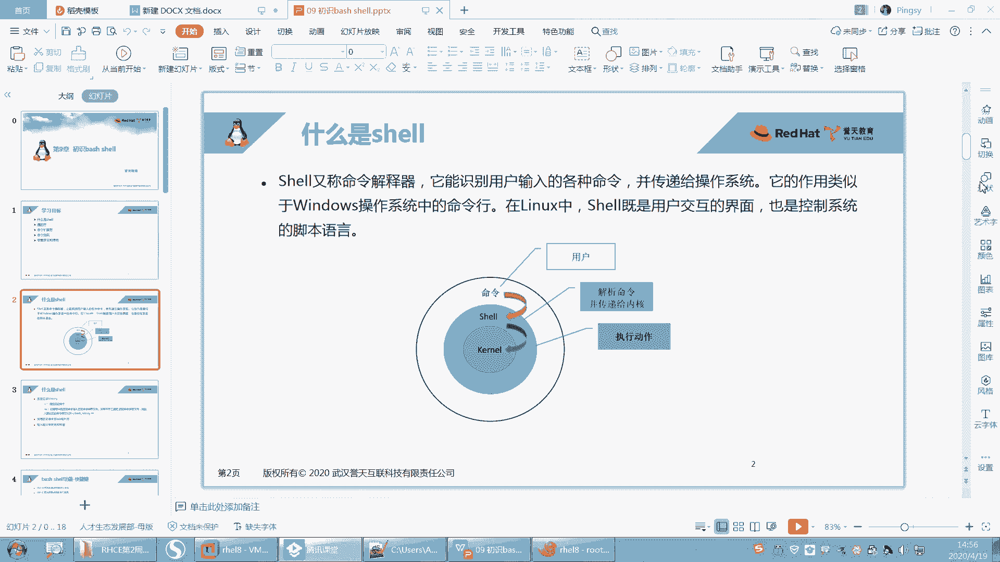
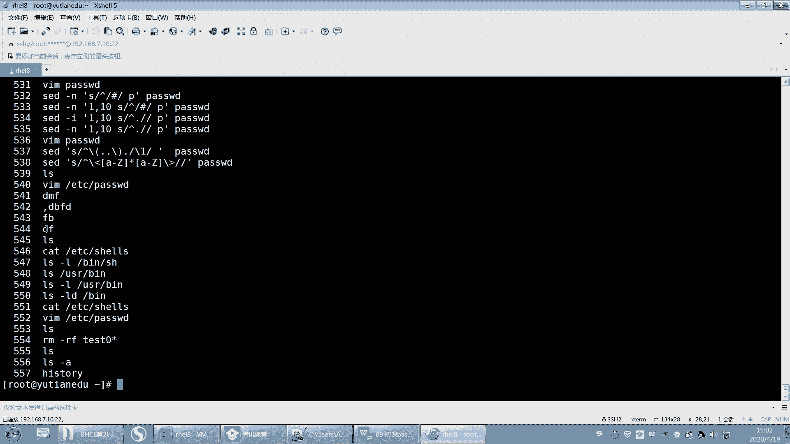
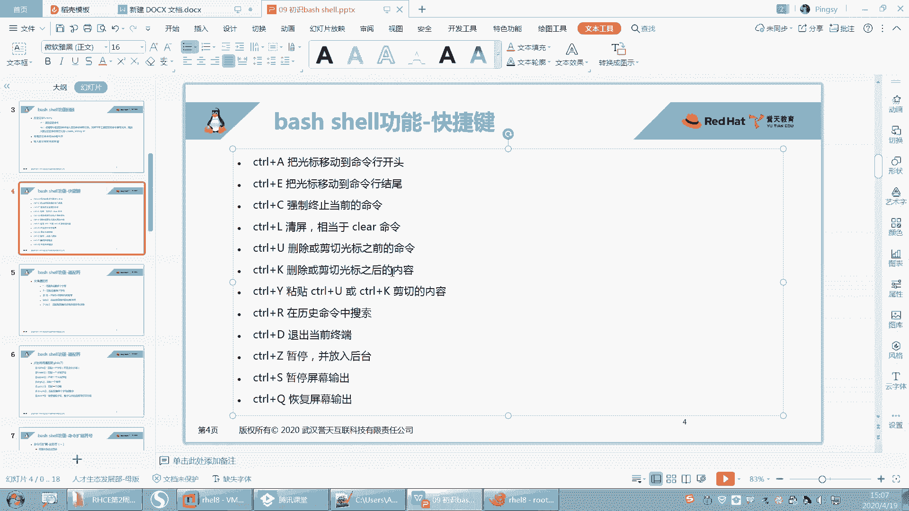
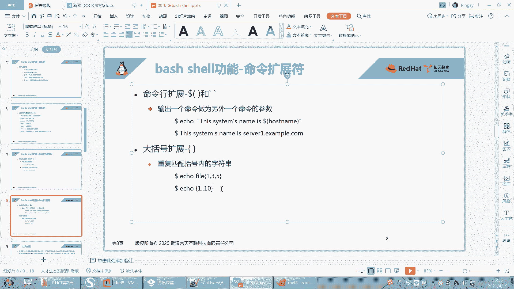
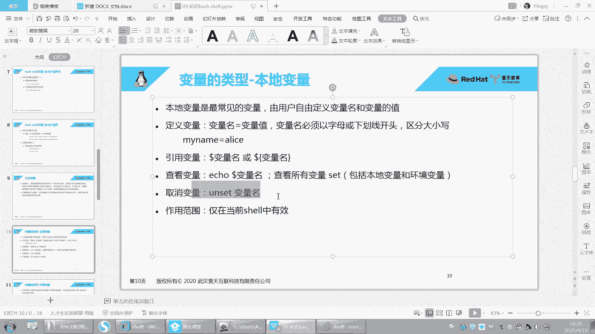
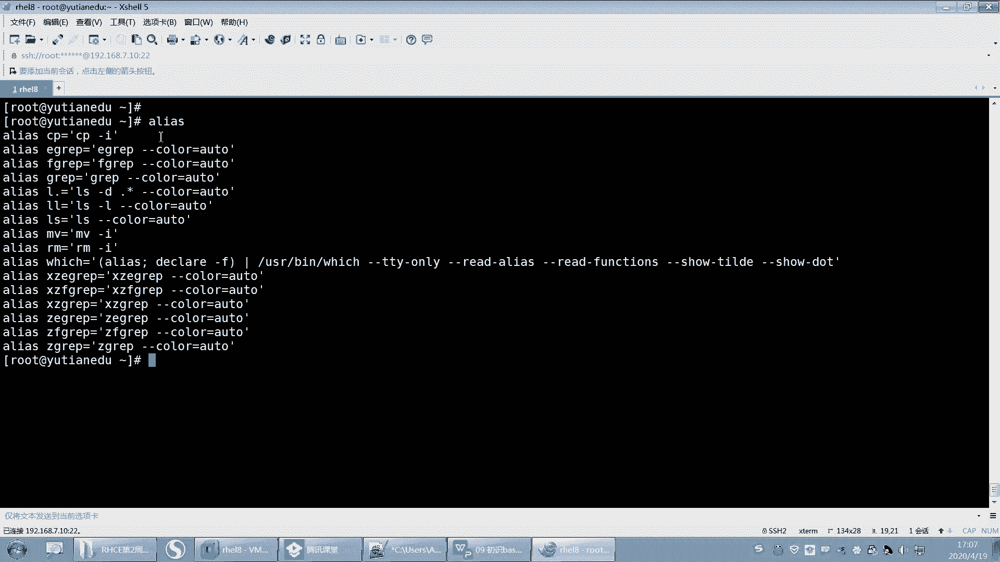

# 【誉天孙老师主讲】Linux入门／红帽认证／RHCE 8／RHEL 8.0／Linux基础视频 - P12：了解bash shell - 誉天孙老师 - BV1Dr4y1A7jz

啊呃，第九章啊第九章。呃，第九PT我都会放在QQ群里面，你直接去找去去加那个QQ群就是了。你如果在QQ群里面。嗯。每周的PPT我再说一遍啊，呃，因为我也要现做，因为我们之前是没有PPT的。

不是说没有PPT是之前我们是英文版的PPT。英文版的PPT啊，所以。呃，这个PPT是我现做的。能理解吧。对，之前有个英文版PP，我怕那个英文版的PPT对大家来说阅读起来比较困难。

所以我之前上课一直是英文版的PPT。嗯，然后这个班呢考也是在家，可能最近需要把这个事情给大家做一下，对吧？跟大家把这个笔记都做好。嗯，所以。呃，这个PPPT也是我现做的呃，大家如果你让我一下子发给你。

我现在发不出来，我我说实话我发不出来啊，但是每周我上完课我都会给他发，我把我这周上课的内容都会给他发，所以大家不要着急，O吧，不要着急啊，也不要催我，也不要去找我要啊，我这嗯每周我都会发。

大家到QQ群里面去下载。大家最好都要去加QQ群，为什么呢？因为我每次发的资料，我之前我就上个班的时候用的微信群，因为上个班开头不是我带的，后来我接了，我每次发资料呢，他每次都找我去要。啊，又没保存啊。

又没这个又没那个的，我每次要要发又要发又要发，你们全部给我加QQ群去，我们全部都发到QQ群里面。QQ群里面它会保留的时间更长一些，听到了吗？😡，啊，你们直接找资料去里面找去里面下啊。好。嗯。

就还有的同学说老师我不怎么用QQ，我用的都是微信，对吧？你就这段时间你用一下QQ能怎么样嘞？对吧？因为我微信的话，我两边来回发，有有的什么不同步，我就统一都发QQ群了。呃，微信群确实不好保存呃。

每次又过期了呀，又怎么怎么样，就就很麻烦。😡，你就这三个月上课的时候用一下QQ，我不信哪个同学没有QQ群啊。没没有QQ的。嗯。好，第九章啊呃认识初始我们第一次接触到这个东西啊，之前我也学过呃。

说这个he是什么东西。但是呢呃估计同学ear是什么呢？对吧？不知道哎，那这张呢我们就开始来学习一下什么是啊。那么这章我们呃学了就学一些呃入门的唉，后面呢我们会学尔脚本，那脚本我放在后面讲了。

而且尔脚本你用的话需要用到什么，需要用到前面的内容，比如说我们学过的内容，哪一张VM你会用对吧？IO管道你要会用呃，这个文本处理工具上上一章内容你要会用，所以这都是基础，对吧？这都是基础内容啊。好。

而且是比较重要的内容，基础既基础又重要。啊，那么我们来看一下这章内容，我们需要知道什么啊。呃，这章的学习目标我们要知道什么是share，什么是here啊，到现在为止我们还不知道我们只知道什么。

我们只知道哦，这里给我一什么，给我一个提示服务，在这敲命令，这就是share了，对吧？啊，可以在shaar里面去敲命令，对不对？好，大家同学新收回来啊，之前内容没听懂，晕了，就算了。

过去是呃喝口水换一换脑子啊，我们开始下一章了啊，跟之前那个没听懂没关系，这张跟那张没关系啊，是暂时没关系啊。😊。

OK吧。啊，不要再想之前的了啊。嗯。好，然后我们要了解一些通配符，在shaar当中，shaear支持的通配符啊，shaar里面支持的一些通配符。比如说信号啊、感叹号啊啊信号、问号啊等等这些啊。

还有命令的扩展符别多落符号啊，多了小括号啊等等啊，还有命令的别名，以及我们变量要会用变量，要会去设置变量，各种变量类型。啊，等等啊，都要会都要会啊，这是我们这张内容。好。

呃，什么是谢什么是谢啊。好，来我们来回顾一下啊。我们之前讲share的时候是在哪个地方提到了share是吧？是不是在文件的password里面的。最后。最后一列。最后一列叫SBno log in对吧？

是这个吧。呃，我们用的可以登录的here呢，是不是这个beb啊，这个是可以登录的hear，对吧？我们登进去之后，他给他给我去呃给了一个给了我，反正可以登进去，对吧？给我分配了一个命令行。

但是如果我把一个用户设置成BSB log in，那么这个用户就登不进去了，就是我昨天给大家演，昨天早上讲用户的时候他演示的对吧？啊，那就是不同的shaar，对不对？啊。

那么share给我直观的感受就是我可以在这怎么样敲命令了，看到吗？我可以敲命令了，对不对？好，那那到底share是什么东西呢？Oshare啊，它是一种命令解释器。

它能够识别用户在输入的用户输入的各种命令，并且将这个命令传递给操作系统。也就是说我执行那个LS。😊。

他怎么知道L是看呢？看当前目录啊，他是不是要去解释，那谁有由谁来解释呢？由shaar来解释，由shaar来解释啊，它的作用类似于在windows里面命令行是吧？这个这句话可以哦。

差不多windows是不是也有herewindows里面有个shaar叫power sharear是吧？也有shaar啊。其实我们还有图形界面的sar啊，还有命令行的sh尔都有。share是什么？

是用户交互的一个界面，也是控制系统的一种脚本语言。好，这就是官方的话啊，来看我来给大家解释啊，看这里看这张图，这张图啊，我觉得这张图还是做的比较好的啊。呃，这里有张图大家可以看一下啊。

我们之前讲系统的时候。讲系统介绍版本的时候，对吧？讲到过有内核，是不是这样啊？是不是讲了有个内核呀， kernel嘛，然后这是什么啊？我们整个把这个整体叫做是什么？叫做是操作系统，叫做是操作系统啊。好。

然后呢。我放大啊。这颜色换。好。我把这个整体交操系统，其实在内核的里面应该还有一个圈圈，这个圈圈它没有画出来。这个内核的里面我们叫做硬件。叫硬件啊，我就不写了，叫硬件。

然后硬件的外面是不 kernel啊？硬件的外面就是 kernel，对不对？😡，啊，那硬件的外面是 kernel，然后呃呃呃因为 kernel可以直接调度硬件，就是我们的内核是可以直接调度硬件的。

我们当时是这样讲的对吧？那么说有内核，光有内核还不行，因为内核呢呃它只能控制硬件，但是我们没有办法去跟这个内核去交互。就是说我没有办法去控制这个硬件，对吧？我没有哪一个入口能够去控制。

所以我们才有了什么最外层的操作系统。那最外层的操系统对吧？但是现在我们把这个操系统是不是。把内核加外面的这些东西，应用程序都作为一个整体叫操作系统了。但是最之前的时候。

我们仅仅是外面叫操系统操作系统的一些组件。因为应用程序而里面叫内核，是不叫内核呀，对不对？好，现在还把它分细了，又把它分细了啊。啊，你看这儿。他把这个内核跟中间有个here看到没有？中间有个here啊。

外面是命令，对不对？那么你看啊这个share在命令和内核之间看到没有？在命令和内核之间啊，好，假如说我在这个地方这个最外层，它给我一个提示符，我在这敲了一个LS对吧？那么系统怎么知道LS去看呢？

因为它要读嘛？或者是我写了1个VIM对吧？一个应用程序，那他怎么知道是要打开一个文件呢？那这个都是由什么由share来做翻译的。😊，翻译完之后，把翻译的结果丢给Kel来执行。那Kel再去调度硬件。

然后去执行硬件。比如说你要VIM写就写进去，读如你就读出来等等啊，就是一层一层这样子啊，那最外层跟我们交互的，是不是就是这个外层的这个命令，那么是不是由share来提供。然后我们在这敲命。

敲命share来解释，解释完之后丢给内核，内核来控制硬件。所以share呢是我们外层用户和内核之间的一个桥梁，它起到一个桥梁的作用啊，这个叫surear。O这能不能听懂？这能不能听懂什么叫shaar啊？

比较抽象啊，就是他给我提供了一个share之后，我是不是可以在这敲命令了呀？😡。

那他怎么知道LS是看呢？😡，对他是一个翻译的人，他是帮我去做翻译的这个人。😡，比如说你将来你在unix当中，你用的是比如说你弄的是C share或者是K share，对吧？它有别的什么sha。😡。

就系统上面有很多其他的shaar，对吧？那不同的shaar，它翻译的结果可能是不一样的，能理解吗？对，翻译的结果可能是不一样的，同样我都是执行在这个命令行当中，我同样执行一些快捷键等等。

那么我们用bush sharear解释出来的，跟用K share C sharear解释出来的是不一样的。OK这就是不同的shaar，统称叫hear。😡，那我们系统当中有哪些share呢？

系统当中有ETC下面的shares。😡，那我们默认啊当前红帽八只支持这些有SH sharear，还有bsh sharear。啊，有这些是吧？其实说白了这四个都是指的一个呃，你看啊。A病。呃。

SH它是不是链接到。他是不是链接到它？啊，然后你再来看呃，这个USR。Bing。哎。US啊。嗯，就并吧。啊，你看B是不是链接到USUSRB啊，所以所以它怎么样啊，所以最终都是哪个hear啊。

是不是USRB下面的here啊，就这个here，所以它四个是一样的啊。因为在早些时候我们呃呃linux版本里面，有一种shaar叫这种叫这种就叫就叫SH。对，有一种类型的叫SH这种sha。啊。

那后来呢我们又出现bush share，那bush share是兼容SH的，就是说你在SH里面支持的bush share，我同样兼容你兼容你啊，所以现在我们都基本上都用的是bush share。

当然在其他的版本当中，还有比如说K share啊，C share啊，比如说在unix当中，它是呃就是就不是bush share。但是unix呢。它不是发像bP还是什么功能啊，比如说我在这敲了一个命令。

😡，啊，敲敲敲敲敲敲对吧？我们说哎呀，敲错了。好，左右键是上是不是移动啊？好，然后改一下CO好，那左右键可以移动，对吧？但是在我们的unix当中，那个默认的hear里面，你不可以左右移动哦。

你左右移动就是乱码，不可以左右移动，你就得把它删了，重新敲，那这就是不同的hear，它的功能是不一样的。而且在unix默认的hear里面是不可以上下翻的。你看我们是上下翻，是不是？😊，呃。

翻那历史记录啊，但是在我们的什么，在我们的这个unix默认的 share里面，它是不可以上下这样去翻，而且还不能table键。😡，不能table键的，你想要多痛苦，我们bush share。

它可以table键，它可以支持table键OK吧？所以我们用unux的工程式，它就痛很痛苦，uninux的工程师它就很幸福，对吧？你用linux之后，再用unix，你觉得哇这是不是人用的对吧？

所以这个时候我们在unix当中居然也可以支持bush share。😊，对，在unix当中也可以支持bu share，你只需要装一个bus share的包就可以了。对你可以网上去搜。

搜bu share把这个包装上，那么它就可以支持table键，哎，就可以支持就然后你装上之后还需要改一个位置，还需要改一个位置啊，改哪个位置呢？是不是把这个用户的。把这个用户的这个后面这个地方啊。

是不是改成。并bush。那么这个时候我切换到这个addmin的时候，那么是不是就调用了bush share来帮我做解释，来帮我做翻译。O吧。这这这个能不能听懂，就是不同的hear，它们之间呃什么区别。

以及我怎么去用这个hear。啊，你一定要改什么，一定要改这里。这样的话我才能用到这个share。为什么我用addmin的时候，切到addmin用的是by sharear。

因为在这里定义了它的shaar登录share的类型啊。😡，嗯。啊，对它是立即生效的啊，就是直接改一下，它就可以生效了，就这个意思。好吧。

好。呃，之前不懂share的啊，到目前应该应该应该开始懂了啊。那下面我们我们的任务就是要学习在这个bush share里面，我们重点是bush share到底支持哪些功能啊，对吧？有哪些特殊组字符？

这些特殊字符分别指的是什么含义啊？哎，这是我们现接下的内容啊。😊，嗯。好，这个是。呃，希尔的一些个回顾啊，这个地方这个标题写错了。线儿回顾好吧。好，我们来回顾一下。

我们之前嗯其实已经用过sure的一些功能了，哪有哪有哪些呢？好，有一个历史记录叫history，我们可以去翻历史记录，对吧？好，有的同学说老师，那这个怎么清历史记录啊。

我上次是不是跟大家讲过一个怎么去清历史记录的呀？

呃，是不是这样去清呃，然后e口空是吧，从定向到呃，buush呃呃呃bu historyistory是这样吧，是不是这样去清啊，但是你清完之后，你再hiistory它还是有能理解吧，它还是有好。

而且有同学发现我在hiistory。我黑色ory看到了内容。呃，跟我打开点bu。点bsh呃history内容是不一样的。哎，是不是也有同学发现了呀，对不对？不一样的啊，是因为什么呢？😊。

它是这样的啊，就是你执行完这个这些历史记录，你用黑 storyory看的。

就是你的历史记录执行完之后，呃，它是保这个历史记录是保存在内存里面的，就是保存到内存里面的。

呃，他还没有写到这个点b黑里面。那么什么时候会写呢？一般在这个用户退出的时候，他就会写进去了。对，用户退出的时候就会写到写到那个黑呃点bu historyory里面。

啊，是这样吧，所以如果你想清历史记录，那你缓存里面的你想清的话，怎么清呢？叫history。杠C啊，我写的这sory杠C回去了就没了，看到吗？就清掉了。那你的点发。Forfi。哎，敲错了。

这里面是不是还有，那你就把它清把这个文件清空一下，所有的历史记录是不是都没有了？O吧，所有的历史记录都没有了啊。😡。

好，这就是清历史记录啊。清历史记录。啊，然后如果你想把这个当前这个historyory的历史记录本来是在什么？本来是在这个内存当中，你想把它写到这个什么写到文件里面，写到文件里面。

你就写一个什么historyory杠W就把它刷到把那缓存里面的那些历史记录，然后写到你的什么，写到你的文本文件里面，写到文本文件里面啊。

OK吧。好，呃，就补充了一下这个histtory历历史记录的啊。还有我们之前调用历史记录，对吧？感叹号啊，搜索历史记录，ctrl加R啊呃等等啊，对吧？那，这这些都是he。

就是bush share这bush share呃功能回顾啊。就是之前。好，然后还有table键补齐啊。当然如果你用最小化安装的话，table键是无法补齐的。table键补齐不了。OK吧？好。

我我们装了一个就是装了一个包之后，那个包怎么装，到时候后面再说啊啊，装了之后你就可以table键补齐了O吧啊这个也是bu share支持的功能啊，以及我们之前学到的输入输出重定向，还有管道等等。

都是什么都是bu share的功能啊啊，在其他的shaar当中，不一定是这样子的O吧，我们学的是bush share啊，是bu share。好，那么我再来看一下关于在bu share新的功能啊。

新的一些这个呃。功能啊呃，这个里面我给它总结了一些关于share的一些快捷键。快捷键啊就是。嗯，但是这些快捷键呢。嗯。

你快速移动的我没怎么记，其实你比如说啊。😡。

嗯，像你看像这种啊，比如说我敲1个CDEDC confinetwork对吧？好，我想一般我想回到这个命令行的。这头部对吧？那我就ctrol A。啊。呃，妈呀，ctrol A还不行啊。我一般都ho键。行。

嗯。

等一下啊。我卡住了。好，然后呃home键嘛。就了。就不想让我摁成功呗。我发现。啊，home键是吧，然后end键，那home键end键这样子吧，它还ctrol A，其实我没有这样记过，这个你看你自己好吧。

看你自己啊，那ctl Actrl E。

然后但是这个要记住叫ctrl C，ctrl C就是中断嘛，打断对吧？那打断打断重新来打断啊。好，然后ctrol L清屏嘛，那清屏对吧？清屏啊。还有就是呃。比如说你是可以，比如说你就control u。

那cttrol u你就把把前面都删掉了。然后什么control K把光标后面的都删掉了是吧？其实就是剪切，然后ctrol y。

那ctrol y。就又把它什么粘贴回来了，是吧？嗯，ctrolU减切ctrol y就粘贴。好，然后ctrolR是搜搜索历史记录呃，搜索历史记录啊，然后还有control D是退出当前终端是吧？呃。

这个你看啊这个ctrol D有什么用呢？就是你看啊比如说大写转换成小写，这个我其实我也演示过大写转换成小写。好，我写一个A小写呃，B小写对吧？那么想退出当前这个终端怎么办？contrl D结束看到吗？

那从这里退出来，crl D结束啊。哦。呃，还有ctl Z啊，ctl Z的话嗯，后面我们学进程的时候，我再教大家用这个好不好？然后还有什么ctrol S controllQ啊，这个没怎么用过。

暂停屏幕输出是吧？

就是暂停屏幕输出，这个你用一下，好吧，我这个我也没用过。好，大概就这些啊，你要记住的必须是哪几个啊，你要必须要记住的啊，ctrl C呃，ctrlL随便你啊，然后cttrol R就学过了吧。

ctl Dctl C就是我们后面cl D后后面会学啊这个。啊，其他的话你随便好吧，这些你呃你随便你想记就记，不想记就算了，好吧。

嗯，复制就是复制cttrol shift加C嘛。复制是不是ctrl shift叫C。呃，converl shiftcrl shift加C。哦，sorry啊，这个是我用的叉。

你在这个里面好吧，在这里面。呃，你看。选上。ctl shift加Cctrl shift加V就这样就复制嘛。啊，但是这个地方呢它只能用什么？它只能用这个呃。他只能鼠标不能用就选不了是吧？

复制这个还真不知道复制用什么。

这里没办法复制，这个好像没办法复制吧。

嗯，其实你这些你不用记，比如说我我一般都用远程连，远程连的话，你看我直接就。对，复制呢就你你一般都用什么putty啊，或者呃这个s share啊，或者是什么seecCIRT啊啊，反正这些工具连上去。

所以这些没必要没必要挤没必要记啊。

我也没记过。好嗯。

下面呢我们来看一下关于文件，就是bu share的功能之通配符啊，通配符。好，又来了啊。这些我其实之前是不是在那个正则表示里面都讲过了，是不是啊？那那这些又来是什么意思呢？好。

刚刚我们在正则表示里面学过了很多符号，比如星号啊。

中括号啊，那你把刚刚都忘记好不好？把刚刚都忘记啊，就是因为刚刚那些是匹配文本内容的，能理解吧？就匹配文本内容的时候，我们一般用正则表示。对，一般用正子的表达式啊。啊，然后这正能表示主要用在gra呀啊。

不不呃gra呀SED呀等等这些文本处理器文本处理工具里面啊。那么下面这个通配符是什么鬼呢？通配符一般匹配的是文件啊，文件名。

它一般是匹配这个文件名的啊，就是在我们的shaar当中，我们去匹配这个文件的文件名。我们一般用这个同配符来表示，比如说LS啊。对不对？后面呃比如说啊举个例子啊，呃我们之前。

呃，RM。杠RFt下面的星，对吧？这个是不是就是一个通配符啊，对不对？那么这个是不是指的匹配文件呀？time下面所有文件啊，那这就是通配符啊，还用来匹主要是用来匹配文件的。所以你要区分开来。

一定要区分开来啊，通配符和正策表式区分开来啊，因为我我之前好像是确实没有讲过正策表式。但这次给大家讲了。呃，讲了话大家就会弄混就会混掉啊。😊，哦，OK吧，不要弄混了啊。那你说不能说这是正的表式吧。

那RM怎么支持正的表达式呢？对，没办法支持啊，它只支持什么，它只匹配文件，所以它用的通配符啊通配符。好，在这个通配符里面，我们会学几个通配符，大家可以记一下啊。

好。呃，第一个通配符叫星号，这就是最常用的一个是星号，它匹配是0到多个字符，其实它指的是匹配0到多个字符的意思啊。

好，呃，什么叫匹配零到多个字符呢？我们现在先不用删除了啊。呃，我们这样吧，我们我们可以这样啊，比如说。嗯，我先清空一下吧。嗯。然后复制一些文件。寄一些文件过来好不好？这些文件过来，然后创建一些。嗯。诶。

B。对。然后A对谁。嗯，B的。好，先这先这些吧，好吧，随便创建了一些文件啊。好，嗯，现在呢我想去匹配这些文件文就这些文件的文件名，对不对？那我们可以用星号嘛，比如说ASLL啊。

呃我可以用星号是不匹配这个里面所有的文件啊，那它是怎么匹配的呢？它是这样的啊。它是一个一个去匹配。比如说。他就看A。A是几个字符啊？A是一个字符，那星号是不是0到多个字符呀，匹配吗？A匹配好。

B是呢B是别匹配，那这个是不是也满足要求啊，因为这是4个字符，那星号是0到4个字符，满不满足要求啊，满足。所以这所有文件是不是都满足要求啊？所以这就是星号的作用，那0到多个字符。

所以他会把所有文件怎么样全部打印出来。对，全部匹配上啊，全部匹配上。好，那么这个时候我们再来啊，如果我想去匹配A开呃B啊，比如说这个P开头的是吧？啊，P开头的那我就P星号。

OK吧，回车。那这样的话是把P开头都匹配到了呀。那么这个地方比如说我再创建一个P。😡，比如说P啊好，再来看啊，那LLP信号。那么这个P是不是有可能会匹配上啊，因为你看啊我回车这个P是不是也匹配上了。

为什么呢？因为这个P第一个你看这个P跟这个P是不是匹配，那么星号指的是什么？零到多个字符，那P的后面是不是零个字符啊，那零个字符是不是也也满足要求啊？O吧？所以那这就是星号啊。

星号指的是匹配零到多个字符啊，注意正则表示当中不是这样的，正则表示当中它指的是匹配它前一个字母，比如说点心，这个是匹配，么这是任个任意一个字符，然后星号指的是它前面这个字符出现零到多次。

所以它跟正则表示里面是不一样的啊，所以要区分开了啊。😊，好呃，这个是星号OK吧，星号啊，然后再来第二个。

第二个啊，问号问号呢匹配是。呃，一个字符单个字符。但是这个字符呢，我不管你这个字符是什么，反正就一个字符。这个是不是相当于正格表示了里面点。

正则表示里面的点对不对？好，那么就LL比如说问号回车，那么我输入一个问号，那这个问号是不是指一个字符啊，是不是指一个字符，那么这一个字符是不是有一个字符的是哪个满足要求啊。

是不是这个A啊ABCP这这就就一个的满足要求，对吧？好，那如果说我输入一个什么？比如说呃C开头。😊，呃，那么问号，那么这个问号后面这个问号是不是就一个字母？那也就是说这样我匹配下来的话。

CC问号是不是有两个字符啊，两个字符对不对？然后第一个字符是C，第二个字符是不是任意呀？那第二字符是不是任意啊？对吧所以这样我匹配下来的话，是不是没有任何呀？没有一个是C开头的，并且后面带有一个呃问号。

对吧？或者你可以这样。LALA问号有没有啊，没有没有对吧？没有以A开头，并且后面带一个字母，也就是说起码它是。它限制条件就是两个字符。对，两个字符啊。好，这个就是问号啊，这个就是问号。那LL问号星。

那这个是不是指前面第一个开头是一个字符，这个字符无论是什么，对吧？无论是什么吧，随便你是什么。那后面是0到多个字符，也就是说其实你至少要匹配一个字符吧，那就这就这个意思。😡，好。所以所以我告诉你。

如果前面没听懂，你就把它放，你就先放着，先放着，先不管它先不管它，你就听我现在讲什么，你就听什么就可以了啊。好嗯。通配符O吧？通呃这个通配服务啊。好，那剩下的这三个跟我刚刚讲正则表示里面的。

是一样的，用法一模一样。对，刚刚你听懂了，那这你也能听懂，刚刚没听懂，你再听一遍，好吧，再听一遍啊。

好，我们刚刚说这个问号啊，是不是匹配一个字符啊，但是这个字符是不是不界定是什么，不管它是什么，我都匹配，就一个字符。但是我想匹配什么？这个地方它有可能是ABC看到了吗？

就是第一个字母是A或者是B或者是COK吧？A或者是B或者是C啊，后面是一个星号，那么这个星号呢指的是0到多个字符，对吧？所以第一个字母是A是B是C，后面不管了，回去。那满足要求的是不是这些？啊。

看懂了吗？你一定要记住中括号括起来的一定是一个什么一个字母，不是三个啊，不是三个ok吧，不是三个再说一遍啊，重要事情说三遍。因为有很多同学他在匹配的时候，他把当这三个字母匹配了。啊，当ABC对吧？嗯。

对任何一个它只匹配一个啊。好，反过来我可以怎么样。啊，那你说。那这样啊。那你们来告诉我。呃。下面这两个怎么匹配？呃，就是呃怎么说废话嘛？嗯。好，这样吧。我们还可以加一个什么间号，对吧？是不是加个间号啊？

😊，啊，加个键号的话就是。第一个字母不是ABC是吧，而是其他的任何一个就匹配那就匹配到P是吧？嗯，没问题吧。好，那我如果按照这种方式再去匹配下去的话，那我怎么把这两个匹配到呢？你想一想。

如果按照这种方式去匹配的话，那我怎么就把这两个匹配到，是吧？好，你就可以加一个什么。加一个。问号对不对？回去那。那为什么加个问号呢？因为这个字母不要，他说只有一个，对不对？

那么问号就是说后面你在后面至少有什么这个地方有个字母字符，这个地方有个字符，那这个地方是不是至少有两个字符，两个及两个以上的字符，是不是就是它呀？对，就这这两个嘛。对吧那这个P不满足不满足要求。OK吧。

啊，没问题吧，再来啊再来啊。No。我发现这个。5。8这系统还是我电脑的问题啊。下次重新换一个文墨试一下。老是卡住啊。呃，还有你看啊，如果你time清空的话，有个什么问题啊？你time清空。

你RM杠RF新是这样吧，但是是不是会还会有一些隐藏文件，这些隐藏文件是默认是不会被匹配匹配到的。所以如果我想清空这些隐藏文件，我我怎么办啊？我要去匹配他，对不对？我就要这样去啊点心看到没有？嗯。

RM杠RF点心啊。好，这两个文件它不会被清掉，因为这个是呃点和点点。点和点点啊，因为我它其实为什么不能不清掉？其实按理来说它也能匹配到，它也匹配到了是吧？那这两个也匹配到了，为什么不没清掉呢？

是因为我在这个目录下面，所以它没有没有清掉。如果不在这个目录下面，有可能就清掉了。有可能就清掉了啊，所以要注意OK吧，注意啊，点是指当前目录点点是指上一层目录啊。好，这样的话就没了。好，我来复制一些。

嗯。这样啊，我我再再再再再来一个啊ABC点。诶。好，那出题啊出题啊。嗯。我想去保留ABC点贴题，其他全部删掉，不要了。嗯。把这个文件保留，其他文件全部删掉，不要。好，给大家两分钟时间做一下啊。2分钟。

坐一下啊。就这个。把这个文件保留下来，我再说一遍啊，把这个文件保留下都不要了。😡。

其他都不要了啊，OK吧，用到我们刚刚所学的这些。

对，原来我们刚刚是所学的这些啊。Okay。不对。你这样明显就把它删掉了呀。你试一下嘛，你自己你试一下，你看。我我刚刚是把root下面的文件复制过来，并且创建了1个ABCD电器。你可以你可以你可以试一下。

你你这样匹配哦，问号问号，你这不刚好把它。PP到了吗？你这个不行，因为你这个不够特殊，你要得看我这个。嗯，你这个也不行。不能满足要求，你这个是除了A以外的图选调。第一个除了A以外都删掉。

那我第二个有可能就删不掉哦。就没有同学想出来吗？季节松，你这个也不行。没有。就是刚刚。你们写这个的同学啊，就是写ABC的这个同学的叫匹配，只要是匹配ABC这个同。呃，这个这个这样匹配的同学呃，都是刚刚。

就是忘记了啊，中狂是匹配几个单几个字母啊。章程是RM，这个也不行。张成，你这个也你这个。

你这个是第一个字母，除了X以外都删掉。你这全删掉了。也不行。其实这个很简单，真的。这个很简单。

还没有同学做出来吗？我这个地方通配服不多吧，就这就这几个啊星号问号。那虽然学起来感觉很轻松，对吧？但是以实际应用哎就就不知道怎么去用了。

真想说是RM。你这个是。什么意思啊？除了点ABC以外都删掉。除了点ABC以外，都删掉。哦，不对是吧。除了AB以外都删掉也不行。那第二个删不掉啊，反正你匹配第一个的话。也删掉。那高伟同学。

你看第一个字母是除了A以外，第二个字母是B，那你不是把它删掉了吗？你是不是要这样执行啊，注意你大家不要去匹配什么啊，不要去匹配这个B啊你。你匹配B，你那不是把它匹配上了吗？而且你这个是匹配什么？

你这个是匹配的是这个两个字母。两个字母。好，算了，不为难大家了啊。还没有同学做出来，之前都有同学。😡，做出来的。之前是有同学做出来的。不行啊，季节送你这个不行。呃，江道龙这个就是有点像对吧？

但是你试一下也不行。好，来看我这里啊。其实这题很简单，你只需要找出这个文件跟别人的不同点就可以了，对吧？你去说匹配第一个。有很多同学是把第一个给匹配上了，你看像这个同学呢。😊，呃，你这个。你这个。

不行啊，大哥。不能不能你不能把这个东西都写在这个里面啊，你这是这是这是中括号括起来，是一个字符，OK吧。😡，它不是匹配这个字符串的不是匹配这个字符串的，OK吧。还有你看冯小男同学是这样的啊。

他是呃最后你是TSE啊，你这样是不是就把它给匹配上了呀？如果前面我算你没有没有错误的话，你就把它给删掉了呀。我是除了他以外的保留它呀，你要把匹配其他的，你的目的是匹配其他的文件，而不是把它给删掉啊。

而不是给他把删掉。好好好，这个没想到啊，大家没做出来哦。好。😊。

这样啊你只需要看这个文件跟其他文件有什么不同点。有同学发现了哦，它是以点TT结尾的对吧？它以什么怎么结尾，但是我们有没有讲过以什么什么结尾呢？好像也没讲过是吧？那你说匹配哦，它有几个字符。

你不能匹配它呀，你匹配是这些，你是保留它，对不对？好，这个文这个地方其实很简单，你没匹配第二个跟匹配第三个都一样。因为因为。😊，只有第一个文件的第二个字母是B。只有第一个文件的第三个字母是C。

想起来了吗？会了吧。好。第一个字母的。第一个字母的，你看啊第第二个字母，第一个字母管不管呢？第二第一个字母是不管，第二个字母是B，那是不是就这样啊？😡，啊，OK吧，是不是这样B嘛。

这是把第一个这样匹配上了呀，但是我不要它嘛，我不要把它删掉，把它去掉。所以中口要括起来。然后第二个字母除了什么B以外的都匹配，而且这个地方你要怎么样啊，你不能加点切AT啊，你加点切AT。

你是想把它匹配上吗？你不是要把它匹配上，对不对？所以应该怎么样？😡，第一个字母无论是什么，但是第二个字母不能是B。呃，第二个字母不能是B，看到没有？啊，你要根据它特点呢，然后再星号啊。

而且第二个字母的是B，后面我管不管它是什么，我不管它是什么，反正你第二个字母不能是B。😡，OK吧，就针对这一题啊，你要根据具体情况来去做嘛，它可能不能适用于所有的这个文件。但是你要根据具体情况去来匹配。

好，那后面就要星啊，你不能不加星啊，不加星话，这样的话是不是只有两个字母啊，你想哪哪个是两个字母的呀？没有啊，这些都不止两个字母吧，所以后面加星号回车来。

留了。看到了吗？啊，看到没有？啊，你怎么去回去练啊？你这样我是把root下面所有的文件复制过来了，你可以这样，你可以自己去试O你可以自己去试啊。那我执行了这个，然后创建了1个ABC点TIT。😊，好。

我们下课休息一下，你你你你下课再去练一下。啊，把我刚刚那个那个那个那个那个消化一下，好不好？

就讲了这三个啊，不就讲了这些，就讲这些通配服务。唉，正好是吧，我这下课还蛮准时的。

这一看就是个麦霸。对不对？好。呃，同学们回来了啊，呃我下课呢突然想到一件事情啊。😊，就是下课的时候，我都一直在想一件事情，想什么事情呢？嗯。是不是我对大家太凶了，感觉我突然想到这么一件事情啊。😊。

应该还好吧。嗯。啊，就是呃如果我有有那个对你可能就是凶了一点或者怎么样啊，就是呃你们不要不要介意啊，就是我对你没有什么恶意，就是没有什么恶意啊，就只是可能在学习这方面呢，有时候比较较真。

就有有有时候比较认真了，一认真起来就就就就有点那个了，知道吧？就是。嗯，对，就是就有点有点那个了。所以所以大家就是呃可能我上课怼你了是吧？但是怼你不是不是说那个啊，就是你千万不要因为这个事情。

然后对我心里记恨，对吧？说完了我就下再不想看到这个老师了，他怼我。😊，ふふ。希望大家不要不要这样想啊。这是。嗯。因为我下课突然就就感觉是不是那个。是不是那个对大家太要求太太那个了，太太循环是吧？

因为我本来性子。又有点也比较直，就是有有什么话就说说什么话，有点直，这是。藏不住话是吧？啊，希望大家能够见谅啊，我们就我们谈来谈来学习的啊来学习啊。好。嗯，所以大家就是也不要。

因为我我就怕我哪方面可能言语上啊或者是方式方法呀，对家可能哪个地方做的不是很好。嗯，但是呢。呃，我的出发点是好，出发点是那个也希望大家。嗯，对。うふ。好。嗯，那大家能够达成共识更好啊，我们达成共识更好。

所以我是帮大家呃把大家当做这样的朋友，或者怎么样一起来学习，我们相互学习啊。然后你们也有可以当做我的老师，对吧？我的或者是我都没有接触过的。对吧那你们接触了，那你们就是我的老师。那在这课堂上。

我是你们的老师，对吧？然后学生要听老师的话，是不是这样？好。OK嗯，那我们继续啊。😊。

刚刚其实我们就把这个通配符这个地方呢呃跟大家呃就是。呃，稍微讲了一下啊，其实也还好，这几个用起来其实还好。但是真正的时候根据需求来去回顾来去用这些知识点的时候，你可能就想不到这个其实也正常。

因为你要多练多遇到，对吧？嗯，然后才能去实现呃，就是啊一下子就能想到，因为这个东西确实就是经验，有时候就是经验用多了，就就就这样啊，当然也要看你们对这个掌握的知识点牢不牢固。就是我知不知道对吧？

像有同学用的是匹配ABC的这种，那一看就是什么，他就不知道这个中括号匹配是一个字母啊。

对吧中高括起来就是一个字母，所以你要先理解它的含义，然后再去用它，对不对？嗯。

好，嗯，这个是通配符啊，就说到这儿了，就说到这儿啊，通配符。呃，这一周内容还是工还是这个量还是比较大的啊，因为很多很多特殊特很多符号出来了。呃，后面我们还在学谢的时候，还会学到一些符号呃，就比较多啊。

啊，除了通配符，除了我们学的这几个通配符以外，我们还有这些通配符。还有这些通配服务啊嗯。这通背服呢是比较常用的，我列了几个在这儿。

当然还有很多其他的，比如说man一下man一下7globe嗯。glove是吧，就这个啊。这个下面它会有一些这个。呃，在这儿看到吗？但是他这个地方好像没有解释。没有解释说这个是什么意思，对吧？

不过这个也难不到大家吧，你就直接。实在不行，你百度去，对吧？反正这个工作了嘛，又不像学小学生非要。呃，非要记下来或怎么样，你就去查就行了，好吧。啊，然后去用它，那这也是一种通配服务。那它怎么用呢？

看这儿啊看怎么用啊。嗯，我想匹配首字母是小写字母的。啊，首字母是小写字母的啊。好，看哦L。首字母是小写字母，那首字母第一个字母是小写字母，那第一个字母我怎么表示是不是用中括号括起来，是不是第一个字母啊？

😡，对不对？那后面是什么管不管啊，不管对不对？那也就是说我现在要去匹配小野子么要小写字么是不是A到Z啊？😡，是不是A到Z这样去匹配啊？有。这个大写是BPP。哎，这个大写等一下啊。嗯嗯。LL。啊。

其实这个是没哦，这个是这样的啊。它这个上面没有，这些不是匹配到的，这个指的是什么呢？指的是他看目录里面有没有。对，目录里面有没有啊，这个是没有匹配到了啊，匹配这这几个呢这小写字母OK吧？好。

那这是一种对吧？那我们今天又学了一种新的同位符务，就是这个啊它可以。😊。

用你看啊是这个消息字母就这个就lower lower。好，呃，这个地方的话，我这样吧，我们把这个中括号去掉啊，不加这个中括号，这个中括号不是加在这个外面的。

不是加在这个外面的啊。等一下啊。问区。可能。呃，它就只有单纯的一层中括号啊，只有这一层。好吧，我把这个改一下嘛，PP改一下啊。

没有，只只有一个啊。好，这这一个整体就作为什么？这一个整体就是一个小写字母。那不是啊，不是说这一整体就是小写字母，就是这个这个地方就代表是小写字母。😡，好哦，我知道为什么当时加这个中括号了啊哦。

我知道为什么加中括号了。好，我先还回去啊，因为你看。我有。嗯好，先不看PPT吧，我把它拿过来看这里啊。😡。

看这儿啊。啊，LL我们说匹配一个字母对吧？后面是无论是什么，然后这个是小写字母，那小写字母怎么表示A到Z是不是这样，但是我不像我不像这样去表表示，那我就可以用那它整体就是这样的。就就这样看到没有？

回去了，那那这个地方是不是就小写字母，看到了吗？😡，那这个整体代表是小写字母，其实是不是它相当于是。ABCDE这样所AA到Z啊，是不是相当于A到Z。O吧？能听懂我什么意思什么意思吗？

这个地方指的是小写字母，但是外面又加了一个中括号，指的是不是就是匹配一个字母？😡，这个字母可以是所有小写字母当中的任何一个小写字母。能理解吗？就这个lower啊，或者说匹配代写字母。😡。

代写字母的呢就是upper嘛，upper。对吧那这这是不是就大写字母那。大写字母刚刚那个LLL杠A到Z好像有点问题是吧？匹配的有点问题。好，这样我加个D。好，你看这样就出来了。因为我们看目录本身的话。

看目录本身是不是要加D呀，对吧？因为刚好这个大写字母都是目录嘛，大写字幕都是目录，所以你加个D加个D啊，加个D。好，看文件也可以加D嘛。你看文件也可以加D吗？那看文件也可以加，所以就加D加D啊。好。

那这样的话就是大写和首字母大写和首字母小写。

好，还有比如说匹配数字啊，数字呢，数字的话就是什么？数字就是digital，对吧？所以在这个地方我外面又加一个中括号，是因为什么？是因为什么嗯，这样吧。呃，我我给大家把这个PPT改一下，免大家误会啊。

我还是把这个去掉，还是把这个去掉啊，然后我把后面的注释改一下。这样。那然后匹配呃匹配一个字母匹配字母就是所有字母啊，这这是就是什么所有代表所有字母。然后这个是匹配小写字母，匹配大写字母匹配数字。

匹配空格，匹配呃任意字母和数字，然后呃就啊就这样啊，所以那你外面你怎么去用，你是不是看你你加中括号也好，对吧？或者加怎么好，那你就自己去外加就可以了啊。其实这个整体指的是小呃小写大写好。

我要给大家列了一些用法，大家直接去用就可以了，好吧。

嗯，OK还要匹配空格呀，那你怎么匹配空格呀，你就这样去匹配空格。比备空格啊。好，那这个就不说了啊，同佩服。那还有波浪号，对吧？波浪号波浪号之前也讲过了呃，它也是我们share的功能。

所以我都写在了这个PPT里面。然后波浪号是指用户的加目录，波浪号是指用户的加目录啊，默认是指当前用户的加目录啊，如果是指某一个用户的加目录，那么就波浪号加上用户名，这个是第一天第一周的第一周课程讲的啊。

第一周的课讲的。讲那个文件系统啊，第第二天下午是吧？

啊，这个还要不要说呀，你不用说了吧。比如说CD到波浪号admin，就进入到addmin夹是吧？然后呃然后波浪呃VM波浪号点bu。RC那就是打开什么当前加目录下面的一个点bu是RC。

然后我还可以打开addmin下面的。呃，点把小C这样子啊，O吧。

好的命下面点B小C。好，这是波浪号啊。好，下面呢我们来再看一下关于命令的扩展服啊，命令的扩展服。

好呃。我们之前学过一个命令，这个命令呢是我之前提到过，但是我们有单独说就是eal eal hello看到了吗？那eal什么东西就显示什么东西，对吧？好，我想显示一个嗯，比如说我想显示一个。嗯。

选示个东西选示个eco the呃 the system。呃，name啊这个语法可能不太正确啊，stems name。呃I。嗯。postst name是吧？好。看这儿啊，我eco后面这一段内容。

是不把后面这段内容打印出来了，对不对？好。那么其实我想显示的是这个系统的名字是主机名，这个主机名呢是叫玉天EDU就是我系统的主机名叫玉天EDU但是在这儿它是不是就显示叫ho name啊？

那我想让它显示什么呢？我想让它显示玉天EDU。那同学说你想让写天EDU，你不就写天玉天EDU不就行了吗？但是你写玉天EDU，你是不是这句话只能用在这个系统里面啊，那你就换一个系统，那你这句话就不能用了。

对不对？所以有的时候你不知道你的系你的而且你的主机名有有可能是不会变。好，那因为我们系统当中有一个有一个命密叫hos name。对不对？那有一个命令叫hosse name。好，那么这个命令在这个地方。

我们系统有没有把这个host name当做是一个命令在执行呢？其实显而易见，我们是没有把它当做命令来执行的，只是把这个字符串是不是原样给输出了，它是什么就输出的是什么。没有把它当命令。好。

但其实我想让他怎么样，就让它作为一个命令来执行。之前我们讲说一行当中是不可以有多个命令的，对不对？不可以有多个命令的好，eco那他又让它把它当命令执行，我们就得用把它特殊符号把它给怎么样括起来，让它。

执行对，让它执行啊。好，怎么让它括起来呢？我想去调用这条命令执行的结果。调用这条命令执行的结果啊。好了，就这样。只需要在前面加一个多了符号，加小括号就可以了。看到了吗？那eal啊。

the system名字is host name啊，你们可以记这个特殊符号啊，叫多了加小括号，多了加小括号啊。

多了加小括号式是什么意思？中间是command，是命令哦，中间是命令啊，它指的是调用命令执行的结果。记啊，它指的是调用命令执行的结果。好。

也就是说，当我在后面碰到多了加小括号的时候。他就会把这个里面是不是当做是命令，然后把它给执行啊，执行完之后是不是引用了这个命令执行的结果OK吗？是这样吧，好。那如果我写的不是一个命令呢。

我写的是一个随便写一个，比如说hello，这个hello好像不是个命令，对吧？那我写了一个不是命令，它是不是就。😡，识别就就就能判断它不是命令，然后显示hello呢。

或者说就把它当hello命令来使那个执行呢。好，看一下啊。😡，我们执行完之后，它就会报错，因为它只要碰到了在后面这个里面碰到多了加小括号，它就要把这个小括号里面的当做命令把它执行了。但是在这执行的时候。

这个命令是不是？不存在呀不存在是不是叫报命令找不到，看到没有？😡，啊，只要你用多了加小括号括起来，它就会当命令，所以中间一定是命令，中间一定是命令，OK吧，好。所以这就是多了加小括号的作用啊。😡，哦。

所以说这样也可以是吧？啊呃，这样是可以啊这样。就是这个。啊，这个这个符号啊这个符号呃看着很像单引号，对吧？但其实不是单引号，它指的是你的这个键盘的。呃，哪个键啊，就是你table键上面那个键。

table键上面那个不是波浪号吗？波浪号波浪跟波浪号同一个键的那个那那个那个键呃，是那个啊返单引号是这个。😊，反撇号。对，反撇号啊，不是单引号注意啊，它不是单引号。但是这个呢呃我们自己用的话我们很少用。

因为它很容易跟这个单引号搞混。有时候你分不清楚，你看不清对吧？还他以为是单引号啊，但是有很多脚本里面它确实用的是这个符号，你也要能看懂okK吧，你不用，但是你能看懂啊，你用也行，只要你能看清，好吧。

这两个符号是一样的啊。这两个符号是一样的，OK吧。好，所以就多了，加小括号啊，多了加小括号。好，你比如说我eal data是吧，这样是不是显示时间呀？但是这个我本来想让它显示时间。

结果呢他把这个字符串打印出来了是吧？所以我想让它显示时间，我就加一个什么多了加小括号嘛。😡，对不对？多少加小括，而且我还可以往里面加一些什么，就是说加百分号呃，百分号Y，这是我之前学过的。

是2020对吧？就一口什么什么东西啊。好，那大家觉得这样我可以执行吗？就多了加，然后host the name。这样可以执行吗？那我就直接多了，我不加E扣嘛，本来E扣是什么？E口就会显示预天EDU。

对吧？那所以说你干嘛多此一举啊，你直接这样不就行了吗？你加个E扣干嘛呀，对吧？😡，好，如果是直接这样执行的话，他会报什么错呢？好，你们可以去想一下啊。我们说遇到多了加小括号。

是不是就会加括号里面的内容开始执行。然后这个时候就会执行hosse name。hosse name执行完之后是不是叫预天EDU？好，那么在这个命令行当中，是不是相当于就引用了一天EDU。

那在命令行当中相当于就执行了一天EDU。就会报这样的错，你看你把它拿过来，它报错应该是一样的。看到了吗？啊，所以你只要碰到了什么多少加小括号，就会把小括号里面当做命令的，把执行，然后把执行的结果调用。

啊，把把结果调用啊。

好，懂了吗？多了加小括号。嗯，好，然后这个呢多了加小国跟这个这个他们两个是一样的用法啊是一样的用法。这个经常经常用啊，这个非常重要啊，非常非常重要。呃，他去引用一些秘令执行的结果非常非常重要啊。

呃，比如说啊我举个例子。我们想复制。仿复制啊复制ETC。呃，复制ETC到tamp下面呃叫ETC。而且。嗯。好，而且呢我想给大加一个时间，比如说我想加1个20200419加个时间，对吧？

那这样你复制可以可以这样去复制，对吧？嗯。老是卡。嗯，没复制过来吗？嗯，GP杠RTCtime30。好，这样就复制过来了啊。啊，这样复制过来了啊，那么这个时间是不是我自己指定的呀？

假如说我每天都要都想去复制一遍，今天复制一遍，明天复制一遍。而且这个时间要加上是当前的时间，当也就是今天复制的时候是今天的时间，明天复制的时候，明天的时间，后天复制是后天的时间，对吧？

那这个是不是相当于是一个它变化的值啊，那你这样是不是写死了，是不是写死了，明天写就写0420，对吧？好，这个时候我就可以这什么？我就可以去用这个哎，用什么？😊，是不是可以用一个时间来表示啊。

这个时间是不是也可以用do了 date啊？那么do了 date的结果，do了 date的结果是不是那串呃没有，就是很难看的什么那个星期几啊，那一串是吧？所以我要改变它的输出啊，那就加什么呀，百分号Y。

然后百分号M百分号D，是不是这样啊。啊。OK吧。嗯，但是我们之前已经复制过一次了，是吧？うか。反应动な。好，再来一遍啊，回车。你看是不是就复制过来了，那明天我是不是还可以就就还是这条命令啊。

明天还是这条命令，后天也是这条命令。所以这个就是遇到多了加小括号，就调用这个变量执行的是吧？好吧，就调用这个命令执行的结果，OK吧，这就是经常会用到的一个多了加小括号啊。😊，嗯，OK。好。

多少加小括号记好了啊。然后下面呢我们来看一下，还有一个叫大括号。大括号。大括号指的是啊这样啊嗯。我们想创建一个文件，比如说创建一个文件，那你说我创建A创两个文件BC这样行不行啊？哇，这还还真可以。哦。

这样是可以的是吧？我记得之前好像好像不行哦，这样是可以的。好，或者是我创建什么，我创建fill一呃，fill2啊，fill3这样是不是是不是很麻烦，对吧？所以它可以合并，就这样啊。

fill因为前面都一样嘛，后面就是一。23这样子回车。看到了吗？就非要123，所以大括号它指的是记啊，大括号指的是依次匹配大括号里面的内容，就依次呢外面的内容依次去匹配大括号，那这样去匹配。

这样去配这样去匹用括号里面的内容。好，再来一个啊。好，你看啊我创建一个目录。创建一个目录啊，然后这个目录呢是A括号ABC然后。123，反正就是目录嘛，管叫什么名字呢？好，这大括号括起来了，对不对？

然后这个是指这个分格符目录与目录之间的分隔符复目录与子目录之间的分隔符。那么这个我们创建下来之后，它就会创建多少个目录出来呀？你看。他。6个。你这数学没学好啊。嗯。9个是吧。好。

所以啊你啊它是不是这样去匹配啊，这样去匹配，这样去匹配，然后这样这样这样这样这样这样是吧？所以它至少应该有9个吧。啊，至少最终会创建9个啊会创建9个，所以ASA下面有3个SB下面有3个ASC下面有3个。

所以大括号会了没有啊，大括号会了吧，啊，大括号还我觉得还可以这样用呃，比如说嗯。呃，连续的啊，比如说fill。比如说我是一段连续的那比如说。4。点点9。就是连续的连续的部分点点。O吧点点回车。

就连续的那就是4到9，看到了吗？就连续的一段。呃，数字或怎么样，它就可以中间用点点表示。点点，所以选两个啊，一个是逗号隔开的，还有一个是点点啊点点。

那这两种啊这两种。逗号隔开就依次去匹配1211135，然后这个就是1次比12345678910。

或者是你看1到100都可以。你看100个是吧，它有些匹配啊。

好了吧，呃，那那继续啊。好，大括号讲完了呃。大括号是吧呃，这个多了符号，然后再来啊，下面我们看一下变量啊，看一下变量。好，变量大家应该也不陌生了啊。呃，你们从应该是从小学开始。

是小学吧还是初中啊？好像就学过2元1次方程是吧？学方程嘛，X等于1。X等于一Y等于什么呃，什么什么什么是吧？啊，这种那X这就是一个什么，它就是一个变量，Y也是一个变量，对吧？然后呢X加Y就等于3。

是是是这样吧，啊，它是一种变量。所以变量呢，我们其实很早就已经开始接触了。包括我们现在在学sar shear里面也有变量。

线里面也有变量啊。好，那么变量呢顾名思义就是一个可变化的量，对吧？当然呢呃变化变化的是变量的值，也就是X。

这个变量X变吗？X不变呀，是不是一直是它X呃赋予的值在发生变化呀，对不对？啊，今天等于一，明天就等于2，后天等于3，对吧？所以叫叫变量嘛，它的值一直在发生变化啊。😊。

那么几乎我们所有的程序语言里面都有会去定义这个变量，而其含义也是大不相同，那么有了不一样的啊。啊，那从本质上讲呢，变量就就是什么？就是我们保存数据的一块内存空间。

而变量名呢就是这块内存空间的地址啊等等啊。啊啊保存这个这个内存空间的内容可能发生变化。但是这个地址就是说变量名不变，但是变量的值再发生变化。好吧，这就看一看就行了啊，这是它的一些定义。

好，下面我们来看一下关于变量部分啊。嗯。你先先看我先看我看我讲啊。啊，我们定义一个变量。定一个变量啊。这个变量名呢在我们linux当中啊。啊，比如说A。呃，是个变量名。我给这个变量负值呢。

就A等于100，它就负值了。就这么简单，非常简单啊，而且我们变量在share当中。它的变量名啊，你可以你可以记一下变量名一般情况下大写。就是比如说A等于100，这样行不行？也可以。

但是就是说它是一个就是就是一种习惯吧。就是说一般情况下变量都要大写啊，变量都要大写。你比如说有的语言里面，它属欢首字母大写，对吧？比如说fall啊，这样子是不是？但是我们定义就是。😊。

fill啊就这样去定义啊。所以在线当中，你一般情况下啊都是什么变量等于这个什么。啊，变量都是这个大写字母啊，变量大写字母，而且变量呢。这个变量比如说哎你可以是么？变量这个你可以A呃，一等于100。

对吧但是你不可以怎么样，2A等于200哦，这样不可以看到没有？这样就报错了，你就是不可不可以是数字开头呃，需要什么开头呢？需要字母和下划线，下划线也可以，比如说A呃等于100，这样也可以。OK吧。

徐建同学稍等一下啊，还没讲那么多，先慢慢来，好吧。啊，所以这个变量的啊，它是要字母和下划线开头，但是数不能数字开头啊，而且要尽量大写对尽量大写。而且你在定义这个变量的时候，最好怎么样啊。

最好它是一个有意义的。比如说。fill啊，你不是说ABC呀，那这是什么东西啊，对吧？这这这这这就没有什么意义啊，就是没有办法根据这个变量0能判断出它是个什么意义的变量。好吧。OK啊。

这个就是我们变量的取值啊，不是变量的明定义变量名定义啊，那变量怎么负值呢？负值非常简单啊，就A等于100就完了。啊，A等于100就可以了啊，那么这就它的取值是100，对吧？取值是100。好。

那么现在我想去引用这个变量。比如说我想去看这个变量的值是多少啊，这个变量的值啊，我们可以用eal，你看ealA就是不是只显示A啊？它没有显示这个变量的值，对吧？所以我如果我想显示一个变量值的话。

那么我就得加一个什么多了符号，多了符号啊。刚刚是多了些小括号，现在是多了，没有小括号了，就多了就多了okK吧，多了加变量名就调用这个变量的值，调用这个变量的值。O吧？调用这个变量的值啊。

你也可以把这个值比如说赋一给什么？哎多了A负一给把这个变量值是不是赋一给B啊，那是不是这样就这个嵌套调用是吧？那把多了A的值，只要碰到多了，那么就把多了后面的这个是不是当做一个变量变量名。

对吧然后去调它的值。但是如果这个变量没有被定义怎么办呢？到了B。空看到没有？B没有被定义，那么它不会报错，它只会显示什么？只会显示空。不像有的语言，如果你没有去定义定义这个变量。

它就可能会报一些语法错误，对不对？但是在我们sha当中呢，它不会它直接就是空，不会报错啊，直接就是空值啊，空指。好，这就是我们如何给它赋值啊，如何给它赋值。好。

那么呃那我怎我我我我怎么知道我这个系统定义完之后，我怎么知道我定义了有哪些变量呢，对不对？好，你可以用。一个叫呃叫哪个叫set。啊，叫set啊set回车哇，这里好多。对吧这个。这样吧，我们过滤一下啊。

喂。好，A等于是吧。好，所以你看我可以过滤出s的是查看呃，这个这个所有的变量，所有的变量啊，我定义的所有的变量grave杠A。好，那么你这个变量定义好之后，我想把它取消掉，我不想让这个变量。嗯。啊。

不想要这个变量了是吧，那就取消掉叫unet。😡，unad，比如说把A去掉。那你看这个这个是不是就没有了？这个是没有了，就un set unet a。安ai a。哦，然后再来看AA。

Gpe anything。好，那这个是不是就没有了，看到吗？就是unet是。取消变量set是查看所有的变量，and set加变量名是取消变量。OK吧，取消变量啊。好，嗯，再来啊A等于100。好。

现在呢我想显我想去嗯显示。100B就是100B。这个100呢，我不想直接写100，我想写用A的值。去来调代就是代替啊，就是我要用do了 A来代替这个100这个位置。那就是说do了 A呃，B是吧？好。

所以我显示它的时候应该这样啊。多了。A。呃，B是不是这样啊，看到没有？多了A是不是100？B就是不是就显示B，对吧？但是它没有我们想象的怎么那么聪明。😡，对吧他没有我们想象那么聪明，他怎么知道哦。

A就定义了，B就就就就是一个单独要输出啊。所以这个时候他会把什么，他会把这两个。是不是看作一个整体。那AB是一个整体AB有没有定义的，AB是没有定义的，所以输出空，所以输出空O吧，所以输出空啊。

那如果说我想让它就显示100B，这个时候你就要需要加一个括号，加一个括号，这个括号这个叫什么叫大括号。注意是大括号，不是小括号啊，小括号是调用命执应的结果呀，大括号是调用变量啊。好。

所以你调用变量时候有两种方法，一种是什么多了A，还有是多了什么。多了用括号括起来的这两种方式。那你说这两种方式我用哪一种呢？啊，这种方式基本上都可以用，对不对啊，没有错啊没有错。

但是这种方式是为了防止那像这种情况，是不是无法去区分A跟B啊，那无法区分AB和单独的A和B这个字符串呢。那这个时候如果遇到引起歧异的地方。那么请用它用大把它把变量名用大括号括起来。

这样的话就会完全去区分A跟B啊，那区分开来。它就是个整体，对吧？概括括去里面就是个变量名。呃，除了以外，那就是什么？那就是不是变量名，那是字不串啊，字不串。

好，所以有两种方式去调用变量的值啊。好，这地方我有给它写啊啊，定义变量变量名等于变量值，变量名必须以字母下划线。开头区分大小写大小写区分的啊，然后什么什么等于什么什么就负值了啊。那引用变量的时候呢。

就do了加变量名或者多了加变量名大括号括起来。好，然后查看变量呢就用什么用eco加多了加变量名，查看所有的变量用st，对吧？好，这个有小括号，这个先不管它啊。那么这个就要取消变量。

取消变量呢就是an set加变量名。OK吧，NC加变量名啊。好，一般情况下，我们在这儿定义的变量。

在这儿定义的变量啊，比如说ealA。等于100这个变量。它呢仅在当前shaar中有效，作用范围仅在当前shaar中变有效。所以我们称这种变量，我们给它起个名字叫本地变量。

啊，当然有的地方也叫什么自定义变量，叫什么变量，什么变量，反正都一个意思啊啊，我们称它叫本地变量，好吧，叫本地变量啊。

好，那么这个本地变量怎么在当前 share中有效呢？什么叫在当前 share儿中啊？好，你看啊，我现在呢。我这是不是有希儿啊，那就就给我一个什么，给我一个命令行，我是不是就敲命令，这是不是希儿啊？😡。

好。那么你看啊。我可以切换一下share。比如说我SU杠是不是切换用户了，那我切换用户的时候，这边又重新开启了一个share。😡，好，我退出来啊退出来又回到之前那个s儿了。好。

这样啊我切换用户用一个命令叫bush。😊，我们系统当中有一个命令叫bush。好，唉，为什么这个。我们这我我就我们用谢的时候是并。我们是为什么是个这个这个路径是吧？嗯，你看这个路径，我为什么是哦。

它是bu学？因为呃你调用的时候，它是这个文件来引引用的这个文件啊，就是我们那个password里面啊，引用的是这个文件，文件的路径啊，文件路径。好，我也可以执行bush，你看bush一下。😡。

只要我bsh一下，他就切换了一个hear。😡，看啊which。buush是不是USRB下面bush，这个是不是就是它对吧？啊，所以我在这个地方bush一下，我就切换了个he。😡，切换一个信儿。好。

切换歇了之后再来看A还有没有啊，没了，看到没有？A这个值就不见了。好，我退出去。再来。再来eal dollar A有没有啊？有是不是就有了呀？好，发一下。就没了，看到没有？你叭0一下就没了。😡。

你退出去就有了。😡，对吧那这个叫什么？这个叫这个A仅在当前事中有效。好，还是有同学感觉你这是什么鬼是吧？好，有点抽象啊，看好啊，我再霸一下。😡，然后我们有一个叫进程数，我们有个命令可以叫PSG。

PSJ啊，它可以查看这个净权数。好，你看哇，它是一个树状，看到没有？它这个有点类似于那个train命名。

装了没有，这个吹袋用过没有啊？😡。

对吧类似于这个train命令是吧？😡，就是吹一下根。呃，那它就是这样一个树状结构啊，树状结构。好，那么PS tree是什么呢？PS tree指的是进程的树，叫进程树。进程。我们后面也会学到呃。

我们这个地方先简单说一下啊。就是说什么叫进程呢？昨天是不是稍微点稍微点了一下啊，就是你那你开启个。

oh my god，我点了什么东西啊？嗯。

好。OK。进程数，你看它是这样子的。他禁城有父禁城，有子禁城，有父进城，有子禁城，对吧？就是父亲，这是儿子是吧？呃，所以一般一把父进城给干掉，那么紫禁城就就就也会呃也会退出，对吧？那你把子禁城干掉。

那傅进城他有可能还在还在啊。好，所以我们每次开启hear的时候，它都会生它都会生成一个进程，生成一个进程。所以我们来过滤一下好不好？过滤一下bush，因为是bush shear嘛。

因为是bush share啊。好，你看这儿。我这里有几个bu，我这个gra，你看是不是在这儿执行的，这个gra是临时，就是它执行完之后。😡，他就没了。变量有什么用？变量有什么用途是吧？

我们这个系统当中全都是变量，全都是变量。嗯，你先你先听我讲变量是怎么回事，后面我再看教你一些系统的变量，这个变量有什么用，好吧，因为变量值是会发生变化的。嗯。好。突然问了变量怎么用。

我都不知道怎么回答了啊。哦，变量有什么用途是吧？好，那么我们再来看一下啊。呃，这个bu现在我在哪儿？现在我在哪儿？现在我是不是在这个地方在这个呃bush这个地方是执行个grave，对吧？

因为这个grave呢，它执行完之后就结束了，所以它临时有一个grave进程啊。😊，好，那我是不是在这个地方定义了一个什么？我在这里哦，是不是定义了个A等于100啊？然后我霸了一下，是不是去到这里来了？

😡，那你说你隔壁这是个什么东西呢？😡，隔壁是这啊，隔壁是gome tominal，是这里是这里啊嗯。

我这还开了两个。看到没有？那这个这个好，你看我退出一个啊。

然后你再来看。这个地方本来是二嘛，这是不是变成一了呀？然后再退出一个。啊，这再看。是不是只有这个了？对吧所以只要你你开一个窗口，比如说在隔壁再开一个窗口。😡，那然后你再来看这是不是又多一个？对不对？

所以就是你只要开一个这样的窗口，它是不是就开启一个进程，这个叫bush进程嘛，就bush进程啊。😡，好，所以我在这个地方。在这里是不是看不到这个A的值，因为我在这儿了，我是在哪定义的这个A的值呢？

我是在它上面一个，我是在这儿定义的。所以你回来之后你就可以看到了，看到没有？回来之后你就可以看到这个值了，但是你。你看啊PSG。有点抽象吧，是不是有点抽象？那我现在回来之后，这个这个这个是不是关了？

你退出之后，它就关掉了嘛？关掉之后我是不是回到这儿了，回到这儿，这是不是就我定义A这个变量啊？😡，定义A的变量对吧？那么我在这定义的，我是不是在这可以看到，那我切换到别的hear里面。

那时候隔壁这个here能不能看到？那隔壁这个here有没有A呀？😡，有没有A没有A吧，隔壁这个线是没有A的。为什么呢？因为这个变量在这定义只能在这个hear里面有效。在别的线里面都没有效。

这个叫本地变量。这个叫本地变量OK吧，叫本地变量。你像这个东西，这儿这都是变量生成的呀，这个东西都是变量生成的呀，那这全部都是变量啊，它怎么就哦它怎么是哦且是root的时候。

那呃我是root身份就显示root呀。😡，呃，我我是root身份，我就显示景啊，那怎么我我切到什么？😡，我就admin，它这就变成admin了呀，它这是不是就多了符号了呀？😡，如果你把它写死了。

这个情况这个这个变这个地前面写死了，那你是不是永远都会是一样的呀？所以这个地方是不是定一个变量啊，所以这个前面这个提示符也是一个变量怎么样呃，一个变量呃呃来控制的那这个变量在不同的环境下。

它的值是不是取值是不一样啊，所以这就是变量的作用啊。😡，对不对？你不能把一个值写死啊，写死了，你就它就不能随着什么环境的变化而变化了。啊，这就是变量作用嘛，对不对？好，而且你像每个用户它都不一样啊。

能能听懂我说意思吗？好，那这个叫本地变量，本地变量它是没有办法进行怎么样。没有办法进行继承的，就这个变量值，它不能继承给其他的什么，不能继承给其他的尔。😡，好，那这个叫本地变量。

那还有一种变量叫环境变量。叫环境变量。就第二个第一个叫本地变量是吧？

本地变量吗？还有一种叫环境变量。

呃，环境变量啊，那环境变量是什么呢？环境变量用一句话就可以描述了，它指的是在当前surere和子 sharear中子sure啊。

中有效的变量。有效的变量。那么第一个本地变量。本地变量在哪个线儿有效啊，是不是在只在当前，只在。当前。系中有效。OK吧，这个是指在当前序中有效，这个是在当前序儿和子序儿中有效。好，我们来测一下啊。

现在这个A。😊。

这个A啊它只是一个本地变量，我想让它变成环境变量，非常简单，export一下A，它就变成环境变量了。它就变成环境变量了啊。好，变成环境变量之后来看一下我是不是在这儿定义的A呀，在这个he里面定义的A。

对吧？好。现在我要切换线了哟。大气项。然后 equalal多了A。有没有啊，是不是还有啊，我现在在哪个 share里面了呀？我现在是不是在它的子序里面，我现在是不是在这儿了呀？😡。

在这儿依然还会有什么还会有这个什么100哦哦，还会有这个A值哦。所以在当前线和子线中是不是都有效了，而且我还可以再切。那有没有啊，有它依然会继承，依然会继承啊。那你再看一下。

我是不是在这个 share儿里面了，它也有继承，对吧？那隔壁这个 share儿有没有啊？我在这定义的隔壁这个shire儿有没有隔壁这个buush有没有，你看啊。😡，没有啊，因为他们两个有没有关系啊。

他们两个没关系啊，他是不是他子线儿啊，这个谢儿不是它是子线尔儿啊。😡，就像你家的就像你家继承遗产一样，对吧？😡，你爸的遗产是不是只能继承给你？😡，对吧继承给儿子孙子嘛。

对吧你不能继承给隔壁的那个谁姐谁是吧？😊，啊，所以这个叫环境变量。环境变量有一些值它会为什么呀？它会这样继承下来啊，这样变量值会继承下来，记住了吗？叫环境变量啊。好，退出去退出去。好。

我其实只要我退出去了，那么这个hear它就关了，就关闭了啊，就关闭了，这个here也关闭了。对它shaar这些变量，它都是定义在内存里面的。注意变量的值都是定义在内存里面的，OK吧。啊。

能能不能理解变量值都是定义在内存里面的。嗯。好。

就像你们去写C语言的时候，或者是写java的时候，你们定义的那些变量是不是读一遍，你才能把那个值取到啊。你不读，你不执行你那个值怎么取到的，所以它都是在内存当中生效的啊，O好。😡。

嗯。重启就没了呀，那肯定重启就没了呀，那没了怎么办？为什么你看我这个重启，那说老师，你不是刚刚说这个地方是个变量吗？重启就没了，怎么我重启这就还有啊，因为它写到文件里面了，你重启之后，它就会读那个文件。

把那个文件读到内存当中，然后又把这个变量加载出来了，OK吗？😡，A a form。好，那我这个地方没有写文件，对吧？我是不是只写在什么，我只在这儿没有写文件吧，我没有写文件，那下次肯定没有了呀。😡。

而且不仅是下次重启没有，我就把这个谢退出，它就没有了。😡，那那个吸退了呀，那进程关闭了，还有没有啊，没有了。😮，定义变量的那个进程关了，它就没了，对吧？要想再有A等于100。这样再定义啊再定义好吧。啊。

而且我可以怎么样export直接A等于100回车。这样的话。它就直接变成环境变量了，就是定环境变量有两种方法去定义。第一个就是A等于100，然后再将它export。再讲到Xport就这样啊。呃。

分号XportA。嗯，好，第二种方法就是什么直接export a等于100。这样的话那这种。OK吧。好，两种啊两种。好，那我想看这个系统当中所有的环境变量怎么看呢？ENVENV回车。啊。

你看这里是不是有嗯。DNV。指的是什么？UNV指的是啊environment就是那个环境那个单词。ENVIROMENT是吧？嗯我感觉有点难。哪有点不对劲儿啊。

嗯。这个环境那个单词吧。

哦，VIRON是吧？嗯，咱们班大佬不少啊，ENVIRON对，这个少个N啊RRON environment这样子啊就是ENV啊。好，那么呃同样我们set哟。

呃，区分一下啊，刚刚讲set set是查看所有的什么所有的本地变量。2。本地变量是吧，然后ENV呢去查看什么，查看所有的环境变量，你们记啊环境变量。嗯。嗯。环境变量是吧？好，我们说呃这个呃就这这个。

取消环境变，取消本地变量，用unet。同样你取消这个呃环境变量也用unetO啊好，unet a。

他就没有了。你看。

啊，就没有了是吧，这个A就没有了，O吧，这都是我们系统当中的一些环境变量。

好，un set a。

好，呃，在这儿我也给大家写了一下啊。嗯，那这种变量主要是保存适和系统相呃环境相关的一些数据啊。比如说你登录当前用户嗯用户的加目录呃，命的提示服务，这都是这都是变量，对吧？然后定义环境变量。

环境变量export什么什么什么。好，然后引用环境变量唉一样的啊，然后查看环境变量这样子啊，ENV也可以是吧？然后取消环境变量aset作用范围是在当前sha和子线中有效啊，当前sha和子线中有效啊。

好了吧。呃，下面我们来讲一下关于系统的一些变量啊。

啊，刚刚不是说到那个提呃那个提示符吗？说这个提示符对吧？啊，我们来看一下提示符既然是个变量，那提示符是哪个变量呢？这个变量叫PSY。叫PS one啊，这个变量叫PS one。啊，呃。

你看这个地方它其实是有一些系统自已经定义好的变量啊，哦反斜杠U就是指的是么？指的就是这个呃。当前用户是谁？哦，反西杠H指的是我的主机名，反斜杠W指的是我这个这是一个相对路径，就是我当前的目录。

然后这是多了符号，对吧？为什么这是多了呢？因为。所有的用户都是多了啊，但是唯独只有root是井号，所以你可以写个判断呢啊判断如果是root，那么就等于井。如果是呃普通用户不写，就不用其他的不用写。

就默认就等于井呃，多了嘛。然后如果是root就是井啊，这就是一个提示符的提示符的一个变量啊变量。嗯，他还可我可以更你可以慢一下啊，你说我怎么我怎么知道这个这个这个百分号优是这个就那个用户名是吧？

你可以搜一下啊，我觉得可以搜一下PS one嗯PSone那你看PS one这个值就是什么什么。提示符的值还PSwo是吧，还ree。好，这里有啊。嗯，你看这个地方是不是有啊？要，反斜杠。反斜杠W就是什么？

是当前的工作目录是吧？你看这是不是有说明啊，反斜杠doll了，他说如果有效的UID是0，那么就是什么？A呃，除此以外都是doll了符号。啊，玩具刚U是指这个吧当前用户的这个什么用户名。好吧。

这里都有都有说明啊，就是那个man巴啊。好，下面我要讲一个非常非常重要的变量。人证厅啊，非常非常重要。

特别重要老重要了。好，这个变量叫什么呢？

嗯。这个变量叫pass变量。呃，很多同学应该听过是吧？pass别也用过啊。好。

呃，看这啊。还记不记得L这个which命令啊，还记不记得which它可以查看这个命令是哪个文件。查看这个命令是哪个文件，对吧？我用which可以查看哦，是USR并下面的L对吧？那我which这唉。

怎么没有转到啊？啊。对吧好，你看我再创建一个啊，touch一个fi点CIT。😊，然后再来itch。呃。我就我就为其怎么了，我就为其非要点TIT，你给我找去啊。😡，能找到吗？找不到呀。

但是我的副料检天机在哪里啊？是不是在这里啊？😊，所以并不是系统当中所有的文件我都能给你未去找到啊。那他去哪里找了呢？他去这里找了，看到没有？

去到什么USRlocal SBUSloc binUSSBUSB又是就是去这儿找的呀，对吧？他说在这里没有找到哟，那他为什么去这里找呢？😡，因为这些目录都是我们放命令的目录，还记得吗？

我们之前讲一些呃呃那个。操作系统的一些重要目录的时候，是不是讲过binSBUSSB什么USRlocalS什么什么B的，是吧？啊。对不对？所以你知道为什么这个地方是病吗？你知道病是什么意思吗？😡。

有没有同学知道？为什么命令都放在病下面啊，我就不放病下面，我就放别的是吧，是不是也可以。但是因为为什么系统当中所有的病所有的命令都是放在病下面，对吧？😡，啊，这次前意知不知道啊？Yeah。哦。

不知道是吧？啊，因为因为因为什么呢？因为。因为LS这个文件它是一个二进制的文件，你打开它。嗯，我其实不想打开它。你看你是看不到这个什么，你是看不到这个内容。😡，这个文件。哦，写错了啊。

你看它是一个二进制的文件，你是看它不是文本文件，能不能理解它不是文本文件，它是一个二进制的文件。恰巧二进制那个单词叫banary。知道吧？啊，120G的文件是不是可以执行啊？

我们那个set up点ESE是不是二进制的文件啊？那个文件就是二进制的文件，所以呃二进制的。文件叫binary，所以叫B，OK吧？是不是又学到了嗯，叫B啊，以后你考编人说为什么都放在B下面啊？

B是什么意思啊？对吧？好，你发现所有的命它都会放到B下面，包括你们装了一些第三方的软件，装上来，它都放到B下面。😡，好，那么。放在并下面对吧？那我怎么知道我怎么就知道去到这里去找呢？😡。

对吧我怎么知道说你这里，他为什么不去到readot下面，为什么不去跟下面找啊，对吧？好，这个就要依赖于什么？pass变量。😡，就是pass频量，你可以eco。多了。pass看一下。

pass变量的值是不是就是它呀？所以你知道为什么？你为取一个命运的时候。他要去到这里找吗？是不是因为就是pass变量的作用，就是pass变量的作用啊。好，那么有了pass变量，我每次去找命令的时候。

我都会去到pass变量对应的这些值。的目录下面去找有没有这个命令，这样吧？好，那你比如说啊。嗯，我现在whichL是吧，它在USR并下面的L。那我可以把这个passpass变量给改一下。

比如说我把这个USR bin。给改掉。好，我把它给去掉，好吧，USRB给去掉。我，估计去这一个试一下先啊。好，LS哎。命密就没有了哟。那就报命找不到了呀。是不是命令真的没有了呀，是不是命令呃。

我我我我我把它删了呀，还是怎么样啊，没有吧，我是不是仅仅只是修改了这个pass变量啊，把pass变量值是不是给。😡，改了，所以他还去那个USRB下面去找吗？不再去USRB下面去找了，对不对？

不再去USRB下面去找了。那么。刚好LS在这个下面不再去这找，是不是就找不到啊，找不到就报错，就报命令找不到。所以有些时候你命令找不到，并不是说什么，并不说这个命令真的不存在，不在那儿。

是因为你的pass变量的pass变量设置的有问题，OK吧？是你pass变量设置的问题啊。那我可不可以这样执行。😡，这样是不是OK的？😡，这是不是O啊？那我这样去执行的话，有没有依赖于pass变量啊。

这个是没有依赖于pass变量的O吧？对我没有去找这个pass变量，因为我用的是绝对路径来执行的。😡，要的绝对路进去执行的啊。啊，所以一旦用什么就敲一个什么什么什么不是绝对路径，非绝对路径。

那我就会去找pass变量所在的是么pass变量所在的这个这个这个这个这个这个这个呃值下面有没有这个命令，有没有这个文件啊，有没有这个文件？好，那么我去修改这个pass变量。

你看啊我在这定义的pass变量，这个变量请告诉我是什么变量，什么类型的变量。我们刚刚学了两种，一个是本地变量，一个是环境变量。我刚刚这样一设置这什么变量啊？

啊，环境面料。我这样去设置的是什么变量啊？😡，我就叫pass等于就是本地变量啊。😡，OK吧，本地变量，所以怎么样？

有这切不了是吧？本地变量是不是在整账当前需列中有效，OK吧。

退了这个线关了，你再来，你再登进去它有没有效了？😡。

那就没了。就回来了。对不对？你看就回来了嘛，LS也回来了。所以我刚刚那个变量它只是一个本地变量，如果要环境变量是不是export呀，就变成环境变量。但其实本身pass变量它本身在系统当中是一个环境变量。

OK吧，它在系统当中是一个环境变量，我怎么知道呢？ENV嘛，你查一下你就知道了。😊，那看到没有？EV是不啥环境变量啊，而且它是定义在这个文件里面的。就是说。你可以找一下，你看这里是不是export了呀。

看到没有？啊，在文件里面加export了啊。所以你看啊我每次读到这个文件，我就会把这个文件的里面的内容加载到内存当中。那么这个pass就有值了。对，就有值了啊，而且是环境面量，而且我再怎么切buush。

你看是不是都有啊，这个黄金面量。是不是继承了呀？它为什么环境变量啊？因为我切上霸pass变量是不是还在值还在啊，是不是继承了呀？那bu了一下是不是继承，因为它是环境变量嘛，看到没有？它是环境变量。

所以这种如果想让它继承，你最好让它变成什么变成环境变量。那你说老师干脆所有都变成环境变量不就行了吗？搞什么本地变量啊？😡，因为你继承的话，你要不要资援呢？你想一下，你所有的哦都继承了。

有些没必要去继承的，你让他继承，你你就占资源不，你肯定是占资源的啊。而且继承你这个进这个这个这个这个继承的越多，呃，这个子线儿越多，他肯定是越耗资源的啊，越耗资源的啊。好，这就是我们的pass别量。

而且你看如果啊看好啊。我想自己去定义。好，我想自己去定义啊。嗯，你看root有个bin是吧，那root下面有个bin呢？😮，这下面是不是没有病啊，那我可以创建个并不。😡。

我可以创建一个并不创一个目录B是吧？那是不是有病了，有病了吧，然后我去到B下面，我自己创建一个命令。比如说我就创建一个文件叫fill点TSE。😡，唉，就创建个文件叫fill点TST啊。

然后这个文件里面什么都不写，就写ecohel喽。😡，行不行啊，也行啊，我说过文件里面。你要把当他要让他执行的话，你就把命令放在这个文件里面不就行了吗？但是现在你也想让他执行，你是不是这样执行啊，fi。

呃，呃不不呃B。呃fi点TSE是这样啊，但是这样执行。会怎么样？是会报错呀，为什么权限拒绝？因为你这样执行文件，它是没有执行权限的。对不对？没有执行权限怎么样，加上执行权限呗。这样。好，有了啊。

有了执行权限，有了执行权限，然后再执行OK执行了。对吧执行了呀。那我可不可以这样执行啊，大家觉得我可不可以这样执行？😡，我现要回车可不可以？这样可不可以啊？我感觉像像在像在说废话一样是吧？😊，好，来啊。

Fil。点CIT，请问可不可以执行成功啊？叫为回车可不可以啊？没人回答我。不可以不可以。不能都说不能啊。需要pass定义是吧？好，不可以。你们就。没有同学认真观察吗？😡，没有同学认真观察吗？啊。

我把文件丢在这里了唉。😡，你看啊。我是不是在root下面进了一个病啊？😡，然后把这个B下面是不是有fi点切切啊？而且我刚刚都推爆出来了，你看见没有？😡，那。我这个table出来了耶。回车。

我没有我就我这题绝对没有挖坑，是你。我这里绝对没有挖坑啊。😊，我刚刚说了嘛，我说哦这不是有个root bin嘛，然后我就创建一个B，然后把这个文件啊这个写一个fi点fi点test是吧？😊，Mh。嗯。

好好。啊，所以啊没关系啊，这个多跳几次坑。😊，这个印象深刻嘛，是吧？好，这那如果我把这个值给去掉了，那是不是就找不到了呀，那就怎么样就执行不了了嘛，对吧？是不是？😡，嗯。嗯。啊。

没有你们说不能的同学肯定是听进去了，绝对听进去了的啊啊，只是说没有注意我刚刚的操作，对不对？啊，我给你们找台阶了啊。😊，好，这就是pass变量pass变量啊，而且你的pass变量嗯。😊，一般啊。

我们会写在我一般你你这样去定义的话，比如说我将来自己去定一个目录哦，定一个这个嗯。data是吧。呃，然后去到data下面，然后往data下面去放一些呃，就放一些文件什么的。那么我将来定义的时候。

我是不是叫pass，我还可以这样定义呢？看好哦，pass等于dollar pass，它可以重复这样的去调用，然后这样dataok吧。这样也可以啊，看到没有？然后回去了。好，E口这样子。好。

你看是不是有有有这个值了，有这个值了吧。对吧嗯嗯。哦，没问题吧。嗯。好。呃，还有一种更绝的，我跟你说啊，真的这个这个这个特别绝啊，再来啊呃有有有有一些工程师他喜欢这样玩，他这样子的。😮。

pass等于dollar pass冒号点呢点哦，看到没有？点呀。然后再来一口。呃呃，eco dollarll pass。可以。啊，你看这里说的多个点呀。好，那这个时候看哦。

打开一个文件叫叫叫叫叫叫随便叫什么吧，叫ABC随便啊。文件叫ABC。好，回车写个嗯。eal就写个data吧，显示显示的这个时间好吧，呃，data，然后百分号呃大Y。加百分号大Y。好，保存。好。

那么这个文件我还给他一个执行权限，因为需要执行它嘛，然后U加AAU加XABC。那你说ABC可不可以执行啊？你看我是不是我都tableable出来了，我只要能注意我只要能table出来的。

这个命令一定一定可以执行。对，一定可以执行。好，为什么可以执行，对吧？😡，因为。他把当前目录是不是加入到poss变量里面去了？😡，而且你的ABC是不是在当前目录下面啊？看到吗？

ABC是不是在当前目录下面，但是如果我换了一个目录，比如说换了t下目，我能执行ABC吗？😡，是不是就不可以了？那换一个模式就不可以了，就是点啊，有些人喜欢这么弄啊，但是这个看自己一般我们很少很少这样。

不不能这样啊，这样很危险，好吧，只是说这样也可以O。哦，对呃，这个这个同同学们我还是要再给大家说一下啊。呃，老鼠有同学肯定会想。那既然你的秘密都放在这儿，对吧？😡，第一啊第一个问题是。

干嘛不都放在一个文件里面？不就完了吗？啊，什么东西？你说ABCtable一下是吧，table不出来啊。😡，好，干嘛不放在一个文件里不就完了吗？你还搞这么多目录是吧？😡，放在一个目录下面啊。

为什么要放在为什么要放在这么多目录下面呢？因为将来啊我们可以不同的目录下面。比如说你像这种是不是普通用户都可以执行，为什么这个带S是因为系统管理员才能执行的，对不对？像一个普通用户如果执行的时候。

他他就报命令找不到。因为在他的pas量里面，在这个普通用户的pass频量里面是没有这个USRSB的。但是在root里面就有有USSB，所以普通用户不能执行的命令不代表root用户不能执行。这是第一点啊。

就是将来为了方便去管理，O吧。记下来啊方便去管理，所以要放在不同的目录下面把命令进行分类，命令进行分类啊。😊，好，还有一点就是那既然命令都在跟下面。那直接pass等于根不就完了吗？😡。

对吧pass给你根不就行了吗？好，我跟你说啊，你只要pas等根，并且把这个pas点根写在文件里面。那么下次启动系统你就起不来了，就这么脆弱。就这么就这么。😡，骄傲是吧？对，就这么这个这个这个这个嗯。

所以你你写到文件里面，你只要启动你就起不来。为什么？因为你写到文件里面了，它就永久生效了好，下次读也读到了。那么它就去找根，下面有没有命令，没有一个都找不到。而且我们系统在启动的时候会用到一些命令。😡。

O吧，会用到一些命。那命令如果一个都找不到，那就系统就起不来。😡，那为什么都在跟下面？😡，对吧那跟单下面怎么找不到呢？是因为它只找只找当前目录，能理能理解我说的意思吗？😡，他只找当前目。

也就是说他只找跟下面那一层目录有没有命令？😡，能不能理解？啊。就是如果你pas别量里面写了root。但是你的命令在root下面的B能不能找找不到？😡，他只能找root，找这一层。对。

不会去找root下面的病，只找一层。你想一下啊。只找一层，不会去递归去找，OK吧。而且他为什么要这样这样去设计？你想一下啊，如果我真的写了个根。😡，那我用table键的时候。

比如说LStable键的时候。那我一table是不是会将所有的文件全部table一件，table一遍。😡，那如果你真的是放在根下面哦，递归去找。😡，那我跟你说table一下，你你你可能文件越多。

你你一两秒钟可能都得不到结果。能理解我说意思吗？嗯。那你这样是不是太效率会非常高啊？😡，就找这一层目录，不要再去什么呀，找子目录，等等往下去找，就找这一层效率又高，对吧？😡，然后放在不同的目录下面。

又可以进行分类。😡，啊，能不能理解我说意思？所以不能递归去找啊，不不找子目录，只找当前目录。听懂了吗？对，就这个pass频量。在windows里面。你们也会经常去设置这个pass频量，有设置过吗？

windows里面经常会设置。OK吧。

嗯，下面还有一些内容。好，我我把这个把这个说完啊，把这个说完。好，PS one提示符刚刚说过了，pass变量记下来吗？啊，记下来啊，这个pas变量就是用户可执行文件所在的目录。

就pas在pa变量定义在pass变量里面，它就可以去直接去执行这个命令了啊。而且还只搜当前目录，不会去找子目录。所以要注意啊。

好，还有一个叫黑色size ，黑色 sizeize就是我们有一个就是叫历史条目数。好，这个黑色size的大小是1000，看到没有？是1000。那我们的历史记录，你看这400多了是吧？呃。

你还可以再继续执行吗？还可以只它最多就是1000个1000个okK吧，还它会保留1000个，为什么是因为这个变量定义了，它只能保留1000个ok吧，只能保留1000条历史记录啊，1000条历史记录？啊。

你想改大的话，那你想改成零，它就不保留嘛？你改大的话，它就会保留更多这样子啊，face色 sizeize所以这个变量太多了，一般我们环境变量会定义在ATTC profile里面。啊，环境边。

你看这个是不是有一个叫黑色size等于1000啊，而且黑色size是不是也。呃，变成环境变量了，就子需里面是可以继承的。呃，还有这个hosse name，像这种大写的是不是都是。变量一看就很清楚吧。

是吧？大写这种都是变量。嗯。然后嗯下周我们会讲四个文件。下周我们会讲四个文件啊，就是。

呃会讲到这这这这四个文件，他们之间都是因为我们到目前为止我们所说的变量呃，这个hear关了，这个shaar关了，是不是就变量就没了呀？那我想让他把永久保存下来，呃，每次开机都能读到。

那我最好就写到文件里面，那我们写文件的一般就会有有几个文件都去放那个变量，那这些文件有什么区别？他们之间怎么怎么样，对吧？还有sar登录he尔飞登录sha等等啊，这个我们后面还会再讲，还会再讲啊。

呃，还有呃还有还有啊，这个是我们系统一般可以修改的一些变量啊，但是系统还有一些什么，还有一些用查询的。比如说我可以调用当前用户的UID当前用户的UID我们可以用doll了 uID对吧？

然后doll了 home呃，doll了呃PWD呃，这些什么是不是都是我们。

经我们可以去调用的一些变量。这些一般我们不要去修改它，我们修改的就是那个什么pass变量啊，黑色size啊，这种我们系统变量可以修改。但是这种用于查看和调用的这些变量，最要不要去修改它。

这个我们系统去引用它的啊，而且切到不同的用户。其到不同的用户，我们看到的结果是不一样啊，你看看到结果是不一样的。然后UID啊。看到吗？我们可以去调用它，好吧，那这个变量有什么用？将来我们写脚本的时候。

我们是不是可以调用哦，当前用户的UID等于谁谁谁就怎么怎么样，对吧？这是不是就可以写判断了，O吧？😊，好。呃。

这是变量啊。系统很多这种变量啊，用ENV去查看一下，对不对？好，还有。我再讲一个吧，讲一个我们就下课，好吧，讲一个就下课啊。呃，再坚持一下，好吧。

呃，下面我们看一下这个别名啊，我们之前讲了很多别名哇，LSLL这种都是别名，对吧？那这个别名怎么去定义的？呃，包括grab，这些都是别名。我们需要学会怎么去定义别名啊。好，怎么去查看系统当中所有别名呢？

爱ice爱ice。看到没有？

爱丽丝。这个就是我们当前看到的所有别业名。

好，这里有个CPCP是不是杠I是个别名啊？Egra到它是个别名，它也是个别名，都是个别名是吧？好，那这些别名我们也可以自己去定义它呀。😊，对不对？好，那怎么去定义呢？哎。

就像有同学说LS就等于什么RM杠RF是吧？这个你想害别人是吧？呃，RM杠F新呃，斜杠这个新是吧？只要有直行L哇。😊，怎么样啊，就相根是吧？好，就开玩笑啊，这个也可以定义啊，对吧？也是可以定义的啊。

你要搞死别人，对吧？你就这样搞，你就这样弄。😊，好，但是我们不要那么坏呀我们不要那么坏呀，好不好？😊，啊，呃，我跟你说，你不坏，别人坏。我跟你说啊，有的他那个他故意在你的系统里面植入一个脚本。😡。

只入脚本呃，只要你呃把那个应用程一装，你一卸载，还有执行RM，只要你卸载触罚，还有执行RM杠RF这样。真的有我我之前见过一个脚本，他就这样汉你。对，害你怎么防把RM怎么样啊？那第一个别名呢。

你只能这样子了，你卸载你怎么卸那个有病毒的应用程序，对吧？😡，你就想办法。对。所以这个坑还是蛮多的啊，你只能把RM这个是不是变一下啊，变成LS啊，对吧？RM等于LS上让它暂时变成LS是吧？好。

那我教大家去写一个这样的别名啊，写一个这样的别名。啊，对呃，但是你删掉可以就是说呃。你把你你你要把那个真正的那个文件删打快照有什么用啊？嗯。嗯，把RM删掉也行啊，也行。

如果是别人用的是你能看到别人的脚本，别人如果用的是这个命令，而不是用的绝对路径，那么你可以把那个pass量改一下，是不是也可以，对吧？呃，如果别人用的是这个绝对路径，比如说B下面的B下面的LM。

那你就等什么，你就你就得把这个RM这个。命令给删了，要不然你就真的执行了，对吧？好，说了半天教大家怎么去定义这个变量啊，我们定义一个变量，哦不定义一个别名，我们就叫copy。啊，我们就定一个无公害的啊。

叫copy啊，copy我每次去执行copy的时候，帮我执行CP呃CP呃杠RADC呃ATDC呃ETC到tamp下。呃，这样就搞个简单的啊，随便。就每次执行copy就执行这个OK吧啊。

每次执行copy执行这个啊。好，那我能不能这样直接等于呢？啊，肯定是不可以的啊。那你这样去等于的话。😡，老师，我直接这样去点等于。没。就搞个中文的。2。你这样等于肯定不行啊。不可以这样啊。

你这样等于是不是变量了呀？你这是不是要变量啊？没问题吧。你有见过直接执行变量吗？哦，你这意思就是A等于100，然后呃执行A。你没见过这样的吧，是吧？所以不能这样直接等于那怎么办呢？要加个alice。

再加个alice啊，然后告诉哦，它是一个别名，它是可以执行的，然后再来。要用单引号引起来注意。为什么要用单银行引起来？这个是因为啊。因为有可能在这个里面你会有一些特殊字符。

所以我们只是想把这个字符串赋予给什么copy，所以我们用单引号引起来。这个是我们后面要学的，它是可以去掉这个里面所有就相当于是个反斜杠，只不过反斜杠它只能去它后面那个。

那单引号可以去除这个括号里面所有的特殊字符的特殊含义。所以一定要用单引号，用单引号引起来啊，以免出错。好吧。好，回车这样的话，这个别名就定义好了。好，我就可以进行copy了呀。

而且我还可以看which copypy。有了吧，是不是有了呀？啊。嗯，OK吧。好，那copy然回车。好，LSt啊。好，copy。好，复制了没有呢？看一下有了吧，是不是有ETC了啊，这叫别名啊，叫别名啊。

好，当然这个别名呢嗯你看啊你也可以在这里看到alice这里是不是有已定义的，这里不都是语法吗？你如果不记得怎么定义的，这里是不是有。对不对？这里是不是有？啊，然后这个别名想取消掉怎么办？安爱丽丝。

copy它就取消了。叫an alice copypy就取消了。不过你在这儿所做的操作都只是临时的。也就是说这个here退出了就没有了。

O吧，就只是临时的那怎么让它永久生效呢？下周我们给大家讲，因为后面会讲一些文件结合一起来说啊。好，会定义别名了吗？是不是很简单呀？嗯。

啊，就这个啊。就这个。好，嗯，这周我们就到这儿吧，剩下的点点内容我们下周再说吧。嗯，因为这个后面可能一句话，两句话可能说不清楚啊。嗯。OK这周就到这儿了，等一下啊，我说一下这周的。要求啊。嗯。

这周是这样的啊，嗯，你比如说我我我要去给大家布置作业，对吧？布置作业的话，比如说用户组啊，就让你去做设置啊，嗯，你你就你就设置一下，对吧？那这种题目我是可以帮你去检查的。然后标准IO还有呃IO管道啊。

这些其实我都可以检查VI我题目就不出了，因为这个没感觉没什么意义，是吧？嗯，或者你你想做，你就按照我那个PPPT上面去做就行了。然后这就重点就是呃权限呃管道还有这个。文本处理工具还是share，对吧？

那重点可能就是在这个地方，文本处理工具，那我会出一些题目呃出一些题目。那这些题目呢我可能没办法帮大家一个个去看呃，但是大家也要教，因为你做出来就做出来，没做出来就没做出来。我因为题目也比较多。

我从头到尾帮你去看的话，可能我只能瞄大概瞄一眼啊，但是我会在下周的时候把正确的答案参考答案发给大家。但是大家一定要做，能理解我说意思吗？能不能理解我说意思？就是。你做出来就做出来，没做出来就没做出来。

那只只能这样子，但是其他题目我会帮大家看。😡，就这个答案我会在下周的时候把标准答案参考答案发给大家，而且上课我会还会讲。所以大家一定要回去做，就一定要回去做，听到吗？嗯，你练了之后你才有感觉。

不练没感觉啊。啊，这这下这是作业的事情。然后还有就是。嗯，下周。我们上什么内容，我也大概跟大家说一下啊。嗯，下周我们回来之后。我们要上进程了。呃，进程管理啊。呃，进程啊。嗯，进程怎么去管啊。

然后网络部分我们要会配去配。网络了，下周是两天吧。现在怎么是一天呢？还有两天。嗯。嗯。你们下周日是要上班是吧？哦，那我估计你们是要上班的话，可能就一天。嗯，这个好难办，那到时候再通听通知吧，好吧。

因为我们这儿。哎，我们这我周六周日本来就上班，所以我我也搞不清楚。嗯，不然就是嗯下周我们听看肖师这边安排好不好？因为五一了嘛，到五一前后两个他都要补，他都要补那个补补补假。嗯，然后网络部分。

然后还有一些什么查找啊，嗯，还有呃SHH啊，反正是下周呃都都会去上。然后你看我那个大纲，我就按那个大纲去去上的，就那个大纲在QQ群里面也有，好吧。嗯，大概是这些内容。哎，他是他是怎么修的呀？那也就是说。

那也就说下周日是一天。然后。55下周是一天，然后休息是一号、2号、3号、4号、5号休息。那这个。周六又要补课，又要又要又要上班。那就是说我们下面三周只上两天班，是这个意思吧？啊，不只上两天课。呃，好吧。

那我看一下啊。嗯，一周两周、三周就上两天课，就是三周、四周、5周、六周。呃，我上半年好多价呀，7989。我估计要退出了。好吧，这段时间好多价，不过价多了。价多了对大家其实不太好。因为。

